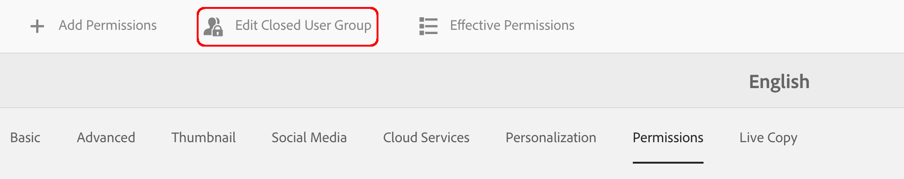

# Creación de un grupo de usuarios cerrado{#creating-a-closed-user-group}

Los grupos cerrados de usuarios (CUG) se utilizan para limitar el acceso a páginas específicas que residen en un sitio de Internet publicado. Estas páginas requieren que los miembros asignados inicien sesión y proporcionen credenciales de seguridad.

Para configurar un área de este tipo dentro del sitio web, debe:

* [crear el grupo de usuarios cerrado real y asignar miembros](#creating-the-user-group-to-be-used).

* [aplicar este grupo a las páginas requeridas](#applying-your-closed-user-group-to-content-pages) y seleccione (o cree) la página de inicio de sesión para que la utilicen los miembros del CUG; también se especifica al aplicar un CUG a una página de contenido.

* [crear un vínculo, de algún tipo, al menos a una página dentro del área protegida](#linking-to-the-cug-pages), de lo contrario, no será visible.

* [configurar Dispatcher](#configure-dispatcher-for-cugs) en uso.

>[!CAUTION]
>
>Los grupos de usuarios cerrados (CUG) siempre deben crearse teniendo en cuenta el rendimiento.
>
>Aunque el número de usuarios y grupos de un CUG no es limitado, un número elevado de CUG en una página puede ralentizar el rendimiento del procesamiento.
>
>El impacto de los CUG siempre debe tenerse en cuenta al realizar pruebas de rendimiento.

## Creación Del Grupo De Usuarios A Utilizar {#creating-the-user-group-to-be-used}

Para crear un grupo de usuarios cerrado:

1. Ir a **Herramientas - Seguridad** AEM desde la pantalla de inicio de la.

   >[!NOTE]
   >
   >Consulte [Administración de usuarios y grupos](/help/sites-administering/security.md#managing-users-and-groups) para obtener información completa sobre la creación y configuración de usuarios y grupos.

1. Seleccione el **Grupos** de la siguiente pantalla.

   

1. Pulse el botón **Crear** en la esquina superior derecha, para crear un nuevo grupo.
1. Asigne un nombre al nuevo grupo. Por ejemplo, `cug_access`.

   

1. Vaya a la **Miembros** y asigne los usuarios necesarios a este grupo.

   

1. Active los usuarios que haya asignado a su CUG; en este caso, todos los miembros de `cug_access`.
1. Activar el grupo de usuarios cerrado para que esté disponible en el entorno de publicación; en este ejemplo, `cug_access`.

## Aplicación Del Grupo De Usuarios Cerrado A Las Páginas De Contenido {#applying-your-closed-user-group-to-content-pages}

Para aplicar el CUG a una o varias páginas:

1. Navegue hasta la página raíz de la sección restringida que desee asignar al CUG.
1. Seleccione la página haciendo clic en su miniatura y seleccionando **Propiedades** en la barra de herramientas superior.

   

1. En la siguiente ventana, abra el **Avanzadas** pestaña.

1. Desplácese hacia abajo hasta el **Requisito de autenticación** sección.

   1. Activar el **Activar** tickbox.

   1. Añada la ruta a su **Página de inicio**.
Es opcional; si se deja en blanco, se utilizará la página de inicio de sesión estándar.

   

1. A continuación, vaya a **Permisos** y seleccione **Editar grupo de usuarios cerrado**.

   

   >[!NOTE]
   >
   >Los CUG de la pestaña Permisos no se pueden desplegar en Live Copies desde modelos. Tenga en cuenta esto al configurar Live Copy.
   >
   >Para obtener más información, consulte [esta página](closed-user-groups.md#aem-livecopy).

1. El **Editar grupo de usuarios cerrado** se abrirá. Aquí puede buscar y seleccionar su CUG y confirmar la selección del grupo con **Guardar**.

   El grupo se agregará a la lista; por ejemplo, el grupo **cug_access**.

   

1. Confirme los cambios con **Guardar y cerrar**.

>[!NOTE]
>
>Consulte [Identity Management](/help/sites-administering/identity-management.md) para obtener información sobre los perfiles en el entorno de publicación y proporcionar formularios para iniciar y cerrar sesión.

## Vinculación a las páginas de CUG {#linking-to-the-cug-pages}

Dado que el usuario anónimo no puede ver el destino de los vínculos a las páginas del CUG, el verificador de vínculos eliminará dichos vínculos.

Para evitarlo, es aconsejable crear páginas de redireccionamiento no protegidas que apunten a páginas dentro del área de CUG. A continuación, las entradas de navegación se representan sin que el verificador de vínculos tenga problemas. Solo al acceder realmente a la página de redireccionamiento se redirige al usuario dentro del área de CUG, después de proporcionar correctamente sus credenciales de inicio de sesión.

## Configurar Dispatcher para CUG {#configure-dispatcher-for-cugs}

Si utiliza Dispatcher, debe definir una granja de Dispatcher con las siguientes propiedades:

* [virtualhosts](https://experienceleague.adobe.com/docs/experience-manager-dispatcher/using/configuring/dispatcher-configuration.html?lang=en#identifying-virtual-hosts-virtualhosts): Coincide con la ruta a las páginas a las que se aplica el CUG.
* \sessionmanagement: consulte la información siguiente.
* [escondrijo](https://experienceleague.adobe.com/docs/experience-manager-dispatcher/using/configuring/dispatcher-configuration.html?lang=en#configuring-the-dispatcher-cache-cache): Un directorio de caché dedicado a los archivos a los que se aplica el CUG.

### Configuración de la administración de sesiones de Dispatcher para CUG {#configuring-dispatcher-session-management-for-cugs}

Configurar [administración de sesiones en el archivo dispatcher.any](https://experienceleague.adobe.com/docs/experience-manager-dispatcher/using/configuring/dispatcher-configuration.html?lang=en#enabling-secure-sessions-sessionmanagement) para el CUG. El controlador de autenticación que se utiliza cuando se solicita acceso para páginas de CUG determina cómo se configura la administración de sesiones.

```xml
/sessionmanagement
    ...
    /header "Cookie:login-token"
    ...
```

>[!NOTE]
>
>Cuando una granja de Dispatcher tiene habilitada la administración de sesiones, todas las páginas que administra la granja no se almacenan en caché. Para almacenar en caché las páginas que están fuera de CUG, cree una segunda granja en dispatcher.any
>que gestiona las páginas que no son de CUG.

1. Configurar [/sessionmanagement](https://experienceleague.adobe.com/docs/experience-manager-dispatcher/using/configuring/dispatcher-configuration.html?lang=en#enabling-secure-sessions-sessionmanagement) al definir `/directory`; por ejemplo:

   ```xml
   /sessionmanagement
     {
     /directory "/usr/local/apache/.sessions"
     ...
     }
   ```

1. Establecer [/allowAuthorized](https://experienceleague.adobe.com/docs/experience-manager-dispatcher/using/configuring/dispatcher-configuration.html?lang=en#caching-when-authentication-is-used) hasta `0`.
