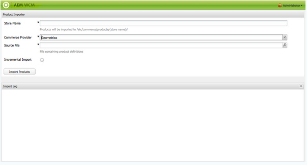

# Tableros{#dashboards}

Al utilizar AEM, podrá administrar mucho contenido de distintos tipos (p. ej. páginas, recursos). Los tableros AEM permiten definir páginas que muestran datos consolidados de forma fácil y personalizable.

>[!NOTE]
>
>Los tableros AEM se crean para cada usuario, para que cada uno pueda acceder a su propio tablero.
>
>However, [Dashboard templates](#creating-a-dashboard-template) can be used to share common configuration and Dashboard layout.



## Administración de tableros {#administering-dashboards}

### Creación de un tablero {#creating-a-dashboard}

Para crear un tablero nuevo, realice las acciones siguientes:

1. En la sección **Herramientas**, haga clic en **Consola de configuración**.
1. In the tree, Double-Click **Dashboard**.
1. Haga clic en **Nuevo tablero**.
1. Especifique el **Título** (p. ej. Mi tablero) y el **Nombre**.
1. Haga clic en **Crear**.

### Clonación de un tablero {#cloning-a-dashboard}

Es posible que quiera tener varios tableros para ver información sobre el contenido en distintas vistas con rapidez. Para ayudarle a crear un tablero nuevo, AEM dispone de una función de clonación que puede utilizar para duplicar un tablero existente. Para clonar un tablero, haga lo siguiente:

1. En la sección **Herramientas**, haga clic en **Consola de configuración**.

1. En el árbol, haga clic en **Panel**.
1. Haga clic en el tablero que desee clonar.

1. Haga clic en **Clonar**.

1. Especifique el **Nombre** del nuevo tablero.

### Eliminación de un tablero {#removing-a-dashboard}

1. En la sección **Herramientas**, haga clic en **Consola de configuración**.

1. En el árbol, haga clic en **Panel**.
1. Haga clic en el tablero que desee eliminar.

1. Haga clic en **Quitar**.

1. Haga clic en **Sí** para confirmar.

## Componentes del tablero {#dashboard-components}

### Información general {#overview}

Los componentes de tablero no son más que componentes [normales de](/help/sites-developing/developing-components-samples.md)AEM. En esta sección se describen los componentes de informe que se envían con AEM.

### Componentes de informes analíticos web {#web-analytics-reporting-components}

AEM incluye un conjunto de componentes que procesan varias métricas de los datos de [SiteCatalyst](/help/sites-administering/adobeanalytics.md) . Estos componentes se enumeran en la barra de tareas de la sección **Tablero**.

Cada componente de informe dispone de tres fichas como mínimo:

* **Básico**: contiene la configuración principal.

* **Informe:** contiene la configuración específica de cada informe.
* **Estilo**: contiene configuración de estilo como márgenes y tamaños de gráficos.

Los componentes de informe se inician con una configuración predeterminada que le ayuda a configurar el tablero con rapidez.

#### Configuración básica {#basic-configuration}

La ficha **Básico** permite acceder a las entradas de configuración siguientes:

**Título** El título que se muestra en el tablero.

**Tipo** de solicitud El modo en que se solicitan los datos.

**Configuración de SiteCatalyst (opcional)** La configuración que desea utilizar para conectarse a SiteCatalyst. Si no se define, se asumirá que ya está configurada en la página Panel (mediante las propiedades de página).

**ID del grupo de informes (opcional)** El grupo de informes de SiteCatalyst que desea utilizar para generar el gráfico.

#### Configuración de informes {#report-configuration}

Para mostrar las estadísticas de web, debe definir el intervalo de fechas para los datos que desee recopilar. La ficha **Informe** dispone de dos campos para definir dicho intervalo.

>[!NOTE]
>
>Si se elige un intervalo de fechas muy grande, se reducirá el nivel de respuesta del tablero.

**Fecha a partir** de la fecha absoluta o relativa desde la cual se recuperan los datos.

**Fecha hasta** la fecha absoluta o relativa a la que se recuperan los datos.

Cada componente también define ajustes específicos.

#### Informe de tiempo extra {#overtime-report}


**Granularidad** de fecha Unidad de tiempo del eje X (por ejemplo: día, hora).

**Métricas** La lista de eventos que desea mostrar.

**Elementos** Lista de elementos que desglosa los datos de métricas en el gráfico.

#### Informe de lista clasificada {#ranked-list-report}


**Elementos** El elemento que desglosa los datos de métricas en el gráfico.

**Métricas** El evento que desea mostrar.

**No. de elementos** principales Número de elementos mostrados por el informe.

#### Informe clasificado {#ranked-report}


**Métricas** El evento que desea mostrar.

**Elementos** El elemento que desglosa los datos de métricas en el gráfico.

#### Informe de sección de sitio principal {#top-site-section-report}

Este componente muestra un gráfico sobre la sección más visitada del sitio web según la configuración siguiente.


**No. de los elementos** principales Número de sección que se muestra en el informe.

#### Informe de tendencias {#trended-report}


**Granularidad** de fecha Unidad de tiempo del eje X (por ejemplo: día, hora).

**Métricas** El evento que desea mostrar.

**Elementos** El elemento que desglosa los datos de métricas en el gráfico.

## Ampliación del tablero {#extending-dashboard}

### Información general {#overview-1}

Los tableros son páginas normales (`cq:Page`), por lo que puede utilizarse cualquier componente para crearlos.

There is a default component group `Dashboard` containing analytics reporting components which are enabled on the template by default.

### Creación de una plantilla de tablero {#creating-a-dashboard-template}

Una plantilla define el contenido predeterminado de un tablero nuevo. Puede utilizar varias plantillas para crear diferentes tipos de tableros.

Dashboard templates are created like other page templates, except that they are stored under `/libs/cq/dashboards/templates/`. Consulte la sección [Creación de plantillas](/help/sites-developing/website.md#creating-the-contentpage-template) de página de contenido.

>[!NOTE]
>
>Las plantillas de tablero se comparten entre usuarios.

### Desarrollo de un componente de tablero {#developing-a-dashboard-component}

El desarrollo de un componente de tablero consiste en la creación de un componente de AEM normal. En esta sección se describe un ejemplo de un componente que muestra los 10 colaboradores principales.


The top author components is stored in the repository at `/apps/geometrixx-outdoors/components/reporting` and is composed of :

1. un archivo `jsp` que lee datos jcr y define el marcador de posición `html`.

1. una biblioteca de cliente que contiene un archivo `js` que recopila y ordena los datos y rellena el marcador de posición `html`.


El siguiente archivo Javascript se define en la Biblioteca `geout.reporting.topauthors` de [](/help/sites-developing/clientlibs.md) clientes como un elemento secundario del propio componente.

El [QueryBuilder](/help/sites-developing/querybuilder-api.md) se utiliza para consultar el repositorio para leer `cq:AuditEvent` nodos. El resultado de la consulta es un objeto JSON desde el que se extraen las contribuciones de autor.

#### top_author.js {#top-authors-js}

```
$.ajax({
  url: "/bin/querybuilder.json",
  cache: false,
  data: {
       "orderby": "cq:time",
       "orderby.sort": "desc",
       "p.hits": "full",
       "p.limit": 100,
       "path": "/var/audit/com.day.cq.wcm.core.page/",
       "type": "cq:AuditEvent"
   },
  dataType: "json"
}).done(function( res ) {
    var authors = {};
    // from JSON to Object
    for(var r in res.hits) {
        var userId = res.hits[r].userId;
        if(userId == undefined) {
            continue;
        }
        var auth = authors[userId] || {userId : userId};
        auth.contrib = (auth.contrib || 0) +1;

        authors[userId] = auth;
    }

    // order by contribution
    var orderedByContrib = [];
    for(var a in authors) {
        orderedByContrib.push(authors[a]);
    }
    orderedByContrib.sort(function(a,b){return b.contrib - a.contrib});

    // produce the list
    for (var i=0, tot=orderedByContrib.length; i < tot; i++) {
        var current = orderedByContrib[i];
        $("<div> #" + (i + 1) +" "+ current.userId + " (" + current.contrib +" contrib.)</div>").appendTo("#authors-list");

    }
});
```

El `JSP` incluye `global.jsp` y `clientlib`.

#### top_author.jsp {#top-authors-jsp}

```java
<%@page session="false" contentType="text/html; charset=utf-8" %><%
%><%
%><%@include file="/libs/foundation/global.jsp" %><%
%>
<ui:includeClientLib categories="geout.reporting.topauthors" />
<%
String reportletTitle = properties.get("title", "Top Authors");
%>
<html>
     <h3><%=xssAPI.encodeForHTML(reportletTitle) %></h3>
     <div id="authors-list"></div>
</html>
```

