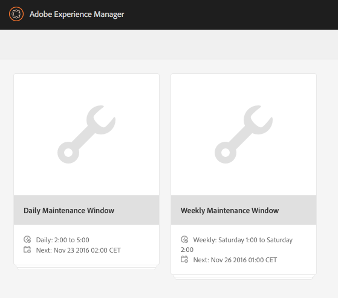

# Recolección de papelera del almacén de datos {#data-store-garbage-collection}

Cuando se elimina un recurso WCM convencional, la referencia al registro del almacén de datos subyacente puede eliminarse de la jerarquía de nodos, pero el registro del almacén de datos en sí permanece. Este registro de almacén de datos sin referencia se convierte en &quot;basura&quot; que no es necesario conservar. En los casos en los que existen varios recursos no utilizados, es beneficioso deshacerse de ellos para conservar el espacio y optimizar el performance del backup y el mantenimiento del filesystem.

En su mayor parte, una aplicación WCM tiende a recopilar información pero no a eliminarla casi con la misma frecuencia. Aunque se añaden nuevas imágenes, e incluso se reemplazan las versiones anteriores, el sistema de control de versiones conserva la antigua y admite la reversión si es necesario. Por lo tanto, la mayoría del contenido que pensamos que se agrega al sistema se almacena de forma permanente. Entonces, ¿cuál es la fuente típica de &quot;basura&quot; en el repositorio que quizás queramos limpiar?

AEM utiliza el repositorio como almacenamiento para una serie de actividades internas y de mantenimiento:

* Paquetes creados y descargados
* Archivos temporales creados para la replicación de publicación
* Cargas de trabajo
* Recursos creados temporalmente durante la representación DAM

Cuando alguno de estos objetos temporales es lo suficientemente grande como para requerir almacenamiento en el almacén de datos, y cuando el objeto termina de usarse, el registro del almacén de datos en sí mismo permanece como &quot;basura&quot;. En una aplicación típica de publicación/autor de WCM, la fuente más grande de elementos no utilizados de este tipo suele ser el proceso de activación de publicación. Cuando los datos se replican en Publicar, se recopilan primero en colecciones con un formato de datos eficiente denominado &quot;Durbo&quot; y se almacenan en el repositorio en `/var/replication/data`. Los paquetes de datos suelen ser más grandes que el umbral de tamaño crítico para el almacén de datos y, por lo tanto, terminan almacenados como registros del almacén de datos. Cuando se completa la replicación, se elimina el nodo de `/var/replication/data`, pero el registro del almacén de datos permanece como &quot;basura&quot;.

Otra fuente de basura recuperable son los paquetes. Los datos del paquete, como todo lo demás, se almacenan en el repositorio y, por tanto, en paquetes de más de 4 KB, en el almacén de datos. En el curso de un proyecto de desarrollo o en el transcurso del tiempo, mientras se mantiene un sistema, los paquetes se pueden crear y reconstruir muchas veces, cada compilación resulta en un nuevo registro de almacén de datos, lo que deja sin efecto el registro de la compilación anterior.

## ¿Cómo funciona la recopilación de elementos no utilizados en el almacén de datos? {#how-does-data-store-garbage-collection-work}

Si el repositorio se ha configurado con un almacén de datos externo, la recopilación de elementos no utilizados del almacén de datos [se ejecutará automáticamente](/help/sites-administering/data-store-garbage-collection.md#automating-data-store-garbage-collection) como parte de la ventana de mantenimiento semanal. El administrador del sistema también puede [ejecutar manualmente la recopilación de elementos no utilizados del almacén de datos](#running-data-store-garbage-collection) según sea necesario. En general, se recomienda que la recogida de datos no utilizados del almacén de datos se realice periódicamente, pero que se tengan en cuenta los siguientes factores al planificar las colecciones de datos no utilizados del almacén de datos:

* Las colecciones de elementos no utilizados del almacén de datos tardan un tiempo y pueden afectar al rendimiento, por lo que deben planificarse en consecuencia.
* La eliminación de los registros de elementos no utilizados del almacén de datos no afecta al rendimiento normal, por lo que no se trata de una optimización del rendimiento.
* Si la utilización de almacenamientos y factores relacionados como los tiempos de backup no son un problema, la recopilación de datos no utilizados del almacén de datos podría diferirse de forma segura.

El recolector de elementos no utilizados del almacén de datos toma nota por primera vez de la marca de tiempo actual cuando comienza el proceso. A continuación, la colección se lleva a cabo mediante un algoritmo de patrón de marcas/barrido de varios pasos.

En la primera fase, el recolector de elementos no utilizados del almacén de datos realiza una transversal completa de todo el contenido del repositorio. Para cada objeto de contenido que tiene una referencia a un registro del almacén de datos, localizó el archivo en el sistema de archivos, realizando una actualización de metadatos: modificando el atributo &quot;última modificación&quot; o MTIME. En este punto, los archivos a los que se accede mediante esta fase pasan a ser más recientes que la marca de tiempo inicial.

En la segunda fase, el recolector de elementos no utilizados del almacén de datos atraviesa la estructura de directorios físicos del almacén de datos de la misma manera que una &quot;búsqueda&quot;. Examinó el atributo &quot;last modified&quot; o MTIME del archivo y realiza la siguiente determinación:

* Si MTIME es más reciente que la marca de tiempo de la línea base inicial, el archivo se encontró en la primera fase o es un archivo completamente nuevo que se agregó al repositorio mientras el proceso de recopilación estaba en curso. En cualquiera de estos casos, se considerará que el expediente está activo y no se eliminará.
* Si MTIME es anterior a la marca de tiempo de la línea base inicial, el archivo no es un archivo al que se hace referencia activamente y se considera un archivo no deseado extraíble.

Este método funciona bien para un solo nodo con un almacén de datos privado. Sin embargo, el almacén de datos puede compartirse y, si es así, las referencias activas potencialmente activas a los registros del almacén de datos de otros repositorios no se comprueban y los archivos con referencia activos pueden eliminarse por error. Es imperativo que el administrador del sistema comprenda la naturaleza compartida del almacén de datos antes de planificar cualquier recolección de elementos no utilizados y utilice únicamente el proceso de recopilación de elementos no utilizados del almacén de datos integrado cuando se sepa que no se comparte el almacén de datos.

>[!NOTE]
>
>Al realizar la recopilación de elementos no utilizados en una configuración de almacén de datos agrupados o compartidos (con Mongo o Segment Tar), el registro puede mostrar advertencias sobre la imposibilidad de eliminar determinados identificadores de blob. Esto sucede porque otros clústeres o nodos compartidos que no tienen información sobre las eliminaciones de ID vuelven a hacer referencia a los ID de blob eliminados en una colección de elementos no utilizados anterior. Como resultado, cuando se realiza la recolección de elementos no utilizados, registra una advertencia cuando intenta eliminar un ID que ya se eliminó en la última ejecución. Este comportamiento no afecta al rendimiento ni a la funcionalidad.

## Ejecución de la recopilación de elementos no utilizados del almacén de datos {#running-data-store-garbage-collection}

Existen tres formas de ejecutar la recopilación de elementos no utilizados en el almacén de datos, según la configuración del almacén de datos en la que AEM se esté ejecutando:

1. Mediante [Revision Cleanup](/help/sites-deploying/revision-cleanup.md) - un mecanismo de recolección de elementos no utilizados que se utiliza normalmente para la limpieza del almacén de nodos.

1. Mediante [Recopilación de elementos no utilizados del almacén de datos](/help/sites-administering/data-store-garbage-collection.md#running-data-store-garbage-collection-via-the-operations-dashboard), un mecanismo de recopilación de datos no utilizados específico para almacenes de datos externos, disponible en el Panel de operaciones.
1. Mediante la [Consola JMX](/help/sites-administering/jmx-console.md).

Si se utiliza TarMK como almacén de nodos y almacén de datos, la limpieza de revisión se puede utilizar para la recopilación de elementos no utilizados del almacén de nodos y del almacén de datos. Sin embargo, si se configura un almacén de datos externo, como el almacén de datos del sistema de archivos, la recopilación de elementos no utilizados del almacén de datos debe activarse explícitamente de forma independiente de la limpieza de revisión. La recolección de elementos no utilizados del almacén de datos se puede activar mediante el Panel de operaciones o la consola JMX.

La tabla siguiente muestra el tipo de recopilación de datos innecesarios del almacén de datos para todas las implementaciones de almacén de datos admitidas en la AEM 6:

<table>
 <tbody>
  <tr>
   <td><strong>Almacenamiento de nodos</strong><br /> </td>
   <td><strong>Almacén de datos</strong></td>
   <td><strong>Mecanismo de recolección de basura</strong><br /> </td>
  </tr>
  <tr>
   <td>TarMK</td>
   <td>TarMK</td>
   <td>Limpieza de revisión (los binarios están alineados con el almacén de segmentos)</td>
  </tr>
  <tr>
   <td>TarMK</td>
   <td>Sistema de archivos externo</td>
   <td><p>Tarea de recolección de elementos no utilizados del almacén de datos mediante el Panel de operaciones</p> <p>Consola JMX</p> </td>
  </tr>
  <tr>
   <td>MongoDB</td>
   <td>MongoDB</td>
   <td><p>Tarea de recolección de elementos no utilizados del almacén de datos mediante el Panel de operaciones</p> <p>Consola JMX</p> </td>
  </tr>
  <tr>
   <td>MongoDB</td>
   <td>Sistema de archivos externo</td>
   <td><p>Tarea de recolección de elementos no utilizados del almacén de datos mediante el Panel de operaciones</p> <p>Consola JMX</p> </td>
  </tr>
 </tbody>
</table>

### Ejecución de la recolección de elementos no utilizados del almacén de datos mediante el Panel de operaciones {#running-data-store-garbage-collection-via-the-operations-dashboard}

La ventana de mantenimiento semanal integrada, disponible a través del [Panel de operaciones](/help/sites-administering/operations-dashboard.md), contiene una tarea integrada para el déclencheur de la recopilación de elementos no utilizados del almacén de datos a la 1 am los domingos.

Si necesita ejecutar la recopilación de elementos no utilizados del almacén de datos fuera de este tiempo, puede activarse manualmente mediante el Panel de operaciones.

Antes de ejecutar la recopilación de elementos no utilizados del almacén de datos, debe comprobar que no se está ejecutando ninguna copia de seguridad en ese momento.

1. Abra el Panel Operaciones **Navegación** -> **Herramientas** -> **Operaciones** -> **Mantenimiento**.
1. Toque o haga clic en la **Ventana de mantenimiento semanal**.

   

1. Seleccione la tarea **Recopilación de elementos no utilizados del almacén de datos** y, a continuación, toque o haga clic en el icono **Ejecutar**.

   

1. La recopilación de elementos no utilizados del almacén de datos se ejecuta y su estado se muestra en el panel.

   

>[!NOTE]
>
>La tarea Recopilación de elementos no utilizados del almacén de datos solo estará visible si ha configurado un almacén de datos de archivos externo. Consulte [Configuración de almacenes de nodos y almacenes de datos en AEM 6](/help/sites-deploying/data-store-config.md#file-data-store) para obtener información sobre cómo configurar un almacén de datos de archivos.

### Ejecución de la colección de elementos no utilizados del almacén de datos mediante la consola de JMX {#running-data-store-garbage-collection-via-the-jmx-console}

En esta sección se trata de ejecutar manualmente la recopilación de elementos no utilizados del almacén de datos mediante la consola JMX. Si la instalación se configura sin un almacén de datos externo, esto no se aplica a la instalación. En su lugar, consulte las instrucciones sobre cómo ejecutar Revision Cleup en [Mantenimiento del repositorio](/help/sites-deploying/storage-elements-in-aem-6.md#maintaining-the-repository).

>[!NOTE]
>
>Si está ejecutando TarMK con un almacén de datos externo, es necesario que ejecute Revision Cleanup primero para que la recolección de elementos no utilizados sea efectiva.

Para ejecutar la recolección de elementos no utilizados:

1. En la consola de administración Apache Felix OSGi, resalte la ficha **Main** y seleccione **JMX** en el siguiente menú.
1. A continuación, busque y haga clic en el **MBean del Administrador de repositorios** (o vaya a `https://<host>:<port>/system/console/jmx/org.apache.jackrabbit.oak%3Aname%3Drepository+manager%2Ctype%3DRepositoryManagement`).
1. Haga clic en **startDataStoreGC(boolean markOnly)**.
1. escriba &quot;`true`&quot; para el parámetro `markOnly` si es necesario:

   | **Opción** | **Descripción** |
   |---|---|
   | boolean markOnly | Establezca en true para marcar únicamente referencias y no barrer en la operación de marca y barrido. Este modo se utiliza cuando el BlobStore subyacente se comparte entre varios repositorios diferentes. Para todos los demás casos, establezca false para realizar la recolección de elementos no utilizados completa. |

1. Haga clic en **Invocar**. CRX ejecuta la recolección de elementos no utilizados e indica cuándo se completó.

>[!NOTE]
>
>La recopilación de elementos no utilizados del almacén de datos no recopilará los archivos que se hayan eliminado en las últimas 24 horas.

>[!NOTE]
>
>La tarea de recolección de elementos no utilizados del almacén de datos solo se inicio si ha configurado un almacén de datos de archivos externo. Si no se ha configurado un almacén de datos de archivos externo, la tarea devolverá el mensaje `Cannot perform operation: no service of type BlobGCMBean found` después de invocar. Consulte [Configuración de almacenes de nodos y almacenes de datos en AEM 6](/help/sites-deploying/data-store-config.md#file-data-store) para obtener información sobre cómo configurar un almacén de datos de archivos.

## Automatización de la recolección de elementos no utilizados del almacén de datos {#automating-data-store-garbage-collection}

Si es posible, la recopilación de datos no utilizados del almacén de datos debe ejecutarse cuando el sistema tenga poca carga, por ejemplo por la mañana.

La ventana de mantenimiento semanal integrada, disponible a través del [Panel de operaciones](/help/sites-administering/operations-dashboard.md), contiene una tarea integrada para el déclencheur de la recopilación de elementos no utilizados del almacén de datos a la 1 am los domingos. También debe comprobar que no hay copias de seguridad en ejecución en este momento. El inicio de la ventana de mantenimiento se puede personalizar a través del panel según sea necesario.

>[!NOTE]
>
>La razón para no ejecutarlo al mismo tiempo es que también se realiza una copia de seguridad de los archivos antiguos (y no utilizados) del almacén de datos, de modo que si es necesario volver a una revisión anterior, los archivos binarios aún se encuentran en la copia de seguridad.

Si no desea ejecutar la recopilación de elementos no utilizados del almacén de datos con la ventana de mantenimiento semanal en el Panel de operaciones, también puede automatizarse con los clientes HTTP wget o curl. A continuación se muestra un ejemplo de cómo automatizar el backup mediante curl:

>[!CAUTION]
>
>En el siguiente ejemplo comandos `curl` es posible que sea necesario configurar varios parámetros para la instancia; por ejemplo, el nombre de host ( `localhost`), el puerto ( `4502`), la contraseña de administración ( `xyz`) y varios parámetros para la recopilación de elementos no utilizados del almacén de datos real.

A continuación se muestra un comando curl de ejemplo para invocar la recolección de elementos no utilizados del almacén de datos mediante la línea de comandos:

```shell
curl -u admin:admin -X POST --data markOnly=true  https://localhost:4503/system/console/jmx/org.apache.jackrabbit.oak"%"3Aname"%"3Drepository+manager"%"2Ctype"%"3DRepositoryManagement/op/startDataStoreGC/boolean
```

El comando curl se devuelve inmediatamente.

## Comprobando la coherencia del almacén de datos {#checking-data-store-consistency}

La comprobación de coherencia del almacén de datos informará de todos los binarios del almacén de datos que faltan pero a los que se sigue haciendo referencia. Para inicio de una comprobación de coherencia, siga estos pasos:

1. Vaya a la consola JMX. Para obtener información sobre cómo utilizar la consola JMX, consulte [este artículo](/help/sites-administering/jmx-console.md#using-the-jmx-console).
1. Busque el **granoBlobGarbageCollection** y haga clic en él.
1. Haga clic en el vínculo `checkConsistency()`.

Una vez que se haya completado la comprobación de coherencia, un mensaje mostrará el número de binarios que faltan. Si el número es bueno a 0, consulte `error.log` para obtener más detalles sobre los binarios que faltan.

A continuación encontrará un ejemplo de cómo se informan los binarios que faltan en los registros:

```xml
11:32:39.673 INFO [main] MarkSweepGarbageCollector.java:600 Consistency check found [1] missing blobs
```

```xml
11:32:39.673 WARN [main] MarkSweepGarbageCollector.java:602 Consistency check failure intheblob store : DataStore backed BlobStore [org.apache.jackrabbit.oak.plugins.blob.datastore.OakFileDataStore], check missing candidates in file /tmp/gcworkdir-1467352959243/gccand-1467352959243
```

