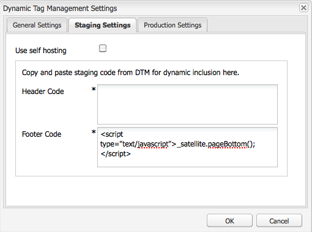
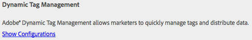
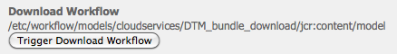

# Integración con la administración dinámica de etiquetas de Adobe {#integrating-with-adobe-dynamic-tag-management}

Integre [Administración dinámica de etiquetas de Adobe](https://www.adobe.com/solutions/digital-marketing/dynamic-tag-management.html) con AEM para que pueda utilizar las propiedades web de la administración dinámica de etiquetas para rastrear AEM sitios. La administración dinámica de etiquetas permite a los especialistas en marketing administrar etiquetas para recopilar datos y distribuir datos entre sistemas de marketing digital. Por ejemplo, utilice la administración dinámica de etiquetas para recopilar datos de uso para su sitio web AEM y distribuir los datos para su análisis en Adobe Analytics o Adobe Target.

Antes de realizar la integración, debe crear la propiedad web [de Administración dinámica de etiquetas](https://microsite.omniture.com/t2/help/en_US/dtm/#Web_Properties) que rastrea el dominio del sitio AEM. Las [opciones de alojamiento](https://microsite.omniture.com/t2/help/en_US/dtm/#Hosting__Embed_Tab) de la propiedad web deben configurarse para que pueda configurar AEM para acceder a las bibliotecas de administración dinámica de etiquetas.

Después de configurar la integración, los cambios en las reglas y las herramientas de implementación de la administración dinámica de etiquetas no requieren que cambie la configuración de la administración dinámica de etiquetas en AEM. Los cambios están disponibles automáticamente para AEM.

>[!NOTE]
>
>Si utiliza la DTM con una configuración proxy personalizada, debe configurar ambas configuraciones proxy del cliente HTTP, ya que algunas funcionalidades de AEM utilizan las API 3.x y otras las API 4.x:
>
>* 3.x está configurado con [http://localhost:4502/system/console/configMgr/com.day.commons.httpclient](http://localhost:4502/system/console/configMgr/com.day.commons.httpclient)
>* 4.x está configurado con [http://localhost:4502/system/console/configMgr/org.apache.http.proxyconfigurator](http://localhost:4502/system/console/configMgr/org.apache.http.proxyconfigurator)

>

## Opciones de implementación {#deployment-options}

Las siguientes opciones de implementación afectan la configuración de la integración con la administración dinámica de etiquetas.

### Alojamiento de la administración dinámica de etiquetas {#dynamic-tag-management-hosting}

AEM admite la administración dinámica de etiquetas que está alojada en la nube o en AEM.

* Alojado en la nube: Las bibliotecas de javascript de la administración dinámica de etiquetas se almacenan en la nube y sus páginas de AEM hacen referencia a ellas directamente.
* AEM alojados: La administración dinámica de etiquetas genera bibliotecas de javascript. AEM utiliza un modelo de flujo de trabajo para obtener e instalar las bibliotecas.

El tipo de alojamiento que utiliza la implementación determina algunas de las tareas de configuración e implementación que realiza. Para obtener más información sobre las opciones de alojamiento, consulte [Alojamiento - Ficha Insertar](https://microsite.omniture.com/t2/help/en_US/dtm/#Hosting__Embed_Tab) en la Ayuda de la administración dinámica de etiquetas.

### Biblioteca de ensayo y producción {#staging-and-production-library}

Decida si la instancia de creación de AEM utiliza el ensayo o el código de producción de la administración dinámica de etiquetas.

Normalmente, la instancia de autor utiliza las bibliotecas de ensayo de la administración dinámica de etiquetas y la instancia de producción utiliza las bibliotecas de producción. Este escenario le permite utilizar la instancia de autor para probar las configuraciones de la administración dinámica de etiquetas no aprobadas.

Si lo desea, la instancia de creación puede utilizar las bibliotecas de producción. Los complementos del explorador Web están disponibles y permiten cambiar entre el uso de bibliotecas de ensayo para fines de prueba cuando las bibliotecas están alojadas en la nube.

### Uso del enlace de implementación de la administración dinámica de etiquetas {#using-the-dynamic-tag-management-deployment-hook}

Cuando AEM hospeda las bibliotecas de la administración dinámica de etiquetas, puede utilizar el servicio de enlace de implementación de la administración dinámica de etiquetas para insertar automáticamente las actualizaciones de biblioteca en AEM. Las actualizaciones de biblioteca se insertan cuando se realizan cambios en las bibliotecas, como cuando se editan las propiedades web de la administración dinámica de etiquetas.

Para utilizar el enlace de implementación, la administración dinámica de etiquetas debe poder conectarse a la instancia de AEM que aloja las bibliotecas. Debe [habilitar el acceso a AEM](/help/sites-administering/dtm.md#enabling-access-for-the-deployment-hook-service) para los servidores de administración dinámica de etiquetas.

En algunas circunstancias AEM puede ser inaccesible, como cuando AEM detrás de un servidor de seguridad. En estos casos, puede utilizar la opción del importador de encuestas de AEM para recuperar periódicamente las bibliotecas. Una expresión de trabajo cron dicta la programación de descargas de biblioteca.

## Habilitación del acceso para el servicio de enlace de implementación {#enabling-access-for-the-deployment-hook-service}

Active el servicio de enlace de implementación de la administración dinámica de etiquetas para acceder a AEM y que el servicio pueda actualizar las bibliotecas alojadas en AEM. Especifique la dirección IP de los servidores de administración dinámica de etiquetas que actualizan las bibliotecas de ensayo y producción según sea necesario:

* Ensayo: `107.21.99.31`
* Producción: `23.23.225.112` y `204.236.240.48`

Realice la configuración mediante el nodo [Consola web](/help/sites-deploying/configuring-osgi.md#osgi-configuration-with-the-web-console) o [`sling:OsgiConfig`](/help/sites-deploying/configuring-osgi.md#osgi-configuration-in-the-repository):

* En la consola web, utilice el elemento de configuración del enlace de implementación de DTM de Adobe en la página de configuración.
* Para una configuración OSGi, el PID de servicio es `com.adobe.cq.dtm.impl.servlets.DTMDeployHookServlet`.

En la tabla siguiente se describen las propiedades que se van a configurar.

| Propiedad de la consola web | OSGi, propiedad | Descripción |
|---|---|---|
| Lista de blanco de DTM de ensayo | `dtm.staging.ip.whitelist` | La dirección IP del servidor de administración dinámica de etiquetas que actualiza las bibliotecas de ensayo. |
| Lista de blancos de DTM de producción | `dtm.production.ip.whitelist` | La dirección IP del servidor de administración dinámica de etiquetas que actualiza las bibliotecas de producción. |

## Creación de la configuración de la administración dinámica de etiquetas {#creating-the-dynamic-tag-management-configuration}

Cree una configuración de nube para que la instancia de AEM pueda autenticarse con la administración dinámica de etiquetas e interactuar con la propiedad web.

>[!NOTE]
>
>Evite la inclusión de dos códigos de seguimiento de Adobe Analytics en las páginas cuando la propiedad web de la DTM incluya la herramienta Adobe Analytics y también utilice [Content Insight](/help/sites-authoring/content-insights.md). En la [configuración de nube de Adobe Analytics](/help/sites-administering/adobeanalytics-connect.md#configuring-the-connection-to-adobe-analytics), seleccione la opción No incluir código de seguimiento.

### Configuración general {#general-settings}

<table>
 <tbody>
  <tr>
   <th>Propiedad</th>
   <th>Descripción</th>
  </tr>
  <tr>
   <td>Testigo API</td>
   <td>El valor de la propiedad Token de API de la cuenta de usuario de la administración dinámica de etiquetas. AEM utiliza esta propiedad para autenticarse con la administración dinámica de etiquetas.</td>
  </tr>
  <tr>
   <td>Empresa</td>
   <td>La compañía con la que está asociada su ID de inicio de sesión.</td>
  </tr>
  <tr>
   <td>Propiedad</td>
   <td>Nombre de la propiedad web que creó para administrar las etiquetas de su sitio AEM.</td>
  </tr>
  <tr>
   <td>Incluir el código de producción en el campo Autor</td>
   <td>
Seleccione esta opción para que el autor de AEM y las instancias de publicación utilicen la versión de producción de las bibliotecas de la administración dinámica de etiquetas. 
 
Cuando esta opción no está seleccionada, la configuración de ensayo se aplica a la instancia de autor y la configuración de producción se aplica a la instancia de publicación.
 </td>
  </tr>
 </tbody>
</table>

### Propiedades de autoalojamiento: ensayo y producción {#self-hosting-properties-staging-and-production}

Las siguientes propiedades de la configuración de la administración dinámica de etiquetas permiten AEM las bibliotecas de la administración dinámica de etiquetas. Las propiedades permiten a AEM descargar e instalar las bibliotecas. Opcionalmente, puede actualizar automáticamente las bibliotecas para asegurarse de que reflejan los cambios realizados en la aplicación de administración dinámica de etiquetas.

Algunas propiedades utilizan valores que se obtienen de la sección Descarga de biblioteca de la ficha Incrustar de la propiedad web de la administración dinámica de etiquetas. Para obtener más información, consulte [Descarga de biblioteca](https://microsite.omniture.com/t2/help/en_US/dtm/#Library_Download) en la Ayuda de la administración dinámica de etiquetas.

>[!NOTE]
>
>Cuando aloja el paquete de administración dinámica de etiquetas en AEM, la descarga de biblioteca debe habilitarse en la administración dinámica de etiquetas antes de crear la configuración. Además, Akamai debe estar habilitado porque Akamai proporciona las bibliotecas para la descarga.

Al alojar las bibliotecas de la administración dinámica de etiquetas en AEM, AEM configura automáticamente algunas propiedades de la propiedad web según la configuración. Consulte las descripciones de la tabla siguiente.

<table>
 <tbody>
  <tr>
   <th>Propiedad</th>
   <th>Descripción</th>
  </tr>
  <tr>
   <td>Utilizar el alojamiento propio</td>
   <td>Seleccione cuándo aloja el archivo de biblioteca de la administración dinámica de etiquetas en AEM. Si selecciona esta opción, aparecerán las demás propiedades de esta tabla.</td>
  </tr>
  <tr>
   <td>URL del paquete DTM</td>
   <td>Dirección URL que se utilizará para descargar la biblioteca de administración dinámica de etiquetas. Obtenga este valor en la sección Descargar direcciones URL de la página Descarga de biblioteca de la administración dinámica de etiquetas. Por motivos de seguridad, este valor debe configurarse manualmente.</td>
  </tr>
  <tr>
   <td>Flujo de trabajo de descarga</td>
   <td>
El modelo de flujo de trabajo que se va a utilizar para descargar e instalar la biblioteca de la administración dinámica de etiquetas. El modelo predeterminado es Descargar paquete DTM predeterminado. Utilice este modelo a menos que haya creado un modelo personalizado.
 
Tenga en cuenta que el flujo de trabajo de descarga predeterminado activa automáticamente las bibliotecas al descargarlas.
 </td>
  </tr>
  <tr>
   <td>Sugerencia de dominio</td>
   <td>
(Opcional) Dominio del servidor de AEM que aloja la biblioteca de la administración dinámica de etiquetas. Especifique un valor para anular el dominio predeterminado configurado para el servicio <a href="/help/sites-developing/externalizer.md">Externalizador de vínculos de CQ por día</a>.
 
Cuando se conecta a la administración dinámica de etiquetas, AEM utiliza este valor para configurar la ruta HTTP de ensayo o la ruta HTTP de producción de las propiedades de descarga de biblioteca para la propiedad web de la administración dinámica de etiquetas.
 </td>
  </tr>
  <tr>
   <td>Sugerencia de dominio seguro</td>
   <td>
(Opcional) Dominio del servidor de AEM que aloja la biblioteca de la administración dinámica de etiquetas a través de HTTPS. Especifique un valor para anular el dominio predeterminado configurado para el servicio <a href="/help/sites-developing/externalizer.md">Externalizador de vínculos de CQ por día</a>.
 
Cuando está conectado a la administración dinámica de etiquetas, AEM utiliza este valor para configurar la ruta HTTPS de ensayo o la ruta HTTPS de producción de las propiedades de descarga de biblioteca para la propiedad web de la administración dinámica de etiquetas.
 </td>
  </tr>
  <tr>
   <td>Secreto compartido</td>
   <td>
(Opcional) El secreto compartido que se usará para descifrar la descarga. Obtenga este valor en el campo Shared Secret de la página Descarga de biblioteca de la administración dinámica de etiquetas.
 
<strong>Nota:</strong> Debe tener instaladas las bibliotecas   OpenSSL en el equipo en el que está instalado AEM para AEM las bibliotecas descargadas.
 </td>
  </tr>
  <tr>
   <td>Habilitar el importador de encuestas</td>
   <td>
(Opcional) Seleccione esta opción para descargar e instalar periódicamente la biblioteca de administración dinámica de etiquetas para asegurarse de que está utilizando una versión actualizada. Si se selecciona, la administración dinámica de etiquetas no envía solicitudes de POST HTTP a la URL de enlace de implementación.
 
AEM configura automáticamente la propiedad URL de enlace de implementación de las propiedades de descarga de biblioteca para la propiedad web de administración dinámica de etiquetas. Cuando se selecciona, la propiedad se configura sin valor. Si no se selecciona, la propiedad se configura con la dirección URL de la configuración de la administración dinámica de etiquetas.
 
Habilitar importador de encuestas cuando el enlace de implementación de la administración dinámica de etiquetas no se pueda conectar a AEM, por ejemplo cuando AEM está detrás de un servidor de seguridad.
 </td>
  </tr>
  <tr>
   <td>Expresión de programación</td>
   <td>(aparece y es obligatorio cuando se selecciona Habilitar importador de encuestas). Expresión cron que controla cuándo se descargan las bibliotecas de administración dinámica de etiquetas.</td>
  </tr>
 </tbody>
</table>

### Propiedades del alojamiento en la nube - Ensayo y producción {#cloud-hosting-properties-staging-and-production}

Las siguientes propiedades se configuran para la administración dinámica de etiquetas cuando la configuración dinámica de etiquetas está alojada en la nube.

<table>
 <tbody>
  <tr>
   <th>Propiedad</th>
   <th>Descripción</th>
  </tr>
  <tr>
   <td>Utilizar el alojamiento propio</td>
   <td>Borre esta opción cuando el archivo de biblioteca de la administración dinámica de etiquetas esté alojado en la nube.</td>
  </tr>
  <tr>
   <td>Código de encabezado</td>
   <td>
Código de encabezado para ensayo que se obtiene de la administración dinámica de etiquetas para el host. Este valor se rellena automáticamente al conectarse a la administración dinámica de etiquetas.
 
 Para ver el código en la administración dinámica de etiquetas, haga clic en la ficha Insertar y, a continuación, haga clic en el nombre del host. Expanda la sección Código de encabezado y haga clic en el área Copiar código incrustado del código incrustado de ensayo o el área Código incrustado de producción según sea necesario.
 </td>
  </tr>
  <tr>
   <td>Código de pie de página</td>
   <td>
Código de pie de página para ensayo que se obtiene de la administración dinámica de etiquetas para el host. Este valor se rellena automáticamente al conectarse a la administración dinámica de etiquetas.
 
Para ver el código en la administración dinámica de etiquetas, haga clic en la ficha Insertar y, a continuación, haga clic en el nombre del host. Expanda la sección Código de pie de página y haga clic en el área Copiar código incrustado del código incrustado de ensayo o el área Código incrustado de producción según sea necesario.
 </td>
  </tr>
 </tbody>
</table>

El siguiente procedimiento utiliza la IU táctil para configurar la integración con la administración dinámica de etiquetas.

1. En el carril, haga clic en Herramientas > Operaciones > Nube > Cloud Services.
1. En el área Administración dinámica de etiquetas, aparece uno de los vínculos siguientes para agregar una configuración:

   * Haga clic en Configurar ahora si esta es la primera configuración que está agregando.
   * Haga clic en Mostrar configuraciones y, a continuación, haga clic en el vínculo + junto a Configuraciones disponibles si se han creado una o más configuraciones.

   

1. Escriba un título para la configuración y haga clic en Crear.
1. En el campo Token de API, introduzca el valor de la propiedad Token de API de la cuenta de usuario de la administración dinámica de etiquetas.

   Para obtener el valor del testigo de API, póngase en contacto con DTM Client Care.

   >[!NOTE]
   >
   >El token de API no caduca hasta que el usuario de la administración dinámica de etiquetas lo solicite explícitamente.

   

1. Haga clic en Conectar a DTM. AEM se autentica con la administración dinámica de etiquetas y recupera la lista de compañías con las que está asociada su cuenta.
1. Seleccione la Compañía y, a continuación, seleccione la propiedad que está utilizando para realizar el seguimiento del sitio AEM.
1. Si está utilizando código de ensayo en la instancia de autor, anule la selección de Incluir código de producción al autor.
1. Proporcione valores para las propiedades en la ficha Ajustes de ensayo y en la ficha Ajustes de producción, si es necesario, y haga clic en Aceptar.

## Descarga manual de la biblioteca de administración dinámica de etiquetas {#manually-downloading-the-dynamic-tag-management-library}

Descargue manualmente las bibliotecas de la administración dinámica de etiquetas para actualizarlas inmediatamente en AEM. Por ejemplo, descargue manualmente cuando desee probar una biblioteca actualizada antes de que el importador de encuestas tenga programado descargar automáticamente la biblioteca.

1. En el carril, haga clic en Herramientas > Operaciones > Nube > Cloud Services.
1. En el área Administración dinámica de etiquetas, haga clic en Mostrar configuraciones y, a continuación, haga clic en su configuración.
1. En el área Ajustes de ensayo o en el área Ajustes de producción, haga clic en el botón Flujo de trabajo de descarga de Déclencheur para descargar e implementar el paquete de biblioteca.

   

>[!NOTE]
>
>Los archivos descargados se almacenan en `/etc/clientlibs/dtm/my config/companyID/propertyID/servertype`.
>
>Lo siguiente se toma directamente de la configuración [DTM](#creating-the-dynamic-tag-management-configuration).
>
>* `myconfig`
>* `companyID`
>* `propertyID`
>* `servertype`

>

## Asociación de una configuración de administración dinámica de etiquetas con el sitio {#associating-a-dynamic-tag-management-configuration-with-your-site}

Asocie la configuración de la administración dinámica de etiquetas con las páginas del sitio web para que AEM agregue la secuencia de comandos necesaria a las páginas. Asocie la página raíz del sitio con la configuración. Todos los descendientes de esa página heredan la asociación. Si es necesario, puede anular la asociación en una página de descendientes.

Utilice el procedimiento siguiente para asociar una página y los descendientes con una configuración de la administración dinámica de etiquetas.

1. Abra la página raíz del sitio en la IU clásica.
1. Utilice la barra de tareas para abrir las propiedades de la página.
1. En la ficha Cloud Services, haga clic en Añadir servicio, seleccione Administración dinámica de etiquetas y, a continuación, haga clic en Aceptar.

   

1. Utilice el menú desplegable Administración dinámica de etiquetas para seleccionar la configuración y, a continuación, haga clic en Aceptar.

Utilice el siguiente procedimiento para anular la asociación de configuración heredada de una página. La anulación afecta a la página y a todos los descendientes de la página.

1. Abra la página en la IU clásica.
1. Utilice la barra de tareas para abrir las propiedades de la página.
1. En la ficha Cloud Services, haga clic en el icono de cerrojo situado junto a la propiedad Heredado de y, a continuación, haga clic en Sí en el cuadro de diálogo de confirmación.

   

1. Elimine o seleccione una configuración de Administración dinámica de etiquetas diferente y, a continuación, haga clic en Aceptar.

