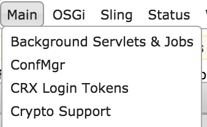

# Compatibilidad con cifrado para propiedades de configuración{#encryption-support-for-configuration-properties}

## Información general {#overview}

Esta función permite almacenar todas las propiedades de configuración de OSGi en un formulario cifrado protegido en lugar de texto no cifrado. El formulario de la IU de la consola web se utiliza para crear texto cifrado a partir de texto no cifrado mediante la clave maestra de cifrado de todo el sistema.

Se agregó compatibilidad con el complemento de configuración OSGi para descifrar la propiedad antes de que la utilice un servicio.

>[!NOTE]
>
>Los servicios que esperan un valor cifrado deben utilizar la comprobación IsProtected para ver si el valor está cifrado antes de intentar descifrarlo, ya que puede que ya se haya descifrado.

## Habilitar compatibilidad con cifrado {#enabling-encryption-support}

Estos pasos muestran cómo cifrar la contraseña SMTP del servicio de correo. Puede completar estos pasos para una propiedad OSGI que desee cifrar.

1. AEM Vaya a la consola web de en *https://&lt;serveraddress>:&lt;serverport>/system/console/configMgr*
1. En la esquina superior izquierda, vaya a **Principal: compatibilidad con cifrado**

   

1. El **Compatibilidad con cifrado de la consola web de Adobe Experience Manager** se muestra la página.

   

1. En el **Texto sin formato** , introduzca el texto de los datos confidenciales que desea proteger.
1. Seleccionar **Protect**. El texto protegido se muestra como texto cifrado.

   

1. Copie el texto protegido del paso n.º 5 y péguelo en el valor del formulario OSGI. En este ejemplo, la variable **Contraseña SMTP** se añade a *Day CQ Mail Service*.

   

1. Guarde las propiedades del servicio Day CQ Mail. La contraseña SMTP se enviará ahora como un valor cifrado.

## Compatibilidad con descifrado {#decryption-support}

AEM ahora proporciona un complemento de configuración para descifrar las propiedades de configuración. AEM Este complemento de la descifrará y recuperará automáticamente las propiedades de texto no cifrado.
