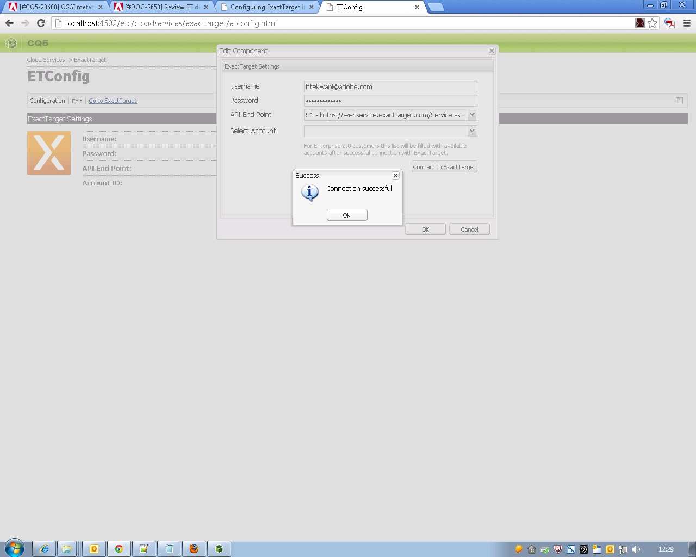
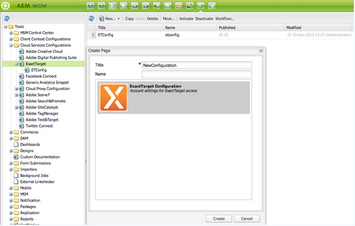

# Integración con ExactTarget{#integrating-with-exacttarget}

La integración de AEM con Exact Target le permite administrar y enviar correos electrónicos creados en AEM mediante ExactTarget. También le permite utilizar las funciones de administración de posibles clientes de ExactTarget mediante formularios AEM en páginas de AEM.

La integración proporciona las siguientes funciones:

* La capacidad de crear correos electrónicos en AEM y publicarlos en ExactTarget para su distribución.
* La capacidad de definir la acción de un formulario AEM para crear un suscriptor de ExactTarget.

Una vez configurado ExactTarget, puede publicar newsletters o correos electrónicos en ExactTarget. Consulte [Publicación de newsletters en un servicio](/help/sites-authoring/personalization.md)de correo electrónico.

## Creación de una configuración de ExactTarget {#creating-an-exacttarget-configuration}

Las configuraciones de ExactTarget se pueden agregar mediante Cloudservices o Herramientas. Ambos métodos se describen en esta sección.

### Configuración de ExactTarget a través de Cloudservices {#configuring-exacttarget-via-cloudservices}

Para crear una configuración de ExactTarget en Cloud Services:

1. En la página de bienvenida, haga clic en **Cloud Services**. (O acceso directo en `https://<hostname>:<port>/etc/cloudservices.html`).
1. Haga clic en **ExactTarget** y, a continuación, en **Configurar**. Se abre la ventana de configuración de ExactTarget.

   

1. Enter a title and optionally, a name and click **Create**. Se abre la ventana de configuración **ExactTarget Settings** .

   

1. Introduzca el nombre de usuario, la contraseña y seleccione un punto final de API (por ejemplo, **https://webservice.exacttarget.com/Service.asmx**).
1. Haga clic en **Conectar con ExactTarget.** Cuando se ha conectado correctamente, se muestra un cuadro de diálogo de éxito. Haga clic en **Aceptar** para salir de la ventana.

   

1. Seleccione una cuenta, si está disponible. La cuenta es para clientes de Enterprise 2.0. Haga clic en **Aceptar**.

   ExactTarget se ha configurado. Puede editar la configuración haciendo clic en **Editar**. Puede ir a ExactTarget haciendo clic en **Ir a ExactTarget**.

1. AEM ahora ofrece una función de extensión de datos. Puede importar columnas de extensión de datos de ExactTarget. Esto se puede configurar haciendo clic en el signo &quot;+&quot; que aparece además de crear correctamente la configuración de ExactTarget. Se puede seleccionar cualquiera de las extensiones de datos existentes en la lista desplegable. Para obtener más información sobre cómo configurar extensiones de datos, consulte la documentación de [ExactTarget](https://help.exacttarget.com/en/documentation/exacttarget/subscribers/data_extensions_and_data_relationships).

   Las columnas de extensión de datos importadas se pueden utilizar posteriormente a través del componente **Texto y Personalización** .

   

### Configuración de ExactTarget a través de las herramientas {#configuring-exacttarget-via-tools}

Para crear una configuración de ExactTarget en Herramientas:

1. En la página de bienvenida, haga clic en **Herramientas**. O navegue allí directamente yendo a `https://<hostname>:<port>/misadmin#/etc`.
1. Seleccione **Herramientas**, Configuración de servicios **de nube y, a continuación,** **ExactTarget**.
1. Click **New** to open the **Create Page **window.

   

1. Introduzca el **Título** y, opcionalmente, el **Nombre** y haga clic en **Crear**.
1. Introduzca la información de configuración como se indica en el paso 4 del procedimiento anterior. Siga ese procedimiento para finalizar la configuración de ExactTarget.

### Adición de varias configuraciones {#adding-multiple-configurations}

Para agregar varias configuraciones:

1. En la página de bienvenida, haga clic en **Cloud Services** y, a continuación, en **ExactTarget**. Haga clic en el botón **Mostrar configuraciones** que aparece si hay una o más configuraciones de ExactTarget disponibles. Se enumeran todas las configuraciones disponibles.
1. Haga clic en el signo **+** junto a Configuraciones disponibles. Se abre la ventana **Crear configuraciones** . Siga el procedimiento de configuración anterior para crear una nueva configuración.