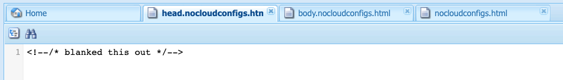

# Exportación de fragmentos de experiencias a Adobe Target{#exporting-experience-fragments-to-adobe-target}

>[!CAUTION]
>
>AEM Algunas funciones de esta página requieren la aplicación de la versión 6.5.3.0 de (o posterior).
>
>6.5.3.0:
>
>* **Dominios del externalizador** ahora se puede seleccionar.
>  **Nota:** Los dominios externalizadores solo son relevantes para el contenido del fragmento de experiencia que se envía a Target y no para los metadatos como Ver contenido de la oferta.
>
>6.5.2.0:
>
>* Los fragmentos de experiencias se pueden exportar a:
>
>   * el espacio de trabajo predeterminado.
>   * un espacio de trabajo con nombre, especificado en la Configuración de nube.
>   * **Nota:** La exportación a espacios de trabajo específicos requiere Adobe Target Premium.
>
>* AEM debe ser de [integrado con Adobe Target mediante IMS](/help/sites-administering/integration-target-ims.md).
>
>AEM 6.5.0.0 y 6.5.1.0:
>
>* Los fragmentos de experiencias de AEM se exportan al espacio de trabajo predeterminado de Adobe Target.
>* AEM debe integrarse con Adobe Target según las instrucciones de [Integración con Adobe Target](/help/sites-administering/target.md).

Se puede exportar [Fragmentos de experiencias](/help/sites-authoring/experience-fragments.md), creado en Adobe Experience Manager AEM (), en Adobe Target (Target). Luego pueden utilizarse como ofertas en actividades de Target para probar y personalizar experiencias a escala.

Hay tres opciones de formato disponibles para exportar un fragmento de experiencia a Adobe Target:

* HTML (predeterminado): Compatibilidad con la entrega de contenido web e híbrido
* JSON: Compatibilidad con entrega de contenido sin encabezado
* HTML y JSON

AEM Los fragmentos de experiencias se pueden exportar al espacio de trabajo predeterminado en Adobe Target o a espacios de trabajo definidos por el usuario para Adobe Target. Esto se realiza mediante la consola de Adobe Developer AEM, para la cual se debe realizar una comprobación de la configuración de la interfaz de usuario de la consola de [integrado con Adobe Target mediante IMS](/help/sites-administering/integration-target-ims.md).

>[!NOTE]
>
>Los espacios de trabajo de Adobe Target no existen en Adobe Target. Se definen y administran en Adobe IMS (Identity Management System) y, a continuación, se seleccionan para su uso en todas las soluciones mediante integraciones de la consola de Adobe Developer.

>[!NOTE]
>
>Los espacios de trabajo de Adobe Target se pueden utilizar para permitir a los miembros de una organización (grupo) crear y administrar ofertas y actividades solo para esta organización; sin dar acceso a otros usuarios. Por ejemplo, las organizaciones específicas de los países dentro de una preocupación mundial.

>[!NOTE]
>
>Para obtener más información, consulte:
>
>* [Desarrollo de Adobe Target](https://developers.adobetarget.com/)
>* [Componentes principales: fragmentos de experiencias](https://experienceleague.adobe.com/docs/experience-manager-core-components/using/wcm-components/experience-fragment.html)
>

## Requisitos previos {#prerequisites}

>[!CAUTION]
>
>AEM Algunas funciones de esta página requieren la aplicación de la versión 6.5.3.0 de la aplicación de.

Se requieren varias acciones:

1. Tienes que hacerlo [AEM integración con Adobe Target mediante IMS](/help/sites-administering/integration-target-ims.md).
2. AEM Los fragmentos de experiencias se exportan desde la instancia de autor de la, por lo que debe [AEM Configuración del externalizador de vínculos de la](/help/sites-administering/target-requirements.md#configuring-the-aem-link-externalizer) en la instancia de autor para garantizar que todas las referencias dentro del fragmento de experiencia se externalicen para la entrega web.

   >[!NOTE]
   >
   >Para que la reescritura de vínculos no esté cubierta por el valor predeterminado, el [Proveedor de reescritura de vínculos de fragmentos de experiencia](/help/sites-developing/experience-fragments.md#the-experience-fragment-link-rewriter-provider-html) está disponible. Con esto, se pueden desarrollar reglas personalizadas para su instancia.

## Agregar la configuración de nube {#add-the-cloud-configuration}

Antes de exportar un fragmento, debe añadir la variable **Configuración de nube** para **Adobe Target** al fragmento o carpeta. Esto también le permite:

* especifique las opciones de formato que se utilizarán para la exportación
* seleccionar un espacio de trabajo de Target como destino
* seleccione un dominio externalizador para reescribir referencias en el fragmento de experiencia (opcional)

Las opciones requeridas se pueden seleccionar en **Propiedades de página** de la carpeta o fragmento necesarios; la especificación se hereda según sea necesario.

1. Vaya a la consola de **fragmentos de experiencias**.

1. Abra **Propiedades de página** para la carpeta o fragmento correspondiente.

   >[!NOTE]
   >
   >Si agrega la configuración de nube a la carpeta principal del fragmento de experiencia, la configuración la heredan todos los elementos secundarios.
   >
   >
   >Si agrega la configuración de nube al propio fragmento de experiencia, esta se hereda de todas las variaciones.

1. Seleccione la pestaña **Cloud Services**.

1. En **Configuración de Cloud Service**, seleccione **Adobe Target** en la lista desplegable.

   >[!NOTE]
   >
   >El formato JSON de una oferta de fragmento de experiencia se puede personalizar. Para ello, defina un componente Fragmento de experiencia del cliente y, a continuación, anote cómo exportar sus propiedades en el componente Modelo Sling.
   >
   >Consulte el componente principal:
   >
   >[Componentes principales: fragmentos de experiencias](https://experienceleague.adobe.com/docs/experience-manager-core-components/using/wcm-components/experience-fragment.html)

   En **Adobe Target** seleccione:

   * la configuración adecuada
   * la opción de formato requerido
   * un espacio de trabajo de Adobe Target
   * si es necesario: el dominio externalizador

   >[!CAUTION]
   >
   >El dominio externalizador es opcional.
   >
   >AEM Se configura un Externalizador de datos cuando desea que el contenido exportado apunte a un elemento específico *publicar* dominio. Para obtener más información, consulte [AEM Configuración del externalizador de vínculos de la](/help/sites-administering/target-requirements.md#configuring-the-aem-link-externalizer).
   >
   >Tenga en cuenta también que los dominios externalizadores solo son relevantes para el contenido del fragmento de experiencia que se envía a Target y no para los metadatos como Ver contenido de la oferta.

   Por ejemplo, para una carpeta:

   

1. **Guardar y cerrar**.

## Exportación de un fragmento de experiencia a Adobe Target {#exporting-an-experience-fragment-to-adobe-target}

>[!CAUTION]
>
>Para los activos de medios, como las imágenes, solo se exporta una referencia a Target. El recurso en sí permanece almacenado en AEM Assets y se entrega desde la instancia de publicación de AEM.
>
>Debido a esto, el fragmento de experiencia, con todos los recursos relacionados, debe publicarse antes de exportarse a Target.

AEM Para exportar un fragmento de experiencia de Target a Target (después de especificar la Configuración de nube):

1. Vaya a la consola Fragmento de experiencias.
1. Seleccione el fragmento de experiencia que desea exportar a target.

   >[!NOTE]
   >
   >Debe ser una variación web del Fragmento de experiencia.

1. Toque o haga clic en **Exportar a Adobe Target**.

   >[!NOTE]
   >
   >Si el fragmento de experiencia ya se ha exportado, seleccione **Actualización del estado en Adobe Target**.

1. Toque o haga clic en **Exportación sin publicación** o **Publicación** según sea necesario.

   >[!NOTE]
   >
   >Seleccionar **Publish** publica el fragmento de experiencia de inmediato y lo envía a Target.

1. Toque o haga clic en **Aceptar** en el cuadro de diálogo de confirmación.

   El fragmento de experiencia debería estar en Target.

   >[!NOTE]
   >
   >[Varios detalles](/help/sites-authoring/experience-fragments.md#details-of-your-experience-fragment) de la exportación se pueden ver en **Vista de lista** de la consola y **Propiedades**.

   >[!NOTE]
   >
   >Al ver un fragmento de experiencia en Adobe Target, la fecha de *última modificación* en la que se ve es la fecha en la que se modificó por última vez el fragmento en AEM, no la fecha en la que se exportó por última vez a Adobe Target.

>[!NOTE]
>
>También puede realizar la exportación desde el editor de páginas utilizando comandos comparables en el menú [Información de la página](/help/sites-authoring/author-environment-tools.md#page-information).

## Uso de los fragmentos de experiencias en Adobe Target {#using-your-experience-fragments-in-adobe-target}

Después de realizar las tareas anteriores, el fragmento de experiencia se muestra en la página Ofertas de Adobe Target. Consulte la [documentación específica de Target](https://experienceleague.adobe.com/docs/target/using/experiences/offers/aem-experience-fragments.html?lang=es) para aprender lo que se puede lograr allí.

>[!NOTE]
>
>Al ver un fragmento de experiencia en Adobe Target, la fecha de *última modificación* en la que se ve es la fecha en la que se modificó por última vez el fragmento en AEM, no la fecha en la que se exportó por última vez a Adobe Target.

## Eliminación de un fragmento de experiencia ya exportado a Adobe Target {#deleting-an-experience-fragment-already-exported-to-adobe-target}

La eliminación de un fragmento de experiencia que ya se ha exportado a Target puede causar problemas si el fragmento ya se está utilizando en una oferta de Adobe Target. Si se elimina el fragmento, la oferta quedaría inutilizable, ya que AEM está entregando el contenido del fragmento.

Para evitar estas situaciones, haga lo siguiente:

* Si el fragmento de experiencia no se está utilizando en una actividad, AEM permite al usuario eliminar el fragmento sin un mensaje de advertencia.
* Si una actividad de Adobe Target AEM está utilizando el fragmento de experiencia, un mensaje de error advierte al usuario sobre las posibles consecuencias que tendrá la eliminación del fragmento en la actividad.

  El mensaje de error de AEM no impide que el usuario elimine (a la fuerza) el fragmento de experiencia. Si se elimina el fragmento de experiencia:

   * La oferta de Target con el fragmento de experiencia de AEM puede mostrar un comportamiento no deseado

      * Es probable que la oferta se siga procesando, ya que el HTML del fragmento de experiencia se insertó en Target
      * Puede que cualquier referencia en el fragmento de experiencia no funcione correctamente si también se eliminaron activos a los que se hace referencia en AEM.

   * AEM Es imposible realizar más modificaciones en el Fragmento de experiencia, ya que el Fragmento de experiencia ya no existe en la.


## Eliminación de ClientLibs de fragmentos de experiencias exportados a Target {#removing-clientlibs-from-fragments-exported-target}

Los fragmentos de experiencias contienen etiquetas html completas y todas las bibliotecas de cliente (CSS/JS) necesarias para procesar el fragmento exactamente como lo creó el autor del contenido del fragmento de experiencia. Esto es por diseño.

Cuando se utiliza una oferta de fragmento de experiencia con Adobe Target AEM en una página que está siendo entregada por, la página de destino ya contiene todas las bibliotecas de cliente necesarias. Además, el HTML superfluo en la oferta de Fragmento de experiencia tampoco es necesario (consulte [Consideraciones](#considerations)).

El siguiente es un pseudoejemplo del html de una oferta de fragmento de experiencia:

```html
<!DOCTYPE>
<html>
   <head>
      <title>…</title>
      <!-- all of the client libraries (css/js) -->
      …
   </head>
   <body>
        <!--/* Actual XF Offer content would appear here... */-->
   </body>
</html>
```

AEM En un nivel superior, cuando se exporta un fragmento de experiencia a Adobe Target, lo hace utilizando varios selectores de Sling adicionales. Por ejemplo, la URL del fragmento de experiencia exportado podría tener el siguiente aspecto (aviso) `nocloudconfigs.atoffer`):

* http://www.your-aem-instance.com/content/experience-fragments/my-offers/my-xf-offer.nocloudconfigs.atoffer.html

El `nocloudconfigs` El selector de se define mediante HTL y se puede superponer copiándolo de:

* /libs/cq/experience-fragments/components/xfpage/nocloudconfigs.html

El `atoffer` el selector se aplica después del procesamiento utilizando [Sling Rewriter](/help/sites-developing/experience-fragments.md#the-experience-fragment-link-rewriter-provider-html). Se puede utilizar para eliminar las bibliotecas de cliente.

### Ejemplos {#example}

Para el propósito aquí, vamos a ilustrar cómo hacer esto con `nocloudconfigs`.

>[!NOTE]
>
>Consulte [Plantillas editables](/help/sites-developing/templates.md#editable-templates) para obtener más información.

#### Superposiciones {#overlays}

En este ejemplo concreto, la variable [superposiciones](/help/sites-developing/overlays.md) al incluirse se eliminarán las bibliotecas de cliente *y* el html superfluo. Se da por hecho que ya ha creado el Tipo de plantilla de fragmento de experiencia. Los archivos necesarios que deben copiarse de `/libs/cq/experience-fragments/components/xfpage/` incluir:

* `nocloudconfigs.html`
* `head.nocloudconfigs.html`
* `body.nocloudconfigs.html`

#### Superposiciones de tipo de plantilla {#template-type-overlays}

A los efectos de este ejemplo, vamos a utilizar la siguiente estructura:


El contenido de estos archivos es el siguiente:

* `body.nocloudconfigs.html`

  

* `head.nocloudconfigs.html`

  

* `nocloudconfigs.html`

  

>[!NOTE]
>
>Para usar `data-sly-unwrap` para quitar la etiqueta body, necesita lo siguiente `nocloudconfigs.html`.

### Consideraciones {#considerations}

AEM AEM Si necesita admitir sitios de y sitios que no sean de mediante Ofertas de fragmentos de experiencias en Adobe Target, debe crear dos fragmentos de experiencias (dos tipos de plantillas diferentes):

* Uno con la superposición para eliminar clientlibs/html extra

* Uno que no tenga la superposición y que, por lo tanto, incluya los clientlibs necesarios