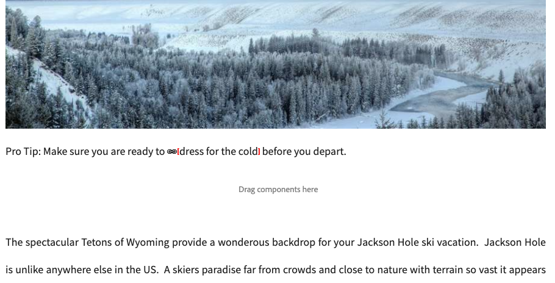

# Verificador de vínculos {#the-link-checker}

Los autores de contenido no deben preocuparse por validar cada vínculo que incluyan en sus páginas de contenido.

El Comprobador de vínculos ayuda automáticamente a los autores de contenido con sus vínculos, incluidos los siguientes:

* Validación de vínculos a medida que se agregan al contenido
* Visualización de una lista de todos los vínculos externos en el contenido
* Realización de transformaciones de vínculos

El Verificador de vínculos tiene una serie de [opciones de configuración](#configuring), como definir la validación interna, permitir que ciertos vínculos o patrones de vínculo se omitan de la validación y reescribir reglas de reescritura de vínculos.

El Verificador de vínculos valida los vínculos [internos](#internal) y [externos.](#external)

>[!NOTE]
>
>Debido a que el Verificador de vínculos comprueba los vínculos de todas las páginas de contenido, el Verificador de vínculos puede afectar al rendimiento en repositorios grandes. En estos casos, es posible que deba [configurar la frecuencia con la que se ejecuta el Verificador de vínculos](#configuring) o [deshabilitarlo.](#disabling)

## Comprobación de vínculos internos {#internal}

Los vínculos internos son vínculos a otro contenido del repositorio de AEM. Los vínculos internos se pueden agregar mediante el selector de rutas RTE o mediante un componente personalizado. Por ejemplo:

* Su página `/content/wknd/us/en/adventures/ski-touring.html`
* Contiene un vínculo a `/content/wknd/us/en/adventures/extreme-ironing.html` en un [componente de texto.](https://experienceleague.adobe.com/docs/experience-manager-core-components/using/components/text.html)

Los vínculos internos se validan en cuanto el autor del contenido agrega vínculos internos a una página. Si el vínculo no es válido:

* Se elimina del editor. El texto del vínculo permanece, pero el vínculo en sí se elimina.
* Se muestra como un vínculo roto en la interfaz de creación.

## Comprobación de vínculos externos {#external}

Los vínculos externos son vínculos al contenido que se encuentra fuera del repositorio de AEM. Los vínculos externos se pueden agregar utilizando el editor de texto enriquecido o un componente personalizado. Por ejemplo:

* Su página `/content/wknd/us/en/adventures/ski-touring.html`
* Contiene un vínculo a `https://bunwarmerthermalunderwear.com` en un [componente de texto.](https://experienceleague.adobe.com/docs/experience-manager-core-components/using/components/text.html)

Los vínculos externos se validan para verificar la sintaxis y su disponibilidad. Esta comprobación se realiza de forma asíncrona en un dispositivo interno configurable. Si el Verificador de vínculos encuentra un vínculo externo no válido:

* Se elimina del editor. El texto del vínculo permanece, pero el vínculo en sí se elimina.
* Se muestra como un vínculo roto en la interfaz de creación.

Además, la interfaz [Comprobador de vínculos externos](#external-link-checker) proporciona una visión general de todos los vínculos externos de las páginas de contenido.

### Uso del Comprobador de vínculos externos {#external-link-checker}

Para utilizar el Comprobador de vínculos externos:

1. Mediante **Navegación**, seleccione **Herramientas** y luego **Sitios**.
1. Seleccione **Comprobador de vínculos externos** y se mostrará una lista de todos los vínculos externos.

Se muestra la siguiente información:

* **Estado** : el estado de validación del vínculo que puede ser uno de los siguientes:
   * **Válido** : el comprobador de vínculos puede acceder al vínculo externo
   * **Pendiente** : el vínculo externo se agregó al contenido del sitio pero aún no ha sido validado por el Verificador de vínculos
   * **No válido** : el comprobador de vínculos no puede establecer contacto con el vínculo externo
* **URL** : vínculo externo
* **Remitente del reenvío** : la página de contenido que contiene el vínculo externo
   * Solo se rellena [si está configurado.](#configuring)
* **Última comprobación** : la última vez que el Verificador de vínculos validó el vínculo externo
   * La frecuencia con la que se comprueban los vínculos [es configurable.](#configuring)
* **Último estado** : el último código de estado HTML devuelto cuando el vínculo activado marcó por última vez el vínculo externo
* **Última disponibilidad** : hora desde la última vez que el vínculo estuvo disponible para el Verificador de vínculos
* **Último acceso** : hora desde la última vez que se accedió a la página con el vínculo externo en la interfaz de creación

Puede manipular el contenido de la ventana utilizando los dos botones de la parte superior de la lista de vínculos:

* **Actualizar** : para actualizar el contenido de la lista
* **Marque**  para comprobar un vínculo externo individual seleccionado en la lista

### Funcionamiento del Comprobador de vínculos externos {#how-it-works}

Aunque es fácil de usar, el Comprobador de vínculos externos depende de una serie de servicios y de comprender cómo funcionan ayuda a comprender cómo [configurar el Verificador de vínculos](#configuring) para satisfacer sus necesidades.

1. Cada vez que un autor de contenido guarda un vínculo a una página, se activa un controlador de evento.
1. El controlador de evento atraviesa todo el contenido en `/content` y busca vínculos nuevos o actualizados y los agrega a una caché para el Verificador de vínculos.
1. El **servicio CQ Link Checker** se ejecuta en una programación regular para comprobar que las entradas de la caché tengan una sintaxis válida.
1. Los vínculos validados por la sintaxis aparecen en la ventana [Comprobador de vínculos externos](#external-link-checker). Sin embargo, estarán en un estado **Pendiente**.
1. La **Tarea del comprobador de vínculos de CQ** se ejecuta con regularidad para validar los vínculos realizando una llamada de GET.
1. La **Tarea del Verificador de vínculos de CQ** actualiza las entradas de la ventana del Comprobador de vínculos externos con los resultados de las llamadas de GET.

## Configuración del comprobador de vínculos {#configuring}

El Verificador de vínculos está disponible automáticamente de forma predeterminada en AEM. Sin embargo, existen varias configuraciones de OSGi que se pueden modificar para cambiar su comportamiento:

* **Servicio**  de Almacenamiento de información del comprobador de vínculos de CQ por día: este servicio define el tamaño de la caché del comprobador de vínculos en el repositorio.
* **Servicio**  Day CQ Link Checker: este servicio realiza una comprobación asincrónica de la sintaxis de los vínculos externos. Puede definir el período de comprobación y los tipos de vínculos que el comprobador omite, entre otras opciones.
* **Tarea**  del Comprobador de vínculos de CQ de día: este servicio realiza la validación de GET de vínculos externos. Permite que las definiciones de intervalos independientes comprueben los vínculos malos y buenos entre otras opciones.
* **Transformador**  del comprobador de vínculos de CQ de día: permite convertir vínculos basados en un conjunto de reglas definido por el usuario.

Consulte la Configuración de documento [OSGi](/help/sites-deploying/osgi-configuration-settings.md) para obtener más información sobre cómo cambiar la configuración de OSGi.

## Desactivación del Comprobador de vínculos {#disabling}

Puede desactivar el Verificador de vínculos por completo. Para ello:

1. Abra la consola OSGi.
1. Editar el **transformador de comprobador de vínculos de CQ de día**
1. Marque las opciones que desee deshabilitar:
   * **Deshabilitar la comprobación**  para desactivar la validación de vínculos
   * **Deshabilitar la reescritura**  para deshabilitar las transformaciones de vínculos

>[!NOTE]
>
>Si deshabilita la comprobación de vínculos después de empezar a crear el contenido, es posible que siga viendo entradas en la ventana [Comprobador de vínculos externos](#external-link-checker), pero ya no se actualizarán.
