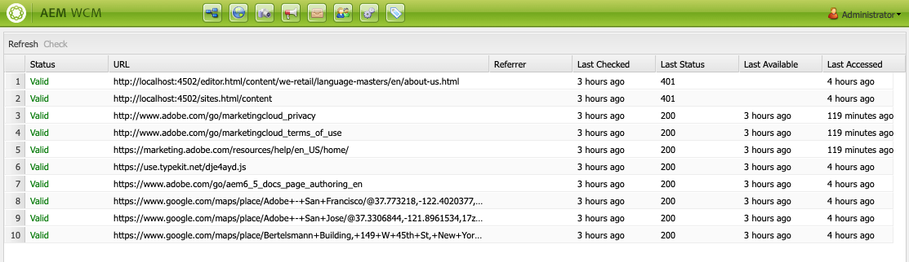

# El Comprobador de vínculos externos{#the-external-link-checker}

En AEM se proporciona un comprobador de vínculos externo. Comprobador de vínculos:

* analiza todas las páginas de contenido
* genera una lista de todos los vínculos válidos y no válidos
* marca los vínculos no válidos como rotos in situ en las páginas de contenido individuales

## Cómo validar vínculos externos {#how-to-validate-external-links}

Para utilizar el comprobador de vínculos externo:

1. Mediante **Navegación**, seleccione **Herramientas** y luego **Sitios**.
1. Seleccione **Comprobador de vínculos externos**, se genera una lista de todos los vínculos externos.
1. Valide un vínculo específico seleccionándolo en la lista y luego haciendo clic en **Comprobar**:

   

   Se muestra la información:

   * **Estado** del vínculo
   * **URL**
   * **Referencia**
   * tiempo desde que el vínculo fue **Última comprobación** (validado)
   * el **Último estado** devolvió

   * tiempo desde que el vínculo era **Última disponibilidad**
   * tiempo transcurrido desde que el vínculo era **Último acceso**

1. En las páginas de contenido individuales, los vínculos no válidos se mostrarán como rotos:

   