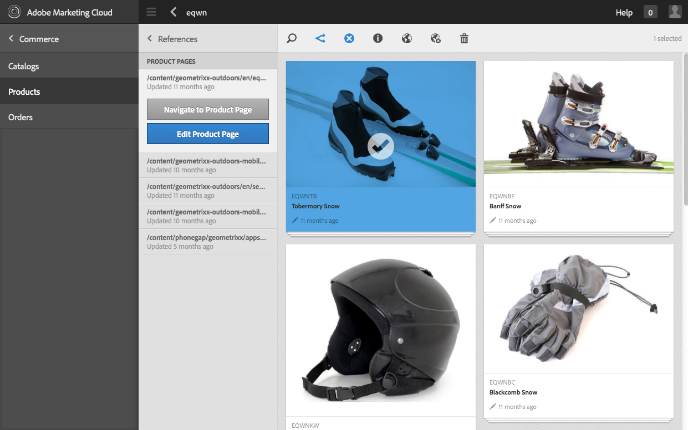
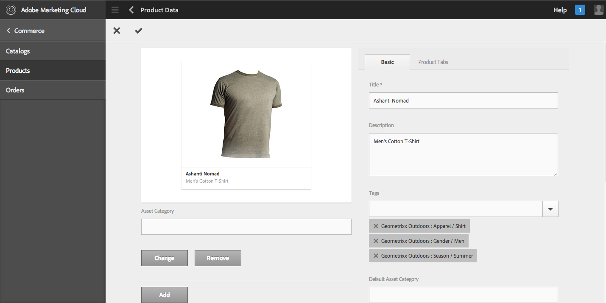
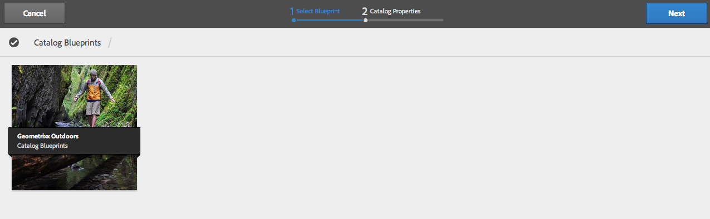
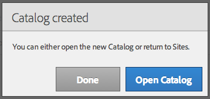

# Administración de comercio electrónico genérico {#administering-generic-ecommerce}

La solución genérica AEM proporciona métodos para administrar la información de comercio que se encuentra en el repositorio (en lugar de utilizar un motor de comercio electrónico externo). Esto incluye:

* [Productos](/help/sites-administering/concepts.md#products)
* [Variantes del producto](/help/sites-administering/concepts.md#product-variants)
* [Catálogo(s)](/help/sites-administering/concepts.md#catalogs)
* [Promociones](/help/sites-administering/concepts.md#promotions)
* [Cupones](/help/sites-administering/concepts.md#vouchers)
* [Pedidos](/help/sites-administering/concepts.md#shopping-cart-and-orders)
* [Páginas proxy](/help/sites-administering/concepts.md#proxy-pages)

>[!NOTE]
>
>La instalación de AEM estándar incluye la implementación de comercio electrónico de AEM genérica (JCR).
>
>Actualmente, se ha diseñado para fines de demostración o como base básica de una implementación personalizada según sus necesidades.

## Productos y variaciones del producto {#products-and-product-variations}

>[!NOTE]
>
>Los siguientes procedimientos se aplican tanto a los productos como a las variaciones de productos.

Antes de crear productos, debe definir un [scaffold](/help/sites-authoring/scaffolding.md). Esto especifica los campos que necesita para definir los productos y cómo se editan.

Se necesita un scaffold para cada tipo de producto distinto. El scaffold correspondiente se asocia con los productos mediante:

* path
* el producto puede hacer referencia al scaffold

>[!NOTE]
>
>La tienda Geometrixx-Outdoors tiene un solo tipo de producto (y por lo tanto un solo scaffold):
>
>`/etc/scaffolding/geometrixx-outdoors`
>
>El tipo de producto Geometrixx-exterior está activo en:
>
>`/etc/commerce/products/geometrixx-outdoors`
>
>Puede crear una nueva definición de producto en cualquier lugar sin ninguna configuración adicional.

### Importación de productos {#importing-products}

#### Importación de productos: IU táctil {#importing-products-touch-optimized-ui}

1. Vaya a la consola **Productos**, a través de **Comercio**.
1. Con la consola **Products** navegue a la ubicación requerida.
1. Utilice el icono **Importar productos** para abrir el asistente.

   

1. Especifique:

   * **Importador**

      El importador para el [proveedor de comercio](/help/sites-administering/concepts.md#commerce-providers) específico, de forma predeterminada `Geometrixx`.

   * **Origen**

      El archivo que desea importar; puede utilizar el explorador para seleccionar un archivo.

   * **Importación incremental**

      Indique si se trata de una importación incremental (a diferencia de la importación completa).
   >[!NOTE]
   >
   >La importación incremental (del importador al aire libre de geometrixx de muestra) funciona a nivel de producto.
   >
   >Se puede definir un importador personalizado para que funcione según sea necesario.

1. Seleccione **Siguiente** para importar los productos, se mostrará un registro de las acciones realizadas.

   >[!NOTE]
   >
   >Los productos se importarán en la ubicación actual o en relación con ella.

   >[!NOTE]
   >
   >Si se utiliza repetidamente **Siguiente** y **Atrás**, se importarán repetidamente las definiciones del producto. Sin embargo, como tienen los mismos SKU, la información existente en el repositorio simplemente se sobrescribirá.

1. Seleccione **Listo** para cerrar el asistente.

#### Importación de productos: IU clásica {#importing-products-classic-ui}

1. Mediante la consola **Tools**, abra la carpeta **Commerce**.
1. Haga clic con el doble para abrir el **Importador de productos**:

   

1. Especifique:

   * **Nombre del almacén**

      Los productos se importarán a:

      `/etc/commerce/products/<*store name*>/`

   * **Proveedor comercial**

      El importador de su [proveedor de comercio](/help/sites-administering/concepts.md#commerce-providers); de forma predeterminada, Geometrixx.

   * **Archivo de origen**

      Ubicación en el repositorio del archivo que desea importar.

   * **Importación incremental**

      Indique si se trata de una importación incremental (a diferencia de la importación completa).

1. Haga clic en **Importar productos**.

### Creación de información del producto {#creating-product-information}

>[!NOTE]
>
>La administración de productos estándar es básica, ya que el conjunto de productos Geometrixx-exterior se ha mantenido básico. La complejidad se basa en el producto [scaffolding](/help/sites-authoring/scaffolding.md), por lo que con su propio scaffolding de producto es posible lograr una edición más sofisticada.

#### Creación de información del producto: IU táctil {#creating-product-information-touch-optimized-ui}

1. Con la consola **Productos** (a través de **Comercio**) navegue a la ubicación requerida.
1. Utilice el icono **Crear** para seleccionar cualquiera de los dos (según la estructura y la ubicación):

   * **Crear el producto**
   * **Crear variación de producto**

   

1. Se abrirá el asistente. Utilice las **Fichas de producto** y **Básicas** para ingresar los [atributos de producto](/help/sites-administering/concepts.md#product-attributes) para el nuevo producto o variante de producto.

   >[!NOTE]
   >
   >**** Titular y  **** SKU son el mínimo requerido para crear un producto o una variante.

1. Seleccione **Crear** para guardar la información.

>[!NOTE]
>
>Muchos productos se ofrecen en una gama de colores y/o tamaños. La información sobre el producto básico y las variantes de producto relacionadas se pueden administrar desde la consola **Productos**.
>
>Los productos y sus variantes se almacenan como una estructura de árbol, la información del producto se encuentra en la parte superior, con las variantes debajo (esta estructura la impone la interfaz de usuario).

### Edición de la información del producto {#editing-product-information}

>[!NOTE]
>
>Las imágenes de producto en geometrixx-outdoors se sirven desde:
>
>`/etc/commerce/products/...`
>
>Esto significa que, de forma predeterminada, el [despachante](https://helpx.adobe.com/experience-manager/dispatcher/using/dispatcher-configuration.html) los bloquea, por lo que debe configurarlos según sea necesario.

#### Edición de la información del producto: IU táctil {#editing-product-information-touch-optimized-ui}

1. Con la consola **Productos** (a través de **Comercio**), navegue a la información del producto.
1. Mediante:

   * [acciones rápidas](/help/sites-authoring/basic-handling.md#quick-actions)
   * [Modo de selección](/help/sites-authoring/basic-handling.md#navigating-and-selection-mode)

   Seleccione el icono **Datos del producto de Vista**:

   

1. Se mostrarán los [atributos del producto](/help/sites-administering/concepts.md#product-attributes). Utilice **Editar** y **Listo** para realizar cualquier cambio.

### Mostrando referencias de producto {#showing-product-references}

#### Visualización de referencias del producto: IU táctil {#showing-product-references-touch-optimized-ui}

1. Con la consola **Productos** (a través de **Comercio**), navegue a la información del producto.
1. Abra el carril secundario de Referencias con el icono:

   

1. Seleccione el producto requerido: el carril secundario se actualizará para mostrar los tipos de referencia disponibles:

   

1. Toque o haga clic en el tipo de referencia (por ejemplo: Páginas de producto) para expandir la lista.
1. Seleccione una referencia específica para mostrar las opciones:

   * Navegar a pág. producto
   * Editar página del producto

   

### Buscar productos {#search-for-products}

1. Vaya a la consola **Productos**, a través de **Comercio**.
1. Abra el carril secundario para la búsqueda con el icono:

   

1. Hay varias facetas disponibles para buscar productos. Puede utilizar solo una o varias facetas para una búsqueda. Aparecerán los productos encontrados:

   

1. Al tocar o hacer clic en un producto se abre. También puede publicarla o vista de los datos del producto.

#### Ampliación de la búsqueda {#extending-search}

Puede modificar una faceta existente o agregar otras nuevas mediante CRXDE Lite:

1. Ir a:

   `http://localhost:4502/crx/de/index.jsp#/libs/commerce/gui/content/products/aside/items/search/items/searchpanel/facets`

1. Puede modificar, por ejemplo, los tamaños que aparecerán en la página de búsqueda de productos. Haga clic en el nodo `sizegroup`.
1. Haga clic en el nodo `items` y, a continuación, haga clic en el nodo `propertypredicate`.
1. Puede modificar el `propertyValues`. Por ejemplo, puede agregar XS, XXL o quitar un tamaño.
1. Haga clic en **Guardar todo** y vaya a la página de búsqueda de productos. Deben aparecer los cambios.

### Varios recursos {#multiple-assets}

Puede agregar varios recursos en el componente de producto y luego especificar el recurso que aparecerá en la página de producto.

>[!NOTE]
>
>Todo lo relacionado con varios recursos se realiza con la IU táctil.

#### Añadir varios recursos {#adding-multiple-assets}

1. Vaya a la consola **Productos**, a través de **Comercio**.
1. Con la consola **Productos**, navegue hasta el producto requerido.

   >[!NOTE]
   >
   >Debe estar en el nivel de producto, no en el nivel de variante.

1. Toque o haga clic en el icono **Vista de datos del producto** con el modo de selección o acciones rápidas.
1. Toque o haga clic en el icono Editar.
1. Desplácese a **Añadir**.

   

1. Toque o haga clic **Añadir**. Aparece un nuevo marcador de posición de recurso.
1. Al tocar/hacer clic **Cambiar **se abre un cuadro de diálogo que le permite elegir un recurso.
1. Seleccione el recurso que desee agregar.

   >[!NOTE]
   >
   >Los recursos que puede seleccionar proceden de [Assets](https://helpx.adobe.com/experience-manager/aem-previous-versions.html#assets).

1. Toque o haga clic en el icono Listo.

Dos recursos se almacenan ahora en el componente de producto. Puede configurar cuál aparecerá en la página del producto. Esto funciona con un sistema de categoría. En primer lugar, debe agregar una categoría a los recursos individuales:

1. Toque o haga clic en **Vista de datos del producto**.
1. Escriba una **Categoría de recursos** en los recursos, por ejemplo `cat1` y `cat2`.

   >[!NOTE]
   >
   >También puede utilizar las etiquetas para categorías.

1. Toque o haga clic en el icono Listo. Ahora tiene que [implementar](#rolling-out-a-catalog) los cambios.

Ahora los recursos del componente de producto tienen una categoría. Puede configurar qué categoría se mostrará en tres niveles diferentes:

* [Página de productos](#product-page)
* [Catálogo](#catalog)
* [Consola de productos](#products-console)

>[!NOTE]
>
>Si no establece categorías, el primer recurso se mostrará en la página del producto.

El mecanismo para seleccionar la imagen que se va a mostrar es el siguiente:

1. Compruebe si se ha establecido una categoría para la página de producto.
1. De lo contrario, compruebe si se ha establecido una categoría para el catálogo.
1. Si no es así, compruebe si se ha establecido una categoría para la consola Productos.

>[!NOTE]
>
>Tanto en el nivel de catálogo como en el nivel de consola de productos, debe implementar los cambios para aplicar las modificaciones y ver la diferencia en la página de productos.

#### Página de productos {#product-page}

1. Vaya a la página de productos.
1. **** Edite el componente de producto.
1. Escriba la **Categoría de imagen** que eligió ( `cat1` por ejemplo).
1. Toque o haga clic **Listo**. Se actualizará la página y se mostrará el recurso correcto.

#### Catálogo  {#catalog}

1. Vaya al catálogo.
1. Toque o haga clic en **Propiedades de la Vista**.
1. Toque o haga clic **Editar**.
1. Toque o haga clic en la ficha **Recursos**.
1. Escriba la **Categoría de recursos del producto** requerida.
1. Toque o haga clic **Listo**.
1.  Resuma los cambios.

#### Consola de productos {#products-console}

1. Con la consola **Productos**, navegue hasta el Producto requerido.
1. Toque o haga clic en **Vista de datos del producto**.
1. Toque o haga clic **Editar**.
1. Escriba una **Categoría de recursos predeterminada**.
1. Toque o haga clic **Listo**.
1.  Resuma los cambios.

### Publicación/Cancelación de la publicación de información del producto {#publishing-unpublishing-product-information}

#### Publicación/Cancelación de la publicación de información del producto: IU táctil {#publishing-unpublishing-product-information-touch-optimized-ui}

>[!NOTE]
>
>A menudo, la información del producto se publica a través de las páginas que la hacen referencia. Por ejemplo, al publicar la página X que hace referencia al producto Y, AEM preguntará si también desea publicar el producto Y.
>
>En casos especiales, AEM también admite la publicación directa a partir de los datos del producto.

1. Con la consola **Productos** (a través de **Comercio**), navegue a la información del producto.
1. Mediante:

   * [acciones rápidas](/help/sites-authoring/basic-handling.md#quick-actions)
   * [Modo de selección](/help/sites-authoring/basic-handling.md#navigating-and-selection-mode)

   Seleccione el icono **Publicar** o **Cancelar la publicación** según sea necesario:

    

   La información del producto se publicará o dejará de publicarse según corresponda.

### Alimentación de productos {#product-feed}

La integración de Search&amp;Promote le permite:

* utilice la API de comercio electrónico, independientemente de la estructura de repositorio subyacente y la plataforma de comercio.
* aproveche la función Conector de índice de Search&amp;Promote para proporcionar una fuente de producto en formato XML.
* aproveche la función de control remoto de Search&amp;Promote para realizar solicitudes a petición o programadas de la fuente de productos
* generación de fuentes para distintas cuentas de Search&amp;Promote, configuradas como configuraciones de servicios en la nube.

Para obtener más información, lea [Alimentación de productos](/help/sites-administering/product-feed.md).

### Controlador de evento para actualizaciones de productos {#event-handler-for-product-updates}

Hay un controlador de Evento que registra un evento cuando se agrega, modifica o elimina un producto y cuando se agrega, modifica o elimina una página de producto. Existen los siguientes eventos OSGi:

* `com/adobe/cq/commerce/pim/PRODUCT_ADDED`
* `com/adobe/cq/commerce/pim/PRODUCT_MODIFIED`
* `com/adobe/cq/commerce/pim/PRODUCT_DELETED`
* `com/adobe/cq/commerce/pim/PRODUCT_PAGE_ADDED`
* `com/adobe/cq/commerce/pim/PRODUCT_PAGE_MODIFIED`
* `com/adobe/cq/commerce/pim/PRODUCT_PAGE_DELETED`

Para los eventos `PRODUCT_*`, la ruta apunta al producto base en `/etc/commerce/products`. Para los eventos `PRODUCT_PAGE_*`, la ruta apunta al nodo `cq:Page`.

Puede verlos en la consola web en eventos OSGI ( `/system/console/events`), por ejemplo:

>[!NOTE]
>
>Lea también [administración de Eventos en AEM](https://blogs.adobe.com/experiencedelivers/experience-management/event_handling_incq/). 

### Imagen con vínculos Añadir a carro {#image-with-add-to-cart-links}

El componente Imagen con Añadir a vínculos del carro de compras permite agregar rápidamente un producto al carro de compras mediante la creación de una zona interactiva vinculada con un producto en una imagen.

Al hacer clic en la zona interactiva se abre un cuadro de diálogo que permite elegir el tamaño y la cantidad del producto.

1. Vaya a la página donde desee agregar el componente.
1. Arrastre y suelte el componente en la página.
1. Arrastre y suelte una imagen en el componente desde el [navegador de recursos](/help/sites-authoring/author-environment-tools.md#assets-browser).
1. Puede:

   * haga clic en el componente y, a continuación, en el icono Editar
   * hacer un clic de doble lento

1. Haga clic en el icono de pantalla completa.

   

1. Haga clic en el icono Iniciar mapa.

   

1. Haga clic en uno de los iconos de forma.

   

1. Modifique y mueva la forma según sea necesario.
1. Haga clic en la forma.
1. Al hacer clic en el icono Examinar se abre el [Selector de recursos](../assets/search-assets.md#assetpicker).

   >[!NOTE]
   >
   >Como alternativa, puede escribir directamente la ruta del producto que debe estar en el nivel del producto, no en el nivel de variante.

   

1. Haga clic dos veces en el icono de confirmación y, a continuación, haga clic en Salir de pantalla completa.
1. Haga clic en alguna parte de la página junto al componente. La página debe actualizarse y debe ver el siguiente símbolo en la imagen:

   

1. Cambie al modo [previsualización](/help/sites-authoring/editing-content.md#previewingpagestouchoptimizedui).
1. Haga clic en el punto interactivo +. Se abre un cuadro de diálogo en el que puede elegir el tamaño y la cantidad del producto especificado en **Ruta**.

   

1. Introduzca un tamaño y una cantidad.
1. Haga clic en el botón Añadir al carro de compras. El cuadro de diálogo se cierra.
1. Vaya al carro de compras. El producto debería estar aquí.

#### Opciones de configuración {#configuration-options}

Puede configurar el aspecto del cuadro de diálogo al hacer clic en el punto interactivo:

1. Haga clic en el componente y en el icono de configuración.

   

1. Desplazar hacia abajo. Hay una ficha **AÑADIR A CARRO**.

   

1. Haga clic en **AÑADIR AL CARRO**. Hay 3 opciones de configuración que puede utilizar.

   

1. Haga clic en el icono Listo.

## Catálogos {#catalogs}

### Generación de un catálogo {#generating-a-catalog}

#### Generación de un catálogo: IU táctil {#generating-a-catalog-touch-optimized-ui}

>[!NOTE]
>
>El catálogo hará referencia a los datos del producto.

Para generar un catálogo:

1.  Abra la consola Sitios (por ejemplo, [http://localhost:4502/sites.html/content](http://localhost:4502/sites.html/content)).
1. Desplácese hasta la ubicación en la que desee crear la nueva página.
1. Para abrir la lista de opciones, utilice el icono **Crear**:

   

1. En la lista seleccione **Crear catálogo**, se abrirá el asistente Crear catálogo.

   

1. Vaya al modelo de catálogo requerido.
1. Toque o haga clic en el botón **Seleccionar** y toque o haga clic en el modelo de catálogo requerido.
1. Toque o haga clic **Siguiente**.

   

1. Escriba un **Título** y un **Nombre**.
1. Toque o haga clic en el botón **Crear**. Se crea el catálogo y se abre un cuadro de diálogo.

   

1. Al tocar o hacer clic en el botón **Listo** volverá a la consola Sitios, donde podrá ver el catálogo.

   Al tocar o hacer clic en el botón **Abrir catálogo** se abre el catálogo (por ejemplo, `http://localhost:4502/editor.html/content/test-catalog.html`).

#### Generación de un catálogo: IU clásica {#generating-a-catalog-classic-ui}

>[!NOTE]
>
>El catálogo hará referencia a los [datos del producto](#products-and-product-variants).

1. Con la consola **Sitios web**, navegue a su **modelo de catálogo** y luego al catálogo base.

   Por ejemplo:

   `http://localhost:4502/siteadmin#/content/catalogs/geometrixx-outdoors/base-catalog`

1. Cree una nueva página con la plantilla **Esquema de sección**.

   Por ejemplo, `Swimwear`.

1. Abra la nueva página `Swimwear` y haga clic en **Editar modelo** para abrir el cuadro de diálogo **Propiedades**, donde puede configurar la selección **Productos**.

   Por ejemplo, abra el campo **Etiquetas/Palabras clave** para seleccionar la Actividad y, a continuación, Nadar en la sección Geometrixx exteriores.

1. Haga clic en **Aceptar** para guardar las propiedades; los productos de ejemplo se mostrarán bajo los **Criterios de selección de productos** en la página de modelo.
1. Haga clic en **Desplegar cambios...**, seleccione **Página de despliegue y todas las páginas secundarias**, luego haga clic en **Siguiente** y luego **Despliegue**. Una vez que la implementación se haya completado correctamente, el indicador **Estado** se mostrará como verde.
1. Ahora puede hacer clic en **Cerrar** y comprobar la nueva sección del catálogo; por ejemplo, en y debajo:

   `http://localhost:4502/cf#/content/geometrixx-outdoors/en/swimwear.html`

1. Nuevamente en la página de modelos, haga clic en **Editar modelo** y en el cuadro de diálogo **Propiedades** abra la ficha **Página generada**. En el campo lista de pancarta, seleccione la imagen que desee mostrar; por ejemplo, `summer.jpg`
1. Haga clic en **Aceptar** para guardar las propiedades; la información del letrero se mostrará en los **Criterios de selección de productos** en la página de modelo.
1. Despliegue estos nuevos cambios.

### Despliegue de un catálogo {#rolling-out-a-catalog}

#### Despliegue de un catálogo: IU táctil {#rolling-out-a-catalog-touch-optimized-ui}

Para desplegar un catálogo:

1. Vaya a la consola **Catálogos**, a través de **Comercio**.
1. Vaya al catálogo que desee desplegar.
1. Mediante:

   * [acciones rápidas](/help/sites-authoring/basic-handling.md#quick-actions)
   * [Modo de selección](/help/sites-authoring/basic-handling.md#navigating-and-selection-mode)

   Seleccione el icono **Cambios de despliegue**:

   

1. En el asistente, configure la implementación según sea necesario y toque/haga clic **Despliegue de cambios**.
1. Se abre un cuadro de diálogo. Toque o haga clic **Listo** cuando finalice el proceso.

#### Despliegue de un catálogo: IU clásica {#rolling-out-a-catalog-classic-ui}

Para desplegar un catálogo:

1. Vaya al catálogo que desee desplegar. Por ejemplo:

   `http://localhost:4502/cf#/content/catalogs/geometrixx-outdoors/base-catalog.html`

1. Haga clic en **Desplegar cambios...**
1. Configure el despliegue según sea necesario.
1. Haga clic en **Despliegue**.

### Importador de modelo {#blueprint-importer}

#### Importador de modelo: IU táctil {#blueprint-importer-touch-optimized-ui}

1. Vaya a la consola **Catálogos**, a través de **Comercio**.
1. Vaya a la ubicación en la que desea importar el modelo de catálogo.
1. Toque o haga clic en el icono **Importar modelos**.

   

1. En el asistente, seleccione el origen según sea necesario y toque o haga clic en **Siguiente**.

   

1. Toque o haga clic **Listo** una vez finalizada la importación.

#### Importador de modelo: IU clásica {#blueprint-importer-classic-ui}

1. Con la consola **Herramientas**, navegue a **Comercio**.

   Por ejemplo:

   `http://localhost:4502/miscadmin#/etc/commerce`

1. Abra el **Importador de modelo de catálogo**.
1. Configure la importación según sea necesario.
1. Haga clic en **Importar modelos de catálogo**.

## Promociones {#promotions}

### Creación de una promoción {#creating-a-promotion}

#### Creación de una promoción: IU clásica {#creating-a-promotion-classic-ui}

>[!NOTE]
>
>El siguiente ejemplo trata de una promoción que se realiza directamente en una [campaña](/help/sites-classic-ui-authoring/classic-personalization-campaigns.md), que se utiliza para los comprobantes.
>
>Una promoción también puede estar en una [experiencia](/help/sites-authoring/personalization.md) dentro de una campaña.
>
>Para obtener más información, consulte [Promociones y cupones](#promotions-and-vouchers).

1. Abra la consola **Sitios web** de la instancia de autor.
1. En el panel izquierdo, seleccione su **Campaña** requerida.
1. Haga clic en **Nuevo**, seleccione la plantilla **Promoción** y luego especifique un **Título** (y **Nombre** si es necesario) para la nueva licencia.
1. Haga clic en **Crear**. La nueva página de promoción se mostrará en el panel derecho.

1. Edite las **Propiedades** mediante:

   * abrir la página y, a continuación, hacer clic en el botón Editar para abrir el cuadro de diálogo Propiedades
   * seleccionando la página en la consola Sitios web, luego utilizando el menú contextual (generalmente el botón secundario del ratón) para seleccionar **Propiedades...** y abra el cuadro de diálogo de propiedades

   Especifique los campos **Tipo de promoción**, **Tipo de descuento**, **Valor de descuento** y cualquier otro campo según sea necesario.

1. Haga clic en **Aceptar** para guardar.

1. Ahora puede activar la promoción para que los compradores la vean en la instancia de publicación.

## Cupones {#vouchers}

### Creación de un cupón {#creating-a-voucher}

#### Creación de un cupón: IU clásica {#creating-a-voucher-classic-ui}

1. Abra la consola **Sitios web** de la instancia de autor.
1. En el panel izquierdo, seleccione su **Campaña** requerida.
1. Haga clic en **Nuevo**, seleccione la plantilla **Asiento** y, a continuación, especifique un **Título** (y **Nombre** si es necesario) para el nuevo asiento.
1. Haga clic en **Crear**. La nueva página de asiento se mostrará en el panel derecho.

1. Abra la nueva página de cupones con un doble-clic y haga clic en **Editar** para configurar la información según sea necesario.
1. Haga clic en **Aceptar** para guardar.

1. Ahora puede activar la licencia para que los compradores puedan utilizarla en sus carros en la instancia de publicación.

### Eliminando cupones {#removing-vouchers}

#### Quitando cupones: IU clásica {#removing-vouchers-classic-ui}

Para que un vale no esté disponible para los clientes, puede:

* Desactive la licencia: permanecerá disponible en el entorno de creación para que pueda reactivarla posteriormente.
* Eliminarlo por completo.

Ambas acciones se pueden realizar desde la consola **Sitios web**.

### Modificación de cupones {#modifying-vouchers}

#### Modificación de cupones: IU clásica {#modifying-vouchers-classic-ui}

Para cambiar las propiedades de una licencia o promoción, puede hacer clic con el doble en ella en la consola **Sitios web** y hacer clic en **Editar**. Después de guardarlo, debe activarlo para que los cambios se inserten en las instancias de publicación.

### Añadir cupones a un carro de compras {#adding-vouchers-to-a-cart}

Para permitir que los usuarios agreguen asientos a sus carros, puede utilizar el componente **Cupones** integrado (categoría de comercio). Debe agregarlo a la misma página en la que se muestra el carro de compras (pero no es obligatorio). El componente de cupones es simplemente un formulario en el que el usuario puede introducir un código de asiento, es el componente de carro de compras el que muestra la lista de los cupones aplicados y su descuento.

En el sitio de demostración (Geometrixx Outdoors - Inglés) puede ver el formulario de cupones en la página del carro de compras, debajo del carro de compras real.

## Pedidos {#orders}

>[!NOTE]
>
>Debe recordarse que los AEM listos para usar no tienen acciones requeridas para la funcionalidad estándar relacionada con los pedidos, como devolución de mercadería, actualización del estado del pedido, realización de descargas, generación de paquetes. Se trata principalmente de una previsualización tecnológica.
>
>La gestión genérica de pedidos en AEM se ha mantenido básica; los campos disponibles en el asistente dependen del scaffold:
>`/etc/scaffolding/geometrixx-outdoors/order/jcr:content/cq:dialog`
>
>Si crea un scaffold personalizado, puede almacenar más información de pedido.

>[!NOTE]
>
>La consola de pedidos expone la información de pedidos del proveedor, que nunca se publica.
>
>La información del pedido del cliente se guarda en sus directorios principales y se expone en el historial de pedidos de su cuenta. Esta información se publica junto con el resto de su directorio de inicio.

### Creando información de pedido {#creating-order-information}

#### Creación de información de pedido: IU táctil {#creating-order-information-touch-optimized-ui}

1. Con la consola **Orders** navegue a la ubicación requerida.
1. Utilice el icono **Crear** para seleccionar **Crear pedido**.

   

1. Se abrirá el asistente. Utilice las fichas **Basic**, **Content**, **Payment** y **Fulfillment** para ingresar la [información sobre el nuevo pedido](/help/sites-administering/concepts.md#order-information).

1. Seleccione **Crear** para guardar la información.

### Edición de la información del pedido {#editing-order-information}

#### Edición de la información del pedido: IU táctil {#editing-order-information-touch-optimized-ui}

1. Con la consola **Orders** navegue al pedido.
1. Mediante:

   * [acciones rápidas](/help/sites-authoring/basic-handling.md#quick-actions)
   * [Modo de selección](/help/sites-authoring/basic-handling.md#navigating-and-selection-mode)

   Seleccione el icono **Datos de pedido de Vista**:

   

1. Se mostrará la [información de pedido](/help/sites-administering/concepts.md#order-information). Utilice **Editar** y **Listo** para realizar cualquier cambio.

