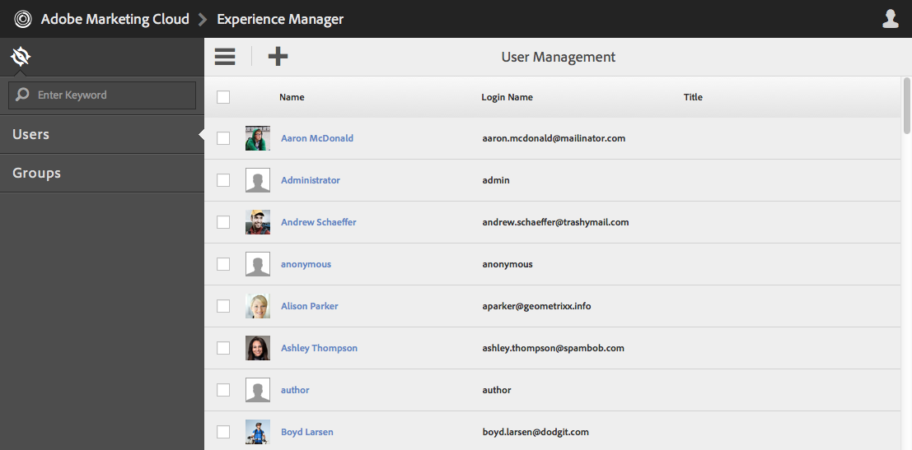

# Operaciones de Granite: administración de usuarios y grupos{#granite-operations-user-and-group-administration}

Granite incorpora la implementación del repositorio de CRX de la especificación de API de JCR y tiene su propia administración de usuarios y grupos.

AEM AEM Estas cuentas son la base subyacente de las [cuentas de](/help/sites-administering/security.md) y cualquier cambio de cuenta realizado con la administración de Granite se reflejará si/cuando se accede a las cuentas desde la consola [Usuarios de](/help/sites-administering/security.md#accessing-user-administration-with-the-security-console) (por ejemplo, `http://localhost:4502/useradmin`). AEM AEM Desde la consola Usuarios de la también puede administrar los privilegios y otros detalles de la.

Las consolas de administración de grupos y usuarios de Granite están disponibles en la consola **[Herramientas](/help/sites-administering/tools-consoles.md)** de la interfaz de usuario táctil optimizada:

Si elige **Usuarios** o **Grupos** de la consola Herramientas, se abrirá la consola adecuada. En ambos, puede realizar acciones ya sea usando el área de clic y luego acciones de la barra de herramientas, o abriendo los detalles de la cuenta a través del vínculo en **Nombre**.

* [Administración de usuarios](#user-administration)

  

  La consola **Usuarios** enumera:

   * el nombre de usuario
   * el nombre de inicio de sesión del usuario (nombre de cuenta)
   * cualquier título que se haya dado a la cuenta

* [Administración de grupos](#group-administration)

  

  La consola **Grupos** enumera:

   * el nombre del grupo
   * la descripción del grupo
   * el número de usuarios/grupos del grupo

## Administración de usuarios {#user-administration}

### Adición de un nuevo usuario {#adding-a-new-user}

1. Usar el icono **Agregar usuario**:

   

1. Se abre el formulario **Crear usuario**:

   

   Aquí puede introducir los detalles del usuario de la cuenta (la mayoría son estándar y explicativos):

   * **ID**

     Esta es la identificación única de la cuenta de usuario. Es obligatorio y no puede contener espacios.

   * **Dirección de correo electrónico**
   * **Contraseña**

     Es obligatorio introducir una contraseña.

   * **Contraseña de Retype**

     Esto es obligatorio, ya que es necesario para confirmar la contraseña.

   * **Nombre**
   * **Apellidos**
   * **Número de teléfono**
   * **Cargo**
   * **Calle**
   * **Móvil**
   * **Ciudad**
   * **Código postal**
   * **País**
   * **Estado**
   * **Título**
   * **Sexo**
   * **Acerca de**
   * **Configuración de la cuenta**

      * **Estado**
Puede marcar la cuenta como **activa** o **inactiva**.

   * **Foto**

     Aquí puede cargar una foto para utilizarla como avatar.

     Tipos de archivo admitidos: `.jpg .png .tif .gif`

     Tamaño preferido: `240x240px`

   * **Agregar usuario a grupos**

     Utilice la lista desplegable de selección para seleccionar los grupos a los que debe pertenecer el usuario. Una vez seleccionado, use **X** con el nombre para anular la selección antes de guardar.

   * **Grupos**

     Una lista de los grupos de los que el usuario es miembro actualmente. Use **X** con el nombre para anular la selección antes de guardar.

1. Una vez definida la cuenta de usuario, utilice:

   * **Cancelar** para anular el registro.
   * **Guardar** para completar el registro. La creación de la cuenta de usuario se confirmará con un mensaje.

### Edición de un usuario existente {#editing-an-existing-user}

1. Acceda a los detalles del usuario desde el vínculo bajo el nombre de usuario en la consola Usuarios.

1. Ahora puede editar los detalles como en [Agregar un nuevo usuario](#adding-a-new-user).

1. Acceda a los detalles del usuario desde el vínculo bajo el nombre de usuario en la consola Usuarios.

1. Ahora puede editar los detalles como en [Agregar un nuevo usuario](#adding-a-new-user).

### Cambio de la contraseña de un usuario existente {#changing-the-password-for-an-existing-user}

1. Acceda a los detalles del usuario desde el vínculo bajo el nombre de usuario en la consola Usuarios.

1. Ahora puede editar los detalles como en [Agregar un nuevo usuario](#adding-a-new-user). En **Configuración de la cuenta** hay un vínculo para **Cambiar contraseña**.

   

1. Se abre el cuadro de diálogo **Cambiar contraseña**. Introduzca y vuelva a escribir la nueva contraseña, junto con la suya. Use **Aceptar** para confirmar los cambios.

   

   Un mensaje confirmará que la contraseña se ha cambiado.

### Asignación rápida de grupos {#quick-group-assignment}

1. Utilice la casilla de verificación para marcar uno o varios usuarios.
1. Usar el icono **Grupos**:

   

   Para abrir la lista desplegable de selección de grupo:

   

1. En el cuadro de selección puede seleccionar o anular la selección de los grupos a los que debe pertenecer la cuenta de usuario.

1. Cuando haya asignado o desasignado los grupos según sea necesario, utilice:

   * **Cancelar** para anular los cambios
   * **Guardar** para confirmar los cambios

### Eliminación de detalles del usuario existente {#deleting-existing-user-details}

1. Utilice la casilla de verificación para marcar uno o varios usuarios.
1. Use el icono **Eliminar** para eliminar los detalles del usuario:

   

1. Se le pedirá que confirme la eliminación y un mensaje confirmará que la eliminación real se ha realizado.

## Administración de grupos {#group-administration}

### Adición de un nuevo grupo {#adding-a-new-group}

1. Utilice el icono Añadir grupo:

   

1. Se abre el formulario **Crear grupo**:

   

   Aquí puede introducir los detalles del grupo:

   * **ID**

     Es un identificador único del grupo. Es obligatorio y no puede contener espacios.

   * **Nombre**

     Un nombre para el grupo; se muestra en la consola Grupos.

   * **Descripción**

     Una descripción del grupo.

   * **Agregar miembros al grupo**

     Utilice la lista desplegable de selección para seleccionar los usuarios que desea añadir al grupo. Una vez seleccionado, use **X** con el nombre para anular la selección antes de guardar.

   * **Miembros del grupo**

     Una lista de los usuarios del grupo. Use **X** con el nombre para anular la selección antes de guardar.

1. Cuando haya definido el grupo, utilice:

   * **Cancelar** para anular el registro.
   * **Guardar** para completar el registro. La creación del grupo se confirmará con un mensaje.

### Edición de un grupo existente {#editing-an-existing-group}

1. Acceda a los detalles del grupo desde el vínculo bajo el nombre del grupo en la consola Grupos.

1. Ahora puede editar y guardar los detalles como en [Agregar un nuevo grupo](#adding-a-new-group).

### Copia de un grupo existente {#copying-an-existing-group}

1. Utilice la casilla para marcar un grupo.
1. Utilice el icono **Copiar** para copiar los detalles del grupo:

   

1. Se abrirá el formulario **Editar configuración de grupo**.

   El identificador de grupo será el mismo que el original, pero con el prefijo `Copy of`. Edite este ID porque no puede contener espacios. Todos los demás detalles son los mismos que el original.

   Ahora puede editar y guardar los detalles como en [Agregar un nuevo grupo](#adding-a-new-group).

### Eliminación de un grupo existente {#deleting-an-existing-group}

1. Utilice el cuadro de diálogo para marcar uno o más grupos.
1. Use el icono **Eliminar** para eliminar los detalles del grupo:

   

1. Se le pedirá que confirme la eliminación y un mensaje confirmará que la eliminación real se ha realizado.
