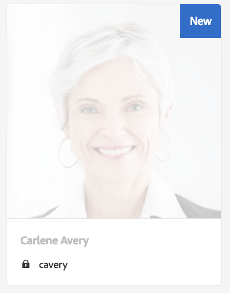

# Gestión de solicitudes de RGPD para la base de AEM{#handling-gdpr-requests-for-the-aem-foundation}

>[!IMPORTANT]
>
>El RGPD se utiliza como ejemplo en las secciones siguientes, pero los detalles cubiertos son aplicables a todas las normas de protección de datos y privacidad; como el RGPD, la CCPA, etc.

## Compatibilidad con RGPD de AEM Foundation {#aem-foundation-gdpr-support}

En el nivel de base de AEM, los datos personales almacenados son el Perfil de usuario. Por lo tanto, la información de este artículo trata principalmente sobre cómo acceder y eliminar perfiles de usuario, para tratar las solicitudes de Acceso y Eliminación del RGPD respectivamente.

## Acceso a un perfil de usuario {#accessing-a-user-profile}

### Pasos manuales {#manual-steps}

1. Abra la consola Administración de usuarios navegando hasta **[!UICONTROL Configuración - Seguridad - Usuarios]** o navegando directamente a `https://<serveraddress>:<serverport>/libs/granite/security/content/useradmin.html`

   

1. A continuación, busque el usuario en cuestión escribiendo el nombre en la barra de búsqueda situada en la parte superior de la página:

   

1. Finalmente, abra el perfil de usuario haciendo clic en él y, a continuación, marque en la pestaña **[!UICONTROL Details]** .

   

### API HTTP {#http-api}

Como ya se ha mencionado, Adobe proporciona API para acceder a los datos de usuario, con el fin de facilitar la automatización. Existen varios tipos de API que puede utilizar:

**API UserProperties**

```shell
curl -u user:password http://localhost:4502/libs/granite/security/search/profile.userproperties.json\?authId\=cavery
```

**API de Sling**

*Descubrimiento del inicio del usuario:*

```xml
curl -g -u user:password 'http://localhost:4502/libs/granite/security/search/authorizables.json?query={"condition":[{"named":"cavery"}]}'
     {"authorizables":[{"type":"user","authorizableId_xss":"cavery","authorizableId":"cavery","name_xss":"Carlene Avery","name":"Carlene Avery","home":"/home/users/we-retail/DSCP-athB1NYLBXvdTuN"}],"total":1}
```

*Recuperación de datos de usuario*

Uso de la ruta del nodo desde la propiedad home de la carga útil JSON devuelta desde el comando anterior:

```shell
curl -u user:password  'http://localhost:4502/home/users/we-retail/DSCP-athB1NYLBXvdTuN/profile.-1.json'
```

```shell
curl -u user:password  'http://localhost:4502/home/users/we-retail/DSCP-athB1NYLBXvdTuN/profiles.-1.json'
```

## Desactivación de un usuario y eliminación de los perfiles asociados {#disabling-a-user-and-deleting-the-associated-profiles}

### Deshabilitar usuario {#disable-user}

1. Abra la consola Administración de usuarios y busque el usuario en cuestión, tal como se ha descrito anteriormente.
1. Pase el ratón sobre el usuario y haga clic en el icono de selección . El perfil cambiará a gris indicando que está seleccionado.

1. Pulse el botón Deshabilitar en el menú superior para deshabilitar al usuario:

   

1. Finalmente, confirme la acción:

   

   A continuación, la interfaz de usuario indicará que el usuario se ha desactivado atenuando y añadiendo un bloqueo a la tarjeta de perfil:

   

### Eliminar información del perfil de usuario {#delete-user-profile-information}

1. Inicie sesión en el CRXDE Lite y luego busque `[!UICONTROL userId]`:

   

1. Abra el nodo de usuario que se encuentra en `[!UICONTROL /home/users]` de forma predeterminada:

   

1. Elimine los nodos de perfil y todos sus elementos secundarios. Existen dos formatos para los nodos de perfil, según la versión de AEM:

   1. El perfil privado predeterminado en `[!UICONTROL /profile]`
   1. `[!UICONTROL /profiles]`, para nuevos perfiles creados con AEM 6.5.

   

### API HTTP {#http-api-1}

Los siguientes procedimientos utilizan la herramienta de línea de comandos `curl` para ilustrar cómo deshabilitar al usuario con la  **[!UICONTROL captura]** `userId` y eliminación de sus perfiles disponibles en la ubicación predeterminada.

* *Descubrimiento de la página principal del usuario*

```shell
curl -g -u user:password 'http://localhost:4502/libs/granite/security/search/authorizables.json?query={"condition":[{"named":"cavery"}]}'
     {"authorizables":[{"type":"user","authorizableId_xss":"cavery","authorizableId":"cavery","name_xss":"Carlene Avery","name":"Carlene Avery","home":"/home/users/we-retail/DSCP-athB1NYLBXvdTuN"}],"total":1}
```

* *Desactivación del usuario*

Uso de la ruta del nodo desde la propiedad home de la carga útil JSON devuelta desde el comando anterior:

```shell
curl -X POST -u user:password -FdisableUser="describe the reasons for disabling this user (GDPR in this case)" 'http://localhost:4502/home/users/we-retail/DSCP-athB1NYLBXvdTuN.rw.userprops.html'
```

* *Eliminación de perfiles de usuario*

Usando la ruta del nodo desde la propiedad principal de la carga útil JSON devuelta desde el comando de detección de cuentas y las ubicaciones de nodos de perfil conocidas fuera de cuadro:

```shell
curl -X POST -u user:password -H "Accept: application/json,**/**;q=0.9" -d ':operation=delete' 'http://localhost:4502/home/users/we-retail/DSCP-athB1NYLBXvdTuN/profile'
```

```shell
curl -X POST -u user:password -H "Accept: application/json,**/**;q=0.9" -d ':operation=delete' 'http://localhost:4502/home/users/we-retail/DSCP-athB1NYLBXvdTuN/profile'
```

