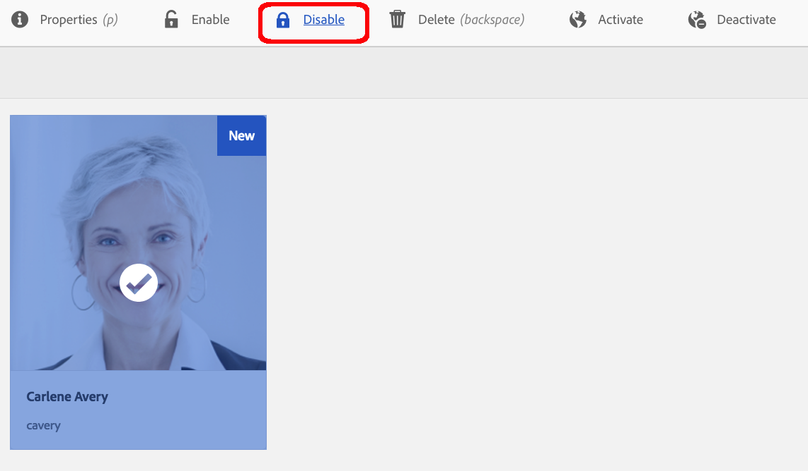

# Tratamiento de solicitudes de RGPD para Adobe Experience Manager AEM (Base de datos de la){#handling-gdpr-requests-for-the-aem-foundation}

>[!IMPORTANT]
>
>El RGPD se utiliza como ejemplo en las secciones siguientes, pero los detalles cubiertos son aplicables a todas las regulaciones de protección de datos y privacidad; como el RGPD, la CCPA, etc.

## AEM Compatibilidad con RGPD de base de {#aem-foundation-gdpr-support}

AEM En el nivel de base de datos de usuario, los datos personales almacenados son el perfil del usuario. Por lo tanto, la información de este artículo aborda principalmente de cómo acceder y eliminar perfiles de usuario, para tratar las solicitudes de Acceso y Eliminación de RGPD respectivamente.

## Acceso a un perfil de usuario {#accessing-a-user-profile}

### Pasos manuales {#manual-steps}

1. Abra la consola Administración de usuarios navegando a **[!UICONTROL Configuración - Seguridad - Usuarios]** o directamente a `https://<serveraddress>:<serverport>/libs/granite/security/content/useradmin.html`

   

1. A continuación, busque el usuario en cuestión escribiendo su nombre en la barra de búsqueda situada en la parte superior de la página:

   

1. Por último, abra el perfil de usuario haciendo clic en él y, a continuación, mire en la pestaña **[!UICONTROL Detalles]**.

   

### API del HTTP {#http-api}

Como ya se ha mencionado, Adobe proporciona las API para acceder a los datos de usuario, para facilitar la automatización. Existen varios tipos de API que puede utilizar:

**API UserProperties**

```shell
curl -u user:password http://localhost:4502/libs/granite/security/search/profile.userproperties.json\?authId\=cavery
```

**API Sling**

*Descubrimiento del inicio del usuario:*

```xml
curl -g -u user:password 'http://localhost:4502/libs/granite/security/search/authorizables.json?query={"condition":[{"named":"cavery"}]}'
     {"authorizables":[{"type":"user","authorizableId_xss":"cavery","authorizableId":"cavery","name_xss":"Carlene Avery","name":"Carlene Avery","home":"/home/users/we-retail/DSCP-athB1NYLBXvdTuN"}],"total":1}
```

*Recuperando datos de usuario*

Uso de la ruta del nodo desde la propiedad del inicio de la carga útil JSON devuelta desde el comando anterior:

```shell
curl -u user:password  'http://localhost:4502/home/users/we-retail/DSCP-athB1NYLBXvdTuN/profile.-1.json'
```

```shell
curl -u user:password  'http://localhost:4502/home/users/we-retail/DSCP-athB1NYLBXvdTuN/profiles.-1.json'
```

## Desactivación de un usuario y eliminación de los perfiles asociados {#disabling-a-user-and-deleting-the-associated-profiles}

### Desactivación de un usuario {#disable-user}

1. Abra la consola Administración de usuarios y busque el usuario en cuestión, tal como se ha descrito anteriormente.
1. Pase el ratón sobre el usuario y haga clic en el icono de selección. El perfil se vuelve gris para indicar que está seleccionado.

1. Pulse el botón Desactivar en el menú superior para desactivar el usuario:

   

1. Finalmente, confirme la acción:

   

   La interfaz de usuario indica que el usuario está desactivado atenuando y añadiendo un candado a la tarjeta del perfil:

   

### Eliminación de información del perfil de usuario {#delete-user-profile-information}

1. Inicie sesión en el CRXDE Lite y luego busque `[!UICONTROL userId]`:

   

1. Abra el nodo de usuario que se encuentra en `[!UICONTROL /home/users]` de forma predeterminada:

   

1. Elimine los nodos de perfil y todos sus elementos secundarios. AEM Existen dos formatos para los nodos de perfil, según la versión de la:

   1. El perfil privado predeterminado bajo `[!UICONTROL /profile]`
   1. AEM `[!UICONTROL /profiles]`, para los nuevos perfiles creados con la versión 6.5 de la.

   

### API del HTTP {#http-api-1}

Los siguientes procedimientos utilizan la herramienta de línea de comandos `curl` para ilustrar cómo deshabilitar al usuario con la **[!UICONTROL captura]** `userId` y eliminar perfiles de `cavery` que están disponibles en la ubicación predeterminada.

* *Descubriendo el inicio del usuario*

```shell
curl -g -u user:password 'http://localhost:4502/libs/granite/security/search/authorizables.json?query={"condition":[{"named":"cavery"}]}'
     {"authorizables":[{"type":"user","authorizableId_xss":"cavery","authorizableId":"cavery","name_xss":"Carlene Avery","name":"Carlene Avery","home":"/home/users/we-retail/DSCP-athB1NYLBXvdTuN"}],"total":1}
```

* *Deshabilitando el usuario*

Uso de la ruta del nodo desde la propiedad del inicio de la carga útil JSON devuelta desde el comando anterior:

```shell
curl -X POST -u user:password -FdisableUser="describe the reasons for disabling this user (GDPR in this case)" 'http://localhost:4502/home/users/we-retail/DSCP-athB1NYLBXvdTuN.rw.userprops.html'
```

* *Eliminación de perfiles de usuario*

Usando la ruta del nodo desde la propiedad del inicio de la carga útil JSON devuelta desde el comando de detección de cuentas y las ubicaciones de nodos de perfil conocidas fuera de cuadro:

```shell
curl -X POST -u user:password -H "Accept: application/json,**/**;q=0.9" -d ':operation=delete' 'http://localhost:4502/home/users/we-retail/DSCP-athB1NYLBXvdTuN/profile'
```

```shell
curl -X POST -u user:password -H "Accept: application/json,**/**;q=0.9" -d ':operation=delete' 'http://localhost:4502/home/users/we-retail/DSCP-athB1NYLBXvdTuN/profile'
```
