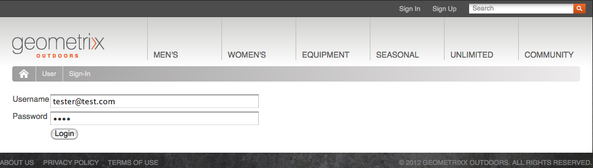
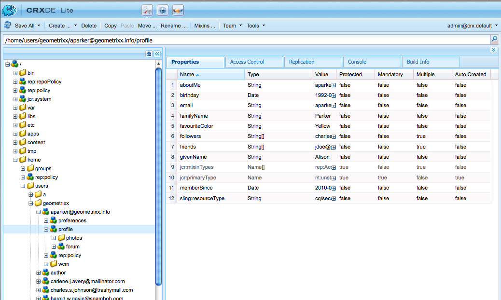

# Administración de identidades{#identity-management}

Los visitantes individuales de su sitio Web sólo se pueden identificar cuando usted les permite iniciar sesión. Existen varias razones por las que puede que desee proporcionar una capacidad de inicio de sesión:

* [Comunidades](/help/communities/overview.md)de AEMs los visitantes del sitio deben iniciar sesión para publicar contenido en la comunidad.
* [Grupos de usuarios cerrados](/help/sites-administering/cug.md)

   Es posible que tenga que limitar el acceso a su sitio Web (o secciones de éste) a visitantes específicos.

* [Personalización](/help/sites-administering/personalization.md) que permite a los visitantes configurar determinados aspectos de cómo acceden al sitio web.

La funcionalidad de inicio de sesión (y cierre) la proporciona una [cuenta con un **perfil **](#profiles-and-user-accounts), que contiene información adicional sobre el visitante registrado (usuario). Los procesos reales de registro y autorización pueden diferir:

* Registro propio del sitio web

   Se puede configurar un sitio [de](/help/communities/sites-console.md) comunidad para permitir que los visitantes se automatriculen o inicien sesión con sus cuentas de Facebook o Twitter.

* Solicitud de registro en el sitio web

   Para un grupo de usuarios cerrado, puede permitir que los visitantes soliciten el registro, pero exigir la autorización mediante un flujo de trabajo.

* Registrar cada cuenta desde el entorno de creación

   Si tiene un pequeño número de perfiles, que de todos modos necesitarán autorización, puede decidir registrar cada uno directamente.

Para permitir que los visitantes se registren, se puede utilizar una serie de componentes y formularios para recopilar la información de identificación requerida y, a continuación, la información adicional (a menudo opcional) del perfil. Una vez registrados, también deben poder comprobar y actualizar los datos que han enviado.

Se puede configurar o desarrollar funcionalidad adicional:

* Configure cualquier replicación inversa necesaria.
* Permita que un usuario elimine su perfil mediante el desarrollo de un formulario junto con un flujo de trabajo.

>[!NOTE]
>
>La información especificada en el perfil también se puede utilizar para proporcionar al usuario contenido de destino mediante [segmentos](/help/sites-administering/campaign-segmentation.md) y [campañas](/help/sites-classic-ui-authoring/classic-personalization-campaigns.md).

## Formularios de registro {#registration-forms}

Se puede utilizar un [formulario](/help/sites-authoring/default-components.md#form-component) para recopilar la información de registro y, a continuación, generar la cuenta y el perfil nuevos.

Por ejemplo, los usuarios pueden solicitar un nuevo perfil mediante la página Geometrixx`http://localhost:4502/content/geometrixx-outdoors/en/user/register.html`


Al enviar la solicitud, se abre la página de perfil donde el usuario puede proporcionar datos personales.


La nueva cuenta también está visible en la consola [Usuarios](/help/sites-administering/security.md).

## Inicio de sesión {#login}

El componente de inicio de sesión puede utilizarse para recopilar la información de inicio de sesión y, a continuación, activar el proceso de inicio de sesión.

Esto proporciona al visitante los campos estándar **Nombre de usuario** y **Contraseña**, con un botón de **inicio de sesión** para activar el proceso de inicio de sesión cuando se introducen las credenciales.

Por ejemplo, los usuarios pueden iniciar sesión o crear una cuenta nueva mediante la opción **Iniciar sesión** en la barra de herramientas de Geometrixx, que utiliza la página:

`http://localhost:4502/content/geometrixx-outdoors/en/user/sign-in.html`



## Cerrar sesión {#logging-out}

Como existe un mecanismo de inicio de sesión, también se requiere un mecanismo de cierre de sesión. Esta opción está disponible como opción **Cerrar sesión** en Geometrixx.

## Visualización y actualización de un perfil {#viewing-and-updating-a-profile}

Según el formulario de registro, el visitante puede tener información registrada en su perfil. Deberían poder ver y/o actualizar esto más adelante. Esto se puede hacer con una forma similar; por ejemplo, en Geometrixx:

```
http://localhost:4502/content/geometrixx-outdoors/en/user/profile.html
```

Para ver los detalles de su perfil, haga clic en **Mi perfil** en la esquina superior derecha de cualquier página; por ejemplo, con la `admin` cuenta:
`http://localhost:4502/home/users/a/admin/profile.form.html/content/geometrixx-outdoors/en/user/profile.html.`

Puede ver otro perfil utilizando el contexto [de](/help/sites-administering/client-context.md) cliente (en el entorno de creación y con privilegios suficientes):

1. Abra una página; por ejemplo, la página Geometrixx:

   `http://localhost:4502/cf#/content/geometrixx/en.html`

1. Haga clic en **Mi perfil** en la esquina superior derecha. Verá el perfil de su cuenta corriente; por ejemplo, el administrador.
1. Pulse **control-alt-C** para abrir el contexto de cliente.
1. En la esquina superior izquierda del contexto de cliente, haga clic en el botón **Cargar un perfil** .

   

1. Seleccione otro perfil en la lista desplegable de la ventana de diálogo; por ejemplo, **Alison Parker**.
1. Haga clic en **Aceptar**.
1. Haga clic de nuevo en **Mi perfil**. El formulario se actualizará con los detalles de Alison.

   

1. Ahora puede utilizar **Editar perfil** o **Cambiar contraseña** para actualizar los detalles.

## Adición de campos a la definición del perfil {#adding-fields-to-the-profile-definition}

Puede agregar campos a la definición del perfil. Por ejemplo, para agregar un campo &quot;Color favorito&quot; al perfil de Geometrixx:

1. Desde la consola Sitios web, vaya a Geometrixx Outdoors Site > Inglés > Usuario > Mi perfil.
1. Haga doble clic en la página **Mi perfil** para abrirla y editarla.
1. En la ficha **Componentes** de la barra de tareas, expanda la sección **Formulario** .
1. Arrastre una lista **desplegable** de la barra de tareas al formulario, justo debajo del campo **Acerca de mí** .
1. Haga doble clic en el componente Lista **** desplegable para abrir el cuadro de diálogo y especificar:

   * **Nombre de elemento** - `favoriteColor`
   * **Título** - `Favorite Color`
   * **Elementos** : agregue varios colores como elementos
   Haga clic en **Aceptar** para guardar.

1. Cierre la página y vuelva a la consola **Sitios** web y active la página Mi perfil.

   La próxima vez que vea un perfil, puede seleccionar un color favorito:

   

   El campo se guardará en la sección de **perfil** de la cuenta de usuario correspondiente:

   

## Estados de perfil {#profile-states}

Hay varios casos de uso que requieren saber si un usuario (o más bien su perfil) está en un estado ** específico o no.

Esto implica definir una propiedad adecuada en el perfil del usuario de manera que:

* es visible y accesible para el usuario
* define dos estados para cada propiedad
* permite alternar entre los dos estados definidos

Esto se lleva a cabo con:

* [Proveedores estatales](#state-providers)

   Para administrar los dos estados de una propiedad específica y las transiciones entre los dos.

* [Flujos de trabajo](#workflows)

   Para administrar acciones relacionadas con los estados.

Se pueden definir varios estados; por ejemplo, en Geometrixx se incluyen:

* suscripción (o cancelación de la suscripción) a notificaciones en newsletters o hilos de comentarios
* adición y eliminación de una conexión con un amigo

### Proveedores estatales {#state-providers}

Un proveedor de estado administra el estado actual de la propiedad en cuestión, junto con las transiciones entre los dos estados posibles.

Los proveedores de estado se implementan como componentes, por lo que se pueden personalizar para el proyecto. En Geometrixx se incluyen:

* Suscribirse/cancelar suscripción de tema de foro
* Agregar/eliminar amigo

### Flujos de trabajo {#workflows}

Los proveedores de estado administran una propiedad de perfil y sus estados.

Se necesita un flujo de trabajo para implementar las acciones relacionadas con los estados. Por ejemplo, al suscribirse a notificaciones, el flujo de trabajo gestionará la acción de suscripción real; al cancelar la suscripción de las notificaciones, el flujo de trabajo gestionará la eliminación del usuario de la lista de suscripción.

## Perfiles y cuentas de usuario {#profiles-and-user-accounts}

Los perfiles se almacenan en el repositorio de contenido como parte de[la cuenta](/help/sites-administering/user-group-ac-admin.md)de usuario.

El perfil se encuentra en `/home/users/geometrixx`:


En una instalación estándar (autor o publicación), todos tienen acceso de lectura a toda la información de perfil de todos los usuarios. todos son un grupo *integrado que contiene automáticamente todos los usuarios y grupos existentes. La lista de miembros no se puede editar*&quot;.

Estos derechos de acceso están definidos por la siguiente ACL comodín:

/home todos permiten jcr:read rep:glob = */profile*

Esto permite:

* foro, comentarios o anuncios de blog para mostrar información (como icono o nombre completo) del perfil apropiado
* vínculos a páginas de perfil de geometrixx

Si dicho acceso no es apropiado para su instalación, puede cambiar esta configuración predeterminada.

Esto se puede realizar mediante la ficha Control **[de](/help/sites-administering/user-group-ac-admin.md#access-right-management)**acceso:


## Componentes de perfil {#profile-components}

También hay una serie de componentes de perfil disponibles para definir los requisitos de perfil del sitio.

### Campo de contraseña activado {#checked-password-field}

Este componente proporciona dos campos para:

* La introducción de una contraseña.
* Una verificación para confirmar que la contraseña se ha escrito correctamente.

Con la configuración predeterminada el componente aparecerá del modo siguiente:


### Fotografía de avatar de perfil {#profile-avatar-photo}

Este componente proporciona al usuario un mecanismo para seleccionar y cargar un archivo de fotografía de avatar.


### Nombre detallado de perfil {#profile-detailed-name}

Ese componente permite que usuario introduzca un nombre detallado.


### Género de perfil {#profile-gender}

Este componente permite al usuario introducir su sexo.


