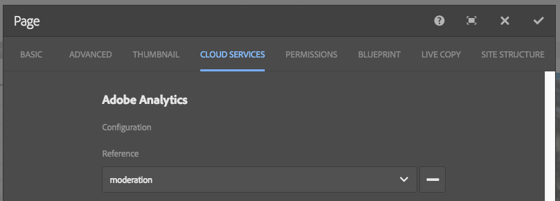

# Integración de páginas de aterrizaje con Adobe Analytics{#integrating-landing-pages-with-adobe-analytics}

AEM ha integrado la solución de páginas de aterrizaje con [Adobe Analytics](https://www.omniture.com/en/products/analytics/sitecatalyst) mediante los siguientes componentes de llamada a acción:

1. Componente de pulsaciones
1. Componente de vínculo gráfico

Estos componentes exponen ciertos atributos que se pueden asignar mediante variables de Adobe Analytics (tráfico, variables de conversión) y eventos de éxito para enviar información a Adobe Analytics.

## Requisitos previos {#prerequisites}

Adobe recomienda pasar por el [integración AEM-Adobe Analytics existente](/help/sites-administering/adobeanalytics.md) para comprender cómo funciona esta integración.

## Componentes que se pueden asignar {#components-available-for-mapping}

En AEM, la variable **Llamada a acción** componentes - **ClickThroughLink** y **GraphicalLink** - mostrado aquí en la barra de tareas, se puede asignar a variables de Adobe Analytics.

### Asignación de componentes de la página de aterrizaje a Adobe Analytics {#mapping-landing-page-components-to-adobe-analytics}

Para asignar componentes de página de aterrizaje a Adobe Analytics:

1. Después de crear la configuración de Adobe Analytics y crear una nueva estructura, seleccione el grupo de informes correspondiente en el menú desplegable. Esto hace que se recuperen las variables de Adobe Analytics y se muestren en el buscador de contenido.
1. Arrastre los componentes de llamada a acción de la barra de tareas y suéltelos en el área de asignación situada en la parte central de la página, como convenga.

<table>
 <tbody>
  <tr>
   <td><strong>Nombre del componente</strong></td>
   <td><strong>Atributos expuestos</strong></td>
   <td><strong>Significado del atributo</strong></td>
  </tr>
  <tr>
   <td><strong>Llamada a acción: vínculo de pulsaciones</strong></td>
   <td><i>eventdata.clickthroughLinkLabel</i>   </td>
   <td>La etiqueta en el vínculo o el texto del vínculo </td>
  </tr>
  <tr>
   <td>  </td>
   <td><i>eventdata.clickthroughLinkTarget</i>   </td>
   <td>Destino al que se dirigirá cuando haga clic en el vínculo </td>
  </tr>
  <tr>
   <td>  </td>
   <td><i>eventdata.events.clickLinkClick</i>   </td>
   <td>Evento de clic </td>
  </tr>
  <tr>
   <td><strong>Llamada a acción: vínculo gráfico</strong></td>
   <td><i>eventdata.clicktroughImageLabel</i>   </td>
   <td>Título de la imagen de llamada a acción </td>
  </tr>
  <tr>
   <td>  </td>
   <td><i>eventdata.clicktroughImageTarget</i>   </td>
   <td>Destino al que se dirigirá el usuario cuando haga clic en la imagen que contenga un vínculo</td>
  </tr>
  <tr>
   <td>  </td>
   <td><i>eventdata.clicktroughImageAsset</i>   </td>
   <td>Ruta al recurso de imagen en el repositorio </td>
  </tr>
  <tr>
   <td>  </td>
   <td><i>eventdata.events.clicktroughImageClick</i>   </td>
   <td>Evento de clic</td>
  </tr>
 </tbody>
</table>

1. Asigne estos atributos expuestos con cualquier variable de Adobe Analytics desde Content Finder. El marco ya está listo para utilizarse.
1. Ahora puede crear una nueva página de aterrizaje o abrir una página de aterrizaje existente con componentes de llamada a acción existentes y hacer clic en **Cloud Services** en **Propiedades de página** en la barra de tareas (en la IU táctil, seleccione **Abrir propiedades** y haga clic en **Cloud Services**) y configure el marco que se utilizará con la página de aterrizaje. Seleccione la estructura de la lista desplegable.

   

1. Después de configurar la estructura con la página de aterrizaje, ahora puede utilizar los componentes instrumentados y cualquier clic en CTA se registra en Adobe Analytics.
