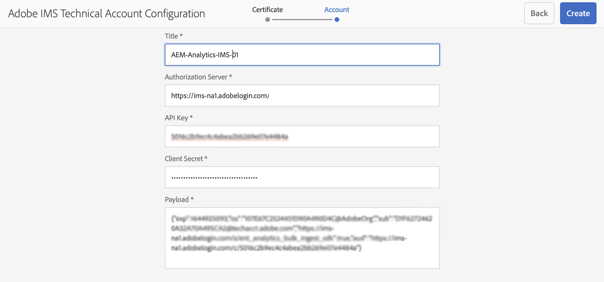

# Integración con Adobe Analytics mediante IMS {#integration-with-adobe-analytics-using-ims}

La integración de AEM con Adobe Analytics mediante la API de Analytics Standard requiere la configuración de Adobe IMS (Identity Management System) mediante la consola de desarrollador de Adobe.

>[!NOTE]
>
>La compatibilidad con la API de Adobe Analytics Standard 2.0 es nueva en AEM 6.5.12.0. Esta versión de la API admite la autenticación IMS.
>
>El uso de la API 1.4 de Adobe Analytics Classic en AEM sigue siendo compatible con versiones anteriores. La variable [La API de Analytics Classic utiliza la autenticación de credenciales de usuario](/help/sites-administering/adobeanalytics-connect.md).
>
>La selección de la API se basa en el método de autenticación utilizado para la integración de AEM/Analytics.
>
>También puede obtenerse más información en [Migración a las API 2.0](https://developer.adobe.com/analytics-apis/docs/2.0/guides/migration/).

## Requisitos previos {#prerequisites}

Antes de iniciar este procedimiento:

* [Compatibilidad con Adobe](https://helpx.adobe.com/es/contact/enterprise-support.ec.html) debe aprovisionar su cuenta para:

   * Consola Adobe
   * Adobe Developer Console
   * Adobe Analytics y
   * Adobe IMS (sistema Identity Management)

* El administrador del sistema de su organización debe utilizar el Admin Console para agregar los desarrolladores necesarios de su organización a los perfiles de producto relevantes.

   * Esto proporciona a los desarrolladores específicos permisos para habilitar integraciones dentro de la consola del desarrollador de Adobe.
   * Para obtener más información, consulte [Administrar desarrolladores](https://helpx.adobe.com/enterprise/admin-guide.html/enterprise/using/manage-developers.ug.html).

## Configuración de IMS: generación de una clave pública {#configuring-an-ims-configuration-generating-a-public-key}

El primer paso de la configuración es crear una configuración de IMS en AEM y generar la clave pública.

1. En AEM, abra el **Herramientas** para abrir el Navegador.
1. En el **Seguridad** sección seleccionar **Configuraciones de IMS de Adobe**.
1. Select **Crear** para abrir el **Configuración de cuenta técnica de Adobe IMS**.
1. Uso de la lista desplegable debajo de **Configuración de nube**, seleccione **Adobe Analytics**.
1. Activar **Crear nuevo certificado** e introduzca un nuevo alias.
1. Confirme con **Crear certificado**.

   

1. Select **Descargar** (o **Descargar clave pública**) para descargar el archivo en la unidad local, de modo que esté listo para usar cuando [configuración de IMS para la integración de Adobe Analytics con AEM](#configuring-ims-for-adobe-analytics-integration-with-aem).

   >[!CAUTION]
   >
   >Mantenga esta configuración abierta, será necesaria de nuevo cuando [Finalización de la configuración de IMS en AEM](#completing-the-ims-configuration-in-aem).

   

## Configuración de IMS para la integración de Adobe Analytics con AEM {#configuring-ims-for-adobe-analytics-integration-with-aem}

Con la consola de desarrollador de Adobe, debe crear un proyecto (integración) con Adobe Analytics (para AEM uso) y, a continuación, asignar los privilegios necesarios.

### Creación del proyecto {#creating-the-project}

Abra Adobe Developer Console para crear un proyecto con Adobe Analytics que AEM:

1. Abra Adobe Developer Console para proyectos:

   [https://developer.adobe.com/console/projects](https://developer.adobe.com/console/projects)

1. Se mostrarán todos los proyectos que tenga. Select **Crear nuevo proyecto** - la ubicación y el uso dependerán de:

   * Si todavía no tiene ningún proyecto, **Crear nuevo proyecto** estará en el centro, abajo.
      
   * Si ya tiene proyectos existentes, estos se enumerarán y **Crear nuevo proyecto** estará en la parte superior derecha.
      

1. Select **Agregar a proyecto** seguido de **API**:

   

1. Select **Adobe Analytics**, luego **Siguiente**:

   >[!NOTE]
   >
   >Si está suscrito a Adobe Analytics, pero no lo ve en la lista, debe comprobar la variable [Requisitos previos](#prerequisites).

   

1. Select **Cuenta de servicio (JWT)** como tipo de autenticación, continúe con **Siguiente**:

   

1. **Cargar la clave pública** y, cuando se complete, continúe con **Siguiente**:

   

1. Revise las credenciales y continúe con **Siguiente**:

   

1. Seleccione los perfiles de producto necesarios y continúe con **Guardar la API configurada**:

   

1. La configuración se confirmará.

### Asignación de privilegios a la integración {#assigning-privileges-to-the-integration}

Ahora debe asignar los privilegios necesarios a la integración:

1. Abra el Adobe **Admin Console**:

   * [https://adminconsole.adobe.com](https://adminconsole.adobe.com/)

1. Vaya a **Productos** (barra de herramientas superior) y, a continuación, seleccione **Adobe Analytics: &lt;*your-tenant-id*>** (del panel izquierdo).
1. Select **Perfiles de producto** y, a continuación, el espacio de trabajo necesario de la lista presentada. Por ejemplo, Espacio de trabajo predeterminado.
1. Select **Credenciales de API**, luego la configuración de integración requerida.
1. Select **Editor** como el **Función del producto**; en lugar de **Observador**.

## Detalles almacenados para el proyecto de integración de Adobe Developer Console {#details-stored-for-the-ims-integration-project}

Desde la consola Proyectos para desarrolladores de Adobe puede ver una lista de todos sus proyectos de integración:

* [https://developer.adobe.com/console/projects](https://developer.adobe.com/console/projects)

Seleccione una entrada de proyecto específica para mostrar más detalles sobre la configuración. Entre estas características se incluyen:

* Información general del proyecto
* Perspectivas
* Credenciales
   * Cuenta de servicio (JWT)
      * Detalles de la credencial
      * Generar JWT
* API
   * Por ejemplo, Adobe Analytics

En algunos de estos casos, deberá completar la integración de Adobe Analytics en AEM.

## Finalización de la configuración de IMS en AEM {#completing-the-ims-configuration-in-aem}

Al volver a AEM puede completar la configuración de IMS añadiendo los valores necesarios del proyecto de integración para Analytics:

1. Vuelva a la [Configuración de IMS abierta en AEM](#configuring-an-ims-configuration-generating-a-public-key).
1. Seleccione **Siguiente**.

1. Aquí puede usar la variable [Detalles almacenados para el proyecto de integración de Adobe Developer Console](#details-stored-for-the-ims-integration-project):

   * **Título**: El texto.
   * **Servidor de autorización**: Copie/pegue esto desde el `aud` línea del **Carga útil** a continuación, p. ej. `https://ims-na1.adobelogin.com` en el ejemplo siguiente
   * **Clave de API**: Copie esto desde el **Credenciales** de la sección [Información general del proyecto](#details-stored-for-the-ims-integration-project)
   * **Secreto del cliente**: Genere esto en el [Pestaña Secreto del cliente de la sección Cuenta de servicio (JWT)](#details-stored-for-the-ims-integration-project)y copie
   * **Carga útil**: Copie esto desde el [Ficha Generar JWT de la sección Cuenta de servicio (JWT)](#details-stored-for-the-ims-integration-project)

   

1. Confirme con **Crear**.

1. La configuración de Adobe Analytics se mostrará en la consola AEM.

   

## Confirmación de la configuración de IMS {#confirming-the-ims-configuration}

Para confirmar que la configuración funciona según lo esperado:

1. Abra:

   * `https://localhost<port>/libs/cq/adobeims-configuration/content/configurations.html`

   Por ejemplo:

   * `https://localhost:4502/libs/cq/adobeims-configuration/content/configurations.html`

1. Seleccione la configuración.
1. Select **Comprobar estado** en la barra de herramientas, seguido de **Marque**.

   

1. Si se realiza correctamente, verá un mensaje de confirmación.

## Configuración del servicio Adobe Analytics Cloud {#configuring-the-adobe-analytics-cloud-service}

Ahora se puede hacer referencia a la configuración para que un Cloud Service utilice la API de Analytics Standard:

1. Abra el **Herramientas** para abrir el Navegador. A continuación, dentro de la función **Cloud Services** , seleccione **Cloud Services heredados**.
1. Desplácese hacia abajo hasta **Adobe Analytics** y seleccione **Configurar ahora**.

   La variable **Crear configuración** se abrirá.

1. Escriba un **Título** y, si lo desea, una **Nombre** (si se deja en blanco, esto se generará a partir del título).

   También puede seleccionar la plantilla necesaria (si hay más de una disponible).

1. Confirme con **Crear**.

   La variable **Editar componente** se abrirá.

1. Introduzca los detalles en la **Configuración de análisis** pestaña:

   * **Autenticación**: IMS

   * **Configuración de IMS**: seleccione el nombre de la configuración de IMS

1. Haga clic en **Conectarse a Analytics** para inicializar la conexión con Adobe Analytics.

   Si la conexión se realiza correctamente, aparecerá el mensaje **Conexión correcta** se muestra.

1. Select **OK** en el mensaje.

1. Complete otros parámetros según sea necesario, seguido de **OK** en el cuadro de diálogo para confirmar la configuración.

1. Ahora puede continuar con [Adición de un marco de Analytics](/help/sites-administering/adobeanalytics-connect.md) para configurar los parámetros que se enviarán a Adobe Analytics.
