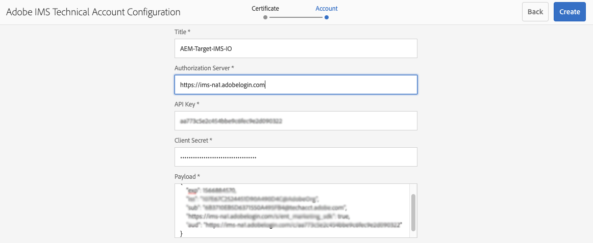

# Integración con Adobe Target mediante Adobe I/O{#integration-with-adobe-target-using-adobe-i-o}

La integración de AEM con Adobe Target mediante la API de Target Standard requiere la configuración de Adobe IMS (Identity Management System) y Adobe I/O.

>[!NOTE]
>
>La compatibilidad con la API de Adobe Target Standard es nueva en AEM 6.5. La API de Target Standard utiliza la autenticación IMS.
>
>El uso de la API de Adobe Target Classic en AEM sigue siendo compatible con versiones anteriores. La [API de Target Classic utiliza la autenticación de credenciales de usuario](/help/sites-administering/target-configuring.md#manually-integrating-with-adobe-target).
>
>La selección de la API se basa en el método de autenticación utilizado para la integración AEM/Target.
>Consulte también la sección [ID de inquilino y código de cliente](#tenant-client) .

## Requisitos previos {#prerequisites}

Antes de iniciar este procedimiento:

* [El ](https://helpx.adobe.com/es/contact/enterprise-support.ec.html) soporte de Adobe debe aprovisionar su cuenta para:

   * Consola Adobe
   * Adobe I/O
   * Adobe Target y
   * Adobe IMS (sistema Identity Management)

* El administrador del sistema de su organización debe utilizar el Admin Console para agregar los desarrolladores necesarios de su organización a los perfiles de producto relevantes.

   * Esto proporciona a los desarrolladores específicos permisos para habilitar integraciones dentro de Adobe I/O.
   * Para obtener más información, consulte [Administrar desarrolladores](https://helpx.adobe.com/enterprise/admin-guide.html/enterprise/using/manage-developers.ug.html).

## Configuración de IMS: generación de una clave pública {#configuring-an-ims-configuration-generating-a-public-key}

El primer paso de la configuración es crear una configuración de IMS en AEM y generar la clave pública.

1. En AEM, abra el menú **Tools**.
1. En la sección **Security** seleccione **Configuraciones de Adobe IMS**.
1. Seleccione **Crear** para abrir la **Configuración de cuenta técnica de Adobe IMS**.
1. Con la lista desplegable en **Cloud Configuration**, seleccione **Adobe Target**.
1. Active **Crear nuevo certificado** e introduzca un nuevo alias.
1. Confirme con **Crear certificado**.

   

1. Seleccione **Descargar** (o **Descargar clave pública**) para descargar el archivo en la unidad local, de modo que esté listo para usar cuando [configure el Adobe I/O para la integración de Adobe Target con AEM](#configuring-adobe-i-o-for-adobe-target-integration-with-aem).

   >[!CAUTION]
   >
   >Mantenga esta configuración abierta, será necesaria de nuevo cuando [complete la configuración de IMS en AEM](#completing-the-ims-configuration-in-aem).

   

## Configuración del Adobe I/O para la integración de Adobe Target con AEM {#configuring-adobe-i-o-for-adobe-target-integration-with-aem}

Debe crear el proyecto de Adobe I/O (integración) con Adobe Target que AEM utilizará y, a continuación, asignar los privilegios necesarios.

### Creación del proyecto {#creating-the-project}

Abra la consola Adobe I/O para crear un proyecto de E/S con Adobe Target que AEM usar:

>[!NOTE]
>
>Consulte también los [tutoriales de Adobe I/O](https://www.adobe.io/apis/experienceplatform/home/tutorials/alltutorials.html).

1. Abra la consola Adobe I/O para proyectos:

   [https://console.adobe.io/projects](https://console.adobe.io/projects)

1. Se mostrarán todos los proyectos que tenga. Seleccione **Crear nuevo proyecto**: la ubicación y el uso dependerán de:

   * Si todavía no tiene ningún proyecto, **Crear nuevo proyecto** será central, inferior.
      
   * Si ya tiene proyectos existentes, estos se enumerarán y **Crear nuevo proyecto** estará en la parte superior derecha.
      

1. Seleccione **Agregar al proyecto** seguido de **API**:

   

1. Seleccione **Adobe Target** y luego **Siguiente**:

   >[!NOTE]
   >
   >Si está suscrito a Adobe Target, pero no lo ve en la lista, debe comprobar los [Requisitos previos](#prerequisites).

   

1. **Cargue la clave** pública y, cuando termine, continúe con  **Siguiente**:

   

1. Revise las credenciales y continúe con **Siguiente**:

   

1. Seleccione los perfiles de producto necesarios y continúe con **Guardar API configurada**:

   >[!NOTE]
   >
   >Los perfiles de producto mostrados con dependen de si tiene:
   >
   >* Adobe Target Standard: solo está disponible **Espacio de trabajo predeterminado**
   >* Adobe Target Premium : se enumeran todos los espacios de trabajo disponibles, como se muestra a continuación

   

1. La creación se confirmará.

<!--
1. The creation will be confirmed, you can now **Continue to integration details**; these are needed for [Completing the IMS Configuration in AEM](#completing-the-ims-configuration-in-aem).

   
-->

### Asignación de privilegios a la integración {#assigning-privileges-to-the-integration}

Ahora debe asignar los privilegios necesarios a la integración:

1. Abra el Adobe **Admin Console**:

   * [https://adminconsole.adobe.com](https://adminconsole.adobe.com/)

1. Vaya a **Products** (barra de herramientas superior) y, a continuación, seleccione **Adobe Target - &lt;*your-tenant-id*>** (en el panel izquierdo).
1. Seleccione **Product Profiles** y, a continuación, el espacio de trabajo necesario de la lista presentada. Por ejemplo, Espacio de trabajo predeterminado.
1. Seleccione **Integrations** y, a continuación, la configuración de integración requerida.
1. Seleccione **Editor** como **Product Role**; en lugar de **Observador**.

## Detalles almacenados para el proyecto de integración de Adobe I/O {#details-stored-for-the-adobe-io-integration-project}

Desde la consola Proyectos de Adobe I/O puede ver una lista de todos sus proyectos de integración:

* [https://console.adobe.io/projects](https://console.adobe.io/projects)

Seleccione **View** (a la derecha de una entrada de proyecto específica) para mostrar más detalles sobre la configuración. Entre estas características se incluyen:

* Información general del proyecto
* Perspectivas
* Credenciales
   * Cuenta de servicio (JWT)
      * Detalles de la credencial
      * Generar JWT
* API
   * Por ejemplo, Adobe Target

En algunos de estos casos, deberá completar la integración de Adobe I/O para Target en AEM.

## Finalización de la configuración de IMS en AEM {#completing-the-ims-configuration-in-aem}

Al volver a AEM puede completar la configuración de IMS añadiendo los valores necesarios desde la integración de Adobe I/O para Target:

1. Vuelva a la [configuración de IMS abierta en AEM](#configuring-an-ims-configuration-generating-a-public-key).
1. Seleccione **Siguiente**.

1. Aquí puede usar los [detalles del Adobe I/O](#details-stored-for-the-adobe-io-integration-project):

   * **Título**: El texto.
   * **Servidor** de autorización: Copie o pegue esto desde la  `"aud"` línea de la sección  **** Carga útil siguiente, por ejemplo,  `"https://ims-na1.adobelogin.com"` en el ejemplo siguiente
   * **Clave de API**: Copie esto desde la   sección Información general de la integración de Adobe I/O para Target
   * **Secreto** del cliente: Genere esto en la   sección Información general de la integración de Adobe I/O para Target y copie
   * **Carga útil**: Copie esto desde la  [sección Generate ](#details-stored-for-the-adobe-io-integration-project) JWT de la integración de Adobe I/O para Target

   

1. Confirme con **Crear**.

1. La configuración de Adobe Target se mostrará en la consola AEM.

   

## Confirmación de la configuración de IMS {#confirming-the-ims-configuration}

Para confirmar que la configuración funciona según lo esperado:

1. Abra:

   * `https://localhost<port>/libs/cq/adobeims-configuration/content/configurations.html`

   Por ejemplo:

   * `https://localhost:4502/libs/cq/adobeims-configuration/content/configurations.html`

1. Seleccione la configuración.
1. Seleccione **Comprobar estado** en la barra de herramientas, seguido de **Comprobar**.

   

1. Si se realiza correctamente, verá el mensaje:

   

## Configuración del Cloud Service de Adobe Target {#configuring-the-adobe-target-cloud-service}

Ahora se puede hacer referencia a la configuración para que un Cloud Service utilice la API de Target Standard:

1. Abra el menú **Tools**. A continuación, en la sección **Cloud Services**, seleccione **Cloud Services heredados**.
1. Desplácese hacia abajo hasta **Adobe Target** y seleccione **Configurar ahora**.

   Se abrirá el cuadro de diálogo **Crear configuración**.

1. Introduzca un **Title** y, si lo desea, un **Name** (si se deja en blanco, esto se generará a partir del título).

   También puede seleccionar la plantilla necesaria (si hay más de una disponible).

1. Confirme con **Crear**.

   Se abrirá el cuadro de diálogo **Editar componente**.

1. Introduzca los detalles en la pestaña **Configuración de Adobe Target**:

   * **Autenticación**: IMS
   * **ID del inquilino**: el ID del inquilino de Adobe IMS. Consulte también la sección [ID de inquilino y código de cliente](#tenant-client) .

      >[!NOTE]
      >
      >Para IMS, este valor debe tomarse del propio Target. Puede iniciar sesión en Target y extraer el ID del inquilino de la dirección URL.
      >
      >Por ejemplo, si la dirección URL es:
      >
      >`https://experience.adobe.com/#/@yourtenantid/target/activities`
      >
      >A continuación, debe utilizar `yourtenantid`.
   * **Código** de cliente: Consulte el ID del  [inquilino y el ](#tenant-client) código del cliente.
   * **Configuración** de IMS: seleccione el nombre de la configuración de IMS
   * **Tipo** de API: REST
   * **Configuración** de A4T Analytics Cloud: Seleccione la configuración de nube de Analytics que se utiliza para las métricas y los objetivos de las actividades de Target. Lo necesita si utiliza Adobe Analytics como fuente de informes al segmentar contenido. Si no ve la configuración de nube, consulte la nota en [Configuración de A4T Analytics Cloud](/help/sites-administering/target-configuring.md#configuring-a-t-analytics-cloud-configuration).
   * **Use objetivos** precisos: De forma predeterminada, esta casilla de verificación está seleccionada. Si se selecciona, la configuración del servicio de nube esperará a que el contexto se cargue antes de cargar el contenido. Véase la nota siguiente.
   * **Sincronizar segmentos desde Adobe Target**: Seleccione esta opción para descargar los segmentos definidos en Target y utilizarlos en AEM. Debe seleccionar esta opción cuando la propiedad Tipo de API sea REST, ya que los segmentos en línea no son compatibles y siempre necesita utilizar segmentos de Target. (Tenga en cuenta que el AEM término &quot;segmento&quot; equivale a la &quot;audiencia&quot; de Target).
   * **Biblioteca de cliente**: Seleccione si desea la biblioteca de cliente AT.js o mbox.js (obsoleto).
   * **Utilice el sistema de Tag Management para entregar la biblioteca** de cliente: Utilice DTM (obsoleto), Launch de Adobe o cualquier otro sistema de administración de etiquetas.
   * **AT.js** personalizado: Deje en blanco si ha marcado la casilla Tag Management o para utilizar el AT.js predeterminado. Como alternativa, cargue su AT.js personalizado. Solo aparece si ha seleccionado AT.js.

   >[!NOTE]
   >
   >[La configuración de un Cloud Service para utilizar la ](/help/sites-administering/target-configuring.md#manually-integrating-with-adobe-target) API de Target Classic ha quedado obsoleta (utiliza la pestaña Configuración de Adobe Recommendations ).
1. Haga clic en **Connect to Target** para inicializar la conexión con Adobe Target.

   Si la conexión se realiza correctamente, aparece el mensaje **Connection success**.

1. Seleccione **OK** en el mensaje, seguido de **OK** en el cuadro de diálogo para confirmar la configuración.
1. Ahora puede continuar con [Agregar un marco de destino](/help/sites-administering/target-configuring.md#adding-a-target-framework) para configurar los parámetros de ContextHub o ClientContext que se enviarán a Target. Tenga en cuenta que esto puede no ser necesario para exportar AEM fragmentos de experiencias a Target.

### ID de inquilino y código de cliente {#tenant-client}

Con [Adobe Experience Manager 6.5.8.0](/help/release-notes/sp-release-notes.md), el campo Código de cliente se había agregado a la ventana de configuración de Target.

Al configurar los campos ID de inquilino y Código de cliente, tenga en cuenta lo siguiente:

1. Para la mayoría de los clientes, el ID del inquilino y el código de cliente son los mismos. Esto significa que ambos campos contienen la misma información y son idénticos. Asegúrese de introducir el ID del inquilino en ambos campos.
2. Para fines heredados, también puede introducir valores diferentes en los campos ID de inquilino y Código de cliente .

En ambos casos, tenga en cuenta que:

* De forma predeterminada, el código de cliente (si se agrega primero) también se copia automáticamente en el campo ID de inquilino.
* Tiene la opción de cambiar el conjunto de ID de inquilino predeterminado.
* En consecuencia, las llamadas de servidor a Target se basarán en el ID del inquilino y las llamadas del lado del cliente a Target se basarán en el código del cliente.

Como se ha indicado anteriormente, el primer caso es el más común para AEM 6.5. De cualquier modo, asegúrese de que **ambos** contienen la información correcta según sus necesidades.

>[!NOTE]
>
> Si desea cambiar una configuración de Target existente:
>
> 1. Vuelva a introducir el ID del inquilino.
> 2. Vuelva a conectarse a Target.
> 3. Guarde la configuración.

