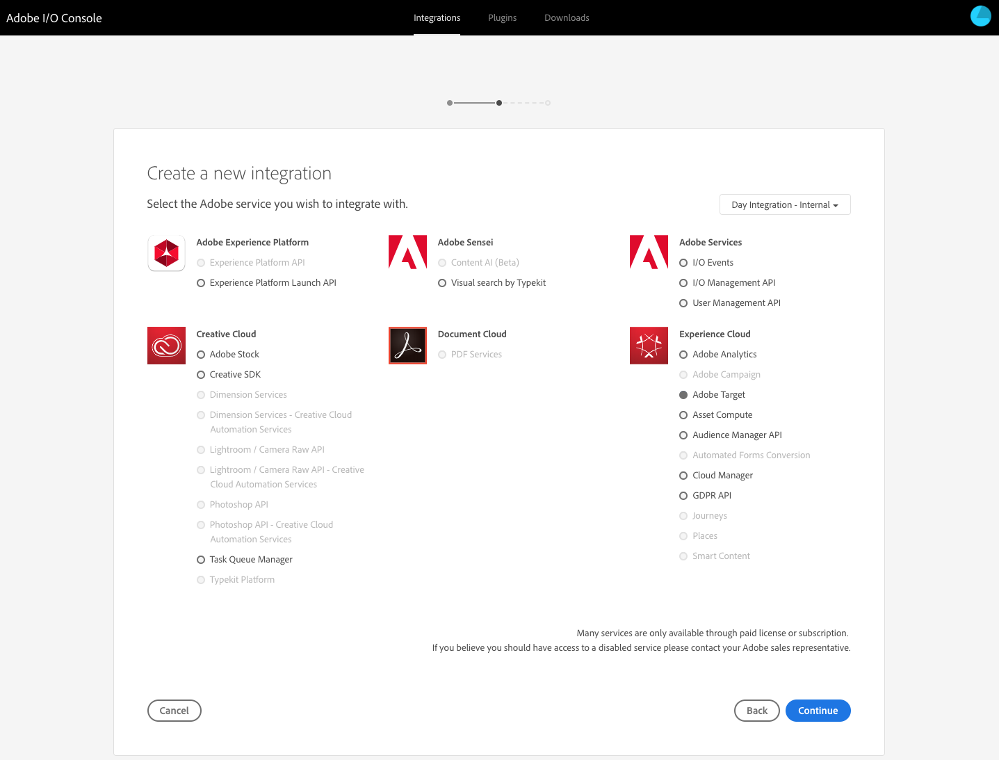
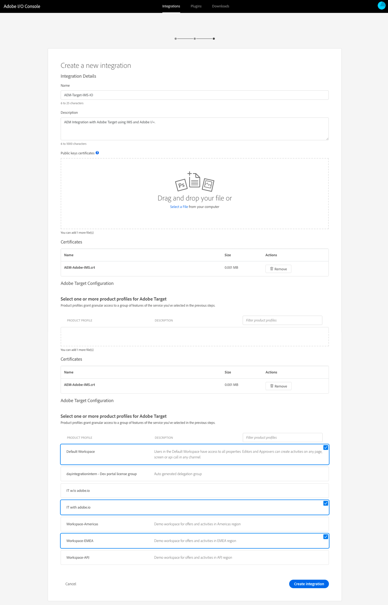

# Integración con Adobe Target mediante Adobe I/O{#integration-with-adobe-target-using-adobe-i-o}

La integración de AEM con Adobe Target a través de la API de Target Standard requiere la configuración de Adobe IMS (Identity Management System) y Adobe I/O.

>[!NOTE]
>
>La compatibilidad con la API de Adobe Target Standard es nueva en AEM 6.5. La API de Target Standard utiliza la autenticación IMS.
>
>El uso de la API de Adobe Target Classic en AEM sigue siendo compatible con versiones anteriores. La API de [Target Classic utiliza la autenticación](/help/sites-administering/target-configuring.md#manually-integrating-with-adobe-target)de credenciales de usuario.
>
>La selección de la API se basa en el método de autenticación utilizado para la integración de AEM/Target.

## Requisitos previos {#prerequisites}

Antes de iniciar este procedimiento, el servicio de asistencia [de](https://helpx.adobe.com/contact/enterprise-support.ec.html) Adobe debe aprovisionar su cuenta para:

* Adobe Console
* Adobe I/O
* Adobe Target y
* Adobe IMS (Identity Management System)

## Configuración de IMS - Generación de una clave pública {#configuring-an-ims-configuration-generating-a-public-key}

La primera etapa de la configuración consiste en crear una configuración de IMS en AEM y generar la clave pública.

1. En AEM, abra el menú **Herramientas** .
1. En la sección **Seguridad** , seleccione Configuraciones de IMS de **Adobe**.
1. Seleccione **Crear** para abrir la configuración **de la cuenta técnica de** Adobe IMS.
1. Con el menú desplegable en Configuración **de** nube, seleccione **Adobe Target**.
1. Active **Crear nuevo certificado** e introduzca un nuevo alias.
1. Confirme con **Crear certificado**.

   

1. Seleccione **Descargar** (o **Descargar clave** pública) para descargar el archivo en la unidad local, de modo que esté listo para utilizarse al [configurar Adobe I/O para la integración de Adobe Target con AEM](#configuring-adobe-i-o-for-adobe-target-integration-with-aem).

   >[!CAUTION]
   >
   >Mantenga esta configuración abierta, será necesaria de nuevo al [completar la configuración de IMS en AEM](#completing-the-ims-configuration-in-aem).

   

## Configuración de Adobe I/O para la integración de Adobe Target con AEM {#configuring-adobe-i-o-for-adobe-target-integration-with-aem}

Debe crear la integración de Adobe I/O con Adobe Target que AEM utilizará y, a continuación, asignar los privilegios necesarios.

### Creación de la integración {#creating-the-integration}

Abra la consola de Adobe I/O para crear una integración de E/S con Adobe Target que AEM utilizará:

>[!NOTE]
>
>Consulte también los tutoriales [de E/S de](https://www.adobe.io/apis/experienceplatform/home/tutorials/alltutorials.html)Adobe.

1. Abra la consola de Adobe I/O para integraciones:

   * [https://console.adobe.io/integrations](https://console.adobe.io/integrations)

1. Seleccione **Nueva integración**:

   >[!NOTE]
   >
   >Si ya tiene integraciones existentes, se enumerarán y el botón **Nueva integración** estará en la parte superior derecha.

   

1. Seleccione **Acceder a una API** seguida de **Continuar**:

   

1. Seleccione **Adobe Target** y, a continuación, **continúe**:

   

1. Agregue los detalles necesarios para la configuración de integración:

   * **Nombre**

      Escriba el nombre.

   * **Descripción**

      Una descripción es opcional.

   * **Certificado de clave pública**

      Cargar el archivo de clave pública; tal como se genera en [Configuración de IMS - Generación de una clave](#configuring-an-ims-configuration-generating-a-public-key)pública.

      Una vez cargado, el certificado se incluirá en **Certificados**.

   * **Perfiles de producto**

      Los perfiles de producto equivalen a espacios de trabajo en Target que AEM puede utilizar para la exportación de contenido y la creación de ofertas. De forma predeterminada, se selecciona el espacio de trabajo predeterminado de Target. Seleccione cualquier otro perfil o espacio de trabajo que deba exponerse en AEM como destinos de exportación.
   Por ejemplo:

   

1. Confirme con **Crear integración**.
1. La creación se confirmará, ahora puede **continuar con los detalles** de la integración; son necesarias para [completar la configuración de IMS en AEM](#completing-the-ims-configuration-in-aem).

   

### Asignación de privilegios a la integración {#assigning-privileges-to-the-integration}

Ahora debe asignar los privilegios necesarios a la integración:

1. Abra Adobe **Admin Console**:

   * [https://adminconsole.adobe.com](https://adminconsole.adobe.com/)

1. Vaya a **Productos** (barra de herramientas superior) y, a continuación, seleccione **Adobe Target - &lt;*su inquilino-id*>** (en el panel izquierdo).
1. Seleccione Perfiles **de producto** y, a continuación, el espacio de trabajo necesario en la lista presentada. Por ejemplo, Espacio de trabajo predeterminado.
1. Seleccione **Integraciones** y luego la configuración de integración requerida.
1. Seleccione **Editor** como función **de producto**; en lugar de **Observador**.

## Detalles almacenados para la integración de Adobe I/O {#details-stored-for-the-adobe-i-o-integration}

Desde la consola de integraciones de Adobe I/O puede ver una lista de todas sus integraciones:

* [https://console.adobe.io/integrations](https://console.adobe.io/integrations)

Seleccione **Ver** (a la derecha de una entrada de integración específica) para mostrar más detalles sobre la configuración. Entre estas características se incluyen:

* Información general
* Perspectivas
* Servicios
* Sucesos
* JWT (autentificador web JSON)

Algunas de ellas deberán completarse para la integración de Adobe I/O para Target en AEM.

1. **Información general**:

   

1. **JWT**:

   

## Finalización de la configuración de IMS en AEM {#completing-the-ims-configuration-in-aem}

Al volver a AEM, puede completar la configuración de IMS agregando los valores necesarios de la integración de Adobe I/O para Target:

1. Vuelva a la configuración de [IMS abierta en AEM](#configuring-an-ims-configuration-generating-a-public-key).
1. Seleccione **Siguiente**.

1. Aquí puede utilizar los [detalles de Adobe I/O](#details-stored-for-the-adobe-i-o-integration):

   * **Título**: Tu texto.
   * **Servidor** de autorización: Copie o pegue esto desde la `"aud"` línea de la sección **Carga** siguiente, por ejemplo `"https://ims-na1.adobelogin.com"` en el ejemplo siguiente
   * **Clave** de API: Copie esto desde la sección [Información general](#details-stored-for-the-adobe-i-o-integration) de la integración de Adobe I/O para Target
   * **Secreto** del cliente: Genere esto en la sección [Información general](#details-stored-for-the-adobe-i-o-integration) de la integración de Adobe I/O para Target y copie
   * **Carga útil**: Copie esto de la sección [JWT](#details-stored-for-the-adobe-i-o-integration) de la integración de Adobe I/O para Target
   

1. Confirme con **Crear**.

1. La configuración de Adobe Target se mostrará en la consola de AEM.

   

## Confirmación de la configuración de IMS {#confirming-the-ims-configuration}

Para confirmar que la configuración está funcionando según lo esperado:

1. Abra:

   * `https://localhost<port>/libs/cq/adobeims-configuration/content/configurations.html`
   Por ejemplo:

   * `https://localhost:4502/libs/cq/adobeims-configuration/content/configurations.html`

1. Seleccione la configuración.
1. Seleccione **Comprobar estado** en la barra de herramientas, seguido de **Comprobación**.

   

1. Si se realiza correctamente, verá el mensaje:

   

## Configuración del servicio de nube de Adobe Target {#configuring-the-adobe-target-cloud-service}

Ahora se puede hacer referencia a la configuración para que un servicio de nube utilice la API de Target Standard:

1. Abra el menú **Herramientas** . A continuación, en la sección Servicios **de** nube, seleccione Servicios **de nube** heredados.
1. Desplácese hacia abajo hasta **Adobe Target** y seleccione **Configurar ahora**.

   The **Create Configuration** dialog will open.

1. Introduzca un **Título** y, si lo desea, un **Nombre** (si se deja en blanco, se generará a partir del título).

   También puede seleccionar la plantilla requerida (si hay más de una disponible).

1. Confirme con **Crear**.

   Se abrirá el cuadro de diálogo **Editar componente** .

1. Introduzca los detalles en la ficha Configuración **de** Adobe Target:

   * **Código** de cliente: el ID de inquilino de Adobe IMS

      >[!CAUTION]
      >
      >El ID de inquilino de Adobe IMS debe introducirse en el campo con la etiqueta Código de cliente.

   * **Autenticación**: IMS
   * **Configuración** de IMS: seleccione el nombre de la configuración de IMS
   * **Tipo** de API: REST
   * **Configuración** de nube de A4T Analytics: Seleccione la configuración de nube de Analytics que se utiliza para las métricas y los objetivos de la actividad de destino. Esto es necesario si utiliza Adobe Analytics como fuente de informes al destinar contenido. Si no ve la configuración de nube, consulte la nota en [Configuración](/help/sites-administering/target-configuring.md#configuring-a-t-analytics-cloud-configuration)de la nube de A4T Analytics.
   * **Usar objetivos** precisos: De forma predeterminada, esta casilla de verificación está activada. Si se selecciona, la configuración del servicio en la nube esperará a que se cargue el contexto antes de cargar el contenido. Véase la nota siguiente.
   * **Sincronizar segmentos desde Adobe Target**: Seleccione esta opción para descargar segmentos definidos en Target y utilizarlos en AEM. Debe seleccionar esta opción cuando la propiedad Tipo de API sea REST, ya que los segmentos en línea no son compatibles y siempre debe utilizar segmentos de Target. (Tenga en cuenta que el término de AEM &#39;segment&#39; equivale a la &#39;audiencia&#39; de Target).
   * **Biblioteca** de cliente: Seleccione si desea la biblioteca de cliente de AT.js o mbox.js (desaprobada).
   * **Utilice el sistema de administración de etiquetas para entregar la biblioteca** del cliente: Utilice DTM (desaprobada), Adobe Launch o cualquier otro sistema de administración de etiquetas.
   * **AT.js** personalizado: Deje en blanco si ha marcado la casilla Administración de etiquetas o si desea utilizar AT.js predeterminado. Como alternativa, cargue su AT.js personalizado. Solo aparece si ha seleccionado AT.js.
   >[!NOTE]
   >
   >[La configuración de un servicio de nube para usar la API](/help/sites-administering/target-configuring.md#manually-integrating-with-adobe-target) de Target Classic ha quedado obsoleta (utiliza la ficha Configuración de Adobe Recommendations).

   Por ejemplo:

   

1. Haga clic en **Conectar con Target** para inicializar la conexión con Adobe Target.

   Si la conexión se realiza correctamente, se muestra el mensaje **Conexión correcta** .

1. Seleccione **Aceptar** en el mensaje, seguido de **Aceptar** en el cuadro de diálogo para confirmar la configuración.
1. Ahora puede proceder a [añadir un marco](/help/sites-administering/target-configuring.md#adding-a-target-framework) de Target para configurar los parámetros de ContextHub o ClientContext que se enviarán a Target. Tenga en cuenta que esto puede no ser necesario para exportar fragmentos de experiencia de AEM a Target.

