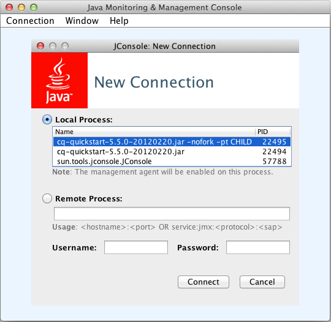

# Monitorización de recursos del servidor utilizando la consola JMX{#monitoring-server-resources-using-the-jmx-console}

La consola JMX le permite monitorizar y administrar los servicios en el servidor CRX. Las secciones siguientes resumen los atributos y operaciones que se exponen a través del marco JMX.

Para obtener información sobre cómo utilizar los controles de la consola, consulte [Uso de la consola JMX](#using-the-jmx-console). Para obtener información general sobre JMX, consulte la [Tecnología de Extensiones de administración Java (JMX)](https://www.oracle.com/technetwork/java/javase/tech/javamanagement-140525.html) en el sitio web de Oracle.

Para obtener información sobre la creación de MBeans para administrar los servicios mediante la consola JMX, consulte [Integración de servicios con la consola JMX](/help/sites-developing/jmx-integration.md).

## Mantenimiento del flujo de trabajo {#workflow-maintenance}

Operaciones para administrar instancias de flujo de trabajo en ejecución, completadas, obsoletas y fallidas.

* Dominio: com.adobe.granite.workflow
* Tipo: Mantenimiento

>[!NOTE]
>
>Consulte la [consola de flujo de trabajo](/help/sites-administering/workflows-administering.md) para obtener herramientas de administración de flujo de trabajo adicionales y descripciones de posibles estados de instancias de flujo de trabajo.

### Operaciones {#operations}

**listRunningWorkflowsPerModel** Indica el número de instancias de flujo de trabajo que se están ejecutando para cada modelo de flujo de trabajo.

* Argumentos: ninguno
* Valor devuelto: Datos de tabla que contienen las columnas Count y ModelId.

**listCompletedWorkflowsPerModel** Indica el número de instancias de flujo de trabajo completadas para cada modelo de flujo de trabajo.

* Argumentos: ninguno
* Valor devuelto: Datos de tabla que contienen las columnas Count y ModelId.

**returnWorkflowQueueInfo** Muestra información sobre los elementos de flujo de trabajo que se han procesado y que se ponen en cola para su procesamiento.

* Argumentos: ninguno
* Valor devuelto: Datos tabulares que contienen las columnas siguientes:

   * Trabajos
   * Nombre de cola
   * Activar tareas
   * Tiempo de procesamiento promedio
   * Tiempo de espera promedio
   * Tareas canceladas
   * Tareas con errores
   * Trabajos finalizados
   * Trabajos procesados
   * Trabajos en cola

**returnWorkflowJobTopicInfo** Muestra información de procesamiento de los trabajos de flujo de trabajo, organizada por tema.

* Argumentos: ninguno
* Valor devuelto: Datos de tabla que contienen las columnas siguientes:

   * Nombre del tema
   * Tiempo de procesamiento promedio
   * Tiempo de espera promedio
   * Tareas canceladas
   * Tareas con errores
   * Trabajos finalizados
   * Trabajos procesados

**returnFailedWorkflowCount** Muestra el número de instancias de flujo de trabajo que han fallado. Puede especificar un modelo de flujo de trabajo para consultar o recuperar información para todos los modelos de flujo de trabajo.

* Argumentos:

   * modelo: El ID del modelo que se va a consultar. Para ver un recuento de instancias de flujo de trabajo fallidas para todos los modelos de flujo de trabajo, no especifique ningún valor. El ID es la ruta al nodo del modelo, por ejemplo:

      `/conf/global/settings/workflow/models/dam/update_asset/jcr:content/model`

* Valor devuelto: Número de instancias de flujo de trabajo fallidas.

**returnFailedWorkflowCountPerModel** Muestra el número de instancias de flujo de trabajo que han fallado para cada modelo de flujo de trabajo.

* Argumentos: ninguno.
* Valor devuelto: Datos de tabla que contienen las columnas Count y Model ID .

**terminateFailedInstances** Finalice las instancias de flujo de trabajo que hayan fallado. Puede finalizar todas las instancias con errores o solo las instancias con errores de un modelo específico. Opcionalmente, puede reiniciar las instancias después de que se terminen. También puede probar la operación para ver los resultados sin realizar realmente la operación.

* Argumentos:

   * Reinicie la instancia: (Opcional) Especifique un valor de `true` para reiniciar las instancias después de que se terminen. El valor predeterminado de `false` no provoca el reinicio de instancias de flujo de trabajo terminadas.
   * Sequedad: (Opcional) Especifique un valor de `true` para ver los resultados de la operación sin realizar realmente la operación. El valor predeterminado de `false` hace que la operación se realice.
   * Modelo: (Opcional) El ID del modelo al que se aplica la operación. No especifique ningún modelo para aplicar la operación a las instancias fallidas de todos los modelos de flujo de trabajo. El ID es la ruta al nodo del modelo, por ejemplo:

      `/conf/global/settings/workflow/models/dam/update_asset/jcr:content/model`

* Valor devuelto: Datos tabulares sobre las instancias que se terminan, que contienen las siguientes columnas:

   * Iniciador
   * InstanceId
   * ModelId
   * Carga útil
   * StartComment
   * WorkflowTitle

**retryFailedWorkItems** Intenta ejecutar pasos de elementos de trabajo que han fallado. Puede volver a intentar todos los elementos de trabajo con errores o solo los elementos de trabajo con errores para un modelo de flujo de trabajo específico. Si lo desea, puede probar la operación para ver los resultados sin realizar realmente la operación.

* Argumentos:

   * Sequedad: (Opcional) Especifique un valor de `true` para ver los resultados de la operación sin realizar realmente la operación. El valor predeterminado de `false` hace que la operación se realice.
   * Modelo: (Opcional) El ID del modelo al que se aplica la operación. No especifique ningún modelo para aplicar la operación a los elementos de trabajo fallidos de todos los modelos de flujo de trabajo. El ID es la ruta al nodo del modelo, por ejemplo:

      `/conf/global/settings/workflow/models/dam/update_asset/jcr:content/model`

* Valor devuelto: Datos tabulares sobre los elementos de trabajo fallidos que se vuelven a intentar, incluidas las siguientes columnas:

   * Iniciador
   * InstanceId
   * ModelId
   * Carga útil
   * StartComment
   * WorkflowTitle

**PurgeActive** Elimina las instancias de flujo de trabajo activas de una página específica. Puede depurar instancias activas para todos los modelos o solo las instancias para un modelo específico. Opcionalmente, puede probar la operación para ver los resultados sin realizar realmente la operación.

* Argumentos:

   * Modelo: (Opcional) El ID del modelo al que se aplica la operación. No especifique ningún modelo para aplicar la operación a las instancias de flujo de trabajo de todos los modelos de flujo de trabajo. El ID es la ruta al nodo del modelo, por ejemplo:

      `/conf/global/settings/workflow/models/dam/update_asset/jcr:content/model`
   * Número de días transcurridos desde que se inició el flujo de trabajo: La edad de las instancias de flujo de trabajo que se van a purgar, en días.
   * Sequedad: (Opcional) Especifique un valor de `true` para ver los resultados de la operación sin realizar realmente la operación. El valor predeterminado de `false` hace que la operación se realice.

* Valor devuelto: Datos tabulares sobre las instancias de flujo de trabajo activas que se depuran, incluidas las columnas siguientes:

   * Iniciador
   * InstanceId
   * ModelId
   * Carga útil
   * StartComment
   * WorkflowTitle

**countStaleWorkflows** Devuelve el número de instancias de flujo de trabajo que están obsoletas. Puede recuperar el número de instancias antiguas para todos los modelos de flujo de trabajo o para un modelo específico.

* Argumentos:

   * Modelo: (Opcional) El ID del modelo al que se aplica la operación. No especifique ningún modelo para aplicar la operación a las instancias de flujo de trabajo de todos los modelos de flujo de trabajo. El ID es la ruta al nodo del modelo, por ejemplo:

      `/conf/global/settings/workflow/models/dam/update_asset/jcr:content/model`

* Valor devuelto: Número de instancias de flujo de trabajo obsoletas.

**restartStaleWorkflows** Reinicia instancias de flujo de trabajo obsoletas. Puede reiniciar todas las instancias obsoletas o solo las instancias obsoletas de un modelo específico. También puede probar la operación para ver los resultados sin realizar realmente la operación.

* Argumentos:

   * Modelo: (Opcional) El ID del modelo al que se aplica la operación. No especifique ningún modelo para aplicar la operación a las instancias obsoletas de todos los modelos de flujo de trabajo. El ID es la ruta al nodo del modelo, por ejemplo:

      `/conf/global/settings/workflow/models/dam/update_asset/jcr:content/model`
   * Sequedad: (Opcional) Especifique un valor de `true` para ver los resultados de la operación sin realizar realmente la operación. El valor predeterminado de `false` hace que la operación se realice.

* Valor devuelto: Lista de instancias de flujo de trabajo que se reinician.

**fetchModelList** Muestra todos los modelos de flujo de trabajo.

* Argumentos: ninguno
* Valor devuelto: Datos tabulares que identifican los modelos de flujo de trabajo, incluidas las columnas ModelId y ModelName.

**countRunningWorkflows** Devuelve el número de instancias de flujo de trabajo que se están ejecutando. Puede recuperar el número de instancias en ejecución para todos los modelos de flujo de trabajo o para un modelo específico.

* Argumentos:

   * Modelo: (Opcional) El ID del modelo para el que se devuelve el número de instancias en ejecución. No especifique ningún modelo para devolver el número de instancias en ejecución de todos los modelos de flujo de trabajo. El ID es la ruta al nodo del modelo, por ejemplo:

      `/conf/global/settings/workflow/models/dam/update_asset/jcr:content/model`

* Valor devuelto: Número de instancias de flujo de trabajo en ejecución.

**countCompletedWorkflows** Devuelve el número de instancias de flujo de trabajo completadas. Puede recuperar el número de instancias completadas para todos los modelos de flujo de trabajo o para un modelo específico.

* Argumentos:

   * Modelo: (Opcional) El ID del modelo para el que se devuelve el número de instancias completadas. No especifique ningún modelo para devolver el número de instancias completadas de todos los modelos de flujo de trabajo. El ID es la ruta al nodo del modelo, por ejemplo:

      `/conf/global/settings/workflow/models/dam/update_asset/jcr:content/model`

* Valor devuelto: Número de instancias de flujo de trabajo completadas.

**purgeCompleted** Elimina del repositorio los registros de flujos de trabajo completados de una edad específica. Utilice esta operación periódicamente para minimizar el tamaño del repositorio cuando utiliza con frecuencia flujos de trabajo. Puede purgar instancias completadas para todos los modelos o solo las instancias de un modelo específico. Opcionalmente, puede probar la operación para ver los resultados sin realizar realmente la operación.

* Argumentos:

   * Modelo: (Opcional) El ID del modelo al que se aplica la operación. No especifique ningún modelo para aplicar la operación a las instancias de flujo de trabajo de todos los modelos de flujo de trabajo. El ID es la ruta al nodo del modelo, por ejemplo:

      `/conf/global/settings/workflow/models/dam/update_asset/jcr:content/model`
   * Número de días transcurridos desde que se completó el flujo de trabajo: Número de días durante los que se han completado las instancias del flujo de trabajo.
   * Sequedad: (Opcional) Especifique un valor de `true` para ver los resultados de la operación sin realizar realmente la operación. El valor predeterminado de `false` hace que la operación se realice.

* Valor devuelto: Datos tabulares sobre las instancias de flujo de trabajo completadas que se depuran, incluidas las siguientes columnas:

   * Iniciador
   * InstanceId
   * ModelId
   * Carga útil
   * StartComment
   * WorkflowTitle

## Repositorio {#repository}

Información sobre el repositorio CRX

* Dominio: com.adobe.granite
* Tipo: Repositorio

### Atributos {#attributes}

**Nombre** Nombre de la implementación del repositorio JCR. Solo lectura.

**Versión** Versión de implementación del repositorio. Solo lectura.

**HomeDir** El directorio donde se encuentra el repositorio. La ubicación predeterminada es &lt;quickstart_jar_location>/crx-quickstart/repository. Solo lectura.

**Nombre del cliente** Nombre del cliente al que se emite la licencia de software. Solo lectura.

**LicenseKey** La clave de licencia única para esta instalación del repositorio. Solo lectura.

**AvailableDiskSpace** Espacio en disco disponible para esta instancia del repositorio, en Mbytes. Solo lectura.

**MaximumNumberOfOpenFiles** Número de archivos que se pueden abrir al mismo tiempo. Solo lectura.

**SessionTracker** El valor de la variable del sistema crx.debug.sessions . true indica una sesión de depuración. false indica una sesión normal. Lectura y escritura.

**Descriptores** Conjunto de pares de clave-valor que representan las propiedades del repositorio. Todas las propiedades son de solo lectura.

<table>
 <tbody>
  <tr>
   <th>Clave</th>
   <th>Valor</th>
  </tr>
  <tr>
   <td>option.node.and.property.with.same.name.supported</td>
   <td>Indica si un nodo y una propiedad del nodo pueden tener el mismo nombre. true indica que se admiten los mismos nombres, false indica que no se admite. </td>
  </tr>
  <tr>
   <td>identifier.stability</td>
   <td>Indica la estabilidad de los identificadores de nodo no referenciables. Los siguientes valores son posibles:
    <ul>
     <li>identifier.stable.indefinite.duration: Los identificadores no cambian.</li>
     <li>identifier.stable.method.duration: Los identificadores pueden cambiar entre llamadas de método.</li>
     <li>identifier.stable.save.duration: Los identificadores no cambian dentro de un ciclo de almacenamiento/actualización.</li>
     <li>identifier.stable.session.duration: Los identificadores no cambian durante una sesión.</li>
    </ul> </td>
  </tr>
  <tr>
   <td>query.xpath.pos.index</td>
   <td>Indica si se admite el lenguaje de consulta JCR 1.0 XPath. true indica compatibilidad y false indica que no es compatible.</td>
  </tr>
  <tr>
   <td>crx.repository.systemid</td>
   <td>El identificador del sistema tal como se encuentra en el archivo system.id.</td>
  </tr>
  <tr>
   <td>option.query.sql.supported</td>
   <td>Indica si se admite el lenguaje de consulta JCR 1.0 XPath. true indica compatibilidad y false indica que no es compatible.</td>
  </tr>
  <tr>
   <td>jcr.repository.version</td>
   <td>Versión de la implementación del repositorio.</td>
  </tr>
  <tr>
   <td>option.update.primary.node.type.supported</td>
   <td>Indica si se puede cambiar el tipo de nodo principal de un nodo. true indica que se puede cambiar el tipo de nodo principal y false indica que no se admite el cambio.</td>
  </tr>
  <tr>
   <td>option.node.type.management.supported</td>
   <td>Indica si se admite la administración de tipos de nodos. true indica que es compatible y false indica que no es compatible.</td>
  </tr>
  <tr>
   <td>node.type.management.overrides.supported</td>
   <td>Indica si se puede anular la definición de nodo secundario o propiedad heredada de un tipo de nodo. true indica que se admiten anulaciones y false indica que no se han anulado anulaciones.</td>
  </tr>
  <tr>
   <td>option.observation.supported</td>
   <td>true indica que se admite la observación asíncrona de cambios en el repositorio. El soporte de la observación asincrónica permite que las aplicaciones reciban y respondan a las notificaciones sobre cada cambio a medida que se producen.</td>
  </tr>
  <tr>
   <td>query.jcrscore</td>
   <td><p>true indica que la pseudo propiedad jcr:score está disponible en consultas XPath y SQL que incluyen una función jcrfn:contains (in XPath) o CONTAINS (in SQL) para realizar una búsqueda de texto completo.</p> </td>
  </tr>
  <tr>
   <td>option.simple.versioning.supported</td>
   <td>true indica que el repositorio admite versiones simples. Con el control de versiones simple, el repositorio mantiene una serie secuencial de versiones de un nodo.</td>
  </tr>
  <tr>
   <td>option.workspace.management.supported</td>
   <td>true indica que el repositorio admite la creación y eliminación de espacios de trabajo mediante API.</td>
  </tr>
  <tr>
   <td>option.update.mixin.node.types.supported</td>
   <td>true indica que el repositorio admite la adición y eliminación de tipos de nodos mixtos de un nodo existente.</td>
  </tr>
  <tr>
   <td>node.type.management.primary.item.name.supported</td>
   <td>true indica que el repositorio permite que las definiciones de nodos contengan un elemento principal como secundario. Se puede acceder a un elemento principal mediante la API sin conocer el nombre del elemento.</td>
  </tr>
  <tr>
   <td>level.2.2.supported</td>
   <td>true indica que tanto LEVEL_1_SUPPORTED como OPTION_XML_IMPORT_SUPPORTED son verdaderos.</td>
  </tr>
  <tr>
   <td>write.supported</td>
   <td>true indica que el repositorio proporciona acceso de escritura mediante la API. false indica acceso de solo lectura.</td>
  </tr>
  <tr>
   <td>node.type.management.update.in.use.supported</td>
   <td>true indica que puede cambiar las definiciones de nodos que están en uso en nodos existentes.</td>
  </tr>
  <tr>
   <td>jcr.specification.version</td>
   <td>Versión de la especificación JCR que implementa el repositorio.</td>
  </tr>
  <tr>
   <td>option.journaled.observation.supported</td>
   <td>true indica que las aplicaciones pueden realizar la observación en diario del repositorio. con la observación en diario, se puede obtener un conjunto de notificaciones de cambio para un período de tiempo específico. </td>
  </tr>
  <tr>
   <td>query.languages</td>
   <td>Los idiomas de consulta que admite el repositorio. Ningún valor indica que no se admita ninguna consulta.</td>
  </tr>
  <tr>
   <td>option.xml.export.supported</td>
   <td>true indica que el repositorio admite la exportación de nodos como código XML.</td>
  </tr>
  <tr>
   <td>node.type.management.multiple.binary.properties.supported</td>
   <td>true indica que el repositorio admite el registro de tipos de nodos que tienen varias propiedades binarias. false indica que se admite una sola propiedad binaria para un tipo de nodo.</td>
  </tr>
  <tr>
   <td>option.access.control.supported</td>
   <td>true indica que el repositorio admite el control de acceso para configurar y determinar los privilegios de usuario para el acceso a nodos.</td>
  </tr>
  <tr>
   <td>option.baselines.supported</td>
   <td>true indica que el repositorio admite configuraciones y líneas de base.</td>
  </tr>
  <tr>
   <td>option.shareable.nodes.supported</td>
   <td>true indica que el repositorio admite la creación de nodos que se pueden compartir.</td>
  </tr>
  <tr>
   <td>crx.cluster.id</td>
   <td>Identificador del clúster de repositorios.</td>
  </tr>
  <tr>
   <td>query.stored.queries.supported</td>
   <td>true indica que el repositorio admite consultas almacenadas.</td>
  </tr>
  <tr>
   <td>query.full.text.search.supported</td>
   <td>true indica que el repositorio admite la búsqueda de texto completo.</td>
  </tr>
  <tr>
   <td>node.type.management.inheritance</td>
   <td><p>Indica el nivel de compatibilidad del repositorio con la herencia del tipo de nodo. Los siguientes valores son posibles:</p> <p>node.type.management.herencia.Minimum: El registro de tipos de nodos principales está limitado a aquellos que solo tienen nt:base como supertipo. El registro de los tipos de nodos de mezcla está limitado a los que no tienen supertipo.</p> <p>node.type.management.herencia.single: El registro de tipos de nodos principales está limitado a los que tienen un supertipo. El registro de los tipos de nodos de mezcla está limitado a los que tienen como máximo un supertipo.</p> <p><br /> node.type.management.herencia.multiple: Los tipos de nodos primarios se pueden registrar con uno o más supertipos. Los tipos de nodos mixtos se pueden registrar con cero o más supertipos.</p> </td>
  </tr>
  <tr>
   <td>crx.cluster.preferredMaster</td>
   <td>true indica que este nodo de clúster es el maestro preferido del clúster.</td>
  </tr>
  <tr>
   <td>option.transactions.supported</td>
   <td>true indica que el repositorio admite transacciones.</td>
  </tr>
  <tr>
   <td>jcr.repository.vendor.url</td>
   <td>Dirección URL del proveedor del repositorio.</td>
  </tr>
  <tr>
   <td>node.type.management.value.constraints.supported</td>
   <td>true indica que el repositorio admite restricciones de valor para propiedades de nodo.</td>
  </tr>
  <tr>
   <td>node.type.management.property.types</td>
   <td>matriz de constantes javax.jcr.PropertyType que representan los tipos de propiedad que puede especificar un tipo de nodo registrado. Una matriz de longitud cero indica que los tipos de nodo registrados no pueden especificar definiciones de propiedad. Los tipos de propiedad son STRING, URI, BOOLEAN, LONG, DOUBLE, DECIMAL, BINARY, DATE, NAME, PATH, WEAKREFERENCE, REFERENCE y UNDEFINED (si se admite).</td>
  </tr>
  <tr>
   <td>node.type.management.orderable.child.nodes.supported</td>
   <td>true indica que el repositorio admite la preservación del orden de los nodos secundarios.</td>
  </tr>
  <tr>
   <td>jcr.repository.vendor</td>
   <td>Nombre del proveedor del repositorio.</td>
  </tr>
  <tr>
   <td>query.joins</td>
   <td><p>Nivel de compatibilidad con uniones en consultas. Los siguientes valores son posibles:</p>
    <ul>
     <li>query.joins.none: No se admiten uniones. Las consultas pueden utilizar un selector.</li>
     <li>query.joins.inner: Compatibilidad con uniones internas.</li>
     <li>query.joins.inner.outside: Compatibilidad con uniones interiores y exteriores.</li>
    </ul> </td>
  </tr>
  <tr>
   <td>org.apache.jackrabbit.spi.commons.AdditionalEventInfo</td>
   <td> </td>
  </tr>
  <tr>
   <td>query.xpath.doc.order</td>
   <td>true indica que el repositorio admite el lenguaje de consulta XPath 1.0.</td>
  </tr>
  <tr>
   <td>query.jcrpath</td>
   <td> </td>
  </tr>
  <tr>
   <td>option.xml.import.supported</td>
   <td>true indica que el repositorio admite la importación de código XML como contenido.</td>
  </tr>
  <tr>
   <td>node.type.management.same.name.siblings.supported</td>
   <td>true indica que el repositorio admite nodos hermanos (nodos con el mismo elemento principal) con los mismos nombres.</td>
  </tr>
  <tr>
   <td>node.type.management.residual.definitions.supported</td>
   <td>true indica que el repositorio admite propiedades de nombre con definiciones residuales. Cuando se admite, el atributo name de una definición de elemento puede ser un asterisco ("*").</td>
  </tr>
  <tr>
   <td>node.type.management.autocreated.definitions.supported</td>
   <td>true indica que el repositorio admite la creación automática de elementos secundarios (nodos o propiedades) de un nodo cuando se crea el nodo.</td>
  </tr>
  <tr>
   <td>crx.cluster.master</td>
   <td>true indica que este nodo de repositorio es el nodo maestro del clúster.</td>
  </tr>
  <tr>
   <td>level.1.supported</td>
   <td>true indica que option.xml.export.support es verdadero y query.languages es de longitud distinta de cero.</td>
  </tr>
  <tr>
   <td>option.unfiled.content.supported</td>
   <td>true indica que el repositorio admite contenido sin archivar. Los nodos sin archivar no forman parte de la jerarquía del repositorio.</td>
  </tr>
  <tr>
   <td>jcr.specification.name</td>
   <td>Nombre de la especificación JCR que implementa el repositorio.</td>
  </tr>
  <tr>
   <td>option.versioning.supported</td>
   <td>true indica que el repositorio admite versiones completas.</td>
  </tr>
  <tr>
   <td>jcr.repository.name</td>
   <td>Nombre del repositorio.</td>
  </tr>
  <tr>
   <td>option.locking.supported</td>
   <td>true indica que el repositorio admite el bloqueo de nodos. El bloqueo permite al usuario impedir temporalmente que otros usuarios realicen cambios.</td>
  </tr>
  <tr>
   <td>jcr.repository.version.display</td>
   <td> </td>
  </tr>
  <tr>
   <td>option.activities.supported</td>
   <td>true indica que el repositorio admite actividades. Las actividades son un conjunto de cambios que se realizan en un espacio de trabajo y que se combinan en otro espacio de trabajo.</td>
  </tr>
  <tr>
   <td>node.type.management.multivalued.properties.supported</td>
   <td>true indica que el repositorio admite propiedades de nodo que pueden tener cero o más valores.</td>
  </tr>
  <tr>
   <td>option.retention.supported</td>
   <td>true indica que el repositorio admite el uso de aplicaciones de administración de retención externas para aplicar políticas de retención al contenido y admite retención y liberación.</td>
  </tr>
  <tr>
   <td>option.lifecycle.supported</td>
   <td>true indica que el repositorio admite la administración del ciclo vital.</td>
  </tr>
 </tbody>
</table>

**NombresDeEspacioDeTrabajo** Nombres de los espacios de trabajo en el repositorio. Solo lectura.

**DataStoreGarbageCollectionDelay** Cantidad de tiempo en milisegundos que la colección de residuos dura después de escanear cada décimo nodo. Lectura y escritura.

**BackupDelay** Cantidad de tiempo en milisegundos que el proceso de backup duerme entre cada paso de la copia de seguridad. Lectura y escritura.

**BackupInProgress** El valor true indica que se está ejecutando un proceso de copia de seguridad. Solo lectura.

**BackupProgress** Para la copia de seguridad actual, el porcentaje de todos los archivos de los que se ha realizado una copia de seguridad. Solo lectura.

**CurrentBackupTarget** Para la copia de seguridad actual, el archivo ZIP donde se almacenan los archivos de copia de seguridad. Cuando una copia de seguridad no está en curso, no aparece ningún valor. Solo lectura.

**BackupDid** El valor true indica que no se han producido errores durante la copia de seguridad actual o que no hay copia de seguridad en curso. false indica que se ha producido un error durante la copia de seguridad actual. Solo lectura.

**BackupResult** Estado de la copia de seguridad actual. Los siguientes valores son posibles:

* Copia de seguridad en curso: Se está ejecutando una copia de seguridad.
* Copia de seguridad cancelada: La copia de seguridad se ha cancelado.
* Copia de seguridad finalizada con error: Error durante la copia de seguridad. El mensaje de error proporciona información sobre la causa.
* Copia de seguridad completada: La copia de seguridad se realizó correctamente.
* Hasta ahora no se ha ejecutado ninguna copia de seguridad: No hay copia de seguridad en curso.

Solo lectura.

**TarOptimizationRunningSince** Hora a la que comenzó el proceso actual de optimización de archivos TAR. Solo lectura.

**TarOptimizationDelay** Cantidad de tiempo en milisegundos que el proceso de optimización de TAR permanece entre cada paso del proceso. Lectura y escritura.

**ClusterProperties** Conjunto de pares de clave-valor que representan las propiedades y los valores del clúster. Cada fila de la tabla representa una propiedad de clúster. Solo lectura.

**ClusterNodes** Los miembros del clúster de repositorios.

**ClusterId** Identificador de este clúster de repositorios. Solo lectura.

**ClusterMasterId** Identificador del nodo maestro de este clúster de repositorios. Solo lectura.

**ClusterNodeId** Identificador de este nodo del clúster de repositorios. Solo lectura.

### Operaciones {#operations-1}

**createWorkspace** Crea un espacio de trabajo en este repositorio.

* Argumentos:

   * nombre: Valor de cadena que representa el nombre del nuevo espacio de trabajo.

* Valor devuelto: ninguno

**runDataStoreGarbageCollection** Ejecuta la colección de residuos en los nodos del repositorio.

* Argumentos:

   * eliminar: Valor booleano que indica si se eliminarán los elementos del repositorio que no se hayan utilizado. Un valor de true provoca la eliminación de nodos y propiedades no utilizados. Un valor false hace que se analicen todos los nodos, pero ninguno se elimina.

* Valor devuelto: ninguno

**stopDataStoreGarbageCollection** Detiene la colección de residuos del almacén de datos en ejecución.

* Argumentos: ninguno
* Valor devuelto: representación de cadena del estado actual

**startBackup** Copia de seguridad de los datos del repositorio en un archivo ZIP.

* Argumentos:

   * `target`: (Opcional) A `String` que representa el nombre del archivo ZIP o directorio en el que se archivarán los datos del repositorio. Para utilizar un archivo ZIP, incluya la extensión del nombre del archivo ZIP. Para utilizar un directorio, no incluya ninguna extensión de nombre de archivo.

      Para realizar una copia de seguridad incremental, especifique el directorio que se utilizó anteriormente para la copia de seguridad.

      Puede especificar una ruta absoluta o relativa. Las rutas relativas son relativas al principal del directorio crx-quickstart.

      Si no especifica ningún valor, el valor predeterminado de `backup-currentdate.zip` , donde `currentdate` tiene el formato `yyyyMMdd-HHmm`.

* Valor devuelto: ninguno

**cancelBackup** Detiene el proceso de copia de seguridad actual y elimina el archivo temporal que el proceso creó para archivar datos.

* Argumentos: ninguno
* Valor devuelto: ninguno

**blockRepositoryWrites** Bloquea los cambios en los datos del repositorio. Todos los oyentes de copia de seguridad del repositorio reciben una notificación del bloque.

* Argumentos: ninguno
* Valor devuelto: ninguno

**unblockRepositoryWrites** Quita el bloque del repositorio. A todos los oyentes de copia de seguridad del repositorio se les notifica la eliminación del bloque.

* Argumentos: ninguno
* Valor devuelto: ninguno

**startTarOptimization** Inicia el proceso de optimización de archivos TAR utilizando el valor predeterminado para tarOptimizationDelay.

* Argumentos: ninguno
* Valor devuelto: ninguno

**stopTarOptimization** Detiene la optimización de archivos TAR.

* Argumentos: ninguno
* Valor devuelto: ninguno

**tarIndexMerge** Combina los archivos de índice superiores de todos los conjuntos TAR. Los archivos de índice principales son archivos con distintas versiones principales. Por ejemplo, los siguientes archivos se combinan en el archivo index_3_1.tar: index_1_1.tar, index_2_0.tar, index_3_0.tar. Se eliminan los archivos que se han combinado (en el ejemplo anterior, se eliminan index_1_1.tar, index_2_0.tar e index_3_0.tar).

* Argumentos:

   * `background`: Valor booleano que indica si se ejecuta la operación en segundo plano para que la consola web se pueda utilizar durante la ejecución. El valor true ejecuta la operación en segundo plano.

* Valor devuelto: ninguno

**makeClusterMaster** Establece este nodo de repositorio como el nodo maestro del clúster. Si aún no es maestro, este comando detiene el listener de la instancia maestra actual e inicia un listener maestro en el nodo actual. A continuación, este nodo se establece como nodo maestro y se reinicia, lo que provoca que todos los demás nodos del clúster (es decir, los que están controlados por el maestro) se conecten a esta instancia.

* Argumentos: ninguno
* Valor devuelto: ninguno

**joinCluster** Agrega este repositorio a un clúster como nodo controlado por el maestro del clúster. Debe proporcionar un nombre de usuario y una contraseña para la autenticación. La conexión utiliza autenticación básica. Las credenciales de seguridad están codificadas en base-64 antes de enviarse al servidor.

* Argumentos:

   * `master`: Valor de cadena que representa la dirección IP o el nombre de equipo del equipo que ejecuta el nodo maestro del repositorio.
   * `username`: El nombre que se va a usar para autenticarse con el clúster.
   * `password`: La contraseña que se utilizará para la autenticación.

* Valor devuelto: ninguno

**traversalCheck** Recorre y opcionalmente corrige incoherencias en un subárbol que comienza en un nodo específico. Esto se trata detalladamente en la documentación sobre los administradores de persistencia.

**consistencyCheck** Comprobaciones y, opcionalmente, correcciones de coherencia en el almacén de datos. Esto se trata detalladamente en la documentación del almacén de datos.

## Estadísticas del repositorio (Serie temporal) {#repository-statistics-timeseries}

El valor del campo TimeSeries para cada tipo de estadística que `org.apache.jackrabbit.api.stats.RepositoryStatistics` define.

* Dominio: `com.adobe.granite`
* Tipo: `TimeSeries`
* Nombre: Uno de los siguientes valores de la variable `org.apache.jackrabbit.api.stats.RepositoryStatistics.Type` Clase Enum:

   * BUNDLE_CACHE_ACCESS_COUNTER
   * BUNDLE_CACHE_MISS_AVERAGE
   * BUNDLE_CACHE_MISS_COUNTER
   * BUNDLE_CACHE_MISS_DURATION
   * BUNDLE_CACHE_SIZE_COUNTER
   * BUNDLE_COUNTER
   * BUNDLE_READ_COUNTER
   * BUNDLE_WRITE_AVERAGE
   * BUNDLE_WRITE_COUNTER
   * BUNDLE_WRITE_DURATION
   * BUNDLE_WS_SIZE_COUNTER
   * QUERY_AVERAGE
   * QUERY_COUNT
   * QUERY_DURATION
   * SESSION_COUNT
   * SESSION_LOGIN_COUNTER
   * SESSION_READ_AVERAGE
   * SESSION_READ_COUNTER
   * SESSION_READ_DURATION
   * SESSION_WRITE_AVERAGE
   * SESSION_WRITE_COUNTER
   * SESSION_WRITE_DURATION

### Atributos {#attributes-1}

Se proporcionan los siguientes atributos para cada tipo de estadística del informe:

* ValuePerSecond: El valor medido por segundo durante el último minuto. Solo lectura.
* ValuePerMinute: El valor medido por minuto durante la última hora. Solo lectura.
* ValuePerHour: El valor medido por hora durante la última semana. Solo lectura.
* ValuePerWeek: El valor medido por semana durante los últimos tres años. Solo lectura.

## Estadísticas de consulta del repositorio {#repository-query-stats}

Información estadística sobre consultas de repositorios.

* Dominio: com.adobe.granite
* Tipo: QueryStat

### Atributos {#attributes-2}

**Consultas lentas** Información sobre las consultas del repositorio que han tardado más en completarse. Solo lectura.

**SlowQueriesQueueSize** El número máximo de consultas que se incluirán en la lista Consultas lentas. Lectura-escritura.

**Consultas populares** Información sobre las consultas del repositorio que más se han producido. Solo lectura.

**PopularQueriesQueueSize** Número máximo de consultas en la lista Consultas populares. Lectura-escritura.

### Operaciones {#operations-2}

**clearSlowQueriesQueue** Quita todas las consultas de la lista SlowQueries.

* Argumentos: ninguno
* Valor devuelto: ninguno

**clearPopularQueriesQueue** Quita todas las consultas de la lista Consultas populares.

* Argumentos: ninguno
* Valor devuelto: ninguno

## Agentes de replicación {#replication-agents}

Monitorice los servicios para cada agente de replicación. Cuando crea un agente de replicación, el servicio aparece automáticamente en la consola JMX.

* **Dominio:** com.adobe.granite.replication
* **Tipo:** agente
* **Nombre:** sin valor
* **Propiedades:** {id=&quot;*Nombre*&quot;}, donde *Nombre* es el valor de la propiedad Nombre del agente.

### Atributos {#attributes-3}

**Id** Un valor de cadena que representa el identificador de la configuración del agente de replicación. Varios agentes pueden utilizar la misma configuración. Solo lectura.

**Válido** Un valor booleano que indica si el agente está configurado correctamente:

* `true`: Configuración válida.
* `false` : La configuración contiene errores.

Solo lectura.

**Habilitado** Un valor booleano que indica si el agente está habilitado:

* `true`: habilitado.
* `false`: deshabilitado.

**QueueBlocked** Un valor booleano que indica si la cola existe y está bloqueada:

* `true`: Bloqueado. Hay un reintento automático pendiente.
* `false`: No está bloqueado o no existe.

Solo lectura.

**QueuePaused** Un valor booleano que indica si la cola de trabajos está en pausa:

* `true`: En pausa (suspendido)
* `false`: No está en pausa o no existe.

Lectura-escritura.

**QueueNumEntries** Un valor int que representa el número de trabajos en la cola del agente. Solo lectura.

**QueueStatusTime** Valor de fecha que indica la hora del servidor en la que se obtuvieron los valores de estado mostrados. El valor corresponde al tiempo en que se cargó la página. Solo lectura.

**QueueNextRetryTime** Para las colas bloqueadas, un valor de Fecha que indica cuándo se produce el siguiente reintento automático. Cuando no aparece ningún tiempo, la cola no está bloqueada. Solo lectura.

**QueueProcessingSince** Valor de fecha que indica cuándo se inició el procesamiento del trabajo actual. Cuando no aparece ningún tiempo, la cola está bloqueada o inactiva. Solo lectura.

**QueueLastProcessTime** Valor de fecha que indica cuándo se completó el trabajo anterior. Solo lectura.

### Operaciones {#operations-3}

**queueForceRetry** Para las colas bloqueadas, envía el comando de reintento a la cola.

* Argumentos: ninguno
* Valor devuelto: ninguno

**queueClear** Quita todos los trabajos de la cola.

* Argumentos: ninguno
* Valor devuelto: ninguno

## Motor de Sling {#sling-engine}

Proporciona estadísticas sobre las solicitudes HTTP para que pueda supervisar el rendimiento del servicio SlingRequestProcessor.

* Dominio: org.apache.sling
* Tipo: motor
* Propiedades: {service=RequestProcessor}

### Atributos {#attributes-4}

**RequestsCount** Número de solicitudes que se han producido desde que se restablecieron las estadísticas por última vez.

**MinRequestDurationMsec** La menor cantidad de tiempo (en milisegundos) necesario para procesar una solicitud desde que se restablecieron las estadísticas por última vez.

**MaxRequestDurationMsec** La mayor cantidad de tiempo (en milisegundos) que se requirió para procesar una solicitud desde que se restablecieron las estadísticas por última vez.

**StandardDeviationDurationMsec** La desviación estándar de la cantidad de tiempo necesaria para procesar las solicitudes. La desviación estándar se calcula utilizando todas las solicitudes desde que se restablecieron las estadísticas por última vez.

**MediaRequestDurationMsec** Cantidad media de tiempo necesaria para procesar una solicitud. La media se calcula utilizando todas las solicitudes desde que se restablecieron las estadísticas por última vez

### Operaciones {#operations-4}

**resetStatistics** Establece todas las estadísticas en cero. Restablezca las estadísticas cuando necesite analizar el rendimiento del procesamiento de solicitudes durante un intervalo de tiempo específico.

* Argumentos: ninguno
* Valor devuelto: ninguno

**id** La representación de cadena del ID del paquete.

**instalado** Un valor booleano que indica si el paquete está instalado:

* `true`: Instalado.
* `false`: No está instalado.

**instaladoBy** ID del usuario que instaló el paquete por última vez.

**InstallDate** La fecha en la que se instaló el paquete por última vez.

**size** Un valor largo que contiene el tamaño del paquete en bytes.


## Inicio rápido {#quickstart-launcher}

Información sobre el proceso de inicio y el inicio rápido.

* Dominio: com.adobe.granite.quickstart
* Tipo: Iniciador

### Operaciones {#operations-5}

**log**

Muestra un mensaje en la ventana Inicio rápido .

Argumentos:

* p1: A `String` que representa el mensaje que se va a mostrar.
* Valor devuelto: ninguno

**startupFinished**

Llama al método startupFinished del lanzador del servidor. El método intenta abrir la página de bienvenida en un explorador web.

* Argumentos: ninguno
* Valor devuelto: ninguno

**startupProgress**

Establece el valor de finalización del proceso de inicio del servidor. La barra de progreso de la ventana QuickStart representa el valor de finalización.

* Argumentos:
   * p1: Un valor Float que representa cuánto del proceso de inicio se ha completado, como fracción. El valor debe estar entre cero y uno. Por ejemplo, 0,3 indica que se ha completado el 30 %.
* Valor devuelto: ninguno.

## Servicios de terceros {#third-party-services}

Varios recursos de servidor de terceros instalan MBeans que exponen atributos y operaciones a la consola JMX. La siguiente tabla enumera los recursos de terceros y proporciona vínculos a más información.

<table>
 <tbody>
  <tr>
   <th>Dominio</th>
   <th>Tipo</th>
   <th>Clase MBean</th>
  </tr>
  <tr>
   <td>Implementación de JMI</td>
   <td>MBeanServerDelegate</td>
   <td><a href="https://docs.oracle.com/javase/8/docs/api/javax/management/MBeanServerDelegate.html">javax.management.MBeanServerDelegate</a></td>
  </tr>
  <tr>
   <td>com.sun.management</td>
   <td>HotSpotDiagnostic</td>
   <td><a href="https://docs.oracle.com/javase/8/docs/jre/api/management/extension/com/sun/management/HotSpotDiagnosticMXBean.html">com.sun.management.HotSpotDiagnosticMXBean</a></td>
  </tr>
  <tr>
   <td>java.lang</td>
   <td>
    <ul>
     <li>ClassLoading</li>
     <li>Compilación</li>
     <li>Colector de residuos</li>
     <li>Memoria</li>
     <li>MemoryManager</li>
     <li>MemoryPool</li>
     <li>Sistema operativo</li>
     <li>Tiempo de ejecución</li>
     <li>Threading</li>
    </ul> </td>
   <td><a href="https://docs.oracle.com/javase/8/docs/api/javax/management/package-summary.html">javax.management</a> paquete</td>
  </tr>
  <tr>
   <td>java.util.logging</td>
   <td> </td>
   <td><a href="https://docs.oracle.com/javase/8/docs/api/java/util/logging/LoggingMXBean.html">java.util.logging.LoggingMXBean</a></td>
  </tr>
  <tr>
   <td>osgi.core</td>
   <td>
    <ul>
     <li>bundleState</li>
     <li>marco</li>
     <li>packageState</li>
     <li>serviceState</li>
    </ul> </td>
   <td><a href="https://osgi.org/specification/osgi.enterprise/7.0.0/service.jmx.html#d0e42567">org.osgi.jmx.framework</a> paquete</td>
  </tr>
 </tbody>
</table>

## Uso de la consola JMX {#using-the-jmx-console}

La consola JMX muestra información sobre varios servicios que se ejecutan en el servidor:

* Atributos: Propiedades del servicio, como configuraciones o datos de tiempo de ejecución. Los atributos pueden ser de solo lectura o de lectura y escritura.
* Operaciones: Comandos que puede invocar en el servicio.

Los MBeans implementados con un servicio OSGi exponen los atributos de servicio y las operaciones a la consola. MBean determina los atributos y las operaciones que se exponen y si los atributos son de solo lectura o de lectura y escritura.

La página principal de la consola JMX incluye una tabla de servicios. Cada fila de la tabla representa un servicio que está expuesto por un MBean.

1. Abra la consola web y haga clic en la pestaña JMX . ([http://localhost:4502/system/console/jmx](http://localhost:4502/system/console/jmx))
2. Haga clic en un valor de celda de un servicio para ver los atributos y las operaciones del servicio.
3. Para cambiar un valor de atributo, haga clic en el valor, especifique el valor en el cuadro de diálogo que aparece y haga clic en Guardar.
4. Para invocar una operación de servicio, haga clic en el nombre de la operación, especifique los valores de los argumentos en el cuadro de diálogo que aparece y haga clic en Invocar.

## Uso de aplicaciones JMX externas para monitorización {#using-external-jmx-applications-for-monitoring}

CRX permite que las aplicaciones externas interactúen con Managed Beans (MBeans) mediante [Extensiones de administración de Java (JMX)](https://docs.oracle.com/javase/6/docs/technotes/guides/management/overview.html). Uso de consolas genéricas como [JConsole](https://java.sun.com/developer/technicalArticles/J2SE/jconsole.html) para aplicaciones de monitorización específicas del dominio, permite obtener y configurar configuraciones y propiedades CRX, así como monitorizar el rendimiento y el uso de los recursos.

### Uso de JConsole para conectarse a CRX {#using-jconsole-to-connect-to-crx}

Para conectarse a CRX usando JConsole, siga estos pasos:

1. Abra una ventana de terminal.
1. Introduzca el siguiente comando:

   `jconsole`

JConsole se iniciará y aparecerá la ventana JConsole .

### Conexión a un proceso CRX local {#connecting-to-a-local-crx-process}

JConsole mostrará una lista de los procesos locales de la máquina virtual Java. La lista contendrá dos procesos de inicio rápido. Seleccione el proceso &quot;CHILD&quot; de inicio rápido de la lista de procesos locales (normalmente el que tiene el PID más alto).



### Conexión a un proceso CRX remoto {#connecting-to-a-remote-crx-process}

Para poder conectarse a un proceso CRX remoto, la JVM que aloja el proceso CRX remoto tendrá que estar habilitada para aceptar conexiones JMX remotas.

Para habilitar conexiones JMX remotas, se debe establecer la siguiente propiedad del sistema al iniciar la JVM:

`com.sun.management.jmxremote.port=portNum`

En la propiedad anterior, `portNum` es el número de puerto a través del cual desea habilitar las conexiones RMI JMX. Asegúrese de especificar un número de puerto no utilizado. Además de publicar un conector RMI para el acceso local, al configurar esta propiedad se publica un conector RMI adicional en un registro de solo lectura privado en el puerto especificado, con un nombre bien conocido, &quot;jmxrmi&quot;.

De forma predeterminada, cuando habilita el agente JMX para monitorización remota, utiliza la autenticación de contraseña basada en un archivo de contraseña que debe especificarse con la siguiente propiedad del sistema al iniciar la VM de Java:

`com.sun.management.jmxremote.password.file=pwFilePath`

Consulte la [documentación relevante de JMX](https://docs.oracle.com/javase/6/docs/technotes/guides/management/agent.html) para obtener instrucciones detalladas sobre la configuración de un archivo de contraseña.

Ejemplo:

```shell
$ java
  -Dcom.sun.management.jmxremote.password.file=pwFilePath
  -Dcom.sun.management.jmxremote.port=8463
  -jar ./cq-quickstart.jar
```

### Uso de los MBeans proporcionados por CRX {#using-the-mbeans-provided-by-crx}

Después de conectarse al proceso de inicio rápido, JConsole proporciona una serie de herramientas generales de monitorización para la JVM en la que CRX se está ejecutando.


Para acceder a las opciones de supervisión y configuración internas de CRX, vaya a la pestaña MBeans y, en el árbol de contenido jerárquico de la izquierda, seleccione la sección Atributos o Operaciones en la que está interesado. Por ejemplo, la sección com.adobe.granite/Repository/Operations .

Dentro de esa sección, seleccione el atributo u operación que desee en el panel izquierdo.


