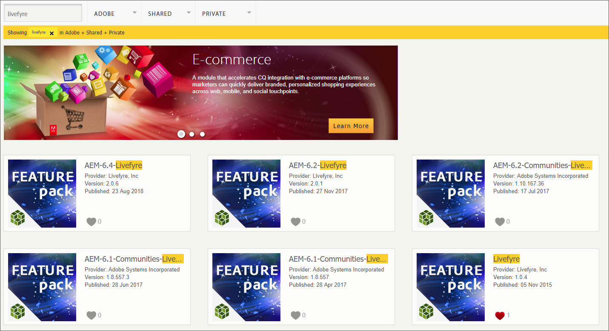

# Integración con Livefyre{#integrating-with-livefyre}

Descubra cómo integrar las capacidades de depuración líderes del sector de Livefyre con su instancia de AEM 6.5, lo que le permite publicar en su sitio en cuestión de minutos contenido valioso generado por el usuario (UGC) desde las redes sociales.

## Introducción {#getting-started}

### Instalación de Livefyre Package para AEM {#install-livefyre-package-for-aem}

AEM 6.5 incluye el paquete de funciones 1.2.6 de Livefyre preinstalado. Este paquete solo incluye una integración limitada de Livefyre con AEM Sites y debe desinstalarse antes de instalar un paquete actualizado. Con el paquete más reciente, puede disfrutar de la integración completa de Livefyre con AEM, incluidos Sitios, Recursos y Comercio.

>[!NOTE]
>
>Algunas funciones del paquete AEM-LF dependen de Social Component Framework (SCF). Si está utilizando el paquete de funciones de Livefyre como parte de un sitio que no pertenece a las comunidades, debe declarar *cq.social.scf* como una dependencia en los clientes autores del sitio web. Si está utilizando el paquete de funciones de LF como parte de un sitio web de comunidades, esta dependencia ya debería ser declarada.

1. En la página de inicio de AEM, haga clic en el icono **Herramientas** en el carril izquierdo.
1. Vaya a **Implementación > Paquetes**.
1. En el Administrador de paquetes, desplácese hasta que vea el paquete de funciones de Livefyre preinstalado y, a continuación, haga clic en el título del paquete **cq-social-livefyre-pkg-1.2.6.zip** para ampliar las opciones.
1. Haga clic en **Más > Desinstalar**.

   

1. Vuelva a la página principal de AEM, haga clic en Herramientas y, a continuación, vaya a **Implementación > Uso compartido** de paquetes.

   Se muestra una lista de paquetes de funciones y revisiones disponibles para la descarga.

1. En la búsqueda de palabras clave, busque &quot;Livefyre&quot; y, a continuación, seleccione el paquete de funciones de Livefyre correspondiente a su versión de AEM.

   

1. En la página de información del paquete de funciones, haga clic en **Descargar**, luego lea el Contrato de licencia del paquete y haga clic en **Aceptar**.
1. Vuelva al Administrador de paquetes, localice el paquete recién descargado y haga clic en **Instalar**.

   

   Ya está instalado el paquete Livefyre-AEM. Antes de empezar a utilizar las funciones de integración, debe configurar AEM para que utilice Livefyre.

   Para obtener más información sobre los paquetes, consulte [Cómo trabajar con paquetes](https://helpx.adobe.com/experience-manager/6-3/sites/administering/using/package-manager.html).

   Para obtener más información y notas de la versión sobre los paquetes de funciones, consulte [Feature Packs](https://helpx.adobe.com/experience-manager/6-3/release-notes/feature-packs-release-notes.html).

### Configure AEM para que utilice Livefyre: Crear una carpeta de configuración {#configure-aem-to-use-livefyre-create-a-configuration-folder}

1. En la página de inicio de AEM, haga clic en el icono **Herramientas** en el carril izquierdo y, a continuación, vaya a **General > Navegador** de configuración.
1. Haga clic en **Crear** para abrir el cuadro de diálogo Crear configuración.
1. Asigne un nombre a la configuración y marque la casilla de verificación Configuraciones **de** nube.

   Esto creará una carpeta en **Herramientas > Implementación > Configuración** de Livefyre con el nombre proporcionado.

   

### Configure AEM para que utilice Livefyre: Crear una configuración de Livefyre {#configure-aem-to-use-livefyre-create-a-livefyre-configuration}

Configure AEM para que utilice las credenciales de licencia de Livefyre de su organización, lo que permite la comunicación entre Livefyre y AEM.

1. En la página de inicio de AEM, haga clic en el icono **Herramientas** en el carril izquierdo y, a continuación, vaya a **Implementación > Configuración** de Livefyre.
1. Seleccione la carpeta de configuración en la que desea crear una nueva configuración de Livefyre y, a continuación, haga clic en **Crear**.

   

   >[!NOTE]
   >
   >Las carpetas deben tener configuraciones de nube habilitadas en sus propiedades para poder agregarlas a las configuraciones de Livefyre. Las carpetas de configuración se crean y administran en el navegador de configuración.
   >
   >No se puede crear un nombre para una configuración; se hace referencia a ella en la ruta de la carpeta en la que se encuentra. Sólo puede tener una configuración por carpeta.

1. Seleccione la tarjeta de configuración de Livefyre recién creada y, a continuación, haga clic en **Propiedades**.

   

1. Introduzca las credenciales de Livefyre de su organización y haga clic en **Aceptar**.

   

   Para acceder a esta información, abra el estudio de Livefyre y vaya a **Configuración > Configuración de integración > Credenciales**.

   La instancia de AEM ahora está configurada para usar Livefyre y puede utilizar las funciones de integración.

### Personalizar la integración del inicio de sesión único {#customize-single-sign-on-integration}

El paquete Livefyre para AEM incluye una integración lista para usar entre los perfiles de comunidades AEM y el servicio SSO de Livefyre.

Cuando los usuarios inician sesión en el sitio de AEM, también inician sesión en los componentes sociales de Livefyre. Cuando un usuario que ha cerrado la sesión intenta utilizar una función de componente Livefyre que requiere autenticación (como cargar una foto), el componente Livefyre inicia la autenticación del usuario.

Es posible que la integración de autenticación predeterminada no sea perfecta para cada sitio. Para que coincida mejor con el flujo de autenticación de las plantillas de sitio, puede omitir el delegado de autenticación de Livefyre predeterminado para satisfacer sus necesidades. Siga estos pasos:

1. Con CRXDE Lite, copy */libs/social/integrations/livefyre/components/autorizablecomponent/authclientlib* a */apps/social/integrations/livefyre/components/autorizablecomponent/authclientlib*.
1. Edite y guarde */apps/social/integrations/livefyre/components/authorizablecomponent/authclientlib/auth.js* para implementar un delegado de autenticación de Livefyre que satisfaga sus necesidades.

   Para obtener más información sobre la personalización de un delegado de autenticación, consulte Integración [de identidad](https://answers.livefyre.com/developers/identity-integration/).

   Para obtener más información sobre las bibliotecas de AEM, consulte [Uso de bibliotecas](https://helpx.adobe.com/experience-manager/6-3/sites/developing/using/clientlibs.html)de cliente.

## Uso de Livefyre en los sitios de AEM {#use-livefyre-with-aem-sites}

### Agregar componentes de Livefyre a una página {#add-livefyre-components-to-a-page}

Antes de agregar componentes de Livefyre a una página dentro de Sitios, debe habilitar Livefyre para la página heredando una configuración de nube de Livefyre de una página principal o agregando la configuración directamente a la página. Consulte la implementación para saber cómo incluir servicios en la nube en el sitio.

Una vez Livefyre esté habilitado para la página, los contenedores deben configurarse para permitir los componentes de Livefyre. Consulte [Configuración de componentes en modo](https://helpx.adobe.com/experience-manager/6-3/sites/authoring/using/default-components-designmode.html) de diseño para obtener instrucciones sobre cómo habilitar distintos componentes.

>[!NOTE]
>
>Las aplicaciones que requieren autenticación para anunciar no funcionan hasta que la autenticación se configura en la integración del inicio de sesión único personalizada.

1. En el panel lateral **Componentes** del modo de diseño, seleccione **Livefyre** en el menú para limitar la lista a los componentes de Livefyre disponibles.

   

1. Seleccione un componente Livefyre y arrástrelo a su posición en la página.
1. Seleccione si desea crear una nueva aplicación de Livefyre o incrustar una existente.

   Si incrusta una aplicación existente, AEM le pedirá que seleccione la aplicación. Si se crea una aplicación nueva, la aplicación deberá rellenarse antes de que aparezca el contenido. La aplicación se creará en el sitio de Livefyre y en la red seleccionada cuando se habilitó la configuración de la nube de Livefyre para la página.

   Para obtener más información sobre la inserción de componentes, consulte [Edición del contenido](https://helpx.adobe.com/experience-manager/6-3/sites/authoring/using/editing-content.html)de la página.

### Editar un componente Livefyre para una página de AEM. {#edit-a-livefyre-component-for-an-aem-page}

Solo puede configurar y editar un componente Livefyre en Livefyre Studio. Desde AEM:

1. Haga clic en el componente Livefyre para configurarlo.
1. Haga clic en el icono **Configurar** (llave inglesa) para abrir el cuadro de diálogo de configuración.
1. Click **To edit this component, go to Livefyre Studio**.
1. Edite la aplicación en Livefyre Studio.

## Uso de Livefyre con AEM Assets {#use-livefyre-with-aem-assets}

### Solicitar derechos e importar UGC en AEM Assets {#request-rights-and-import-ugc-into-aem-assets}

Puede importar contenido generado por usuarios (UGC) de Twitter e Instagram desde Livefyre Studio a Recursos AEM mediante el importador UGC. Después de seleccionar el contenido que se va a importar, debe solicitar derechos al contenido para poder completar la importación.

>[!NOTE]
>
>Antes de usar Recursos para importar UGC, debe configurar cuentas de cuentas de Social y solicitudes de derechos en Livefyre Studio. Consulte [Configuración: Solicitudes](https://marketing.adobe.com/resources/help/en_US/livefyre/c_how_requesting_rights_works.html) de derechos para obtener más información.

Para importar UGC en Recursos AEM:

1. En la página de inicio de AEM, vaya a **Recursos > Archivos**.
1. Haga clic en **Crear** y, a continuación, en **Importar UGC.**

   

1. Buscar contenido:

   * En Livefyre, haga clic en la ficha Biblioteca UGC. Utilice los filtros y busque contenido de la biblioteca UGC.
   * En Twitter e Instagram, haga clic en la ficha Twitter o Instagram. Utilice la búsqueda o los filtros para encontrar contenido.

1. Seleccione los recursos que desee importar. Los recursos seleccionados se cuentan y guardan automáticamente en la ficha **Seleccionado** .
1. **Opcional**: Haga clic en la ficha **Seleccionado** y revise el contenido UGC seleccionado para importar.
1. Haga clic en **Siguiente**. 

   

1. Para solicitudes de derechos, elija una de las siguientes opciones para cada recurso:

   Para Instagram:

   * **Solicitar derechos** manualmente para obtener un mensaje que se puede copiar y pegar y enviar manualmente a los propietarios de contenido a través de Instagram.
   * **Atributo manual de derechos** de contenido para anular los derechos de recursos individuales.
   >[!NOTE]
   >
   >Debido a las actualizaciones que afectan a la agregación de contenido de cuentas de usuarios no profesionales, ya no podemos publicar comentarios en su nombre ni comprobar automáticamente las respuestas del autor. [Haga clic aquí para obtener más](https://developers.facebook.com/blog/post/2018/04/04/facebook-api-platform-product-changes/)información.

   

   Para Twitter:

   * **Autor** de mensajes para enviar un mensaje al propietario del contenido solicitando derechos para el recurso.
   * **Atributo manual de derechos** de contenido para anular los derechos de recursos individuales.

1. Haga clic en **Importar**.

   Si ha enviado una solicitud de derechos de Twitter, el propietario del contenido verá el mensaje de solicitud de derechos en su cuenta:

   

   >[!NOTE]
   >
   >Twitter tiene límites en solicitudes idénticas provenientes de la misma cuenta. Al importar más de un par de recursos, modifique los mensajes individualmente para evitar que se marquen.

1. Haga clic en **Finalizado** en la esquina superior derecha para finalizar el flujo de trabajo de la solicitud de derechos.

   Puede ver el estado de una solicitud de derechos pendiente para un recurso en Livefyre Studio. Si el contenido está pendiente de una solicitud de derechos, el recurso no se mostrará en Recursos AEM hasta que se concedan derechos. El recurso aparece automáticamente en Recursos AEM cuando se concede una solicitud de derechos.

   En Instagram, debe rastrear la respuesta del propietario del contenido y otorgar derechos manualmente si se le otorgan derechos sobre el contenido.

## Uso de Livefyre con AEM Commerce {#use-livefyre-with-aem-commerce}

### Importación de catálogos de productos en Livefyre con AEM Commerce {#import-product-catalogs-into-livefyre-with-aem-commerce}

Los usuarios de AEM Commerce pueden integrar sin problemas su catálogo de productos existente en Livefyre para impulsar la participación del usuario en las aplicaciones de visualización de Livefyre.

Después de importar el catálogo de productos, los productos se muestran en tiempo real en la instancia de Livefyre. Si edita o elimina elementos del catálogo de productos de AEM Commerce, los cambios se actualizarán automáticamente en Livefrye.

1. Asegúrese de tener instalado el paquete Livefyre para AEM más reciente en su instancia de AEM.
1. En la página de inicio de AEM, vaya a **AEM Commerce**.
1. Cree una colección nueva o utilice una colección existente.
1. Pase el ratón sobre la colección y haga clic en Propiedades **de la colección** (icono de lápiz).
1. Marque **Sincronizar con Livefyre**.
1. Rellene el prefijo **de página de** Livefyre para vincular esta colección a una página específica de AEM.

   El prefijo de página define la ruta raíz del entorno donde comienza la búsqueda de páginas de productos. Livefyre elige la primera página que tiene un producto correspondiente asociado a ella. Para obtener diferentes páginas para diferentes productos, se necesitan varias colecciones.

## Matriz de compatibilidad de AEM para aplicaciones de Livefyre {#aem-support-matrix-for-livefyre-apps}

| Aplicaciones de Livefyre | AEM 6.1 | AEM 6.2 | AEM 6.3 | AEM 6.4 |
|---|---|---|---|---|
| Carrusel | X | X | X | X |
| Chat | X | X | X | X |
| Comentarios | X | X | X | X |
| Tira de película |  | X | X | X |
| LiveBlog | X | X | X | X |
| Asignar | X | X | X | X |
| Muro de los medios | X | X | X | X |
| Mosaico | X | X | X | X |
| Encuesta |  | X | X | X |
| Críticas |  | X | X | X |
| Tarjeta única | X | X | X | X |
| Storify 2 |  | X | X | X |
| Tendencias |  | X | X | X |
| Upload Button |  | X | X | X |

