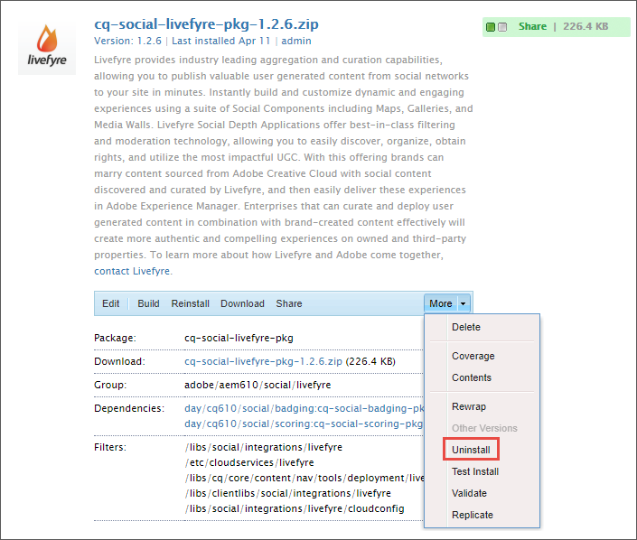
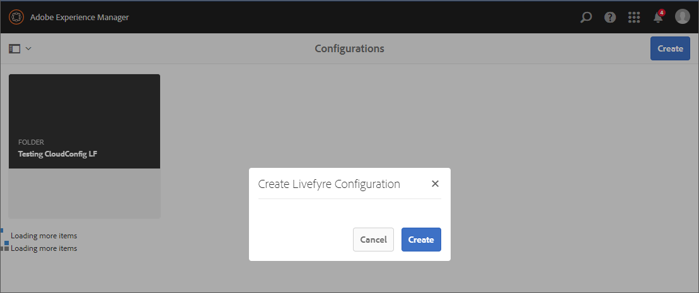

# Integración con Livefyre{#integrating-with-livefyre}

Aprenda a integrar las funciones de depuración líderes del sector de Livefyre con su instancia de AEM 6.5, lo que le permite publicar en su sitio contenido valioso generado por el usuario (UGC) desde las redes sociales en cuestión de minutos.

## Introducción {#getting-started}

### Instalación del paquete de Livefyre para AEM {#install-livefyre-package-for-aem}

AEM 6.5 viene con el paquete de funciones 1.2.6 de Livefyre preinstalado. Este paquete solo incluye integración limitada de Livefyre con AEM Sites y debe desinstalarse antes de instalar un paquete actualizado. Con el último paquete, puede experimentar la integración completa de Livefyre con AEM, incluidos Sitios, Recursos y Comercio.

>[!NOTE]
>
>Algunas características del paquete AEM-LF dependen del Marco de componentes sociales (SCF). Si está utilizando el paquete de características de Livefyre como parte de un sitio que no es de comunidad, debe declarar *cq.social.scf* como dependencia en los clientlibs de autor del sitio web. Si está usando el paquete de características de LF como parte de un sitio web de comunidades, esta dependencia ya debería haberse declarado.

1. En la página de inicio de AEM, haga clic en el **Herramientas** en el carril izquierdo.
1. Vaya a **Implementación > Paquetes**.
1. En el Administrador de paquetes, desplácese hasta que vea el paquete de funciones preinstalado de Livefyre y, a continuación, haga clic en el título del paquete **cq-social-livefyre-pkg-1.2.6.zip** para expandir las opciones.
1. Haga clic en **Más > Desinstalar**.

   

1. Descargue el paquete Livefyre desde [Distribución de software](https://experience.adobe.com/#/downloads/content/software-distribution/es/aem.html).

1. Desde el Administrador de paquetes, instale el paquete descargado. Consulte [Cómo trabajar con paquetes](/help/sites-administering/package-manager.md) para obtener más información sobre el uso de Distribución de software y paquetes en AEM

   

   El paquete Livefyre-AEM ya está instalado. Antes de empezar a utilizar las funciones de integración, debe configurar AEM para utilizar Livefyre.

   Para obtener más información y notas de la versión sobre los paquetes de funciones, consulte [Paquetes de funciones](https://experienceleague.adobe.com/docs/experience-manager-65/release-notes/home.html).

### Configure AEM para utilizar Livefyre: Crear una carpeta de configuración {#configure-aem-to-use-livefyre-create-a-configuration-folder}

1. En la página de inicio de AEM, haga clic en el **Herramientas** en el carril izquierdo y, a continuación, vaya a **General > Explorador de configuración**.
   * Consulte la [Explorador de configuración](/help/sites-administering/configurations.md) documentación para obtener más información.
1. Haga clic en **Crear** para abrir el cuadro de diálogo Crear configuración .
1. Asigne un nombre a la configuración y compruebe la variable **Configuraciones de nube** casilla de verificación.

   Esto creará una carpeta en **Herramientas > Implementación > Configuración de Livefyre** con el nombre proporcionado.

   

### Configure AEM para utilizar Livefyre: Crear una configuración de Livefyre {#configure-aem-to-use-livefyre-create-a-livefyre-configuration}

Configure AEM para utilizar las credenciales de licencia de Livefyre de su organización, lo que permite la comunicación entre Livefyre y AEM.

1. En la página de inicio de AEM, haga clic en el **Herramientas** en el carril izquierdo y, a continuación, vaya a **Implementación > Configuración de Livefyre**.
1. Seleccione la carpeta de configuración en la que desea crear una nueva configuración de Livefyre y, a continuación, haga clic en **Crear**.

   

   >[!NOTE]
   >
   >Las carpetas deben tener Configuraciones de nube habilitadas en sus propiedades para que se puedan añadir configuraciones de Livefyre a ellas. Las carpetas de configuración se crean y administran en la [Explorador de configuración.](/help/sites-administering/configurations.md)
   >
   >No se puede crear un nombre para una configuración; la ruta de acceso de la carpeta en la que se encuentra es la referencia. Solo puede tener una configuración por carpeta.

1. Seleccione la tarjeta de configuración de Livefyre recién creada y haga clic en **Propiedades**.

   

1. Introduzca las credenciales de Livefyre de su organización y haga clic en **OK**.

   

   Para acceder a esta información, abra el estudio Livefyre y navegue hasta **Configuración > Configuración de integración > Credenciales**.

   La instancia de AEM ahora está configurada para utilizar Livefyre y puede utilizar las funciones de integración.

### Personalizar la integración del inicio de sesión único {#customize-single-sign-on-integration}

El paquete Livefyre for AEM incluye una integración predeterminada entre perfiles de AEM Communities y el servicio SSO de Livefyre.

Cuando los usuarios inician sesión en el sitio AEM, también inician sesión en los componentes sociales de Livefyre. Cuando un usuario que ha cerrado la sesión intenta utilizar una función de componente Livefyre que requiera autenticación (como cargar una foto), el componente Livefyre inicia la autenticación de usuarios.

Es posible que la integración de autenticación predeterminada no sea perfecta para cada sitio. Para que coincida mejor con el flujo de autenticación de las plantillas de sitio, puede anular el delegado de autenticación predeterminado de Livefyre para que se ajuste a sus necesidades. Siga estos pasos:

1. Uso del CRXDE Lite, copiar */libs/social/integrations/livefyre/components/authorizablecomponent/authclientlib* a */apps/social/integrations/livefyre/components/authorizablecomponent/authclientlib*.
1. Editar y guardar */apps/social/integrations/livefyre/components/authorizablecomponent/authclientlib/auth.js* para implementar un delegado de autenticación de Livefyre que satisfaga sus necesidades.

   Para obtener más información sobre la personalización de un delegado de autenticación, consulte [Integración de identidad](https://answers.livefyre.com/developers/identity-integration/).

   Para obtener más información sobre AEM Clientlibs, consulte [Uso de bibliotecas del lado del cliente](https://experienceleague.adobe.com/docs/experience-manager-65/developing/introduction/clientlibs.html).

## Uso de Livefyre con AEM Sites {#use-livefyre-with-aem-sites}

### Agregar componentes de Livefyre a una página {#add-livefyre-components-to-a-page}

Antes de agregar componentes de Livefyre a una página dentro de Sitios, debe habilitar Livefyre para la página heredando una configuración de nube de Livefyre de una página principal o agregando la configuración directamente a la página. Consulte la implementación para saber cómo incluir los servicios de nube en el sitio.

Una vez que Livefyre está habilitado para la página, los contenedores deben configurarse para permitir los componentes de Livefyre. Consulte [Configuración de componentes en modo de diseño](https://experienceleague.adobe.com/docs/experience-manager-65/authoring/siteandpage/default-components-designmode.html) para obtener instrucciones sobre cómo habilitar distintos componentes.

>[!NOTE]
>
>Las aplicaciones que requieren autenticación para publicar no funcionan hasta que la autenticación se configura en Personalizar el inicio de sesión único.

1. En el **Componentes** panel lateral en modo de diseño, seleccione **Livefyre** en el menú para limitar la lista a los componentes de Livefyre disponibles.

   

1. Seleccione un componente Livefyre y arrástrelo a su posición en la página.
1. Seleccione si desea crear una nueva aplicación de Livefyre o incrustar una existente.

   Si incrusta una aplicación existente, AEM le pedirá que seleccione la aplicación. Si se crea una aplicación nueva, la aplicación deberá rellenarse antes de que aparezca contenido. La aplicación se creará en el sitio de Livefyre y en la red seleccionada cuando la configuración de la nube de Livefyre esté habilitada para la página.

   Para obtener más información sobre cómo insertar componentes, consulte [Edición del contenido de una página](https://experienceleague.adobe.com/docs/experience-manager-65/authoring/authoring/editing-content.html).

### Editar un componente Livefyre para una página AEM. {#edit-a-livefyre-component-for-an-aem-page}

Solo puede configurar y editar un componente Livefyre en Livefyre Studio. De AEM:

1. Haga clic en el componente Livefyre para configurarlo.
1. Haga clic en el **Configurar** para abrir el cuadro de diálogo de configuración.
1. Haga clic en **Para editar este componente, vaya a Livefyre Studio.**.
1. Edite la aplicación en Livefyre Studio.

## Uso de Livefyre con AEM Assets {#use-livefyre-with-aem-assets}

### Solicitar derechos e importar UGC en AEM Assets {#request-rights-and-import-ugc-into-aem-assets}

Puede importar contenido generado por el usuario (UGC) de Twitter y Instagram de Livefyre Studio a AEM Assets mediante el importador UGC. Después de seleccionar el contenido que desea importar, debe solicitar derechos sobre el contenido antes de completar la importación.

>[!NOTE]
>
>Antes de usar Assets para importar UGC, debe configurar las cuentas de Cuentas sociales y Solicitudes de derechos en Livefyre Studio. Consulte [Configuración: Solicitudes de derechos](https://docs.adobe.com/content/help/en/livefyre/using/rights-requests/c-how-requesting-rights-works.html) para obtener más información.

Para importar UGC en AEM Assets:

1. En la página de inicio de AEM, vaya a **Assets > Archivos**.
1. Haga clic en **Crear** y haga clic en **Importar UGC.**

   

1. Buscar contenido:

   * En Livefyre, haga clic en la ficha Biblioteca UGC . Utilice los filtros y busque contenido de la biblioteca UGC.
   * En Twitter y Instagram, haga clic en la pestaña Twitter o Instagram . Utilice los filtros de búsqueda para encontrar contenido.

1. Seleccione los recursos que desea importar. Los recursos que seleccione se cuentan automáticamente y se guardan en la sección **Seleccionado** pestaña .
1. **Opcional**: Haga clic en el **Seleccionado** y revise el contenido UGC seleccionado para importar.
1. Haga clic en **Siguiente**. 

   

1. Para las solicitudes de derechos, elija una de las siguientes opciones para cada recurso:

   Para Instagram:

   * **Solicitar derechos manualmente** para obtener un mensaje que se pueda copiar, pegar y enviar manualmente a los propietarios de contenido a través de Instagram.
   * **Atributo manual de derechos de contenido** para anular los derechos de recursos individuales.

   >[!NOTE]
   >
   >Debido a las actualizaciones que afectan a la agregación de contenido de cuentas de usuario que no son de negocios, ya no podemos publicar comentarios en su nombre o comprobar automáticamente las respuestas del autor. [Haga clic aquí para obtener más información](https://developers.facebook.com/blog/post/2018/04/04/facebook-api-platform-product-changes/).

   

   Para Twitter:

   * **Autor del mensaje** para enviar un mensaje al propietario del contenido solicitando derechos al recurso.
   * **Atributo manual de derechos de contenido** para anular los derechos de recursos individuales.

1. Haga clic en **Importar**.

   Si ha enviado una solicitud de derechos de Twitter, el propietario del contenido verá el mensaje de solicitud de derechos en su cuenta:

   

   >[!NOTE]
   >
   >Twitter tiene límites en solicitudes idénticas procedentes de la misma cuenta. Al importar más de un par de recursos, modifique los mensajes individualmente para evitar que se marquen.

1. Haga clic en **Listo** en la esquina superior derecha para finalizar el flujo de trabajo Solicitud de derechos .

   Puede ver el estado de una solicitud de derechos pendiente para un recurso en Livefyre Studio. Si el contenido está pendiente de una solicitud de derechos, el recurso no se mostrará en AEM Assets hasta que se concedan los derechos. El recurso aparece automáticamente en AEM Assets cuando se concede una solicitud de derechos.

   Para Instagram, debe rastrear la respuesta del propietario del contenido y conceder derechos manualmente si se le otorgan derechos sobre el contenido.

## Uso de Livefyre con AEM Commerce {#use-livefyre-with-aem-commerce}

### Importar catálogos de productos en Livefyre con AEM Commerce {#import-product-catalogs-into-livefyre-with-aem-commerce}

Los usuarios de AEM Commerce pueden integrar sin problemas su catálogo de productos existente en Livefyre para impulsar la participación del usuario en las aplicaciones de visualización de Livefyre.

Después de importar el catálogo de productos, estos se muestran en tiempo real en la instancia de Livefyre. Si edita o elimina elementos del catálogo de productos de comercio AEM, los cambios se actualizarán automáticamente en Livefrye.

1. Asegúrese de tener instalado el paquete de Livefyre más reciente para AEM en su instancia de AEM.
1. En la página de inicio de AEM, vaya a **AEM Commerce**.
1. Cree una nueva colección o use una colección existente.
1. Pase el ratón sobre la colección y haga clic en **Propiedades de colección** (icono de lápiz).
1. Marque **Sincronizar con Livefyre**.
1. Completar **Prefijo de página de Livefyre** para vincular esta colección a una página específica de AEM.

   El prefijo de página define la ruta raíz del entorno donde comienza la búsqueda de páginas de productos. Livefyre elige la primera página que tiene asociado un producto correspondiente. Para obtener diferentes páginas para diferentes productos, se necesitan varias colecciones.

## Matriz de soporte AEM para aplicaciones de Livefyre {#aem-support-matrix-for-livefyre-apps}

| Aplicaciones de Livefyre | AEM 6.1 | AEM 6.2 | AEM 6.3 | AEM 6.4 |
|---|---|---|---|---|
| Carrusel | X | X | X | X |
| Chat | X | X | X | X |
| Comentarios | X | X | X | X |
| Tira de película |  | X | X | X |
| LiveBlog | X | X | X | X |
| Asignar | X | X | X | X |
| Muro de los medios | X | X | X | X |
| Mosaic | X | X | X | X |
| Encuesta |  | X | X | X |
| Críticas |  | X | X | X |
| Tarjeta única | X | X | X | X |
| Storify 2 |  | X | X | X |
| Tendencias |  | X | X | X |
| Upload Button |  | X | X | X |
