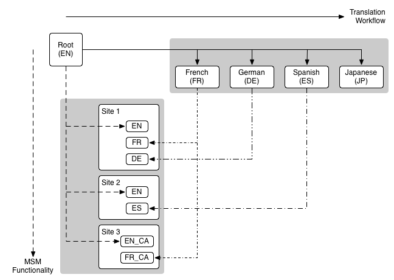

# Administración de sitios web{#website-administration} 

Las siguientes herramientas de administración están disponibles para administrar sitios Web y páginas:

* Multi Site Manager (MSM) le permite utilizar el mismo contenido del sitio en varias ubicaciones, a la vez que permite variaciones:

   * [Reutilización del contenido: Multi Site Manager y Live Copy](/help/sites-administering/msm.md)

* La traducción le permite automatizar la traducción del contenido de la página, los recursos y el contenido generado por el usuario para crear y mantener sitios web multilingües:

   * [Traducción de contenido para sitios multilingües](/help/sites-administering/translation.md)

* Estas dos funciones se pueden combinar para satisfacer las necesidades de los sitios web [multinacionales y multilingües](#multinational-and-multilingual-sites).

## Sitios multinacionales y multilingües {#multinational-and-multilingual-sites}

Puede crear contenido de forma eficaz para sitios multinacionales y multilingües mediante el uso combinado del Administrador de multisitios y el flujo de trabajo de traducción. Cree una ubicación maestra en un idioma, para un país específico, y luego utilice ese contenido como base para los demás sitios, utilizando la traducción cuando sea necesario:

* [Traduzca](/help/sites-administering/translation.md) la ubicación maestra a distintos idiomas.

* Utilice [Multi Site Manager](/help/sites-administering/msm.md) para:

   * Reutilice el contenido de la ubicación maestra, y las traducciones, para crear sitios para otros países y culturas.
   * Asegúrese de limitar el uso de Multi Site Manager al contenido dentro de un idioma, por ejemplo: inglés maestro -> idiomas ingleses en sitios de países, francés maestro -> francés en sitios de países.
   * Cuando sea necesario, separe los elementos de las Live Copies para agregar detalles de localización.

El diagrama siguiente ilustra cómo se intersectan los conceptos principales (pero no muestra todos los niveles/elementos involucrados):

>[!NOTE]
>
>En estos escenarios, y comparables, MSM no administra las diferentes versiones de idioma como tales.
>
>* [MSM](/help/sites-administering/msm.md) administra la implementación de contenido traducido de un modelo (por ejemplo, un maestro global) a las copias en vivo (por ejemplo, los sitios locales), dentro de los límites de un idioma.
>* Las funciones de integración de [traducción](/help/sites-administering/translation.md) de AEM, junto con los servicios de gestión de traducción de terceros, gestionan los idiomas y traducen el contenido a estos idiomas.
>
>
Para casos de uso más avanzados, también se puede usar MSM en los maestros de idioma.

>[!NOTE]
>
>En todos los casos de uso se recomienda leer las siguientes optimizaciones:
>
>* [Prácticas recomendadas para MSM](/help/sites-administering/msm-best-practices.md); particularmente:
   >
   >  
* [Crear sitio](/help/sites-administering/msm-best-practices.md#create-site)
>  * [MSM y sitios web multilingües](/help/sites-administering/msm-best-practices.md#msm-and-multilingual-websites)
   >
   >
* [Prácticas recomendadas para la traducción](/help/sites-administering/tc-bp.md)

