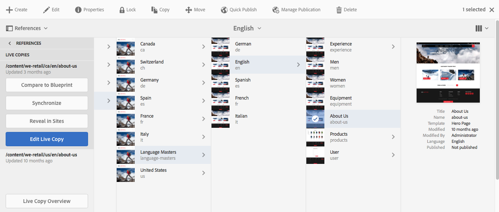

# Consola de información general de Live Copy{#live-copy-overview-console}

La **Live Copy Overview** le permite:

* Ver/administrar la herencia en un sitio:

   * Ver el árbol de modelo y la estructura de Live Copy correspondiente, junto con su estado de herencia
   * Cambiar el estado de herencia; por ejemplo, suspender, reanudar
   * Ver propiedades de modelo y Live Copy

* Realizar acciones de implementación

## Apertura de Live Copy Overview {#opening-the-live-copy-overview}

Puede abrir Live Copy Overview desde:

* [Panel lateral Referencias de una página de modelo (consola Sitios)](#opening-live-copy-overview-references-for-a-blueprint-page)
* [Propiedades de una página de modelo](#opening-live-copy-overview-properties-of-a-blueprint-page)

### Apertura de Live Copy: Referencias para una página de modelo {#opening-live-copy-overview-references-for-a-blueprint-page}

La **Live Copy Overview** se puede abrir desde el panel lateral **Referencias** de la consola **Sitios** :

1. En la consola **Sitios** , [vaya a la página de diseño y selecciónela](/help/sites-authoring/basic-handling.md#viewing-and-selecting-resources).
1. Open the **[References](/help/sites-authoring/basic-handling.md#references)**panel and select **Live Copies**.

   

   >[!NOTE]
   >
   >También puede abrir Referencias primero y luego seleccionar el modelo.

1. Seleccione **Live Copy Overview** para mostrar y utilizar la descripción general de todas las copias activas relacionadas con el modelo seleccionado.
1. Utilice **Cerrar** para salir y volver a la consola **Sitios** .

### Abrir información general de Live Copy: Propiedades de una página de modelo {#opening-live-copy-overview-properties-of-a-blueprint-page}

La Información general **de** Live Copy se puede abrir al ver las propiedades de una página de modelo:

1. Abra **Propiedades** para la página de modelo adecuada.
1. Abra la ficha **Modelo** ; la opción Información general **de** Live Copy se mostrará en la barra de herramientas superior:

   

1. Seleccione **Live Copy Overview** para mostrar y utilizar la descripción general de todas las copias activas relacionadas con el modelo actual.

   >[!NOTE]
   >
   >Para obtener más información, consulte también el artículo de la Base de conocimiento Mensaje de estado de [Livecopy: Actualización/Verde/Sincronización](https://helpx.adobe.com/experience-manager/kb/livecopy-status-message---up-to-date-green-in-sync.html).

1. Utilice **Cerrar** para salir y volver a la consola **Sitios** .

## Uso de Live Copy Overview {#using-the-live-copy-overview}

La **Live Copy Overview** también se puede utilizar para realizar acciones en la Live Copy:

1. Open the **Live Copy Overview**.
1. Seleccione el modelo o la página de Live Copy necesarios: la barra de herramientas se actualizará para mostrar las acciones disponibles. Las [acciones](/help/sites-administering/msm.md#terms-used) disponibles dependen de si selecciona un [modelo](#actions-for-a-blueprint-page) o una página de [Live Copy](#actions-for-a-live-copy-page) :

### Acciones para una página de modelo {#actions-for-a-blueprint-page}

Al seleccionar una página de modelo, están disponibles las siguientes acciones:

* Editar

   * Abra la página de modelo para editarla.

* [Despliegue](/help/sites-administering/msm.md#rollout-and-synchronize)

   * Realice una implementación para insertar cambios del origen a la Live Copy.

### Acciones para una página de Live Copy {#actions-for-a-live-copy-page}

Al seleccionar una página de Live Copy, están disponibles las siguientes acciones:

* Editar

   * Abra la página de Live Copy para editarla.

* [Estado de la relación](#relationship-status)

   * Ver información sobre el estado y la herencia.

* [Sincronizar](/help/sites-administering/msm.md#rollout-and-synchronize)

   * Sincronice una Live Copy para extraer los cambios del origen a la Live Copy.

* [Restablecer](/help/sites-administering/msm-livecopy.md#resetting-a-live-copy-page)

   * Restablezca una página de Live Copy para eliminar todas las cancelaciones de herencia y devolver la página al mismo estado que la página de origen.

* [Suspender](/help/sites-administering/msm.md#suspending-and-cancelling-inheritance-and-synchronization)

   * Desactiva temporalmente la relación activa entre una Live Copy y su página de modelo.

* [Reanudar](/help/sites-administering/msm-livecopy.md#resuming-inheritance-for-a-page)

   * La opción Reanudar le permite restablecer una relación suspendida.

* [Desasociar](/help/sites-administering/msm.md#detaching-a-live-copy)

   * Elimina permanentemente la relación activa entre una Live Copy y su página de modelo.

## Estado de la relación {#relationship-status}

La consola Estado **de** relación tiene dos fichas que proporcionan una amplia gama de funciones:

* [Información de estado de relación](#relationship-status-information)
* [Información de Live Copy](#live-copy-information)

### Información de estado de relación {#relationship-status-information}

Esta ficha proporciona información detallada sobre el estado de la relación entre el modelo y la Live Copy:

### Información de Live Copy {#live-copy-information}

Esta ficha le permite ver y editar la configuración de Live Copy:

