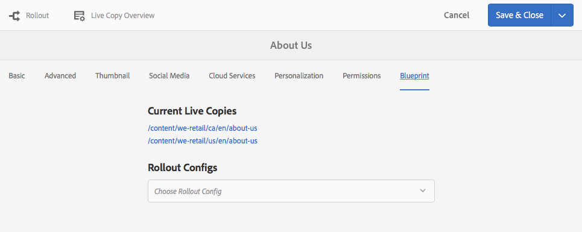
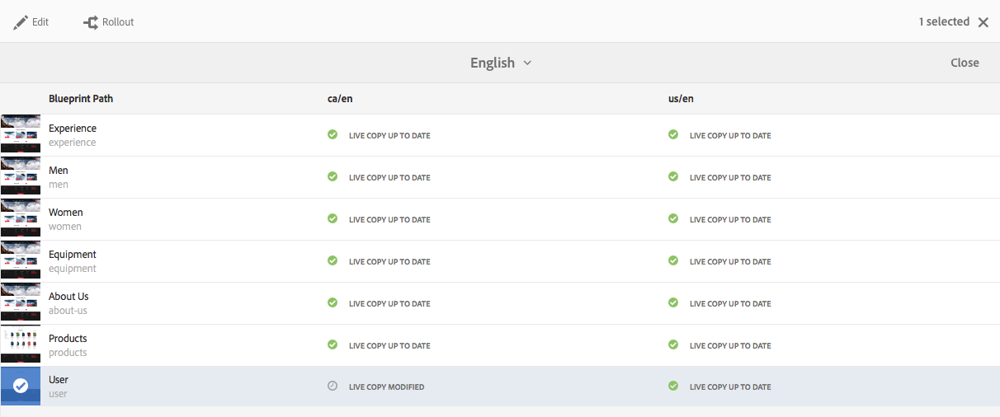
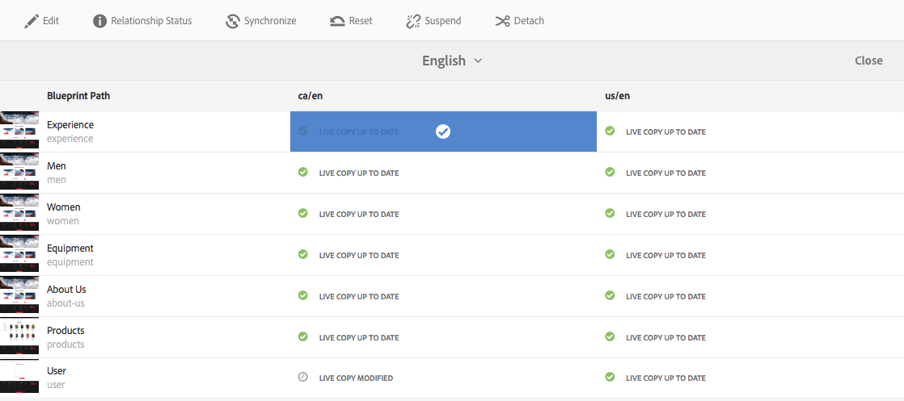

# Información general de Live Copy{#live-copy-overview-console}

El **Información general de Live Copy** le permite:

* Ver/administrar la herencia en un sitio:

   * Ver el árbol de modelo y la estructura correspondiente de Live Copy, junto con su estado de herencia
   * Cambiar el estado de la herencia; por ejemplo, suspender, reanudar
   * Ver las propiedades de modelo y Live Copy

* Realizar acciones de despliegue

## Apertura de la información general de Live Copy {#opening-the-live-copy-overview}

Puede abrir la Información general de Live Copy desde estas ubicaciones:

* [Panel lateral Referencias de una página de modelo (consola Sites)](#opening-live-copy-overview-references-for-a-blueprint-page)
* [Propiedades de una página de modelo](#opening-live-copy-overview-properties-of-a-blueprint-page)

### Apertura de la información general de Live Copy: referencias para una página de modelo {#opening-live-copy-overview-references-for-a-blueprint-page}

La **Información general de Live Copy** se puede abrir desde el panel lateral **Referencias** de la consola **Sites**:

1. En la consola **Sites**, [vaya a la página de modelo y selecciónela](/help/sites-authoring/basic-handling.md#viewing-and-selecting-resources).
1. Abra el **[Referencias](/help/sites-authoring/basic-handling.md#references)** panel y seleccione **Live Copies**.

   

   >[!NOTE]
   >
   >También puede abrir primero Referencias y, a continuación, seleccionar el modelo.

1. Seleccionar **Información general de Live Copy** para mostrar y utilizar la descripción general de todas las live copies relacionadas con el modelo seleccionado.
1. Use **Cerrar** para salir y volver a la consola **Sites**.

### Información general sobre la apertura de Live Copy: propiedades de una página de modelo {#opening-live-copy-overview-properties-of-a-blueprint-page}

La **Información general de Live Copy** se puede abrir al ver las propiedades de una página de modelo:

1. Abra las **Propiedades** de la página de modelo adecuada.
1. Abra la pestaña **Modelo**, la **Información general de Live Copy** se mostrará en la barra de herramientas superior:

   

1. Seleccionar **Información general de Live Copy** para mostrar y utilizar la descripción general de todas las live copies relacionadas con el modelo actual.

   >[!NOTE]
   >
   >Para obtener más información, consulte también el artículo de la Base de conocimiento [Mensaje de estado de LiveCopy: actualizado/verde/sincronizado](https://helpx.adobe.com/experience-manager/kb/livecopy-status-message---up-to-date-green-in-sync.html).

1. Use **Cerrar** para salir y volver a la consola **Sites**.

## Información general sobre el uso de Live Copy {#using-the-live-copy-overview}

El **Información general de Live Copy** también se puede utilizar para realizar acciones en live copy:

1. Abra la **Información general de Live Copy**.
1. Seleccione el modelo necesario o la página de Live Copy: la barra de herramientas se actualizará para mostrar las acciones disponibles. El [acciones](/help/sites-administering/msm.md#terms-used) disponible depende de si selecciona una [modelo](#actions-for-a-blueprint-page) o [live copy](#actions-for-a-live-copy-page) página:

### Acciones para una página de modelo {#actions-for-a-blueprint-page}

Cuando selecciona una página de modelo, están disponibles las siguientes acciones:

* Editar

   * Abra la página de modelo para editarla.

* [Despliegue](/help/sites-administering/msm.md#rollout-and-synchronize)

   * Realice un despliegue para insertar los cambios de origen en la Live Copy.

### Acciones para una página de Live Copy {#actions-for-a-live-copy-page}

Al seleccionar una página de Live Copy, están disponibles las siguientes acciones:

* Editar

   * Abra la página Live Copy para editarla.

* [Estado de la relación](#relationship-status)

   * Ver información sobre el estado y la herencia.

* [Sincronizar](/help/sites-administering/msm.md#rollout-and-synchronize)

   * Sincronice una Live Copy para extraer cambios del origen a la Live Copy.

* [Restablecer](/help/sites-administering/msm-livecopy.md#resetting-a-live-copy-page)

   * Restablezca una página de Live Copy para eliminar todas las cancelaciones de herencia y devuélvala al mismo estado que la página de origen.

* [Suspender](/help/sites-administering/msm.md#suspending-and-cancelling-inheritance-and-synchronization)

   * Desactiva temporalmente la relación activa entre una Live Copy y su página de modelo.

* [Reanudar](/help/sites-administering/msm-livecopy.md#resuming-inheritance-for-a-page)

   * Reanudar le permite restablecer una relación suspendida.

* [Desasociar](/help/sites-administering/msm.md#detaching-a-live-copy)

   * Elimina permanentemente la relación activa entre una Live Copy y su página de modelo.

## Estado de la relación {#relationship-status}

La consola **Estado de la relación** tiene dos pestañas que proporcionan una amplia gama de funcionalidades:

* [Información de estado de relación](#relationship-status-information)
* [Información de Live Copy](#live-copy-information)

### Información de estado de relación {#relationship-status-information}

Esta pestaña proporciona información detallada sobre el estado de la relación entre el modelo y la Live Copy:

### Información de Live Copy {#live-copy-information}

Esta pestaña le permite ver y editar la configuración de Live Copy:

