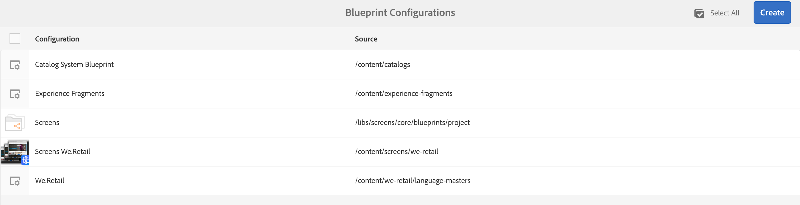
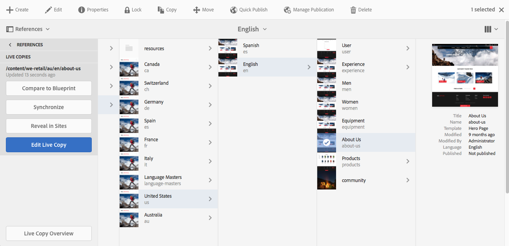

# Creación y sincronización de Live Copies{#creating-and-synchronizing-live-copies}

Puede crear una Live Copy desde una página o configuración de modelo y, a continuación, administrar la herencia y la sincronización.

## Administración de configuraciones de modelo {#managing-blueprint-configurations}

Una configuración de modelo identifica un sitio web existente que desea utilizar como fuente para una o varias páginas de Live Copy.

>[!NOTE]
>
>Las configuraciones de modelo le permiten insertar cambios de contenido en copias en vivo. Consulte [Live Copies: configuración de origen, modelos y modelo](/help/sites-administering/msm.md#source-blueprints-and-blueprint-configurations).

Cuando se crea una configuración de modelo, se selecciona una plantilla que define la estructura interna del modelo. La plantilla de modelo predeterminada supone que el sitio web de origen tiene las siguientes características:

* El sitio Web tiene una página raíz.
* Las páginas secundarias inmediatas de la raíz son ramas de idioma del sitio Web. Al crear una Live Copy, los idiomas se presentan como contenido opcional para incluirlos en la copia.
* La raíz de cada rama de idioma tiene una o más páginas secundarias. Al crear una Live Copy, las páginas secundarias se presentan como capítulos que puede incluir en la Live Copy.

>[!NOTE]
>
>Una estructura diferente requiere otra plantilla de modelo.

Después de crear la configuración de modelo, configure las siguientes propiedades:

* **Nombre**: Nombre de la configuración de modelo.
* **Ruta** de origen: Ruta de la página raíz del sitio que está utilizando como origen (modelo).
* **Descripción**. (Opcional) Una descripción de la configuración del modelo. La descripción aparece en la lista de configuraciones de modelo entre las que elegir al crear un sitio.

Cuando se utiliza la configuración de modelo, puede asociarla con una configuración de implementación que determina cómo se sincronizan las copias en vivo del origen/modelo. Consulte [Especificación de las configuraciones de despliegue que utilizar](/help/sites-administering/msm-sync.md#specifying-the-rollout-configurations-to-use).

### Creación de una configuración de modelo {#creating-a-blueprint-configuration}

Para crear una configuración de modelo:

1.  Navegue hasta el  **** menú Herramientas y, a continuación, seleccione el  **** menú Sitio.
1. Seleccione **Modelos** para abrir la consola **Configuraciones de modelo**:

   

1. Seleccione **Crear**.
1. Seleccione la plantilla de modelo y, a continuación, **Siguiente** para continuar.
1. Seleccione la página de origen que se utilizará como modelo; luego **Siguiente** para continuar.
1. Definir:

   * **Título**: título obligatorio para el modelo
   * **Descripción**: una descripción opcional para proporcionar más detalles.

1. **La** creación creará la configuración de modelo según sus especificaciones.

### Edición o eliminación de una configuración de modelo {#editing-or-deleting-a-blueprint-configuration}

Puede editar o eliminar una configuración de modelo existente:

1.  Navegue hasta el  **** menú Herramientas y, a continuación, seleccione el  **** menú Sitio.
1. Seleccione **Modelos** para abrir la consola **Configuraciones de modelo**:

   

1. Seleccione la configuración de modelo requerida: las acciones correspondientes estarán disponibles en la barra de herramientas:

   * **Propiedades**; puede utilizarla para la vista y, a continuación, editar las propiedades de la configuración.
   * **Eliminar**

## Creación de una copia activa {#creating-a-live-copy}

### Creación de una Live Copy de una página {#creating-a-live-copy-of-a-page}

Puede crear una Live Copy de cualquier página o rama. Al crear la Live Copy, puede especificar las configuraciones de despliegue que se utilizarán para sincronizar el contenido:

* Las configuraciones de implementación seleccionadas se aplican a la página de Live Copy y a sus páginas secundarias.
* Si no especifica ninguna configuración de implementación, MSM determina qué configuraciones de implementación utilizar. Consulte [Especificación de la configuración de despliegue para utilizar](/help/sites-administering/msm-sync.md#specifying-the-rollout-configurations-to-use).

Puede crear una Live Copy de cualquier página:

* Páginas a las que hace referencia una [configuración de modelo](#creating-a-blueprint-configuration).
* Y páginas que no tienen conexión con una configuración.
* AEM también admite la creación de una Live Copy dentro de las páginas de otra Live Copy.

La única diferencia es que la disponibilidad del comando **Implementar** en las páginas de origen/modelo depende de si una configuración de modelo hace referencia al origen:

* Si crea la Live Copy desde una página de origen a la que **se hace referencia** en una configuración de modelo, el comando Despliegue estará disponible en las páginas de origen/modelo.
* Si crea la Live Copy desde una página de origen a la que **no se hace referencia** en una configuración de modelo, el comando Despliegue no estará disponible en las páginas de origen/modelo.

Para crear una Live Copy:

1. En la consola **Sitios** seleccione **Crear** y, a continuación, **Live Copy**.

   

1. Seleccione la página de origen y toque o haga clic en **Siguiente**. Por ejemplo:

   

1. Especifique la ruta de destino de la Live Copy (abra la carpeta o página principal de la Live Copy) y, a continuación, toque o haga clic en **Siguiente**.

   

   >[!NOTE]
   >
   >La ruta de destino no puede estar dentro de la ruta de origen.

1. Intro:

   * a **Título** para la página.
   * **Nombre**, que se utiliza en la dirección URL.

   

1. Utilice la casilla **Excluir subpáginas**:

   * Seleccionado: crear una Live Copy de la página seleccionada solamente (Live Copy superficial)
   * No seleccionado: crear una Live Copy que incluya todos los descendientes de la página seleccionada (Live Copy)

1. (Opcional) Para especificar una o más configuraciones de implementación que se utilizarán para la Live Copy, utilice la lista desplegable **Configuraciones de despliegue** para seleccionarlas; las configuraciones seleccionadas se mostrarán debajo del selector desplegable.
1. Haga clic o pulse **Crear**. Se mostrará un mensaje de confirmación, desde donde puede seleccionar **Abrir** o **Listo**.

### Creación de una Live Copy de un sitio a partir de una configuración de modelo {#creating-a-live-copy-of-a-site-from-a-blueprint-configuration}

Cree una Live Copy con una configuración de modelo para crear un sitio basado en el contenido del modelo (origen). Cuando se crea una Live Copy desde una configuración de modelo, se seleccionan una o varias ramas de idioma del origen de modelo que se van a copiar y, a continuación, se seleccionan los capítulos que se van a copiar de las ramas de idioma. Consulte [Creación de una configuración de modelo](/help/sites-administering/msm-livecopy.md#creating-a-blueprint-configuration).

Si omite algunas ramas de idioma o capítulos de la Live Copy, puede agregarlos más adelante; consulte [Creación de una Live Copy dentro de una Live Copy (Configuración de modelo)](#creating-a-live-copy-inside-a-live-copy-blueprint-configuration).

>[!CAUTION]
>
>Cuando el origen del modelo contiene vínculos y referencias que destinatario un párrafo en una rama diferente, los destinatarios no se actualizan en las páginas de Live Copy, sino que siguen apuntando al destino original.

Cuando cree el sitio, proporcione valores para las siguientes propiedades:

* **Idiomas** iniciales: Ramas de idioma del origen del modelo que se incluirán en la Live Copy.
* **Capítulos** iniciales: Las páginas secundarias del idioma del modelo se ramifican para incluir en la Live Copy.
* **Ruta** de destino: Ubicación de la página raíz del sitio de Live Copy.
* **Título**: Título de la página raíz del sitio de Live Copy.
* **Nombre**: (Opcional) El nombre del nodo JCR que almacena la página raíz de la Live Copy. El valor predeterminado se basa en el título.
* **Propietario** del sitio: (Opcional)
* **Live Copy**: Seleccione esta opción para establecer una relación activa con el sitio de origen. Si no selecciona esta opción, se crea una copia del modelo pero no se sincroniza posteriormente con el origen.
* **Configuraciones** de despliegue: (Opcional) Seleccione una o varias configuraciones de implementación para sincronizar la Live Copy. De forma predeterminada, las configuraciones de implementación se heredan del modelo; consulte [Especificación de las configuraciones de despliegue para utilizar](/help/sites-administering/msm-sync.md#specifying-the-rollout-configurations-to-use) para obtener más detalles.

Para crear una Live Copy de un sitio a partir de una configuración de modelo:

1. En la consola **Sitios**, seleccione **Crear** y luego **Sitio** en el selector desplegable.
1. Seleccione la configuración de modelo que se utilizará como origen de la Live Copy y continúe con **Siguiente**:

   

1. Utilice el selector **Idiomas iniciales** para especificar el idioma o los idiomas del sitio de modelo que se utilizarán para la Live Copy.

   De forma predeterminada, se seleccionan todos los idiomas disponibles. Para eliminar un idioma, toque o haga clic en **X** que aparece junto al idioma.

   Por ejemplo:

   

1. Utilice la lista desplegable **Capítulos iniciales** para seleccionar las secciones del modelo que se incluirán en la Live Copy. De nuevo, todos los capítulos disponibles se incluyen de forma predeterminada, pero se pueden eliminar.
1. Proporcione valores para las propiedades restantes y, a continuación, seleccione **Crear**. En el cuadro de diálogo de confirmación, seleccione **Listo** para volver a la consola **Sitios** o **Abrir sitio** para abrir la página raíz del sitio.

### Creación de una Live Copy dentro de una Live Copy (Configuración de modelo) {#creating-a-live-copy-inside-a-live-copy-blueprint-configuration}

Al crear una Live Copy dentro de la Live Copy existente (creada con una configuración de modelo), puede insertar cualquier copia de idioma o capítulos que no se incluyeron cuando se creó originalmente la Live Copy.

## Monitoreo de Live Copy {#monitoring-your-live-copy}

### Ver el estado de una Live Copy {#seeing-the-status-of-a-live-copy}

Las propiedades de una página de Live Copy muestran la siguiente información sobre la Live Copy:

* **Fuente**: La página de origen de la página de Live Copy.
* **Estado**: Estado de sincronización de la Live Copy. El estado incluye si la Live Copy está actualizada con el origen, cuándo se produjo la última sincronización y quién realizó la sincronización.
* **Configuración**:

   * Indica si la página sigue estando sujeta a la herencia de Live Copy.
   * Indica si la configuración se hereda de la página principal.
   * Cualquier configuración de implementación que utilice Live Copy.

Para vista de las propiedades:

1. En la consola **Sitios**, seleccione la página de Live Copy y abra las propiedades.
1. Seleccione la ficha **Live Copy**.

   Por ejemplo:

   

   >[!NOTE]
   >
   >Para obtener más información, consulte también el artículo de la Base de conocimiento [Mensaje de estado de Live Copy: Actualizado/Verde/En sincronización](https://helpx.adobe.com/experience-manager/kb/livecopy-status-message---up-to-date-green-in-sync.html).

### Ver las Live Copies de una página de modelo {#seeing-the-live-copies-of-a-blueprint-page}

Las páginas de modelo (a las que se hace referencia en una configuración de modelo) proporcionan una lista de las páginas de Live Copy que utilizan la página actual (modelo) como origen. Utilice esta lista para realizar un seguimiento de las copias en directo. La lista aparece en la ficha **Modelo** de las [propiedades de página](/help/sites-authoring/editing-page-properties.md).

## Sincronización de Live Copy {#synchronizing-your-live-copy}

### Despliegue de un modelo {#rolling-out-a-blueprint}

Despliegue una página de modelo para insertar los cambios de contenido en copias en vivo. Una acción **Despliegue** ejecuta las configuraciones de implementación que utilizan el activador [Al despliegue](/help/sites-administering/msm-sync.md#rollout-triggers).

>[!NOTE]
>
>Pueden producirse conflictos si se crean páginas nuevas con el mismo nombre de página en la rama de modelo y en una rama de Live Copy dependiente.
>
>Estos [conflictos deben manejarse y resolverse al implementar](/help/sites-administering/msm-rollout-conflicts.md).

#### Despliegue de un modelo a partir de las propiedades de página {#rolling-out-a-blueprint-from-page-properties}

1. En la consola **Sites**, seleccione la página en el modelo y abra las propiedades.
1. Abra la ficha **Modelo**.
1. Seleccione **Despliegue**.

   

1. Especifique las páginas y las subpáginas y, a continuación, confirme con la marca de verificación:

   

1. Especifique si el trabajo de implementación debe ejecutarse inmediatamente (**Ahora**) o en otra fecha/hora (**Más adelante**).

   

Los despliegues se procesan como trabajos asincrónicos y se pueden registrar en el [**Estado de trabajos asincrónicos** panel](asynchronous-jobs.md#monitor-the-status-of-asynchronous-operations) en **Navegación global** -> **Herramientas** -> **Operaciones** -> **Trabajos**

>[!NOTE]
>
>El procesamiento de implementación asincrónica requiere AEM 6.5.3.0 o superior. En versiones anteriores, las páginas se procesaban de forma inmediata y sincrónica.

#### Despliegue un modelo desde el carril de referencia {#roll-out-a-blueprint-from-the-reference-rail}

1. En la consola **Sitios**, seleccione la página en el modelo y abra el panel **[Referencias](/help/sites-authoring/basic-handling.md#references)** (en la barra de herramientas).
1. Seleccione la opción **Modelo** de la lista para mostrar los modelos asociados con esta página.
1. Seleccione el modelo requerido en la lista.
1. Toque o haga clic en **Desplegar**.
1. Se le pedirá que confirme los detalles de la implementación:

   * **Ámbito de despliegue**:

      Especifique si el ámbito es solo para la página seleccionada o si debe incluir subpáginas.

   * **Programa**:

      Especifique si el trabajo de implementación debe ejecutarse inmediatamente (**Ahora**) o en una fecha/hora posterior (**Más adelante**).

      

1. Después de confirmar estos detalles, seleccione **Despliegue** para realizar la acción.

Los despliegues se procesan como trabajos asincrónicos y se pueden registrar en el [**Estado de trabajos asincrónicos** panel](asynchronous-jobs.md#monitor-the-status-of-asynchronous-operations) en **Navegación global** -> **Herramientas** -> **Operaciones** -> **Trabajos**

>[!NOTE]
>
>El procesamiento de implementación asincrónica requiere AEM 6.5.3.0 o superior. En versiones anteriores, las páginas se procesaban inmediatamente y sincrónicamente a menos que se activara la opción **Despliegue en segundo plano**.

#### Despliegue un modelo desde Live Copy Overview {#roll-out-a-blueprint-from-the-live-copy-overview}

La acción [Despliegue también está disponible en Live Copy Overview](/help/sites-administering/msm-livecopy-overview.md#using-the-live-copy-overview), cuando se selecciona una página de modelo.

1. Abra [Live Copy Overview](/help/sites-administering/msm-livecopy-overview.md#using-the-live-copy-overview) y seleccione una página de modelo.
1. Seleccione **Despliegue** en la barra de herramientas.
1. Especifique las páginas y las subpáginas y, a continuación, confirme con la marca de verificación:

   

1. Especifique si el trabajo de implementación debe ejecutarse inmediatamente (**Ahora**) o en otra fecha/hora (**Más adelante**).

   

Los despliegues se procesan como trabajos asincrónicos y se pueden registrar en el [**Estado de trabajos asincrónicos** panel](asynchronous-jobs.md#monitor-the-status-of-asynchronous-operations) en **Navegación global** -> **Herramientas** -> **Operaciones** -> **Trabajos**

>[!NOTE]
>
>El procesamiento de implementación asincrónica requiere AEM 6.5.3.0 o superior. En versiones anteriores, las páginas se procesaban de forma inmediata y sincrónica.

### Sincronización de Live Copy {#synchronizing-a-live-copy}

Sincronice una página de Live Copy para extraer los cambios de contenido del origen a la Live Copy.

#### Sincronizar una Live Copy desde las propiedades de la página {#synchronize-a-live-copy-from-page-properties}

Sincronice una Live Copy para extraer los cambios del origen a la Live Copy.

>[!NOTE]
>
>La sincronización ejecuta las configuraciones de implementación que utilizan el activador [Al implementar](/help/sites-administering/msm-sync.md#rollout-triggers).

1. En la consola **Sitios**, seleccione la página de Live Copy y abra las propiedades.
1. Abra la ficha **Live Copy**.
1. Toque o haga clic en **Sincronizar**.

   

   Se solicitará confirmación, use **Sync** para continuar.

#### Sincronizar una Live Copy desde Live Copy Overview {#synchronize-a-live-copy-from-the-live-copy-overview}

La acción [Sincronizar también está disponible en Live Copy Overview](/help/sites-administering/msm-livecopy-overview.md#using-the-live-copy-overview), cuando se selecciona una página de Live Copy.

1. Abra la [Información general de Live Copy](/help/sites-administering/msm-livecopy-overview.md#using-the-live-copy-overview) y seleccione una página de Live Copy.
1. Seleccione **Sincronizar** en la barra de herramientas.
1. Confirme la acción **Despliegue** en el cuadro de diálogo después de especificar si desea incluir:

   * **Página y páginas secundarias**
   * **Página solamente**

   

## Cambio del contenido de Live Copy {#changing-live-copy-content}

Para cambiar el contenido de Live Copy, puede:

* Añada párrafos a la página.
* Actualice el contenido existente rompiendo la herencia de la Live Copy para cualquier página o componente.

>[!NOTE]
>
>Si crea manualmente una nueva página en la Live Copy, entonces es local a la Live Copy, lo que significa que no tiene una página de origen correspondiente a la que adjuntar.
>
>La mejor forma de crear una página local que forme parte de la relación es crearla en el origen y realizar un despliegue (profundo). Esto creará la página localmente como copias en vivo.

>[!NOTE]
>
>Pueden producirse conflictos si se crean páginas nuevas con el mismo nombre de página en la rama de modelo y en una rama de Live Copy dependiente.
>
>Estos [conflictos deben manejarse y resolverse al implementar](/help/sites-administering/msm-rollout-conflicts.md).

### Añadir componentes en una página de Live Copy {#adding-components-to-a-live-copy-page}

Añada componentes en una página de Live Copy en cualquier momento. El estado de herencia de la Live Copy y su sistema de párrafos no controla la capacidad de agregar componentes.

Cuando la página de Live Copy se sincroniza con la página de origen, los componentes agregados permanecen sin cambios. Consulte también [Cambio del orden de los componentes en una página de Live Copy](#changing-the-order-of-components-on-a-live-copy-page).

>[!NOTE]
>
>Los cambios realizados localmente en un componente marcado como contenedor no se sobrescribirán con el contenido del plano en una implementación. Consulte [Prácticas recomendadas de MSM](/help/sites-administering/msm-best-practices.md#components-and-container-synchronization) para obtener más información.

### Suspensión de herencia para una página {#suspending-inheritance-for-a-page}

Al crear una Live Copy, la configuración de Live Copy se guarda en la página raíz de las páginas copiadas. Todas las páginas secundarias de la página raíz heredan las configuraciones de Live Copy. Los componentes de las páginas de Live Copy también heredan la configuración de Live Copy.

Puede suspender la herencia de Live Copy para una página de Live Copy, de modo que pueda cambiar las propiedades y los componentes de la página. Al suspender la herencia, las propiedades y los componentes de la página ya no se sincronizan con el origen.

>[!NOTE]
>
>También puede [separar una Live Copy](#detaching-a-live-copy) de su modelo para eliminar todas las conexiones. La acción Desconectar es permanente e irreversible.

#### Suspensión de herencia de propiedades de página {#suspending-inheritance-from-page-properties}

Para suspender la herencia en una página:

1. Abra las propiedades de la página de Live Copy utilizando el comando **Propiedades de la Vista** de la consola **Sitios** o utilizando **Información de la página** en la barra de herramientas de la página.
1. Toque o haga clic en la ficha **Live Copy**.
1. Seleccione **Suspender** en la barra de herramientas. A continuación, puede seleccionar una de las opciones siguientes:

   * **Suspender**: solo página actual
   * **Suspender con niños**: página actual junto con cualquier página secundaria

1. Seleccione **Suspender** en el cuadro de diálogo de confirmación.

#### Suspensión de herencia de Live Copy Overview {#suspending-inheritance-from-the-live-copy-overview}

La acción [Suspender también está disponible en Live Copy Overview](/help/sites-administering/msm-livecopy-overview.md#using-the-live-copy-overview), cuando se selecciona una página de Live Copy.

1. Abra la [Información general de Live Copy](/help/sites-administering/msm-livecopy-overview.md#using-the-live-copy-overview) y seleccione una página de Live Copy.
1. Seleccione **Suspender** en la barra de herramientas.
1. Seleccione la opción adecuada en:

   * **Suspender**
   * **suspender con elto.sup.**

   

1. Confirme la acción **Suspender** en el cuadro de diálogo **Suspender Live Copy**:

   

### Reanudación de la herencia de una página {#resuming-inheritance-for-a-page}

Suspender la herencia de Live Copy para una página es una acción temporal. Una vez suspendida, la acción **Reanudar** estará disponible, lo que le permitirá reinstaurar la relación activa.

Al volver a habilitar la herencia, la página no se sincroniza automáticamente con el origen. Si es necesario, puede solicitar una sincronización, ya sea:

* En el cuadro de diálogo **Reanudar**/**Revertir**; por ejemplo:

   

* En una etapa posterior, seleccionando manualmente la acción de sincronización.

>[!CAUTION]
>
>Al volver a habilitar la herencia, la página no se sincroniza automáticamente con el origen. Si es necesario, puede solicitar manualmente una sincronización; en el momento de la reanudación o más tarde.

#### Reanudación de la herencia de las propiedades de página {#resuming-inheritance-from-page-properties}

Una vez [suspendida](#suspending-inheritance-from-page-properties) la acción **Reanudar** se convierte en la barra de herramientas de las propiedades de la página:

Cuando se selecciona, se muestra el cuadro de diálogo. Puede seleccionar una sincronización, si es necesario, y confirmar la acción.

#### Reanudar una página de Live Copy desde Live Copy Overview {#resume-a-live-copy-page-from-the-live-copy-overview}

La acción [Reanudar también está disponible en Live Copy Overview](/help/sites-administering/msm-livecopy-overview.md#using-the-live-copy-overview), cuando se selecciona una página de Live Copy.

1. Abra [Live Copy Overview](/help/sites-administering/msm-livecopy-overview.md#using-the-live-copy-overview) y seleccione una Live Copy Page que se haya suspendido; se mostrará como **HERENCIA CANCELADA**.
1. Seleccione **Reanudar** en la barra de herramientas.
1. Indique si desea sincronizar la página después de revertir la herencia y, a continuación, confirme la acción **Reanudar** en el cuadro de diálogo **Reanudar Live Copy**.

### Cambio de la profundidad de herencia (superficial/profunda) {#changing-inheritance-depth-shallow-deep}

En una Live Copy existente puede cambiar la profundidad de una página; es decir, si se incluyen las páginas secundarias.

* Cambiar a una copia en directo superficial:

   * Tendrá un efecto inmediato y es irreversible.

      * Las páginas secundarias se separan explícitamente de la Live Copy. Si se deshace, no se podrán conservar otras modificaciones en niños.

      * Eliminará cualquier descendiente `LiveRelationships` aunque haya anidado `LiveCopies`.

* Cambiar a una Live Copy profunda:

   * Las páginas secundarias permanecen intactas.
   * Para ver el efecto del conmutador, puede realizar un despliegue, cualquier modificación de contenido se aplica según la configuración de implementación.

* Cambiar a una copia en vivo superficial y, a continuación, volver a lo profundo:

   * Todos los elementos secundarios de la (anteriormente) copia en vivo poco profunda se tratan como si se hubieran creado manualmente y, por lo tanto, se mueven utilizando `[oldname]_msm_moved name`.

Para especificar o cambiar la profundidad:

1. Abra las propiedades de la página de Live Copy utilizando el comando **Propiedades de la Vista** de la consola **Sitios** o utilizando **Información de la página** en la barra de herramientas de la página.
1. Toque o haga clic en la ficha **Live Copy**.
1. En la sección **Configuración**, establezca o borre la opción **Herencia de Live Copy** en función de si se incluyen páginas secundarias:

   * marcado: una Live Copy profunda (se incluyen las páginas secundarias)
   * clear: una copia en vivo superficial (se excluyen las páginas secundarias)

   >[!CAUTION]
   >
   >Cambiar a una copia en vivo superficial tendrá un efecto inmediato y es irreversible.
   >
   >Consulte [Live Copies - Composición](/help/sites-administering/msm.md#live-copies-composition) para obtener más información.

1. Toque o haga clic en **Guardar** para mantener las actualizaciones.

### Cancelación de la herencia de un componente {#cancelling-inheritance-for-a-component}

Cancele la herencia de Live Copy de un componente para que el componente ya no se sincronice con el componente de origen. Si es necesario, puede activar la herencia más adelante.

>[!NOTE]
>
>Al volver a habilitar la herencia, el componente no se sincroniza automáticamente con el origen. Puede solicitar manualmente una sincronización si es necesario.

Cancele la herencia para cambiar el contenido del componente o eliminarlo:

1. Toque o haga clic en el componente para el que desea cancelar la herencia.

   

1. En la barra de herramientas del componente, toque o haga clic en el icono **Cancelar herencia**.

   

1. En el cuadro de diálogo Cancelar herencia, confirme la acción con **Sí**.

   La barra de herramientas de componentes se actualiza para incluir todos los comandos de edición (adecuados).

### Volver a habilitar la herencia para un componente {#re-enabling-inheritance-for-a-component}

Para habilitar la herencia para un componente, toque o haga clic en el icono **Volver a habilitar la herencia** en la barra de herramientas del componente.

### Cambio del orden de los componentes en una página de Live Copy {#changing-the-order-of-components-on-a-live-copy-page}

Si una Live Copy contiene componentes que forman parte de un sistema de párrafos, la herencia de dicho sistema de párrafos se ajusta a las siguientes reglas:

* Se puede modificar el orden de los componentes de un sistema de párrafos heredado, incluso con la herencia establecida.
* Al implementar, el orden de los componentes se restaurará a partir del modelo. si se agregaron nuevos componentes a la Live Copy antes de la implementación, se reordenarán junto con los componentes por encima de los cuales se agregaron.
* Si se cancela la herencia del sistema de párrafos, el orden de los componentes no se restaurará durante la implementación y permanecerá tal y como está en la Live Copy.

>[!NOTE]
>
>Cuando se revierte una herencia cancelada en un sistema de párrafos, el orden de los componentes **no se restaurará automáticamente** desde el plano. Puede solicitar manualmente una sincronización si es necesario.

Utilice el siguiente procedimiento para cancelar la herencia del sistema de párrafos.

1. Abra la página de Live Copy.
1. Arrastre un componente existente a una nueva ubicación en la página.
1. En el cuadro de diálogo **Cancelar herencia**, confirme la acción con **Sí**.

### Anulación de las propiedades de una página de Live Copy {#overriding-properties-of-a-live-copy-page}

De forma predeterminada, las propiedades de página de una página Live Copy se heredan (y no se pueden editar) de la página de origen.

Puede cancelar la herencia de una propiedad cuando necesite cambiar el valor de la propiedad para la Live Copy. Un icono de vínculo indica que la herencia está habilitada para la propiedad.

Al cancelar la herencia, puede cambiar el valor de la propiedad. Un icono de vínculo roto indica que se ha cancelado la herencia.

Posteriormente, puede volver a habilitar la herencia para una propiedad si es necesario.

>[!NOTE]
>
>Al volver a habilitar la herencia, la propiedad de la página de Live Copy no se sincroniza automáticamente con la propiedad source. Puede solicitar manualmente una sincronización si es necesario.

1. Abra las propiedades de la página de Live Copy con la opción **Propiedades de la Vista** de la consola **Sitios** o con el icono **Información de la página** de la barra de herramientas de la página.
1. Para cancelar la herencia de una propiedad, toque o haga clic en el icono de vínculo que aparece a la derecha de la propiedad.

   

1. En el cuadro de diálogo de confirmación **Cancelar herencia**, toque o haga clic en **Sí**.

### Revertir propiedades de una página de Live Copy {#revert-properties-of-a-live-copy-page}

Para habilitar la herencia para una propiedad, toque o haga clic en el icono **Revertir herencia** que aparece junto a la propiedad.

### Restablecimiento de una página de Live Copy {#resetting-a-live-copy-page}

Restablecer una página de Live Copy a:

* Eliminar todas las cancelaciones de herencia y
* Devuelva la página al mismo estado que la página de origen.

El restablecimiento afecta a los cambios realizados en las propiedades de la página, el sistema de párrafos y los componentes.

#### Restablecer una página de Live Copy desde las propiedades de la página {#reset-a-live-copy-page-from-the-page-properties}

1. En la consola **Sitios**, seleccione la página de Live Copy y seleccione **Propiedades de la Vista**.
1. Abra la ficha **Live Copy**.
1. Seleccione **Restablecer** en la barra de herramientas.

   

1. En el cuadro de diálogo **Restablecer Live Copy**, confirme con **Restablecer**.

#### Restablecer una página de Live Copy desde Live Copy Overview {#reset-a-live-copy-page-from-the-live-copy-overview}

La acción [Restaurar también está disponible en Live Copy Overview](/help/sites-administering/msm-livecopy-overview.md#using-the-live-copy-overview), cuando se selecciona una página Live Copy.

1. Abra la [Información general de Live Copy](/help/sites-administering/msm-livecopy-overview.md#using-the-live-copy-overview) y seleccione una página de Live Copy.
1. Seleccione **Restablecer** en la barra de herramientas.
1. Confirme la acción **Restablecer** en el cuadro de diálogo **Restablecer Live Copy**:

   

## Comparación de una página de Live Copy con una página de modelo {#comparing-a-live-copy-page-with-a-blueprint-page}

Para realizar el seguimiento de los cambios realizados, puede realizar la vista de la página de modelo en **Referencias** y compararla con su página de Live Copy:

1. En la consola **Sites**, [navegue a una página de diseño o Live Copy y selecciónela](/help/sites-authoring/basic-handling.md#viewing-and-selecting-resources).
1. Abra el panel **[Referencias](/help/sites-authoring/basic-handling.md#references)** y seleccione:

   * **Modelo**  (cuando se selecciona una página de Live Copy)
   * **Live Copies**  (cuando se selecciona una página de modelo)

1. Seleccione la Live Copy específica y, a continuación, haga lo siguiente:

   * **Comparar con modelo**  (cuando se selecciona una página de Live Copy)
   * **Comparar con Live Copy**  (cuando se selecciona una página de modelo)

   Por ejemplo:

   

1. Las dos páginas (Live Copy y blueprint) se abrirán en paralelo.

   Para obtener información completa sobre el uso de esta característica, consulte la [diferencia de la página](/help/sites-authoring/page-diff.md).

## Desconexión de Live Copy {#detaching-a-live-copy}

Separar de forma permanente elimina la relación activa entre una Live Copy y su página de origen/modelo. Todas las propiedades relevantes para MSM se eliminan de la Live Copy y las páginas de Live Copy se convierten en una copia independiente.

>[!CAUTION]
>
>No puede restablecer la relación activa después de desconectar la copia activa.
>
>Para eliminar la relación activa con la opción de reinstalarla posteriormente, puede [cancelar la herencia de Live Copy](#suspending-inheritance-for-a-page) para la página.

Existen implicaciones en cuanto a dónde dentro del árbol utiliza **Desasociar**:

* **Desasociar en una página raíz de LiveCopy**

   Cuando esta operación se realiza en la página raíz de una Live Copy, se elimina la relación activa entre todas las páginas del modelo y su Live Copy.

   Si se realizan más cambios en las páginas del modelo (tal como estaba) **no se** afectará la Live Copy (tal como estaba).

* **Desasociar en una subpágina de LiveCopy**

   Cuando esta operación se realiza en una subpágina (o rama) dentro de una Live Copy:

   * la relación activa se elimina para esa subpágina (o rama)
   * y las (sub)páginas de la rama de Live Copy se tratan como si se hubieran creado manualmente.

   *Sin embargo*, las subpáginas siguen estando sujetas a la relación activa de la rama principal, por lo que una implementación adicional de las páginas de modelo:

   1. Cambie el nombre de las páginas separadas:

      * Esto se debe a que MSM los considera páginas creadas manualmente que causan un conflicto, ya que tienen el mismo nombre que las páginas de Live Copy que intenta crear.
   1. Cree una nueva página (Live Copy) con el nombre original, que contenga los cambios de la implementación.

   >[!NOTE]
   >
   >Consulte [Conflictos de despliegue de MSM](/help/sites-administering/msm-rollout-conflicts.md) para obtener detalles de estas situaciones.

### Desasociar una página Live Copy de las propiedades de la página {#detach-a-live-copy-page-from-the-page-properties}

Para separar una Live Copy:

1. En la consola **Sitios**, seleccione la página de Live Copy y toque o haga clic en **Propiedades de la Vista**.
1. Abra la ficha **Live Copy**.
1. En la barra de herramientas, seleccione **Desasociar**.

   

1. Se mostrará un cuadro de diálogo de confirmación, seleccione **Desasociar** para completar la acción.

### Desasociar una página Live Copy de Live Copy Overview {#detach-a-live-copy-page-from-the-live-copy-overview}

La acción [Desasociar también está disponible en Live Copy Overview](/help/sites-administering/msm-livecopy-overview.md#using-the-live-copy-overview), cuando se selecciona una página de Live Copy.

1. Abra la [Información general de Live Copy](/help/sites-administering/msm-livecopy-overview.md#using-the-live-copy-overview) y seleccione una página de Live Copy.
1. Seleccione **Separar** de la barra de herramientas.
1. Confirme la acción **Desasociar** en el cuadro de diálogo **Desasociar Live Copy**:

   
