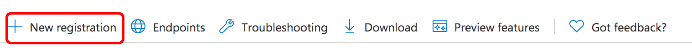

# Configuración de notificaciones por correo electrónico{#configuring-email-notification}

AEM envía notificaciones por correo electrónico a los usuarios que:

* Se han suscrito a eventos de página, por ejemplo modificación o replicación. La variable [Bandeja de entrada de notificaciones](/help/sites-classic-ui-authoring/author-env-inbox.md#subscribing-to-notifications) describe cómo suscribirse a estos eventos.

* Se han suscrito a eventos de foro.
* Debe realizar un paso en un flujo de trabajo. La variable [Etapa de participante](/help/sites-developing/workflows-step-ref.md#participant-step) describe cómo almacenar en déclencheur las notificaciones por correo electrónico en un flujo de trabajo.

Requisitos previos:

* Los usuarios deben tener una dirección de correo electrónico válida definida en su perfil.
* La variable **Day CQ Mail Service** debe configurarse correctamente.

Cuando se notifica a un usuario, recibe un correo electrónico en el idioma definido en su perfil. Cada idioma tiene su propia plantilla que se puede personalizar. Se pueden añadir nuevas plantillas de correo electrónico para los nuevos idiomas.

>[!NOTE]
>
>Al trabajar con AEM hay varios métodos para administrar los ajustes de configuración de dichos servicios; see [Configuración de OSGi](/help/sites-deploying/configuring-osgi.md) para obtener más información y las prácticas recomendadas.

## Configuración del servicio de correo {#configuring-the-mail-service}

Para AEM poder enviar correos electrónicos, la variable **Day CQ Mail Service** debe configurarse correctamente. Puede ver la configuración en la consola web. Al trabajar con AEM hay varios métodos para administrar los ajustes de configuración de dichos servicios; see [Configuración de OSGi](/help/sites-deploying/configuring-osgi.md) para obtener más información y las prácticas recomendadas.

Se aplican las siguientes restricciones:

* La variable **Puerto del servidor SMTP** debe ser 25 o superior.

* La variable **Nombre de host del servidor SMTP** no debe estar en blanco.
* La variable **Dirección &quot;De&quot;** no debe estar en blanco.

Para ayudarle a depurar un problema con la variable **Day CQ Mail Service**, puede ver los registros del servicio:

`com.day.cq.mailer.DefaultMailService`

La configuración tiene el siguiente aspecto en la consola web:


## Configuración del canal de notificación de correo electrónico {#configuring-the-email-notification-channel}

Al suscribirse a las notificaciones de eventos de página o de foro, la dirección de correo electrónico de se establece en `no-reply@acme.com` de forma predeterminada. Puede cambiar este valor configurando la variable **Canal de correo electrónico de notificación** en la consola web.

Para configurar la dirección de correo electrónico, agregue una `sling:OsgiConfig` al repositorio. Utilice el siguiente procedimiento para añadir el nodo directamente mediante el CRXDE Lite :

1. En el CRXDE Lite, añada una carpeta denominada `config` debajo de la carpeta de la aplicación.
1. En la carpeta de configuración, añada un nodo denominado:

   `com.day.cq.wcm.notification.email.impl.EmailChannel` de tipo `sling:OsgiConfig`

1. Agregue un `String` propiedad al nodo denominado `email.from`. Para el valor, especifique la dirección de correo electrónico que desea utilizar.

1. Haga clic en **Guardar todo**.

Utilice el siguiente procedimiento para definir el nodo en las carpetas de origen del paquete de contenido:

1. En `jcr_root/apps/*app_name*/config folder`, cree un archivo con el nombre `com.day.cq.wcm.notification.email.impl.EmailChannel.xml`

1. Añada el siguiente XML para representar el nodo :

   `<?xml version="1.0" encoding="UTF-8"?> <jcr:root xmlns:sling="https://sling.apache.org/jcr/sling/1.0" xmlns:jcr="https://www.jcp.org/jcr/1.0" jcr:primaryType="sling:OsgiConfig" email.from="name@server.com"/>`
1. Reemplace el valor de la variable `email.from` atributo ( `name@server.com`) con su dirección de correo electrónico.

1. Guarde el archivo.

## Configuración del servicio de notificación de correo electrónico del flujo de trabajo {#configuring-the-workflow-email-notification-service}

Cuando recibe notificaciones por correo electrónico del flujo de trabajo, tanto la dirección de correo electrónico como el prefijo de URL del host se establecen en valores predeterminados. Puede cambiar estos valores configurando la variable **Servicio de notificación de correo electrónico del flujo de trabajo CQ de día** en la consola web. Si lo hace, se recomienda mantener el cambio en el repositorio.

La configuración predeterminada tiene el siguiente aspecto en la consola web:


### Plantillas de correo electrónico para notificaciones de página {#email-templates-for-page-notification}

A continuación se describen las plantillas de correo electrónico para las notificaciones de página:

`/libs/settings/notification-templates/com.day.cq.wcm.core.page`

La plantilla predeterminada en inglés ( `en.txt`) se define de la siguiente manera:

```xml
subject=[CQ Page Event Notification]: Page Event

header=-------------------------------------------------------------------------------------\n \
Time: ${time}\n \
User: ${userFullName} (${userId})\n \
-------------------------------------------------------------------------------------\n\n

message=The following pages were affected by the event: \n \
 \n \
${modifications} \n \
 \n\n
footer=\n \
-------------------------------------------------------------------------------------\n \
This is an automatically generated message. Please do not reply.
```

#### Personalización de plantillas de correo electrónico para notificaciones de página {#customizing-email-templates-for-page-notification}

Para personalizar la plantilla de correo electrónico en inglés para la notificación de página:

1. En CRXDE, abra el archivo :

   `/libs/settings/notification-templates/com.day.cq.wcm.core.page/en.txt`

1. Modifique el archivo según sus necesidades.
1. Guarde los cambios.

La plantilla debe tener el siguiente formato:

```
 subject=<text_1>
 header=<text_2>
 message=<text_3>
 footer=<text_4>
```

Donde &lt;text_x> puede ser una mezcla de texto estático y variables de cadena dinámicas. En la plantilla de correo electrónico para las notificaciones de página se pueden usar las siguientes variables:

* `${time}`, la fecha y hora del evento.

* `${userFullName}`, el nombre completo del usuario que activó el evento.

* `${userId}`, el ID del usuario que activó el evento.
* `${modifications}`, describe el tipo de evento de página y la ruta de página en formato :

   &lt;page event=&quot;&quot; type=&quot;&quot;> => &lt;page path=&quot;&quot;>

   Por ejemplo:

   PageModified => /content/geometrixx/en/products

### Plantillas de correo electrónico para la notificación del foro {#email-templates-for-forum-notification}

Las plantillas de correo electrónico para las notificaciones del foro se encuentran en:

`/etc/notification/email/default/com.day.cq.collab.forum`

La plantilla predeterminada en inglés ( `en.txt`) se define de la siguiente manera:

```xml
subject=[CQ Forum Notification]

header=-------------------------------------------------------------------------------------\n \
Time: Time: ${time}\n \
Forum Page Path: ${forum.path}\n \
-------------------------------------------------------------------------------------\n\n

message=Page: ${host.prefix}${forum.path}.html\n

footer=\n \
-------------------------------------------------------------------------------------\n \
This is an automatically generated message. Please do not reply.
```

#### Personalización de plantillas de correo electrónico para notificaciones de foro {#customizing-email-templates-for-forum-notification}

Para personalizar la plantilla de correo electrónico en inglés para la notificación del foro:

1. En CRXDE, abra el archivo :

   `/etc/notification/email/default/com.day.cq.collab.forum/en.txt`

1. Modifique el archivo según sus necesidades.
1. Guarde los cambios.

La plantilla debe tener el siguiente formato:

```
 subject=<text_1>
 header=<text_2>
 message=<text_3>
 footer=<text_4>
```

Donde `<text_x>` puede ser una mezcla de texto estático y variables de cadena dinámicas.

En la plantilla de correo electrónico para las notificaciones del foro se pueden utilizar las siguientes variables:

* `${time}`, la fecha y hora del evento.

* `${forum.path}`, la ruta a la página del foro.

### Plantillas de correo electrónico para notificación de flujo de trabajo {#email-templates-for-workflow-notification}

La plantilla de correo electrónico para las notificaciones de flujo de trabajo (en inglés) se encuentra en:

`/libs/settings/workflow/notification/email/default/en.txt`

Se define de la siguiente manera:

```xml
subject=Workflow notification: ${event.EventType}

header=-------------------------------------------------------------------------------------\n \
Time: ${event.TimeStamp}\n \
Step: ${item.node.title}\n \
User: ${participant.name} (${participant.id})\n \
Workflow: ${model.title}\n \
-------------------------------------------------------------------------------------\n\n

message=Content: ${host.prefix}${payload.path.open}\n

footer=\n \
-------------------------------------------------------------------------------------\n \
View the overview in your ${host.prefix}/aem/inbox\n \
-------------------------------------------------------------------------------------\n \
This is an automatically generated message. Please do not reply.
```

#### Personalización de plantillas de correo electrónico para notificación de flujo de trabajo {#customizing-email-templates-for-workflow-notification}

Para personalizar la plantilla de correo electrónico en inglés para la notificación de eventos de flujo de trabajo:

1. En CRXDE, abra el archivo :

   `/libs/settings/workflow/notification/email/default/en.txt`

1. Modifique el archivo según sus necesidades.
1. Guarde los cambios.

La plantilla debe tener el siguiente formato:

```
subject=<text_1>
 header=<text_2>
 message=<text_3>
 footer=<text_4>
```

>[!NOTE]
>
>Donde `<text_x>` puede ser una mezcla de texto estático y variables de cadena dinámicas. Cada línea de un `<text_x>` El elemento debe terminar con una barra invertida ( `\`), excepto en la última instancia, cuando la ausencia de la barra invertida indica el final del `<text_x>` variable de cadena.
>
>Puede encontrar más información sobre el formato de la plantilla en la [javadocs de Properties.load()](https://docs.oracle.com/javase/8/docs/api/java/util/Properties.html#load-java.io.InputStream-) método.

El método `${payload.path.open}` muestra la ruta de acceso a la carga útil del elemento de trabajo. Por ejemplo, para una página en Sitios, entonces `payload.path.open` sería similar a `/bin/wcmcommand?cmd=open&path=…`.; esto se hace sin el nombre del servidor, por lo que la plantilla antepone esto a `${host.prefix}`.

En la plantilla de correo electrónico se pueden utilizar las siguientes variables:

* `${event.EventType}`, tipo de evento
* `${event.TimeStamp}`, fecha y hora del evento
* `${event.User}`, el usuario que activó el evento
* `${initiator.home}`, la ruta del nodo iniciador

* `${initiator.name}`, el nombre del iniciador

* `${initiator.email}`, dirección de correo electrónico del iniciador
* `${item.id}`, el id del elemento de trabajo
* `${item.node.id}`, id del nodo en el modelo de flujo de trabajo asociado a este elemento de trabajo
* `${item.node.title}`, título del elemento de trabajo
* `${participant.email}`, dirección de correo electrónico del participante
* `${participant.name}`, nombre del participante
* `${participant.familyName}`, apellido del participante
* `${participant.id}`, id del participante
* `${participant.language}`, el idioma del participante
* `${instance.id}`, el id del flujo de trabajo
* `${instance.state}`, el estado del flujo de trabajo
* `${model.title}`, título del modelo de flujo de trabajo
* `${model.id}`, el id del modelo de flujo de trabajo

* `${model.version}`, la versión del modelo de flujo de trabajo
* `${payload.data}`, la carga útil

* `${payload.type}`, el tipo de carga útil
* `${payload.path}`, ruta de la carga útil
* `${host.prefix}`, prefijo de host, por ejemplo: http://localhost:4502

### Adición de una plantilla de correo electrónico para un nuevo idioma {#adding-an-email-template-for-a-new-language}

Para añadir una plantilla para un nuevo idioma:

1. En CRXDE, agregue un archivo `<language-code>.txt` abajo:

   * `/libs/settings/notification-templates/com.day.cq.wcm.core.page` : para notificaciones de página
   * `/etc/notification/email/default/com.day.cq.collab.forum` : para notificaciones de foro
   * `/libs/settings/workflow/notification/email/default` : para notificaciones de flujo de trabajo

1. Adapte el archivo al idioma.
1. Guarde los cambios.

>[!NOTE]
>
>La variable `<language-code>` se utiliza como nombre de archivo para la plantilla de correo electrónico y debe ser un código de idioma en minúsculas de dos letras que AEM reconozca. Para códigos de idioma, AEM se basa en ISO-639-1.

## Configuración de las notificaciones por correo electrónico de AEM Assets {#assetsconfig}

Cuando se comparten o dejan de compartir colecciones en AEM Assets, los usuarios pueden recibir notificaciones por correo electrónico de AEM. Para configurar las notificaciones por correo electrónico, siga estos pasos.

1. Configure el servicio de correo electrónico, tal como se describe anteriormente en [Configuración del servicio de correo](/help/sites-administering/notification.md#configuring-the-mail-service).
1. Inicie sesión en AEM como administrador. Haga clic en **Herramientas** >  **Operaciones** >  **Consola web** para abrir Configuración de la consola web.
1. Editar **Servlet Day CQ DAM Resource Collection**. Select **enviar correo electrónico**. Haga clic en **Guardar**.

## Configuración de OAuth {#setting-up-oauth}

AEM ofrece compatibilidad con OAuth2 para su servicio de correo integrado, con el fin de permitir que las organizaciones se adhieran a los requisitos de correo electrónico seguro.

Puede configurar OAuth para varios proveedores de correo electrónico, como se describe a continuación.

>[!NOTE]
>
>El procedimiento que se describe a continuación es un ejemplo para una instancia de publicación. También puede seguir este procedimiento para una instancia de Autor, si lo desea.

### Gmail {#gmail}

1. Cree su proyecto en `https://console.developers.google.com/projectcreate`
1. Seleccione el proyecto y, a continuación, vaya a **API y servicios** - **Panel: credenciales**
1. Configure la pantalla de consentimiento de OAuth según sus necesidades
1. En la pantalla de actualización que aparece a continuación, añada estos dos ámbitos:
   * `https://mail.google.com/`
   * `https://www.googleapis.com//auth/gmail.send`
1. Una vez añadidos los ámbitos, vuelva a **Credenciales** en el menú de la izquierda, vaya a **Crear credenciales** - **ID de cliente de OAuth** - **Aplicación de escritorio**
1. Se abrirá una nueva ventana que contiene el ID de cliente y el Secreto de cliente.
1. Guarde estas credenciales.

**Configuraciones AEM**

>[!NOTE]
>
>Los clientes de Adobe Managed Service pueden trabajar con su ingeniero de servicio al cliente para realizar estos cambios en los entornos de producción.

En primer lugar, configure el servicio de correo:

1. Abra la consola web de AEM en `http://serveraddress:serverport/system/console/configMgr`
1. Busque y haga clic en **Day CQ Mail Service**
1. Añada la siguiente configuración:
   * Nombre de host del servidor SMTP: `smtp.gmail.com`
   * Puerto del servidor SMTP: `25` o `587`, según los requisitos
   * Marque las casillas de verificación para **SMPT utiliza StarTLS** y **SMTP requiere StarTLS**
   * Marque **Flujo de OAuth** y haga clic en **Guardar**.

A continuación, configure el proveedor SMTP OAuth siguiendo el procedimiento a continuación:

1. Abra la consola web de AEM en `http://serveraddress:serverport/system/console/configMgr`
1. Busque y haga clic en **Proveedor de CQ Mailer SMTP OAuth2**
1. Complete la información requerida de la siguiente manera:
   * URL de autorización: `https://accounts.google.com/o/oauth2/auth`
   * URL del token: `https://accounts.google.com/o/oauth2/token`
   * Ámbitos: `https://www.googleapis.com/auth/gmail.send` y `https://mail.google.com/`. Para agregar más de un ámbito, presione la tecla **+** a la derecha de cada ámbito configurado.
   * ID de cliente y Secreto de cliente: configure estos campos con los valores que recuperó tal como se describe en el párrafo anterior.
   * URL de token de actualización: `https://accounts.google.com/o/oauth2/token`
   * Actualizar caducidad del token: never
1. Haga clic en **Guardar**.

<!-- clarify refresh token expiry, currrently not present in the UI -->

Una vez configurada, la configuración debe tener este aspecto:


Ahora, active los componentes de OAuth. Para ello:

1. Vaya a la consola Componentes visitando esta URL: `http://serveraddress:serverport/system/console/components`
1. Busque los siguientes componentes
   * `com.day.cq.mailer.oauth.servlets.handler.OAuthCodeGenerateServlet`
   * `com.day.cq.mailer.oauth.servlets.handler.OAuthCodeAccessTokenGenerator`
1. Pulse el icono Reproducir a la izquierda de los componentes.

   

Finalmente, confirme la configuración de:

1. Vaya a la dirección de la instancia Publicar e inicie sesión como administrador.
1. Abra una nueva pestaña en el explorador y vaya a `http://serveraddress:serverport/services/mailer/oauth2/authorize`. Esto le redirigirá a la página de su proveedor SMTP, en este caso Gmail.
1. Inicio de sesión y consentimiento para conceder los permisos necesarios
1. Después de dar su consentimiento, el token se almacenará en el repositorio. Puede acceder a ella desde `accessToken` accediendo directamente a esta URL en la instancia de publicación: `http://serveraddress:serverport/crx/de/index.jsp#/conf/global/settings/mailer/oauth`
1. Repita lo anterior para cada instancia de publicación

<!-- clarify if the ip/server address in the last procedure is that of the publish instance -->

### Microsoft Outlook {#microsoft-outlook}

1. Vaya a [https://portal.azure.com/](https://portal.azure.com/) e inicie sesión.
1. Buscar **Azure Active Directory** en la barra de búsqueda y haga clic en el resultado. También puede navegar directamente a [https://portal.azure.com/#blade/Microsoft_AAD_IAM/ActiveDirectoryMenuBlade/Overview](https://portal.azure.com/#blade/Microsoft_AAD_IAM/ActiveDirectoryMenuBlade/Overview)
1. Haga clic en **Registro de aplicaciones** - **Nuevo registro**

   

1. Rellene la información según sus necesidades y haga clic en **Registro**
1. Vaya a la aplicación recién creada y seleccione **Permisos de API**
1. Vaya a **Añadir permiso** - **Permiso de gráfico** - **Permisos delegados**
1. Seleccione los siguientes permisos para su aplicación y haga clic en **Añadir permiso**:
   * `SMTP.Send`
   * `Mail.Read`
   * `Mail.Send`
   * `openid`
   * `offline_access`
1. Vaya a **Autenticación** - **Añadir una plataforma** - **Web** y en la **Direccionamiento Url** , añada la siguiente URL para redirigir el código de OAuth y, a continuación, presione **Configurar**:
   * `http://localhost:4503/services/mailer/oauth2/token`
1. Repita lo anterior para cada instancia de publicación
1. Configure las opciones según sus necesidades
1. A continuación, vaya a **Certificados y secretos**, haga clic en **Nuevo secreto de cliente** y siga los pasos que aparecen en la pantalla para crear un secreto. Asegúrese de tomar nota de este secreto para utilizarlo posteriormente
1. Press **Información general** en el panel izquierdo y copie los valores de **ID de aplicación (cliente)** y **ID de directorio (inquilino)** para uso posterior

Para recapitular, necesitará la siguiente información para configurar OAuth2 para el servicio Mailer en el lado AEM:

* La URL de autenticación, que se construirá con el ID del inquilino. Tendrá este formulario: `https://login.microsoftonline.com/<tenantID>/oauth2/v2.0/authorize`
* La URL del token, que se construirá con el ID del inquilino. Tendrá este formulario: `https://login.microsoftonline.com/<tenantID>/oauth2/v2.0/token`
* La URL de actualización, que se construirá con el ID del inquilino. Tendrá este formulario: `https://login.microsoftonline.com/<tenantID>/oauth2/v2.0/token`
* El ID de cliente
* El secreto del cliente

**Configuraciones AEM**

A continuación, integre la configuración de OAuth2 con AEM:

1. Vaya a la consola web de la instancia local navegando hasta `http://serveraddress:serverport/system/console/configMgr`
1. Busque y haga clic en **Day CQ Mail Service**
1. Añada la siguiente configuración:
   * Nombre de host del servidor SMTP: `smtp.office365.com`
   * Usuario SMTP: su nombre de usuario en formato de correo electrónico
   * Dirección &quot;De&quot;: La dirección de correo electrónico que se utiliza en el campo &quot;De:&quot; de mensajes enviados por el remitente
   * Puerto del servidor SMTP: `25` o `587` según los requisitos
   * Marque las casillas de verificación para **SMPT utiliza StarTLS** y **SMTP requiere StarTLS**
   * Marque **Flujo de OAuth** y haga clic en **Guardar**.
1. Busque y haga clic en **Proveedor de CQ Mailer SMTP OAuth2**
1. Complete la información requerida de la siguiente manera:
   * Complete la Url de autorización, la Url del token y la URL del token de actualización mediante la construcción de los mismos tal y como se describe en [final del presente procedimiento](#microsoft-outlook)
   * ID de cliente y Secreto de cliente: configure estos campos con los valores que recuperó como se describe anteriormente.
   * Agregue los siguientes ámbitos a la configuración:
      * openid
      * offline_access
      * `https://outlook.office365.com/Mail.Send`
      * `https://outlook.office365.com/Mail.Read`
      * `https://outlook.office365.com/SMTP.Send`
   * Url De Redireccionamiento AuthCode: `http://localhost:4503/services/mailer/oauth2/token`
   * Actualizar URL del token: debe tener el mismo valor que la dirección URL del token anterior
1. Haga clic en **Guardar**.

Una vez configurada, la configuración debe tener este aspecto:


Ahora, active los componentes de OAuth. Para ello:

1. Vaya a la consola Componentes visitando esta URL: `http://serveraddress:serverport/system/console/components`
1. Busque los siguientes componentes
   * `com.day.cq.mailer.oauth.servlets.handler.OAuthCodeGenerateServlet`
   * `com.day.cq.mailer.oauth.servlets.handler.OAuthCodeAccessTokenGenerator`
1. Pulse el icono Reproducir a la izquierda de los componentes.


Finalmente, confirme la configuración de:

1. Vaya a la dirección de la instancia Publicar e inicie sesión como administrador.
1. Abra una nueva pestaña en el explorador y vaya a `http://serveraddress:serverport/services/mailer/oauth2/authorize`. Esto le redirigirá a la página de su proveedor SMTP, en este caso Gmail.
1. Inicio de sesión y consentimiento para conceder los permisos necesarios
1. Después de dar su consentimiento, el token se almacenará en el repositorio. Puede acceder a ella desde `accessToken` accediendo directamente a esta URL en la instancia de publicación: `http://serveraddress:serverport/crx/de/index.jsp#/conf/global/settings/mailer/oauth`