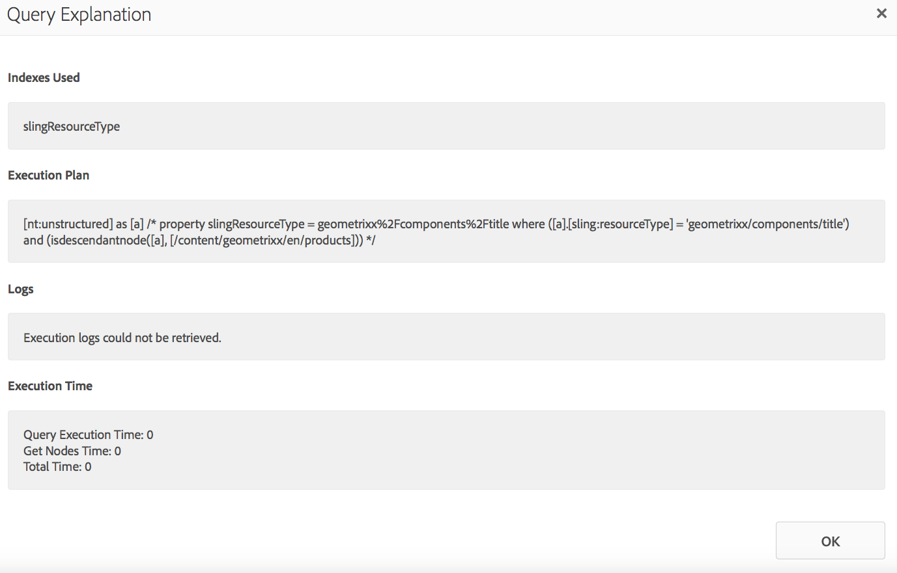
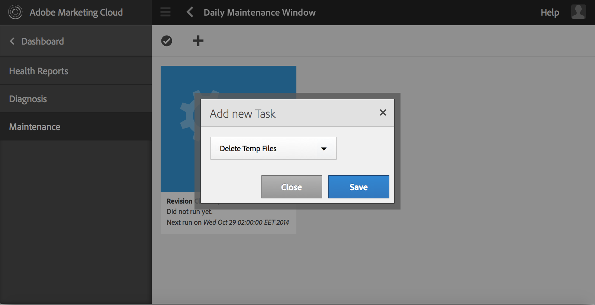

# Tablero de operaciones {#operations-dashboard}

## Introducción {#introduction}

El panel de operaciones de AEM 6 ayuda a los operadores de sistemas a supervisar AEM estado del sistema de un vistazo. También proporciona información de diagnóstico generada automáticamente sobre aspectos relevantes de la AEM y permite configurar y ejecutar la automatización de mantenimiento independiente para reducir significativamente las operaciones de los proyectos y los casos de asistencia. El panel de operaciones se puede ampliar con tareas personalizadas de mantenimiento y comprobaciones de estado. Además, se puede acceder a los datos del Tablero de operaciones desde herramientas de monitorización externas a través de JMX.

**Tablero de operaciones:**

* Es un estado del sistema de un solo clic para ayudar a los departamentos de operaciones a obtener eficiencia
* Proporciona información general del estado del sistema en un solo lugar centralizado
* Reduce el tiempo para encontrar, analizar y solucionar problemas
* Proporciona automatización de mantenimiento independiente que ayuda a reducir considerablemente los costos de las operaciones de los proyectos

Se puede acceder a ella accediendo a **Tools** - **Operations** desde la pantalla de bienvenida de AEM.

>[!NOTE]
>
>Para poder acceder al panel de operaciones, el usuario que ha iniciado sesión debe formar parte del grupo de usuarios &quot;Operadores&quot;. Para obtener más información, consulte la documentación sobre [Administración de derechos de usuario, grupo y acceso](/help/sites-administering/user-group-ac-admin.md).

## Informes de estado {#health-reports}

El sistema de informes de estado proporciona información sobre el estado de una instancia de AEM a través de Sling Health Checks. Esto se puede hacer mediante solicitudes OSGI, JMX, HTTP (a través de JSON) o a través de la interfaz de usuario táctil. Ofrece medidas y umbral de ciertos contadores configurables y, en algunos casos, ofrece información sobre cómo resolver el problema.

Tiene varias funciones que se describen a continuación.

## Comprobación del estado {#health-checks}

Los **Informes de estado** son un sistema de tarjetas que indican que el estado es bueno o malo con respecto a un área específica del producto. Estas tarjetas son visualizaciones de Sling Health Checks, que acumulan datos de JMX y otras fuentes y muestran información procesada de nuevo como MBeans. Estos MBeans también se pueden inspeccionar en la [consola web JMX](/help/sites-administering/jmx-console.md), en el dominio **org.apache.sling.healthcheck** .

Se puede acceder a la interfaz de Informes de estado a través del menú **Tools** - **Operations** - **Health Reports** en la pantalla de bienvenida de AEM o directamente a través de la siguiente URL:

`https://<serveraddress>:port/libs/granite/operations/content/healthreports/healthreportlist.html`


El sistema de tarjetas expone tres estados posibles: **OK**, **WARN** y **CRÍTICO**. Los estados son el resultado de reglas y umbrales, que pueden configurarse pasando el ratón por encima de la tarjeta y luego haciendo clic en el icono de engranaje en la barra de acciones:


### Tipos de comprobación de estado {#health-check-types}

Existen dos tipos de controles sanitarios en el AEM 6:

1. Comprobaciones de estado individuales
1. Comprobaciones de estado compuestas

Una **comprobación de estado individual** es una única comprobación de estado que corresponde a una tarjeta de estado. Las comprobaciones de estado individuales pueden configurarse con reglas o umbrales y pueden proporcionar una o más sugerencias y vínculos para resolver los problemas de salud identificados. Veamos la comprobación &quot;Errores de registro&quot; como ejemplo: si hay entradas ERROR en los registros de instancia, las encontrará en la página de detalles de la comprobación de estado. En la parte superior de la página verá un vínculo al analizador de &quot;Mensaje de registro&quot; en la sección Herramientas de diagnóstico, que le permitirá analizar estos errores con más detalle y reconfigurar los registradores.

Una **comprobación de estado compuesta** es una comprobación que agrega información de varias comprobaciones individuales.

Las comprobaciones de estado compuestas se configuran con la ayuda de **etiquetas de filtro**. En esencia, todas las comprobaciones individuales que tengan la misma etiqueta de filtro se agrupan como una comprobación de estado compuesta. Una comprobación de estado compuesta tendrá un estado correcto solo si todas las comprobaciones individuales agregadas tienen estados OK también.

### Cómo crear comprobaciones de estado {#how-to-create-health-checks}

En el Tablero de operaciones puede visualizar el resultado de las comprobaciones de estado individuales y compuestas.

### Creación de una comprobación de estado individual {#creating-an-individual-health-check}

La creación de una comprobación de estado individual implica dos pasos: implementar una comprobación de estado de Sling y agregar una entrada para la comprobación de estado en los nodos de configuración del panel.

1. Para crear una comprobación de estado de Sling, debe crear un componente OSGI que implemente la interfaz de comprobación de estado de Sling. Añadirá este componente dentro de un paquete. Las propiedades del componente identificarán completamente la comprobación de estado. Una vez instalado el componente, se creará automáticamente un JMX MBean para la comprobación de estado. Consulte la [Documentación de comprobación de estado de Sling](https://sling.apache.org/documentation/bundles/sling-health-check-tool.html) para obtener más información.

   Ejemplo de un componente de comprobación de estado de Sling, escrito con anotaciones de componentes del servicio OSGI:

   ```java
   @Component(service = HealthCheck.class,
   property = {
       HealthCheck.NAME + "=Example Check",
       HealthCheck.TAGS + "=example",
       HealthCheck.TAGS + "=test",
       HealthCheck.MBEAN_NAME + "=exampleHealthCheckMBean"
   })
    public class ExampleHealthCheck implements HealthCheck {
       @Override
       public Result execute() {
           // health check code
       }
    }
   ```

   >[!NOTE]
   >
   >La propiedad `MBEAN_NAME` define el nombre del mbean que se generará para esta comprobación de estado.

1. Después de crear una comprobación de estado, se debe crear un nuevo nodo de configuración para que sea accesible en la interfaz del panel de operaciones. Para este paso, es necesario conocer el nombre de Mbean JMX de la Health Check (la propiedad `MBEAN_NAME`). Para crear una configuración para la comprobación de estado, abra CRXDE y añada un nuevo nodo (de tipo **nt:unstructured**) bajo la siguiente ruta: `/apps/settings/granite/operations/hc`

   Las siguientes propiedades deben establecerse en el nuevo nodo:

   * **Nombre:** `sling:resourceType`

      * **Tipo:** `String`
      * **Valor:** `granite/operations/components/mbean`
   * **Nombre:** `resource`

      * **Tipo:** `String`
      * **Valor:** `/system/sling/monitoring/mbeans/org/apache/sling/healthcheck/HealthCheck/exampleHealthCheck`

   >[!NOTE]
   >
   >La ruta de acceso del recurso anterior se crea de la siguiente manera: si el nombre de la cookie de la comprobación de estado es &quot;test&quot;, añada &quot;test&quot; al final de la ruta `/system/sling/monitoring/mbeans/org/apache/sling/healthcheck/HealthCheck`
   >
   >Así que el camino final será:
   >
   >`/system/sling/monitoring/mbeans/org/apache/sling/healthcheck/HealthCheck/test`

   >[!NOTE]
   >
   >Asegúrese de que la ruta `/apps/settings/granite/operations/hc` tiene las siguientes propiedades definidas en true:
   >
   >
   >`sling:configCollectionInherit`
   >
   >`sling:configPropertyInherit`
   >
   >
   >Esto indicará al administrador de configuración que combine las nuevas configuraciones con las existentes de `/libs`.

### Creación de una comprobación de estado compuesta {#creating-a-composite-health-check}

La función de una comprobación de estado compuesta es agregar varias comprobaciones de estado individuales que compartan un conjunto de características comunes. Por ejemplo, la Comprobación de estado compuesta de seguridad agrupa todas las comprobaciones de estado individuales que realizan verificaciones relacionadas con la seguridad. El primer paso para crear una comprobación compuesta es añadir una nueva configuración OSGI. Para que se muestre en el Tablero de operaciones, es necesario agregar un nuevo nodo de configuración, de la misma manera que lo hicimos para una simple comprobación.

1. Vaya al Administrador de configuración web en la consola OSGI. Para ello, acceda a `https://serveraddress:port/system/console/configMgr`
1. Busque la entrada denominada **Apache Sling Composite Health Check**. Después de encontrarlo, observe que ya hay dos configuraciones disponibles: una para las comprobaciones del sistema y otra para las comprobaciones de seguridad.
1. Cree una nueva configuración presionando el botón &quot;+&quot; en el lado derecho de la configuración. Aparecerá una nueva ventana, como se muestra a continuación:

   

1. Cree una configuración y guárdela. Se creará un Mbean con la nueva configuración.

   El propósito de cada propiedad de configuración es el siguiente:

   * **Nombre (hc.name):** el nombre de la comprobación de estado compuesta. Se recomienda un nombre significativo.
   * **Etiquetas (hc.tags):** las etiquetas de esta comprobación de estado. Si esta comprobación de estado compuesta está pensada para formar parte de otra comprobación de estado compuesta (por ejemplo, en una jerarquía de controles de estado), agregue las etiquetas a las que está relacionada esta combinación.
   * **Nombre MBean (hc.mbean.name):** El nombre del Mbean que se le dará al JMX MBean de esta comprobación de estado compuesta.
   * **Etiquetas de filtro (filter.tags):** Esta es una propiedad específica de las comprobaciones de estado compuestas. Estas son las etiquetas que el compuesto debe acumular. La comprobación de estado compuesta agregará bajo su grupo todas las comprobaciones de estado que tengan cualquier etiqueta que coincida con cualquiera de las etiquetas de filtro de esta composición. Por ejemplo, una comprobación de estado compuesta que tenga las etiquetas de filtro **test** y **check** agregará todas las comprobaciones de estado individuales y compuestas que tengan alguna de las etiquetas **test** y **check** en la propiedad de etiquetas ( `hc.tags`).

   >[!NOTE]
   >
   >Se crea un nuevo Mbean JMX para cada nueva configuración de la comprobación de estado compuesta de Apache Sling.**

1. Finalmente, la entrada de la comprobación de estado compuesta que acaba de crearse debe agregarse en los nodos de configuración del panel de operaciones. El procedimiento es el mismo que para los controles sanitarios individuales: es necesario crear un nodo de tipo **nt:unstructured** en `/apps/settings/granite/operations/hc`. La propiedad resource del nodo se definirá por el valor **hc.media.name** en la configuración OSGI.

   Si, por ejemplo, creó una configuración y estableció el valor **hc.mbean.name** en **diskusage**, los nodos de configuración tendrán este aspecto:

   * **Nombre:** `Composite Health Check`

      * **Tipo:** `nt:unstructured`

   Con las siguientes propiedades:

   * **Nombre:** `sling:resourceType`

      * **Tipo:** `String`
      * **Valor:** `granite/operations/components/mbean`
   * **Nombre:** `resource`

      * **Tipo:** `String`
      * **Valor:** `/system/sling/monitoring/mbeans/org/apache/sling/healthcheck/HealthCheck/diskusage`

   >[!NOTE]
   >
   >Si crea comprobaciones de estado individuales que lógicamente pertenecen a una comprobación compuesta que ya está presente en el panel de control de forma predeterminada, se capturarán y agruparán automáticamente en la comprobación compuesta correspondiente. Debido a esto, no es necesario crear un nuevo nodo de configuración para estas comprobaciones.
   >
   >Por ejemplo, si crea una comprobación de estado de seguridad individual, todo lo que debe hacer es asignarle la etiqueta &quot;**security**&quot;, y está instalada, aparecerá automáticamente en la comprobación compuesta de comprobaciones de seguridad en el Tablero de operaciones.

### Comprobaciones de estado proporcionadas con AEM {#health-checks-provided-with-aem}

<table>
 <tbody>
  <tr>
   <td><strong>zHealthcheck Nombre</strong></td>
   <td><strong>Descripción</strong></td>
  </tr>
  <tr>
   <td>Rendimiento de consultas</td>
   <td><p>Esta comprobación de estado se simplificó <strong>en AEM 6.4</strong> y ahora comprueba el <code>Oak QueryStats</code> MBean refactorizado recientemente, más específicamente el atributo <code>SlowQueries </code>. Si las estadísticas contienen consultas lentas, la comprobación de estado devuelve una advertencia. De lo contrario, devuelve el estado OK.<br /> </p> <p>El MBean para esta comprobación de estado es <a href="http://localhost:4502/system/console/jmx/org.apache.sling.healthcheck%3Aname%3DqueriesStatus%2Ctype%3DHealthCheck">org.apache.sling.healthCheck:name=queriesStatus,type=HealthCheck</a>.</p> </td>
  </tr>
  <tr>
   <td>Longitud de la cola de observación</td>
   <td><p>La longitud de la cola de observación se repite sobre todos los oyentes de eventos y observadores en segundo plano, compara su <code>queueSize </code>con su <code>maxQueueSize</code> y:</p>
    <ul>
     <li>devuelve el estado crítico si el valor <code>queueSize</code> supera el valor <code>maxQueueSize</code> (es decir, cuando se eliminarían los eventos)</li>
     <li>devuelve Advertencia si el valor <code>queueSize</code> es superior a <code>maxQueueSize * WARN_THRESHOLD</code> (el valor predeterminado es 0,75) </li>
    </ul> <p>La longitud máxima de cada cola proviene de configuraciones independientes (Oak y AEM), y no se puede configurar desde esta comprobación de estado. El MBean para esta comprobación de estado es <a href="http://localhost:4502/system/console/jmx/org.apache.sling.healthcheck%3Aname%3DObservationQueueLengthHealthCheck%2Ctype%3DHealthCheck">org.apache.sling.healthcheck:name=ObservationQueueLengthHealthCheck,type=HealthCheck</a>.</p> </td>
  </tr>
  <tr>
   <td>Límites de recorrido de la consulta</td>
   <td><p>Los límites de recorrido de la consulta comprueban los atributos <code>QueryEngineSettings</code> MBean, más específicamente los atributos <code>LimitInMemory</code> y <code>LimitReads</code>, y devuelven el siguiente estado:</p>
    <ul>
     <li>devuelve el estado de advertencia si uno de los límites es igual o mayor que el <code>Integer.MAX_VALUE</code></li>
     <li>devuelve el estado de advertencia si uno de los límites es menor que 1000 (la configuración recomendada de Oak)</li>
     <li>devuelve el estado crítico si no se puede recuperar <code>QueryEngineSettings</code> o cualquiera de los límites</li>
    </ul> <p>El Mbean para esta comprobación de estado es <a href="http://localhost:4502/system/console/jmx/org.apache.sling.healthcheck%3Aname%3DqueryTraversalLimitsBundle%2Ctype%3DHealthCheck">org.apache.sling.healthCheck:name=queryTraversalLimitsBundle,type=HealthCheck</a>.</p> </td>
  </tr>
  <tr>
   <td>Relojes sincronizados</td>
   <td><p>Esta comprobación solo es relevante para <a href="https://github.com/apache/sling-old-svn-mirror/blob/4df9ab2d6592422889c71fa13afd453a10a5a626/bundles/extensions/discovery/oak/src/main/java/org/apache/sling/discovery/oak/SynchronizedClocksHealthCheck.java">document nodestore clusters</a>. Devuelve el siguiente estado:</p>
    <ul>
     <li>devuelve el estado de advertencia cuando los relojes de instancia se desactivan y superan un umbral bajo predefinido</li>
     <li>devuelve el estado crítico cuando los relojes de instancia se desactivan y superan un umbral alto predefinido</li>
    </ul> <p>El Mbean para esta comprobación de estado es <a href="http://localhost:4502/system/console/jmx/org.apache.sling.healthcheck%3Aname%3DslingDiscoveryOakSynchronizedClocks%2Ctype%3DHealthCheck">org.apache.sling.healthCheck:name=slingDiscoveryOakSynchronizedClocks,type=HealthCheck</a>.</p> </td>
  </tr>
  <tr>
   <td>Índices asíncronos</td>
   <td><p>La comprobación de los índices asíncronos:</p>
    <ul>
     <li>devuelve el estado crítico si al menos un carril de indexación está fallando</li>
     <li>comprueba el <code>lastIndexedTime</code> para todos los carriles de indexación y:
      <ul>
       <li>devuelve el estado crítico si hace más de 2 horas </li>
       <li>devuelve el estado de advertencia si está entre 2 horas y 45 minutos atrás </li>
       <li>devuelve el estado OK si hace menos de 45 minutos </li>
      </ul> </li>
     <li>si no se cumple ninguna de estas condiciones, devuelve el estado OK</li>
    </ul> <p>Tanto los umbrales de estado Crítico como de Advertencia se pueden configurar. El Mbean para esta comprobación de estado es <a href="http://localhost:4502/system/console/jmx/org.apache.sling.healthcheck%3Aname%3DasyncIndexHealthCheck%2Ctype%3DHealthCheck">org.apache.sling.healthCheck:name=asyncIndexHealthCheck,type=HealthCheck</a>.</p> <p><strong>Nota:  </strong>Esta comprobación de estado está disponible con AEM 6.4 y se ha respaldado a AEM 6.3.0.1.</p> </td>
  </tr>
  <tr>
   <td>Índices grandes de Lucene</td>
   <td><p>Esta comprobación utiliza los datos expuestos por los <code>Lucene Index Statistics</code> MBean para identificar índices y devoluciones grandes:</p>
    <ul>
     <li>un estado de advertencia si hay un índice con más de mil millones de documentos</li>
     <li>un estado crítico si hay un índice con más de 1.500 millones de documentos</li>
    </ul> <p>Los umbrales son configurables y el MBean para la comprobación de estado es <a href="http://localhost:4502/system/console/jmx/org.apache.sling.healthcheck%3Aname%3DlargeIndexHealthCheck%2Ctype%3DHealthCheck">org.apache.sling.healthCheck:name=largeIndexHealthCheck,type=HealthCheck.</a></p> <p><strong>Nota:  </strong>Esta comprobación está disponible con la AEM 6.4 y se ha realizado con la versión de retorno a la AEM 6.3.2.0.</p> </td>
  </tr>
  <tr>
   <td>Mantenimiento del sistema</td>
   <td><p>El mantenimiento del sistema es una comprobación compuesta que devuelve el valor correcto si todas las tareas de mantenimiento se ejecutan según lo configurado. Tenga en cuenta que:</p>
    <ul>
     <li>cada tarea de mantenimiento va acompañada de una comprobación de estado asociada</li>
     <li>si una tarea no se agrega a una ventana de mantenimiento, su comprobación de estado devolverá Critical</li>
     <li>debe configurar las tareas de mantenimiento Registro de auditoría y Depuración de flujo de trabajo o quitarlas de las ventanas de mantenimiento. Si se deja sin configurar, estas tareas fallarán en el primer intento de ejecución, por lo que la comprobación de mantenimiento del sistema devolverá el estado crítico.</li>
     <li><strong>Con AEM 6.4</strong>, también hay una comprobación para la tarea de mantenimiento de  <a href="/help/sites-administering/operations-dashboard.md#automated-maintenance-tasks">los binarios </a> de Lucene</li>
     <li>en AEM 6.2 y versiones posteriores, la comprobación de mantenimiento del sistema devuelve un estado de advertencia justo después del inicio porque las tareas no se ejecutan nunca. A partir de la versión 6.3, se devolverán correctamente si aún no se ha alcanzado la primera ventana de mantenimiento.</li>
    </ul> <p>El MBean para esta comprobación de estado es <a href="http://localhost:4502/system/console/jmx/org.apache.sling.healthcheck%3Aname%3Dsystemchecks%2Ctype%3DHealthCheck">org.apache.sling.healthCheck:name=systemcheck,type=HealthCheck</a>.</p> </td>
  </tr>
  <tr>
   <td>Cola de replicación</td>
   <td><p>Esta comprobación se repite sobre los agentes de replicación y observa sus colas. Para el elemento de la parte superior de la cola, la comprobación busca cuántas veces el agente reintentó la replicación. Si el agente reintentó la replicación más que el valor del parámetro <code>numberOfRetriesAllowed</code>, devuelve una advertencia. El parámetro <code>numberOfRetriesAllowed</code> se puede configurar. </p> <p>El MBean para esta comprobación de estado es <a href="http://localhost:4502/system/console/jmx/org.apache.sling.healthcheck%3Aname%3DreplicationQueue%2Ctype%3DHealthCheck" target="_blank">org.apache.sling.healthCheck:name=replicationQueue,type=HealthCheck</a>.</p> </td>
  </tr>
  <tr>
   <td>Trabajos sling</td>
   <td>
    <div>
      Sling Jobs comprueba el número de trabajos en cola en JobManager y los compara con el
     <code>maxNumQueueJobs</code> umbral y:
    </div>
    <ul>
     <li>devuelve el valor crítico si hay más de <code>maxNumQueueJobs</code> en la cola</li>
     <li>devuelve el valor crítico si hay trabajos activos de larga duración que tengan más de 1 hora</li>
     <li>devuelve Critical si hay trabajos en cola y la hora del último trabajo terminado es anterior a 1 hora</li>
    </ul> <p>Solo se puede configurar el número máximo de trabajos en cola y tiene el valor predeterminado de 1000.</p> <p>El MBean para esta comprobación de estado es <a href="http://localhost:4502/system/console/jmx/org.apache.sling.healthcheck%3Aname%3DslingJobs%2Ctype%3DHealthCheck" target="_blank">org.apache.sling.healthCheck:name=slingJobs,type=HealthCheck</a>.</p> </td>
  </tr>
  <tr>
   <td>Rendimiento de solicitudes</td>
   <td><p>Esta comprobación examina la <code>granite.request.metrics.timer</code> <a href="http://localhost:4502/system/console/slingmetrics" target="_blank">métrica Sling </a>y:</p>
    <ul>
     <li>devuelve Critical si el valor del percentil 75 se encuentra por encima del umbral crítico (el valor predeterminado es 500 milisegundos)</li>
     <li>devuelve Advertencia si el valor del percentil 75 está por encima del umbral de advertencia (el valor predeterminado es 200 milisegundos)</li>
    </ul> <p>El MBean para esta comprobación de estado es<em> </em><a href="http://localhost:4502/system/console/jmx/org.apache.sling.healthcheck%3Aname%3DrequestsStatus%2Ctype%3DHealthCheck" target="_blank">org.apache.sling.healthcheck:name=requestStatus,type=HealthCheck</a>.</p> </td>
  </tr>
  <tr>
   <td>Errores de registro</td>
   <td><p>Esta comprobación devuelve el estado de advertencia si hay errores en el registro.</p> <p>El MBean para esta comprobación de estado es <a href="http://localhost:4502/system/console/jmx/org.apache.sling.healthcheck%3Aname%3DlogErrorHealthCheck%2Ctype%3DHealthCheck" target="_blank">org.apache.sling.healthcheck:name=logErrorHealthCheck,type=HealthCheck</a>.</p> </td>
  </tr>
  <tr>
   <td>Espacio en disco</td>
   <td><p>La comprobación Espacio en disco observa el <code>FileStoreStats</code> MBean, recupera el tamaño del almacén de nodos y la cantidad de espacio en disco utilizable en la partición del almacén de nodos y:</p>
    <ul>
     <li>devuelve Advertencia si el espacio en disco utilizable en relación con el tamaño del repositorio es menor que el umbral de advertencia (el valor predeterminado es 10)</li>
     <li>devuelve Critical si la proporción entre el espacio en disco utilizable y el tamaño del repositorio es inferior al umbral crítico (el valor predeterminado es 2)</li>
    </ul> <p>Ambos umbrales son configurables. La comprobación solo funciona en instancias con un almacén de segmentos.</p> <p>El MBean para esta comprobación de estado es <a href="http://localhost:4502/system/console/jmx/org.apache.sling.healthcheck%3Aname%3DDiskSpaceHealthCheck%2Ctype%3DHealthCheck" target="_blank">org.apache.sling.healthcheck:name=DiskSpaceHealthCheck,type=HealthCheck</a>.</p> </td>
  </tr>
  <tr>
   <td>Programador de comprobación de estado</td>
   <td><p>Esta comprobación devuelve una advertencia si la instancia tiene trabajos de Quartz en ejecución durante más de 60 segundos. El umbral de duración aceptable se puede configurar.</p> <p>El MBean de esta comprobación de estado es <a href="http://localhost:4502/system/console/jmx/org.apache.sling.healthcheck%3Aname%3DslingCommonsSchedulerHealthCheck%2Ctype%3DHealthCheck" target="_blank">org.apache.sling.healthcheck:name=slingCommonsSchedulerHealthCheck,type=HealthCheck</a><em>.</em></p> </td>
  </tr>
  <tr>
   <td>Comprobaciones de seguridad</td>
   <td><p>La comprobación de seguridad es un compuesto que agrega los resultados de varias comprobaciones relacionadas con la seguridad. Estas comprobaciones de estado individuales abordan diferentes preocupaciones de la lista de comprobación de seguridad disponible en la página de documentación de la <a href="/help/sites-administering/security-checklist.md">Lista de comprobación de seguridad.</a> La comprobación es útil como prueba de humo de seguridad cuando se inicia la instancia. </p> <p>El MBean de esta comprobación de estado es <a href="http://localhost:4502/system/console/jmx/org.apache.sling.healthcheck%3Aname%3Dsecuritychecks%2Ctype%3DHealthCheck" target="_blank">org.apache.sling.healthCheck:name=securityCheck,type=HealthCheck</a></p> </td>
  </tr>
  <tr>
   <td>Paquetes activos</td>
   <td><p>Active Bundles comprueba el estado de todos los paquetes y:</p>
    <ul>
     <li>devuelve el estado de advertencia si alguno de los paquetes no está activo o (a partir de activación diferida)</li>
     <li>ignora el estado de los paquetes en la lista de ignorar</li>
    </ul> <p>El parámetro ignore list se puede configurar.</p> <p>El MBean para esta comprobación de estado es <a href="http://localhost:4502/system/console/jmx/org.apache.sling.healthcheck%3Aname%3DinactiveBundles%2Ctype%3DHealthCheck" target="_blank">org.apache.sling.healthCheck:name=inactiveBundles,type=HealthCheck</a>.</p> </td>
  </tr>
  <tr>
   <td>Comprobación de caché de código</td>
   <td><p>Esta es una comprobación de estado que verifica varias condiciones de JVM que pueden almacenar en déclencheur un error de CodeCache presente en Java 7:</p>
    <ul>
     <li>devuelve Advertencia si la instancia se está ejecutando en Java 7, con el vaciado de caché de código habilitado</li>
     <li>devuelve Advertencia si la instancia se está ejecutando en Java 7 y el tamaño de caché de código reservado es menor que un umbral mínimo (el valor predeterminado es 90 MB)</li>
    </ul> <p>El umbral <code>minimum.code.cache.size</code> se puede configurar. Para obtener más información sobre el error, <a href="https://bugs.java.com/bugdatabase/view_bug.do?bug_id=8012547">consulte</a><a href="https://bugs.java.com/bugdatabase/view_bug.do?bug_id=8012547"></a><a href="https://bugs.java.com/bugdatabase/view_bug.do?bug_id=8012547"></a><a href="https://bugs.java.com/bugdatabase/view_bug.do?bug_id=8012547"> esta página</a>.</p> <p>El MBean para esta comprobación de estado es <a href="http://localhost:4502/system/console/jmx/org.apache.sling.healthcheck%3Aname%3DcodeCacheHealthCheck%2Ctype%3DHealthCheck" target="_blank">org.apache.sling.healthCheck:name=codeCacheHealthCheck,type=HealthCheck</a>.</p> </td>
  </tr>
  <tr>
   <td>Errores de ruta de búsqueda de medios</td>
   <td><p>Comprueba si hay algún recurso en la ruta <code>/apps/foundation/components/primary</code> y:</p>
    <ul>
     <li>devuelve Advertir si hay nodos secundarios en <code>/apps/foundation/components/primary</code></li>
    </ul> <p>El MBean para esta comprobación de estado es <a href="http://localhost:4502/system/console/jmx/org.apache.sling.healthcheck%3Aname%3DresourceSearchPathErrorHealthCheck%2Ctype%3DHealthCheck" target="_blank">org.apache.sling.healthcheck:name=resourceSearchPathErrorHealthCheck,type=HealthCheck</a>.</p> </td>
  </tr>
 </tbody>
</table>

## Monitorización con Nagios {#monitoring-with-nagios}

El panel de comprobación de estado se puede integrar con Nagios a través de los Mbeans de Granite JMX. El siguiente ejemplo ilustra cómo agregar una comprobación que muestre la memoria usada en el servidor que ejecuta AEM.

1. Configure e instale Nagios en el servidor de monitorización.
1. A continuación, instale Nagios Remote Plugin Execution (NRPE).

   >[!NOTE]
   >
   >Para obtener más información sobre cómo instalar Nagios y NRPE en su sistema, consulte la [Documentación de Nagios](https://library.nagios.com/library/products/nagioscore/manuals/).

1. Agregue una definición de host para el servidor AEM. Esto se puede hacer a través de la interfaz web de Nagios XI, utilizando el Administrador de configuración:

   1. Abra un explorador y apunte al servidor Nagios.
   1. Presione el botón **Configure** en el menú superior.
   1. En el panel izquierdo, presione **Administrador de configuración principal** en **Configuración avanzada**.
   1. Presione el enlace **Hosts** en la sección **Monitoring**.
   1. Añada la definición del host:

   

   A continuación se muestra un ejemplo de archivo de configuración de host, en caso de que esté utilizando Nagios Core:

   ```xml
   define host {
      address 192.168.0.5
      max_check_attempts 3
      check_period 24x7
      check-command check-host-alive
      contacts admin
      notification_interval 60
      notification_period 24x7
   }
   ```

1. Instale Nagios y NRPE en el servidor AEM.
1. Instale el complemento [check_http_json](https://github.com/phrawzty/check_http_json) en ambos servidores.
1. Defina un comando genérico de comprobación JSON en ambos servidores:

   ```xml
   define command{
   
       command_name    check_http_json-int
   
       command_line    /usr/lib/nagios/plugins/check_http_json --user "$ARG1$" --pass "$ARG2$" -u 'https://$HOSTNAME$:$ARG3$/$ARG4$' -e '$ARG5$' -w '$ARG6$' -c '$ARG7$'
   
   }
   ```

1. Añada un servicio para la memoria utilizada en el servidor de AEM:

   ```xml
   define service {
   
       use generic-service
   
       host_name my.remote.host
   
       service_description AEM Author Used Memory
   
       check_command  check_http_json-int!<cq-user>!<cq-password>!<cq-port>!system/sling/monitoring/mbeans/java/lang/Memory.infinity.json!{noname}.mbean:attributes.HeapMemoryUsage.mbean:attributes.used.mbean:value!<warn-threshold-in-bytes>!<critical-threshold-in-bytes>
   
       }
   ```

1. Compruebe el panel de Nagios para el servicio recién creado:

   

## Herramientas de diagnóstico {#diagnosis-tools}

El panel de operaciones también proporciona acceso a las herramientas de diagnóstico, que pueden ayudar a encontrar y solucionar las causas profundas de las advertencias procedentes del panel de comprobación de estado, así como proporcionar información de depuración importante para los operadores del sistema.

Entre sus características más importantes están:

* Un analizador de mensajes de registro
* La capacidad de acceder a volcados de memoria y subprocesos
* Solicitudes y analizadores de rendimiento de consultas

Para acceder a la pantalla Herramientas de diagnóstico, vaya a **Herramientas - Operaciones - Diagnóstico** desde la pantalla de bienvenida de AEM. También puede acceder a la pantalla accediendo directamente a la siguiente URL: `https://serveraddress:port/libs/granite/operations/content/diagnosis.html`


### Mensajes de registro {#log-messages}

La interfaz de usuario de los mensajes de registro mostrará todos los mensajes ERROR de forma predeterminada. Si desea que se muestren más mensajes de registro, debe configurar un registrador con el nivel de registro adecuado.

Los mensajes de registro utilizan un apéndice del registro de memoria y, por lo tanto, no están relacionados con los archivos de registro. Otra consecuencia es que al cambiar los niveles de registro en esta IU no se cambiará la información que se registra en los archivos de registro tradicionales. Añadir y eliminar registros en esta interfaz de usuario solo afectará al registrador en la memoria. Además, tenga en cuenta que el cambio de las configuraciones del registrador se reflejará en el futuro del registrador de memoria: las entradas que ya están registradas y que ya no son relevantes no se eliminan, pero las entradas similares no se registrarán en el futuro.

Puede configurar lo que se registra proporcionando configuraciones de registrador desde el botón de engranaje superior izquierdo en la interfaz de usuario. Allí, puede agregar, quitar o actualizar configuraciones de registrador. Una configuración de registrador está compuesta por un **nivel de registro** (WARN / INFO / DEBUG) y un **nombre de filtro**. El **nombre del filtro** tiene la función de filtrar el origen de los mensajes de registro que se registran. Alternativamente, si un registrador debe capturar todos los mensajes de registro para el nivel especificado, el nombre del filtro debe ser &quot;**root**&quot;. La configuración del nivel de un registrador déclencheur la captura de todos los mensajes con un nivel igual o superior al especificado.

Ejemplos:

* Si planea capturar todos los mensajes **ERROR**, no se requiere ninguna configuración. Todos los mensajes ERROR se capturan de forma predeterminada.
* Si planea capturar todos los mensajes **ERROR**, **WARN** y **INFO**, el nombre del registrador debe establecerse en: &quot;**root**&quot; y el nivel del registrador a: **INFO**.

* Si planea capturar todos los mensajes procedentes de un paquete determinado (por ejemplo, com.adobe.granite), el nombre del registrador debe establecerse en: &quot;com.adobe.granite&quot; y el nivel del registrador a: **DEPURAR** (esto capturará todos los mensajes **ERROR**, **WARN**, **INFO** y **DEPURAR**), como se muestra en la imagen siguiente.


>[!NOTE]
>
>No se puede establecer un nombre de registrador para capturar solo los mensajes ERROR a través de un filtro especificado. De forma predeterminada, se capturan todos los mensajes ERROR.

>[!NOTE]
>
>La interfaz de usuario de los mensajes de registro no refleja el registro de errores real. A menos que esté configurando otros tipos de mensajes de registro en la interfaz de usuario, solo verá mensajes de ERROR. Para ver cómo mostrar mensajes de registro específicos, consulte las instrucciones anteriores.

>[!NOTE]
>
>La configuración de la página de diagnóstico no influye en lo que se registra en los archivos de registro y viceversa. Por lo tanto, aunque el registro de errores puede capturar mensajes INFO, es posible que no los vea en la interfaz de usuario de los mensajes de registro. Además, a través de la interfaz de usuario es posible capturar mensajes de depuración de ciertos paquetes sin que esto afecte al registro de errores. Para obtener más información sobre cómo configurar los archivos de registro, consulte [Registro](/help/sites-deploying/configure-logging.md).

>[!NOTE]
>
>**Con AEM 6.4**, las tareas de mantenimiento se registran fuera de la caja en un formato más informativo y enriquecido a nivel INFO. Esto permite una mejor visibilidad en el estado de las tareas de mantenimiento.
>
>Si utiliza herramientas de terceros (como Splunk) para supervisar y reaccionar ante la actividad de la tarea de mantenimiento, puede utilizar las siguientes instrucciones de registro:

```
Log level: INFO
DATE+TIME [MaintanceLogger] Name=<MT_NAME>, Status=<MT_STATUS>, Time=<MT_TIME>, Error=<MT_ERROR>, Details=<MT_DETAILS>
```

### Solicitar rendimiento {#request-performance}

La página Rendimiento de la solicitud permite el análisis de las solicitudes de página más lentas procesadas. Solo se registrarán solicitudes de contenido en esta página. Más específicamente, se capturarán las siguientes solicitudes:

1. Solicitudes que acceden a recursos en `/content`
1. Solicitudes que acceden a recursos en `/etc/design`
1. Solicitudes con la extensión `".html"`


La página muestra:

* Hora a la que se realizó la solicitud
* La URL y el método de solicitud
* La duración en milisegundos

De forma predeterminada, se capturan las 20 solicitudes de página más lentas, pero el límite se puede modificar en el Administrador de configuración.

### Rendimiento de consultas {#query-performance}

La página Rendimiento de la Consulta permite el análisis de las consultas más lentas que realiza el sistema. El repositorio proporciona esta información en un Mbean JMX. En Jackrabbit, el `com.adobe.granite.QueryStat` JMX Mbean proporciona esta información, mientras que en el repositorio Oak, `org.apache.jackrabbit.oak.QueryStats.` la ofrece

La página muestra:

* Hora a la que se realizó la consulta
* El idioma de la consulta
* El número de veces que se emitió la consulta
* El estado de la consulta
* La duración en milisegundos


### Explicar la consulta {#explain-query}

Para cualquier consulta dada, Oak intenta averiguar la mejor manera de ejecutar en función de los índices Oak definidos en el repositorio bajo el nodo **oak:index**. Según la consulta, Oak puede elegir diferentes índices. Comprender cómo Oak está ejecutando una consulta es el primer paso para optimizarla.

Explicar consulta es una herramienta que explica cómo Oak está ejecutando una consulta. Se puede acceder a ella accediendo a **Tools - Operations - Diagnosis** desde la pantalla de bienvenida de AEM, haciendo clic en **Query Performance** y pasando a la pestaña **Explain Query**.

**Características**

* Admite los lenguajes de consulta Xpath, JCR-SQL y JCR-SQL2
* Informa del tiempo de ejecución real de la consulta proporcionada
* Detecta consultas lentas y advierte sobre consultas que podrían ser lentas
* Informa del índice Oak utilizado para ejecutar la consulta
* Muestra la explicación real del motor de consulta Oak
* Proporciona una lista de clics para cargar de consultas lentas y populares

Una vez que esté en la interfaz de usuario de Explicar consulta, todo lo que debe hacer para utilizarla es introducir la consulta y pulsar el botón **Explicar**:


La primera entrada en la sección Explicación de la consulta es la explicación real. La explicación mostrará el tipo de índice que se utilizó para ejecutar la consulta.

La segunda entrada es el plan de ejecución.

Al pulsar el cuadro **Include execution time** antes de ejecutar la consulta también se mostrará la cantidad de tiempo en que se ejecutó la consulta, lo que permite obtener más información que se puede utilizar para optimizar los índices de su aplicación o implementación.



### Administrador de índices {#the-index-manager}

El propósito del Administrador de índices es facilitar la administración de índices, como el mantenimiento de índices o la visualización de su estado.

Se puede acceder a ella accediendo a **Herramientas - Operaciones - Diagnóstico **en la pantalla de bienvenida y luego haciendo clic en el botón **Administrador de índices**.

También se puede acceder directamente a ella en esta dirección URL: `https://serveraddress:port/libs/granite/operations/content/diagnosistools/indexManager.html`


La IU se puede utilizar para filtrar índices de la tabla escribiendo los criterios de filtro en el cuadro de búsqueda situado en la esquina superior izquierda de la pantalla.

### Descargar zip de estado {#download-status-zip}

Esto déclencheur la descarga de un zip que contiene información útil sobre el estado y la configuración del sistema. El archivo contiene configuraciones de instancia, una lista de paquetes, OSGI, métricas de Sling y estadísticas, lo que puede resultar en un archivo grande. Puede reducir el impacto de los archivos de estado grandes mediante la ventana **Download Status ZIP**. Se puede acceder a la ventana desde:**AEM > Herramientas > Operaciones > Diagnóstico > Descargar ZIP de estado.**

Desde esta ventana puede seleccionar qué exportar (archivos de registro o volcados de subprocesos) y el número de días de registros incluidos en la descarga en relación con la fecha actual.


### Descargar volcados de procesos {#download-thread-dump}

Esto déclencheur la descarga de un zip que contiene información sobre los subprocesos presentes en el sistema. Se proporciona información sobre cada subproceso, como su estado, el cargador de clases y el seguimiento de pila.

### Descargar volcado de pila {#download-heap-dump}

También puede descargar una instantánea de la pila para analizarla más adelante. Tenga en cuenta que esto déclencheur la descarga de un archivo grande, en el orden de cientos de megabytes.

## Tareas de mantenimiento automatizadas {#automated-maintenance-tasks}

La página Tareas de mantenimiento automatizadas es un lugar en el que puede ver y rastrear las tareas de mantenimiento recomendadas programadas para su ejecución periódica. Las tareas están integradas con el sistema de comprobación de estado. Las tareas también se pueden ejecutar manualmente desde la interfaz.

Para llegar a la página Mantenimiento en el Tablero de operaciones, debe ir a **Herramientas - Operaciones - Tablero - Mantenimiento** desde la pantalla de bienvenida de AEM o seguir directamente este vínculo:

`https://serveraddress:port/libs/granite/operations/content/maintenance.html`

Las siguientes tareas están disponibles en el panel de operaciones:

1. La tarea **Revision Clean Up** ubicada en el menú **Daily Maintenance Window**.
1. La tarea **Limpieza de binarios de Lucene**, ubicada en el menú **Ventana de mantenimiento diario**.
1. La tarea **Workflow purge**, ubicada en el menú **Weekly Maintenance Window**.
1. La tarea **Colección de residuos del almacén de datos**, ubicada en el menú **Ventana de mantenimiento semanal**.
1. La tarea **Mantenimiento del registro de auditoría**, ubicada en el menú **Ventana de mantenimiento semanal**.
1. La tarea **Mantenimiento de purga de versión**, ubicada en el menú **Ventana de mantenimiento semanal**.

El tiempo predeterminado para el período de mantenimiento diario es de 2 a 5 de la mañana. Las tareas configuradas para ejecutarse en la ventana de mantenimiento semanal se ejecutarán entre la 1 y las 2 de la mañana los sábados.

También puede configurar los tiempos presionando el icono del engranaje en cualquiera de las dos tarjetas de mantenimiento:


>[!NOTE]
>
>Desde AEM 6.1, las ventanas de mantenimiento existentes también se pueden configurar para ejecutarse mensualmente.

### Limpieza de revisión {#revision-clean-up}

Para obtener más información sobre cómo realizar la limpieza de revisión, [consulte este artículo dedicado](/help/sites-deploying/revision-cleanup.md).

### Limpieza de archivos binarios de Lucene {#lucene-binaries-cleanup}

Con la tarea Limpieza de binarios de Lucene, puede purgar los binarios de Lucene y reducir el requisito de tamaño del almacén de datos en ejecución. Esto se debe a que la pérdida binaria de lucene se recuperará diariamente en lugar de la dependencia anterior de una ejecución correcta de [colección de residuos del almacén de datos](/help/sites-administering/data-store-garbage-collection.md).

Aunque la tarea de mantenimiento se desarrolló para reducir la basura de revisión relacionada con Lucene, hay mejoras generales de eficiencia al ejecutar la tarea:

* La ejecución semanal de la tarea de colección de residuos del almacén de datos se completará más rápidamente
* También puede mejorar ligeramente el rendimiento general AEM

Puede acceder a la tarea Limpieza de binarios de Lucene desde: **AEM > Herramientas > Operaciones > Mantenimiento > Ventana de mantenimiento diario > Limpieza de binarios de Lucene**.

### Recolección de papelera del almacén de datos {#data-store-garbage-collection}

Para obtener más información sobre la colección de residuos del almacén de datos, consulte la [página de documentación](/help/sites-administering/data-store-garbage-collection.md) dedicada.

### Depuración de flujo de trabajo {#workflow-purge}

Los flujos de trabajo también se pueden eliminar del panel de mantenimiento. Para ejecutar la tarea Depuración del flujo de trabajo, debe:

1. Haga clic en la página **Ventana de mantenimiento semanal**.
1. En la página siguiente, haga clic en el botón **Play** de la tarjeta **Workflow purge**.

>[!NOTE]
>
>Para obtener información más detallada sobre el mantenimiento del flujo de trabajo, consulte [esta página](/help/sites-administering/workflows-administering.md#regular-purging-of-workflow-instances).

### Mantenimiento del registro de auditoría {#audit-log-maintenance}

Para el mantenimiento del registro de auditoría, consulte la [página de documentación independiente.](/help/sites-administering/operations-audit-log.md)

### Depuración de la versión {#version-purge}

Puede programar la tarea de mantenimiento Purga de versión para eliminar automáticamente las versiones antiguas. Como resultado, esto minimiza la necesidad de utilizar manualmente las [herramientas de purga de versión](/help/sites-deploying/version-purging.md). Puede programar y configurar la tarea de purga de versión accediendo a **Tools > Operations > Maintenance > Weekly Maintenance Window** y siguiendo estos pasos:

1. Haga clic en el botón **Add**.
1. Elija **Purga de versión** en el menú desplegable.

   

1. Para configurar la tarea de purga de versión, haga clic en el icono **engranajes** de la tarjeta de mantenimiento de purga de versión recién creada.

   

**Con AEM 6.4**, puede detener la tarea de mantenimiento Purga de la versión de la siguiente manera:

* Automáticamente : si la ventana de mantenimiento programado se cierra antes de que se pueda completar la tarea, esta se detiene automáticamente. Se reanudará cuando se abra la siguiente ventana de mantenimiento.
* Manualmente: para detener manualmente la tarea, en la tarjeta de mantenimiento Purge de versión, haga clic en el icono **Stop**. En la siguiente ejecución, la tarea se reanudará de forma segura.

>[!NOTE]
>
>Detener la tarea de mantenimiento significa suspender su ejecución sin perder el seguimiento del trabajo que ya está en curso.

>[!CAUTION]
>
>Para optimizar el tamaño del repositorio, debe ejecutar la tarea de depuración de versiones con frecuencia. La tarea debe programarse fuera del horario laboral cuando haya una cantidad limitada de tráfico.

## Tareas de mantenimiento personalizadas {#custom-maintenance-tasks}

Las tareas de mantenimiento personalizadas se pueden implementar como servicios OSGi. Como la infraestructura de tareas de mantenimiento se basa en la gestión de trabajos de Apache Sling, una tarea de mantenimiento debe implementar la interfaz de java ` [org.apache.sling.event.jobs.consumer.JobExecutor](https://sling.apache.org/apidocs/sling7/org/apache/sling/event/jobs/consumer/JobExecutor.html)`. Además, debe declarar varias propiedades de registro de servicio para que se detecten como una tarea de mantenimiento, como se indica a continuación:

<table>
 <tbody>
  <tr>
   <td><strong>Nombre de propiedad del servicio</strong><br /> </td>
   <td><strong>Descripción</strong></td>
   <td><strong>Ejemplo</strong><br /> </td>
   <td><strong>Tipo</strong></td>
  </tr>
  <tr>
   <td>granite.maintenance.isStoppable</td>
   <td>Atributo booleano que define si el usuario puede detener la tarea. Si una tarea declara que se puede detener, debe comprobar durante su ejecución si se ha detenido y, a continuación, actuar en consecuencia. El valor predeterminado es false.</td>
   <td>verdadero</td>
   <td>Opcional</td>
  </tr>
  <tr>
   <td>granite.maintenance.mandatory</td>
   <td>Atributo booleano que define si una tarea es obligatoria y debe ejecutarse periódicamente. Si una tarea es obligatoria pero actualmente no está en ninguna ventana de programación activa, una comprobación de estado informará de esto como un error. El valor predeterminado es false.</td>
   <td>verdadero</td>
   <td>Opcional</td>
  </tr>
  <tr>
   <td>granite.maintenance.name</td>
   <td>Un nombre único para la tarea: se utiliza para hacer referencia a la tarea. Normalmente es un nombre simple.</td>
   <td>MyMaintenanceTask</td>
   <td>Requerido</td>
  </tr>
  <tr>
   <td>granite.maintenance.title</td>
   <td>Se muestra un título para esta tarea</td>
   <td>Mi tarea especial de mantenimiento</td>
   <td>Requerido</td>
  </tr>
  <tr>
   <td>job.topics</td>
   <td>Este es un tema único de la tarea de mantenimiento.<br /> La gestión de trabajos de Apache Sling iniciará un trabajo con exactamente este tema para ejecutar la tarea de mantenimiento y como la tarea está registrada para este tema se ejecuta.<br /> El tema debe comenzar con  <i>com/adobe/granite/maintenance/job/</i></td>
   <td>com/adobe/granite/maintenance/job/MyMaintenanceTask</td>
   <td>Requerido</td>
  </tr>
 </tbody>
</table>

Aparte de las propiedades de servicio anteriores, el método `process()` de la interfaz `JobConsumer` debe implementarse añadiendo el código que debe ejecutarse para la tarea de mantenimiento. El `JobExecutionContext` proporcionado se puede utilizar para generar información de estado, comprobar si el usuario ha detenido el trabajo y crear un resultado (éxito o error).

En situaciones en las que una tarea de mantenimiento no se debe ejecutar en todas las instalaciones (por ejemplo, ejecutar solo en la instancia de publicación), puede hacer que el servicio requiera una configuración para estar activo añadiendo `@Component(policy=ConfigurationPolicy.REQUIRE)`. A continuación, puede marcar la configuración correspondiente como dependiente del modo de ejecución en el repositorio. Para obtener más información, consulte [Configuración de OSGi](/help/sites-deploying/configuring-osgi.md#creating-the-configuration-in-the-repository).

A continuación se muestra un ejemplo de una tarea de mantenimiento personalizada que elimina archivos de un directorio temporal configurable que se han modificado en las últimas 24 horas:

src/main/java/com/adobe/granite/samples/maintenance/impl/DeleteTempFilesTask.java

<table>
 <tbody>
  <tr>
   <td><p> </p> <p><code>/*</code></p> <p><code> * #%L</code></p> <p><code> * sample-maintenance-task</code></p> <p><code> * %%</code></p> <p><code> * Copyright (C) 2014 Adobe</code></p> <p><code> * %%</code></p> <p><code> * Licensed under the Apache License, Version 2.0 (the "License");</code></p> <p><code> * you may not use this file except in compliance with the License.</code></p> <p><code> * You may obtain a copy of the License at</code></p> <p><code> * </code></p> <p><code> * <a href="https://www.apache.org/licenses/LICENSE-2.0">https://www.apache.org/licenses/LICENSE-2.0</a></code></p> <p><code> * </code></p> <p><code> * Unless required by applicable law or agreed to in writing, software</code></p> <p><code> * distributed under the License is distributed on an "AS IS" BASIS,</code></p> <p><code> * WITHOUT WARRANTIES OR CONDITIONS OF ANY KIND, either express or implied.</code></p> <p><code> * See the License for the specific language governing permissions and</code></p> <p><code> * limitations under the License.</code></p> <p><code> * #L%</code></p> <p><code> */</code></p> <p><code> </code></p> <p><code>package com.adobe.granite.samples.maintenance.impl;</code></p> <p><code> </code></p> <p><code>import java.io.File;</code></p> <p><code>import java.util.Calendar;</code></p> <p><code>import java.util.Collection;</code></p> <p><code>import java.util.Map;</code></p> <p><code> </code></p> <p><code>import org.apache.commons.io.FileUtils;</code></p> <p><code>import org.apache.commons.io.filefilter.IOFileFilter;</code></p> <p><code>import org.apache.commons.io.filefilter.TrueFileFilter;</code></p> <p><code>import org.apache.felix.scr.annotations.Activate;</code></p> <p><code>import org.apache.felix.scr.annotations.Component;</code></p> <p><code>import org.apache.felix.scr.annotations.Properties;</code></p> <p><code>import org.apache.felix.scr.annotations.Property;</code></p> <p><code>import org.apache.felix.scr.annotations.Service;</code></p> <p><code>import org.apache.sling.commons.osgi.PropertiesUtil;</code></p> <p><code>import org.apache.sling.event.jobs.Job;</code></p> <p><code>import org.apache.sling.event.jobs.consumer.JobConsumer;</code></p> <p><code>import org.apache.sling.event.jobs.consumer.JobExecutionContext;</code></p> <p><code>import org.apache.sling.event.jobs.consumer.JobExecutionResult;</code></p> <p><code>import org.apache.sling.event.jobs.consumer.JobExecutor;</code></p> <p><code>import org.slf4j.Logger;</code></p> <p><code>import org.slf4j.LoggerFactory;</code></p> <p><code> </code></p> <p><code>import com.adobe.granite.maintenance.MaintenanceConstants;</code></p> <p><code> </code></p> <p><code>@Component(metatype = true,</code></p> <p><code> label = "Delete Temp Files Maintenance Task",</code></p> <p><code> description = "Maintatence Task which deletes files from a configurable temporary directory which have been modified in the last 24 hours.")</code></p> <p><code>@Service</code></p> <p><code>@Properties({</code></p> <p><code> @Property(name = MaintenanceConstants.PROPERTY_TASK_NAME, value = "DeleteTempFilesTask", propertyPrivate = true),</code></p> <p><code> @Property(name = MaintenanceConstants.PROPERTY_TASK_TITLE, value = "Delete Temp Files", propertyPrivate = true),</code></p> <p><code> @Property(name = JobConsumer.PROPERTY_TOPICS, value = MaintenanceConstants.TASK_TOPIC_PREFIX</code></p> <p><code> + "DeleteTempFilesTask", propertyPrivate = true) })</code></p> <p><code>public class DeleteTempFilesTask implements JobExecutor {</code></p> <p><code> </code></p> <p><code> private static final Logger log = LoggerFactory.getLogger(DeleteTempFilesTask.class);</code></p> <p><code> </code></p> <p><code> @Property(label = "Temporary Directory", description="Temporary Directory. Defaults to the java.io.tmpdir system property.")</code></p> <p><code> private static final String PROP_TEMP_DIR = "temp.dir";</code></p> <p><code> </code></p> <p><code> private File tempDir;</code></p> <p><code> </code></p> <p><code> @Activate</code></p> <p><code> private void activate(Map&lt;string, object=""&gt; properties) {</code></p> <p><code> this.tempDir = new File(PropertiesUtil.toString(properties.get(PROP_TEMP_DIR),</code></p> <p><code> System.getProperty("java.io.tmpdir")));</code></p> <p><code> }</code></p> <p><code> </code></p> <p><code> @Override</code></p> <p><code> public JobExecutionResult process(Job job, JobExecutionContext context) {</code></p> <p><code> log.info("Deleting old temp files from {}.", tempDir.getAbsolutePath());</code></p> <p><code> Collection&lt;file&gt; files = FileUtils.listFiles(tempDir, new LastModifiedBeforeYesterdayFilter(),</code></p> <p><code> TrueFileFilter.INSTANCE);</code></p> <p><code> int counter = 0;</code></p> <p><code> for (File file : files) {</code></p> <p><code> log.debug("Deleting file {}.", file.getAbsolutePath());</code></p> <p><code> counter++;</code></p> <p><code> file.delete();</code></p> <p><code> // TODO - capture the output of delete() and do something useful with it</code></p> <p><code> }</code></p> <p><code> return context.result().message(String.format("Deleted %s files.", counter)).succeeded();</code></p> <p><code> }</code></p> <p><code> </code></p> <p><code> /**</code></p> <p><code> * IOFileFilter which filters out files which have been modified in the last 24 hours.</code></p> <p><code> *</code></p> <p><code> */</code></p> <p><code> private static class LastModifiedBeforeYesterdayFilter implements IOFileFilter {</code></p> <p><code> </code></p> <p><code> private final long minTime;</code></p> <p><code> </code></p> <p><code> private LastModifiedBeforeYesterdayFilter() {</code></p> <p><code> Calendar cal = Calendar.getInstance();</code></p> <p><code> cal.add(Calendar.DATE, -1);</code></p> <p><code> this.minTime = cal.getTimeInMillis();</code></p> <p><code> }</code></p> <p><code> </code></p> <p><code> @Override</code></p> <p><code> public boolean accept(File dir, String name) {</code></p> <p><code> // this method is never actually called.</code></p> <p><code> return false;</code></p> <p><code> }</code></p> <p><code> </code></p> <p><code> @Override</code></p> <p><code> public boolean accept(File file) {</code></p> <p><code> return file.lastModified() <= this.minTime;</code></p> <p><code> }</code></p> <p><code> }</code></p> <p><code> </code></p> <p><code>}</code></p> <p><code>&lt;file&gt;&lt;/string,&gt;</code></p> <p> </p> </td>
  </tr>
 </tbody>
</table>

[experiencemanager-java-maintenancetask-sample](https://github.com/Adobe-Marketing-Cloud/experiencemanager-java-maintenancetask-sample):  [src/main/java/com/adobe/granite/samples/maintenance/impl/DeleteTempFilesTask.java](https://github.com/Adobe-Marketing-Cloud/experiencemanager-java-maintenancetask-sample/blob/master/src/main/java/com/adobe/granite/samples/maintenance/impl/DeleteTempFilesTask.java)

Una vez implementado el servicio, se expone a la interfaz de usuario del panel de operaciones. Puede agregarlo a una de las programaciones de mantenimiento disponibles:



Esto agregará un recurso correspondiente en /apps/granite/operations/config/maintenance/`schedule`/`taskname`. Si la tarea depende del modo de ejecución, la propiedad granite.operations.conditions.runmode debe configurarse en ese nodo con los valores de los modos de ejecución que deben estar activos para esta tarea de mantenimiento.

## Información general del sistema {#system-overview}

El **Tablero de información general del sistema** muestra una visión general de alto nivel de la configuración, el hardware y el estado de la instancia de AEM. Esto significa que el estado de salud del sistema es transparente y toda la información se agrega en un solo panel.

>[!NOTE]
>
>También puede [ver este vídeo](https://video.tv.adobe.com/v/21340) para ver una introducción al Tablero de información general del sistema.

### Cómo acceder a {#how-to-access}

Para acceder al tablero Información general del sistema, vaya a **Herramientas > Operaciones > Información general del sistema**.


### Tablero de información general del sistema explicado {#system-overview-dashboard-explained}

En la tabla siguiente, se describe toda la información mostrada en el Tablero de información general del sistema. Tenga en cuenta que cuando no hay información relevante que mostrar (por ejemplo, la copia de seguridad no está en curso, no hay comprobaciones de estado que sean críticas), la sección correspondiente mostrará el mensaje &quot;Sin entradas&quot;.

También puede descargar un archivo `JSON` que resume la información del tablero haciendo clic en el botón **Download** en la esquina superior derecha del tablero. El extremo `JSON` es `/libs/granite/operations/content/systemoverview/export.json` y se puede utilizar en un script `curl` para monitorización externa.

<table>
 <tbody>
  <tr>
   <td><strong>Sección</strong></td>
   <td><strong>Qué información se muestra</strong></td>
   <td><strong>Cuándo es crítico</strong></td>
   <td><strong>Vínculos a</strong></td>
  </tr>
  <tr>
   <td>Comprobación del estado</td>
   <td>
    <ul>
     <li>una lista de comprobaciones que están en estado crítico</li>
     <li>una lista de comprobaciones que están en estado de advertencia</li>
    </ul> </td>
   <td>Indicado visualmente:<br />
    <ul>
     <li>una etiqueta roja para comprobaciones críticas</li>
     <li>una etiqueta naranja para las comprobaciones de advertencia</li>
    </ul> </td>
   <td>
    <ul>
     <li>Página Informes de estado</li>
    </ul> </td>
  </tr>
  <tr>
   <td>Tareas de mantenimiento</td>
   <td>
    <ul>
     <li>una lista de tareas en las que se han producido errores</li>
     <li>una lista de tareas que se están ejecutando actualmente</li>
     <li>una lista de tareas que se han realizado correctamente en la última ejecución</li>
     <li>una lista de tareas que nunca se han ejecutado</li>
     <li>una lista de tareas que no están programadas</li>
    </ul> </td>
   <td><p>Indicado visualmente:</p>
    <ul>
     <li>una etiqueta roja para las tareas fallidas</li>
     <li>una etiqueta naranja para ejecutar tareas (ya que podrían afectar al rendimiento)</li>
     <li>etiquetas grises para cada otro estado</li>
    </ul> </td>
   <td>
    <ul>
     <li>Página Tareas de mantenimiento</li>
    </ul> </td>
  </tr>
  <tr>
   <td>Sistema</td>
   <td>
    <ul>
     <li>sistema operativo y versión del sistema operativo (por ejemplo, Mac OS X)</li>
     <li>media de carga del sistema, tal como se recupera de <a href="https://docs.oracle.com/javase/8/docs/api/java/lang/management/OperatingSystemMXBean.html#getSystemLoadAverage--">OperatingSystemMXBeansible</a></li>
     <li>espacio en disco (en la partición donde se encuentra el directorio raíz)</li>
     <li>pila máxima, como devuelve <a href="https://docs.oracle.com/javase/8/docs/api/java/lang/management/MemoryMXBean.html#getHeapMemoryUsage--">MemoryMXBean</a></li>
    </ul> </td>
   <td>N/D</td>
   <td>N/D</td>
  </tr>
  <tr>
   <td>Instancia</td>
   <td>
    <ul>
     <li>la versión AEM</li>
     <li>lista de modos de ejecución</li>
     <li>la fecha en la que se inició la instancia</li>
    </ul> </td>
   <td>N/D</td>
   <td>N/D</td>
  </tr>
  <tr>
   <td>Repositorio</td>
   <td>
    <ul>
     <li>la versión de Oak</li>
     <li>tipo de almacén de nodos (Tar de segmentos o Documento)
      <ul>
       <li>si el tipo es documento, se muestra el tipo de almacén de documentos (RDB o Mongo)</li>
      </ul> </li>
     <li>si hay un almacén de datos personalizado:
      <ul>
       <li>para un almacén de datos de archivos, se muestra la ruta</li>
       <li>para un almacén de datos S3, se muestra el nombre del compartimento S3</li>
       <li>para un almacén de datos S3 compartido, se muestra el nombre del bloque S3</li>
       <li>para un almacén de datos de Azure, se muestra el contenedor</li>
      </ul> </li>
     <li>si no hay ningún almacén de datos externo personalizado, se muestra un mensaje que indica este hecho</li>
    </ul> </td>
   <td>N/D</td>
   <td>N/D</td>
  </tr>
  <tr>
   <td>Agentes de distribución</td>
   <td>
    <ul>
     <li>una lista de agentes con colas bloqueadas</li>
     <li>una lista de agentes mal configurados ("Error de configuración")</li>
     <li>una lista de agentes con el procesamiento de cola en pausa</li>
     <li>una lista de agentes inactivos</li>
     <li>una lista de agentes en ejecución (que actualmente están procesando entradas)</li>
    </ul> </td>
   <td><p>Indicado visualmente:</p>
    <ul>
     <li>una etiqueta roja para agentes bloqueados o errores de configuración</li>
     <li>una etiqueta naranja para agentes en pausa</li>
     <li>una etiqueta gris para agentes en pausa, inactivos o en ejecución<br /> </li>
    </ul> </td>
   <td>Página de distribución<br /> </td>
  </tr>
  <tr>
   <td>Agentes de replicación</td>
   <td>
    <ul>
     <li>una lista de agentes con colas bloqueadas</li>
     <li>una lista de agentes inactivos</li>
     <li>una lista de agentes en ejecución (que actualmente están procesando entradas)</li>
    </ul> </td>
   <td><p>Indicado visualmente:<br /> </p>
    <ul>
     <li>una etiqueta roja para agentes bloqueados</li>
     <li>una etiqueta gris para los agentes en pausa</li>
    </ul> </td>
   <td>Página de replicación</td>
  </tr>
  <tr>
   <td>Flujos de trabajo</td>
   <td>
    <ul>
     <li>Trabajos de flujo de trabajo:
      <ul>
       <li>número de trabajos de flujo de trabajo fallidos (si hay)</li>
       <li>número de trabajos de flujo de trabajo cancelados (si hay)</li>
      </ul> </li>
    </ul>
    <ul>
     <li>Recuentos de flujo de trabajo : número de flujos de trabajo en un estado determinado (si los hay):
      <ul>
       <li>ejecución</li>
       <li>error</li>
       <li>suspendido</li>
       <li>aborted</li>
      </ul> </li>
    </ul> <p>Para cada uno de los estados presentados anteriormente se realiza una consulta, con un límite de 400 milisegundos. A los 400 milisegundos, se muestra el número de entradas obtenidas hasta ese punto.</p> </td>
   <td><p>No interpretado:</p>
    <ul>
     <li>el usuario debe investigar cuándo hay flujos de trabajo y trabajos en estados inesperados.</li>
    </ul> </td>
   <td>Página Errores de flujo de trabajo</td>
  </tr>
  <tr>
   <td>Trabajos sling</td>
   <td><p>Recuentos de trabajos de Sling - número de trabajos en un estado determinado (si los hay):</p>
    <ul>
     <li>error</li>
     <li>en cola</li>
     <li>cancelado</li>
     <li>activo</li>
    </ul> </td>
   <td><p>No interpretado:</p>
    <ul>
     <li>el usuario debe investigar cuándo hay trabajos en estados inesperados o con recuentos altos.</li>
    </ul> </td>
   <td>N/D</td>
  </tr>
  <tr>
   <td>Número aproximado de nodos</td>
   <td><p>Número estimado de:</p>
    <ul>
     <li>páginas</li>
     <li>activos</li>
     <li>etiquetas</li>
     <li>autorizables</li>
     <li>número total de nodos<br /> </li>
    </ul> <p>El número total de nodos se obtiene de nodeCounterMBean, mientras que el resto de las estadísticas se obtienen de IndexInfoService.</p> </td>
   <td>N/D</td>
   <td>N/D</td>
  </tr>
  <tr>
   <td>Copia de seguridad</td>
   <td>Muestra "Copia de seguridad en línea en curso" si este es el caso.</td>
   <td>N/D</td>
   <td>N/D</td>
  </tr>
  <tr>
   <td>Indexación</td>
   <td><p>Muestra:</p>
    <ul>
     <li>"Indexación en curso"</li>
     <li>"Consulta en curso"</li>
    </ul> <p>Si hay un subproceso de indexación o consulta en el volcado de subprocesos.</p> </td>
   <td>N/D</td>
   <td>N/D</td>
  </tr>
 </tbody>
</table>
