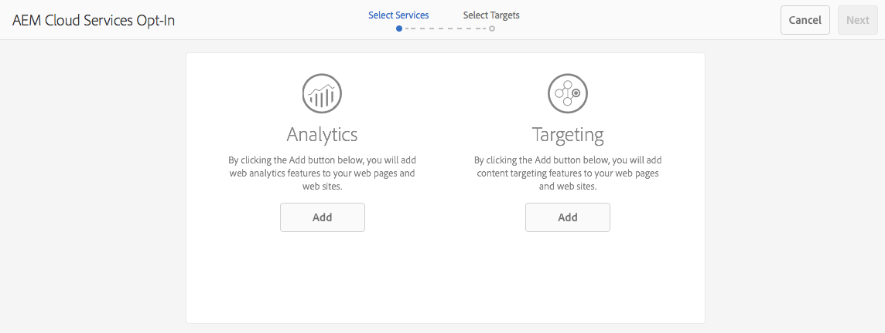

# Opción en Adobe Analytics y Adobe Target{#opting-into-adobe-analytics-and-adobe-target}

AEM tiene un procedimiento de selección para ayudarle a integrarse con Adobe Analytics y Adobe Target. Está disponible de forma predeterminada, como una tarea precargada asignada al grupo de usuarios administrador.

Al iniciar sesión como administrador, esta tarea (**Configuración de Analytics y Targeting**) está disponible en la [Bandeja de entrada](/help/sites-authoring/inbox.md#out-of-the-box-administrative-tasks). En función de las credenciales que proporcione, le ayudará a configurar e integrar estos servicios.

Tiene las siguientes opciones para configurar la integración:

* Configure la integración mediante la tarea.

   Esto se puede hacer inmediatamente o más tarde, la tarea permanecerá en la Bandeja de entrada hasta que se realice alguna acción. En cualquier caso, la configuración se puede realizar directamente en la interfaz de usuario o con el uso de un archivo `.properties` predefinido.

* Desactivar la integración.

   Considere esta opción si prefiere configurar [manualmente la integración](/help/sites-administering/marketing-cloud.md). Consulte también [Integración de AEM con Adobe Target y Adobe Analytics mediante DTM](https://helpx.adobe.com/experience-manager/using/integrate-digital-marketing-solutions.html).

* Configure la configuración y el aprovisionamiento mediante una secuencia de comandos.

## Configuración de la integración {#configuring-the-integration}

Opte por la integración con:

* Analytics para habilitar el uso de sus capacidades de seguimiento y análisis de página.
* Target para habilitar el uso de sus capacidades de personalización.

Para cualquiera de las opciones debe proporcionar la información de la cuenta de usuario y especificar las páginas que se rastrean.

>[!NOTE]
>
>Si lo desea, puede proporcionar información de la cuenta de Analytics y Target mediante un archivo de propiedades que se lee al iniciar el servidor. Consulte [Proporcionar información de la cuenta mediante un archivo](/help/sites-administering/opt-in.md#providing-account-information-using-a-properties-file)de propiedades.

Al optar por la integración, AEM realiza las siguientes tareas:

* Crea las configuraciones de nube que habilitan la conexión a Analytics y Target.
* Crea los marcos que determinan los datos que se rastrean.
* Configura las páginas Web para utilizar estos servicios.

>[!NOTE]
>
>AT.js es la biblioteca de cliente predeterminada. Esto se configura en la configuración [de los servicios de nube de](/help/sites-administering/target-configuring.md#creating-a-target-cloud-configuration)destino.
>
>Adobe recomienda utilizar AT.js como biblioteca de cliente.

Para participar en la tarea precargada y lista para usar:

1. En la [Bandeja de entrada, seleccione y **abra** la tarea Configurar análisis y objetivos](/help/sites-authoring/inbox.md#taking-action-on-an-item) .

   

1. Para Analytics:

   1. Introduzca la información de la cuenta de usuario de Analytics y, a continuación, haga clic en el botón **Agregar** correspondiente.
   1. Se autentican las credenciales correspondientes.
   1. Cuando se autentique la cuenta de Analytics, seleccione el grupo de informes de Analytics que desee utilizar. AEM recupera esos grupos de informes de Analytics. El estado se actualiza a **Agregado**.

1. Para Target:

   1. Introduzca la información de la cuenta de usuario de Target y, a continuación, haga clic en el botón **Agregar** correspondiente.
   1. Se autentican las credenciales correspondientes. El estado se actualiza a **Agregado**.

1. Seleccione **Siguiente**.
1. Seleccione los sitios para los que se deben usar Analytics o Target.

1. Seleccione **Listo** para completar.

   >[!CAUTION]
   >
   >Después de optar por la configuración, debe publicar el sitio o las páginas afectadas para replicar estos cambios en la instancia de publicación.

## Exclusión de la integración {#opting-out-of-the-integration}

Elimine la integración con Analytics y Target cuando:

* No desea integrarse con estos productos.
* Prefiere configurar las integraciones manualmente.

   Para obtener información sobre la configuración manual de las integraciones, consulte [Integración con Adobe Analytics](/help/sites-administering/adobeanalytics.md) e [Integración con Adobe Target](/help/sites-administering/target.md).

Para desactivar la opción, debe completar la tarea precargada:

* En la [Bandeja de entrada, seleccione y **complete** la tarea Configurar análisis y objetivos](/help/sites-authoring/inbox.md#taking-action-on-an-item) .

## Proporcionar información de la cuenta mediante un archivo de propiedades {#providing-account-information-using-a-properties-file}

Instale un archivo de propiedades que AEM lea al iniciar el servidor para configurar las propiedades de la cuenta para la integración con Analytics y Target. Cuando se utiliza el archivo de propiedades, el asistente para la selección utiliza automáticamente las propiedades del archivo y la configuración de nube se crea en consecuencia.

El archivo de propiedades es un archivo de texto llamado marketing cloud.properties que se guarda en el directorio de trabajo que utiliza el proceso de AEM (normalmente el mismo directorio que el archivo JAR). El archivo incluye las siguientes propiedades:

* analytics.server: La dirección URL del centro de datos de Analytics que utilice.
* analytics.company: Empresa asociada a su cuenta de usuario de Analytics.
* analytics.username: Su nombre de usuario de Analytics.
* analytics.secret: El secreto asociado al nombre de usuario de Analytics.
* analytics.reportsuite: Nombre del grupo de informes de Analytics que se va a usar.
* target.clientcode: El código de cliente asociado a su cuenta de Target.
* target.email: La dirección de correo electrónico que utiliza para autenticar su cuenta de Target.
* target.password: La contraseña asociada a su dirección de correo electrónico.

Las propiedades y los valores se separan con signos iguales (=). El prefijo de las propiedades de Analytics es `analytics`y el de las propiedades de Target es `target`. Para configurar un servicio, proporcione valores para todas las propiedades de dicho servicio. Si no desea configurar un servicio, no proporcione valores para ese servicio.

El siguiente archivo de ejemplo `.properties` incluye los valores de propiedad para crear una configuración de nube para Analytics:

```xml
analytics.server=https://test.omniture.com/login/
analytics.company=MyCompany
analytics.username=sbroders
analytics.secret=12345678
analytics.reportsuite=myreportsuite
target.clientcode=
target.email=
target.password=
```

El siguiente procedimiento describe cómo optar por la integración mediante el archivo de propiedades.

1. Cree el `marketingcloud.properties` archivo en el directorio de trabajo que está utilizando el proceso de AEM (instancia de autor).

   >[!NOTE]
   >
   >El directorio de trabajo es generalmente el directorio que contiene el archivo o el archivo `license.properties` .
   >
   >Sin embargo, la propiedad system también puede definirla como una ruta absoluta:
   >
   >`mac.provisioning.file.container`

1. Agregue los valores de propiedad según sus cuentas de Analytics y/o Target.
1. Inicie o reinicie el servidor y, a continuación, inicie sesión con una cuenta de administrador.
1. Abra la tarea Configurar Analytics y Targeting como se describe en [Configuración de la integración](/help/sites-administering/opt-in.md#configuring-the-integration). En lugar de solicitar la información de su cuenta, el asistente utiliza los valores del `.properties` archivo.

   Seleccione **Agregar** para el servicio adecuado y, a continuación, continúe con el asistente.

   

## Acerca de las configuraciones de nube {#about-the-cloud-configurations}

Al configurar la integración con Analytics y Target, AEM crea automáticamente las configuraciones y los marcos de nube necesarios. Por ejemplo, la configuración de nube de Analytics se denomina Cuenta de Analytics aprovisionada.

No es necesario modificar las configuraciones de nube. Sin embargo, puede configurar los marcos según sea necesario. (Consulte [Asignación de datos de componentes con propiedades](/help/sites-administering/adobeanalytics-mapping.md) de Adobe Analytics y [Agregar un marco](/help/sites-administering/target.md)de Target).

>[!NOTE]
>
>De forma predeterminada, cuando se selecciona en el asistente de configuración de Adobe Target, la segmentación precisa está activada.
>
>La segmentación precisa significa que la configuración del servicio en la nube espera a que se cargue el contexto antes de cargar el contenido. Como resultado, en términos de rendimiento, la segmentación precisa puede crear un retraso de unos milisegundos antes de cargar el contenido.
>
>La segmentación precisa siempre está habilitada en la instancia de creación. Sin embargo, en la instancia de publicación, puede desactivar la segmentación precisa globalmente borrando la marca de verificación junto a Objetivo preciso en la configuración del servicio en la nube (**http://localhost:4502/etc/cloudservices.html**). También puede activar y desactivar la segmentación precisa para componentes individuales independientemente de la configuración del servicio en la nube.
>
>Si ***ya*** ha creado componentes de destino y cambia esta configuración, los cambios no afectarán a dichos componentes. Debe realizar cambios directamente en esos componentes.

>[!CAUTION]
>
>Cuando se selecciona en la configuración de Analytics y `reportsuite` se selecciona un elemento específico, el marco se restringe al modo de ejecución de publicación. Esto significa que el seguimiento solo funciona en la instancia de publicación.
>
>Si también se necesita realizar el seguimiento en una instancia de creación, se debe cambiar el valor a `all`.

## Configuración del programa de instalación y aprovisionamiento mediante script {#configuring-the-setup-and-provisioning-via-script}

Como administrador, puede que desee activar la configuración y el aprovisionamiento con una secuencia de comandos en lugar de pasar manualmente por el asistente. Puede hacerlo mediante:

* Envío de una solicitud POST a **/libs/cq/cloudservicesprovisioning/content/autoprovisioning.json** con los parámetros requeridos.

Los parámetros que envía dependen de lo siguiente:

* Si desea utilizar el archivo **marketingcloud.properties** con todas las credenciales necesarias, debe enviar los siguientes parámetros:

   * `automaticProvisioning`= `true`
   * `servicename`= `analytics|target`
   * `path`=ruta a una página de AEM para adjuntar las configuraciones de servicios en la nube creadas
   Por ejemplo, una solicitud curl que cree tanto configuraciones de Analytics como de Target y las adjunte a la página we.retail sería:

   ```shell
   curl -v -u admin:admin -X POST -d"automaticProvisioning=true&servicename=target&servicename=analytics&path=/content/we-retail" http://localhost:4502/libs/cq/cloudservicesprovisioning/content/autoprovisioning.json
   ```

* Si no desea utilizar el archivo **marketingcloud.properties** , deberá enviar las credenciales así como los parámetros; por ejemplo:

   * AutomaticProvisioning= `true`
   * servicename= `analytics|target`
   * path=path a una página de AEM para adjuntar las configuraciones de servicios en la nube creadas; se pueden definir varias rutas
   * analytics.server= `https://servername`
   * analytics.company= `Name of company`
   * analytics.username= `me`
   * analytics.secret= `secret`
   * analytics.reportsuite= `we-retail`
   * target.clientcode= `mycompany`
   * target.email= `me@adobe.com`
   * target.password= `password`
   En este caso, la solicitud curl que crea las configuraciones de Analytics y Target y las adjunta a la página de venta minorista virtual sería:

   ```shell
   curl -v -u admin:admin -X POST -d"automaticProvisioning=false&servicename=target&servicename=analytics&path=/content/we-retail&analytics.server=https://servername/&analytics.company=Name of company&analytics.username=me&analytics.secret=secret&analytics.reportsuite=weretail&target.clientcode=mycompany&target.email=me@adobe.com&target.password=password" http://localhost:4502/libs/cq/cloudservicesprovisioning/content/autoprovisioning.json
   ```

