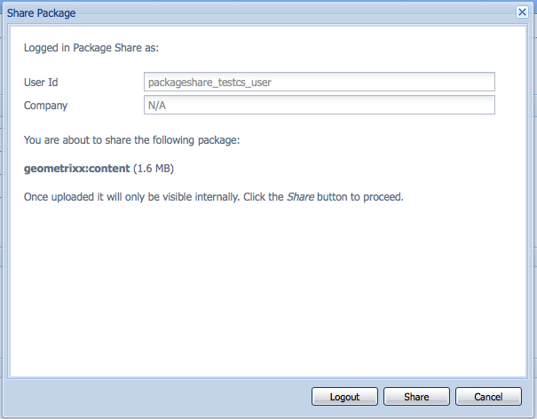

# How to Work With Packages{#how-to-work-with-packages}

Los paquetes permiten importar y exportar el contenido del repositorio. Por ejemplo, puede utilizar paquetes para instalar nueva funcionalidad, transferir contenido entre instancias y realizar una copia de seguridad del contenido del repositorio.

Se puede acceder a los paquetes y/o mantenerlos desde las páginas siguientes:

* [Administrador](#package-manager)de paquetes, que se utiliza para administrar los paquetes en la instancia local de AEM.

* [Package Share](#package-share), un servidor centralizado que contiene tanto paquetes disponibles públicamente como paquetes privados para su empresa. Los paquetes públicos pueden contener revisiones, nuevas funcionalidades, documentación, etc.

Puede transferir paquetes entre el Administrador de paquetes, Uso compartido de paquetes y el sistema de archivos.

## ¿Qué son los paquetes? {#what-are-packages}

Un paquete es un archivo zip que contiene el contenido del repositorio en forma de serialización del sistema de archivos (llamada serialización &quot;vault&quot;). Esto proporciona una representación fácil de usar y editar de archivos y carpetas.

Los paquetes incluyen contenido, tanto de contenido de página como del proyecto, seleccionado mediante filtros.

Un paquete también contiene información meta de vault, incluidas las definiciones de filtros y la información de configuración de importación. Se pueden incluir en el paquete propiedades de contenido adicionales (que no se utilizan para la extracción del paquete), como una descripción, una imagen visual o un icono; estas propiedades son para el consumidor del paquete de contenido y solo para fines informativos.

>[!NOTE]
>
>Los paquetes representan la versión actual del contenido en el momento en que se crea el paquete. No incluyen versiones anteriores del contenido que AEM mantiene en el repositorio.

Puede realizar las siguientes acciones con o con paquetes:

* Crear nuevos paquetes; definir la configuración y los filtros del paquete según sea necesario
* Vista previa del contenido del paquete (antes de la compilación)
* Compilación de paquetes
* Ver información del paquete
* Ver el contenido del paquete (después de la compilación)
* Modificar la definición de los paquetes existentes
* Reconstruir paquetes existentes
* Volver a ajustar paquetes
* Descargar paquetes de AEM en el sistema de archivos
* Cargar paquetes del sistema de archivos en la instancia local de AEM
* Validar el contenido del paquete antes de la instalación
* Realizar una instalación de ejecución en seco
* Instalación de paquetes (AEM no instala automáticamente los paquetes después de cargarlos)
* Eliminar paquetes
* Descargar paquetes, como revisiones, de la biblioteca Package Share
* Cargar paquetes en la sección interna de la empresa de la biblioteca Package Share

## Información del paquete {#package-information}

Una definición de paquete se compone de varios tipos de información:

* [Configuración del paquete](#package-settings)
* [Filtros de paquete](#package-filters)
* [Capturas de pantalla del paquete](#package-screenshots)
* [Iconos de paquete](#package-icons)

### Configuración del paquete {#package-settings}

Puede editar una variedad de opciones de configuración de paquete para definir aspectos como la descripción del paquete, los errores relacionados, las dependencias y la información del proveedor.

El cuadro de diálogo Configuración **del** paquete está disponible mediante el botón **Editar** al [crear](#creating-a-new-package) o [editar](#viewing-and-editing-package-information) un paquete y proporciona tres fichas para la configuración. Una vez realizados los cambios, haga clic en **Aceptar** para guardarlos.


| **Campo** | **Descripción** |
|---|---|
| Nombre | El nombre del paquete. |
| Agrupar | Nombre del grupo al que se va a agregar el paquete, para organizar los paquetes. Escriba el nombre de un grupo nuevo o seleccione un grupo existente. |
| Versión | Texto que se usará para la versión personalizada. |
| Descripción | Breve descripción del paquete. El formato se puede usar con formato HTML. |
| Miniatura | El icono que aparece con la lista de paquetes. Haga clic en Examinar para seleccionar un archivo local. |


<table>
 <tbody>
  <tr>
   <th><strong>Campo</strong></th>
   <th><strong>Descripción</strong></th>
   <th><strong>Formato/Ejemplo</strong></th>
  </tr>
  <tr>
   <td>Nombre</td>
   <td>El nombre del proveedor.</td>
   <td><em>AEM Geometrixx<br /> </em></td>
  </tr>
  <tr>
   <td>URL</td>
   <td>Dirección URL del proveedor.</td>
   <td><em>https://www.aem-geometrixx.com</em></td>
  </tr>
  <tr>
   <td>Vínculo</td>
   <td>Vínculo específico del paquete a una página de proveedor.</td>
   <td><em>https://www.aem-geometrixx.com/mypackage.html</em></td>
  </tr>
  <tr>
   <td>Requiere<br /> </td>
   <td>
    <ul>
     <li>Administrador: Seleccione cuándo el paquete solo puede instalarse mediante una cuenta con privilegios de administrador.</li>
     <li>Restart: Seleccione cuándo debe reiniciarse el servidor después de instalar el paquete.</li>
    </ul> </td>
   <td> </td>
  </tr>
  <tr>
   <td>Administración de AC</td>
   <td><p>Especifique cómo se gestiona la información de control de acceso definida en el paquete cuando se importa:</p>
    <ul>
     <li><strong>Ignorar</strong></li>
     <li><strong>Sobrescribir</strong></li>
     <li><strong>Combinar</strong></li>
     <li><strong>Borrar</strong></li>
     <li><strong>MergePreserve</strong></li>
    </ul> <p>The default value is <strong>Ignore</strong>.</p> </td>
   <td>
    <ul>
     <li><strong>Ignorar</strong> : conservar las ACL en el repositorio</li>
     <li><strong>Sobrescribir</strong> : sobrescribir ACL en el repositorio</li>
     <li><strong>Combinar</strong> : combinar ambos conjuntos de ACL</li>
     <li><strong>Claras</strong> : claras ACL</li>
     <li><strong>MergePreserve</strong> : combine el control de acceso en el contenido con el proporcionado con el paquete agregando las entradas de control de acceso de entidades principales que no están presentes en el contenido</li>
    </ul> </td>
  </tr>
 </tbody>
</table>


| **Campo** | **Descripción** | **Formato/Ejemplo** |
|---|---|---|
| Probado con | El nombre del producto y la versión de este paquete son compatibles o están dirigidos a ellos. | *AEM6* |
| Problemas/errores solucionados | Campo de texto que permite enumerar los detalles de los errores corregidos con este paquete. Enumere cada error en una línea separada. | resumen de error-nr |
| Depende de | Enumera la información de dependencia que debe respetarse siempre que se necesiten otros paquetes para permitir que el paquete actual se ejecute según lo esperado. Este campo es importante cuando se utilizan revisiones. | groupId:nombre:versión |
| Reemplaza | Una lista de paquetes obsoletos que este paquete reemplaza. Antes de realizar la instalación, compruebe que este paquete incluye todo el contenido necesario de los paquetes obsoletos para que no se sobrescriba ningún contenido. | groupId:nombre:versión |

### Filtros de paquete {#package-filters}

Los filtros identifican los nodos del repositorio que se incluirán en el paquete. Una definición **de filtro** especifica la siguiente información:

* Ruta de **raíz** del contenido que se va a incluir.
* **Reglas** que incluyen o excluyen nodos específicos debajo de la ruta raíz.

Los filtros pueden incluir cero o más reglas. Cuando no hay reglas definidas, el paquete contiene todo el contenido debajo de la ruta raíz.

Puede definir una o varias definiciones de filtro para un paquete. Utilice más de un filtro para incluir contenido de varias rutas raíz.


En la tabla siguiente se describen estas reglas y se proporcionan ejemplos:

<table>
 <tbody>
  <tr>
   <th> Tipo de regla</th>
   <th>Descripción </th>
   <th>Ejemplo </th>
  </tr>
  <tr>
   <td> incluir</td>
   <td>Puede definir una ruta o utilizar una expresión regular para especificar todos los nodos que desee incluir.<br /> <br /> Al incluir un directorio:
    <ul>
     <li>incluir ese directorio <i>y todos los</i> archivos y carpetas de ese directorio (es decir, todo el subárbol)</li>
     <li><strong>no incluir</strong> otros archivos o carpetas de la ruta raíz especificada</li>
    </ul> </td>
   <td>/libs/sling/install(/.*)? </td>
  </tr>
  <tr>
   <td> excluir</td>
   <td>Puede especificar una ruta de acceso o utilizar una expresión regular para especificar todos los nodos que desea excluir.<br /> <br /> Al excluir un directorio se excluirá ese directorio <i>y todos los</i> archivos y carpetas de ese directorio (es decir, todo el subárbol).<br /> </td>
   <td>/libs/wcm/foundation/components(/.*)?</td>
  </tr>
 </tbody>
</table>

>[!NOTE]
>
>Un paquete puede contener varias definiciones de filtro, de modo que los nodos de diferentes ubicaciones se pueden combinar fácilmente en un paquete.

Los filtros de paquete se definen con mayor frecuencia cuando se [crea el paquete](#creating-a-new-package)por primera vez, pero también se pueden editar posteriormente (tras lo cual se debe volver a crear el paquete).

### Capturas de pantalla del paquete {#package-screenshots}

Puede adjuntar capturas de pantalla al paquete para proporcionar una representación visual del aspecto del contenido; por ejemplo, proporcionando capturas de pantalla de la nueva funcionalidad.

### Iconos de paquete {#package-icons}

También puede adjuntar un icono al paquete para proporcionar una representación visual de referencia rápida de lo que contiene el paquete. Esto se muestra en la lista de paquetes y puede ayudarle a identificar fácilmente el paquete, o la clase de paquete.

Como un paquete puede contener un icono, se utilizan las siguientes convenciones para los paquetes oficiales:

>[!NOTE]
>
>Para evitar confusiones, utilice un icono descriptivo para el paquete y no utilice uno de los iconos oficiales.

Paquete de revisión oficial:


Paquete oficial de instalación o extensión de AEM:

Paquete de funciones oficiales:


## el administrador de paquetes {#package-manager}

El administrador de paquetes administra los paquetes de la instalación local de AEM. Una vez que haya [asignado los permisos](#permissions-needed-for-using-the-package-manager) necesarios, puede utilizar el Administrador de paquetes para realizar diversas acciones, como configurar, crear, descargar e instalar los paquetes. Los elementos clave que se deben configurar son:

* [Configuración del paquete](#package-settings)
* [Filtros de paquete](#package-filters)

### Permisos necesarios para utilizar el Administrador de paquetes {#permissions-needed-for-using-the-package-manager}

Para otorgar a los usuarios el derecho de crear, modificar, cargar e instalar paquetes, debe darles los permisos adecuados en las siguientes ubicaciones:

* **/etc/packages** (derechos completos excluyendo delete)
* el nodo que contiene el contenido del paquete

Consulte [Configuración de permisos](/help/sites-administering/security.md#setting-page-permissions) para obtener instrucciones sobre cómo cambiar permisos.

### Creación de un nuevo paquete {#creating-a-new-package}

Para crear una nueva definición de paquete:

1. En la pantalla de bienvenida de AEM, haga clic en **Paquetes** (o en la consola **Herramientas** , haga doble clic en **Paquetes**).

1. A continuación, seleccione Administrador **de paquetes**.
1. Haga clic en **Crear paquete**.

   >[!NOTE]
   >
   >Si la instancia tiene muchos paquetes, puede haber una estructura de carpetas en su lugar, por lo que puede desplazarse a la carpeta de destino necesaria antes de crear el nuevo paquete.

1. En el cuadro de diálogo:

   

   Introduzca el valor:

   * **Nombre del grupo**

      Nombre del grupo (o carpeta) de destino. Los grupos están pensados para ayudarle a organizar sus paquetes.

      Se creará una carpeta para el grupo si aún no existe. Si deja el nombre del grupo en blanco, creará el paquete en la lista de paquetes principal (Inicio > Paquetes).

   * **Nombre del paquete**

      El nombre del nuevo paquete. Seleccione un nombre descriptivo para ayudarle (y a otros) a identificar fácilmente el contenido del paquete.

   * **Versión**

      Campo de texto para indicar una versión. Esto se agregará al nombre del paquete para formar el nombre del archivo zip.
   Haga clic en **Aceptar** para crear el paquete.

1. AEM enumera el nuevo paquete en la carpeta de grupo correspondiente.

   

   Haga clic en el icono o el nombre del paquete para abrirlo.

   

   >[!NOTE]
   >
   >Si es necesario, puede volver a esta página más adelante.

1. Haga clic en **Editar** para editar la configuración [del](#package-settings)paquete.

   Aquí puede agregar información y/o definir determinadas opciones de configuración; por ejemplo: una descripción, el [icono](#package-icons), los errores relacionados y la adición de detalles del proveedor.

   Haga clic en **Aceptar** una vez que haya terminado de editar la configuración.

1. Agregue **[capturas de pantalla](#package-screenshots)**al paquete según sea necesario. Una instancia está disponible cuando se crea el paquete, agregue más si es necesario mediante **Package Screenshot**de la barra de tareas.

   Agregue la imagen real haciendo doble clic en el componente de imagen en el área **Capturas de pantalla** , agregando una imagen y haciendo clic en **Aceptar**.

1. Para definir los filtros **[de](#package-filters)**paquete, arrastre las instancias de la definición **de**filtro desde la barra de tareas y haga doble clic para abrirlas y editarlas:

   

   Especifique:

   * **Ruta** raízEl contenido que se va a empaquetar; puede ser la raíz de un subárbol.
   * **Las reglas** son opcionales; para definiciones de paquetes simples, no es necesario especificar reglas de inclusión o exclusión.

      Si es necesario, puede definir las reglas [**Incluir **o** Excluir **](#package-filters)para definir exactamente el contenido del paquete.

      Agregue reglas con el símbolo **+** y elimine las reglas con el **símbolo-** . Las reglas se aplican según su orden, de modo que se colocan según sea necesario con los botones **Subir** y **Bajar** .
   A continuación, haga clic en **Aceptar** para guardar el filtro.

   >[!NOTE]
   >
   >Puede utilizar tantas definiciones de filtro como necesite, aunque debe asegurarse de que no entran en conflicto. Utilice **Vista previa** para confirmar el contenido del paquete.

1. Para confirmar lo que contendrá el paquete, puede utilizar **Vista previa**. Esto realiza una ejecución en seco del proceso de compilación y enumera todo lo que se agregará al paquete cuando se cree realmente.
1. Ahora puede [compilar](#building-a-package) el paquete.

   >[!NOTE]
   >
   >No es obligatorio construir el paquete en este momento, puede hacerse en un momento posterior.

### Creación de un paquete {#building-a-package}

A menudo, un paquete se crea al mismo tiempo que [crea la definición](#creating-a-new-package)del paquete, pero puede volver más adelante para crear o volver a compilar el paquete. Esto puede resultar útil si el contenido del repositorio ha cambiado.

>[!NOTE]
>
>Antes de crear el paquete, puede resultar útil obtener una vista previa del contenido del paquete. Para ello, haga clic en **Vista previa**.

1. Abra la definición del paquete desde el Administrador de **paquetes** (haga clic en el icono o nombre del paquete).

1. Haga clic en **Generar**. Un cuadro de diálogo solicita confirmación de que desea crear el paquete.

   >[!NOTE]
   >
   >Esto es de especial importancia cuando está reconstruyendo un paquete, ya que se sobrescribirá su contenido.

1. Haga clic en **Aceptar**. AEM creará el paquete, enumerando todo el contenido agregado al paquete tal como lo hace. Al finalizar, AEM muestra una confirmación de que el paquete se creó y, al cerrar el cuadro de diálogo, actualiza la información de la lista de paquetes.

### Reajuste de un paquete {#rewrapping-a-package}

Una vez creado el paquete, se puede volver a ajustar, si es necesario.

Al volver a ajustar se cambia la información del paquete, *sin* cambiar el contenido del paquete. La información del paquete es la miniatura, la descripción, etc., es decir, todo lo que puede editar con el cuadro de diálogo Configuración **del** paquete (para abrir este clic en **Editar**).

Un caso de uso importante para volver a ajustar es cuando se prepara un paquete para el recurso compartido de paquetes. Por ejemplo, puede tener un paquete existente y decidir compartirlo con otros. Para ello, desea agregar una miniatura y una descripción. En lugar de recrear todo el paquete con toda su funcionalidad (lo que puede llevar cierto tiempo y asumir el riesgo de que el paquete ya no sea idéntico al original), puede volver a ajustarlo y simplemente agregar la miniatura y la descripción.

1. Abra la definición del paquete desde el Administrador de **paquetes** (haga clic en el icono o nombre del paquete).

1. Haga clic en **Editar** y actualice la configuración **[del](#package-settings)**paquete según sea necesario. Haga clic en **Aceptar**para guardar.

1. Haga clic en **Volver a ajustar** y aparecerá un cuadro de diálogo para solicitar confirmación.

### Visualización y edición de la información del paquete {#viewing-and-editing-package-information}

Para ver o editar información sobre una definición de paquete:

1. En el Administrador de paquetes, navegue hasta el paquete que desee ver.
1. Haga clic en el icono de paquete del paquete que desee ver. Esto abrirá la página del paquete con información sobre la definición del paquete:

   

   >[!NOTE]
   >
   >También puede editar y realizar determinadas acciones en el paquete desde esta página.
   >
   >Los botones disponibles dependerán de si el paquete ya se ha creado o no.

1. Si el paquete ya se ha compilado, haga clic en **Contenido**, se abrirá una ventana con el contenido completo del paquete:

### Visualización del contenido del paquete y prueba de la instalación {#viewing-package-contents-and-testing-installation}

Después de crear un paquete, puede ver el contenido:

1. En el Administrador de paquetes, navegue hasta el paquete que desee ver.
1. Haga clic en el icono de paquete del paquete que desee ver. Esto abrirá la página del paquete con información sobre la definición del paquete.

1. Para ver el contenido, haga clic en **Contenido** y se abrirá una ventana con el contenido completo del paquete:

   

1. Para realizar una ejecución seca de la instalación, haga clic en **Probar instalación**. Después de confirmar la acción, se abrirá una ventana y se enumerarán los resultados como si la instalación se hubiera realizado:

   

### Descarga de paquetes en el sistema de archivos {#downloading-packages-to-your-file-system}

En esta sección se describe cómo descargar un paquete de AEM en el sistema de archivos mediante el Administrador **de paquetes**.

>[!NOTE]
>
>Consulte Uso compartido de [paquetes](#package-share) para obtener información sobre cómo descargar revisiones, paquetes de funciones y paquetes del área pública y del área interna de uso compartido de paquetes de su empresa.
>
>Desde Package Share puede:
>
>* descargue paquetes desde Uso compartido de [paquetes directamente en su instancia](#downloading-and-installing-packages-from-package-share)local de AEM.
   >  Tras la descarga, el paquete se importa en el repositorio, tras lo cual puede instalarlo inmediatamente en la instancia local mediante el Administrador de **paquetes**. Estos paquetes incluyen revisiones y otros paquetes compartidos.
   >
   >
* descargue paquetes desde [Package Share al sistema](#downloading-packages-to-your-file-system-from-package-share)de archivos.
>


1. En la pantalla de bienvenida de AEM, haga clic en **Paquetes** y, a continuación, seleccione Administrador **de paquetes**.
1. Vaya al paquete que desee descargar.

   

1. Haga clic en el vínculo formado por el nombre del archivo zip (subrayado) del paquete que desea descargar; por ejemplo `export-for-offline.zip`.

   AEM descarga el paquete en el equipo (mediante un cuadro de diálogo de descarga estándar del navegador).

### Carga de paquetes desde el sistema de archivos {#uploading-packages-from-your-file-system}

La carga de paquetes permite cargar un paquete desde el sistema de archivos en el Administrador de paquetes de AEM.

>[!NOTE]
>
>Consulte [Carga de paquetes en Package Share](#uploading-packages-to-the-company-internal-package-share) interno de la empresa para cargar un paquete en el área privada de Package Share de la empresa.

Para cargar un paquete:

1. Vaya al Administrador **de paquetes**. A continuación, vaya a la carpeta de grupo en la que desea que se cargue el paquete.

   

1. Haga clic en **Cargar paquete**.

   

   * **Archivo**

      **Puede escribir el nombre del archivo directamente o utilizar** Examinar... para seleccionar el paquete requerido en el sistema de archivos local (después de seleccionar **Aceptar**).

   * **Forzar carga**

      Si ya existe un paquete con este nombre, puede hacer clic en él para forzar la carga (y sobrescribir el paquete existente).
   Haga clic en **Aceptar** para que el nuevo paquete se cargue y aparezca en la lista Administrador de paquetes.

   >[!NOTE]
   >
   >Para que el contenido esté disponible para AEM, asegúrese de [instalar el paquete](#installing-packages).

### Validación de paquetes {#validating-packages}

Antes de instalar un paquete, es posible que desee comprobar su contenido. Debido a que los paquetes pueden modificar los archivos superpuestos en `/apps` y/o agregar, modificar y eliminar ACL, a menudo resulta útil validar estos cambios antes de instalarlos.

#### Opciones de validación {#validation-options}

El mecanismo de validación puede comprobar las siguientes características del paquete:

* Importaciones de paquetes OSGi
* Superposiciones
* ACL

Estas opciones se detallan a continuación.

* **Validar importaciones de paquetes OSGi**

   **Qué está marcado**

   Esta validación inspecciona el paquete para todos los archivos JAR (paquetes OSGi), extrae sus archivos `manifest.xml` (que contiene las dependencias con versiones de las que depende dicho paquete OSGi) y verifica que la instancia de AEM exporta dichas dependencias con las versiones correctas.

   **Cómo se informa**

   Las dependencias con versiones que no puedan ser satisfechas por la instancia de AEM se enumeran en el registro de **actividades** del Administrador de paquetes.

   **Estados de error**

   Si las dependencias no están satisfechas, los paquetes OSGi del paquete con esas dependencias no se iniciarán. Esto resulta en una implementación de aplicación dañada, ya que todo lo que dependa del paquete OSGi no iniciado no funcionará correctamente.

   **Resolución de errores**

   Para resolver errores debido a paquetes OSGi insatisfechos, es necesario ajustar la versión de dependencia del paquete con importaciones insatisfechas.

* **Validar capas**

   **Qué está marcado**

   Esta validación determina si el paquete que se está instalando contiene un archivo que ya está superpuesto en la instancia de AEM de destino.

   Por ejemplo, dado un overlay existente en `/apps/sling/servlet/errorhandler/404.jsp`, un paquete que contiene `/libs/sling/servlet/errorhandler/404.jsp`, de forma que cambiará el archivo existente en `/libs/sling/servlet/errorhandler/404.jsp`.

   **Cómo se informa**

   Estas superposiciones se describen en el Registro de **actividades** del Administrador de paquetes.

   **Estados de error**

   Un estado de error significa que el paquete está intentando implementar un archivo que ya está superpuesto, por lo que los cambios en el paquete serán anulados (y por lo tanto &quot;ocultos&quot;) por la superposición y no surtirán efecto.

   **Resolución de errores**

   Para resolver este problema, el mantenedor del archivo de superposición de `/apps` debe revisar los cambios realizados en el archivo superpuesto en `/libs` y, a continuación, incorporar los cambios según sea necesario en la superposición ( `/apps`), así como volver a implementar el archivo superpuesto.

   >[!NOTE]
   >
   >Tenga en cuenta que el mecanismo de validación no tiene forma de conciliar si el contenido superpuesto se ha incorporado correctamente en el archivo de superposición. Por lo tanto, esta validación seguirá informando sobre los conflictos incluso después de que se hayan realizado los cambios necesarios.

* **Validar ACL**

   **Qué está marcado**

   Esta validación comprueba qué permisos se agregan, cómo se gestionarán (combinar/reemplazar) y si los permisos actuales se verán afectados.

   **Cómo se informa**

   Los permisos se describen en el Registro de **actividades** del Administrador de paquetes.

   **Estados de error**

   No se pueden proporcionar errores explícitos. La validación simplemente indica si se agregarán o se verán afectados los nuevos permisos ACL al instalar el paquete.

   **Resolución de errores**

   Utilizando la información proporcionada por la validación, los nodos afectados pueden revisarse en CRXDE y las ACL pueden ajustarse en el paquete según sea necesario.

   >[!CAUTION]
   >
   >Se recomienda que los paquetes no afecten a las ACL proporcionadas por AEM, ya que esto puede provocar un comportamiento inesperado del producto.

#### Realización de la validación {#performing-validation}

La validación de los paquetes se puede realizar de dos maneras diferentes:

* Mediante la interfaz de usuario del administrador de paquetes
* A través de una solicitud HTTP POST como con cURL

>[!NOTE]
>
>La validación debe realizarse siempre después de cargar el paquete, pero antes de instalarlo.

**Validación de paquetes mediante el administrador de paquetes**

1. Abra el Administrador de paquetes en `https://<server>:<port>/crx/packmgr`
1. Seleccione el paquete en la lista y, a continuación, seleccione la lista desplegable **Más** en el encabezado y, a continuación, **Validar** en el menú desplegable.

   >[!NOTE]
   >
   >Esto debe realizarse después de cargar el paquete de contenido, pero antes de instalarlo.

1. En el cuadro de diálogo modal que aparece a continuación, utilice las casillas de verificación para seleccionar los tipos de validación y comenzar la validación haciendo clic en **Validar**. También puede hacer clic en **Cancelar**.

1. Las validaciones elegidas se ejecutan. Los resultados se muestran en el registro de actividades del Administrador de paquetes.

**Validación del paquete mediante solicitud HTTP POST**

La solicitud POST tiene el siguiente formulario.

```
https://<host>:<port>/crx/packmgr/service.jsp?cmd=validate&type=osgiPackageImports,overlays,acls
```

>[!NOTE]
>
>El `type` parámetro puede ser cualquier lista sin ordenar separada por comas que consista en:
>
>* `osgiPackageImports`
>* `overlays`
>* `acls`
>
>
El valor de `type` predeterminado es `osgiPackageImports` si no se pasa.

El siguiente es un ejemplo de uso de cURL para ejecutar una validación de paquete.

1. Si utiliza cURL, ejecute una instrucción similar a la siguiente:

   ```shell
   curl -v -X POST --user admin:admin -F file=@/Users/SomeGuy/Desktop/core.wcm.components.all-1.1.0.zip 'http://localhost:4502/crx/packmgr/service.jsp?cmd=validate&type=osgiPackageImports,overlays,acls'
   ```

1. La validación solicitada se ejecuta y la respuesta se devuelve como un objeto JSON.

>[!NOTE]
>
>La respuesta a una solicitud HTTP POST de validación será un objeto JSON con los resultados de la validación.

### Instalación de paquetes {#installing-packages}

Después de cargar un paquete, debe instalar el contenido. Para que el contenido del paquete esté instalado y en funcionamiento, es necesario que:

* cargado en AEM ( [cargado desde el sistema de archivos](#uploading-packages-from-your-file-system) o [descargado del recurso compartido](#downloading-and-installing-packages-from-package-share)de paquetes)

* instalen

>[!CAUTION]
>
>La instalación de un paquete puede sobrescribir o eliminar el contenido existente. Cargue un paquete únicamente si está seguro de que no elimina o sobrescribe el contenido que necesita.
>
>Para ver el contenido o el impacto de un paquete, puede:
>
>* Realice una instalación de prueba del paquete sin modificar ningún contenido:
   >  Abra el paquete (haga clic en el icono o nombre del paquete) y haga clic en **Probar instalación**.
   >
   >
* Consulte la lista de contenido del paquete:
   >  Abra el paquete y haga clic en **Contenido**.
>


>[!NOTE]
>
>Inmediatamente antes de la instalación del paquete, se crea un paquete de instantánea para que contenga el contenido que se sobrescribirá.
>
>Esta instantánea se reinstalará si desinstala el paquete.

>[!CAUTION]
>
>Si va a instalar recursos digitales, debe:
>
>* En primer lugar, desactive WorkflowLauncher.
   >  Utilice la opción de menú Componentes de la consola OSGi para desactivar `com.day.cq.workflow.launcher.impl.WorkflowLauncherImpl`.
   >
   >
* A continuación, cuando se complete la instalación, reactive WorkflowLauncher.
>
>
Al desactivar WorkflowLauncher se garantiza que el marco del importador de recursos no manipule los recursos durante la instalación (de forma involuntaria).

1. En el Administrador de paquetes, navegue hasta el paquete que desee instalar.

   Se muestra un botón **Instalar** en el lado de Paquetes que aún no se han instalado.

   >[!NOTE]
   >
   >Como alternativa, puede abrir el paquete haciendo clic en su icono para acceder al botón **Instalar** .

1. Haga clic en **Instalar** para iniciar la instalación. Un cuadro de diálogo solicitará confirmación y enumerará todos los cambios realizados. Cuando termine, haga clic en **Cerrar** en el cuadro de diálogo.

   La palabra **Installed** aparece junto al paquete después de que se haya instalado.

### Carga e instalación basadas en el sistema de archivos {#file-system-based-upload-and-installation}

Hay una forma alternativa de cargar e instalar paquetes en su instancia. En su sistema de archivos, tiene una `crx-quicksart` carpeta junto con su tarro y `license.properties` archivo. Debe crear una carpeta con el nombre `install` debajo de `crx-quickstart`. Tendrás algo así: `<aem_home>/crx-quickstart/install`

En esta carpeta de instalación, puede agregar directamente los paquetes. Se cargarán e instalarán automáticamente en su instancia. Cuando haya terminado, podrá ver los paquetes en el Administrador de paquetes.

Si la instancia se está ejecutando, al agregar un paquete a la `install` carpeta se iniciará directamente la carga y la instalación en la instancia. Si la instancia no se está ejecutando, los paquetes que coloque en la `install` carpeta se instalarán al inicio en orden alfabético.

>[!NOTE]
>
>También puede hacerlo antes incluso de iniciar la instancia por primera vez. Para ello, debe crear la `crx-quickstart` carpeta manualmente, crear la `install` carpeta debajo y colocar los paquetes allí. A continuación, cuando inicie la instancia por primera vez, los paquetes se instalarán en orden alfabético.

### Desinstalación de paquetes {#uninstalling-packages}

AEM le permite desinstalar paquetes. Esta acción revierte el contenido del repositorio que se ve afectado por la instantánea realizada inmediatamente antes de la instalación del paquete.

>[!NOTE]
>
>Tras la instalación, se crea un paquete de instantánea que contiene el contenido que se sobrescribirá.
>
>Este paquete se reinstalará cuando desinstale el paquete.

1. En el Administrador de paquetes, desplácese hasta el paquete que desee desinstalar.
1. Haga clic en el icono de paquete del paquete que desee desinstalar.
1. Haga clic en **Desinstalar** para eliminar el contenido de este paquete del repositorio. Un cuadro de diálogo solicitará confirmación y enumerará todos los cambios realizados. Cuando termine, haga clic en **Cerrar** en el cuadro de diálogo.

### Eliminación de paquetes {#deleting-packages}

Para eliminar un paquete de las listas del Administrador de paquetes:

>[!NOTE]
>
>Los archivos/nodos instalados del paquete **no se eliminan** .

1. En la consola **Herramientas** , expanda la carpeta **Paquetes** para mostrar el paquete en el panel derecho.

1. Haga clic en el paquete que desee eliminar para resaltarlo y, a continuación:

   * Haga clic en **Eliminar** en el menú de la barra de herramientas.
   * Haga clic con el botón derecho y seleccione **Eliminar**.
   

1. AEM solicita confirmación de que desea eliminar el paquete. Click **OK** to confirm the deletion.

>[!CAUTION]
>
>Si este paquete ya se ha instalado, el contenido *instalado* **no se eliminará** .

### Replicar paquetes {#replicating-packages}

Repita el contenido de un paquete para instalarlo en la instancia de publicación:

1. En el Administrador **de** paquetes, navegue hasta el paquete que desee replicar.

1. Haga clic en el icono o en el nombre del paquete que desee replicar para expandirlo.
1. En el menú desplegable **Más** de la barra de herramientas, seleccione **Replicar**.

## Uso compartido de paquetes {#package-share}

Package Share es un servidor centralizado que se pone a disposición del público para compartir Content-Packages.

Con Package Share, puede descargar estos paquetes, que pueden incluir revisiones oficiales, conjuntos de funciones, actualizaciones o contenido de muestra generado por otros usuarios.

También puede cargar y compartir paquetes dentro de su empresa.

### Acceso a Package Share {#access-to-package-share}

No hay acceso anónimo al Uso compartido de paquetes; es decir, solo los usuarios registrados pueden ver, descargar y cargar paquetes.

El acceso al Uso compartido de paquetes está disponible para nuestros socios y clientes. Los datos de registro deben enviarse para que se asignen derechos de acceso.

Para obtener acceso a Package Share:

* Uso de la página [Iniciar sesión](#signing-in-to-package-share)
* La primera vez que utilice la página de inicio de sesión deberá:

   * [Regístrese para obtener un Adobe ID](#registering-for-package-share) y/o [valide su Adobe ID existente](#validating-your-adobe-id)
   * para que se pueda crear su cuenta [de](#package-share-account) Package Share

>[!NOTE]
>
>Cualquier usuario de Package Share que no se haya asignado a un cliente debe unirse a una comunidad para ver esos recursos haciendo clic en **Unirse** al lado del inicio de sesión de Package Share.

#### Inicio de sesión en Package Share {#signing-in-to-package-share}

1. En la pantalla de bienvenida de AEM, haga clic en **Herramientas**.
1. A continuación, seleccione **Uso compartido** de paquetes. Deberá:

   * iniciar sesión con su Adobe ID
   * [Creación de un Adobe ID](#registering-for-package-share)
   >[!NOTE]
   >
   >La primera vez que inicie sesión con su Adobe ID, deberá completar la [validación de su dirección](#validating-your-adobe-id)de correo electrónico.

   >[!NOTE]
   >
   >Si ha olvidado su contraseña, utilice el vínculo de las páginas [de](https://enterprise-dev.adobe.com/content/edev/en/registration/account.html) ayuda (también en el cuadro de diálogo de inicio de sesión).

#### Validación del ID de Adobe {#validating-your-adobe-id}

La primera vez que inicie sesión en Package Share con su Adobe ID, se validará su dirección de correo electrónico.

1. Recibirá un correo electrónico con un vínculo.
1. Debe hacer clic en este vínculo.
1. Se abrirá una página web.

   La acción de abrir esta página web se toma como validación.

1. El inicio de sesión continuará.

1. Recibirá un correo electrónico con un vínculo.
1. Debe hacer clic en este vínculo.
1. Se abrirá una página web. La acción de abrir esta página web se toma como validación.
1. El inicio de sesión continuará.

#### Registro para uso compartido de paquetes {#registering-for-package-share}

Si necesita acceder a Package Share, deberá registrarse para obtener un Adobe ID:

* La página [de inicio de sesión de Uso compartido de](#signing-in-to-package-share) paquetes ofrece un vínculo para registrar un ID de Adobe.
* Puede registrarse para obtener un Adobe ID desde cierto software de escritorio de Adobe.
* También puede registrarse en línea en la página [de inicio de sesión de](https://www.adobe.com/cfusion/membership/index.cfm?nf=1&nl=1)Adobe.

Se puede crear un Adobe ID proporcionando:

* su dirección de correo electrónico
* una contraseña de su elección
* información adicional como su nombre y país de residencia

#### Cuenta de Package Share {#package-share-account}

La validez de la aplicación se comprobará antes de:

* Su cuenta de usuario se crea con los permisos requeridos o permitidos.
* Su cuenta se agrega al grupo de su empresa.

>[!NOTE]
>
>Un usuario de una de nuestras empresas asociadas también puede ser miembro de sus grupos de clientes.

#### Consideraciones de red {#network-considerations}

**IPv6**

Es posible que tenga problemas al intentar acceder a Package Share desde un entorno IPv6 puro.

Esto se debe a que el uso compartido de paquetes es un servicio alojado en un servidor, lo que significa que la conexión se realiza a través de varias redes en Internet. No se puede garantizar que todas las redes de conexión admitan IPv6; si no es así, la conexión podría fallar.

Para evitar este problema, puede acceder a Package Share desde una red IPv4, descargar el paquete y luego cargarlo en el entorno IPv6.

**Proxy HTTP**

Uso compartido de paquetes no está disponible en este momento si su empresa ejecuta un proxy http que requiere autenticación.

Uso compartido de paquetes solo está disponible cuando el servidor de AEM tiene acceso a Internet sin necesidad de autenticación. Para configurar el proxy para todos los servicios que utilizan el cliente http (incluido el uso compartido de paquetes), utilice la configuración [OSGi del paquete](/help/sites-deploying/osgi-configuration-settings.md)Day Commons HTTP Client 3.1.

### Uso compartido de paquetes interno {#inside-package-share}

En Package Share, los paquetes se organizan en tres subárboles:

* Paquetes de Adobe proporcionados por Adobe.
* Paquetes compartidos que han sido proporcionados por otras empresas y que Adobe ha hecho públicos.
* Su empresa ofrece paquetes privados.


### Búsqueda y filtrado de paquetes {#searching-and-filtering-packages}

Uso compartido de paquetes ofrece una barra de búsqueda que puede utilizar para buscar palabras clave o etiquetas específicas. Tanto las palabras clave como las etiquetas admiten varios valores.

* Para buscar varias palabras clave, debe separar cada palabra clave por un espacio.
* Para buscar varias etiquetas, debe seleccionar cada una en los árboles de paquetes.

También puede cambiar el operador condicional de O a Y en la parte derecha de la barra de resumen del filtro.

### Descarga E Instalación De Paquetes Desde Package Share {#downloading-and-installing-packages-from-package-share}

Para descargar paquetes desde Package Share e instalarlos en su instancia local, es más fácil acceder a Package Share desde su instancia de AEM. Esto descargará el paquete y lo registrará inmediatamente en el administrador de paquetes, desde donde se puede instalar.

1. En la pantalla de bienvenida de AEM, haga clic en **Herramientas** y, a continuación, seleccione Compartir **paquete** para abrir la página Uso compartido de paquetes.
1. Con los detalles de su cuenta, inicie sesión en Uso compartido de paquetes. Se muestra la página de aterrizaje, que enumera la carpeta Adobe, la carpeta compartida y una carpeta específica de su empresa.

   >[!NOTE]
   >
   >Antes de empezar a descargar paquetes desde Package Share, asegúrese de tener el acceso [](#access-to-package-share)necesario.

1. Vaya al paquete que desee descargar y haga clic en **Descargar**.

1. Vuelva atrás o vaya al Administrador de **paquetes** de su instancia de AEM. Luego navegue al paquete que acaba de descargar.

   >[!NOTE]
   >
   >Para encontrar el paquete descargado, siga la misma ruta que en Uso compartido de paquetes. Por ejemplo, si ha descargado un paquete de la siguiente ruta en Uso compartido de paquetes:
   >
   >**Paquetes** > **Público** > **Revisiones**
   A continuación, en el Administrador de paquetes de la instancia local, el paquete también aparecerá en:
   **Paquetes** > **Público** > **Revisiones**

1. Haga clic en **Instalar** para instalar el paquete en la instalación local de AEM.

   >[!NOTE]
   Si el paquete ya se ha instalado en su instancia, aparecerá el indicador **Instalado** junto al paquete en lugar del botón **Instalar** .

   >[!CAUTION]
   La instalación de un paquete puede sobrescribir el contenido existente en el repositorio. Por lo tanto, le recomendamos que realice primero una instalación **de** prueba. Esto le permite inspeccionar si el contenido que contiene el paquete entra en conflicto con el contenido existente.

### Descarga de paquetes en el sistema de archivos desde Package Share {#downloading-packages-to-your-file-system-from-package-share}

[La descarga e instalación](#downloading-and-installing-packages-from-package-share) es muy práctica, pero si es necesario también puede descargar el paquete y guardarlo en el sistema de archivos local:

1. En Uso compartido de paquetes, haga clic en el icono o el nombre del paquete.
1. Click the **Assets** tab.
1. Haga clic en **Descargar en disco**.

### Carga de un paquete {#uploading-a-package}

Con Package Share, puede cargar paquetes en el área interna de la empresa de Package Share. Esto hace que estén disponibles para compartirlas dentro de su empresa.

Estos paquetes *no están* disponibles para la comunidad general de AEM, pero están disponibles para todos los usuarios registrados en su empresa.

Para cargar paquetes, utilice el Compartir paquetes interno de la empresa:

>[!CAUTION]
Para cargar un paquete en Package Share, primero debe crear una carpeta de grupo con el nombre de su empresa en el administrador de paquetes local. Por ejemplo, geometrixx. Todos los paquetes que se van a cargar para compartir deben colocarse en esta carpeta de grupo.
Los paquetes de la lista de inicio del Administrador de paquetes o de otras carpetas no se pueden compartir.

1. Abra el Administrador **de** paquetes y vaya al paquete que desee cargar.

1. Haga clic en el icono del paquete para abrirlo.
1. Haga clic en **Compartir** para abrir el cuadro de diálogo y cargar el paquete en Uso compartido de paquetes.
1. Si aún no ha iniciado sesión en Package Share, deberá introducir sus credenciales de inicio de sesión.

   Cuando haya iniciado sesión, AEM mostrará los detalles sobre el paquete que se va a cargar:

   

1. Haga clic en **Compartir** para cargar el paquete en el Uso compartido de paquetes interno de su empresa.

   AEM muestra el estado e indica cuándo ha terminado de cargarse el paquete, tras lo cual puede hacer clic en la **x** (esquina superior derecha) para salir de la ventana **Compartir paquete** .

1. Una vez completada la carga, puede desplazarse a la carpeta interna de su empresa para ver el paquete que acaba de compartir.

>[!NOTE]
Para modificar un paquete disponible en Uso compartido de paquetes, debe descargarlo, volver a compilarlo y cargarlo de nuevo en Uso compartido de paquetes.

### Eliminación De Un Paquete {#deleting-a-package}

Sólo puede eliminar los paquetes que haya cargado mediante el procedimiento siguiente:

1. En el árbol de la empresa, compruebe el grupo de paquetes que contiene el paquete.
1. Haga clic en el paquete.
1. Haga clic en el botón Eliminar.

   

1. Haga clic en **Eliminar** para confirmar que desea eliminar el paquete.

### Paquetes semiprivados {#making-packages-semi-private}

Puede compartir paquetes fuera de su organización, pero no públicamente. Estos paquetes se considerarían semiprivados. Para compartir estos paquetes semiprivados, necesitará ayuda de la asistencia técnica de Adobe. Para ello, abra un ticket con el servicio de asistencia técnica de Adobe en el que se solicite que un paquete esté disponible fuera de su organización. Le pedirán una lista de los Adobe ID a los que desea otorgar acceso a sus paquetes.

## Distribución de software (Beta) {#software-distribution-beta}

[Distribución](https://downloads.experiencecloud.adobe.com) de software es la nueva interfaz de usuario diseñada para simplificar la búsqueda y descarga de paquetes AEM. Actualmente está en estado beta y solo es accesible para los servicios gestionados de Adobe y AEM como clientes de Cloud Service, así como para los empleados de Adobe.

>[!NOTE]
* [Package Share](#package-share) permanecerá en funcionamiento hasta que todos los clientes tengan acceso a Software Distribution.
* Todos los paquetes están disponibles en Uso compartido de paquetes y Distribución de software.


>[!CAUTION]
El administrador de paquetes de AEM no se puede utilizar con Distribución de software por el momento, ya que descarga los paquetes en el disco local.

