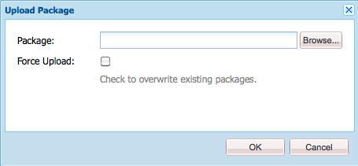

# Cómo trabajar con paquetes{#how-to-work-with-packages}

Los paquetes permiten importar y exportar el contenido del repositorio. Por ejemplo, puede utilizar paquetes para instalar nueva funcionalidad, transferir contenido entre instancias y hacer una copia de seguridad del contenido del repositorio.

Se puede acceder a los paquetes o mantenerlos desde las siguientes páginas:

* [Administrador de paquetes](#package-manager), que se utiliza para administrar los paquetes en la instancia de AEM local.

* [Distribución de software](#software-distribution), un servidor centralizado que contiene tanto paquetes disponibles para el público como los privados para su empresa. Los paquetes públicos pueden contener revisiones, nuevas funciones, documentación, etc.

Puede transferir paquetes entre el Administrador de paquetes, la Distribución de software y el sistema de archivos.

## ¿Qué son los paquetes? {#what-are-packages}

Un paquete es un archivo zip que contiene contenido del repositorio en forma de serialización del sistema de archivos (llamada serialización &quot;vault&quot;). Esto proporciona una representación fácil de usar y editar de archivos y carpetas.

Los paquetes incluyen contenido, tanto contenido de página como contenido relacionado con el proyecto, seleccionado mediante filtros.

Un paquete también contiene información meta de vault, incluidas las definiciones de filtro y la información de configuración de importación. En el paquete se pueden incluir propiedades de contenido adicionales (que no se utilizan para la extracción de paquetes), como una descripción, una imagen visual o un icono; estas propiedades son para el consumidor del paquete de contenido y solo para fines informativos.

>[!NOTE]
>
>Los paquetes representan la versión actual del contenido en el momento en que se crea el paquete. No incluyen ninguna versión anterior del contenido que AEM en el repositorio.

Puede realizar las siguientes acciones con o con paquetes:

* Crear nuevos paquetes; definir la configuración y los filtros del paquete según sea necesario
* Vista previa del contenido del paquete (antes de la compilación)
* Generar paquetes
* Ver información del paquete
* Ver el contenido del paquete (después de la compilación)
* Modificación de la definición de paquetes existentes
* Reconstruir paquetes existentes
* Volver a ajustar paquetes
* Descargue paquetes de AEM a su sistema de archivos
* Cargue paquetes desde el sistema de archivos a la instancia AEM local
* Validar el contenido del paquete antes de la instalación
* Realizar una instalación de simulación
* Instale paquetes (AEM no instala paquetes automáticamente después de cargarlos)
* Eliminar paquetes
* Descargue paquetes, como revisiones, de la biblioteca de distribución de software
* Cargar paquetes a la sección interna de la empresa de la biblioteca de distribución de software

## Información del paquete {#package-information}

Una definición de paquete consta de varios tipos de información:

* [Configuración de paquetes](#package-settings)
* [Filtros del paquete](#package-filters)
* [Capturas de pantalla del paquete](#package-screenshots)
* [Iconos de paquete](#package-icons)

### Configuración de paquetes {#package-settings}

Puede editar una variedad de Configuración del paquete para definir aspectos como la descripción del paquete, errores relacionados, dependencias e información del proveedor.

El cuadro de diálogo **Configuración del paquete** está disponible mediante el botón **Editar** cuando [crea](#creating-a-new-package) o [edita](#viewing-and-editing-package-information) un paquete y proporciona tres pestañas para la configuración. Después de realizar cualquier cambio, haga clic en **OK** para guardarlos.


| **Campo** | **Descripción** |
|---|---|
| Nombre | El nombre del paquete. |
| Agrupar | Nombre del grupo al que se va a añadir el paquete, para organizar los paquetes. Escriba el nombre de un grupo nuevo o seleccione un grupo existente. |
| Versión | Texto que se utilizará para la versión personalizada. |
| Descripción | Una breve descripción del paquete. El marcado HTML se puede usar para dar formato. |
| Miniatura    | El icono que aparece con la lista de paquetes. Haga clic en Examinar para seleccionar un archivo local. |


<table>
 <tbody>
  <tr>
   <th><strong>Campo</strong></th>
   <th><strong>Descripción</strong></th>
   <th><strong>Formato/Ejemplo</strong></th>
  </tr>
  <tr>
   <td>Nombre</td>
   <td>El nombre del proveedor.</td>
   <td><em>Geometrixx AEM<br /> </em></td>
  </tr>
  <tr>
   <td>URL</td>
   <td>URL del proveedor.</td>
   <td><em>https://www.aem-geometrixx.com</em></td>
  </tr>
  <tr>
   <td>Vínculo</td>
   <td>Enlace específico del paquete a una página de proveedor.</td>
   <td><em>https://www.aem-geometrixx.com/mypackage.html</em></td>
  </tr>
  <tr>
   <td>Requiere<br /> </td>
   <td>
    <ul>
     <li>Administrador: Seleccione cuándo solo puede instalar el paquete una cuenta con privilegios de administrador.</li>
     <li>Reinicie: Seleccione cuándo se debe reiniciar el servidor después de instalar el paquete.</li>
    </ul> </td>
   <td> </td>
  </tr>
  <tr>
   <td>Administración de AC</td>
   <td><p>Especifique cómo se gestiona la información de control de acceso definida en el paquete cuando se importa:</p>
    <ul>
     <li><strong>Ignorar</strong></li>
     <li><strong>Sobrescribir</strong></li>
     <li><strong>Combinar</strong></li>
     <li><strong>Borrar</strong></li>
     <li><strong>MergePreserve</strong></li>
    </ul> <p>El valor predeterminado es <strong>Ignore</strong>.</p> </td>
   <td>
    <ul>
     <li><strong>Ignore</strong> : preserve ACLs in the repository</li>
     <li><strong>Sobrescribir</strong> : sobrescribir ACL en el repositorio</li>
     <li><strong>Combinar</strong> : combine ambos conjuntos de ACL</li>
     <li><strong>Borrar</strong> : borrar ACL</li>
     <li><strong>MergePreserve</strong> : combine el control de acceso en el contenido con el que se proporciona con el paquete añadiendo las entradas de control de acceso de entidades principales que no están presentes en el contenido</li>
    </ul> </td>
  </tr>
 </tbody>
</table>


| **Campo** | **Descripción** | **Formato/Ejemplo** |
|---|---|---|
| Probado con | El nombre y la versión del producto a los que se dirige este paquete o con los que es compatible. | *AEM6* |
| Problemas/errores corregidos | Campo de texto que permite enumerar los detalles de errores corregidos con este paquete. Por favor, enumere cada error en una línea separada. | resumen de error-nr |
| Depende de | Enumera la información de dependencia que debe respetarse siempre que se necesiten otros paquetes para permitir que el paquete actual se ejecute según lo esperado. Este campo es importante cuando se utilizan revisiones. | groupId:name:version |
| Reemplaza | Una lista de paquetes obsoletos que este paquete reemplaza. Antes de instalar, compruebe que este paquete incluye todo el contenido necesario de los paquetes obsoletos para que no se sobrescriba ningún contenido. | groupId:name:version |

### Filtros del paquete {#package-filters}

Los filtros identifican los nodos del repositorio que se incluyen en el paquete. Una **Definición de filtro** especifica la siguiente información:

* **Ruta raíz** del contenido que se va a incluir.
* **** Reglas que incluyen o excluyen nodos específicos debajo de la ruta raíz.

Los filtros pueden incluir cero o más reglas. Cuando no se definen reglas, el paquete contiene todo el contenido debajo de la ruta raíz.

Puede definir una o más definiciones de filtro para un paquete. Utilice más de un filtro para incluir contenido de varias rutas raíz.


La tabla siguiente describe estas reglas y proporciona ejemplos:

<table>
 <tbody>
  <tr>
   <th> Tipo de regla</th>
   <th>Descripción </th>
   <th>Ejemplo </th>
  </tr>
  <tr>
   <td> incluir</td>
   <td>Puede definir una ruta o utilizar una expresión regular para especificar todos los nodos que desea incluir.<br /> <br /> Si se incluye un directorio:
    <ul>
     <li>incluya ese directorio <i>y</i> todos los archivos y carpetas de ese directorio (es decir, todo el subárbol)</li>
     <li><strong></strong> no incluir otros archivos o carpetas de en la ruta raíz especificada</li>
    </ul> </td>
   <td>/libs/sling/install(/.*)? </td>
  </tr>
  <tr>
   <td> excluir</td>
   <td>Puede especificar una ruta o utilizar una expresión regular para especificar todos los nodos que desea excluir.<br /> <br /> Excluir un directorio excluirá ese directorio  <i></i> y todos los archivos y carpetas de ese directorio (es decir, todo el subárbol).<br /> </td>
   <td>/libs/wcm/foundation/components(/.*)?</td>
  </tr>
 </tbody>
</table>

>[!NOTE]
>
>Un paquete puede contener varias definiciones de filtro, de modo que los nodos de diferentes ubicaciones se puedan combinar fácilmente en un paquete.

Los filtros de paquete se definen generalmente al crear el paquete [primero, pero también se pueden editar posteriormente (después de lo cual se debe reconstruir el paquete).](#creating-a-new-package)

### Capturas de pantalla del paquete {#package-screenshots}

Puede adjuntar capturas de pantalla al paquete para proporcionar una representación visual del aspecto del contenido; por ejemplo, proporcionando capturas de pantalla de la nueva funcionalidad.

### Iconos de paquete {#package-icons}

También puede adjuntar un icono al paquete para proporcionar una representación visual de referencia rápida de lo que contiene el paquete. Esto se muestra en la lista de paquetes y puede ayudarle a identificar fácilmente el paquete o la clase del paquete.

Como un paquete puede contener un icono, las siguientes convenciones se utilizan para los paquetes oficiales:

>[!NOTE]
>
>Para evitar confusiones, utilice un icono descriptivo para su paquete y no utilice ninguno de los iconos oficiales.

Paquete de correcciones oficial:


Paquete oficial AEM Instalación o extensión:

Paquetes de funciones oficiales:


## el administrador de paquetes {#package-manager}

El Administrador de paquetes administra los paquetes en la instalación AEM local. Una vez que haya [asignado los permisos necesarios](#permissions-needed-for-using-the-package-manager) puede utilizar el Administrador de paquetes para diversas acciones, como configurar, crear, descargar e instalar los paquetes. Los elementos clave que se deben configurar son:

* [Configuración de paquetes](#package-settings)
* [Filtros del paquete](#package-filters)

### Permisos necesarios para utilizar el Administrador de paquetes {#permissions-needed-for-using-the-package-manager}

Para conceder a los usuarios el derecho de crear, modificar, cargar e instalar paquetes, debe darles los permisos adecuados en las siguientes ubicaciones:

* **/etc/packages**  (derechos completos, excluida la eliminación)
* el nodo que contiene el contenido del paquete

>[!CAUTION]
>
>La concesión de permisos en paquetes puede llevar a la divulgación de información confidencial y a la pérdida de datos.
>
>Para limitar estos riesgos, se recomienda conceder permisos de grupo específicos solo sobre subárboles dedicados, por ejemplo `/etc/packages/site-content`.

Consulte [Configuración de permisos](/help/sites-administering/security.md#setting-page-permissions) para obtener instrucciones sobre cómo cambiar permisos.

### Creación de un nuevo paquete {#creating-a-new-package}

Para crear una nueva definición de paquete:

1. En la pantalla de bienvenida de AEM, haga clic en **Paquetes** (o en la consola **Herramientas** haga doble clic en **Paquetes**).

1. A continuación, seleccione **Administrador de paquetes**.
1. Haga clic en **Crear paquete**.

   >[!NOTE]
   >
   >Si la instancia tiene muchos paquetes, puede haber una estructura de carpetas en su lugar, por lo que puede navegar a la carpeta de destino necesaria antes de crear el nuevo paquete.

1. En el cuadro de diálogo:

   

   Introduzca el:

   * **Nombre del grupo**

      El nombre del grupo de destino (o carpeta). Los grupos están pensados para ayudarle a organizar sus paquetes.

      Se creará una carpeta para el grupo si aún no existe. Si deja en blanco el nombre del grupo, se creará el paquete en la lista de paquetes principal (Inicio > Paquetes).

   * **Nombre del paquete**

      El nombre del nuevo paquete. Seleccione un nombre descriptivo para ayudarle (y a otros) a identificar fácilmente el contenido del paquete.

   * **Versión**

      Campo de texto para indicar una versión. Esto se añadirá al nombre del paquete para formar el nombre del archivo zip.
   Haga clic en **OK** para crear el paquete.

1. AEM enumera el nuevo paquete en la carpeta de grupo correspondiente.

   

   Haga clic en el icono o el nombre del paquete para abrirlo.

   

   >[!NOTE]
   >
   >Si es necesario, puede volver a esta página en una etapa posterior.

1. Haga clic en **Editar** para editar la [configuración del paquete](#package-settings).

   Aquí puede añadir información o definir determinadas configuraciones; por ejemplo, estos incluyen una descripción, el [icono](#package-icons), errores relacionados y añadir detalles del proveedor.

   Haga clic en **OK** después de que haya terminado de editar la configuración.

1. Agregue **[Capturas de pantalla](#package-screenshots)** al paquete según sea necesario. Una instancia está disponible cuando se crea el paquete, añada más si es necesario mediante la **captura de pantalla del paquete** de la barra de tareas.

   Agregue la imagen real haciendo doble clic en el componente de imagen en el área **Capturas de pantalla**, agregando una imagen y haciendo clic en **Aceptar**.

1. Defina los **[Filtros de paquete](#package-filters)** arrastrando instancias de la **Definición del filtro** desde la barra de tareas y haciendo doble clic para abrirlas y editarlas:

   

   Especifique:

   * **Ruta**
raízEl contenido que se va a empaquetar; puede ser la raíz de un subárbol.
   * ****
Las reglas son opcionales; para definiciones de paquetes simples, no es necesario especificar reglas de inclusión o exclusión.

      Si es necesario, puede definir [**Include** o **Exclude** rules](#package-filters) para definir exactamente el contenido del paquete.

      Agregue reglas utilizando el símbolo **+**, o bien elimine reglas utilizando el símbolo **-**. Las reglas se aplican según su orden, de modo que se coloquen según sea necesario mediante los botones **Up** y **Down**.
   A continuación, haga clic en **OK** para guardar el filtro.

   >[!NOTE]
   >
   >Puede utilizar tantas definiciones de filtro como necesite, aunque debe asegurarse de que no entren en conflicto. Utilice **Preview** para confirmar cuál será el contenido del paquete.

1. Para confirmar lo que contendrá el paquete, puede utilizar **Preview**. Esto realiza una ejecución en seco del proceso de compilación y enumera todo lo que se agregará al paquete cuando realmente se haya creado.
1. Ahora puede [compilar](#building-a-package) su paquete.

   >[!NOTE]
   >
   >No es obligatorio construir el paquete en este momento, puede hacerse en un momento posterior.

### Creación de un paquete {#building-a-package}

A menudo, un paquete se crea al mismo tiempo que [crea la definición del paquete](#creating-a-new-package), pero puede regresar más adelante para crear o reconstruir el paquete. Esto puede resultar útil si el contenido del repositorio ha cambiado.

>[!NOTE]
>
>Antes de crear el paquete, puede resultar útil previsualizar el contenido del paquete. Para ello, haga clic en **Preview**.

1. Abra la definición del paquete desde **Package Manager** (haga clic en el icono o nombre del paquete).

1. Haga clic en **Build**. Un cuadro de diálogo solicita confirmación de que desea crear el paquete.

   >[!NOTE]
   >
   >Esto es de especial importancia cuando está reconstruyendo un paquete, ya que el contenido del paquete se sobrescribirá.

1. Haga clic en **Aceptar**. AEM compilará el paquete, enumerando todo el contenido agregado al paquete tal como lo hace. Cuando se completa AEM muestra una confirmación de que el paquete se creó y (cuando cierra el cuadro de diálogo) actualiza la información de la lista de paquetes.

### Ajustar un paquete {#rewrapping-a-package}

Una vez que se ha creado un paquete, se puede volver a ajustar, si es necesario.

Al volver a ajustar se cambia la información del paquete: *sin* cambiar el contenido del paquete. La información del paquete es la miniatura, la descripción, etc., es decir, todo lo que se puede editar con el cuadro de diálogo **Configuración del paquete** (para abrir este clic **Editar**).

Un caso de uso importante para el reajuste es al preparar un paquete. Por ejemplo, puede tener un paquete existente y decidir compartirlo con otros. Para ello, desea agregar una miniatura y una descripción. En lugar de recrear todo el paquete con toda su funcionalidad (que puede tardar algún tiempo y corre el riesgo de que el paquete ya no sea idéntico al original), puede volver a envolverlo y simplemente añadir la miniatura y la descripción.

1. Abra la definición del paquete desde **Package Manager** (haga clic en el icono o nombre del paquete).

1. Haga clic en **Editar** y actualice la **[Configuración del paquete](#package-settings)** según sea necesario. Haga clic en **Aceptar** para guardar.

1. Haga clic en **Rewrap**, se solicitará confirmación en un cuadro de diálogo.

### Visualización y edición de la información del paquete {#viewing-and-editing-package-information}

Para ver o editar información sobre una definición de paquete:

1. En el Administrador de paquetes, vaya al paquete que desee ver.
1. Haga clic en el icono del paquete que desee ver. Se abrirá la página del paquete que enumera información sobre la definición del paquete:

   

   >[!NOTE]
   >
   >También puede editar y realizar ciertas acciones en el paquete desde esta página.
   >
   >Los botones disponibles dependerán de si el paquete ya se ha creado o no.

1. Si el paquete ya se ha creado, haga clic en **Contents**, se abrirá una ventana que muestra todo el contenido del paquete:

### Visualización del contenido del paquete y prueba de la instalación {#viewing-package-contents-and-testing-installation}

Después de crear un paquete, puede ver el contenido:

1. En el Administrador de paquetes, vaya al paquete que desee ver.
1. Haga clic en el icono del paquete que desee ver. Esto abrirá la página del paquete que enumera información sobre la definición del paquete.

1. Para ver el contenido, haga clic en **Contents**, se abrirá una ventana que muestra todo el contenido del paquete:

   

1. Para realizar una ejecución en seco de la instalación, haga clic en **Probar instalación**. Después de confirmar la acción, se abrirá una ventana y se enumerarán los resultados como si la instalación se hubiera realizado:

   

### Descarga de paquetes en el sistema de archivos {#downloading-packages-to-your-file-system}

En esta sección se describe cómo descargar un paquete de AEM a su sistema de archivos mediante el **Administrador de paquetes**.

1. En la pantalla de bienvenida de AEM, haga clic en **Paquetes** y, a continuación, seleccione **Administrador de paquetes**.
1. Vaya al paquete que desee descargar.

   

1. Haga clic en el enlace formado por el nombre del archivo zip (subrayado) para el paquete que desee descargar; por ejemplo `export-for-offline.zip`.

   AEM descarga el paquete en el equipo (mediante un cuadro de diálogo de descarga estándar del explorador).

### Carga de paquetes desde el sistema de archivos {#uploading-packages-from-your-file-system}

La carga de paquetes permite cargar paquetes desde el sistema de archivos en el Administrador de paquetes de AEM.
Para cargar un paquete:

1. Vaya al **Administrador de paquetes**. A continuación, en la carpeta del grupo en la que desea que se cargue el paquete.

   

1. Haga clic en **Cargar paquete**.

   

   * **Archivo**

      Puede escribir el nombre del archivo directamente o utilizar el **Browse...El cuadro de diálogo** para seleccionar el paquete requerido del sistema de archivos local (después de seleccionar haga clic en **OK**).

   * **Forzar carga**

      Si ya existe un paquete con este nombre, puede hacer clic en esto para forzar la carga (y sobrescribir el paquete existente).
   Haga clic en **OK** para que el nuevo paquete se cargue y aparezca en la lista Administrador de paquetes.

   >[!NOTE]
   >
   >Para que el contenido esté disponible para AEM, asegúrese de [instalar el paquete](#installing-packages).

### Validación de paquetes {#validating-packages}

Antes de instalar un paquete, es posible que desee verificar su contenido. Dado que los paquetes pueden modificar los archivos superpuestos en `/apps` y/o añadir, modificar y eliminar ACL, a menudo resulta útil validar estos cambios antes de instalar.

#### Opciones de validación {#validation-options}

El mecanismo de validación puede comprobar las siguientes características del paquete:

* Importaciones de paquetes OSGi
* Superposiciones
* ACL

Estas opciones se detallan a continuación.

* **Validar importaciones de paquetes OSGi**

   **Qué se ha marcado**

   Esta validación inspecciona el paquete para todos los archivos JAR (paquetes OSGi), extrae su `manifest.xml` (que contiene las dependencias con versiones en las que se basa dicho paquete OSGi) y verifica que la instancia de AEM exporta dichas dependencias con las versiones correctas.

   **Cómo se informa**

   Las dependencias con versiones que la instancia de AEM no pueda satisfacer se enumeran en el **Registro de actividades** del Administrador de paquetes.

   **Estados de error**

   Si las dependencias no están satisfechas, los paquetes OSGi del paquete con esas dependencias no se iniciarán. Esto da como resultado una implementación de aplicación rota, ya que todo lo que dependa del paquete no iniciado OSGi a su vez no funcionará correctamente.

   **Resolución de errores**

   Para resolver errores debido a paquetes OSGi insatisfechos, es necesario ajustar la versión de dependencia del paquete con importaciones insatisfechas.

* **Validar capas**

   **Qué se ha marcado**

   Esta validación determina si el paquete que se está instalando contiene un archivo que ya está superpuesto en la instancia de AEM de destino.

   Por ejemplo, dado un overlay existente en `/apps/sling/servlet/errorhandler/404.jsp`, un paquete que contiene `/libs/sling/servlet/errorhandler/404.jsp`, de modo que cambie el archivo existente en `/libs/sling/servlet/errorhandler/404.jsp`.

   **Cómo se informa**

   Estas superposiciones se describen en el **Registro de actividades** del Administrador de paquetes.

   **Estados de error**

   Un estado de error significa que el paquete está intentando implementar un archivo que ya está superpuesto, por lo que los cambios en el paquete serán anulados (y por lo tanto &quot;ocultos&quot;) por la superposición y no tendrán efecto.

   **Resolución de errores**

   Para resolver este problema, el mantenedor del del archivo de superposición en `/apps` debe revisar los cambios del archivo superpuesto en `/libs`, incorporar los cambios según sea necesario en la superposición ( `/apps`) y volver a implementar el archivo superpuesto.

   >[!NOTE]
   >
   >Tenga en cuenta que el mecanismo de validación no tiene forma de cuadrarse si el contenido superpuesto se ha incorporado correctamente en el archivo de superposición. Por lo tanto, esta validación seguirá informando sobre los conflictos incluso después de realizar los cambios necesarios.

* **Validar ACL**

   **Qué se ha marcado**

   Esta validación comprueba qué permisos se están agregando, cómo se gestionarán (combinar/reemplazar) y si los permisos actuales se verán afectados.

   **Cómo se informa**

   Los permisos se describen en el **Registro de actividades** del Administrador de paquetes.

   **Estados de error**

   No se pueden proporcionar errores explícitos. La validación simplemente indica si se agregarán o afectarán nuevos permisos ACL al instalar el paquete.

   **Resolución de errores**

   Utilizando la información proporcionada por la validación, los nodos afectados pueden revisarse en CRXDE y las ACL pueden estar ajustándose en el paquete según sea necesario.

   >[!CAUTION]
   >
   >Se recomienda que los paquetes no afecten a las ACL proporcionadas por AEM, ya que esto puede provocar un comportamiento inesperado del producto.

#### Realización de la validación {#performing-validation}

La validación de los paquetes puede realizarse de dos maneras diferentes:

* A través de la interfaz de usuario del Administrador de paquetes
* A través de una solicitud de POST HTTP como con cURL

>[!NOTE]
>
>La validación debe producirse siempre después de cargar el paquete, pero antes de instalarlo.

**Validación de paquetes mediante el administrador de paquetes**

1. Abra el Administrador de paquetes en `https://<server>:<port>/crx/packmgr`
1. Seleccione el paquete en la lista y, a continuación, seleccione la lista desplegable **More** en el encabezado y **Validate** en el menú desplegable.

   >[!NOTE]
   >
   >Esto debe hacerse después de cargar el paquete de contenido, pero antes de instalar el paquete.

1. En el cuadro de diálogo modal que aparece a continuación, utilice las casillas de verificación para seleccionar los tipos de validación y comenzar la validación haciendo clic en **Validar**. También puede hacer clic en **Cancelar**.

1. A continuación, se ejecutan las validaciones seleccionadas. Los resultados se muestran en el registro de actividades del Administrador de paquetes.

**Validación de paquetes mediante solicitud de POST HTTP**

La solicitud del POST adopta el siguiente formulario.

```
https://<host>:<port>/crx/packmgr/service.jsp?cmd=validate&type=osgiPackageImports,overlays,acls
```

>[!NOTE]
>
>El parámetro `type` puede ser cualquier lista sin ordenar separada por comas que consista en:
>
>* `osgiPackageImports`
>* `overlays`
>* `acls`

>
>
El valor predeterminado de `type` es `osgiPackageImports` si no se pasa.

A continuación se muestra un ejemplo de cómo utilizar cURL para ejecutar una validación de paquete.

1. Si utiliza cURL, ejecute una instrucción similar a la siguiente:

   ```shell
   curl -v -X POST --user admin:admin -F file=@/Users/SomeGuy/Desktop/core.wcm.components.all-1.1.0.zip 'http://localhost:4502/crx/packmgr/service.jsp?cmd=validate&type=osgiPackageImports,overlays,acls'
   ```

1. La validación solicitada se ejecuta y la respuesta se devuelve como un objeto JSON.

>[!NOTE]
>
>La respuesta a una solicitud de POST HTTP de validación será un objeto JSON con los resultados de la validación.

### Instalación de paquetes {#installing-packages}

Después de cargar un paquete, debe instalar el contenido. Para que el contenido del paquete esté instalado y funcione, debe ser de ambos:

* cargado en AEM (ya sea [cargado desde su sistema de archivos](#uploading-packages-from-your-file-system) o descargado desde [Software Distribution](#software-distribution))

* instalen

>[!CAUTION]
>
>La instalación de un paquete puede sobrescribir o eliminar el contenido existente. Solo cargue un paquete si está seguro de que no elimina ni sobrescribe el contenido que necesita.
>
>Para ver el contenido o el impacto de un paquete, puede:
>
>* Realice una instalación de prueba del paquete sin modificar ninguno de los contenidos:
   >  Abra el paquete (haga clic en el icono o nombre del paquete) y haga clic en **Probar instalación**.
   >
   >
* Consulte la lista de contenido del paquete:
   >  Abra el paquete y haga clic en **Contents**.

>


>[!NOTE]
>
>Inmediatamente antes de la instalación del paquete, se crea un paquete de instantánea para que contenga el contenido que se sobrescribirá.
>
>Esta instantánea se reinstalará cuando desinstale el paquete.

>[!CAUTION]
>
>Si va a instalar recursos digitales, debe:
>
>* En primer lugar, desactive WorkflowLauncher.
   >  Utilice la opción de menú Componentes de la consola OSGi para desactivar `com.day.cq.workflow.launcher.impl.WorkflowLauncherImpl`.
   >
   >
* A continuación, cuando se complete la instalación, reactive WorkflowLauncher.
>
>
Al desactivar WorkflowLauncher, se garantiza que el marco del importador de recursos no manipule (de forma involuntaria) los recursos durante la instalación.

1. En el Administrador de paquetes, vaya al paquete que desee instalar.

   Se muestra un botón **Install** al lado de los paquetes que aún no se han instalado.

   >[!NOTE]
   >
   >Como alternativa, puede abrir el paquete haciendo clic en su icono para acceder al botón **Install** de ahí.

1. Haga clic en **Instalar** para iniciar la instalación. Un cuadro de diálogo solicitará confirmación y enumerará todos los cambios que se realicen. Cuando termine, haga clic en **Cerrar** en el cuadro de diálogo.

   La palabra **Installed** aparece junto al paquete después de haberlo instalado.

### Carga e instalación basadas en el sistema de archivos {#file-system-based-upload-and-installation}

Hay una forma alternativa de cargar e instalar paquetes en su instancia. En su sistema de archivos, tiene una carpeta `crx-quicksart` junto con su archivo jar y `license.properties`. Debe crear una carpeta denominada `install` en `crx-quickstart`. Entonces tendrá algo así: `<aem_home>/crx-quickstart/install`

En esta carpeta de instalación, puede añadir directamente sus paquetes. Se cargarán automáticamente y se instalarán en su instancia. Cuando haya terminado, podrá ver los paquetes en el Administrador de paquetes.

Si la instancia se está ejecutando, la adición de un paquete a la carpeta `install` iniciará directamente la carga y la instalación en la instancia. Si la instancia no se está ejecutando, los paquetes que ponga en la carpeta `install` se instalarán al inicio en orden alfabético.

>[!NOTE]
>
>También puede hacerlo antes incluso de iniciar la instancia por primera vez. Para ello, debe crear la carpeta `crx-quickstart` manualmente, crear la carpeta `install` debajo y colocar los paquetes allí. A continuación, cuando inicie la instancia por primera vez, los paquetes se instalarán en orden alfabético.

### Desinstalación de paquetes {#uninstalling-packages}

AEM permite desinstalar paquetes. Esta acción revierte el contenido del repositorio que se ve afectado a la instantánea realizada inmediatamente antes de la instalación del paquete.

>[!NOTE]
>
>Tras la instalación, se crea un paquete de instantánea que contiene el contenido que se sobrescribirá.
>
>Este paquete se reinstalará cuando desinstale el paquete.

1. En el Administrador de paquetes, vaya al paquete que desea desinstalar.
1. Haga clic en el icono del paquete que desea desinstalar.
1. Haga clic en **Desinstalar** para eliminar el contenido de este paquete del repositorio. Un cuadro de diálogo solicitará confirmación y enumerará todos los cambios que se realicen. Cuando termine, haga clic en **Cerrar** en el cuadro de diálogo.

### Eliminación de paquetes {#deleting-packages}

Para eliminar un paquete de la lista del Administrador de paquetes:

>[!NOTE]
>
>Los archivos/nodos instalados del paquete se **no** eliminan.

1. En la consola **Tools**, expanda la carpeta **Packages** para mostrar el paquete en el panel derecho.

1. Haga clic en el paquete que desee eliminar para que quede resaltado y:

   * Haga clic en **Delete** en el menú de la barra de herramientas.
   * Haga clic con el botón derecho y seleccione **Delete**.

   

1. AEM solicita confirmación de que desea eliminar el paquete. Haga clic en **OK** para confirmar la eliminación.

>[!CAUTION]
>
>Si este paquete ya se ha instalado, el *contenido instalado* **no** se eliminará.

### Duplicación de paquetes {#replicating-packages}

Repita el contenido de un paquete para instalarlo en la instancia de publicación:

1. En el **Administrador de paquetes**, vaya al paquete que desee duplicar.

1. Haga clic en el icono o en el nombre del paquete que desee duplicar para expandirlo.
1. En el menú desplegable **Más** de la barra de herramientas, seleccione **Replicar**.

## Uso compartido de paquetes {#package-share}

Package Share era un servidor centralizado al que se podía acceder públicamente para compartir paquetes de contenido.

Se ha reemplazado por [Distribución de software](#software-distribution).

## Distribución de software {#software-distribution}

[La ](https://downloads.experiencecloud.adobe.com) distribución de software es la nueva interfaz de usuario diseñada para simplificar la búsqueda y descarga de paquetes AEM.

Para obtener más información, consulte la [Documentación de distribución de software](https://experienceleague.adobe.com/docs/experience-cloud/software-distribution/home.html).

>[!CAUTION]
>
>AEM administrador de paquetes no se puede utilizar con Distribución de software por el momento, usted descarga sus paquetes en su disco local.
