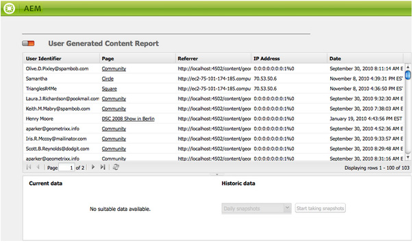

# Informes {#reporting}

Para ayudarle a supervisar y analizar el estado de su instancia, AEM proporciona una selección de informes predeterminados, que se pueden configurar según sus necesidades individuales:

* [Informe de componentes](#component-report)
* [Uso del disco](#disk-usage)
* [Comprobación de estado](#health-check)
* [Informe de actividad de la página](#page-activity-report)
* [Informe de contenido generado por el usuario](#user-generated-content-report)
* [Informe del usuario](#user-report)
* [Informe de instancia de flujo de trabajo](#workflow-instance-report)
* [Informe de flujo de trabajo](#workflow-report)

Se puede acceder a todos los informes desde la consola **Herramientas** . Seleccione **Informes** en el panel izquierdo y luego haga doble clic en el informe requerido en el panel derecho para abrirlo y/o configurarlo.

También se pueden crear nuevas instancias de un informe desde la consola **Herramientas** . **Seleccione** Informes **en el panel izquierdo y, a continuación,** Nuevo... de la barra de herramientas. Defina un **Título** y un **Nombre**, seleccione el tipo de informe que desee y haga clic en **Crear**. La nueva instancia del informe aparecerá en la lista. Haga doble clic en esto para abrirlo y, a continuación, arrastre un componente desde la barra de tareas para crear la primera columna e iniciar la definición del informe.

>[!NOTE]
>
>Además de los informes estándar de AEM disponibles de forma predeterminada, puede [desarrollar sus propios informes](/help/sites-developing/dev-reports.md)(completamente nuevos).

## Conceptos básicos de la personalización de informes {#the-basics-of-report-customization}

Existen diversos formatos de informes disponibles. Los siguientes informes utilizan columnas que se pueden personalizar como se detalla en las siguientes secciones:

* [Informe de componentes](#component-report)
* [Informe de actividad de la página](#page-activity-report)
* [Informe de contenido generado por el usuario](#user-generated-content-report)
* [Informe del usuario](#user-report)
* [Informe de instancia de flujo de trabajo](#workflow-instance-report)

>[!NOTE]
>
>Los siguientes informes tienen su propio formato y personalización:
>
>
>* [La comprobación](#health-check) de estado utiliza campos de selección para especificar los datos sobre los que desea crear un informe.
>* [Uso](#disk-usage) de disco utiliza vínculos para explorar en profundidad la estructura del repositorio.
>* [El informe](/help/sites-administering/reporting.md#workflow-report) Flujo de trabajo proporciona una visión general de los flujos de trabajo que se ejecutan en la instancia.
>
>
Por lo tanto, los siguientes procedimientos para la configuración de columnas no son apropiados. Consulte las descripciones de los informes individuales para obtener detalles.

### Selección y colocación de las columnas de datos {#selecting-and-positioning-the-data-columns}

Las columnas se pueden agregar, cambiar de posición o eliminar de cualquiera de los informes, ya sea estándar o personalizado.

La ficha **Componentes** de la barra de tareas (disponible en la página del informe) enumera todas las categorías de datos que se pueden seleccionar como columnas.

Para cambiar la selección de datos:

* para agregar una nueva columna, arrastre el componente requerido desde la barra de tareas y suéltelo en la posición que desee

   * un visto verde indicará cuándo es válida la posición y un par de flechas indicará exactamente dónde se colocará
   * un símbolo rojo sin ir indica cuando la posición no es válida

* para mover una columna, haga clic en el encabezado, manténgalo presionado y arrastre hasta la nueva posición
* para eliminar una columna, haga clic en el título de la columna, manténgala y arrástrela hacia arriba en el área del encabezado del informe (un símbolo rojo menos indicará que la posición no es válida); suelte el botón del ratón y el cuadro de diálogo Eliminar componentes solicitará confirmación de que realmente desea eliminar la columna.

### Menú desplegable Columna {#column-drop-down-menu}

Cada columna del informe tiene un menú desplegable. Esto se hace visible cuando el cursor del ratón se mueve sobre la celda de título de la columna.

Aparecerá un encabezado de flecha en el extremo derecho de la celda de título (no debe confundirse con el encabezado de flecha inmediatamente a la derecha del texto del título que indica el mecanismo [de ordenación](#sorting-the-data)actual).

Las opciones disponibles en el menú dependerán de la configuración de la columna (como se hizo durante el desarrollo del proyecto), las opciones no válidas se atenuarán.

### Ordenación de los datos {#sorting-the-data}

Los datos se pueden ordenar según una columna específica mediante:

* hacer clic en el encabezado de columna correspondiente; el orden cambiará entre ascendente y descendente, indicado por un encabezado de flecha justo al lado del texto del título
* utilice el menú [desplegable de la](#column-drop-down-menu) columna para seleccionar específicamente **Orden ascendente** u **Orden descendente**; nuevamente esto se indicará con una punta de flecha inmediatamente junto al texto del título

### Grupos y el gráfico de datos actual {#groups-and-the-current-data-chart}

En las columnas correspondientes, puede seleccionar **Agrupar por esta columna** en el menú [desplegable de la](#column-drop-down-menu)columna. Esto agrupará los datos según cada valor definido dentro de esa columna. Puede seleccionar más de una columna para agruparla. La opción aparecerá atenuada cuando los datos de la columna no sean adecuados; Es decir, cada entrada es distinta y única, de modo que no se pueden formar grupos, por ejemplo la columna ID de usuario del informe de usuario.

Después de agrupar al menos una columna, se generará un gráfico circular de datos **** actuales, basado en este grupo. Si se agrupan varias columnas, esto también se indicará en el gráfico.

Si mueve el cursor sobre el gráfico circular, se mostrará el valor agregado del segmento correspondiente. Utiliza el agregado definido actualmente para la columna; por ejemplo, contar, mínimo, promedio, entre otros.

### Filtros y agregados {#filters-and-aggregates}

En las columnas apropiadas también puede configurar Configuración **de** filtro y/o **Agregados** desde el menú [desplegable de la](#column-drop-down-menu)columna.

#### Filtros {#filters}

Configuración de filtro permite especificar los criterios para la visualización de las entradas. Los operadores disponibles son:

* `contains`
* `equals`

Para definir un filtro:

1. Seleccione el operador que desee en la lista desplegable.
1. Introduzca el texto que desea filtrar.
1. Haga clic en **Aplicar**.

Para desactivar el filtro:

1. Elimine el texto del filtro.
1. Haga clic en **Aplicar**.

#### Agregados {#aggregates}

También puede seleccionar un método de agregación (esto puede variar en función de la columna seleccionada):

### Propiedades de columna {#column-properties}

Esta opción solo está disponible cuando se ha utilizado la columna  Genérica en el informe [de usuario](#user-report).

### Datos históricos {#historic-data}

En Datos **** históricos se puede ver un gráfico del cambio en los datos a lo largo del tiempo. Esto se deriva de instantáneas tomadas a intervalos regulares.

Los datos son:

* Recopilada por, si está disponible, la primera columna ordenada; de lo contrario, la primera columna (no agrupada)
* Agrupado por la columna adecuada

El informe se puede generar:

1. Establezca **Agrupación** en la columna requerida.
1. **Edite** la configuración para definir la frecuencia con la que deben realizarse las instantáneas; por hora o por día.
1. **** Finalizar... la definición para iniciar la colección de instantáneas.

   El botón deslizante rojo/verde en la parte superior izquierda indica cuándo se recopilan las instantáneas.

El gráfico resultante se muestra en la parte inferior derecha:

Una vez iniciada la recopilación de datos, puede seleccionar:

* **Período**

   Puede seleccionar entre y hasta las fechas para que se muestren los datos del informe.

* **Intervalo**

   Se puede seleccionar Mes, Semana, Día, Hora para la escala y agregación del informe.

   Por ejemplo, si hay instantáneas diarias disponibles para febrero de 2011:

   * Si el intervalo se establece en `Day`, cada instantánea se muestra como un valor único en el gráfico.
   * Si el intervalo se establece en `Month`, todas las instantáneas de febrero se agregan en un solo valor (se muestran como un solo &quot;punto&quot; en el gráfico).

Seleccione los requisitos y haga clic en **Ir** para aplicarlos al informe. Para actualizar la visualización después de realizar más instantáneas, haga clic de nuevo en **Ir** .

Cuando se recopilan instantáneas, puede:

* **Usar** Fin... para volver a inicializar la colección.

   **Finalizar** &quot;bloquea&quot; la estructura del informe (es decir, las columnas asignadas al informe y que se agrupan, ordenan, filtran, etc.) y comienza a tomar instantáneas.

* Abra el cuadro de diálogo **Editar** para seleccionar **Sin instantáneas** de datos para finalizar la recopilación hasta que sea necesario.

   **Editar** solo activa o desactiva la toma de instantáneas. Si la toma de instantáneas se vuelve a activar, utiliza el estado del informe cuando se terminó por última vez para realizar más instantáneas.

>[!NOTE]
>
>Las instantáneas se almacenan en la `/var/reports/...` parte donde el resto de la ruta refleja la ruta del informe y la ID respectivos creados al finalizar el informe.
>
>
>Las instantáneas antiguas se pueden purgar manualmente si está completamente seguro de que ya no necesita dichas instancias.

>[!NOTE]
>
>Los informes preconfigurados no requieren un alto rendimiento, pero se recomienda utilizar instantáneas diarias en un entorno de producción. Si es posible, ejecute estas instantáneas diarias a una hora del día cuando no haya mucha actividad en el sitio web; esto se puede definir con el `Daily snapshots (repconf.hourofday)` parámetro de Configuración **de informes de** Day CQ; consulte Configuración  OSGI para obtener más información sobre cómo configurarla.

#### Límites de visualización {#display-limits}

El informe de datos históricos también puede cambiar ligeramente de apariencia debido a los límites que se pueden definir, según el número de resultados del período seleccionado.

Cada línea horizontal se conoce como serie (y corresponde a una entrada en la leyenda del gráfico), cada columna vertical de puntos representa las instantáneas agregadas.

Para mantener el gráfico limpio durante períodos de tiempo más largos, se pueden establecer límites. Para los informes estándar, estos son:

* serie horizontal: tanto el valor predeterminado como el máximo del sistema son `9`

* instantáneas agregadas verticales: el valor predeterminado es `35` (por serie horizontal)

De modo que cuando se excedan los límites (adecuados), la variable:

* los puntos no se mostrarán
* la leyenda del gráfico de datos históricos puede mostrar un número diferente de entradas al del gráfico de datos actual

Los informes personalizados también pueden mostrar el valor **total** de todas las series. Se muestra como una serie (línea horizontal y entrada en la leyenda).

>[!NOTE]
>
>Para los informes personalizados, los límites se pueden establecer de forma diferente.

### Edit (Report) {#edit-report}

El botón **Editar** abre el cuadro de diálogo **Editar informe** .

Se trata de una ubicación en la que se define el período para recopilar instantáneas de datos  históricos, pero también se pueden definir otros ajustes:

* **Título**

   Puede definir su propio título.

* **Descripción**

   Puede definir su propia descripción.

* **Ruta** raíz (*solo activa para ciertos informes*)

   Utilícelo para limitar el informe a una (subsección) sección del repositorio.

* **Procesamiento de informes**

   * **datos actualizados automáticamente**

      Los datos del informe se actualizarán cada vez que actualice la definición del informe.

   * **datos actualizados manualmente**

      Esta opción se puede utilizar para evitar demoras causadas por las operaciones de actualización automática cuando hay un gran volumen de datos.

      Si selecciona esta opción, se indica que los datos del informe deben actualizarse manualmente cuando haya cambiado cualquier aspecto de la configuración del informe. También significa que tan pronto como cambie cualquier aspecto de la configuración, la tabla del informe quedará en blanco.

      Cuando se selecciona esta opción, se muestra el botón **[Cargar datos](#load-data)**(junto a **Editar**en el informe).**Cargar datos**cargará los datos y actualizará los datos del informe que se muestran.

* **Instantáneas** Puede definir la frecuencia con la que se deben realizar las instantáneas; diariamente, por hora o no.

### Cargar datos {#load-data}

El botón **Cargar datos** solo está visible cuando se han seleccionado los datos **de actualización** manual en **[Editar](#edit-report)**.

Al hacer clic en **Cargar datos** , se volverán a cargar los datos y se actualizará el informe que se muestra.

Si selecciona actualizar manualmente los datos, significa que:

1. Tan pronto como cambie la configuración del informe, la tabla de datos del informe se dejará en blanco.

   Por ejemplo, si cambia el mecanismo de ordenación de una columna, no se mostrarán los datos.

1. Si desea que los datos del informe se muestren nuevamente, deberá hacer clic en **Cargar datos** para volver a cargar los datos.

### Finish (report) {#finish-report}

Al **finalizar** el informe:

* La definición del informe *a partir de ese momento* se utilizará para tomar las instantáneas (después puede continuar trabajando en una definición del informe ya que luego es independiente de las instantáneas).
* Se quitarán todas las instantáneas existentes.
* Se recopilan nuevas instantáneas para los datos históricos.

Con este cuadro de diálogo puede definir o actualizar su propio título y descripción para el informe resultante.

## Tipos de informes {#report-types}

### Informe de componentes {#component-report}

El informe de componentes proporciona información sobre cómo utiliza los componentes el sitio web.

[Columnas de información](#selecting-and-positioning-the-data-columns) sobre:

* Creación
* Ruta del componente
* Tipo de componente
* Última modificación
* Página

Significa que puede ver, por ejemplo:

* Qué componentes se utilizan donde.

   Resulta útil, por ejemplo, al realizar pruebas.

* Cómo se distribuyen las instancias de un componente específico.

   Esto puede ser interesante si se trata de páginas específicas (p. ej. &quot;páginas pesadas&quot;) están experimentando problemas de rendimiento.

* Identifique las partes del sitio con cambios frecuentes o menos frecuentes.
* Ver cómo se desarrolla el contenido de la página con el paso del tiempo.

Todos los componentes están incluidos, son estándares de producto y específicos de proyecto. Con el cuadro de diálogo **Editar** , el usuario también puede establecer una ruta **** raíz que defina el punto de partida del informe; todos los componentes de esa raíz se consideran para el informe.

 

### Uso del disco {#disk-usage}

El informe de uso del disco muestra información sobre los datos almacenados en el repositorio.

El informe comienza en la raíz ( / ) del repositorio; al hacer clic en una rama en particular puede explorar en profundidad dentro del repositorio (la ruta actual se reflejará en el título del informe).

### Comprobación de estado {#health-check}

Este informe analiza el registro de solicitudes actual:

`<cq-installation-dir>/crx-quickstart/logs/request.log`
para ayudarle a identificar las solicitudes más costosas dentro de un período determinado.

Para generar el informe puede especificar:

* **Periodo (horas)**

   Número de horas (pasadas) que se analizarán.

   Valor predeterminado: `24`

* **max. Resultados**

   Número máximo de líneas de salida.

   Valor predeterminado: `50`

* **max. Solicitudes**

   Número máximo de solicitudes que se analizarán.

   Predeterminado: `-1` (todos)

* **Dirección de correo electrónico**

   Enviar los resultados a una dirección de correo electrónico.

   Opcional;Predeterminado: blank

* **Ejecutar cada día a las (hh:mm)**

   Especifique una hora para que el informe se ejecute automáticamente todos los días.

   Opcional;Predeterminado: blank

### Informe de actividad de la página {#page-activity-report}

El informe de actividad de página enumera las páginas y las acciones realizadas en ellas.

[Columnas de información](#selecting-and-positioning-the-data-columns) sobre:

* Página
* Hora
* Tipo
* Usuario

Significa que puede supervisar:

* Las últimas modificaciones.
* Autores que trabajan en páginas específicas.
* Páginas que no se han modificado recientemente, por lo que puede que sea necesario actuar.
* Páginas que se modifican con mayor o menor frecuencia.
* Usuarios más o menos activos.

El informe de actividad de página toma toda la información del registro de auditoría. De forma predeterminada, la ruta raíz se configura en el registro de auditoría en `/var/audit/com.day.cq.wcm.core.page`.

### Informe de contenido generado por el usuario {#user-generated-content-report}

Este informe proporciona información sobre el contenido generado por el usuario; sean comentarios, valoraciones o foros.

[Columnas de información](#selecting-and-positioning-the-data-columns) sobre:

* Fecha
* Dirección IP
* Página
* Referencia
* Tipo
* Identificador de usuario

Permita:

* Ver las páginas que reciben la mayor cantidad de comentarios.
* Obtenga una visión general de todos los comentarios que los visitantes específicos del sitio están dejando, tal vez los problemas estén relacionados.
* Juzgue si el nuevo contenido está provocando comentarios mediante la supervisión cuando los comentarios se hacen en una página.

### Informe del usuario {#user-report}

Este informe proporciona información sobre todos los usuarios que han registrado una cuenta o un perfil; esto puede incluir tanto a los autores dentro de su organización como a los visitantes externos.

[Columnas de información](#selecting-and-positioning-the-data-columns) (cuando estén disponibles) sobre:

* Edad
* País
* Dominio
* Correo electrónico
* Apellido
* Sexo
* [Genérico](#generic-column)
* Nombre de pila
* Información
* Interés
* Idioma
* Código Hash NTLM
* ID de usuario

Permita:

* Ver la distribución demográfica de los usuarios.
* Informe de los campos personalizados que ha agregado a los perfiles.

#### Generic Column {#generic-column}

La columna **Genérica** está disponible en el informe de usuario para que pueda acceder a información personalizada, generalmente desde los perfiles [de](/help/sites-administering/identity-management.md#profiles-and-user-accounts)usuario; por ejemplo, Color [favorito tal como se detalla en Adición de campos a la definición](/help/sites-administering/identity-management.md#adding-fields-to-the-profile-definition)de perfil.

El cuadro de diálogo Columna genérica se abrirá cuando:

* Arrastre el componente Genérico de la barra de tareas al informe.
* Seleccione las Propiedades de columna de una columna genérica existente.

From the **Definitions** tab you can define:

* **Título**

   Su propio título para la columna genérica.

* **Propiedad**

   El nombre de la propiedad tal como se almacena en el repositorio, normalmente dentro del perfil del usuario.

* **Ruta**

   Normalmente, la propiedad se toma del `profile`.

* **Tipo**

   Seleccione el tipo de campo desde `String`, `Number`, `Integer`, `Date`.

* **Agregado predeterminado**

   Esto define el agregado utilizado de forma predeterminada si la columna está desagrupada en un informe con al menos una columna agrupada. Seleccione el agregado requerido desde `Count`, `Minimum`, `Average`, `Maximum`, `Sum`.

   Por ejemplo, *Contar* para un `String` campo significa que se muestra el número de `String` valores distintos para la columna en el estado agregado.

En la ficha **Ampliado** también puede definir los agregados y filtros disponibles:

### Informe de instancia de flujo de trabajo {#workflow-instance-report}

Esto le proporciona una descripción general concisa, que proporciona información sobre las instancias individuales de los flujos de trabajo, tanto en ejecución como finalizada.

[Columnas de información](#selecting-and-positioning-the-data-columns) sobre:

* Completado
* Duración
* Iniciador
* Modelo
* Carga útil
* Iniciado
* Estado

Significa que puede:

* Supervisar la duración media de los flujos de trabajo; si esto sucede con regularidad, puede resaltar problemas con el flujo de trabajo.

### Informe de flujo de trabajo {#workflow-report}

Esto proporciona estadísticas clave sobre los flujos de trabajo que se ejecutan en la instancia.

## Uso de informes en un entorno de publicación {#using-reports-in-a-publish-environment}

Una vez configurados los informes según sus requisitos específicos, puede activarlos para transferir la configuración al entorno de publicación.

>[!CAUTION]
>
>Si desea datos **** históricos para el entorno de publicación, **finalice** el informe en el entorno de creación antes de activar la página.

A continuación, se podrá acceder al informe correspondiente en

`/etc/reports`

Por ejemplo: el informe Contenido generado por el usuario se encuentra en:

`http://localhost:4503/etc/reports/ugcreport.html`

Ahora se informará de los datos recopilados del entorno de publicación.

Como no se permite ninguna configuración de informe en el entorno de publicación, los botones **Editar** y **Finalizar** no están disponibles. Sin embargo, si se recopilan instantáneas, puede seleccionar el **período** y el **intervalo** para los informes de datos **** históricos.

>[!CAUTION]
>
>El acceso a estos informes puede ser un problema de seguridad; por lo tanto, le recomendamos que configure el despachante para que no `/etc/reports` esté disponible para los visitantes externos. Consulte la lista de comprobación [de seguridad](security-checklist.md) para obtener más información.

## Permisos necesarios para ejecutar informes {#permissions-needed-for-running-reports}

Los permisos necesarios dependen de la acción:

* Los datos del informe se recopilan básicamente con los privilegios del usuario actual.
* Los datos históricos se recopilan con los privilegios del usuario que finalizó el informe.

En una instalación estándar de AEM, los siguientes permisos están preestablecidos para los informes:

* **Informe del usuario**

   `user administrators` - leer y escribir

* **Informe de actividad de la página**

   `contributors` - leer y escribir

* **Informe de componentes**

   `contributors` - leer y escribir

* **Informe de contenido generado por el usuario**

   `contributors` - leer y escribir

* **Informe de instancia de flujo de trabajo**

   `workflow-users` - leer y escribir

Todos los miembros del `administrators` grupo tienen los derechos necesarios para crear nuevos informes.
