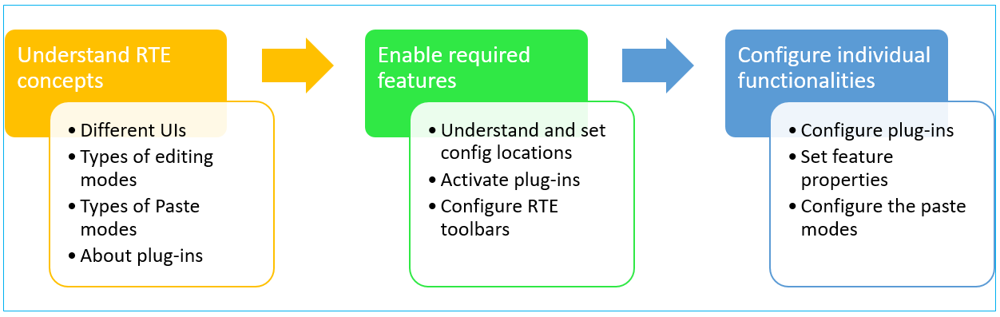

# Configurar el Editor de texto enriquecido {#configure-the-rich-text-editor}

El editor de texto enriquecido (RTE) ofrece a los autores una amplia gama de funciones para editar su contenido de texto. Se proporcionan iconos, cuadros de selección, barras de herramientas y menús para una experiencia de edición de texto WYSIWYG.

Para obtener información sobre cómo utilizar las funciones RTE para la creación, consulte [Uso del editor de texto enriquecido para la creación](/help/sites-authoring/rich-text-editor.md). RTE se puede configurar para habilitar, deshabilitar y ampliar las funciones disponibles en los componentes de creación. El flujo de trabajo siguiente ilustra el orden recomendado para completar las tareas de configuración RTE en Experience Manager.



*Figura: Secuencia de pasos para aprender a configurar RTE*

## Comprender la IU táctil y la IU clásica {#understand-touch-enabled-ui-and-classic-ui}

La IU táctil es la interfaz de usuario estándar para Experience Manager. Adobe ha introducido la IU táctil con [diseño interactivo](/help/sites-authoring/responsive-layout.md) para el entorno de creación. La IU táctil está diseñada para dispositivos táctiles y de escritorio. La interfaz difiere considerablemente de la IU clásica original.


*Figura: Barra de herramientas del Editor de texto enriquecido en la IU táctil*


*Figura: Barra de herramientas del Editor de texto enriquecido en la IU clásica*

>[!MORELIKETHIS]
>
>* [Recomendaciones de la interfaz de usuario](/help/sites-deploying/ui-recommendations.md)
>* Acerca de la desaprobación de la IU clásica, consulte [notas de la versión de Experience Manager 6.5](/help/release-notes/deprecated-removed-features.md)
>* Para ver la diferencia entre las IU, consulte [IU táctil y IU clásica](https://aemcq5pedia.wordpress.com/2018/01/05/touch-enabled-ui-aem6-3/)
>* Para comprender la IU táctil en detalle, consulte [Conceptos de la IU táctil Experience Manager](/help/sites-developing/touch-ui-concepts.md)


## Varios modos de edición {#editingmodes}

Los autores pueden crear y editar contenido textual en Experience Manager mediante los distintos modos de componentes. Las opciones de la barra de herramientas para crear y dar formato al contenido y la experiencia del usuario de los componentes habilitados para RTE en diferentes modos de edición varían según las configuraciones de RTE.

| Modo de edición | Área de edición | Funciones recomendadas para habilitarlas | IU táctil | IU clásica |
|--- |--- |--- |--- |--- |
| En línea | Edición in situ para ediciones rápidas y secundarias; Formato sin abrir un cuadro de diálogo | Características mínimas de RTE | Y | Y |
| RTE pantalla completa | Abarca toda la página | Todas las funciones RTE necesarias | Y | N |
| Cuadro de diálogo | Cuadro de diálogo en la parte superior del contenido de la página pero no cubre toda la página | Todas las funciones RTE necesarias en la IU clásica; activar correctamente las funciones en la IU táctil | Y | Y |
| Pantalla completa del cuadro de diálogo | Igual que el modo de pantalla completa; contiene campos del cuadro de diálogo junto con RTE | Todas las funciones RTE necesarias | Y | N |

>[!NOTE]
>
>La función de edición de origen no está disponible en el modo de edición en línea en la IU táctil. No puede arrastrar imágenes en el modo de pantalla completa. Todas las demás funciones funcionan en todos los modos.

### Edición en línea {#inline-editing}

Cuando se abre (con un doble o clic lento), el contenido se puede editar dentro de la página. Se presenta una barra de herramientas compacta con opciones muy básicas.


*Figura: Edición en línea con la barra de herramientas básica en la IU táctil*

En la IU clásica, un doble lento con clic en el componente permite la edición en línea y un contorno naranja resalta el contenido. Si Content Finder está abierto, se muestra una barra de herramientas con las opciones de formato RTE disponibles en la parte superior de la ventana. Si Content Finder no está abierto, las opciones de formato no se muestran y solo puede realizar ediciones básicas de texto.

### Edición de pantalla completa {#full-screen-editing}

Los componentes de Experience Manager se pueden abrir en vista de pantalla completa que oculta el contenido de la página y ocupa la pantalla disponible. Considere la posibilidad de editar en pantalla completa una versión detallada de la edición en línea, ya que oferta la mayoría de las opciones de edición. Se puede abrir haciendo clic en , desde la barra de herramientas compacta cuando se utiliza el modo de edición en línea.

En el modo de pantalla completa del cuadro de diálogo, junto con una barra de herramientas RTE detallada, también están disponibles las opciones y los componentes disponibles en un cuadro de diálogo. Solo se aplica a un cuadro de diálogo que contenga RTE junto con otros componentes.


*Figura: Barra de herramientas RTE detallada al editar en modo de pantalla completa en la IU táctil*

### Edición de cuadro de diálogo {#dialog-editing}

Cuando se hace clic en un componente mediante doble, se abre un cuadro de diálogo para editar el contenido. El cuadro de diálogo se abre sobre la página existente. En algunos casos específicos, el cuadro de diálogo se abre como una ventana emergente. Por ejemplo, cuando un componente Texto forma parte de una columna en un diseño de página con varias columnas y el área disponible para el cuadro de diálogo es menor.


*Figura: Modo de edición de cuadro de diálogo en la IU táctil*


*Figura: Cuadro de diálogo en la IU clásica que contiene una barra de herramientas detallada para la edición*

## Acerca de los complementos RTE y las características asociadas {#aboutplugins}

La funcionalidad está disponible mediante una serie de complementos, cada uno con:

* Una propiedad `features`:

   * Se utiliza para activar o desactivar la funcionalidad básica de ese complemento
   * Esto se puede configurar mediante un procedimiento estandarizado

* Cuando proceda, propiedades y opciones adicionales que requieran una configuración especializada.

Las funciones básicas de RTE se activan o desactivan por el valor de la propiedad `features` en un nodo específico del complemento adecuado.

La siguiente tabla lista los complementos actuales y muestra:

* ID de complementos con un vínculo a la documentación de API. El ID se utiliza como nombre de nodo cuando [activa un complemento](/help/sites-administering/configure-rich-text-editor-plug-ins.md#activateplugin).
* Valores permitidos para la propiedad `features`.
* Descripción de la funcionalidad proporcionada por el complemento.

| ID del complemento | características | Descripción |
|--- |--- |--- |
| editar | cortar copiar pegar-predeterminado pegar-plaintext pegar-wordhtml | [Cortar, copiar y pegar los tres modos](/help/sites-administering/configure-rich-text-editor-plug-ins.md#textstyles). |
| [findreplace](https://helpx.adobe.com/experience-manager/6-5/sites/developing/using/reference-materials/widgets-api/index.html?class=CQ.form.rte.plugins.FindReplacePlugin) | buscar reemplazar | Buscar y reemplazar. |
| [format](https://helpx.adobe.com/experience-manager/6-5/sites/developing/using/reference-materials/widgets-api/index.html?class=CQ.form.rte.plugins.FormatPlugin) | subrayado en cursiva negrita | [Formato](/help/sites-administering/configure-rich-text-editor-plug-ins.md#textstyles) de texto básico. |
| [image](https://helpx.adobe.com/experience-manager/6-5/sites/developing/using/reference-materials/widgets-api/index.html?class=CQ.form.rte.plugins.ImagePlugin) | image | Compatibilidad básica con imágenes (arrastre desde el contenido o desde el buscador de contenido). Según el explorador, la compatibilidad con los autores tiene comportamientos diferentes |
| [claves](https://helpx.adobe.com/experience-manager/6-5/sites/developing/using/reference-materials/widgets-api/index.html?class=CQ.form.rte.plugins.KeyPlugin) |  | Para definir este valor, consulte [tamaño de ficha](/help/sites-administering/configure-rich-text-editor-plug-ins.md#tabsize). |
| [justify](https://helpx.adobe.com/experience-manager/6-5/sites/developing/using/reference-materials/widgets-api/index.html?class=CQ.form.rte.plugins.JustifyPlugin) | justifyleft justificfycenter | Alineación de párrafo. |
| [vínculos](https://helpx.adobe.com/experience-manager/6-5/sites/developing/using/reference-materials/widgets-api/index.html?class=CQ.form.rte.plugins.LinkPlugin) | modifylink desvincular anclaje | [Hipervínculos y anclajes](/help/sites-administering/configure-rich-text-editor-plug-ins.md#linkstyles). |
| [listas](https://helpx.adobe.com/experience-manager/6-5/sites/developing/using/reference-materials/widgets-api/index.html?class=CQ.form.rte.plugins.ListPlugin) | sangría sin ordenar anulada | Este complemento controla tanto la [sangría como las listas](/help/sites-administering/configure-rich-text-editor-plug-ins.md#indentmargin); incluyendo listas anidadas. |
| [misctools](https://helpx.adobe.com/experience-manager/6-5/sites/developing/using/reference-materials/widgets-api/index.html?class=CQ.form.rte.plugins.MiscToolsPlugin) | specialchars sourceedit | Varias herramientas permiten a los autores introducir [caracteres especiales](/help/sites-administering/configure-rich-text-editor-plug-ins.md#spchar) o editar el origen HTML. Además, puede agregar un [rango completo de caracteres especiales](/help/sites-administering/configure-rich-text-editor-plug-ins.md#definerangechar) si desea definir su propia lista. |
| Paraformat | parformat | Los formatos de párrafo predeterminados son Párrafo, Encabezado 1, Encabezado 2 y Encabezado 3 (`<p>`, `<h1>`, `<h2>` y `<h3>`). Puede [agregar más formatos de párrafo](/help/sites-administering/configure-rich-text-editor-plug-ins.md#paraformats) o extender la lista. |
| spellcheck | texto de comprobación | [Corrector ortográfico](/help/sites-administering/configure-rich-text-editor-plug-ins.md#adddict) con conocimiento del idioma. |
| estilos | estilos | Compatibilidad con estilos mediante una clase CSS. [Añada un nuevo ](/help/sites-administering/configure-rich-text-editor-plug-ins.md#textstyles) estilo de texto si desea agregar (o ampliar) su propia gama de estilos para utilizarlo con texto. |
| subsuperíndice | superíndice de subíndice | Extensiones a los formatos básicos, agregando sub-y-super-script. |
| tabla | tabla insertar quitable quitar insertar columna removercolumna propiedades de celda mergecells separtcelda seleccionar selectfilas seleccionar columnas | Consulte [configuración de estilos de tabla](/help/sites-administering/configure-rich-text-editor-plug-ins.md#tablestyles) si desea agregar sus propios estilos para tablas enteras o celdas individuales. |
| deshacer | deshacer rehacer | Tamaño de historial de operaciones [deshacer y rehacer](/help/sites-administering/configure-rich-text-editor-plug-ins.md#undohistory). |

>[!NOTE]
>
>El complemento de pantalla completa no es compatible con el modo de cuadro de diálogo. Utilice la configuración `dialogFullScreen` para configurar la barra de herramientas para el modo de pantalla completa.

## Comprenda las rutas y ubicaciones de configuración {#understand-the-configuration-paths-and-locations}

El modo [de edición de RTE (y la IU)](#editingmodes) que proporciona a los autores decide la ubicación de los detalles de configuración cuando [activa los complementos de RTE](/help/sites-administering/configure-rich-text-editor-plug-ins.md#activateplugin):

| Modo de edición | Ubicación para la IU táctil | Ubicación para la IU clásica |
|---|---|---|
| En línea | `cq:editConfig/cq:inplaceEditing` | `cq:editConfig/cq:inplaceEditing` |
| Pantalla completa | `cq:editConfig/cq:inplaceEditing` | No aplicable |
| Cuadro de diálogo | `cq:dialog` | `dialog` |
| Cuadro de diálogo de pantalla completa | `cq:dialog` | No aplicable |

>[!NOTE]
>
>No asigne un nombre al nodo en `cq:inplaceEditing` como `config`. En el nodo `cq:inplaceEditing`, defina las siguientes propiedades:
>* **Nombre**: `configPath`
>* **Tipo**: `String`
>* **Valor**: ruta del nodo que contiene la configuración real

>
>
No asigne un nombre al nodo de configuración RTE como `config`. De lo contrario, las configuraciones de RTE surtirán efecto únicamente para los administradores y no para los usuarios del grupo `content-author`.

Configure las siguientes propiedades que se aplican en el modo de edición de cuadro de diálogo solo en la IU táctil:

* `useFixedInlineToolbar`:: Establezca esta propiedad booleana definida en el nodo RTE (uno con sling:resourceType=  `cq/gui/components/authoring/dialog/richtext`) en  `True`, para que la barra de herramientas RTE sea fija en lugar de flotante.

   Cuando esta propiedad es verdadera, la edición de Richtext se inicia, de forma predeterminada, en el evento &quot;foundation-contentloaded&quot;.

   Para evitarlo, establezca la propiedad `customStart` en `True`y déclencheur el evento &#39;rte-inicio&#39; en la edición RTE de inicio. Cuando esta propiedad es &#39;true&#39;, el comportamiento predeterminado, inicio de velocidad al hacer clic, no funciona.

* `customStart`:: Establezca esta propiedad booleana definida en el nodo RTE en  `True`, para controlar cuándo se debe activar el inicio RTE activando el evento  `rte-start`.

* `rte-start`:: Déclencheur este evento en el  `contenteditable-div` editor de texto enriquecido, cuándo editar el inicio RTE. Esto solo funciona si `customStart` se ha establecido en true.

Cuando se utiliza RTE en el cuadro de diálogo táctil, es obligatorio establecer la propiedad `useFixedInlineToolbar` en true para evitar problemas.

## Personalización de la edición in situ {#customizing-in-place-editing}

Puede definir en qué selector HTML inicio el editor de texto configurando las siguientes propiedades:

* **`editElementQuery`** - Definida en  `cq:InplaceEditingConfig`, esta propiedad se utiliza para especificar un selector del elemento HTML en el que se iniciará la edición en línea del componente de texto. Si no se especifica, la edición en línea se inicia directamente en el HTML del componente de texto.
* **`textPropertyName`** - Definida en  `cq:InplaceEditingConfig`, esta propiedad se utiliza para especificar el nombre de la propiedad que se guardará en el nodo de contenido donde el valor HTML del componente de texto se mantendrá tras la edición en línea.

La propiedad correspondiente para el modo de diálogo es `name`.

## Habilitar las funcionalidades RTE mediante la activación de complementos {#enable-rte-functionalities-by-activating-plug-ins}

Las funcionalidades RTE están disponibles a través de una serie de complementos, cada uno con propiedad de características. Puede configurar la propiedad features para habilitar o deshabilitar las diversas características de cada complemento.

Para obtener configuraciones detalladas de los complementos RTE, consulte [cómo activar y configurar los complementos RTE](/help/sites-administering/configure-rich-text-editor-plug-ins.md).

**Ejemplo**: Descargue  [esta ](/help/sites-administering/assets/rte-sample-all-features-enabled-10.zip) configuración de muestra que ilustra cómo configurar RTE. En este paquete todas las funciones están habilitadas.

>[!NOTE]
>
>El [componente de texto Componentes principales](https://docs.adobe.com/content/help/en/experience-manager-core-components/using/components/text.html#the-text-component-and-the-rich-text-editor) permite a los editores de plantillas configurar muchos complementos RTE en una GUI como políticas de contenido, eliminando así la necesidad de una configuración técnica. Las políticas de contenido pueden funcionar con las configuraciones de la interfaz de usuario de RTE como se describe en este documento.
>
>Para obtener más información, consulte la sección [Configuración de la interfaz de usuario de RTE y políticas de contenido](/help/sites-administering/rich-text-editor.md) de este documento, así como [Creación de plantillas de página](/help/sites-authoring/templates.md) y la [documentación para desarrolladores de componentes principales](https://docs.adobe.com/content/help/en/experience-manager-core-components/using/developing/developing.html).

>[!NOTE]
>
>Para fines de referencia, los componentes de texto predeterminados (entregados como parte de una instalación estándar) se encuentran en:
>
>* `/libs/wcm/foundation/components/text`
>* `/libs/foundation/components/text`

>
>
Para crear su propio componente de texto, copie el componente anterior en lugar de editar estos componentes.

## Configurar la barra de herramientas RTE {#dialogfullscreen}

AEM le permite configurar la interfaz para el Editor de texto enriquecido de forma diferente para los distintos modos de edición. A continuación se proporciona la configuración predeterminada. Puede anular estos valores predeterminados según sus necesidades. Solo puede personalizar las funciones de la barra de herramientas que desea proporcionar a los autores. No es necesario especificar todas las configuraciones de la barra de herramientas.

Para configurar la barra de herramientas para `dialogFullScreen`, utilice la siguiente configuración de ejemplo.

```java
<uiSettings jcr:primaryType="nt:unstructured">
  <cui jcr:primaryType="nt:unstructured">
    <inline
      jcr:primaryType="nt:unstructured"
      toolbar="[format#bold,format#italic,format#underline,#justify,#lists,links#modifylink,links#unlink,#paraformat]">
      <popovers jcr:primaryType="nt:unstructured">
        <justify
          jcr:primaryType="nt:unstructured"
          items="[justify#justifyleft,justify#justifycenter,justify#justifyright,justify#justifyjustify]"
          ref="justify"/>
        <lists
          jcr:primaryType="nt:unstructured"
          items="[lists#unordered,lists#ordered,lists#outdent,lists#indent]"
          ref="lists"/>
        <paraformat
          jcr:primaryType="nt:unstructured"
          items="paraformat:getFormats:paraformat-pulldown"
          ref="paraformat"/>
      </popovers>
    </inline>
    <dialogFullScreen
      jcr:primaryType="nt:unstructured"
      toolbar="[format#bold,format#italic,format#underline,justify#justifyleft,justify#justifycenter,justify#justifyright,justify#justifyjustify,lists#unordered,lists#ordered,lists#outdent,lists#indent,links#modifylink,links#unlink,table#createoredit,#paraformat,image#imageProps]">
      <popovers jcr:primaryType="nt:unstructured">
        <paraformat
          jcr:primaryType="nt:unstructured"
          items="paraformat:getFormats:paraformat-pulldown"
          ref="paraformat"/>
      </popovers>
    </dialogFullScreen>
    <tableEditOptions
      jcr:primaryType="nt:unstructured"
      toolbar="[table#insertcolumn-before,table#insertcolumn-after,table#removecolumn,-,table#insertrow-before,table#insertrow-after,table#removerow,-,table#mergecells-right,table#mergecells-down,table#mergecells,table#splitcell-horizontal,table#splitcell-vertical,-,table#selectrow,table#selectcolumn,-,table#ensureparagraph,-,table#modifytableandcell,table#removetable,-,undo#undo,undo#redo,-,table#exitTableEditing,-]">
    </tableEditOptions>
  </cui>
</uiSettings>
```

Para el modo en línea y el modo de pantalla completa se utilizan diferentes ajustes de IU. La propiedad toolbar se utiliza para especificar los botones de la barra de herramientas.

Por ejemplo, si el botón es en sí mismo una característica (por ejemplo, `Bold`), se especifica como `PluginName#FeatureName` (por ejemplo, `links#modifylink`).

Si el botón es una ventana emergente (que contiene algunas características de un complemento), se especifica como `#PluginName` (por ejemplo, `#format`).

Los separadores (`|`) entre un grupo de botones se pueden especificar con `-`.

El nodo emergente en el modo en línea o en pantalla completa contiene una lista de las ventanas emergentes que se utilizan. Cada nodo secundario bajo el nodo &#39;povers&#39; recibe el nombre del complemento (por ejemplo, format). Tiene una propiedad &#39;items&#39; que contiene una lista de características del complemento (por ejemplo, format#bold).

## Configuración de la interfaz de usuario RTE y directivas de contenido {#rtecontentpolicies}

Los administradores pueden controlar las opciones de RTE mediante políticas de contenido, por ejemplo, en lugar de realizar la configuración como se ha descrito anteriormente. Las políticas de contenido definen las propiedades de diseño de un componente cuando se utilizan como parte de una [plantilla editable](/help/sites-authoring/templates.md). Por ejemplo, si se utiliza un componente de texto que utiliza RTE con una plantilla editable, la política de contenido puede definir que la opción de negrita esté disponible y que haya algunas opciones de formato de párrafo disponibles. Las políticas de contenido son reutilizables y se pueden aplicar en varias plantillas.

Las opciones disponibles en el flujo RTE desde las configuraciones de la interfaz de usuario hasta las políticas de contenido.

* La configuración de la interfaz de usuario define las opciones disponibles para las directivas de contenido.
* Si la configuración de la interfaz de usuario de RTE se elimina o no activa un elemento, la directiva de contenido no puede configurarlo.
* Un autor solo tiene acceso a la funcionalidad que están disponibles en las configuraciones de la interfaz de usuario y en las políticas de contenido.

A modo de ejemplo, puede ver la [documentación de componentes principales de texto](https://docs.adobe.com/help/en/experience-manager-core-components/using/components/text.html#the-text-component-and-the-rich-text-editor).

## Personalización de la asignación entre los iconos y los comandos de la barra de herramientas {#iconstoolbar}

Puede personalizar la asignación entre los iconos de Coral que se muestran en la barra de herramientas de RTE y los comandos disponibles. No puede utilizar ningún otro icono aparte de los iconos de Coral.

1. Cree un nodo denominado `icons` en `uiSettings/cui`.

1. Cree nodos para iconos individuales debajo de él.
1. En cada uno de los nodos de icono individuales, especifique un icono de Coral y un comando para asignarlo al icono.

A continuación se muestra un fragmento de ejemplo para asignar el comando Negrita al icono Coral denominado `textItalic`.

```java
<text jcr:primaryType="nt:unstructured" sling:resourceType="cq/gui/components/authoring/dialog/richtext" name="./text" useFixedInlineToolbar="{Boolean}true">
    <rtePlugins jcr:primaryType="nt:unstructured">
        <format jcr:primaryType="nt:unstructured" features="bold,italic"/>
    </rtePlugins>
    <uiSettings jcr:primaryType="nt:unstructured">
        <cui jcr:primaryType="nt:unstructured">
            <inline jcr:primaryType="nt:unstructured"
                toolbar="[format#bold,format#italic,format#underline,links#modifylink,links#unlink]">
            </inline>
            <icons jcr:primaryType="nt:unstructured">
                <bold jcr:primaryType="nt:unstructured"
                    command="format#bold"
                    icon="textItalic"/>
            </icons>
        </cui>
    </uiSettings>
</text>
```

## Cambiar al editor de texto enriquecido CoralUI 2 {#switch-to-coralui-rich-text-editor}

En una página, puede incluir la clientlib CoralUI 2 RTE o la clientlib CoralUI 3 RTE. De forma predeterminada, el Editor de texto enriquecido incluye la clientlib CoralUI 3 RTE. Para cambiar a CoralUI 2 RTE, realice los siguientes pasos.

>[!NOTE]
>
>Adobe no lo recomienda como práctica recomendada. Cambie a CoralUI 2 RTE como último recurso. Los complementos personalizados para CoralUI 2 RTE funcionan con CoralUI 3 RTE si los complementos no dependen de elementos internos RTE, como clases.
>
>Si utiliza complementos personalizados para CoralUI3 RTE, utilice la biblioteca `rte.coralui3`.


1. Superponga el nodo `/libs/cq/gui/components/authoring/editors/clientlibs/core` en `/apps` y haga lo siguiente:

   * Reemplace `rte.coralui3` por `rte.coralui2` para la propiedad dependencias.
   * Reemplace `cq.authoring.editor.core.inlineediting.rte.coralui3` por `cq.authoring.editor.core.inlineediting.rte.coralui2` para la propiedad embed.
   * Reemplace `cq.authoring.rte.coralui3` por `cq.authoring.rte.coralui2` para la propiedad embed.

1. Superponga los nodos `/libs/cq/gui/components/authoring/dialog/richtext/clientlibs/rte/coralui3` y `/libs/cq/gui/components/authoring/dialog/richtext/clientlibs/rte/coralui2` en `/apps`.

   Quite la categoría `cq.authoring.dialog` de `/apps/cq/gui/components/authoring/dialog/richtext/clientlibs/rte/coralui3` y agréguela a `/apps/cq/gui/components/authoring/dialog/richtext/clientlibs/rte/coralui2`.

1. Cambie cualquier otra dependencia que se incluya en la página de `rte.coralui3` a `rte.coralui2`. Por ejemplo, después de superponer el nodo `/libs/mcm/campaign/components/touch-ui/clientlibs/rte` en `/apps`, cambie cualquier dependencia de él de `rte.coralui3` a `rte.coralui2`.

1. Superponga el nodo `cq/ui/widgets` en `/apps`. Reemplace la dependencia `cq.rte` en el nodo `/apps/cq/ui/widgets` por `cq.coralui2.rte`.

>[!NOTE]
>
>CoralUI 2 RTE utiliza plantillas de controladores para los cuadros de diálogo de complementos. Por lo tanto, la clientlib CoralUI 2 RTE dependía de la clientlib de controladores. CoralUI 3 RTE no utiliza plantillas de controladores y no tiene ninguna dependencia asociada. Si los complementos personalizados utilizan plantillas de controladores, incluya la clientlib de controladores en la página web.

## Información adicional {#further-information}

Para obtener más información sobre la configuración de RTE, consulte la referencia [API de utilidades de AEM](https://helpx.adobe.com/experience-manager/6-5/sites/developing/using/reference-materials/widgets-api/index.html?class=CQ.form.RichText).

En particular, para ver los complementos y las opciones relacionadas disponibles:

* El componente [CQ.form.RichText](https://helpx.adobe.com/experience-manager/6-5/sites/developing/using/reference-materials/widgets-api/index.html?class=CQ.form.rte.plugins.Plugin) proporciona un campo de formulario para editar información de texto con estilo (texto enriquecido). Para conocer todos los parámetros disponibles para el formulario de texto enriquecido, consulte Opciones de configuración.
* El componente RichText proporciona una amplia gama de funcionalidades mediante complementos que se enumeran en [CQ.form.rte.plugins.Plugin](https://helpx.adobe.com/experience-manager/6-5/sites/developing/using/reference-materials/widgets-api/index.html?class=CQ.form.rte.plugins.Plugin). Para cada complemento:

   * consulte las Funciones para obtener detalles sobre la funcionalidad que se puede habilitar (o deshabilitar)
   * Consulte las Opciones de configuración para ver todos los parámetros disponibles para la configuración detallada del complemento apropiado

* También hay disponible más información sobre las reglas HTML para los vínculos.

Se pueden usar para ampliar y personalizar su propio RTE. Por ejemplo, para lista de los anclajes disponibles en la página al crear un vínculo, puede proporcionar su propia implementación de `LinkPlugin`.

## Limitaciones conocidas {#known-limitations}

AEM capacidad RTE tiene las siguientes limitaciones:

* Las capacidades de RTE solo se admiten en los cuadros de diálogo de AEM componentes. RTE no se admite en asistentes o formularios de base como [Propiedades de página](/help/sites-developing/page-properties-views.md) y [Andamiaje](/help/sites-authoring/scaffolding.md) en la IU táctil.

* AEM no funciona en [dispositivos híbridos](/help/release-notes/known-issues.md).

* No asigne un nombre al nodo de configuración RTE `config`. De lo contrario, la configuración RTE solo se aplica a los administradores y no a los usuarios del grupo `content-author`.

* RTE no admite iframe o iframe en línea para incrustar contenido.

## Prácticas recomendadas y sugerencias {#best-practices-and-tips}

* Habilite solo los complementos sin ventanas emergentes para un cuadro de diálogo flotante. Los complementos sin ventanas emergentes tienen un tamaño menor y son más adecuados para un cuadro de diálogo flotante.
* Habilite los complementos con ventanas emergentes más grandes, como el complemento `Paste`, solo en el modo de cuadro de diálogo a pantalla completa o en el modo de pantalla completa. Los complementos con ventanas emergentes de gran tamaño necesitan más espacio de pantalla para ofrecer una buena experiencia de creación.
* Si utiliza complementos personalizados para CoralUI3 RTE, utilice la biblioteca `rte.coralui3`.

## Solucionar problemas frecuentes con RTE {#troubleshoot-issues-with-aem-rich-text-editor}

**¿Cómo seleccionar varias celdas de tabla?**

Para seleccionar varias celdas en una tabla, presione la tecla `Ctrl` o `Cmd` y luego haga clic en las celdas de la tabla una por una.

A continuación, realice una operación en la selección, por ejemplo, establecer las propiedades de las celdas seleccionadas.

**Los hipervínculos se pierden al editar un componente mediante el botón Configurar**

Añada un hipervínculo en un componente de texto editándolo mediante el botón Configurar. Puede perder el hipervínculo cuando lo edite de nuevo y lo valide por segunda vez.

Una solución consiste en hacer clic en el componente de texto cuando el cuadro de diálogo de edición se muestre por segunda vez y, a continuación, ejecutar la validación del vínculo.

Este problema se resuelve en AEM 6.3 y posterior.

**Se pierde el contenido HTML añadido en el modo de edición de código fuente**

No agregue un HTML propenso a XSS. AEM, y no RTE, puede eliminar contenido HTML para cumplir las reglas de antisamía XSS.

Para comprobar que el HTML pegado se ha guardado, compruebe el contenido guardado en CRXDE (en el nodo de contenido).

Si no se guarda, RTE debe haber quitado el HTML, ya que no se ajustaba a las reglas de RTE.

Si se guarda en CRXDE pero no se procesa en la página (para comprobar el procesamiento, consulte la [previsualización](/help/sites-authoring/editing-content.md#preview-mode) de la página, se elimina con AEM reglas XSS.

**El componente multicampo no funciona correctamente**

Para crear un componente de varios campos, utilice CoralUI 3 exclusivamente. No utilice cuadros de diálogo de componentes CoralUI 2.

Además, compruebe que el código de implementación de varios campos y la estructura de nodos sean correctos.

**La configuración disponible para los administradores no está disponible para los autores**

Si las actualizaciones de las configuraciones de interfaz se reflejan para los administradores pero no para las cuentas de creación, asegúrese de que el nodo de configuración no se llame `config`. Utilice la propiedad [`configPath`](/help/sites-developing/components-basics.md#cq-inplaceediting).

>[!MORELIKETHIS]
>
>* [Configuración de complementos RTE](configure-rich-text-editor-plug-ins.md)
>* [Usar editor de texto enriquecido para la creación](../sites-authoring/rich-text-editor.md)
>* [Configurar RTE para sitios accesibles](rte-accessible-content.md)
>* [Paridad de funciones de IU táctil y de IU clásica](../release-notes/touch-ui-features-status.md)
>* [Ejemplo de tutorial para crear un componente de varios campos compuesto](https://experience-aem.blogspot.com/2019/05/aem-65-touchui-composite-multifield-with-coral3-rte-rich-text.html)

