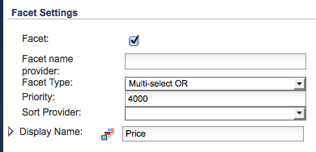

# COMMERCE CLOUD SAP{#sap-commerce-cloud}

Después de la instalación, puede configurar la instancia:

1. [Configure la búsqueda con facetas de Geometrixx Outdoors](#configure-the-facetted-search-for-geometrixx-outdoors).
1. [Configure la versión](#configure-the-catalog-version) del catálogo.
1. [Configure la estructura](#configure-the-import-structure) de importación.
1. [Configure los atributos de producto que se cargarán](#configure-the-product-attributes-to-load).
1. [Importación de datos](#importing-the-product-data) de producto.
1. [Configure el importador](#configure-the-catalog-importer) de catálogos.
1. Use el importador [para importar el catálogo](#catalog-import) en una ubicación específica de AEM.

## Configurar la búsqueda con facetas de Geometrixx Outdoors {#configure-the-facetted-search-for-geometrixx-outdoors}

>[!NOTE]
>
>Esto no es necesario para hybris 5.3.0.1 y versiones posteriores.

1. En el explorador, navegue a la **consola de administración de híbris** en:

   [http://localhost:9001/hmc/hybris](http://localhost:9001/hmc/hybris)

1. En la barra lateral, seleccione **Sistema**, luego **Búsqueda de facetas** y luego **Configuración de búsqueda de facetas**.
1. **Abra** Editorpara la Configuración de  **ejemplo de sol para el catálogo de telas**.

1. En **Catalog versions** use **Añadir la versión del catálogo** para agregar `outdoors-Staged` y `outdoors-Online` a la lista.
1. **Guarde la configuración.**
1. Abra **Tipos de elementos SOLR** para agregar **clasificaciones SOLR** a `ClothesVariantProduct`:

   * relevancia (&quot;Relevancia&quot;, puntuación)
   * name-asc (&quot;Nombre (ascendente)&quot;, name)
   * name-desc (&quot;Nombre (descendente)&quot;, name)
   * price-asc (&quot;Precio (ascendente)&quot;, priceValue)
   * price-desc (&quot;Precio (descendente)&quot;, priceValue)

   >[!NOTE]
   >
   >Utilice el menú contextual (generalmente clic con el botón derecho) para seleccionar `Create Solr sort`.
   >
   >Para Hybris 5.0.0, abra la ficha `Indexed Types`, haga clic con el botón doble en `ClothesVariantProduct` y luego en la ficha `SOLR Sort`.

   

1. En la ficha **Tipos indexados** establezca el **Tipo compuesto** en:

   `Product - Product`

1. En la ficha **Tipos indexados**, ajuste las **consultas de indizador** para `full`:

   ```shell
   SELECT {pk} FROM {Product} WHERE {pk} NOT IN ({{SELECT {baseProductpk} FROM {variantproduct}}})
   ```

1. En la ficha **Tipos indexados**, ajuste las **consultas de indizador** para `incremental`:

   ```shell
   SELECT {pk} FROM {Product} WHERE {pk} NOT IN ({{SELECT {baseProductpk} FROM {variantproduct}}}) AND {modifiedtime} <= ?lastIndexTime
   ```

1. En la ficha **Tipos indexados**, ajuste la faceta `category`. Haga clic con el botón doble en la última entrada de la lista de categoría para abrir la ficha **Propiedad indizada**:

   >[!NOTE]
   >
   >Para hybris 5.2, asegúrese de que el atributo `Facet` de la tabla Propiedades está seleccionado de acuerdo con la siguiente captura de pantalla:

    

1. Abra la ficha **Configuración de faceta** y ajuste los valores de campo:

   

1. **Guarde los cambios.**
1. Nuevamente desde **tipos de elemento SOLR**, ajuste la faceta `price` según las siguientes capturas de pantalla. Al igual que con `category`, haga clic con el botón doble en `price` para abrir la ficha **Propiedad indizada**:

   

1. Abra la ficha **Configuración de faceta** y ajuste los valores de campo:

   

1. **Guarde los cambios.**
1. Abra **Sistema**, **Búsqueda de facetas**, luego **Asistente para operaciones de indizador**. Inicio de un cronjob:

   * **Operación** de indizador:  `full`
   * **Configuración** de Solr:  `Sample Solr Config for Clothes`

## Configurar la versión del catálogo {#configure-the-catalog-version}

La **versión del catálogo** ( `hybris.catalog.version`) importada se puede configurar para el servicio OSGi:

**Configuración**
 de híbridos de comercio de CQ de día(  `com.adobe.cq.commerce.hybris.common.DefaultHybrisConfigurationService`)

**La** versión del catálogo se suele establecer en  `Online` o  `Staged` (valor predeterminado).

>[!NOTE]
>
>Al trabajar con AEM existen varios métodos para gestionar los parámetros de configuración de dichos servicios; consulte [Configuración de OSGi](/help/sites-deploying/configuring-osgi.md) para obtener más información. Consulte también la consola para obtener una lista completa de los parámetros configurables y sus valores predeterminados.

El resultado del registro proporciona información sobre las páginas y los componentes creados, e informa de posibles errores.

## Configurar la estructura de importación {#configure-the-import-structure}

El siguiente listado muestra una estructura de muestra (de recursos, páginas y componentes) que se crea de forma predeterminada:

```shell
+ /content/dam/path/to/images
  + 12345.jpg (dam:Asset)
    + ...
  + ...
+ /content/site/en
  - cq:commerceProvider = "hybris"
  - cq:hybrisBaseStore = "basestore"
  - cq:hybrisCatalogId = "catalog"
  + category1 (cq:Page)
    + jcr:content (cq:PageContent)
      - jcr:title = "Category 1"
    + category11 (cq:Page)
      + jcr:content (cq:PageContent)
        - jcr:title = "Category 1.1"
      + 12345 (cq:Page)
        + jcr:content (cq:PageContent)
          + par
            + product (nt:unstructured)
              - cq:hybrisProductId = "12345"
              - sling:resourceType = "commerce/components/product"
              + image (nt:unstructured)
                - sling:resourceType = "commerce/components/product/image"
                - fileReference = "/content/dam/path/to/images/12345.jpg"
              + 12345.1-S (nt:unstructured)
                - cq:hybrisProductId = "12345.1-S"
                - sling:resourceType = "commerce/components/product"
                + image (nt:unstructured)
                  - sling:resourceType = "commerce/components/product/image"
                  - fileReference = "/content/dam/path/to/images/12345.1-S.jpg"
              + ...
```

Dicha estructura la crea el servicio OSGi `DefaultImportHandler` que implementa la interfaz `ImportHandler`. El importador real llama a un controlador de importación para crear productos, variaciones de productos, categorías, recursos, etc.

>[!NOTE]
>
>Puede [personalizar este proceso implementando su propio controlador de importación](#configure-the-import-structure).

La estructura que se generará al importar se puede configurar para:

&quot;**Controlador de importación predeterminado de híbrido de comercio de CQ por día**
`(com.adobe.cq.commerce.hybris.importer.DefaultImportHandler`)

Al trabajar con AEM existen varios métodos para gestionar los parámetros de configuración de dichos servicios; consulte [Configuración de OSGi](/help/sites-deploying/configuring-osgi.md) para obtener más información. Consulte también la consola para obtener una lista completa de los parámetros configurables y sus valores predeterminados.

## Configurar los atributos del producto para cargar {#configure-the-product-attributes-to-load}

El analizador de respuestas se puede configurar para definir las propiedades y los atributos que se cargarán para los productos (variantes):

1. Configure el paquete OSGi:

   **Analizador**
 de respuesta predeterminado de Hibris de comercio de CQ de día(`com.adobe.cq.commerce.hybris.impl.importer.DefaultResponseParser`)

   Aquí puede definir varias opciones y atributos necesarios para cargar y asignar.

   >[!NOTE]
   >
   >Al trabajar con AEM existen varios métodos para gestionar los parámetros de configuración de dichos servicios; consulte [Configuración de OSGi](/help/sites-deploying/configuring-osgi.md) para obtener más información. Consulte también la consola para obtener una lista completa de los parámetros configurables y sus valores predeterminados.

## Importación de los datos del producto {#importing-the-product-data}

Existen varias formas de importar los datos del producto. Los datos del producto se pueden importar al configurar el entorno por primera vez o después de realizar cambios en los datos de híbridos:

* [Importación completa](#full-import)
* [Importación incremental](#incremental-import)
* [Actualización Express](#express-update)

La información real del producto importada de hybris se guarda en el repositorio en:

`/etc/commerce/products`

Las siguientes propiedades indican el vínculo con hybris:

* `commerceProvider`
* `cq:hybrisCatalogId`
* `cq:hybrisProductID`

>[!NOTE]
>
>La implementación del híbrido (es decir, `geometrixx-outdoors/en_US`) sólo almacena los ID de producto y otra información básica en `/etc/commerce`.
>
>Se hace referencia al servidor híbris cada vez que se solicita información sobre un producto.

### Importación completa {#full-import}

1. Si es necesario, elimine todos los datos del producto existentes mediante CRXDE Lite.

   1. Vaya al subárbol que contiene los datos del producto:

      `/etc/commerce/products`

      Por ejemplo:

      [`http://localhost:4502/crx/de/index.jsp#/etc/commerce/products`](http://localhost:4502/crx/de/index.jsp#/etc/commerce/products)

   1. Eliminar el nodo que contiene los datos del producto; por ejemplo, `outdoors`.
   1. **Guardar** Allpara que se mantenga el cambio.

1. Abra el importador de híbridos en AEM:

   `/etc/importers/hybris.html`

   Por ejemplo:

   [http://localhost:4502/etc/importers/hybris.html](http://localhost:4502/etc/importers/hybris.html)

1. Configure los parámetros necesarios; por ejemplo:

   

1. Haga clic en **Importar catálogo** para inicio de la importación.

   Una vez finalizados, puede comprobar los datos importados en:

   ```
       /etc/commerce/products/outdoors
   ```

   Puede abrirlo en CRXDE Lite; por ejemplo:

   `[http://localhost:4502/crx/de/index.jsp#/etc/commerce/products](http://localhost:4502/crx/de/index.jsp#/etc/commerce/products)`

### Importación incremental {#incremental-import}

1. Compruebe la información contenida en AEM para el producto o productos pertinentes, en el subárbol correspondiente, en:

   `/etc/commerce/products`

   Puede abrirlo en CRXDE Lite; por ejemplo:

   [http://localhost:4502/crx/de/index.jsp#/etc/commerce/products](http://localhost:4502/crx/de/index.jsp#/etc/commerce/products)

1. En hibris, actualizar la información contenida en el producto(s) revelante(s).

1. Abra el importador de híbridos en AEM:

   `/etc/importers/hybris.html`

   Por ejemplo:

   [http://localhost:4502/etc/importers/hybris.html](http://localhost:4502/etc/importers/hybris.html)

1. Seleccione la casilla **Importación incremental**.
1. Haga clic en **Importar catálogo** para inicio de la importación.

   Una vez finalizados, puede comprobar los datos actualizados en AEM en:

   ```
       /etc/commerce/products
   ```


### Actualización rápida {#express-update}

El proceso de importación puede llevar mucho tiempo, por lo que, como extensión de la sincronización de productos, puede seleccionar áreas específicas del catálogo para una actualización rápida que se activa manualmente. Esto utiliza la fuente de exportación junto con la configuración de atributos estándar.

1. Compruebe la información contenida en AEM para el producto o productos pertinentes, en el subárbol correspondiente, en:

   `/etc/commerce/products`

   Puede abrirlo en CRXDE Lite; por ejemplo:

   [http://localhost:4502/crx/de/index.jsp#/etc/commerce/products](http://localhost:4502/crx/de/index.jsp#/etc/commerce/products)

1. En hibris, actualizar la información contenida en el producto(s) revelante(s).

1. En hybris, agregue los productos a la cola Express; por ejemplo:

   

1. Abra el importador de híbridos en AEM:

   `/etc/importers/hybris.html`

   Por ejemplo:

   [http://localhost:4502/etc/importers/hybris.html](http://localhost:4502/etc/importers/hybris.html)

1. Seleccione la casilla de verificación **Actualización rápida**.
1. Haga clic en **Importar catálogo** para inicio de la importación.

   Una vez finalizados, puede comprobar los datos actualizados en AEM en:

   ```
       /etc/commerce/products
   ```

   ` [](http://localhost:4502/crx/de/index.jsp#/etc/commerce/products)`

## Configurar el importador de catálogos {#configure-the-catalog-importer}

El catálogo de híbridos se puede importar en AEM, utilizando el importador de lotes para catálogos de híbridos, categorías y productos.

Los parámetros utilizados por el importador se pueden configurar para:

**Importador**
 de catálogos de híbridos de comercio de CQ de día(  `com.adobe.cq.commerce.hybris.impl.importer.DefaultHybrisImporter`)

Al trabajar con AEM existen varios métodos para gestionar los parámetros de configuración de dichos servicios; consulte [Configuración de OSGi](/help/sites-deploying/configuring-osgi.md) para obtener más información. Consulte también la consola para obtener una lista completa de los parámetros configurables y sus valores predeterminados.

## Importación de catálogo {#catalog-import}

El paquete hybris incluye un importador de catálogos para configurar la estructura de página inicial.

Esto está disponible en:

`http://localhost:4502/etc/importers/hybris.html`


Debe proporcionarse la siguiente información:

* **Almacén**
baseIdentificador del almacén base configurado en hybris.

* ****
CatálogoIdentificador del catálogo que se va a importar.

* **Ruta**
de acceso raízRuta en la que se debe importar el catálogo.

## Eliminación de un producto del catálogo {#removing-a-product-from-the-catalog}

Para eliminar uno o varios productos del catálogo:

1. [Configure el para el importador](/help/sites-deploying/configuring-osgi.md) **de catálogos de híbridos de comercio de OSGi** serviceDay CQ; consulte también  [Configuración del importador](#configure-the-catalog-importer) de catálogos.

   Active las siguientes propiedades:

   * **Habilitar eliminación de productos**
   * **Habilitar la eliminación de recursos del producto**

   >[!NOTE]
   >
   >Al trabajar con AEM existen varios métodos para gestionar los parámetros de configuración de dichos servicios; consulte [Configuración de OSGi](/help/sites-deploying/configuring-osgi.md) para obtener más información. Consulte también la consola para obtener una lista completa de los parámetros configurables y sus valores predeterminados.

1. Inicialice el importador realizando dos actualizaciones incrementales (consulte [Importación de catálogo](#catalog-import)):

   * La primera vez que se ejecuta resulta en un conjunto de productos modificados, lo cual se indica en la lista de registro.
   * Por segunda vez no se debe actualizar ningún producto.

   >[!NOTE]
   >
   >La primera importación consiste en inicializar la información del producto. La segunda importación verifica que todo funcionó y que el conjunto de productos is está listo.

1. Compruebe la página de categoría que contiene el producto que desea eliminar. Los detalles del producto deben ser visibles.

   Por ejemplo, la siguiente categoría muestra detalles del producto Cajamara:

   [http://localhost:4502/editor.html/content/geometrixx-outdoors/en_US/equipment/biking.html](http://localhost:4502/editor.html/content/geometrixx-outdoors/en_US/equipment/biking.html)

1. Extraiga el producto en la consola de híbridos. Utilice la opción **Cambiar estado de aprobación** para establecer el estado en `unapproved`. El producto se eliminará de la fuente en directo.

   Por ejemplo:

   * Abra la página [http://localhost:9001/productcockpit](http://localhost:9001/productcockpit)
   * Seleccione el catálogo `Outdoors Staged`
   * Buscar `Cajamara`
   * Seleccione este producto y cambie el estado de aprobación a `unapproved`

1. Realice otra actualización incremental (consulte [Importación de catálogo](#catalog-import)). El registro lista el producto eliminado.
1. [](/help/sites-administering/generic.md#rolling-out-a-catalog) Despliegue el catálogo correspondiente. La página de producto y producto se habrá eliminado de AEM.

   Por ejemplo:

   * Abra:

      [http://localhost:4502/aem/catalogs.html/content/catalogs/geometrixx-outdoors-hybris](http://localhost:4502/aem/catalogs.html/content/catalogs/geometrixx-outdoors-hybris)

   * Despliegue el catálogo `Hybris Base`
   * Abra:

      [http://localhost:4502/editor.html/content/geometrixx-outdoors/en_US/equipment/biking.html](http://localhost:4502/editor.html/content/geometrixx-outdoors/en_US/equipment/biking.html)

   * El producto `Cajamara` se habrá eliminado de la categoría `Bike`

1. Para volver a instalar el producto:

   1. En hybris, vuelva a establecer el estado de aprobación en **aprobado**
   1. En AEM:

      1. realizar una actualización incremental
      1. despliegue de nuevo el catálogo adecuado
      1. actualizar la página de categoría adecuada

## Añadir la característica del historial de pedidos al contexto de cliente {#add-order-history-trait-to-the-client-context}

Para agregar el historial de pedidos al [contexto de cliente](/help/sites-developing/client-context.md):

1. Abra la [página de diseño de contexto de cliente](/help/sites-administering/client-context.md), mediante una de las acciones siguientes:

   * Abra una página para editarla y, a continuación, abra el contexto de cliente utilizando **Ctrl-Alt-c** (windows) o **control-option-c** (Mac). Utilice el icono de lápiz en la esquina superior izquierda del contexto de cliente para **Abrir la página de diseño de ClientContext**.
   * Vaya directamente a [http://localhost:4502/etc/clientcontext/default/content.html](http://localhost:4502/etc/clientcontext/default/content.html)

1. [Añada el componente  **Historial de** ](/help/sites-administering/client-context.md#adding-a-property-component) pedidos al componente  **Carro de compras del** contexto de cliente.
1. Puede confirmar que el contexto de cliente muestra detalles del historial de pedidos. Por ejemplo:

   1. Abra el [contexto de cliente](/help/sites-administering/client-context.md).
   1. Añada un elemento al carro de compras.
   1. Complete el cierre de compra.
   1. Compruebe el contexto del cliente.
   1. Añada otro elemento al carro de compras.
   1. Vaya a la página de cierre de compra:

      * El contexto de cliente muestra un resumen del historial de pedidos.
      * Se muestra el mensaje &quot;Usted es un cliente que regresa&quot;.

   >[!NOTE]
   >
   >El mensaje se obtiene mediante:
   >
   >* Vaya a [http://localhost:4502/content/campaigns/geometrixx-outdoors/hybris-returning-customer.html](http://localhost:4502/content/campaigns/geometrixx-outdoors/hybris-returning-customer.html)
   >
   >  La campaña consiste en una experiencia.
   >
   >* Haga clic en el segmento ([http://localhost:4502/etc/segmentation/geometrixx-outdoors/returning-customer.html](http://localhost:4502/etc/segmentation/geometrixx-outdoors/returning-customer.html))
      >
      >
   * El segmento se genera con la característica **Order History Property**.

