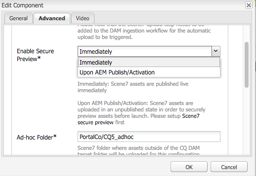
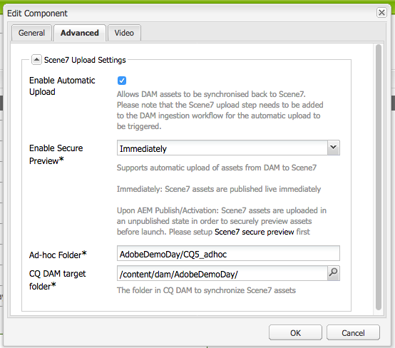

# Integración con Dynamic Media Classic (Scene7){#integrating-with-dynamic-media-classic-scene}

[Adobe Dynamic Media Classic](https://help.adobe.com/en_US/scene7/using/WS26AB0D9A-F51C-464e-88C8-580A5A82F810.html) es una solución alojada para administrar, mejorar, publicar y distribuir recursos de medios enriquecidos en pantallas e impresiones web, móviles, de correo electrónico y conectadas a Internet.

Para utilizar Dynamic Media Classic, debe configurar la configuración de nube para que Dynamic Media Classic y AEM Assets puedan interactuar entre sí. Este documento describe cómo configurar AEM y Dynamic Media Classic.

Para obtener información sobre el uso de todos los componentes de Dynamic Media Classic en una página y el trabajo con vídeo, consulte [Uso de Dynamic Media Classic](../assets/scene7.md).

>[!NOTE]
>
>* La plataforma de visor DHTML de Dynamic Media Classic llegó oficialmente al final de su vida útil el 31 de enero de 2014. Para obtener más información, consulte las preguntas más frecuentes [sobre el final de la vida útil del visor](../sites-administering/dhtml-viewer-endoflifefaqs.md)DHTML.
>* Antes de configurar Dynamic Media Classic para que funcione con AEM, consulte [Prácticas](#best-practices-for-integrating-scene-with-aem) recomendadas para integrar Dynamic Media Classic con AEM.
>* Si utiliza Dynamic Media Classic con una configuración proxy personalizada, debe configurar ambas configuraciones proxy del cliente HTTP, ya que algunas funcionalidades de AEM utilizan las API 3.x y otras las API 4.x. 3.x está configurado con [http://localhost:4502/system/console/configMgr/com.day.commons.httpclient](http://localhost:4502/system/console/configMgr/com.day.commons.httpclient) y 4.x está configurado con [http://localhost:4502/system/console/configMgr/org.apache.http.proxyconfigurator](http://localhost:4502/system/console/configMgr/org.apache.http.proxyconfigurator).
>

## Integración de AEM/Dynamic Media Classic frente a Dynamic Media {#aem-scene-integration-versus-dynamic-media}

Los usuarios de AEM pueden elegir entre dos soluciones para trabajar con medios dinámicos: Puede integrar su instancia de AEM con Dynamic Media Classic o utilizar la solución Dynamic Media integrada en AEM.

Utilice los siguientes criterios para determinar qué solución elegir:

* Si ya es cliente **existente** de Dynamic Media Classic, cuyos recursos de medios enriquecidos residen en Dynamic Media Classic para publicación y entrega, pero desea integrar esos recursos con la creación de sitios (WCM) o Recursos AEM para administración, utilice la integración [punto a punto de](#aem-scene-point-to-point-integration) AEM/Dynamic Media Classic descrita en este documento.

* Si es un cliente **nuevo** de AEM que necesita una entrega de medios enriquecidos, seleccione la opción [Medios](#aem-dynamic-media)dinámicos. Esta opción tiene el mayor sentido si no tiene una cuenta S7 existente y muchos recursos almacenados en ese sistema.

* En algunos casos, es posible que desee utilizar ambas soluciones. El escenario [de uso](/help/sites-administering/scene7.md#dual-use-scenario) doble describe ese escenario.

### Integración punto a punto de AEM/Dynamic Media Classic {#aem-scene-point-to-point-integration}

Cuando se trabaja con recursos en esta solución, se realiza una de las siguientes acciones:

* Cargue recursos directamente en Dynamic Media Classic y, a continuación, acceda a ellos a través del navegador de contenido de **Dynamic Media Classic** para la creación de páginas o
* Cargue en Recursos AEM y, a continuación, active la publicación automática en Dynamic Media Classic; se accede mediante el navegador de contenido de **Recursos** para la creación de páginas

Los componentes que utiliza para esta integración se encuentran en el área del componente **Dynamic Media Classic** del modo [Diseño.](/help/sites-authoring/author-environment-tools.md#page-modes)

### Medios dinámicos de AEM {#aem-dynamic-media}

AEM Dynamic Media es la unificación de las funciones de Dynamic Media Classic directamente en la plataforma AEM.

Cuando trabaje con recursos en esta solución, siga este flujo de trabajo:

1. Cargue recursos de imagen y vídeo individuales directamente en AEM.
1. Codifique los vídeos directamente en AEM.
1. Cree conjuntos basados en imágenes directamente en AEM.
1. Si corresponde, agregue interactividad a imágenes o vídeos.

Los componentes que utiliza para Dynamic Media se encuentran en el área del componente **[!UICONTROL Dynamic Media]** del modo Diseño. Incluyen lo siguiente:

* **[!UICONTROL Medios]** dinámicos: el componente **[!UICONTROL Dynamic Media]** es inteligente; según si agrega una imagen o un vídeo, tiene varias opciones. El componente admite ajustes preestablecidos de imagen, visores basados en imágenes, como conjuntos de imágenes, conjuntos de giros, conjuntos de medios mixtos y vídeo. Además, el visor es interactivo: el tamaño de la pantalla cambia automáticamente en función del tamaño de la pantalla. Todos los visores son visores HTML5.

* **[!UICONTROL Medios]** interactivos: el componente de medios **** interactivos es para los recursos, como pancartas de carrusel, imágenes interactivas y vídeos interactivos, que tienen interactividad en ellos, como puntos interactivos o mapas de imágenes. Este componente es inteligente, ya que, dependiendo de si agrega una imagen o un vídeo, dispone de varias opciones. Además, el visor es interactivo: el tamaño de la pantalla cambia automáticamente en función del tamaño de la pantalla. Todos los visores son visores HTML5.

### Escenario de doble uso {#dual-use-scenario}

De forma predeterminada, puede utilizar simultáneamente las funciones de integración de Dynamic Media y Dynamic Media Classic de AEM. La tabla de casos de uso siguiente describe cuándo se activan y desactivan determinadas áreas.

Para utilizar Dynamic Media y Dynamic Media Classic simultáneamente:

1. Configure [Dynamic Media Classic](#creating-a-cloud-configuration-for-scene) en los servicios en la nube.
1. Siga las instrucciones específicas de su caso de uso:

   <table>
    <tbody>
    <tr>
    <td> </td>
    <td> </td>
    <td><strong>Dynamic Media</strong></td>
    <td> </td>
    <td><strong>Integración de Dynamic Media Classic</strong></td>
    <td> </td>
    </tr>
    <tr>
    <td><strong>Si eres...</strong></td>
    <td><strong>Flujo de trabajo de caso de uso</strong></td>
    <td><strong>Imágenes/Vídeo</strong></td>
    <td><strong>Componente de Dynamic Media</strong></td>
    <td><strong>Navegador de contenido y componentes de S7</strong></td>
    <td><strong>Carga automática de recursos a S7</strong></td>
    </tr>
    <tr>
    <td>Nuevo en sitios y medios dinámicos</td>
    <td>Carga de recursos en AEM y uso del componente AEM Dynamic Media para crear recursos en páginas de sitios</td>
    <td>
Activado
 
(Consulte el paso 3)
 </td>
    <td><a href="/help/assets/adding-dynamic-media-assets-to-pages.md">Activado</a></td>
    <td>Desactivado</td>
    <td>Desactivado</td>
    </tr>
    <tr>
    <td>En el sector minorista y son nuevos en Sitios y Medios dinámicos</td>
    <td>Cargue recursos que no sean de productos en AEM para su administración y entrega. Cargue recursos del producto en Dynamic Media Classic y utilice el navegador de contenido de Dynamic Media Classic en AEM y el componente para crear páginas de detalles del producto en sitios.</td>
    <td>
Activado
 
(Consulte el paso 3)
 </td>
    <td><a href="/help/assets/adding-dynamic-media-assets-to-pages.md">Activado</a></td>
    <td><a href="/help/assets/scene7.md#scene-content-browser">Activado</a></td>
    <td>Desactivado</td>
    </tr>
    <tr>
    <td>Nuevo en Recursos y Medios dinámicos</td>
    <td>Carga de recursos en Recursos AEM y uso de la URL publicada o código incrustado de Dynamic Media</td>
    <td>
Activado
 
(Consulte el paso 3)
 </td>
    <td>Desactivado</td>
    <td>Desactivado</td>
    <td>Desactivado</td>
    </tr>
    <tr>
    <td>Nuevo en Dynamic Media y plantilla</td>
    <td>Utilice Dynamic Media para imágenes y vídeos. Cree plantillas de imagen en Dynamic Media Classic y utilice el buscador de contenido de Dynamic Media Classic para incluir plantillas en las páginas de sitios.</td>
    <td>
Activado
 
(Consulte el paso 3)
 </td>
    <td><a href="/help/assets/adding-dynamic-media-assets-to-pages.md">Activado</a></td>
    <td><a href="/help/assets/scene7.md#scene-content-browser">Activado</a></td>
    <td>Desactivado</td>
    </tr>
    <tr>
    <td>Un cliente existente de Dynamic Media Classic y es nuevo en Sitios</td>
    <td>Cargue recursos en Dynamic Media Classic y utilice el navegador de contenido de AEM Dynamic Media Classic para buscar y crear recursos en páginas de sitios</td>
    <td>Desactivado</td>
    <td>Desactivado</td>
    <td><a href="/help/assets/scene7.md#scene-content-browser">Activado</a></td>
    <td>Desactivado</td>
    </tr>
    <tr>
    <td>Un cliente existente de Dynamic Media Classic y es nuevo en Sitios y recursos</td>
    <td>Cargue recursos en DAM y publíquelos automáticamente en Dynamic Media Classic para su entrega. Utilice el navegador de contenido de AEM Dynamic Media Classic para buscar y crear recursos en páginas de sitios.</td>
    <td>Desactivado</td>
    <td>Desactivado</td>
    <td><a href="/help/assets/scene7.md#scene-content-browser">Activado</a></td>
    <td>
<a href="#configuringautouploadingfromaemassets">Activado</a>
 
(Consulte el paso 4)
 </td>
    </tr>
    <tr>
    <td>Cliente existente de Dynamic Media Classic y nuevo en Recursos</td>
    <td>
Cargue recursos en AEM y utilice Dynamic Media para generar representaciones para su descarga o uso compartido. Publicación automática de recursos de AEM en Dynamic Media Classic para su publicación.
 
<strong></strong> Importante: Incurre que el procesamiento duplicado y las representaciones generadas en AEM no se sincronizarán con Dynamic Media Classic
 </td>
    <td>
Activado
 
(Consulte el paso 3)
 </td>
    <td>Desactivado</td>
    <td>Desactivado</td>
    <td>
<a href="#configuringautouploadingfromaemassets">Activado</a>
 
(Consulte el paso 4)
 </td>
    </tr>
    </tbody>
    </table>

1. (Opcional; consulte la tabla de casos de uso): Configure la configuración [de nube de](/help/assets/config-dynamic.md) Dynamic Media y [habilite el servidor](/help/assets/config-dynamic.md)de Dynamic Media.
1. (Opcional; consulte la tabla de casos de uso): si decide activar la carga automática de recursos a Dynamic Media Classic, deberá agregar lo siguiente:

   1. Configure la carga automática en Dynamic Media Classic.
   1. Agregue el paso de carga **de** Dynamic Media Classic después de todos los pasos del flujo de trabajo de Dynamic Media *al final* del flujo de trabajo de recursos **de actualización de** Dam ( `https://<server>:<host>/cf#/etc/workflow/models/dam/update_asset.html)`
   1. (Opcional) Restrinja la carga de recursos de Dynamic Media Classic por tipo MIME en [https://&lt;servidor>:&lt;puerto>/system/console/configMgr/com.day.cq.dam.scene7.impl.Scene7AssetMimeTypeServiceImpl](http://localhost:4502/system/console/configMgr/com.day.cq.dam.scene7.impl.Scene7AssetMimeTypeServiceImpl). Los tipos MIME de recurso que no estén en esta lista no se cargarán en el servidor de Dynamic Media Classic.
   1. (Opcional) Configure el vídeo en la configuración de Dynamic Media Classic. Puede activar la codificación de vídeo para Dynamic Media y Dynamic Media Classic simultáneamente o para ambos. Las representaciones dinámicas se utilizan para previsualizar y reproducir localmente en instancias de AEM, mientras que las representaciones de vídeo de Dynamic Media Classic se generan y almacenan en servidores de Dynamic Media Classic. Al configurar los servicios de codificación de vídeo tanto para Dynamic Media como para Dynamic Media Classic, aplique un perfil [de procesamiento de](/help/assets/video-profiles.md) vídeo a la carpeta de recursos de Dynamic Media Classic.
   1. (Opcional) [Configure la vista previa segura en Dynamic Media Classic](/help/sites-administering/scene7.md#configuring-the-state-published-unpublished-of-assets-pushed-to-scene).

#### Restricciones {#limitations}

Cuando tiene habilitados Dynamic Media Classic y Dynamic Media, existen las siguientes limitaciones:

* La carga manual a Dynamic Media Classic seleccionando un recurso y arrastrándolo a un componente de Dynamic Media Classic en una página de AEM no funciona.
* Aunque los recursos sincronizados con AEM-Dynamic Media Classic se actualizan automáticamente a Dynamic Media Classic cuando el recurso se edita en Recursos, una acción de reversión no activa una nueva carga, por lo tanto, Dynamic Media Classic no obtendría la última versión inmediatamente después de una reversión. La solución consiste en volver a editarse una vez que se haya completado la reversión.
* Si necesita utilizar Dynamic Media para un caso de uso e integración de Dynamic Media Classic para otro caso de uso, para que los recursos de Dynamic Media no interactúen con el sistema de Dynamic Media Classic, no aplique la configuración de Dynamic Media Classic a la carpeta de Dynamic Media ni la configuración de Dynamic Media (perfil de procesamiento) a una carpeta de Dynamic Media Classic.

## Prácticas recomendadas para integrar Dynamic Media Classic con AEM {#best-practices-for-integrating-scene-with-aem}

Al integrar Dynamic Media Classic con AEM, hay que seguir algunas prácticas recomendadas importantes en las siguientes áreas:

* Probar la integración
* Se recomienda cargar recursos directamente desde Dynamic Media Classic en determinados casos

Consulte las limitaciones conocidas.

### Probar la integración {#test-driving-your-integration}

Adobe recomienda probar la integración haciendo que la carpeta raíz apunte a una subcarpeta en lugar de a una empresa entera.

>[!CAUTION]
>
>La importación de recursos desde una cuenta de empresa existente de Dynamic Media Classic puede tardar mucho tiempo en mostrarse en AEM. Asegúrese de designar una carpeta en Dynamic Media Classic que no tenga demasiados recursos (por ejemplo, la carpeta raíz tendrá con frecuencia demasiados recursos y podría bloquear el sistema).

### Carga de recursos desde Recursos AEM en comparación con Dynamic Media Classic {#uploading-assets-from-aem-assets-versus-from-scene}

Puede cargar recursos mediante la funcionalidad Recursos (administración de recursos digitales) o accediendo a Dynamic Media Classic directamente en AEM a través del navegador de contenido de Dynamic Media Classic. El que elija dependerá de los siguientes factores:

* Los tipos de recursos de Dynamic Media Classic que AEM Assets aún no admite deben agregarse directamente a un sitio web de AEM desde Dynamic Media Classic a través del navegador de contenido de Dynamic Media Classic, por ejemplo, plantillas de imagen.
* Para los tipos de recursos compatibles con AEM Assets y Dynamic Media Classic, la decisión de cargarlos depende de lo siguiente:

   * Dónde están los recursos hoy Y
   * La importancia de administrarlas en un repositorio común

Si los recursos ya están en Dynamic Media Classic y administrarlos en un repositorio común no es tan importante, exportarlos a Recursos AEM solo para sincronizarlos con Dynamic Media Classic para su entrega sería un viaje de ida y vuelta innecesario. De lo contrario, puede ser preferible mantener los recursos en un único repositorio y sincronizarlos con Dynamic Media Classic solo para su entrega.

## Configuración de la integración de Dynamic Media Classic {#configuring-scene-integration}

Puede configurar AEM para cargar recursos en Dynamic Media Classic. Los recursos de una carpeta de destino de CQ se pueden cargar (automática o manualmente) de AEM a una cuenta de empresa de Dynamic Media Classic.

>[!NOTE]
>
>Adobe recomienda utilizar solo la carpeta de destino designada para importar recursos de Dynamic Media Classic. Los recursos digitales que residen fuera de la carpeta de destino solo se pueden usar en componentes de Dynamic Media Classic en páginas en las que se ha activado la configuración de Dynamic Media Classic. Además, se colocan en una carpeta ad hoc de Dynamic Media Classic. La carpeta ad hoc no está sincronizada con AEM (pero los recursos se pueden detectar en el navegador de contenido de Dynamic Media Classic).

Para configurar Dynamic Media Classic para la integración con AEM, debe completar los siguientes pasos:

1. [Definir una configuración](#creating-a-cloud-configuration-for-scene) de nube: define la asignación entre una carpeta de Dynamic Media Classic y una carpeta de recursos. Debe completar este paso aunque solo desee sincronizar los recursos de una sola dirección (AEM Assets con Dynamic Media Classic).
1. [Habilite el detector **de represas de **](#enabling-the-adobe-cq-scene-dam-listener)Adobe CQ s7dam - Hecho en la consola[!UICONTROL OSGi].
1. Si desea que los recursos de AEM se carguen automáticamente a Dynamic Media Classic, debe activar esa opción y agregar Dynamic Media Classic al flujo de trabajo de recursos de actualización de DAM. También puede cargar recursos manualmente.
1. Adición de componentes de Dynamic Media Classic a la barra de tareas. Esto permite a los usuarios utilizar componentes de Dynamic Media Classic en sus páginas de AEM.
1. [Asigne la configuración a la página en AEM](#enabling-scene-for-wcm) : este paso es necesario para ver los ajustes preestablecidos de vídeo que haya creado en Dynamic Media Classic. También es necesario si necesita publicar un recurso desde fuera de la carpeta de destino de CQ en Dynamic Media Classic.

En esta sección se explica cómo realizar todos estos pasos y se enumeran las limitaciones importantes.

### Funcionamiento de la sincronización entre Dynamic Media Classic y AEM Assets {#how-synchronization-between-scene-and-aem-assets-works}

Al configurar la sincronización de AEM Assets y Dynamic Media Classic, es importante comprender lo siguiente:

#### Carga en Dynamic Media Classic desde Recursos AEM {#uploading-to-scene-from-aem-assets}

* Hay una carpeta de sincronización designada en AEM para las cargas de Dynamic Media Classic.
* Las cargas a Dynamic Media Classic se pueden automatizar si los recursos digitales se colocan en la carpeta de sincronización designada.
* La estructura de carpetas y subcarpetas de AEM se replica en Dynamic Media Classic.

>[!NOTE]
>
>AEM incrusta todos los metadatos como XMP antes de cargarlos en Dynamic Media Classic, por lo que todas las propiedades del nodo de metadatos están disponibles en Dynamic Media Classic como XMP.

#### Limitaciones conocidas e implicaciones de diseño {#known-limitations-and-design-implications}

Con la sincronización entre AEM Assets y Dynamic Media Classic, actualmente hay las siguientes limitaciones/implicaciones de diseño:

<table>
 <tbody>
  <tr>
   <td><strong>Implicación de limitaciones/diseño</strong></td>
   <td><strong>Descripción</strong></td>
  </tr>
  <tr>
   <td>Una carpeta de sincronización designada (destino)</td>
   <td>Solo puede tener una carpeta designada por empresa en las cargas de AEM para Dynamic Media Classic. Puede crear varias configuraciones si necesita tener acceso a más de una cuenta de empresa en Dynamic Media Classic.</td>
  </tr>
  <tr>
   <td>Estructura de carpetas</td>
   <td>Si elimina una carpeta sincronizada con recursos, se eliminarán todos los recursos remotos de Dynamic Media Classic, pero la carpeta permanecerá.</td>
  </tr>
  <tr>
   <td>Carpeta ad-hoc</td>
   <td>Los recursos que residen fuera de la carpeta de destino y que se cargan manualmente en Dynamic Media Classic en WCM se colocan automáticamente en una carpeta ad-hoc independiente en Dynamic Media Classic. Esto se configura en la configuración de nube en AEM.</td>
  </tr>
  <tr>
   <td>Medios mixtos</td>
   <td>Los conjuntos de medios mixtos aparecen en AEM aunque no son compatibles con AEM.</td>
  </tr>
  <tr>
   <td>Archivos PDF</td>
   <td>Los archivos PDF generados a partir de catálogos electrónicos en Dynamic Media Classic se importan en la carpeta de destino de CQ.</td>
  </tr>
  <tr>
   <td>Actualización de la interfaz de usuario</td>
   <td>Al sincronizar entre AEM y Dynamic Media Classic, asegúrese de actualizar la interfaz de usuario para ver los cambios. </td>
  </tr>
  <tr>
   <td>Miniaturas de vídeo</td>
   <td>Si se carga un vídeo en Recursos AEM para su codificación mediante Dynamic Media Classic, las miniaturas de vídeo y los vídeos codificados pueden tardar algún tiempo en estar disponibles en Recursos AEM, según el tiempo de procesamiento del vídeo.</td>
  </tr>
  <tr>
   <td>Subcarpetas de Target</td>
   <td>
Si utiliza subcarpetas dentro de la carpeta de destino, asegúrese de utilizar nombres únicos para cada recurso (independientemente de la ubicación) o de configurar Dynamic Media Classic (en el área Configuración) para que no sobrescriba los recursos independientemente de la ubicación.
 
De lo contrario, se cargarán los recursos con el mismo nombre que se cargan en una subcarpeta de destino de Dynamic Media Classic, pero se eliminará el recurso con el mismo nombre en la carpeta de destino. 
 </td>
  </tr>
 </tbody>
</table>

### Configuración de los servidores de Dynamic Media Classic {#configuring-scene-servers}

Si ejecuta AEM detrás de un proxy o tiene una configuración de firewall especial, es posible que deba habilitar explícitamente los hosts de las distintas regiones. Los servidores se administran en contenido en `/etc/cloudservices/scene7/endpoints` y se pueden personalizar según sea necesario. Toque una dirección URL y, a continuación, edítela para cambiar la dirección URL, si es necesario. En versiones anteriores de AEM, estos valores estaban codificados.

Si se desplaza a `/etc/cloudservices/scene7/endpoints.html`, verá los servidores enumerados (y puede editarlos haciendo clic en la URL):

### Creación de una configuración de nube para Dynamic Media Classic {#creating-a-cloud-configuration-for-scene}

Una configuración de nube define la asignación entre una carpeta de Dynamic Media Classic y una carpeta de Recursos AEM. Debe configurarse para sincronizar Recursos AEM con Dynamic Media Classic. Consulte Funcionamiento de la sincronización para obtener más información.

>[!CAUTION]
>
>La importación de recursos desde una cuenta de empresa existente de Dynamic Media Classic puede tardar mucho tiempo en mostrarse en AEM. Asegúrese de designar una carpeta en Dynamic Media Classic que no tenga demasiados recursos (por ejemplo, la carpeta raíz tendrá con frecuencia demasiados recursos).
>
>Si desea probar la unidad de integración, puede que desee que la carpeta raíz apunte solo a una subcarpeta, en lugar de a toda la empresa.

>[!NOTE]
>
>Puede tener varias configuraciones: una configuración de nube representa a un usuario de una empresa de Dynamic Media Classic. Si desea acceder a otras empresas o usuarios de Dynamic Media Classic, debe crear varias configuraciones.

Para configurar AEM para que pueda publicar recursos en Dynamic Media Classic:

1. Toque el icono de AEM y vaya a **[!UICONTROL Implementación > Servicios]** de nube para acceder a Adobe Dynamic Media Classic.

1. Puntee **[!UICONTROL Configurar ahora]**.

   

1. En el campo **[!UICONTROL Título]** y, opcionalmente, en el campo **[!UICONTROL Nombre]** , introduzca la información adecuada. Toque **[!UICONTROL Crear]**.

   >[!NOTE]
   >
   >Al crear configuraciones adicionales, se muestra el campo de configuración **** principal.
   >
   >No **cambie** la configuración principal. Cambiar la configuración principal puede dañar la integración.

1. Introduzca la dirección de correo electrónico, la contraseña y la región de su cuenta de Dynamic Media Classic y toque **[!UICONTROL Conectar a Dynamic Media Classic]**. Está conectado al servidor de Dynamic Media Classic y el cuadro de diálogo se expande con más opciones.

1. Introduzca el nombre de la **[!UICONTROL empresa]** y la ruta **[!UICONTROL raíz]** (es el nombre del servidor publicado junto con cualquier ruta que desee especificar; si no conoce el nombre del servidor publicado, en Dynamic Media Classic, vaya a **[!UICONTROL Ajustes > Ajustes]** de aplicación).

   >[!NOTE]
   >
   >La ruta de acceso raíz de Dynamic Media Classic es la carpeta a la que se conecta AEM con Dynamic Media Classic. Se puede reducir a una carpeta específica.

   >[!CAUTION]
   >
   >Según el tamaño de la carpeta de Dynamic Media Classic, la importación de una carpeta raíz puede tardar mucho tiempo. Además, los datos de Dynamic Media Classic podrían superar el almacenamiento de AEM. Asegúrese de que está importando la carpeta correcta. La importación de demasiados datos puede detener el sistema.

   

1. Haga clic en **[!UICONTROL Aceptar]**. AEM guarda la configuración.

>[!NOTE]
>
>Si está reconectando:
>
>* Al volver a conectarse a Dynamic Media Classic durante la publicación, es posible que tenga que restablecer la contraseña al publicar o que la reconexión no funcione. No se trata de un problema en la instancia de creación.
>* Si modifica valores como región, nombre de empresa, debe volver a conectarse a Dynamic Media Classic. Si las opciones de configuración se han modificado pero no se han guardado, AEM seguirá indicando erróneamente que la configuración es válida. Asegúrese de volver a conectarse.
>

### Activación del detector de presas de Adobe CQ Dynamic Media Classic {#enabling-the-adobe-cq-scene-dam-listener}

Debe activar el detector de presas de Adobe CQ Dynamic Media Classic, que está desactivado de forma predeterminada.

Para habilitarlo:

1. Toque el icono [!UICONTROL Herramientas] y, a continuación, vaya a **[!UICONTROL Operaciones > Consola]** web. Se abre la consola Web.
1. Vaya a **[!UICONTROL Adobe CQ Dynamic Media Classic Dam Listener]** y seleccione la casilla de verificación **[!UICONTROL Habilitado]** .

   

1.  Toque **[!UICONTROL Guardar]**.

### Adición del tiempo de espera configurable al flujo de trabajo de carga de Dynamic Media Classic {#adding-configurable-timeout-to-scene-upload-workflow}

Cuando se configura una instancia de AEM para gestionar la codificación de vídeo mediante Dynamic Media Classic (Scene7), de forma predeterminada, se agota el tiempo de espera de 35 minutos en cualquier trabajo de carga. Para dar cabida a trabajos de codificación de vídeo potencialmente más largos, puede configurar esta configuración:

1. Vaya a **http://localhost:4502/system/console/configMgr/com.day.cq.dam.scene7.impl.Scene7UploadServiceImpl**.

   

1. Cambie el número como desee en el campo Tiempo de espera **[!UICONTROL del trabajo]** activo. Se acepta cualquier número no negativo con la unidad de medida en segundos. De forma predeterminada, se establece en 2100.

   >[!NOTE]
   >
   >Práctica recomendada: La mayoría de los recursos se ingieren en minutos como máximo (por ejemplo, imágenes). Pero en algunos casos (por ejemplo, vídeos más grandes), el valor de tiempo de espera debe aumentarse a 7200 segundos (2 horas) para dar cabida a un tiempo de procesamiento prolongado. De lo contrario, este trabajo de carga de Dynamic Media Classic se marca como **[!UICONTROL UploadFailed]** en los metadatos JCR.

1. Toque **[!UICONTROL Guardar]**.

### Carga automática desde Recursos AEM {#autouploading-from-aem-assets}

A partir de AEM 6.3.2, AEM Assets ahora está configurado para que cualquier recurso digital que cargue en el administrador de recursos digitales se actualice automáticamente a Dynamic Media Classic si los recursos están en una carpeta de destino de CQ.

Cuando se agrega un recurso a Recursos AEM, se carga y publica automáticamente en Dynamic Media Classic.

>[!NOTE]
>
>El tamaño máximo de archivo para la carga automática desde Recursos AEM a Dynamic Media Classic es de 500 MB.

Para configurar la carga automática desde Recursos AEM:

1. Toque el icono de AEM y vaya a **[!UICONTROL Implementación > Servicios]** de nube y, a continuación, en el encabezado Medios dinámicos, en Configuraciones disponibles, toque **[!UICONTROL dms7 (Medios]** dinámicos)
1. Puntee en la ficha **[!UICONTROL Avanzadas]** , seleccione la casilla de verificación **[!UICONTROL Activar carga]** automática y, a continuación, toque **[!UICONTROL Aceptar]**. Ahora debe configurar el flujo de trabajo de recursos DAM para incluir la carga en Dynamic Media Classic.

   >[!NOTE]
   >
   >Consulte [Configuración del estado (publicado/sin publicar) de los recursos insertados en Dynamic Media Classic](#configuring-the-state-published-unpublished-of-assets-pushed-to-scene) para obtener información sobre cómo insertar recursos en Dynamic Media Classic en un estado sin publicar.

   

1. Vuelva a la página de bienvenida de AEM y toque **[!UICONTROL Flujos de trabajo]**. Haga doble clic en el flujo de trabajo de recursos **de actualización de** DAM para abrirlo.
1. En la barra de tareas, vaya a los componentes **[!UICONTROL Flujo de trabajo]** y seleccione **[!UICONTROL Dynamic Media Classic]**. Arrastre **[!UICONTROL Dynamic Media Classic]** al flujo de trabajo y toque **[!UICONTROL Guardar]**. Los recursos añadidos a Recursos AEM en la carpeta de destino se cargarán automáticamente en Dynamic Media Classic.

   

   >[!NOTE]
   >
   >* Al agregar recursos después de la automatización, si no se colocan en la carpeta de destino de CQ, no se cargan en Dynamic Media Classic.
   >* AEM incrusta todos los metadatos como XMP antes de cargarlos en Dynamic Media Classic, por lo que todas las propiedades del nodo de metadatos están disponibles en Dynamic Media Classic como XMP.

### Configuración del estado (publicado/no publicado) de los recursos insertados en Dynamic Media Classic {#configuring-the-state-published-unpublished-of-assets-pushed-to-scene}

Si va a insertar recursos de Recursos AEM en Dynamic Media Classic, puede publicarlos automáticamente (comportamiento predeterminado) o insertarlos en Dynamic Media Classic en un estado sin publicar.

Es posible que no desee publicar recursos inmediatamente en Dynamic Media Classic si desea probarlos en un entorno de ensayo antes de activarlos. Puede utilizar AEM con el entorno Secure Test de Dynamic Media Classic para insertar recursos directamente desde Assets en Dynamic Media Classic en un estado sin publicar.

Los recursos de Dynamic Media Classic permanecen disponibles mediante la vista previa segura. Los recursos de Dynamic Media Classic solo se activan en la producción cuando se publican en AEM.

Si desea publicar recursos inmediatamente al impulsarlos a Dynamic Media Classic, no es necesario configurar ninguna opción. Este es el comportamiento predeterminado.

Sin embargo, si no desea que los recursos insertados en Dynamic Media Classic se publiquen automáticamente, en esta sección se describe cómo configurar AEM y Dynamic Media Classic para hacerlo.

#### Requisitos previos para insertar recursos en Dynamic Media Classic sin publicar {#prerequisites-to-push-assets-to-scene-unpublished}

Para poder insertar recursos en Dynamic Media Classic sin publicarlos, debe configurar lo siguiente:

1. Póngase en contacto con el servicio de atención al cliente de Dynamic Media Classic (s7support@adobe.com) para activar la vista previa segura para su cuenta de Dynamic Media Classic.
1. Siga las instrucciones para [configurar la vista previa segura para su cuenta de Dynamic Media Classic.](https://help.adobe.com/en_US/scene7/using/WSd968ca97bf00cf72-5eeee3a113268dc80f5-8000.html)

Estos son los mismos pasos que debe seguir para crear cualquier configuración de prueba segura en Dynamic Media Classic.

>[!NOTE]
>
>Si el entorno de instalación es un sistema operativo Unix de 64 bits, consulte [https://helpx.adobe.com/experience-manager/kb/enable-xmp-write-back-64-bit-redhat.html](https://helpx.adobe.com/experience-manager/kb/enable-xmp-write-back-64-bit-redhat.html) acerca de las opciones de configuración adicionales que necesita configurar.

#### Limitaciones conocidas para insertar recursos en estado no publicado {#known-limitations-for-pushing-assets-in-unpublished-state}

Si utiliza esta función, tenga en cuenta las siguientes limitaciones:

* No se admite el control de versiones.
* Si un recurso ya se ha publicado en AEM y se ha creado una versión posterior, dicha nueva versión se publicará inmediatamente en directo en producción. Publicar tras la activación solo funciona con la publicación inicial de un recurso.

>[!NOTE]
>
>Si desea publicar recursos instantáneamente, se recomienda mantener **[!UICONTROL Activar vista previa]** segura configurada en **[!UICONTROL Inmediatamente]** y utilizar la función **[!UICONTROL Activar carga]** automática.

### Configuración del estado de los recursos insertados en Dynamic Media Classic como no publicados {#setting-the-state-of-assets-pushed-to-scene-as-unpublished}

>[!NOTE]
>
>Si un usuario publica el recurso en AEM, automáticamente lo activa en el recurso de producción/activo (el recurso ya no estará en la vista previa segura/sin publicar).

Para definir el estado de los recursos insertados en Dynamic Media Classic como no publicados:

1. Toque el icono de AEM y vaya a **[!UICONTROL Implementación > Servicios]** de nube, toque **[!UICONTROL Dynamic Media Classic]** y seleccione su configuración en Dynamic Media Classic.
1. Tap the **[!UICONTROL Advanced]** tab. En el menú desplegable **[!UICONTROL Activar vista]** segura, seleccione **[!UICONTROL Al activar]** AEM Publish para insertar recursos en Dynamic Media Classic sin publicarlos. (De forma predeterminada, este valor se establece en **[!UICONTROL Inmediatamente]**, donde los recursos de Dynamic Media Classic se publican inmediatamente).

   Consulte la documentación [de](https://help.adobe.com/en_US/scene7/using/WSd968ca97bf00cf72-5eeee3a113268dc80f5-8000.html) Dynamic Media Classic para obtener más información sobre la prueba de recursos antes de hacerlos públicos.

   

1. Toque **[!UICONTROL Aceptar]**.

Al habilitar la Vista segura, los recursos se insertan en el servidor de vista previa segura sin publicar.

Para comprobar esto, vaya a un componente de Dynamic Media Classic en una página de AEM y toque **[!UICONTROL Editar]**. El recurso tendrá el servidor de vista previa seguro en la URL. Después de publicar en AEM, el dominio del servidor en la referencia del archivo se actualiza de la URL de vista previa a la URL de producción.

### Activación de Dynamic Media Classic para WCM {#enabling-scene-for-wcm}

Se requiere activar Dynamic Media Classic para WCM por dos motivos:

* Para activar la lista desplegable de perfiles de vídeo universales para la creación de páginas. Sin esto, la lista desplegable de ajustes preestablecidos **[!UICONTROL de vídeo]** universales está vacía y no se puede establecer.
* Si un recurso digital no está en la carpeta de destino, puede cargarlo en Dynamic Media Classic si activa Dynamic Media Classic para esa página en las propiedades de la página y arrastrarlo y soltarlo en un componente de Dynamic Media Classic. Se aplican reglas de herencia normales (lo que significa que las páginas secundarias heredarán la configuración de la página principal).

Al activar Dynamic Media Classic para WCM, tenga en cuenta que, al igual que con otras configuraciones, se aplican las reglas de herencia. Puede activar Dynamic Media Classic para WCM en la interfaz de usuario táctil o clásica.

#### Activación de Dynamic Media Classic para WCM en la interfaz de usuario táctil optimizada {#enabling-scene-for-wcm-in-the-touch-optimized-user-interface}

Para activar Dynamic Media Classic para WCM en la IU táctil:

1. Toque el icono de AEM y vaya a **[!UICONTROL Sitios]** y, a continuación, a la página raíz del sitio web (no específica del idioma).

1. En la barra de herramientas, seleccione el icono de [!UICONTROL configuración] y toque **[!UICONTROL Abrir propiedades]**.

1. Toque **[!UICONTROL Cloud Services]** , **[!UICONTROL Agregar configuración]** y seleccione **[!UICONTROL Dynamic Media Classic]**.
1. En la lista desplegable **[!UICONTROL Adobe Dynamic Media Classic]** , seleccione la configuración que desee y toque **[!UICONTROL Aceptar]**.

   

   Los ajustes preestablecidos de vídeo de esa configuración de Dynamic Media Classic están disponibles para su uso en AEM con el componente de vídeo de Dynamic Media Classic en esa página y en las páginas secundarias.

#### Activación de Dynamic Media Classic para WCM en la interfaz de usuario clásica {#enabling-scene-for-wcm-in-the-classic-user-interface}

Para activar Dynamic Media Classic para WCM en la IU clásica:

1. En AEM, toque **[!UICONTROL Sitios web]** y navegue hasta la página raíz del sitio web (no específica del idioma).

1. In the sidekick, tap the **[!UICONTROL Page]** icon and tap **[!UICONTROL Page Properties]**.

1. Puntee en Servicios **[!UICONTROL de nube > Agregar servicios > Dynamic Media Classic]**.
1. En la lista desplegable **[!UICONTROL Adobe Dynamic Media Classic]** , seleccione la configuración que desee y toque **[!UICONTROL Aceptar]**.

   Los ajustes preestablecidos de vídeo de esa configuración de Dynamic Media Classic están disponibles para su uso en AEM con el componente de vídeo de Dynamic Media Classic en esa página y en las páginas secundarias.

### Configuración de una configuración predeterminada {#configuring-a-default-configuration}

Si tiene varias configuraciones de Dynamic Media Classic, puede especificar una de ellas como la predeterminada para el explorador de contenido de Dynamic Media Classic.

Solo se puede marcar una configuración de Dynamic Media Classic como predeterminada en un momento dado. La configuración predeterminada son los recursos de la empresa que se muestran de forma predeterminada en el navegador de contenido de Dynamic Media Classic.

Para configurar la configuración predeterminada:

1. Toque el icono de AEM y vaya a **[!UICONTROL Implementación > Servicios]** de nube, toque **[!UICONTROL Dynamic Media Classic]** y seleccione su configuración en Dynamic Media Classic.
1. Toque **[!UICONTROL Editar]** para abrir la configuración.

1. En la ficha **[!UICONTROL General]** , active la casilla de verificación Configuración **** predeterminada para que sea la empresa y la ruta raíz predeterminadas que aparecen en el explorador de contenido de Dynamic Media Classic.

   

   >[!NOTE]
   >
   >Si sólo hay una configuración, la selección de la casilla de verificación Configuración **** predeterminada no tiene ningún efecto.

### Configuración de la carpeta Ad-hoc {#configuring-the-ad-hoc-folder}

Puede configurar la carpeta en la que se cargan los recursos en Dynamic Media Classic cuando el recurso no se encuentra en la carpeta de destino de CQ. Consulte Publicación de recursos desde fuera de la carpeta de destino de CQ.

Para configurar la carpeta ad hoc:

1. Toque el icono de AEM y vaya a **[!UICONTROL Implementación > Servicios]** de nube, toque **[!UICONTROL Dynamic Media Classic]** y seleccione su configuración en Dynamic Media Classic.
1. Toque **[!UICONTROL Editar]** para abrir la configuración.

1. Tap the **[!UICONTROL Advanced]** tab. En el campo Carpeta **** ad-hoc, puede modificar la carpeta **Ad-hoc** . De forma predeterminada, es el **nombre de la empresa/CQ5_adhoc**.

   

### Configuración de ajustes preestablecidos universales {#configuring-universal-presets}

Para configurar los ajustes preestablecidos universales para el componente de vídeo, consulte [Vídeo](/help/assets/s7-video.md).

## Activación de la compatibilidad con el parámetro de trabajo de carga de Dynamic Media Classic/Recursos basados en tipos MIME {#enabling-mime-type-based-assets-scene-upload-job-parameter-support}

Puede activar los parámetros configurables de trabajos de carga de Dynamic Media Classic que se activan mediante la sincronización de recursos de Digital Asset Manager/Dynamic Media Classic.

Concretamente, puede configurar el formato de archivo aceptado por tipo MIME en el área OSGi (Open Service Gateway Initiative) del panel Configuración de la consola web de AEM. A continuación, puede personalizar los parámetros individuales del trabajo de carga que se utilizan para cada tipo MIME en el JCR (repositorio de contenido de Java).

**Para habilitar los recursos basados en tipos MIME:**

1. Toque el icono de AEM y vaya a **[!UICONTROL Herramientas > Operaciones > Consola]** web.
1. En el panel Configuración de la consola web de Adobe Experience Manager, en el menú **[!UICONTROL OSGi]** , toque **[!UICONTROL Configuración]**.
1. En la columna Nombre, busque y toque **[!UICONTROL Adobe CQ Dynamic Media Classic Asset MIME type Service]** para editar la configuración.
1. En el área Asignación de tipos de MIME, toque cualquier signo más (+) para agregar un tipo MIME.

   Consulte Tipos [MIME](/help/assets/assets-formats.md#supported-mime-types)admitidos.

1. En el campo de texto, escriba el nuevo nombre del tipo MIME.

   Por ejemplo, escribiría un `<file_extension>=<mime_type>` como en `EPS=application/postscript` OR `PSD=image/vnd.adobe.photoshop`.

1. En la esquina inferior derecha de la ventana de configuración, toque **[!UICONTROL Guardar]**.
1. Vuelva a AEM y, en el carril izquierdo, toque CRXDE Lite.
1. En la página CRXDE Lite, en el carril izquierdo, navegue hasta `/etc/cloudservices/scene7/<environment>` (reemplace `<environment>` el nombre real).
1. Expanda `<environment>` (reemplace `<environment>` el nombre real) para mostrar el `mimeTypes` nodo.
1. Toque el mimeType que acaba de agregar.

   Por ejemplo, `mimeTypes > application_postscript` OR `mimeTypes > image_vnd.adobe.photoshop`.

1. En la parte derecha de la página de CRXDE Lite, toque la ficha **[!UICONTROL Propiedades]** .
1. Especifique un parámetro de trabajo de carga de Dynamic Media Classic en el campo de valor **[!UICONTROL jobParam]** .

   Por ejemplo, `psprocess="rasterize"&psresolution=120` .

   Consulte la API [de sistema de producción de imágenes de](https://marketing.adobe.com/resources/help/en_US/s7/ips_api/) Adobe Dynamic Media Classic para obtener parámetros de trabajo de carga adicionales que puede utilizar.

   >[!NOTE]
   >
   >Si va a cargar archivos PSD y desea procesarlos como plantillas con extracciones de capas, introduzca lo siguiente en el campo de valor **[!UICONTROL jobParam]** :
   >
   >`process=MaintainLayers&createTemplate=true`
   >
   >Asegúrese de que el archivo PSD tiene &quot;capas&quot;. Si es estrictamente una imagen o una imagen con máscara, se procesa como una imagen porque no hay capas que procesar.

1. En la esquina superior izquierda de la página de CRXDE Lite, toque **[!UICONTROL Guardar todo]**.

## Solución de problemas de la integración de Dynamic Media Classic y AEM {#troubleshooting-scene-and-aem-integration}

Si tiene problemas para integrar AEM con Dynamic Media Classic, consulte los siguientes escenarios para obtener soluciones.

**Si falla la publicación de recursos digitales en Dynamic Media Classic:**

* Compruebe que el recurso que está intentando cargar se encuentra en la carpeta de destino **[!UICONTROL de]** CQ (especifique esta carpeta en la configuración de nube de Dynamic Media Classic).
* Si no es así, debe configurar la configuración de nube en Propiedades **[!UICONTROL de]** página para esa página a fin de permitir la carga en la carpeta adhoc **[!UICONTROL de]** CQ.

* Consulte los registros para obtener información.

**Si no aparecen los ajustes preestablecidos de vídeo:**

* Asegúrese de haber configurado la configuración de nube de esa página mediante Propiedades **[!UICONTROL de página]**. Los ajustes preestablecidos de vídeo están disponibles en el componente de vídeo de Dynamic Media Classic.

**Si los recursos de vídeo no se reproducen en AEM:**

* Asegúrese de que ha utilizado el componente de vídeo correcto. El componente de vídeo de Dynamic Media Classic es diferente del componente de vídeo de base. Consulte Componente [de vídeo de base versus Componente](/help/assets/s7-video.md)de vídeo de Dynamic Media Classic.

**Si los recursos nuevos o modificados en AEM no se cargan automáticamente a Dynamic Media Classic:**

* Asegúrese de que los recursos están en la carpeta de destino de CQ. Solo se actualizan automáticamente los recursos que se encuentran en la carpeta de destino de CQ (siempre que haya configurado Recursos AEM para cargar recursos automáticamente).
* Asegúrese de haber configurado los servicios de nube para activar la carga automática y de haber actualizado y guardado el flujo de trabajo de recursos de DAM para incluir la carga de Dynamic Media Classic.
* Al cargar una imagen en una subcarpeta de la carpeta de destino de Dynamic Media Classic, asegúrese de realizar una de las siguientes acciones:

   * Asegúrese de que los nombres de todos los recursos, independientemente de la ubicación, son únicos. De lo contrario, se elimina el recurso de la carpeta de destino principal y solo permanece el recurso de la subcarpeta.
   * Cambie el modo en que Dynamic Media Classic sobrescribe los recursos en el área de configuración de la cuenta de Dynamic Media Classic. No defina Dynamic Media Classic para sobrescribir recursos independientemente de la ubicación si utiliza recursos con el mismo nombre en las subcarpetas.

**Si los recursos o carpetas eliminados no están sincronizados entre Dynamic Media Classic y AEM:**

* Los recursos y las carpetas eliminados en Recursos AEM siguen apareciendo en la carpeta sincronizada en Dynamic Media Classic. Debe eliminarlos manualmente.

**Si falla la carga de vídeo**

* Si falla la carga de vídeo y utiliza AEM para codificar vídeo mediante la integración de Dynamic Media Classic, consulte [Adición del tiempo de espera configurable al flujo de trabajo](#adding-configurable-timeout-to-scene-upload-workflow)de carga de Dynamic Media Classic.

>[!CAUTION]
>
>La importación de recursos desde una cuenta de empresa existente de Dynamic Media Classic puede tardar mucho tiempo en mostrarse en AEM. Asegúrese de designar una carpeta en Dynamic Media Classic que no tenga demasiados recursos (por ejemplo, la carpeta raíz tendrá con frecuencia demasiados recursos).
>
>Si desea probar la unidad de integración, puede que desee que la carpeta raíz apunte solo a una subcarpeta, en lugar de a toda la empresa.

