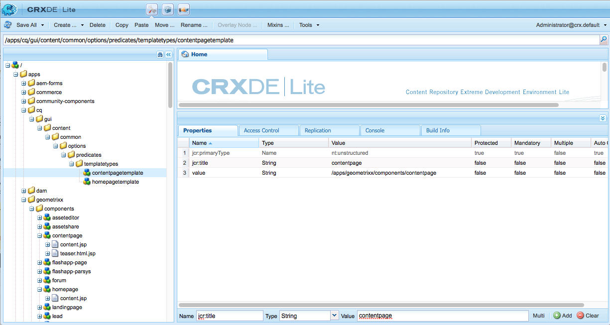
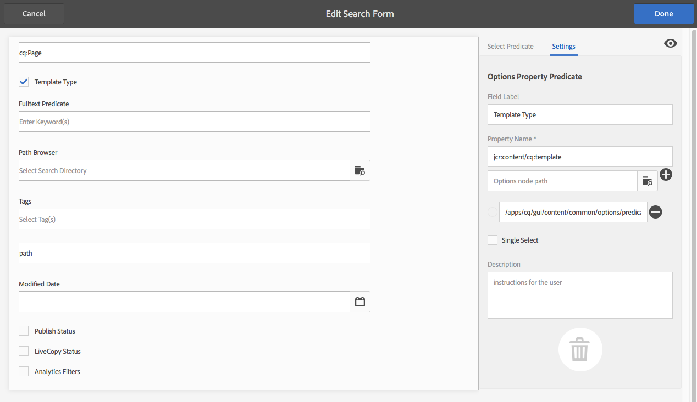
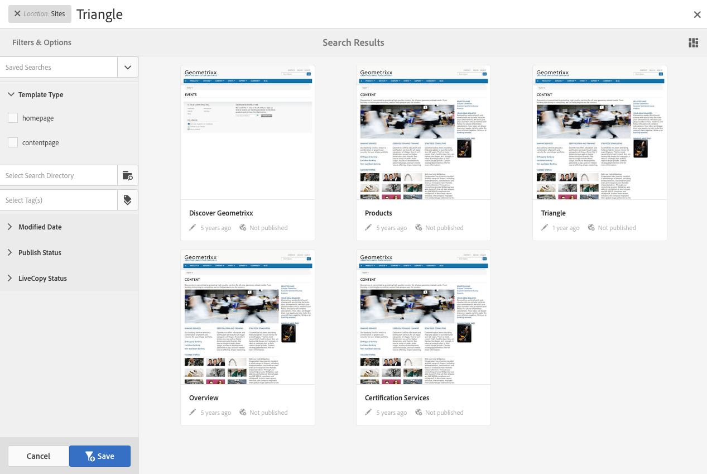

# Configurar formularios de búsqueda{#configuring-search-forms}

Utilice **Buscar en Forms** para personalizar la selección de predicados de búsqueda utilizados en los paneles de búsqueda disponibles en varias consolas de AEM y/o paneles del entorno de creación. La personalización de estos paneles hace que la funcionalidad de búsqueda sea versátil según sus necesidades específicas.

Hay un [rango de predicado](#predicates-and-their-settings)s disponible de forma predeterminada. Puede agregar varios predicados, incluido (entre otros) el predicado de texto completo para búsquedas de texto completo, el predicado de propiedades para buscar recursos que coincidan con una sola propiedad especificada por usted o el predicado de opciones para buscar recursos que coincidan con uno o más valores especificados para una propiedad concreta.

Puede [configurar los formularios de búsqueda](#configuring-your-search-forms) utilizados en varias consolas y en el explorador de recursos (al editar páginas). Se puede acceder a los [cuadros de diálogo para configurar estos formularios](#configuring-your-search-forms) mediante:

* **Herramientas**

   * **General**

      * **Formularios de búsqueda**

Cuando accede por primera vez a esta consola, puede ver que todas las configuraciones tienen un símbolo de cerrojo. Esto indica que la configuración adecuada es la configuración predeterminada (lista para usar) y no se puede eliminar. Una vez que haya personalizado la configuración, el bloqueo desaparecerá, a menos que [elimine la configuración personalizada](#deleting-a-configuration-to-reinstate-the-default), en cuyo caso se restablecerá el valor predeterminado (y el indicador de cerrojo).

## Configuraciones {#configurations}

Las configuraciones predeterminadas disponibles son:

* **Editor de páginas (búsqueda de documentos):**

   Esta configuración define las opciones disponibles al buscar documentos en el navegador de recursos (al editar una página).

* **Editor de páginas (búsqueda de imágenes):**

   Esta configuración define las opciones disponibles al buscar imágenes en el navegador de recursos (al editar una página).

* **Editor de páginas (búsqueda de manuscritos):**

   Esta configuración define las opciones disponibles al buscar manuscritos en el navegador de recursos (al editar una página).

* **Editor de páginas (búsqueda de páginas):**

   Esta configuración define las opciones disponibles al buscar páginas en el navegador de recursos (al editar una página).

* **Editor de páginas (búsqueda de párrafos):**

   Esta configuración define las opciones disponibles al buscar párrafos en el navegador de recursos (al editar una página).

* **Editor de páginas (búsqueda de productos):**

   Esta configuración define las opciones disponibles al buscar productos en el navegador de recursos (al editar una página).

* **Editor de páginas (Dynamic Media Classic  [anteriormente Scene7] search)**:

   Esta configuración define las opciones disponibles al buscar recursos de Scene7 en el navegador de recursos (al editar una página).

* **Carril de búsqueda de administración de sitios**:

   Esta configuración define las opciones de búsqueda disponibles para el usuario al utilizar el carril de búsqueda de la consola Sitios.

* **Editor de páginas (búsqueda de vídeos):**

   Esta configuración define las opciones disponibles al buscar vídeos en el navegador de recursos (al editar una página).

* **Carril de búsqueda de administración de recursos:**

   Esta configuración define las opciones de búsqueda disponibles para el usuario al utilizar la consola Recursos.

* **Carril de búsqueda de administración de catálogos:**

   Esta configuración define las opciones de búsqueda disponibles para el usuario al buscar un catálogo comercial.

* **Carril de búsqueda de administración de pedidos:**

   Esta configuración define las opciones de búsqueda disponibles para el usuario al buscar pedidos comerciales.

* **Carril de búsqueda de administración de las colecciones de productos:**

   Esta configuración define las opciones de búsqueda disponibles para el usuario al buscar colecciones de productos comerciales.

* **Carril de búsqueda de administración de productos:**

   Esta configuración define las opciones de búsqueda disponibles para el usuario al buscar productos comerciales.

* **Carril de búsqueda de administración de proyecto:**

   Esta configuración define las opciones de búsqueda disponibles para el usuario al buscar proyectos.

## Predicados y su configuración {#predicates-and-their-settings}

### Predicados {#predicates}

Los siguientes predicados están disponibles, según la configuración:

<table>
 <tbody>
  <tr>
   <th>Predicado</th>
   <th>Función</th>
   <th>Configuración</th>
  </tr>
  <tr>
   <td>Análisis </td>
   <td>Funciones de búsqueda/filtro en el navegador Sitios al mostrar datos con alimentación de análisis. Los filtros de búsqueda de Analytics se cargan para coincidir con las columnas de análisis personalizados asignadas.</td>
   <td>
    <ul>
     <li>Etiqueta de campo</li>
     <li>Descripción</li>
    </ul> </td>
  </tr>
  <tr>
   <td>Última modificación del recurso </td>
   <td>Fecha de la última modificación del recurso.  </td>
   <td>Un predicado personalizado, basado en el predicado de fecha.</td>
  </tr>
  <tr>
   <td>Componentes </td>
   <td>Permite que un autor busque o filtre páginas que tengan un componente específico. Por ejemplo, una galería de imágenes.  </td>
   <td>
    <ul>
     <li>Etiqueta de campo</li>
     <li>Marcador de posición</li>
     <li>Nombre de propiedad*</li>
     <li>Profundidad de la propiedad</li>
     <li>Descripción</li>
    </ul> </td>
  </tr>
  <tr>
   <td>Fecha </td>
   <td>Búsqueda de recursos basada en deslizadores basada en una propiedad de fecha.</td>
   <td>
    <ul>
     <li>Etiqueta de campo</li>
     <li>Nombre de propiedad*</li>
     <li>Descripción</li>
    </ul> </td>
  </tr>
  <tr>
   <td>Intervalo de fechas </td>
   <td>Buscar recursos creados dentro de un intervalo especificado para una propiedad de fecha. En el panel Buscar, puede especificar las fechas de Inicio y finalización.</td>
   <td>
    <ul>
     <li>Etiqueta de campo</li>
     <li>Marcador de posición</li>
     <li>Nombre de propiedad*</li>
     <li>Texto de intervalo (desde)*</li>
     <li>Texto de intervalo (hasta)*</li>
     <li>Descripción</li>
    </ul> </td>
  </tr>
  <tr>
   <td>Estado de caducidad </td>
   <td>Buscar recursos según el estado de caducidad.</td>
   <td>
    <ul>
     <li>Etiqueta de campo</li>
     <li>Nombre de propiedad*</li>
     <li>Descripción</li>
    </ul> </td>
  </tr>
  <tr>
   <td>Tamaño del archivo </td>
   <td>Busque recursos según su tamaño.</td>
   <td>
    <ul>
     <li>Etiqueta de campo</li>
     <li>Nombre de propiedad*</li>
     <li>Ruta de opción</li>
     <li>Descripción</li>
    </ul> </td>
  </tr>
  <tr>
   <td>Texto completo </td>
   <td>Busque predicado para búsquedas de texto completo.</td>
   <td>
    <ul>
     <li>Etiqueta de campo</li>
     <li>Marcador de posición</li>
     <li>Nombre de propiedad</li>
     <li>Descripción</li>
    </ul> </td>
  </tr>
  <tr>
   <td>Filtro oculto</td>
   <td>Filtro de propiedad y valor, que no es visible para el usuario.</td>
   <td>
    <ul>
     <li>Nombre de propiedad</li>
     <li>Valor de propiedad</li>
     <li>Descripción</li>
    </ul> </td>
  </tr>
  <tr>
   <td>Opciones </td>
   <td>
Las opciones son nodos de contenido creados por el usuario.
 
Consulte <a href="#addinganoptionspredicate">Añadir un predicado de opciones</a> para obtener más información.
 </td>
   <td>
    <ul>
     <li>Etiqueta de campo</li>
     <li>Ruta de JSON</li>
     <li>Nombre de propiedad*</li>
     <li>Una sola selección</li>
     <li>Ruta de opción</li>
     <li>Descripción</li>
    </ul> </td>
  </tr>
  <tr>
   <td>Options (propiedad) </td>
   <td>Busque en una propiedad de la opción.</td>
   <td>
    <ul>
     <li>Etiqueta de campo</li>
     <li>Nombre de propiedad*</li>
     <li>Ruta del nodo de opciones  </li>
     <li>Una sola selección</li>
     <li>Descripción</li>
    </ul> </td>
  </tr>
  <tr>
   <td>página Estado </td>
   <td>Buscar páginas según su estado.</td>
   <td>
    <ul>
     <li>Etiqueta de campo</li>
     <li>Nombre de la propiedad de publicación</li>
     <li>Nombre de la propiedad de LiveCopy</li>
     <li>Descripción</li>
    </ul> </td>
  </tr>
  <tr>
   <td>Ruta </td>
   <td>Buscar recursos ubicados bajo una ruta específica.</td>
   <td>
    <ul>
     <li>Etiqueta de campo</li>
     <li>Añadir ruta de búsqueda</li>
     <li>Descripción</li>
    </ul> </td>
  </tr>
  <tr>
   <td>Propiedad </td>
   <td>Busque en una propiedad especificada.</td>
   <td>ninguno</td>
  </tr>
  <tr>
   <td>Estado de publicación </td>
   <td>Buscar recursos en función de su estado de publicación</td>
   <td>
    <ul>
     <li>Etiqueta de campo</li>
     <li>Nombre de propiedad*</li>
     <li>Descripción</li>
    </ul> </td>
  </tr>
  <tr>
   <td>Intervalo </td>
   <td>Buscar recursos que se encuentran dentro de un rango especificado. En el panel Buscar, puede especificar los valores mínimo y máximo para el rango.</td>
   <td>
    <ul>
     <li>Etiqueta de campo</li>
     <li>Nombre de propiedad</li>
     <li>Descripción</li>
    </ul> </td>
  </tr>
  <tr>
   <td>Opciones del intervalo </td>
   <td>Un predicado de búsqueda específico para Recursos y el mismo predicado de deslizador común. Todavía está disponible debido a problemas de compatibilidad con versiones anteriores.</td>
   <td>
    <ul>
     <li>Etiqueta de campo</li>
     <li>Nombre de propiedad*</li>
     <li>Ruta de opción</li>
     <li>Descripción</li>
    </ul> </td>
  </tr>
  <tr>
   <td>Clasificación </td>
   <td>Buscar recursos según su clasificación.  </td>
   <td>
    <ul>
     <li>Etiqueta de campo</li>
     <li>Nombre de propiedad*</li>
     <li>Ruta de opción</li>
     <li>Descripción</li>
    </ul> </td>
  </tr>
  <tr>
   <td>Fecha relativa </td>
   <td>Buscar recursos en función de la fecha relativa de su creación  </td>
   <td>
    <ul>
     <li>Etiqueta de campo</li>
     <li>Nombre de propiedad*</li>
     <li>Fecha relativa</li>
     <li>Descripción</li>
    </ul> </td>
  </tr>
  <tr>
   <td>Intervalo del regulador </td>
   <td>Un predicado de búsqueda común que amplía el predicado de rango con la capacidad deslizante. El valor de la propiedad en la que se busca debe estar entre los límites del deslizador.</td>
   <td>
    <ul>
     <li>Etiqueta de campo</li>
     <li>Nombre de propiedad*</li>
     <li>Descripción</li>
    </ul> </td>
  </tr>
  <tr>
   <td>Etiqueta </td>
   <td>Buscar recursos en función de etiquetas. Puede configurar la propiedad Ruta para rellenar varias etiquetas en la lista Etiquetas.</td>
   <td>
    <ul>
     <li>Etiqueta de campo</li>
     <li>Nombre de propiedad*</li>
     <li>Ruta de opción</li>
     <li>Descripción</li>
    </ul> </td>
  </tr>
  <tr>
   <td>Etiquetas </td>
   <td>Búsqueda basada en etiquetas.</td>
   <td>
    <ul>
     <li>Marcador de posición</li>
     <li>Nombre de propiedad*</li>
     <li>Descripción</li>
    </ul> </td>
  </tr>
 </tbody>
</table>

>[!NOTE]
>
>* Los predicados de búsqueda comunes se definen en:
   >  `/libs/cq/gui/components/common/admin/customsearch/searchpredicates`
   >
   >
   >

* Los predicados de búsqueda relacionados solo con siteadmin (IU clásica) se encuentran en:
   > `/libs/cq/gui/components/siteadmin/admin/searchpanel/searchpredicates`
   >   * Están en desuso y solo están disponibles para compatibilidad con versiones anteriores.

>
>
Esta información es sólo de referencia, no debe realizar cambios en `/libs`.

### Configuración de predicado {#predicate-settings}

Según el predicado, hay una selección de opciones disponibles para la configuración:

* **Etiqueta de campo**

   Etiqueta que aparecerá como encabezado contraíble o como etiqueta de campo del predicado.

* **Descripción**

   Detalles descriptivos para el usuario.

* **Marcador de posición**

   Texto vacío o marcador de posición del predicado en caso de que no se introduzca ningún texto de filtrado.

* **Nombre de propiedad**

   La propiedad en la que se buscará. Utiliza una ruta de acceso relativa y los comodines `*/*/*` especifican la profundidad de la propiedad en relación con el nodo `jcr:content` (cada asterisco representa un nivel de nodo).

   Si solo desea buscar en un nodo secundario de primer nivel del recurso que tenga la propiedad `x` en el nodo `jcr:content`, utilice `*/jcr:content/x`

* **Profundidad de la propiedad**

   Profundidad máxima para buscar esa propiedad dentro de los recursos. Así, se puede realizar una búsqueda en esa propiedad en un recurso y en elementos secundarios recursivos hasta que el nivel de elementos secundarios sea igual a la profundidad especificada.

* **Valor de propiedad**

   El valor de la propiedad como una cadena absoluta o como lenguaje de expresión; por ejemplo, `cq:Page` o

   `${empty requestPathInfo.suffix ? "/content" : requestPathInfo.suffix}`.

* **Texto de rango**

   Etiqueta del campo de intervalo en el predicado **Intervalo de fecha**.

* **Ruta de opción**

   El usuario puede seleccionar la ruta mediante el Explorador de rutas en la ficha de configuración del predicado. Después de seleccionar el icono **+** se utiliza para agregar la selección a la lista de opciones válidas (luego el icono **-** para eliminar si es necesario).

   Las opciones son nodos de contenido creados por el usuario, con la siguiente estructura:

   `(jcr:primaryType = nt:unstructured, value (String), jcr:title (String))`

* **Options node**
pathEfectivamente igual que el 
**Ruta** de opciones, solo que se encuentra en el campo predicado común, mientras que el otro es específico para recursos.

* **Una sola**
selecciónSi está activada, las opciones se procesan como casillas de verificación que solo permiten una selección. Si se selecciona por error, se puede anular la selección de una casilla de verificación.

* **Nombre(s) de la propiedad Publicar y Live Copy**
Las etiquetas de las casillas de verificación de publicación y Live Copy para el predicado específico Sitios.

* &amp;ast; en las etiquetas de campo de la ficha **Configuración** significa que los campos son obligatorios y, si se dejan en blanco, aparecerá un mensaje de error

## Configuración de la búsqueda de Forms {#configuring-your-search-forms}

### Creación/Apertura de una Configuración Personalizada {#creating-opening-a-customized-configuration}

1. Vaya a **Herramientas**, **General**, **Buscar en Forms**.

1. Seleccione la configuración que desee personalizar.
1. Utilice el icono **Editar** para abrir la configuración y actualizar.
1. Si desea una nueva personalización, probablemente desee [agregar nuevos campos de predicado y definir la configuración](#add-edit-a-predicate-field-and-define-field-settings) según sea necesario. Si ya existe una personalización, puede seleccionar un campo existente y [actualizar la configuración](#add-edit-a-predicate-field-and-define-field-settings).
1. Seleccione **Listo** para guardar la configuración.

   >[!NOTE]
   >
   >Las configuraciones personalizadas se almacenan (según corresponda) en:
   >
   >* `/apps/cq/gui/content/facets/<option>`
   >* `/apps/commerce/gui/content/facets/<option>`

### Añadir/Editar un campo predicado y definir la configuración de los campos {#add-edit-a-predicate-field-and-define-field-settings}

Puede agregar o editar campos y definir o actualizar su configuración:

1. [Abra la ](#creating-opening-a-customized-configuration) configuración personalizada para la actualización.
1. Si desea agregar un nuevo campo, abra la ficha **Seleccionar predicado** y arrastre el predicado requerido a la ubicación requerida. Por ejemplo, el **predicado de intervalo de fechas**:

   

1. Dependiendo de si:

   * Está agregando un nuevo campo:

      Después de agregar el predicado, se abrirá la ficha **Configuración** y se mostrarán las propiedades que se pueden definir.

   * Desea actualizar un predicado existente:

      Seleccione el campo de predicado (a la derecha) y, a continuación, abra la ficha **Configuración**.
   Por ejemplo, la configuración del **Predicado de intervalo de fechas**:

   

1. Realice los cambios necesarios y confirme con **Listo**.

### Vista preliminar de la configuración de búsqueda {#previewing-the-search-configuration}

1. Seleccione el icono de Previsualización:

   

1. Esto mostrará los formularios de búsqueda tal como se mostrarán (completamente expandidos) en la columna Buscar de la consola adecuada.

   

1. **** Cierre la previsualización para devolver y finalizar la configuración.

### Eliminación de un campo predicado {#deleting-a-predicate-field}

1. [Abra la ](#creating-opening-a-customized-configuration) configuración personalizada para la actualización.
1. Seleccione el campo de predicado (a la derecha), abra la ficha **Configuración** y luego seleccione el icono **Eliminar** (abajo a la izquierda).

   

1. Un cuadro de diálogo solicitará la confirmación de la acción de eliminar.

1. Confirme este y cualquier otro cambio con **Listo**.

### Eliminación de una configuración (para restablecer el valor predeterminado) {#deleting-a-configuration-to-reinstate-the-default}

Una vez que haya personalizado una configuración, se anularán los valores predeterminados. Puede restablecer la configuración predeterminada eliminando la configuración personalizada.

>[!NOTE]
>
>No puede eliminar ninguna de las configuraciones predeterminadas.

La eliminación de una configuración personalizada se realiza desde la consola:

1. Seleccione la configuración requerida (por ejemplo, **Editor de páginas (búsqueda de párrafos)**) y, a continuación, el icono **Eliminar** en la barra de herramientas:

   

1. Se eliminará la configuración personalizada y se restablecerá la configuración predeterminada (esto se indica con la reaparición del símbolo de cerrojo en la consola).

### Añadir predicados de opciones {#adding-options-predicates}

Los predicados de opciones (Opciones, Propiedad de opciones) permiten configurar un elemento que se va a buscar. Normalmente se utilizan para buscar algo directamente debajo de la página; por ejemplo, una propiedad en el nodo de página.

El siguiente ejemplo (para buscar según la plantilla utilizada para crear una página) ilustra los pasos involucrados:

1. Cree el nodo que define la propiedad en la que se buscará.

   Necesitará un nodo raíz que contenga definiciones de las opciones individuales para estar disponible para el usuario.

   Los nodos de las opciones individuales necesitan las propiedades:

   * `jcr:title` - la etiqueta de campo que se mostrará en el carril de búsqueda
   * `value` - el valor de propiedad en el que se buscará

   

   >[!NOTE]
   >
   >Usted ***no debe*** cambiar nada en la ruta `/libs`.
   >
   >Esto se debe a que el contenido de `/libs` se sobrescribe la próxima vez que actualice la instancia (y bien puede sobrescribirse al aplicar una revisión o un paquete de funciones).
   >
   >El método recomendado para la configuración y otros cambios es:
   >
   >1. Vuelva a crear el elemento requerido, tal como existe en `/libs`, en `/apps`. En este caso, de:
   >1. `/libs/cq/gui/content/common/options/predicates`
   >1. Realice cualquier cambio dentro de `/apps.`

1. Abra la consola **Buscar en Forms** y seleccione la configuración que desee actualizar. Por ejemplo: **Barra de búsqueda de administración del sitio**.

   A continuación, toque o haga clic en el icono **Editar formularios de búsqueda**.

1. Según la configuración, agregue una **Propiedad** u **Opciones** a la configuración.
1. Actualice los campos, en particular:

   * **Nombre de propiedad**

      Especifique la propiedad node que se buscará en los nodos destinatario. Por ejemplo:

      `jcr:content/cq:template`

   * **Ruta del nodo de opción**

      Seleccione la ruta donde se guardan las opciones. Por ejemplo:

      `/apps/cq/gui/content/common/options/predicates/templatetype`
   

1. Seleccione **Listo** para guardar la configuración.
1. Vaya a la consola adecuada (en este ejemplo, **Sitios**) y abra el carril **Buscar**. Los formularios de búsqueda recién definidos, junto con las diversas opciones, serán visibles. Seleccione la opción requerida para ver los resultados de la búsqueda:

   

## Permisos de usuario {#user-permissions}

La siguiente tabla lista los permisos necesarios para realizar acciones de edición, eliminación y previsualización en los formularios de búsqueda.

<table>
 <tbody>
  <tr>
   <td><strong>Acción</strong></td>
   <td><strong>Permisos   </strong></td>
  </tr>
  <tr>
   <td>Editar </td>
   <td>Permisos de lectura y escritura en el nodo <code>/apps </code>.</td>
  </tr>
  <tr>
   <td>Eliminar</td>
   <td>Permisos de lectura, escritura y eliminación en el nodo <code>/apps</code></td>
  </tr>
  <tr>
   <td>Vista previa</td>
   <td>Permisos de lectura, escritura y eliminación en el nodo <code>/var/dam/content</code>.  Permisos de lectura y escritura en el  <code>/apps</code> nodo.</td>
  </tr>
 </tbody>
</table>

