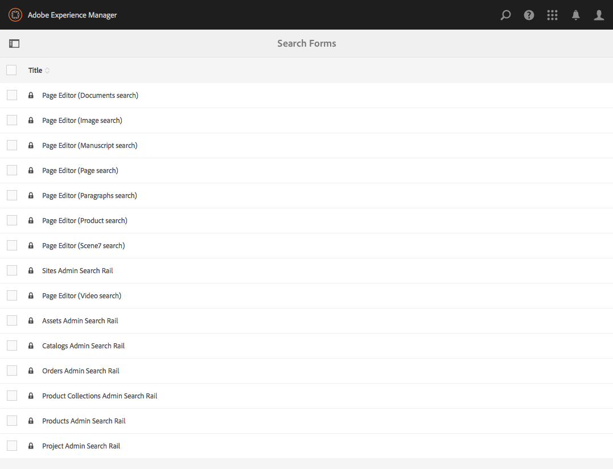

# Configurar formularios de búsqueda{#configuring-search-forms}

Uso **Buscar Forms** AEM para personalizar la selección de predicados de búsqueda utilizados en los paneles de búsqueda disponibles en varias consolas de o paneles del entorno de creación. La personalización de estos paneles hace que la funcionalidad de búsqueda sea versátil según sus necesidades específicas.

A [rango de predicado](#predicates-and-their-settings)Las están disponibles de forma predeterminada. Puede agregar varios predicados, incluido (entre otros) el predicado Propiedad, para buscar recursos que coincidan con una sola propiedad especificada por usted. O bien, el predicado Opciones para buscar recursos que coincidan con uno o varios valores especificados para una propiedad en particular.

Puede [configuración de los formularios de búsqueda](#configuring-your-search-forms) se utiliza en varias consolas y en el explorador de recursos (al editar páginas). El [cuadros de diálogo para configurar estos formularios](#configuring-your-search-forms) se puede acceder a través de:

* **Herramientas**

   * **General**

      * **Buscar Forms**

Cuando acceda por primera vez a esta consola, verá que todas las configuraciones tienen un símbolo de candado. Esto indica que la configuración adecuada es la predeterminada (predeterminada) y no se puede eliminar. Después de personalizar la configuración, el bloqueo desaparece a menos que [elimine la configuración personalizada](#deleting-a-configuration-to-reinstate-the-default). En tal caso, se restablece el valor predeterminado (y el indicador de candado).

## Configuraciones {#configurations}

Las configuraciones predeterminadas disponibles son las siguientes:

* **Editor de páginas (búsqueda de documentos):**

  Esta configuración define las opciones disponibles al buscar documentos en el explorador de recursos (al editar una página).

* **Editor de páginas (búsqueda de imágenes):**

  Esta configuración define las opciones disponibles al buscar imágenes en el explorador de recursos (al editar una página).

* **Editor de páginas (búsqueda de manuscritos):**

  Esta configuración define las opciones disponibles al buscar manuscritos en el explorador de recursos (al editar una página).

* **Editor de páginas (búsqueda de páginas):**

  Esta configuración define las opciones disponibles al buscar páginas en el explorador de recursos (al editar una página).

* **Editor de páginas (búsqueda de párrafos):**

  Esta configuración define las opciones disponibles al buscar párrafos en el explorador de recursos (al editar una página).

* **Editor de páginas (búsqueda de productos):**

  Esta configuración define las opciones disponibles al buscar productos en el explorador de recursos (al editar una página).

* **Editor de páginas (Dynamic Media Classic) [anteriormente Scene7] search)**:

  Esta configuración define las opciones disponibles al buscar recursos de Scene7 en el explorador de recursos (al editar una página).

* **Carril de búsqueda de administración de sitios**:

  Esta configuración define las opciones de búsqueda disponibles para el usuario al utilizar el carril de búsqueda de la consola Sitios.

* **Editor de páginas (búsqueda de vídeos):**

  Esta configuración define las opciones disponibles al buscar vídeos en el explorador de recursos (al editar una página).

* **Carril de búsqueda de administración de Assets:**

  Esta configuración define las opciones de búsqueda disponibles para el usuario al utilizar la consola Recursos.

* **Carril de búsqueda de administración de catálogos:**

  Esta configuración define las opciones de búsqueda disponibles para el usuario al buscar en un catálogo comercial.

* **Carril de búsqueda de administración de pedidos:**

  Esta configuración define las opciones de búsqueda disponibles para el usuario al buscar pedidos comerciales.

* **Carril de búsqueda de administración de colecciones de productos:**

  Esta configuración define las opciones de búsqueda disponibles para el usuario al buscar colecciones de productos de comercio.

* **Carril de búsqueda de administración de productos:**

  Esta configuración define las opciones de búsqueda disponibles para el usuario al buscar productos de comercio.

* **Carril de búsqueda del administrador del proyecto:**

  Esta configuración define las opciones de búsqueda disponibles para el usuario al buscar proyectos.

## Predicados y su configuración {#predicates-and-their-settings}

### Predicados {#predicates}

Los siguientes predicados están disponibles, según la configuración:

<table>
 <tbody>
  <tr>
   <th>Predicado</th>
   <th>Función</th>
   <th>Ajustes</th>
  </tr>
  <tr>
   <td>Análisis </td>
   <td>Funciones de búsqueda y filtrado en el explorador de sitios al mostrar datos con análisis. Los filtros de búsqueda de Analytics se cargan para coincidir con las columnas de Analytics personalizadas asignadas.</td>
   <td>
    <ul>
     <li>Etiqueta de campo</li>
     <li>Descripción</li>
    </ul> </td>
  </tr>
  <tr>
   <td>Última modificación del recurso </td>
   <td>Fecha de la última modificación del recurso.  </td>
   <td>Un predicado personalizado, basado en el predicado de fecha.</td>
  </tr>
  <tr>
   <td>Componentes </td>
   <td>Permite a un autor buscar/filtrar páginas que tienen un componente específico en él. Por ejemplo, una galería de imágenes.  </td>
   <td>
    <ul>
     <li>Etiqueta de campo</li>
     <li>Marcador de posición</li>
     <li>Nombre de propiedad*</li>
     <li>Profundidad de la propiedad</li>
     <li>Descripción</li>
    </ul> </td>
  </tr>
  <tr>
   <td>Fecha </td>
   <td>Búsqueda basada en el deslizador de recursos basada en una propiedad de fecha.</td>
   <td>
    <ul>
     <li>Etiqueta de campo</li>
     <li>Nombre de propiedad*</li>
     <li>Descripción</li>
    </ul> </td>
  </tr>
  <tr>
   <td>Intervalo de fechas </td>
   <td>Busque recursos creados dentro de un intervalo especificado para una propiedad de fecha. En el panel Buscar, puede especificar las fechas de inicio y finalización.</td>
   <td>
    <ul>
     <li>Etiqueta de campo</li>
     <li>Marcador de posición</li>
     <li>Nombre de propiedad*</li>
     <li>Texto de intervalo (desde)*</li>
     <li>Texto de intervalo (hasta)*</li>
     <li>Descripción</li>
    </ul> </td>
  </tr>
  <tr>
   <td>Estado de caducidad </td>
   <td>Buscar recursos en función del estado de caducidad.</td>
   <td>
    <ul>
     <li>Etiqueta de campo</li>
     <li>Nombre de propiedad*</li>
     <li>Descripción</li>
    </ul> </td>
  </tr>
  <tr>
   <td>Tamaño del archivo </td>
   <td>Busque recursos en función de su tamaño.</td>
   <td>
    <ul>
     <li>Etiqueta de campo</li>
     <li>Nombre de propiedad*</li>
     <li>Ruta de opción</li>
     <li>Descripción</li>
    </ul> </td>
  </tr>
  <tr>
   <td>Filtro oculto</td>
   <td>Un filtro de propiedad y valor, no visible para el usuario.</td>
   <td>
    <ul>
     <li>Nombre de la propiedad</li>
     <li>Valor de propiedad</li>
     <li>Descripción</li>
    </ul> </td>
  </tr>
  <tr>
   <td>Opciones </td>
   <td>
Las opciones son nodos de contenido creados por el usuario.
 
Consulte <a href="#addinganoptionspredicate">Adición de un predicado de opciones</a> para obtener más información.
 </td>
   <td>
    <ul>
     <li>Etiqueta de campo</li>
     <li>Ruta de JSON</li>
     <li>Nombre de propiedad*</li>
     <li>Una sola selección</li>
     <li>Ruta de opción</li>
     <li>Descripción</li>
    </ul> </td>
  </tr>
  <tr>
   <td>Propiedad Options </td>
   <td>Busque en una propiedad de la opción.</td>
   <td>
    <ul>
     <li>Etiqueta de campo</li>
     <li>Nombre de propiedad*</li>
     <li>Ruta del nodo de opciones  </li>
     <li>Una sola selección</li>
     <li>Descripción</li>
    </ul> </td>
  </tr>
  <tr>
   <td>Estado de la página </td>
   <td>Buscar páginas según su estado.</td>
   <td>
    <ul>
     <li>Etiqueta de campo</li>
     <li>Nombre de la propiedad de publicación</li>
     <li>Nombre de la propiedad de LiveCopy</li>
     <li>Descripción</li>
    </ul> </td>
  </tr>
  <tr>
   <td>Ruta </td>
   <td>Busque recursos ubicados en una ruta específica.</td>
   <td>
    <ul>
     <li>Etiqueta de campo</li>
     <li>Añadir ruta de búsqueda</li>
     <li>Descripción</li>
    </ul> </td>
  </tr>
  <tr>
   <td>Propiedad </td>
   <td>Busque en una propiedad especificada.</td>
   <td>ninguno</td>
  </tr>
  <tr>
   <td>Estado de publicación </td>
   <td>Buscar recursos en función de su estado de publicación</td>
   <td>
    <ul>
     <li>Etiqueta de campo</li>
     <li>Nombre de propiedad*</li>
     <li>Descripción</li>
    </ul> </td>
  </tr>
  <tr>
   <td>Intervalo </td>
   <td>Busque recursos que se encuentren dentro de un rango especificado. En el panel Buscar, puede especificar los valores mínimo y máximo del rango.</td>
   <td>
    <ul>
     <li>Etiqueta de campo</li>
     <li>Nombre de la propiedad</li>
     <li>Descripción</li>
    </ul> </td>
  </tr>
  <tr>
   <td>Opciones del intervalo </td>
   <td>Un predicado de búsqueda específico para Assets y el mismo que el predicado de regulador común. Sigue disponible debido a problemas de compatibilidad con versiones anteriores.</td>
   <td>
    <ul>
     <li>Etiqueta de campo</li>
     <li>Nombre de propiedad*</li>
     <li>Ruta de opción</li>
     <li>Descripción</li>
    </ul> </td>
  </tr>
  <tr>
   <td>Clasificación </td>
   <td>Busque recursos según su clasificación.  </td>
   <td>
    <ul>
     <li>Etiqueta de campo</li>
     <li>Nombre de propiedad*</li>
     <li>Ruta de opción</li>
     <li>Descripción</li>
    </ul> </td>
  </tr>
  <tr>
   <td>Fecha relativa </td>
   <td>Busque recursos en función de la fecha relativa de su creación  </td>
   <td>
    <ul>
     <li>Etiqueta de campo</li>
     <li>Nombre de propiedad*</li>
     <li>Fecha relativa</li>
     <li>Descripción</li>
    </ul> </td>
  </tr>
  <tr>
   <td>Intervalo del regulador </td>
   <td>Un predicado de búsqueda común que amplía el predicado de intervalo con la capacidad del control deslizante. El valor de la propiedad buscada debe estar entre los límites del control deslizante.</td>
   <td>
    <ul>
     <li>Etiqueta de campo</li>
     <li>Nombre de propiedad*</li>
     <li>Descripción</li>
    </ul> </td>
  </tr>
  <tr>
   <td>Etiqueta </td>
   <td>Busque recursos en función de etiquetas. Puede configurar la propiedad Ruta para rellenar varias etiquetas en la lista Etiquetas.</td>
   <td>
    <ul>
     <li>Etiqueta de campo</li>
     <li>Nombre de propiedad*</li>
     <li>Ruta de opción</li>
     <li>Descripción</li>
    </ul> </td>
  </tr>
  <tr>
   <td>Etiquetas </td>
   <td>Busque en función de las etiquetas.</td>
   <td>
    <ul>
     <li>Marcador de posición</li>
     <li>Nombre de propiedad*</li>
     <li>Descripción</li>
    </ul> </td>
  </tr>
 </tbody>
</table>

>[!NOTE]
>
>* Los predicados de búsqueda comunes se definen en:
>  `/libs/cq/gui/components/common/admin/customsearch/searchpredicates`
>
>* Los predicados de búsqueda relacionados únicamente con siteadmin (IU clásica) se encuentran en:
>  `/libs/cq/gui/components/siteadmin/admin/searchpanel/searchpredicates`
>   * Están en desuso y solo están disponibles para la compatibilidad con versiones anteriores.
>
>Esta información es solo de referencia. No cambiar `/libs`.

### Configuración de predicado {#predicate-settings}

En función del predicado, hay una selección de opciones disponibles para la configuración:

* **Etiqueta de campo**

  La etiqueta que aparece como encabezado contraíble o como etiqueta de campo del predicado.

* **Descripción**

  Detalles descriptivos del usuario.

* **Marcador**

  Texto vacío o el marcador de posición del predicado en caso de que no se introduzca ningún texto de filtrado.

* **Nombre de propiedad**

  Propiedad en la que se va a buscar. Utiliza una ruta relativa y los comodines `*/*/*` especifique la profundidad de la propiedad en relación con `jcr:content` nodo (cada asterisco representa un nivel de nodo).

  Si desea buscar únicamente en un nodo secundario de primer nivel del recurso que tiene la variable `x` propiedad en el `jcr:content` uso de nodo `*/jcr:content/x`

* **Profundidad de propiedad**

  Profundidad máxima para buscar esa propiedad dentro de los recursos. Por lo tanto, se puede realizar una búsqueda de esa propiedad en un recurso y en elementos secundarios recursivos hasta que el nivel de los elementos secundarios sea igual a la profundidad especificada.

* **Valor de propiedad**

  El valor de la propiedad como cadena absoluta o como lenguaje de expresión; por ejemplo, `cq:Page` o

  `${empty requestPathInfo.suffix ? "/content" : requestPathInfo.suffix}`.

* **Texto de intervalo**

  La etiqueta del campo de rango en la variable **Intervalo de fechas** predicado.

* **Ruta de opción**

  El usuario puede seleccionar la ruta mediante el Explorador de rutas en la pestaña de configuración de predicado. Después de seleccionar **+**, se utiliza el icono para añadir la selección a la lista de opciones válidas (y luego el icono **-** para eliminar, si es necesario).

  Las opciones son nodos de contenido creados por el usuario que tienen la siguiente estructura:

  `(jcr:primaryType = nt:unstructured, value (String), jcr:title (String))`

* **Ruta del nodo de opciones**
Efectivamente igual que el **Ruta de opciones**, solo esto se encuentra en el campo de predicado común, el otro es específico para los recursos.

* **Selección única**
Si se selecciona, las opciones se representan como casillas de verificación que permiten solo una selección. Si se selecciona por error, se puede anular la selección de una casilla de verificación.

* **Nombres de propiedades de publicación y Live Copy**
Las etiquetas de las casillas de verificación de publicación y Live Copy para el predicado específico de Sites.

* &amp;ast; en las etiquetas de campo de la **Configuración** significa que los campos son obligatorios y que, si se deja en blanco, aparece un mensaje de error.

## Configuración de Search Forms {#configuring-your-search-forms}

### Creación/apertura de una configuración personalizada {#creating-opening-a-customized-configuration}

1. Vaya a **Herramientas** >>  **General** >> **Buscar Forms**.

1. Seleccione la configuración que desee personalizar.
1. Utilice el **Editar** para abrir la configuración y actualizarla.
1. Si hay una nueva personalización, es probable que desee [añada nuevos campos de predicado y defina la configuración](#add-edit-a-predicate-field-and-define-field-settings) según sea necesario. Si ya existe una personalización, puede seleccionar un campo existente y [actualizar la configuración](#add-edit-a-predicate-field-and-define-field-settings).
1. Seleccionar **Listo** para guardar la configuración.

   >[!NOTE]
   >
   >Las configuraciones personalizadas se almacenan (según corresponda) en:
   >
   >* `/apps/cq/gui/content/facets/<option>`
   >* `/apps/commerce/gui/content/facets/<option>`

### Adición o edición de un campo de predicado y definición de la configuración del campo {#add-edit-a-predicate-field-and-define-field-settings}

Puede añadir o editar campos y definir o actualizar su configuración:

1. [Abra la configuración personalizada](#creating-opening-a-customized-configuration) para actualizar.
1. Si desea agregar un campo, abra el **Seleccionar predicado** y arrastre el predicado necesario a la ubicación requerida. Por ejemplo, la variable **Predicado de intervalo de fechas**:

   

1. En función de si:

   * Va a añadir un campo:

     Después de agregar el predicado, la variable **Configuración** se abre la pestaña y muestra las propiedades que se pueden definir.

   * Desea actualizar un predicado existente:

     Seleccione el campo de predicado (a la derecha) y abra la variable **Configuración** pestaña.

   Por ejemplo, la configuración de **Predicado de intervalo de fechas**:

   

1. Realice los cambios necesarios y confirme con **Listo**.

### Previsualización de la configuración de búsqueda {#previewing-the-search-configuration}

1. Seleccione el icono Vista previa:

   

1. Esto muestra los formularios de búsqueda tal como se muestran (totalmente expandidos) en la columna Buscar de la consola adecuada.

   

1. **Cerrar** la vista previa para que pueda devolver y finalizar la configuración.

### Eliminación de un campo de predicado {#deleting-a-predicate-field}

1. [Abra la configuración personalizada](#creating-opening-a-customized-configuration) para actualizar.
1. Seleccione el campo de predicado (a la derecha) y abra el **Configuración** y, a continuación, seleccione **Eliminar** (abajo a la izquierda).

   

1. Un cuadro de diálogo solicita confirmación de la acción de eliminación.

1. Confirme este y cualquier otro cambio con **Listo**.

### Eliminación de una configuración (para restablecer los valores predeterminados) {#deleting-a-configuration-to-reinstate-the-default}

Después de personalizar una configuración, se anulan los valores predeterminados. Puede restablecer la configuración predeterminada eliminando la configuración personalizada.

>[!NOTE]
>
>No puede eliminar ninguna de las configuraciones predeterminadas.

La eliminación de una configuración personalizada se realiza desde la consola:

1. Seleccione la configuración necesaria (por ejemplo, **Editor de páginas (búsqueda de párrafos)**) y luego el **Eliminar** en la barra de herramientas:

   

1. La configuración personalizada se elimina y se restaura el valor predeterminado (esto se indica con la reaparición del símbolo de candado en la consola).

### Adición de predicados de opciones {#adding-options-predicates}

Los predicados de opciones (Options, Options, Property) permiten configurar un elemento para buscarlo. Se utilizan para buscar algo directamente debajo de la página; por ejemplo, una propiedad en el nodo de la página.

El siguiente ejemplo (para buscar según la plantilla utilizada para crear una página), ilustra los pasos involucrados:

1. Cree el nodo que define la propiedad en la que se va a buscar.

   Necesita un nodo raíz que contenga definiciones de las opciones individuales que deben estar disponibles para el usuario.

   Los nodos de las opciones individuales necesitan las propiedades:

   * `jcr:title` - la etiqueta del campo que se mostrará en el carril de búsqueda
   * `value` : el valor de propiedad en el que se va a buscar

   

   >[!NOTE]
   >
   >Hacer ***no*** cambiar cualquier cosa en `/libs` ruta.
   >
   >Esto se debe al contenido de `/libs` se sobrescribe la próxima vez que actualice la instancia (y es posible que se sobrescriba al aplicar una revisión o un paquete de funciones).
   >
   >El método recomendado para la configuración y otros cambios es:
   >
   >1. Vuelva a crear el elemento necesario, tal como existe en `/libs`, en `/apps`. En este caso de:
   >1. `/libs/cq/gui/content/common/options/predicates`
   >1. Realice cualquier cambio en `/apps.`

1. Abra el **Buscar Forms** y seleccione la configuración que desee actualizar. Por ejemplo, **Carril de búsqueda de administración de sitios**.

   Luego haga clic en **Editar formularios de búsqueda** icono.

1. Según la configuración, añada una **Opciones** o **Propiedad Options** a la configuración.
1. Actualice los campos, en particular:

   * **Nombre de propiedad**

     Especifica la propiedad del nodo que se va a buscar en los nodos de destino. Por ejemplo:

     `jcr:content/cq:template`

   * **Ruta del nodo de opción**

     Seleccione la ruta donde se guardan las opciones. Por ejemplo:

     `/apps/cq/gui/content/common/options/predicates/templatetype`

   

1. Seleccionar **Listo** para guardar la configuración.
1. Vaya a la consola adecuada (en este ejemplo, **Sites**) y abra el **Buscar** carril. Los formularios de búsqueda recién definidos, junto con las distintas opciones, están visibles. Seleccione la opción necesaria para poder ver los resultados de búsqueda:

   

## Permisos de usuario {#user-permissions}

En la tabla siguiente se enumeran los permisos necesarios para realizar acciones de edición, eliminación y vista previa en formularios de búsqueda.

<table>
 <tbody>
  <tr>
   <td><strong>Acción</strong></td>
   <td><strong>Permisos</strong></td>
  </tr>
  <tr>
   <td>Editar </td>
   <td>Permisos de lectura y escritura en <code>/apps </code>nodo.</td>
  </tr>
  <tr>
   <td>Eliminar</td>
   <td>Permisos de lectura, escritura y eliminación en <code>/apps</code> nodo</td>
  </tr>
  <tr>
   <td>Vista previa</td>
   <td>Permisos de lectura, escritura y eliminación en <code>/var/dam/content</code> nodo.  Permisos de lectura y escritura en <code>/apps</code> nodo.</td>
  </tr>
 </tbody>
</table>
