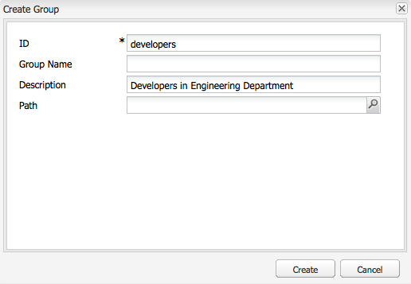
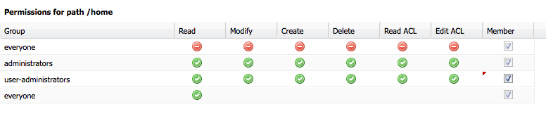

# Administración de usuarios y seguridad{#user-administration-and-security}

En este capítulo se describe cómo configurar y mantener la autorización del usuario y también se describe la teoría en la que se basa el funcionamiento de la autenticación y la autorización en AEM.

## Usuarios y grupos en AEM {#users-and-groups-in-aem}

Esta sección trata las distintas entidades y conceptos relacionados con más detalle para ayudarle a configurar un concepto de administración de usuarios fácil de mantener.

### Usuarios {#users}

Los usuarios iniciarán sesión en AEM con su cuenta. Cada cuenta de usuario es única y contiene los detalles básicos de la cuenta, junto con los privilegios asignados.

Los usuarios suelen ser miembros de Grupos, lo que simplifica la asignación de estos permisos y/o privilegios.

### Grupos {#groups}

Los grupos son colecciones de usuarios y/u otros grupos; todos ellos se denominan miembros de un grupo.

Su principal propósito es simplificar el proceso de mantenimiento reduciendo el número de entidades que se van a actualizar, ya que un cambio realizado en un grupo se aplica a todos los miembros del grupo. Los grupos a menudo reflejan:

* una función dentro de la aplicación; como alguien con permiso para navegar por el contenido o alguien con permiso para contribuir contenido.
* su propia organización; es posible que desee ampliar las funciones para diferenciar entre colaboradores de distintos departamentos cuando estén restringidos a distintas ramas del árbol de contenido.

Por lo tanto, los grupos tienden a permanecer estables, mientras que los usuarios van y vienen con más frecuencia.

Con la planificación y una estructura limpia, el uso de grupos puede reflejar su estructura, proporcionando una visión general clara y un mecanismo eficaz para las actualizaciones.

### Usuarios y grupos integrados {#built-in-users-and-groups}

AEM WCM instala varios usuarios y grupos. Esto se puede ver cuando accede por primera vez a la consola de seguridad después de la instalación.

Las siguientes tablas lista cada elemento junto con:

* una breve descripción
* cualquier recomendación sobre los cambios necesarios

*Cambie todas las contraseñas*  predeterminadas (si no elimina la cuenta en determinadas circunstancias).

<table>
 <tbody>
  <tr>
   <td>ID de usuario</td>
   <td>Tipo</td>
   <td>Descripción</td>
   <td>Recomendación</td>
  </tr>
  <tr>
   <td>
administrador
 
Contraseña predeterminada: admin
 </td>
   <td>Usuario</td>
   <td>
Cuenta de administración del sistema con derechos de acceso completo.
 
Esta cuenta se utiliza para la conexión entre AEM WCM y CRX.
 
Si elimina accidentalmente esta cuenta, se volverá a crear al reiniciar el repositorio (en la configuración predeterminada).
 
La cuenta de administrador es un requisito de la plataforma de AEM. Como consecuencia, esta cuenta no se puede eliminar.
 </td>
   <td>
Adobe recomienda encarecidamente que la contraseña de esta cuenta de usuario se cambie de la predeterminada.
 
Preferiblemente después de la instalación, aunque se puede hacer después.
 
Nota: Esta cuenta no debe confundirse con la cuenta de administrador del motor servlet de CQ.
 </td>
  </tr>
  <tr>
   <td>
anónimo
 
 
 </td>
   <td>Usuario</td>
   <td>
Contiene los derechos predeterminados para el acceso no autenticado a una instancia. De forma predeterminada, contiene los derechos de acceso mínimos.
 
Si elimina accidentalmente esta cuenta, se volverá a crear al iniciar. No se puede eliminar permanentemente, pero se puede deshabilitar.
 </td>
   <td>Evite eliminar o deshabilitar esta cuenta, ya que afectará negativamente el funcionamiento de las instancias de creación. Si existen requisitos de seguridad que le obligan a eliminarlo, asegúrese de probar correctamente primero los efectos que tiene en sus sistemas.</td>
  </tr>
  <tr>
   <td>
author
 
Contraseña predeterminada: author
 </td>
   <td>Usuario</td>
   <td>
Cuenta de autor con permiso para escribir en /content. Abarca los privilegios de colaborador y surfer.
 
Se puede utilizar como webmaster, ya que tiene acceso a todo el árbol /content.
 
No es un usuario integrado, sino otro usuario de demostración de geometrixx
 </td>
   <td>
Adobe recomienda que la cuenta se elimine por completo o que se cambie la contraseña de forma predeterminada.
 
Preferiblemente después de la instalación, aunque se puede hacer después.
 </td>
  </tr>
  <tr>
   <td>administradores</td>
   <td>Agrupar</td>
   <td>
Grupo que otorga derechos de administrador a todos sus miembros. Solo el administrador puede editar este grupo.
 
Tiene derechos de acceso completo.
 </td>
   <td>Si establece un valor de "denegar a todos" en un nodo, los administradores solo tendrán acceso si se vuelve a habilitar para ese grupo.</td>
  </tr>
  <tr>
   <td>content-author</td>
   <td>Agrupar</td>
   <td>
Grupo responsable de la edición de contenido. Requiere permisos de lectura, modificación, creación y eliminación.
 </td>
   <td>Puede crear sus propios grupos de autores de contenido con derechos de acceso específicos del proyecto, siempre que agregue permisos de lectura, modificación, creación y eliminación.</td>
  </tr>
  <tr>
   <td>colaborador</td>
   <td>Agrupar</td>
   <td>
Privilegios básicos que permiten al usuario escribir contenido (solo en funcionalidad).
 
No asigna ningún privilegio al árbol /content: estos deben asignarse específicamente a grupos o usuarios individuales.
 </td>
   <td> </td>
  </tr>
  <tr>
   <td>usuarios de presas</td>
   <td>Agrupar</td>
   <td>Grupo de referencia predeterminado para un usuario típico de AEM Assets. Los miembros de este grupo tienen los privilegios adecuados para permitir la carga y el uso compartido de recursos y colecciones.</td>
   <td> </td>
  </tr>
  <tr>
   <td>todos</td>
   <td>Agrupar</td>
   <td>
Todos los usuarios de AEM son miembros del grupo a todos, aunque es posible que no vea el grupo o la relación de pertenencia en todas las herramientas.
 
Este grupo se puede considerar como derechos predeterminados ya que se puede usar para aplicar permisos para todos, incluso para los usuarios que se crearán en el futuro.
 </td>
   <td>
No modifique ni elimine este grupo.
 
Modificar esta cuenta tiene implicaciones de seguridad adicionales.
 </td>
  </tr>
  <tr>
   <td>administradores de etiquetas</td>
   <td>Agrupar</td>
   <td>Grupo que puede editar etiquetas.</td>
   <td> </td>
  </tr>
  <tr>
   <td>user-administradores</td>
   <td>Agrupar</td>
   <td>Autoriza la administración de usuarios, es decir, el derecho a crear usuarios y grupos.</td>
   <td> </td>
  </tr>
  <tr>
   <td>workflow-editors</td>
   <td>Agrupar</td>
   <td>Grupo que puede crear y modificar modelos de flujo de trabajo.</td>
   <td> </td>
  </tr>
  <tr>
   <td>flujos de trabajo-usuarios</td>
   <td>Agrupar</td>
   <td>
Un usuario que participa en un flujo de trabajo debe ser miembro de grupos de usuarios del flujo de trabajo. Esto le da pleno acceso a: /etc/workflow/instance para que pueda actualizar la instancia de flujo de trabajo.
 
El grupo se incluye en la instalación estándar, pero debe agregar manualmente los usuarios al grupo.
 </td>
  </tr>
 </tbody>
</table>

## Permisos en AEM {#permissions-in-aem}

AEM utiliza ACL para determinar qué acciones puede realizar un usuario o grupo y dónde puede realizar dichas acciones.

### Permisos y ACL {#permissions-and-acls}

Los permisos definen quién puede realizar las acciones en un recurso. Los permisos son el resultado de evaluaciones de [control de acceso](#access-control-lists-and-how-they-are-evaluated).

Puede cambiar los permisos concedidos o denegados a un usuario determinado seleccionando o borrando las casillas de verificación de las acciones [AEM individuales](security.md#actions). Una marca de verificación indica que se permite una acción. Ninguna marca de verificación indica que se ha denegado una acción.

Cuando la marca de verificación se encuentra en la cuadrícula, también indica qué permisos tienen los usuarios en qué ubicaciones de AEM (es decir, qué rutas).

### Acciones {#actions}

Las acciones se pueden realizar en una página (recurso). Para cada página de la jerarquía, puede especificar qué acción puede realizar el usuario en esa página.  Permiso para permitir o denegar una acción.

<table>
 <tbody>
  <tr>
   <td><strong>Acción </strong></td>
   <td><strong>Descripción </strong></td>
  </tr>
  <tr>
   <td>Lectura</td>
   <td>El usuario puede leer la página y las páginas secundarias.</td>
  </tr>
  <tr>
   <td>Modificar</td>
   <td>
El usuario puede:

    <ul>
     <li>modifique el contenido existente en la página y en cualquier página secundaria.</li>
     <li>cree nuevos párrafos en la página o en cualquier página secundaria.</li>
    </ul> 
En el nivel JCR, los usuarios pueden modificar un recurso modificando sus propiedades, bloqueando, creando versiones, sin modificaciones, y tienen permisos de escritura completos en nodos que definen un nodo secundario jcr:content, por ejemplo, cq:Page, nt:file, cq:Asset.
 </td>
  </tr>
  <tr>
   <td>Crear</td>
   <td>
El usuario puede:

    <ul>
     <li>cree una página nueva o una página secundaria.</li>
    </ul> 
Si se deniega <strong>modificar</strong>, los subárboles situados debajo de jcr:content se excluyen específicamente porque la creación de jcr:content y sus nodos secundarios se consideran una modificación de página. Esto solo se aplica a los nodos que definen un nodo secundario jcr:content.
 </td>
  </tr>
  <tr>
   <td>Eliminar</td>
   <td>
El usuario puede:

    <ul>
     <li>elimine los párrafos existentes de la página o de cualquier página secundaria.</li>
     <li>elimine una página o página secundaria.</li>
    </ul> 
Si se deniega <strong>modificar</strong> cualquier subárbol por debajo de jcr:content se excluye específicamente al eliminar jcr:content y sus nodos secundarios se consideran una modificación de página. Esto solo se aplica a los nodos que definen un nodo secundario jcr:content.
 </td>
  </tr>
  <tr>
   <td>Leer ACL</td>
   <td>El usuario puede leer la lista de control de acceso de la página o de las páginas secundarias.</td>
  </tr>
  <tr>
   <td>Editar ACL</td>
   <td>El usuario puede modificar la lista de control de acceso de la página o de cualquier página secundaria.</td>
  </tr>
  <tr>
   <td>Replicar</td>
   <td>El usuario puede replicar contenido en otro entorno (por ejemplo, el entorno de publicación). El privilegio también se aplica a cualquier página secundaria.</td>
  </tr>
 </tbody>
</table>

>[!NOTE]
>
>AEM genera automáticamente grupos de usuarios para la asignación de funciones (Propietario, Editor, Visor) en [Colecciones](/help/assets/manage-collections.md). Sin embargo, la adición manual de ACL para estos grupos puede introducir vulnerabilidades de seguridad dentro de AEM. Adobe recomienda que evite agregar ACL manualmente.

### listas de control de acceso y cómo se evalúan {#access-control-lists-and-how-they-are-evaluated}

AEM WCM utiliza Listas de Control de acceso (ACL) para organizar los permisos que se aplican a las distintas páginas.

Las Listas de control de acceso están compuestas por los permisos individuales y se utilizan para determinar el orden en que se aplican realmente estos permisos. La lista se forma de acuerdo con la jerarquía de las páginas consideradas. A continuación, esta lista se analiza de abajo hacia arriba hasta que se encuentra el primer permiso adecuado para aplicar a una página.

>[!NOTE]
>
>Hay ACL que se incluyen con los ejemplos. Se recomienda que revise y determine qué es lo adecuado para sus aplicaciones. Para revisar las ACL incluidas, vaya a **CRXDE **y seleccione la ficha **Control de acceso** para los nodos siguientes:
>
>`/etc/cloudservices/facebookconnect/geometrixx-outdoorsfacebookapp`:: Permite que todos lean el acceso.
>`/etc/cloudservices/twitterconnect/geometrixx-outdoors-twitter-app`:: Permite que todos lean el acceso.
>`/home/users/geometrixx-outdoors`:: Permite que todos lean acceso para `*/profile*` y
>`*/social/relationships/following/*`.
>
>La aplicación personalizada puede establecer el acceso para otras relaciones, como `*/social/relationships/friend/*` o `*/social/relationships/pending-following/*`.
>
>Al crear ACL específicas para comunidades, los miembros que se unan a esas comunidades pueden recibir permisos adicionales. Por ejemplo, este podría ser el caso cuando los usuarios se unen a las comunidades en `/content/geometrixx-outdoors/en/community/hiking` o `/content/geometrixx-outdoors/en/community/winter-sports`.

### Estados de permisos {#permission-states}

>[!NOTE]
>
>Para usuarios de CQ 5.3:
>
>A diferencia de las versiones anteriores de CQ, **create** y **delete** ya no deben concederse si un usuario solo necesita modificar páginas. En su lugar, conceda la acción **modificar** sólo si desea que los usuarios puedan crear, modificar o eliminar componentes en páginas existentes.
>
>Por razones de compatibilidad con versiones anteriores, las pruebas de acciones no tienen en cuenta el tratamiento especial de los nodos que definen **jcr:content**.

| **Acción** | **Descripción** |
|---|---|
| Permitir (marca de verificación) | AEM WCM permite al usuario realizar la acción en esta página o en cualquier página secundaria. |
| Denegar (sin marca de verificación) | AEM WCM no permite al usuario realizar la acción en esta página ni en ninguna página secundaria. |

Los permisos también se aplican a cualquier página secundaria.

Si un permiso no se hereda del nodo principal pero tiene al menos una entrada local para él, se anexan los siguientes símbolos a la casilla de verificación. Una entrada local es una que se crea en la interfaz CRX 2.2 (actualmente, las ACL comodín solo se pueden crear en CRX).

Para una acción en una ruta determinada:

<table>
 <tbody>
  <tr>
   <td>* (asterisco)</td>
   <td>Hay al menos una entrada local (efectiva o ineficaz). Estas ACL comodín se definen en CRX.</td>
  </tr>
  <tr>
   <td>! (signo de exclamación)</td>
   <td>Hay por lo menos una entrada que no tiene efecto actualmente.</td>
  </tr>
 </tbody>
</table>

Al pasar el ratón sobre el asterisco o el signo de exclamación, una información sobre herramientas proporciona más detalles sobre las entradas declaradas. La información sobre herramientas se divide en dos partes:

<table>
 <tbody>
  <tr>
   <td>Parte superior</td>
   <td>
Lista las entradas efectivas.
 </td>
  </tr>
  <tr>
   <td>Parte inferior</td>
   <td>Lista las entradas no efectivas que pueden tener un efecto en otro lugar del árbol (como indica un atributo especial presente con el ACE correspondiente que limita el ámbito de la entrada). Como alternativa, se trata de una entrada cuyo efecto ha sido revocado por otra entrada definida en la ruta dada o en un nodo antecesor.</td>
  </tr>
 </tbody>
</table>

>[!NOTE]
>
>Si no se definen permisos para una página, se deniegan todas las acciones.

A continuación se ofrecen recomendaciones sobre la administración de listas de control de acceso:

* No asigne permisos directamente a los usuarios. Asignarlos solo a grupos.

   Esto simplificará el mantenimiento, ya que el número de grupos es mucho menor que el número de usuarios y también menos volátiles.

* Si desea que un grupo o usuario solo pueda modificar páginas, no les conceda derechos de creación o denegación. Sólo concederles derechos de modificación y lectura.
* Utilice Denegar con moderación. En la medida de lo posible, utilice sólo Permitir.

   El uso de denegar puede producir efectos inesperados si los permisos se aplican en un orden distinto al esperado. Si un usuario es miembro de más de un grupo, las instrucciones Denegar de un grupo pueden cancelar la instrucción Permitir de otro grupo o viceversa. Es difícil mantener una visión general cuando esto sucede y puede llevar fácilmente a resultados imprevistos, mientras que Permitir asignaciones no provoca tales conflictos.

   Adobe recomienda trabajar con Permitir en lugar de Denegar, consulte [Optimizaciones](#best-practices).

Antes de modificar cualquiera de los permisos, asegúrese de comprender cómo funcionan y cómo se interrelacionan. Consulte la documentación de CRX para ilustrar cómo AEM WCM [evalúa los derechos de acceso](/help/sites-administering/user-group-ac-admin.md#how-access-rights-are-evaluated) y ejemplos de configuración de listas de control de acceso.

### Permisos    {#permissions}

Los permisos proporcionan a los usuarios y grupos acceso a AEM funcionalidad en AEM páginas.

Puede examinar los permisos por ruta expandiendo o contrayendo los nodos y puede rastrear la herencia de permisos hasta el nodo raíz.

Para permitir o denegar permisos, seleccione o desactive las casillas de verificación correspondientes.

### Visualización de información detallada de permisos {#viewing-detailed-permission-information}

Junto con la vista de cuadrícula, AEM proporciona una vista detallada de los permisos para un usuario o grupo seleccionado en una ruta determinada. La vista de detalles proporciona información adicional.

Además de ver información, también puede incluir o excluir al usuario o grupo actual de un grupo. Consulte [Añadir usuarios o grupos al Añadir permisos](#adding-users-or-groups-while-adding-permissions). Los cambios realizados aquí se reflejan inmediatamente en la parte superior de la vista detallada.

Para acceder a la vista de detalles, en la ficha **Permisos**, haga clic en **Detalles** para cualquier grupo/usuario y ruta seleccionados.

Los detalles se dividen en dos partes:

<table>
 <tbody>
  <tr>
   <td>Parte superior</td>
   <td>
Repite la información que se ve en la cuadrícula de árbol. Para cada acción, un icono muestra si la acción está permitida o denegada:

    <ul>
     <li>no icon = no se declaró ninguna entrada</li>
     <li>(visto) = acción declarada (permitir)</li>
     <li>(-) = acción declarada (negar)</li>
    </ul> </td>
  </tr>
  <tr>
   <td>Parte inferior</td>
   <td>
Muestra la cuadrícula de usuarios y grupos que realiza lo siguiente:

    <ul>
     <li>Declara una entrada para la ruta dada Y</li>
     <li>¿Es el OR autorizado determinado un grupo?</li>
    </ul> </td>
  </tr>
 </tbody>
</table>

### Suplantar a otro usuario {#impersonating-another-user}

Con la [funcionalidad de suplantar](/help/sites-authoring/user-properties.md#user-settings) un usuario puede trabajar en nombre de otro usuario.

Esto significa que una cuenta de usuario puede especificar otras cuentas que pueden funcionar con su cuenta. En otras palabras, si se permite que el usuario B suplantara al usuario A, el usuario B puede realizar acciones utilizando los detalles completos de la cuenta del usuario A.

Esto permite que las cuentas del suplantador completen tareas como si estuvieran utilizando la cuenta que están suplantando; por ejemplo, durante una ausencia o para compartir una carga excesiva a corto plazo.

>[!NOTE]
>
>Para que el suplantador funcione para usuarios no administradores, se requiere que el suplantador (en el caso anterior, user-B) tenga permisos READ en la ruta `/home/users`.
>
>Para obtener más información sobre cómo lograr esto, consulte [Permisos en AEM](/help/sites-administering/security.md#permissions-in-aem).

>[!CAUTION]
>
>Si una cuenta se hace pasar por otra es muy difícil de ver. Se realiza una entrada en el registro de auditoría cuando la suplantación termina y inicio, pero los demás archivos de registro (como el registro de acceso) no contienen información sobre el hecho de que se ha producido una suplantación en los eventos. Por lo tanto, si el usuario B se está suplantando al usuario A, todos los eventos se verán como si fueran realizados personalmente por el usuario A.

>[!CAUTION]
>
>El bloqueo de páginas se puede realizar al suplantar a un usuario. Sin embargo, una página bloqueada de este modo solo se puede desbloquear como el usuario que ha suplantado a otro usuario o un usuario con privilegios de administrador.
>
>Las páginas no se pueden bloquear al suplantar al usuario que ha bloqueado la página.

### Prácticas recomendadas    {#best-practices}

A continuación se describen las prácticas recomendadas para trabajar con permisos y privilegios:

| Regla | Motivo |
|--- |--- |
| *Utilizar grupos* | Evite asignar derechos de acceso usuario por usuario. Hay varias razones para esto:<ul><li>Tiene muchos más usuarios que grupos, por lo que los grupos simplifican la estructura.</li><li>Los grupos ayudan a proporcionar información general sobre todas las cuentas.</li> <li>La herencia es más sencilla con los grupos.</li><li>Los usuarios van y vienen. Los grupos son de largo plazo.</li></ul> |
| *Ser positivo* | Utilice siempre las instrucciones Allow para especificar los derechos del grupo (siempre que sea posible). Evite utilizar una instrucción Denegar. Los grupos se evalúan en orden y el orden puede definirse de forma diferente por usuario. En otras palabras: Es posible que tenga poco control sobre el orden en que se implementan y evalúan las sentencias. Si solo utiliza sentencias Allow, el orden no importa. |
| *Manténgalo Simple* | Invertir un poco de tiempo y pensamiento al configurar una nueva instalación será bien pagado. La aplicación de una estructura clara simplificará el mantenimiento y la administración en curso, asegurando que tanto sus colegas actuales como los futuros sucesores puedan comprender fácilmente lo que se está implementando. |
| *Probar* | Utilice una instalación de prueba para practicar y asegurarse de comprender las relaciones entre los distintos usuarios y grupos. |
| *Usuarios/Grupos predeterminados* | Actualice siempre los usuarios y grupos predeterminados inmediatamente después de la instalación para evitar problemas de seguridad. |

## Administración de usuarios y grupos {#managing-users-and-groups}

Entre los usuarios se incluyen personas que utilizan el sistema y sistemas extranjeros que realizan solicitudes al sistema.

Un grupo es un conjunto de usuarios.

Ambos se pueden configurar mediante la funcionalidad Administración de usuarios de la Consola de seguridad.

### Acceso a Administración de usuarios con la Consola de seguridad {#accessing-user-administration-with-the-security-console}

Puede acceder a todos los usuarios, grupos y permisos asociados mediante la consola Seguridad. Todos los procedimientos descritos en esta sección se realizan en esta ventana.

Para acceder a AEM seguridad de WCM, realice una de las siguientes acciones:

* En la pantalla de bienvenida o en varias ubicaciones de AEM, haga clic en el icono de seguridad:

* Navegue directamente a `https://<server>:<port>/useradmin`. Asegúrese de iniciar sesión en AEM como administrador.

Se muestra la siguiente ventana:

El árbol izquierdo lista a todos los usuarios y grupos que están actualmente en el sistema. Puede seleccionar las columnas que desee mostrar, ordenar el contenido de las columnas e incluso cambiar el orden en que se muestran las columnas arrastrando el encabezado de columna a una nueva posición.

Las fichas proporcionan acceso a varias configuraciones:

<!-- ??? in table below. -->

| Ficha | Descripción |
|--- |--- |
| Cuadro de filtro | Mecanismo para filtrar los usuarios y/o grupos enumerados. Consulte [Filtrado de usuarios y grupos](#filtering-users-and-groups). |
| Ocultar usuarios | Un conmutador que ocultará a todos los usuarios de la lista, dejando solo grupos. Consulte [Ocultar usuarios y grupos](#hiding-users-and-groups). |
| Ocultar grupos | Un conmutador que ocultará todos los grupos enumerados, dejando solo a los usuarios. Consulte [Ocultar usuarios y grupos](#hiding-users-and-groups). |
| Editar | Menú que permite crear y eliminar, así como activar y desactivar usuarios o grupos. Consulte [Creación de usuarios y grupos](#creating-users-and-groups) y [Eliminación de usuarios y grupos](#deleting-users-and-groups). |
| Propiedades | Lista información sobre el usuario o grupo que puede incluir información de correo electrónico, una descripción e información de nombre. También le permite cambiar la contraseña de un usuario. Consulte [Creación de usuarios y grupos](#creating-users-and-groups), [Modificación de las propiedades de usuario y grupo](#modifying-user-and-group-properties) y [Cambio de una contraseña de usuario](#changing-a-user-password). |
| Grupos | Lista todos los grupos a los que pertenece el usuario o grupo seleccionado. Puede asignar el usuario o los grupos seleccionados a grupos adicionales o eliminarlos de los grupos. Consulte [Grupos](#adding-users-or-groups-to-a-group). |
| Miembros | Disponible solo para grupos. Lista a los miembros de un grupo en particular. Consulte [Miembros](#members-adding-users-or-groups-to-a-group). |
| Permisos    | Puede asignar permisos a un usuario o grupo. Permite controlar lo siguiente:<ul><li>Permisos relacionados con páginas/nodos particulares. Consulte [Configuración de permisos](#setting-permissions). </li><li>Permisos relacionados con la creación y eliminación de páginas y modificación de jerarquía. ??? le permite [asignar privilegios](#settingprivileges), como la modificación de jerarquía, que le permite crear y eliminar páginas,</li><li>Permisos relacionados con [privilegios de replicación](#setting-replication-privileges) (generalmente de autor a publicación) según una ruta.</li></ul> |
| Suplantadores | Permite a otro usuario suplantar la cuenta. Resulta útil cuando necesita que un usuario actúe en nombre de otro usuario. Consulte [Suplantar usuarios](#impersonating-another-user). |
| Preferencias | Establece [preferencias para el grupo o usuario](#setting-user-and-group-preferences). Por ejemplo, las preferencias de idioma. |

### Filtrado de usuarios y grupos {#filtering-users-and-groups}

Puede filtrar la lista introduciendo una expresión de filtro que oculte todos los usuarios y grupos que no coincidan con la expresión. También puede ocultar usuarios y grupos mediante los botones [Ocultar usuario y Ocultar grupo](#hiding-users-and-groups).

Para filtrar usuarios o grupos:

1. En la lista del árbol izquierdo, escriba la expresión del filtro en el espacio proporcionado. Por ejemplo, al introducir **admin** se muestran todos los usuarios y grupos que contienen esta cadena.
1. Haga clic en la lupa para filtrar la lista.

   

1. Haga clic en **x** cuando desee eliminar todos los filtros.

### Ocultar usuarios y grupos {#hiding-users-and-groups}

Ocultar usuarios o grupos es otra forma de filtrar la lista de todos los usuarios y grupos de un sistema. Existen dos mecanismos de conmutación. Al hacer clic en Ocultar usuario se ocultan todos los usuarios de la vista y al hacer clic en Ocultar grupos se ocultan todos los grupos de la vista (no se pueden ocultar tanto los usuarios como los grupos al mismo tiempo). Para filtrar la lista mediante una expresión de filtro, consulte [Filtrado de usuarios y grupos](#filtering-users-and-groups).

Para ocultar usuarios y grupos:

1. En la consola **Seguridad**, haga clic en **Ocultar usuarios** o **Ocultar grupos**. El botón seleccionado aparece resaltado.

   

1. Para que vuelvan a aparecer usuarios o grupos, vuelva a hacer clic en el botón correspondiente.

### Creación de usuarios y grupos {#creating-users-and-groups}

Para crear un nuevo usuario o grupo:

1. En la lista del árbol de la consola **Seguridad**, haga clic en **Editar** y, a continuación, haga clic en **Crear usuario** o **Crear grupo**.

   

1. Introduzca los detalles requeridos, según si está creando un usuario o un grupo.

   * Si selecciona **Crear usuario,** debe introducir el ID de inicio de sesión, el nombre y los apellidos, la dirección de correo electrónico y una contraseña. De forma predeterminada, AEM crea una ruta basada en la primera letra del apellido, pero puede seleccionar otra ruta.

   

   * Si selecciona **Crear grupo**, introduzca un ID de grupo y una descripción opcional.

   

1. Haga clic en **Crear**. El usuario o grupo que ha creado aparece en la lista de árbol.

### Eliminación de usuarios y grupos {#deleting-users-and-groups}

Para eliminar un usuario o grupo:

1. En la consola **Seguridad**, seleccione el usuario o grupo que desee eliminar. Si desea eliminar varios elementos, pulse Mayús+clic o Control+clic para seleccionarlos.
1. Haga clic en **Editar,** y seleccione Eliminar. AEM WCM le preguntará si desea eliminar el usuario o grupo.
1. Haga clic en **Aceptar** para confirmar o en Cancelar para cancelar la acción.

### Modificación de las propiedades de grupo y usuario {#modifying-user-and-group-properties}

Para modificar las propiedades de usuario y grupo:

1. En la consola **Seguridad**, haga clic con el doble en el nombre de usuario o grupo que desee modificar.

1. Haga clic en la ficha **Propiedades**, realice los cambios necesarios y haga clic en **Guardar**.

   

>[!NOTE]
>
>La ruta del usuario se muestra en la parte inferior de las propiedades del usuario. No se puede modificar.

### Cambio de una contraseña de usuario {#changing-a-user-password}

Siga el procedimiento siguiente para modificar la contraseña de un usuario.

>[!NOTE]
>
>No puede utilizar la consola Seguridad para cambiar la contraseña de administrador. Para cambiar la contraseña de la cuenta de administrador, utilice la [consola de usuarios](/help/sites-administering/granite-user-group-admin.md#changing-the-password-for-an-existing-user) que proporciona Granite Operations.
>
>Si utiliza AEM Forms en JEE, no utilice las instrucciones siguientes para cambiar la contraseña, sino que utilice AEM Forms en la consola de administración de JEE (/adminui) para cambiar la contraseña.

1. En la consola **Seguridad**, haga clic con el doble en el nombre de usuario para el que desee cambiar la contraseña.
1. Haga clic en la ficha **Propiedades** (si no está activa).
1. Haga clic en **Establecer contraseña**. Se abre la ventana Configurar contraseña, donde puede cambiar la contraseña.

   

1. Introduzca la nueva contraseña dos veces; como no se muestran en texto sin formato, se trata de una confirmación; si no coinciden, el sistema muestra un error.
1. Haga clic en **Configurar** para activar la nueva contraseña para la cuenta.

### Añadir usuarios o grupos a un grupo {#adding-users-or-groups-to-a-group}

AEM ofertas de tres formas diferentes de agregar usuarios o grupos a un grupo existente:

* Cuando esté en el grupo, puede agregar miembros (usuarios o grupos).
* Cuando esté en el grupo, puede agregar miembros a los grupos.
* Cuando esté trabajando en Permisos, puede agregar miembros a los grupos.

### Grupos: Añadir usuarios o grupos a un grupo {#groups-adding-users-or-groups-to-a-group}

La ficha **Grupos** muestra a qué grupos pertenece la cuenta actual. Puede utilizarla para agregar la cuenta seleccionada a un grupo:

1. Haga clic con el doble en el nombre de la cuenta (usuario o grupo) que desee asignar a un grupo.
1. Haga clic en la ficha **Grupos**. Verá una lista de grupos a los que la cuenta ya pertenece.
1. En la lista de árbol, haga clic en el nombre del grupo que desee agregar a la cuenta y arrástrelo al panel **Grupos**. (Si desea agregar varios usuarios, pulse Mayús+clic o Control+clic en esos nombres y arrástrelos).

   

1. Haga clic en **Guardar** para guardar los cambios.

### Miembros: Añadir usuarios o grupos a un grupo {#members-adding-users-or-groups-to-a-group}

La ficha **Miembros** solo funciona para grupos y muestra los usuarios y grupos que pertenecen al grupo actual. Puede utilizarla para agregar cuentas a un grupo:

1. Haga clic con el botón doble en el nombre del grupo al que desee agregar miembros.
1. Haga clic en la ficha **Miembros**. Verá una lista de miembros que ya pertenecen a este grupo.
1. En la lista de árbol, haga clic en el nombre del miembro que desee agregar al grupo y arrástrelo al panel **Miembros**. (Si desea agregar varios usuarios, pulse Mayús+clic o Control+clic en esos nombres y arrástrelos).

   

1. Haga clic en **Guardar** para guardar los cambios.

### Añadir usuarios o grupos al Añadir permisos {#adding-users-or-groups-while-adding-permissions}

Para agregar miembros a un grupo en una ruta determinada:

1. Haga clic con el doble en el nombre del grupo o usuario al que desee agregar usuarios.

1. Haga clic en la ficha **Permisos**.

1. Vaya a la ruta a la que desee agregar permisos y haga clic en **Detalles**. La parte inferior de la ventana de detalles proporciona información sobre quién tiene permisos para esa página.

   

1. Seleccione la casilla de verificación de la columna **Miembro** para los miembros que desea que tengan permisos para esa ruta. Desactive la casilla de verificación del miembro para el que desea quitar permisos. Aparece un triángulo rojo en la celda en la que ha realizado cambios.
1. Haga clic en **Aceptar** para guardar los cambios.

### Eliminando usuarios o grupos de grupos {#removing-users-or-groups-from-groups}

AEM ofertas de tres formas diferentes de eliminar usuarios o grupos de un grupo:

* Cuando se encuentra en el perfil de grupo, puede eliminar miembros (usuarios o grupos).
* Cuando se encuentra en el perfil de miembros, puede eliminar miembros de los grupos.
* Cuando esté trabajando en Permisos, puede quitar miembros de los grupos.

### Grupos - Eliminación de usuarios o grupos de grupos {#groups-removing-users-or-groups-from-groups}

Para eliminar una cuenta de usuario o grupo de un grupo:

1. Haga clic con el doble en el nombre del grupo o cuenta de usuario que desee eliminar de un grupo.
1. Haga clic en la ficha **Grupos**. Verá a qué grupos pertenece la cuenta seleccionada.
1. En el panel **Grupos**, haga clic en el nombre del usuario o grupo que desee eliminar del grupo y haga clic en **Eliminar**. (Si desea eliminar varias cuentas, pulse Mayús+clic o Control+clic en esos nombres y haga clic en **Eliminar**).

   

1. Haga clic en **Guardar** para guardar los cambios.

### Miembros: Quitando usuarios o grupos de los grupos {#members-removing-users-or-groups-from-groups}

Para eliminar cuentas de un grupo:

1. Haga clic con el botón doble en el nombre del grupo del que desee quitar miembros.
1. Haga clic en la ficha **Miembros**. Verá una lista de miembros que ya pertenecen a este grupo.
1. En el panel **Miembros**, haga clic en el nombre del miembro que desee eliminar del grupo y haga clic en **Eliminar**. (Si desea eliminar varios usuarios, pulse Mayús+clic o Control+clic en esos nombres y haga clic en **Eliminar**).

   

1. Haga clic en **Guardar** para guardar los cambios.

### Eliminación de usuarios o grupos al Añadir permisos {#removing-users-or-groups-while-adding-permissions}

Para eliminar miembros de un grupo en una ruta determinada:

1. Haga clic con el doble en el nombre del grupo o usuario del que desee quitar usuarios.

1. Haga clic en la ficha **Permisos**.

1. Vaya a la ruta a la que desee quitar permisos y haga clic en **Detalles**. La parte inferior de la ventana de detalles proporciona información sobre quién tiene permisos para esa página.

   

1. Seleccione la casilla de verificación de la columna **Miembro** para los miembros que desea que tengan permisos para esa ruta. Desactive la casilla de verificación del miembro para el que desea quitar permisos. Aparece un triángulo rojo en la celda en la que ha realizado cambios.
1. Haga clic en **Aceptar** para guardar los cambios.

### Sincronización de usuarios {#user-synchronization}

Cuando la implementación es un [conjunto de servidores de publicación](/help/sites-deploying/recommended-deploys.md#tarmk-farm), los usuarios y grupos deben sincronizarse entre todos los nodos de publicación.

Para obtener más información sobre la sincronización de usuarios y cómo habilitarla, consulte [Sincronización de usuarios](/help/sites-administering/sync.md).

## Administración de permisos {#managing-permissions}

>[!NOTE]
>
>Adobe ha introducido una nueva vista principal basada en la IU táctil para la administración de permisos. Para obtener más información sobre cómo utilizarla, consulte [esta página](/help/sites-administering/touch-ui-principal-view.md).

En esta sección se describe cómo establecer permisos, incluidos los privilegios de replicación.

### Configuración de permisos {#setting-permissions}

Los permisos permiten a los usuarios realizar determinadas acciones en los recursos en determinadas rutas. También incluye la capacidad de crear o eliminar páginas.

Para agregar, modificar o eliminar permisos:

1. En la consola **Seguridad**, haga clic con el botón doble en el nombre del usuario o grupo para el que desee establecer permisos o [buscar nodos](#searching-for-nodes).

1. Haga clic en la ficha **Permisos**.

   

1. En la cuadrícula de árbol, active una casilla de verificación para permitir que el usuario o grupo seleccionado realice una acción o desactive una casilla de verificación para denegar al usuario o grupo seleccionado la realización de una acción. Para obtener más información, haga clic en **Detalles**.

1. Cuando termine, haga clic en **Guardar**.

### Configuración de Privilegios de Replicación {#setting-replication-privileges}

El privilegio de replicación es el derecho a publicar contenido y se puede establecer para grupos y usuarios.

>[!NOTE]
>
>* Todos los derechos de replicación aplicados a un grupo se aplican a todos los usuarios de dicho grupo.
>* Los privilegios de replicación de un usuario sustituyen a los privilegios de replicación de un grupo.
>* Los derechos de replicación de Permitir tienen una prioridad mayor que los derechos de replicación Denegar. Consulte [Permisos en AEM](#permissions-in-aem) para obtener más información.

>

Para establecer privilegios de replicación:

1. Seleccione el usuario o grupo en la lista, haga clic con el botón doble para abrir y haga clic en **Permisos**.
1. En la cuadrícula, navegue a la ruta donde desee que el usuario tenga privilegios de replicación o [busque nodos.](#searching-for-nodes)

1. En la columna **Replicar** en la ruta seleccionada, active una casilla de verificación para agregar el privilegio de replicación para ese usuario o grupo, o desactive la casilla de verificación para eliminar el privilegio de replicación. AEM muestra un triángulo rojo en cualquier lugar donde haya realizado cambios que aún no se hayan guardado.

   

1. Haga clic en **Guardar** para guardar los cambios.

### Buscando nodos {#searching-for-nodes}

Al agregar o quitar permisos, puede buscar o explorar el nodo.

Existen dos tipos diferentes de búsqueda de rutas:

* Búsqueda de rutas: si la cadena de búsqueda inicio con &quot;/&quot; entonces la búsqueda buscará los subnodos directos de la ruta dada:

En el cuadro de búsqueda, puede hacer lo siguiente:

| Acción | Qué hace |
|--- |--- |
| Tecla de flecha derecha | Selecciona un subnodo en el resultado de búsqueda |
| Tecla de flecha abajo | Inicio la búsqueda de nuevo. |
| Tecla Intro (Retorno) | Selecciona un subnodo y lo carga en la barra de tareas |

* Búsqueda de texto completo: si la cadena de búsqueda no inicio con &quot;/&quot;, se ejecuta una búsqueda de texto completo en todos los nodos de la ruta de acceso &quot;/content&quot;.

Para realizar una búsqueda en rutas o texto completo:

1. En la consola Seguridad, seleccione un usuario o grupo y, a continuación, haga clic en la ficha **Permisos**.

1. En el cuadro Buscar, escriba un término para buscar.

### Suplantar usuarios {#impersonating-users}

Puede especificar uno o más usuarios a los que se permite suplantar al usuario actual. Esto significa que pueden cambiar la configuración de su cuenta a la del usuario actual y actuar en nombre de este usuario.

Utilice esta función con precaución ya que puede permitir que los usuarios realicen acciones que su propio usuario no pueda realizar. Al hacerse pasar por un usuario, se notifica a los usuarios que no han iniciado sesión como usuarios.

Hay varios escenarios en los que puede que desee utilizar esta funcionalidad, entre ellos:

* Si estás fuera de la oficina, puedes dejar que otra persona te suplantara mientras estás fuera. Al utilizar esta función, puede asegurarse de que alguien tiene sus derechos de acceso y de que no necesita modificar un perfil de usuario ni proporcionar su contraseña.
* Puede utilizarla con fines de depuración. Por ejemplo: para ver cómo busca el sitio Web un usuario con derechos de acceso restringidos. Además, si un usuario se queja de problemas técnicos, puede hacerse pasar por él para diagnosticar y solucionar el problema.

Para suplantar un usuario existente:

1. En la lista de árbol, seleccione el nombre de la persona a la que desea asignar otros usuarios para que se suplanten. Haga clic con el doble para abrir.
1. Haga clic en la ficha **Suplantadores**.
1. Haga clic en el usuario que desea que pueda suplantar al usuario seleccionado. Arrastre el usuario (que suplantará) desde la lista al panel Suplantar. El nombre aparece en la lista.

   

1. Haga clic en **Guardar**.

### Configuración de las preferencias de usuario y grupo {#setting-user-and-group-preferences}

Para establecer las preferencias de usuario y grupo, incluido el idioma, la administración de ventanas y las preferencias de la barra de herramientas:

1. Seleccione el usuario o grupo cuyas preferencias desee cambiar en el árbol izquierdo. Para seleccionar varios usuarios o grupos, pulse Ctrl+clic o Mayús+clic en las selecciones.
1. Haga clic en la ficha **Preferencias**.

   

1. Realice los cambios necesarios en las preferencias de grupo o usuario y haga clic en **Guardar** cuando termine.

### Configurar usuarios o administradores para que tengan el privilegio de administrar otros usuarios {#setting-users-or-administrators-to-have-the-privilege-to-manage-other-users}

Para configurar a los usuarios o administradores para que tengan privilegios para eliminar, activar o desactivar otros usuarios:

1. Añada el usuario al que desea otorgar privilegios para administrar otros usuarios al grupo de administradores y guardar los cambios.

   

1. En la ficha **Permisos** del usuario, navegue a &quot;/&quot; y, en la columna Replicar, active la casilla de verificación para permitir la replicación en &quot;/&quot; y haga clic en **Guardar**.

   

   El usuario seleccionado ahora puede desactivar, activar, eliminar y crear usuarios.

### Ampliación de privilegios a nivel de proyecto {#extending-privileges-on-a-project-level}

Si planea implementar privilegios específicos de la aplicación, en la siguiente información se describe lo que necesita saber para implementar un privilegio personalizado y cómo aplicarlo a través de CQ:

El privilegio de modificación de jerarquía está cubierto por una combinación de jcr-privilegios. El privilegio de replicación se denomina **crx:replicate** que se almacena/evalúa junto con otros privilegios en el repositorio jcr. Sin embargo, no se aplica a nivel jcr.

La definición y el registro de privilegios personalizados forman parte oficialmente de la [API de Jackrabbit](https://jackrabbit.apache.org/api/2.8/org/apache/jackrabbit/api/security/authorization/PrivilegeManager.html) a partir de la versión 2.4 (consulte también [JCR-2887](https://issues.apache.org/jira/browse/JCR-2887)). El uso adicional está cubierto por la Administración de Controles de acceso JCR, tal como se define en [JSR 283](https://jcp.org/en/jsr/detail?id=283) (sección 16). Además, la API de Jackrabbit define un par de extensiones.

El mecanismo de registro de privilegios se refleja en la interfaz de usuario en **Configuración del repositorio**.

El registro de nuevos privilegios (personalizados) está protegido por un privilegio integrado que debe concederse a nivel de repositorio (en JCR: pasando &#39;null&#39; como el parámetro &#39;absPath&#39; en la API mgt de ac, consulte jsr 333 para obtener más información). De forma predeterminada, **admin** y todos los miembros de los administradores tienen ese privilegio concedido.

>[!NOTE]
>
>Aunque la implementación se encarga de validar y evaluar los privilegios personalizados, no puede aplicarlos a menos que sean agregados de privilegios integrados.
