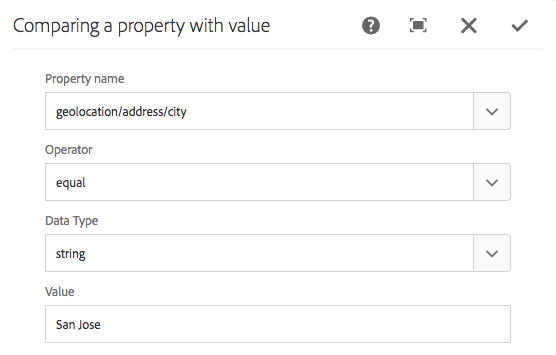

# Configuración de la segmentación con ContextHub{#configuring-segmentation-with-contexthub}

>[!NOTE]
>
>En esta sección se describe cómo configurar la segmentación al utilizar ContextHub. Si utiliza la funcionalidad ClientContext, consulte la documentación pertinente para [configurar la segmentación para ClientContext](/help/sites-administering/campaign-segmentation.md).


La segmentación es una consideración clave al crear una campaña. Consulte [Administración de audiencias](/help/sites-authoring/managing-audiences.md) para obtener información sobre cómo funciona la segmentación y los términos clave.

Según la información que ya haya recopilado sobre los visitantes del sitio y los objetivos que desee alcanzar, deberá definir los segmentos y estrategias necesarios para el contenido de destino.

Estos segmentos se utilizan para proporcionar a un visitante contenido dirigido específicamente. Este contenido se mantiene en la sección [Personalización](/help/sites-authoring/personalization.md) del sitio web. [Las actividades](/help/sites-authoring/activitylib.md) definidas aquí se pueden incluir en cualquier página y definir para qué segmento de visitantes se aplica el contenido especializado.

AEM le permite personalizar fácilmente la experiencia de sus usuarios. También le permite verificar los resultados de las definiciones de segmentos.

## Acceso a segmentos {#accessing-segments}

La consola [Audiencias](/help/sites-authoring/managing-audiences.md) se utiliza para administrar segmentos para ContextHub o ClientContext, así como audiencias para su cuenta de Adobe Target. Esta documentación cubre la administración de segmentos para ContextHub. Para los segmentos de [ClientContext](/help/sites-administering/campaign-segmentation.md) y los segmentos de Adobe Target, consulte la documentación pertinente.

Para acceder a los segmentos, en la navegación global seleccione **Navegación > Personalización > Audiencias**.


## Editor de segmentos {#segment-editor}

El Editor **** de segmentos le permite modificar fácilmente un segmento. Para editar un segmento, seleccione un segmento en la [lista de segmentos](/help/sites-administering/segmentation.md#accessing-segments) y haga clic en el botón **Editar** .


Con el navegador de componentes, puede agregar contenedores **Y** y **O** para definir la lógica del segmento, luego agregar componentes adicionales para comparar propiedades y valores o secuencias de comandos de referencia y otros segmentos para definir los criterios de selección (consulte [Creación de un nuevo segmento](#creating-a-new-segment)) para definir el escenario exacto para seleccionar el segmento.

Cuando toda la instrucción se evalúa como true, el segmento se ha resuelto. En caso de que se apliquen varios segmentos, también se utilizará el factor **Ampliación** . Consulte [Creación de un nuevo segmento](#creating-a-new-segment) para obtener más información sobre el factor de [ampliación.](/help/sites-administering/campaign-segmentation.md#boost-factor)

>[!CAUTION]
>
>El editor de segmentos no comprueba la existencia de referencias circulares. Por ejemplo, el segmento A hace referencia a otro segmento B, que a su vez hace referencia al segmento A. Debe asegurarse de que los segmentos no contengan referencias circulares.

### Containers {#containers}

Los siguientes contenedores están disponibles de forma predeterminada y permiten agrupar comparaciones y referencias para la evaluación booleana. Se pueden arrastrar desde el navegador de componentes al editor. Consulte la siguiente sección [Uso de contenedores](/help/sites-administering/segmentation.md#using-and-and-or-containers) Y y O para obtener más información.

<table>
 <tbody>
  <tr>
   <td>Contenedor Y<br /> </td>
   <td>Operador Y booleano<br /> </td>
  </tr>
  <tr>
   <td>Contenedor O<br /> </td>
   <td>El operador booleano OR</td>
  </tr>
 </tbody>
</table>

### Comparaciones {#comparisons}

Las siguientes comparaciones de segmentos están disponibles de forma predeterminada para evaluar las propiedades de los mismos. Se pueden arrastrar desde el navegador de componentes al editor.

<table>
 <tbody>
  <tr>
   <td>Propiedad-Valor<br /> </td>
   <td>Compara una propiedad de un almacén con un valor definido<br /> </td>
  </tr>
  <tr>
   <td>Propiedad</td>
   <td>Compara una propiedad de un almacén con otra propiedad<br /> </td>
  </tr>
  <tr>
   <td>Referencia de propiedad-segmento</td>
   <td>Compara una propiedad de un almacén con otro segmento al que se hace referencia<br /> </td>
  </tr>
  <tr>
   <td>Referencia de secuencias de comandos de propiedad</td>
   <td>Compara una propiedad de un almacén con los resultados de una secuencia de comandos<br /> </td>
  </tr>
  <tr>
   <td>Referencia de secuencias de comandos de referencia de segmentos</td>
   <td>Compara un segmento referenciado con los resultados de una secuencia de comandos<br /> </td>
  </tr>
 </tbody>
</table>

>[!NOTE]
>
>Al comparar valores, si el tipo de datos de la comparación no está establecido (es decir, configurado para detección automática), el motor de segmentación de ContextHub simplemente comparará los valores como lo haría javascript. No transmite valores a sus tipos esperados, lo que puede llevar a resultados engañosos. Por ejemplo:
>
>`null < 30 // will return true`
>
>Por lo tanto, al [crear un segmento](/help/sites-administering/segmentation.md#creating-a-new-segment), debe seleccionar un tipo **de** datos siempre que se conozcan los tipos de valores comparados. Por ejemplo:
>
>Al comparar la propiedad `profile/age`, ya sabe que el tipo comparado será **número**, por lo que incluso si no `profile/age` se establece, una comparación `profile/age` menor que 30 devolverá **falso**, como es de esperar.

### Referencias {#references}

Las siguientes referencias están disponibles de forma predeterminada para vincularse directamente a una secuencia de comandos u otro segmento. Se pueden arrastrar desde el navegador de componentes al editor.

<table>
 <tbody>
  <tr>
   <td>Referencia del segmento<br /> </td>
   <td>Evaluar el segmento al que se hace referencia</td>
  </tr>
  <tr>
   <td>Referencia de script</td>
   <td>Evalúe la secuencia de comandos a la que se hace referencia. Consulte la siguiente sección <a href="/help/sites-administering/segmentation.md#using-script-references">Uso de referencias</a> de secuencias de comandos para obtener más información.</td>
  </tr>
 </tbody>
</table>

## Creación de un nuevo segmento {#creating-a-new-segment}

Para definir el nuevo segmento:

1. Después de [acceder a los segmentos](/help/sites-administering/segmentation.md#accessing-segments), toque o haga clic en el botón Crear y seleccione **Crear segmento** de ContextHub.

   

1. En el **nuevo segmento** de ContextHub, escriba un título para el segmento, así como un valor de ampliación si es necesario y, a continuación, toque o haga clic en **Crear**.

   

   Cada segmento tiene un parámetro de ampliación que se utiliza como factor de ponderación. Un número mayor indica que el segmento se seleccionará en lugar de un segmento con un número menor en las instancias en las que varios segmentos son válidos.

   * Minimum value: `0`
   * Maximum value: `1000000`

1. Arrastre una comparación o referencia al editor de segmentos que aparecerá en el contenedor Y predeterminado.
1. Toque o haga doble clic en la opción de configuración de la nueva referencia o segmento para editar los parámetros específicos. En este ejemplo, estamos probando personas en San José.

   

   Configure siempre un tipo **de** datos si es posible para asegurarse de que las comparaciones se evalúan correctamente. Consulte [Comparaciones](/help/sites-administering/segmentation.md#comparisons) para obtener más información.

1. Click **OK** to save your definition:
1. Agregue más componentes según sea necesario. Puede formular expresiones booleanas utilizando los componentes de contenedor para las comparaciones Y y O (consulte [Uso de Y y O contenedores](/help/sites-administering/segmentation.md#using-and-and-or-containers) más adelante). Con el editor de segmentos puede eliminar componentes que ya no se necesitan o arrastrarlos a nuevas posiciones dentro de la instrucción.

### Uso de contenedores Y y O {#using-and-and-or-containers}

Con los componentes de contenedor Y y O, puede construir segmentos complejos en AEM. Al hacer esto, ayuda tener en cuenta algunos puntos básicos:

* El nivel superior de la definición es siempre el contenedor AND que se crea inicialmente. Esto no se puede cambiar, pero no afecta al resto de la definición del segmento.
* Asegúrese de que el anidado del contenedor tenga sentido. Los contenedores pueden verse como corchetes de la expresión booleana.

El siguiente ejemplo se utiliza para seleccionar visitantes que se consideran en nuestro grupo de edad principal:

Hombre y entre 30 y 59 años

O

Mujeres y entre 30 y 59 años

Para empezar, coloque un componente de contenedor O dentro del contenedor Y predeterminado. Dentro del contenedor O, se agregan dos contenedores Y y dentro de ambos se pueden agregar la propiedad o los componentes de referencia.


### Uso de referencias de script {#using-script-references}

Mediante el componente Referencia de secuencia de comandos, la evaluación de una propiedad de segmento se puede delegar en una secuencia de comandos externa. Una vez configurada correctamente la secuencia de comandos, puede utilizarse como cualquier otro componente de una condición de segmento.

#### Definición de una secuencia de comandos para referencia {#defining-a-script-to-reference}

1. Agregar archivo a `contexthub.segment-engine.scripts` clientlib.
1. Implemente una función que devuelva un valor. Por ejemplo:

   ```
   ContextHub.console.log(ContextHub.Shared.timestamp(), '[loading] contexthub.segment-engine.scripts - script.profile-info.js');
   
   (function() {
       'use strict';
   
       /**
        * Sample script returning profile information. Returns user info if data is available, false otherwise.
        *
        * @returns {Boolean}
        */
       var getProfileInfo = function() {
           /* let the SegmentEngine know when script should be re-run */
           this.dependOn(ContextHub.SegmentEngine.Property('profile/age'));
           this.dependOn(ContextHub.SegmentEngine.Property('profile/givenName'));
   
           /* variables */
           var name = ContextHub.get('profile/givenName');
           var age = ContextHub.get('profile/age');
   
           return name === 'Joe' && age === 123;
       };
   
       /* register function */
       ContextHub.SegmentEngine.ScriptManager.register('getProfileInfo', getProfileInfo);
   
   })();
   ```

1. Registre la secuencia de comandos con `ContextHub.SegmentEngine.ScriptManager.register`.

Si la secuencia de comandos depende de propiedades adicionales, la secuencia de comandos debe llamar `this.dependOn()`. Por ejemplo, si la secuencia de comandos depende de `profile/age`:

```
this.dependOn(ContextHub.SegmentEngine.Property('profile/age'));
```

#### Referencia a un script {#referencing-a-script}

1. Cree un segmento de ContextHub.
1. Agregue el componente Referencia **de** secuencia de comandos en el lugar deseado del segmento.
1. Abra el cuadro de diálogo de edición del componente Referencia **de** secuencia de comandos. Si está [correctamente configurado](/help/sites-administering/segmentation.md#defining-a-script-to-reference), la secuencia de comandos debe estar disponible en la lista desplegable de nombres **de** secuencia de comandos.

## Prueba de la aplicación de un segmento {#testing-the-application-of-a-segment}

Una vez definido el segmento, los posibles resultados se pueden probar con la ayuda de **[ContextHub](/help/sites-authoring/ch-previewing.md).**

1. Vista previa de una página
1. Haga clic en el icono de ContextHub para mostrar la barra de herramientas de ContextHub
1. Seleccione una persona que coincida con el segmento que ha creado
1. ContextHub resolverá los segmentos aplicables para la persona seleccionada

Por ejemplo: nuestra definición de segmento simple para identificar a los usuarios en nuestro grupo de edad principal es una definición de segmento simple basada en la edad y el sexo del usuario. Al cargar una persona específica que coincida con esos criterios, se muestra si el segmento se ha resuelto correctamente:


O si no se resuelve:


>[!NOTE]
>
>Todas las características se resuelven inmediatamente, aunque la mayoría solo cambia al volver a cargar la página.

Estas pruebas también se pueden realizar en páginas de contenido y en combinación con contenido dirigido y **actividades** y **experiencias** relacionadas.

Si ha configurado una actividad y experiencia utilizando el ejemplo de segmento de grupo de edad principal anterior, puede probar fácilmente el segmento con la actividad. Para obtener más información sobre la configuración de una actividad, consulte la [documentación relacionada con la creación de contenido](/help/sites-authoring/content-targeting-touch.md)de destino.

1. En el modo de edición de una página en la que haya configurado contenido de destino, puede ver que el contenido se dirige mediante un icono de flecha en el contenido.

   

1. Cambie al modo de vista previa y, con el concentrador de contexto, cambie a una persona que no coincida con la segmentación configurada para la experiencia.

   

1. Cambie a una persona que no coincida con la segmentación configurada para la experiencia y observe que la experiencia cambia en consecuencia.

   

## Uso del segmento {#using-your-segment}

Los segmentos se utilizan para dirigir el contenido real que ven las audiencias de destino específicas. Consulte [Administración de audiencias](/help/sites-authoring/managing-audiences.md) para obtener más información sobre audiencias y segmentos y [Creación de contenido](/help/sites-authoring/content-targeting-touch.md) de destino sobre el uso de audiencias y segmentos para destinar contenido.
