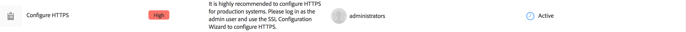
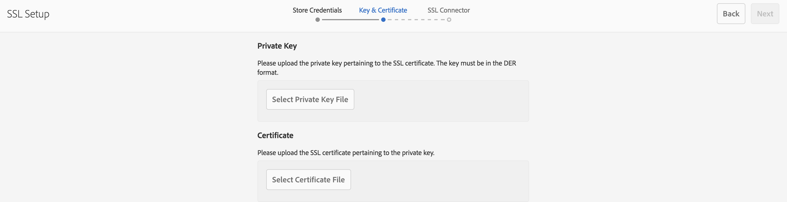

# SSL/TLS de forma predeterminada{#ssl-tls-by-default}

En un esfuerzo por mejorar continuamente la seguridad de AEM, Adobe ha introducido una función llamada SSL de forma predeterminada. El propósito es fomentar el uso de HTTPS para conectarse a AEM instancias.

## Habilitación de SSL/TLS de forma predeterminada {#enabling-ssl-tls-by-default}

Puede empezar a configurar SSL/TLS de forma predeterminada haciendo clic en el mensaje de la bandeja de entrada correspondiente de su pantalla de inicio de AEM. Para llegar a la Bandeja de entrada, pulse el icono de campana en la esquina superior derecha de la pantalla. A continuación, haga clic en **Ver todo**. Esto mostrará una lista de todas las alertas ordenadas en una vista de lista.

En la lista, seleccione y abra la **Configuración de HTTPS** alerta:



>[!NOTE]
>
>Si la variable **Configuración de HTTPS** alerta no está presente en la bandeja de entrada, puede navegar directamente al asistente HTTPS accediendo a *<http://serveraddress:serverport/libs/granite/security/content/sslConfig.html?item=configuration%2fconfiguressl&_charset_=utf-8>*

Un usuario de servicio llamado **ssl-service** se ha creado para esta función. Una vez que abra la alerta, se le guiará a través del siguiente asistente de configuración:

1. Primero, configure las Credenciales de almacenamiento. Estas son las credenciales para la variable **ssl-service** almacén de claves del usuario del sistema que contendrá la clave privada y el almacén de confianza para el oyente HTTPS.

   

1. Una vez que introduzca las credenciales, haga clic en **Siguiente** en la esquina superior derecha de la página. A continuación, cargue la clave privada y el certificado asociados para la conexión SSL.

   

   >[!NOTE]
   >
   >Para obtener información sobre cómo generar una clave privada y un certificado para usar con el asistente, consulte [este procedimiento](/help/sites-administering/ssl-by-default.md#generating-a-private-key-certificate-pair-to-use-with-the-wizard) más abajo.

1. Por último, especifique el nombre de host HTTPS y el puerto TCP para el oyente HTTPS.

   

## Automatización de SSL/TLS de forma predeterminada {#automating-ssl-tls-by-default}

Existen tres formas de automatizar SSL/TLS de forma predeterminada.

### A través del POST HTTP {#via-http-post}

El primer método implica la publicación en el servidor SSLSetup que está utilizando el asistente de configuración:

```shell
POST /libs/granite/security/post/sslSetup.html
```

Puede utilizar la siguiente carga útil en el POST para automatizar la configuración:

```xml
------WebKitFormBoundaryyBO4ArmGlcfdGDbs
Content-Disposition: form-data; name="keystorePassword"

test
------WebKitFormBoundaryyBO4ArmGlcfdGDbs
Content-Disposition: form-data; name="keystorePasswordConfirm"
test
------WebKitFormBoundaryyBO4ArmGlcfdGDbs
Content-Disposition: form-data; name="truststorePassword"
test
------WebKitFormBoundaryyBO4ArmGlcfdGDbs
Content-Disposition: form-data; name="truststorePasswordConfirm"
test
------WebKitFormBoundaryyBO4ArmGlcfdGDbs
Content-Disposition: form-data; name="privatekeyFile"; filename="server.der"
Content-Type: application/x-x509-ca-cert

------WebKitFormBoundaryyBO4ArmGlcfdGDbs
Content-Disposition: form-data; name="certificateFile"; filename="server.crt"
Content-Type: application/x-x509-ca-cert

------WebKitFormBoundaryyBO4ArmGlcfdGDbs
Content-Disposition: form-data; name="httpsPort"
8443
```

El servlet, como cualquier servlet de POST de sling, responderá con 200 OK o con un código de estado HTTP de error. Puede encontrar detalles sobre el estado en el cuerpo del HTML de la respuesta.

A continuación se muestran ejemplos de una respuesta correcta y de un error.

**EJEMPLO DE ÉXITO** (estado = 200):

```xml
<!DOCTYPE html>
<html lang='en'>
<head>
<title>OK</title>
</head>
<body>
<h1>OK</h1>
<dl>
<dt class='foundation-form-response-status-code'>Status</dt>
<dd>200</dd>
<dt class='foundation-form-response-status-message'>Message</dt>
<dd>SSL successfully configured</dd>
<dt class='foundation-form-response-title'>Title</dt>
<dd>OK</dd>
<dt class='foundation-form-response-description'>Description</dt>
<dd>HTTPS has been configured on port 8443. The private key and
certificate were stored in the key store of the user ssl-service.
Please take note of the key store password you provided. You will need
it for any subsequent updating of the private key or certificate.</dd>
</dl>
<h2>Links</h2>
<ul class='foundation-form-response-links'>
<li><a class='foundation-form-response-redirect' href='/'>Done</a></li>
</ul>
</body>
</html>
```

**EJEMPLO DE ERROR** (estado = 500):

```xml
<!DOCTYPE html>
<html lang='en'>
<head>
<title>Error</title>
</head>
<body>
<h1>Error</h1>
<dl>
<dt class='foundation-form-response-status-code'>Status</dt>
<dd>500</dd>
<dt class='foundation-form-response-status-message'>Message</dt>
<dd>The provided file is not a valid key, DER format expected</dd>
<dt class='foundation-form-response-title'>Title</dt>
<dd>Error</dd>
</dl>
</body>
</html>
```

### Vía Paquete {#via-package}

Como alternativa, puede automatizar la configuración de SSL cargando un paquete que ya contiene los elementos necesarios:

* El almacén de claves del usuario del servicio ssl. Se encuentra en */home/users/system/security/ssl-service/keystore* en el repositorio.
* La variable `GraniteSslConnectorFactory` configuración

### Generación de un par de claves privadas/certificados para utilizarlo con el asistente {#generating-a-private-key-certificate-pair-to-use-with-the-wizard}

A continuación encontrará un ejemplo para crear un certificado autofirmado en formato DER que puede utilizar el Asistente SSL/TLS. Instale OpenSSL basado en el sistema operativo, abra el símbolo del sistema OpenSSL y cambie el directorio a la carpeta donde desee generar el certificado o clave privada.

>[!NOTE]
>
>El uso de un certificado autofirmado es solo para fines de ejemplo y no debe utilizarse en la producción.

1. En primer lugar, cree la clave privada:

   ```shell
   openssl genrsa -aes256 -out localhostprivate.key 4096
   openssl rsa -in localhostprivate.key -out localhostprivate.key
   ```

1. A continuación, genere una solicitud de firma de certificado (CSR) utilizando la clave privada:

   ```shell
   openssl req -sha256 -new -key localhostprivate.key -out localhost.csr -subj "/CN=localhost"
   ```

1. Genere el certificado SSL y firme con la clave privada. En este ejemplo, caducará dentro de un año:

   ```shell
   openssl x509 -req -days 365 -in localhost.csr -signkey localhostprivate.key -out localhost.crt
   ```

Convierta la clave privada al formato DER. Esto se debe a que el asistente SSL requiere que la clave esté en formato DER:

```shell
openssl pkcs8 -topk8 -inform PEM -outform DER -in localhostprivate.key -out localhostprivate.der -nocrypt
```

Finalmente, cargue el **localhostprivate.der** como Clave privada y **localhost.crt** como certificado SSL/TLS en el paso 2 del asistente gráfico SSL/TLS descrito al principio de esta página.

### Actualización de la configuración SSL/TLS mediante cURL {#updating-the-ssl-tls-configuration-via-curl}

>[!NOTE]
>
>Consulte [Uso de cURL con AEM](https://helpx.adobe.com/experience-manager/6-4/sites/administering/using/curl.html) para obtener una lista centralizada de comandos útiles cURL en AEM.

También puede automatizar la configuración SSL/TLS usando la herramienta cURL. Para ello, publique los parámetros de configuración en esta dirección URL:

*https://&lt;serveraddress>:&lt;serverport>/libs/granite/security/post/sslSetup.html*

A continuación se muestran los parámetros que puede utilizar para cambiar las distintas configuraciones en el asistente de configuración:

* `-F "keystorePassword=password"` - la contraseña del almacén de claves;

* `-F "keystorePasswordConfirm=password"` - confirmar la contraseña del almacén de claves;

* `-F "truststorePassword=password"` - la contraseña de truststore;

* `-F "truststorePasswordConfirm=password"` - confirme la contraseña de truststore;

* `-F "privatekeyFile=@localhostprivate.der"` - especificar la clave privada;

* `-F "certificateFile=@localhost.crt"` - especificar el certificado;

* `-F "httpsHostname=host.example.com"`- especifique el nombre de host;
* `-F "httpsPort=8443"` : puerto en el que funcionará el oyente HTTPS.

>[!NOTE]
>
>La forma más rápida de ejecutar cURL para automatizar la configuración SSL/TLS es desde la carpeta donde están los archivos DER y CRT. También puede especificar la ruta completa en la `privatekeyFile` y los argumentos certificateFile.
>
>También debe estar autenticado para realizar la actualización, por lo que asegúrese de adjuntar el comando cURL con la variable `-u user:passeword` parámetro.
>
>Un comando cURL post correcto debería tener este aspecto:

```shell
curl -u user:password -F "keystorePassword=password" -F "keystorePasswordConfirm=password" -F "truststorePassword=password" -F "truststorePasswordConfirm=password" -F "privatekeyFile=@localhostprivate.der" -F "certificateFile=@localhost.crt" -F "httpsHostname=host.example.com" -F "httpsPort=8443" https://host:port/libs/granite/security/post/sslSetup.html
```

#### Varios certificados con cURL {#multiple-certificates-using-curl}

Puede enviar el servlet a una cadena de certificados repitiendo el parámetro certificateFile de esta manera:

`-F "certificateFile=@root.crt" -F "certificateFile=@localhost.crt"..`

Una vez ejecutado el comando, compruebe que todos los certificados hayan llegado al almacén de claves. Compruebe el almacén de claves desde:
[http://localhost:4502/libs/granite/security/content/userEditor.html/home/users/system/security/ssl-service](http://localhost:4502/libs/granite/security/content/userEditor.html/home/users/system/security/ssl-service)

### Activación de una conexión TLS 1.3 {#enabling-tls-connection}

1. Vaya a la consola web
1. A continuación, vaya a **OSGi** - **Configuración** - **Fábrica de conectores SSL de Granite de Adobe**
1. Vaya a la **Grupos de cifras incluidos** y añada las entradas siguientes. Puede confirmar cada adición pulsando el botón &quot;**+**&quot; a la izquierda del campo, después de añadir cada uno en:

   * `TLS_AES_256_GCM_SHA384`
   * `TLS_AES_128_GCM_SHA256`
   * `TLS_CHACHA20_POLY1305_SHA256`
   * `TLS_AES_128_CCM_SHA256`
   * `TLS_AES_128_CCM_8_SHA256`