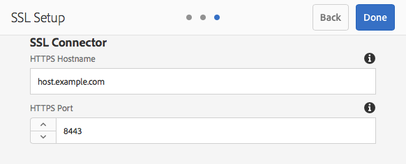

# SSL/TLS de forma predeterminada{#ssl-tls-by-default}

AEM En un esfuerzo por mejorar continuamente la seguridad de los recursos, Adobe ha introducido una función llamada SSL de forma predeterminada. AEM El propósito es fomentar el uso de HTTPS para conectarse a instancias de.

## Habilitar SSL/TLS de forma predeterminada {#enabling-ssl-tls-by-default}

AEM Puede comenzar a configurar SSL/TLS de forma predeterminada haciendo clic en el mensaje de la bandeja de entrada correspondiente en la pantalla de inicio de la. Para llegar a la bandeja de entrada, pulse el icono de campana en la esquina superior derecha de la pantalla. A continuación, haga clic en **Ver todo**. Esto mostrará una lista de todas las alertas ordenadas en una vista de lista.

En la lista, seleccione y abra la alerta **Configurar HTTPS**:


>[!NOTE]
>
>Si la alerta **Configurar HTTPS** no está presente en la Bandeja de entrada, puede ir directamente al Asistente para HTTPS yendo a *<http://serveraddress:serverport/libs/granite/security/content/sslConfig.html?item=configuration%2fconfiguressl&_charset_=utf-8>*

Se ha creado un usuario de servicio llamado **ssl-service** para esta característica. Una vez abierta la alerta, se le guiará a través del siguiente asistente de configuración:

1. En primer lugar, configure las credenciales de la tienda. Estas son las credenciales del almacén de claves del usuario del sistema **ssl-service** que contendrán la clave privada y el almacén de confianza para el detector de HTTPS.

   

1. Una vez que ingreses las credenciales, haz clic en **Siguiente** en la esquina superior derecha de la página. A continuación, cargue la clave privada y el certificado asociados para la conexión SSL/TLS.

   

   >[!NOTE]
   >
   >Para obtener información sobre cómo generar una clave privada y un certificado para utilizarlo con el asistente, consulte [este procedimiento](/help/sites-administering/ssl-by-default.md#generating-a-private-key-certificate-pair-to-use-with-the-wizard) a continuación.

1. Por último, especifique el nombre de host HTTPS y el puerto TCP para el detector de HTTPS.

   

## Automatizar SSL/TLS de forma predeterminada {#automating-ssl-tls-by-default}

Existen tres formas de automatizar SSL/TLS de forma predeterminada.

### Mediante el POST HTTP {#via-http-post}

El primer método implica publicar en el servidor SSLSetup que está utilizando el asistente de configuración:

```shell
POST /libs/granite/security/post/sslSetup.html
```

Puede utilizar la siguiente carga útil en el POST para automatizar la configuración:

```xml
------WebKitFormBoundaryyBO4ArmGlcfdGDbs
Content-Disposition: form-data; name="keystorePassword"

test
------WebKitFormBoundaryyBO4ArmGlcfdGDbs
Content-Disposition: form-data; name="keystorePasswordConfirm"
test
------WebKitFormBoundaryyBO4ArmGlcfdGDbs
Content-Disposition: form-data; name="truststorePassword"
test
------WebKitFormBoundaryyBO4ArmGlcfdGDbs
Content-Disposition: form-data; name="truststorePasswordConfirm"
test
------WebKitFormBoundaryyBO4ArmGlcfdGDbs
Content-Disposition: form-data; name="privatekeyFile"; filename="server.der"
Content-Type: application/x-x509-ca-cert

------WebKitFormBoundaryyBO4ArmGlcfdGDbs
Content-Disposition: form-data; name="certificateFile"; filename="server.crt"
Content-Type: application/x-x509-ca-cert

------WebKitFormBoundaryyBO4ArmGlcfdGDbs
Content-Disposition: form-data; name="httpsPort"
8443
```

El servlet, como cualquier servlet del POST sling, responderá con 200 OK o un código de estado HTTP de error. Puede encontrar detalles sobre el estado en el cuerpo del HTML de la respuesta.

A continuación se muestran ejemplos de una respuesta correcta y de un error.

**EJEMPLO CORRECTO** (estado = 200):

```xml
<!DOCTYPE html>
<html lang='en'>
<head>
<title>OK</title>
</head>
<body>
<h1>OK</h1>
<dl>
<dt class='foundation-form-response-status-code'>Status</dt>
<dd>200</dd>
<dt class='foundation-form-response-status-message'>Message</dt>
<dd>SSL successfully configured</dd>
<dt class='foundation-form-response-title'>Title</dt>
<dd>OK</dd>
<dt class='foundation-form-response-description'>Description</dt>
<dd>HTTPS has been configured on port 8443. The private key and
certificate were stored in the key store of the user ssl-service.
Take note of the key store password you provided. You need
it for any subsequent updating of the private key or certificate.</dd>
</dl>
<h2>Links</h2>
<ul class='foundation-form-response-links'>
<li><a class='foundation-form-response-redirect' href='/'>Done</a></li>
</ul>
</body>
</html>
```

**EJEMPLO DE ERROR** (estado = 500):

```xml
<!DOCTYPE html>
<html lang='en'>
<head>
<title>Error</title>
</head>
<body>
<h1>Error</h1>
<dl>
<dt class='foundation-form-response-status-code'>Status</dt>
<dd>500</dd>
<dt class='foundation-form-response-status-message'>Message</dt>
<dd>The provided file is not a valid key, DER format expected</dd>
<dt class='foundation-form-response-title'>Title</dt>
<dd>Error</dd>
</dl>
</body>
</html>
```

### Mediante paquete {#via-package}

También puede automatizar la configuración de SSL/TLS cargando un paquete que ya contenga estos elementos necesarios:

* El almacén de claves del usuario del servicio SSL. Se encuentra en */home/users/system/security/ssl-service/keystore*, en el repositorio.
* La configuración de `GraniteSslConnectorFactory`

### Generación de un par de clave privada/certificado para utilizarlo con el asistente {#generating-a-private-key-certificate-pair-to-use-with-the-wizard}

A continuación encontrará un ejemplo para crear un certificado autofirmado en formato DER que puede utilizar el asistente SSL/TLS. Instale OpenSSL basado en el sistema operativo, abra el símbolo del sistema de OpenSSL y cambie el directorio a la carpeta donde desee generar la clave privada o el certificado.

>[!NOTE]
>
>El uso de un certificado autofirmado es solo para fines de ejemplo. No usar en producción.

1. En primer lugar, cree la clave privada:

   ```shell
   openssl genrsa -aes256 -out localhostprivate.key 4096
   openssl rsa -in localhostprivate.key -out localhostprivate.key
   ```

1. A continuación, genere una solicitud de firma de certificado (CSR) con clave privada:

   ```shell
   openssl req -sha256 -new -key localhostprivate.key -out localhost.csr -subj "/CN=localhost"
   ```

1. Genere el certificado SSL/TLS y fírmelo con la clave privada. En este ejemplo, caducará dentro de un año:

   ```shell
   openssl x509 -req -days 365 -in localhost.csr -signkey localhostprivate.key -out localhost.crt
   ```

1. Convierta la clave privada al formato DER. Esto se debe a que el asistente SSL requiere que la clave esté en formato DER:

   ```shell
   openssl pkcs8 -topk8 -inform PEM -outform DER -in localhostprivate.key -out localhostprivate.der -nocrypt
   ```

1. Finalmente, cargue **localhostprivate.der** como clave privada y **localhost.crt** como certificado SSL/TLS en el paso 2 del Asistente gráfico para SSL/TLS descrito al principio de esta página.

### Actualizar la configuración SSL/TLS mediante cURL {#updating-the-ssl-tls-configuration-via-curl}

>[!NOTE]
>
>AEM AEM Consulte [Uso de cURL con la dirección de correo electrónico ](https://helpx.adobe.com/es/experience-manager/6-4/sites/administering/using/curl.html) para obtener una lista centralizada de los comandos cURL útiles en la sección de comandos de la dirección de correo electrónico.

También puede automatizar la configuración SSL/TLS mediante la herramienta cURL. Para ello, publique los parámetros de configuración en esta dirección URL:

*https://&lt;serveraddress>:&lt;serverport>/libs/granite/security/post/sslSetup.html*

A continuación se muestran los parámetros que puede utilizar para cambiar las distintas configuraciones en el asistente de configuración:

* `-F "keystorePassword=password"`: la contraseña del almacén de claves;

* `-F "keystorePasswordConfirm=password"` - confirmar la contraseña del almacén de claves;

* `-F "truststorePassword=password"` - la contraseña del almacén de confianza;

* `-F "truststorePasswordConfirm=password"` - confirmar la contraseña del almacén de confianza;

* `-F "privatekeyFile=@localhostprivate.der"` - especifique la clave privada;

* `-F "certificateFile=@localhost.crt"` - especifique el certificado;

* `-F "httpsHostname=host.example.com"`- especificar el nombre de host;
* `-F "httpsPort=8443"`: el puerto en el que funcionará el detector de HTTPS.

>[!NOTE]
>
>La forma más rápida de ejecutar cURL para automatizar la configuración SSL/TLS es desde la carpeta donde se encuentran los archivos DER y CRT. También puede especificar la ruta de acceso completa en los argumentos `privatekeyFile` y certificateFile.
>
>También necesita autenticarse para realizar la actualización, así que asegúrese de anexar el comando cURL con el parámetro `-u user:passeword`.
>
>Un comando post de cURL correcto debería tener este aspecto:

```shell
curl -u user:password -F "keystorePassword=password" -F "keystorePasswordConfirm=password" -F "truststorePassword=password" -F "truststorePasswordConfirm=password" -F "privatekeyFile=@localhostprivate.der" -F "certificateFile=@localhost.crt" -F "httpsHostname=host.example.com" -F "httpsPort=8443" https://host:port/libs/granite/security/post/sslSetup.html
```

#### Varios certificados con cURL {#multiple-certificates-using-curl}

Puede enviar al servlet una cadena de certificados repitiendo el parámetro certificateFile de esta manera:

`-F "certificateFile=@root.crt" -F "certificateFile=@localhost.crt"..`

Una vez ejecutado el comando, compruebe que todos los certificados hayan llegado al repositorio de claves. Compruebe las entradas de **Keystore** desde:
[http://localhost:4502/libs/granite/security/content/v2/usereditor.html/home/users/system/security/ssl-service](http://localhost:4502/libs/granite/security/content/v2/usereditor.html/home/users/system/security/ssl-service)

### Activación de una conexión TLS 1.3 {#enabling-tls-connection}

1. Ir a la consola web
1. A continuación, vaya a **OSGi** - **Configuración** - **Fábrica del conector SSL de Adobe Granite**
1. Vaya al campo **Grupos de cifrado incluidos** y agregue las siguientes entradas. Puede confirmar cada adición presionando el botón &quot;**+**&quot; a la izquierda del campo, después de agregar cada una en:

   * `TLS_AES_256_GCM_SHA384`
   * `TLS_AES_128_GCM_SHA256`
   * `TLS_CHACHA20_POLY1305_SHA256`
   * `TLS_AES_128_CCM_SHA256`
   * `TLS_AES_128_CCM_8_SHA256`
