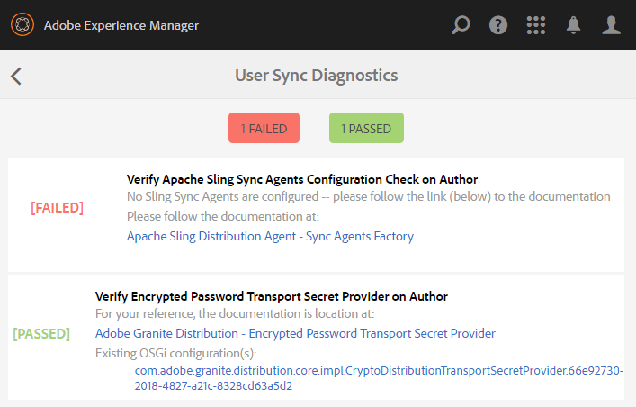
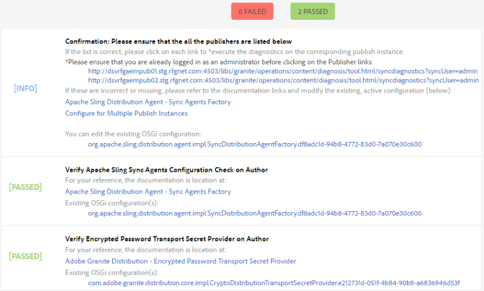

# Sincronización de usuario{#user-synchronization}

## Introducción {#introduction}

Cuando la implementación es un [conjunto de servidores de publicación](/help/sites-deploying/recommended-deploys.md#tarmk-farm), los miembros deben poder iniciar sesión y ver sus datos en cualquier nodo de publicación.

Los usuarios y los grupos de usuarios (datos de usuario) creados en el entorno de publicación no son necesarios en el entorno de creación.

La mayoría de los datos de usuario creados en el entorno de creación están pensados para permanecer en el entorno de creación y no para copiarlos en instancias de publicación.

El registro y las modificaciones realizadas en una instancia de publicación deben sincronizarse con otras instancias de publicación para que tengan acceso a los mismos datos de usuario.

A partir de AEM 6.1, cuando la sincronización de usuarios está habilitada, los datos de usuario se sincronizan automáticamente en las instancias de publicación del conjunto de servidores y no se crean en el autor.

## Distribución de Sling {#sling-distribution}

Los datos del usuario, junto con sus [ACL](/help/sites-administering/security.md), se almacenan en el [Oak Core](/help/sites-deploying/platform.md), la capa debajo de Oak JCR, y se accede a ellos mediante la [Oak API](https://helpx.adobe.com/experience-manager/6-5/sites/developing/using/reference-materials/javadoc/org/apache/jackrabbit/oak/api/package-tree.html). Con actualizaciones poco frecuentes, es razonable que los datos de usuario se sincronicen con otras instancias de publicación mediante [Sling Content Distribution](https://github.com/apache/sling/blob/trunk/contrib/extensions/distribution/README.md) (distribución de Sling).

Los beneficios de la sincronización de usuarios mediante la distribución Sling, en comparación con la replicación tradicional, son:

* *los usuarios*, los perfiles  *de* usuario y los grupos  *de* usuarios creados al publicar no se crean en el autor

* La distribución Sling establece propiedades en eventos jcr, lo que permite actuar dentro de los oyentes de eventos de publicación sin preocuparse por los bucles de replicación infinitos
* La distribución de Sling sólo envía datos de usuario a instancias de publicación no originales, eliminando así el tráfico innecesario
* [Los ](/help/sites-administering/security.md) ACLsset en el nodo de usuario se incluyen en la sincronización

>[!NOTE]
>
>Si se requieren sesiones, se recomienda usar una solución SSO o una sesión adhesiva y hacer que los clientes inicien sesión si se cambian a otro editor.

>[!CAUTION]
>
>No se admite la sincronización del grupo ***administradores***, aunque la sincronización de usuarios esté habilitada. En su lugar, se registrará un error al &#39;importar la diferencia&#39; en el registro de errores.
>
>Por lo tanto, cuando la implementación es un conjunto de servidores de publicación, si se agrega o elimina un usuario del grupo ***administradores**, la modificación debe realizarse manualmente en cada instancia de publicación.

## Habilitar sincronización de usuario {#enable-user-sync}

>[!NOTE]
>
>De forma predeterminada, la sincronización de usuarios es `disabled`.
>
>Habilitar la sincronización de usuarios implica modificar las configuraciones de OSGi *existentes*.
>
>No se deben agregar nuevas configuraciones como resultado de habilitar la sincronización de usuarios.

La sincronización de usuarios depende del entorno de creación para administrar las distribuciones de datos de usuario, aunque los datos de usuario no se hayan creado en el autor. Gran parte de la configuración, pero no toda, se lleva a cabo en el entorno del autor y cada paso identifica claramente si se debe realizar durante la creación o la publicación.

A continuación se indican los pasos necesarios para habilitar la sincronización de usuarios, seguidos de una sección [Resolución de problemas](#troubleshooting):

### Requisitos previos {#prerequisites}

1. Si ya se han creado usuarios y grupos de usuarios en un publicador, se recomienda [sincronizar manualmente](#manually-syncing-users-and-user-groups) los datos de usuario con todos los editores antes de configurar y habilitar la sincronización de usuarios.

Una vez habilitada la sincronización de usuarios, solo se sincronizan los usuarios y grupos recién creados.

1. Asegúrese de que se ha instalado el código más reciente:

* [Actualizaciones de la plataforma AEM](https://helpx.adobe.com/es/experience-manager/kb/aem62-available-hotfixes.html)
* [Actualizaciones de AEM Communities](/help/communities/deploy-communities.md#latestfeaturepack)

### 1. Agente de distribución Apache Sling: fábrica de agentes de sincronización {#apache-sling-distribution-agent-sync-agents-factory}

**Habilitar sincronización de usuario**

* **en autor**

   * iniciar sesión con privilegios de administrador
   * acceder a la [Consola Web](/help/sites-deploying/configuring-osgi.md)

      * por ejemplo, [https://localhost:4502/system/console/configMgr](https://localhost:4502/system/console/configMgr)
   * ubicar `Apache Sling Distribution Agent - Sync Agents Factory`

      * seleccione la configuración existente para abrirla y editarla (icono de lápiz)
Verificar `name`: **`socialpubsync`**

      * seleccione la casilla de verificación `Enabled`
      * select `Save`


### 2. Crear usuario autorizado {#createauthuser}

**Configurar**
permisosEste usuario autorizado se usará en el paso 3 para configurar la distribución de Sling en el autor.

* **en cada instancia de publicación**

   * iniciar sesión con privilegios de administrador
   * acceder a la [Consola de seguridad](/help/sites-administering/security.md)

      * por ejemplo, [https://localhost:4503/useradmin](https://localhost:4503/useradmin)
   * crear un nuevo usuario

      * por ejemplo, `usersync-admin`
   * agregar este usuario al grupo de usuarios **`administrators`**
   * [agregar ACL para este usuario a /home](#howtoaddacl)

      * `Allow jcr:all` con restricción  `rep:glob=*/activities/*`


>[!CAUTION]
>
>Se debe crear un nuevo usuario.
>
>* El usuario predeterminado asignado es **`admin`**.
>* No use `communities-user-admin user.`

>


#### Cómo Añadir ACL {#addacls}

* crxde lite de acceso

   * por ejemplo, [https://localhost:4503/crx/de](https://localhost:4503/crx/de)

* seleccionar nodo `/home`
* en el panel derecho, seleccione la ficha `Access Control`
* seleccione el botón `+` para agregar una entrada de ACL

   * **Principal**:  *buscar usuarios creados para la sincronización de usuarios*
   * **Tipo**: `Allow`
   * **Privilegios**:  `jcr:all`
   * **** Restricciones rep:glob:  `*/activities/*`
   * select **OK**

* seleccionar **Guardar todo**


Consulte también

* [Administración de derechos de acceso](/help/sites-administering/user-group-ac-admin.md#access-right-management)
* Resolución de problemas en la sección [Modificación de la excepción de operación durante el procesamiento de la respuesta](#modify-operation-exception-during-response-processing).

### 3. Distribución de granito de Adobe: Proveedor secreto de transporte de contraseña cifrada {#adobegraniteencpasswrd}

**Configurar permisos**

Una vez que se ha creado un usuario autorizado, un miembro del grupo de usuarios **`administrators`***, en todas las instancias de publicación, ese usuario autorizado debe ser identificado por el autor como que tiene permiso para sincronizar datos de usuario desde el autor a la publicación.

* **en autor**

   * iniciar sesión con privilegios de administrador
   * acceder a la [Consola Web](/help/sites-deploying/configuring-osgi.md)

      * por ejemplo, [https://localhost:4502/system/console/configMgr](https://localhost:4502/system/console/configMgr)
   * ubicar `com.adobe.granite.distribution.core.impl.CryptoDistributionTransportSecretProvider.name`
   * seleccione la configuración existente para abrirla y editarla (icono de lápiz)
Verificar `property name`: **`socialpubsync-publishUser`**

   * establezca el nombre de usuario y la contraseña para el [usuario autorizado](#createauthuser) creado al publicar en el paso 2

      * por ejemplo, `usersync-admin`


### 4. Agente de distribución Apache Sling: fábrica de agentes de cola {#apache-sling-distribution-agent-queue-agents-factory}

**Habilitar sincronización de usuario**

* **al publicar**:

   * iniciar sesión con privilegios de administrador
   * acceder a la [Consola Web](/help/sites-deploying/configuring-osgi.md)

      * por ejemplo, [https://localhost:4503/system/console/configMgr](https://localhost:4503/system/console/configMgr)
   * ubicar `Apache Sling Distribution Agent - Queue Agents Factory`

      * seleccione la configuración existente para abrirla y editarla (icono de lápiz)
Verificar `Name`: `socialpubsync-reverse`

      * seleccione la casilla de verificación `Enabled`
      * select `Save`
   * **repetir **para cada instancia de publicación


### 5. Adobe Social Sync - Fábrica de observación de diferencias {#diffobserver}

**Habilitar sincronización de grupos**

* **en cada instancia** de publicación:

   * iniciar sesión con privilegios de administrador
   * acceder a la [Consola Web](/help/sites-deploying/configuring-osgi.md)

      * por ejemplo, [https://localhost:4503/system/console/configMgr](https://localhost:4503/system/console/configMgr)
   * ubicar **`Adobe Social Sync - Diff Observer Factory`**

      * seleccione la configuración existente para abrirla y editarla (icono de lápiz)

         Verificar `agent name`: `socialpubsync-reverse`

      * seleccione la casilla de verificación `Enabled`
      * select `Save`


### 6. Déclencheur de distribución de Apache Sling - Fábrica de Déclencheur programados {#apache-sling-distribution-trigger-scheduled-triggers-factory}

**(Opcional) modificar el intervalo de sondeo**

De forma predeterminada, el autor sondeará los cambios cada 30 segundos. Para modificar este intervalo:

* **en autor**

   * iniciar sesión con privilegios de administrador
   * acceder a la [Consola Web](/help/sites-deploying/configuring-osgi.md)

      * por ejemplo, [https://localhost:4502/system/console/configMgr](https://localhost:4502/system/console/configMgr)
   * ubicar `Apache Sling Distribution Trigger - Scheduled Triggers Factory`

      * seleccione la configuración existente para abrirla y editarla (icono de lápiz)

         * Verificar `Name`: `socialpubsync-scheduled-trigger`
      * establezca el `Interval in Seconds` en el intervalo deseado
      * select `Save`


## Configurar para varias instancias de publicación {#configure-for-multiple-publish-instances}

La configuración predeterminada es para una sola instancia de publicación. Dado que el motivo para habilitar la sincronización de usuarios es sincronizar varias instancias de publicación, como en un conjunto de publicaciones, las instancias de publicación adicionales deberán agregarse a la fábrica de agentes de sincronización.

### 7. Agente de distribución Apache Sling: fábrica de agentes de sincronización {#apache-sling-distribution-agent-sync-agents-factory-1}

**Añadir instancias de publicación:**

* **en autor**

   * iniciar sesión con privilegios de administrador
   * acceder a la [Consola Web](/help/sites-deploying/configuring-osgi.md)

      * por ejemplo, [https://localhost:4502/system/console/configMgr](https://localhost:4502/system/console/configMgr)
   * ubicar `Apache Sling Distribution Agent - Sync Agents Factory`

      * seleccione la configuración existente para abrirla y editarla (icono de lápiz)
Verificar `Name`: `socialpubsync`


* **Puntos**
finales del exportadorDebe haber un punto final del exportador para cada publicador. Por ejemplo, si hay dos editores, localhost:4503 y 4504, debe haber dos entradas:

   * `https://localhost:4503/libs/sling/distribution/services/exporters/socialpubsync-reverse`
   * `https://localhost:4504/libs/sling/distribution/services/exporters/socialpubsync-reverse`

* **Extremos**
del importadorDebe haber un extremo del importador para cada publicador. Por ejemplo, si hay dos editores, localhost:4503 y 4504, debe haber dos entradas:

   * `https://localhost:4503/libs/sling/distribution/services/importers/socialpubsync`
   * `https://localhost:4504/libs/sling/distribution/services/importers/socialpubsync`

* select `Save`

### 8. Escucha de sincronización de usuarios de AEM Communities {#aem-communities-user-sync-listener}

**(Opcional) Sincronizar nodos JCR adicionales**

Si hay datos personalizados que desea sincronizar en varias instancias de publicación, entonces:

* **en cada instancia** de publicación:

   * iniciar sesión con privilegios de administrador
   * acceder a la [Consola Web](/help/sites-deploying/configuring-osgi.md)

      * por ejemplo, `https://localhost:4503/system/console/configMgr`
   * ubicar `AEM Communities User Sync Listener`
   * seleccione la configuración existente para abrirla y editarla (icono de lápiz)
Verificar `Name`: `socialpubsync-scheduled-trigger`


* **Tipos de**
nodosEs la lista de tipos de nodos que se sincronizarán. Cualquier tipo de nodo que no sea sling:Folder debe aparecer aquí (sling:folder se gestiona por separado).
Lista predeterminada de los tipos de nodo que sincronizar:

   * rep:Usuario
   * nt:unstructured
   * nt:resource

* ****
Propiedades ignorablesEs la lista de propiedades que se omitirán si se detecta algún cambio. Los cambios realizados en estas propiedades pueden sincronizarse como un efecto secundario de otros cambios (ya que la sincronización siempre se encuentra en el nivel de nodo), pero los cambios realizados en estas propiedades no se traducirán por sí mismos en una sincronización de déclencheur.
Propiedad predeterminada que se debe ignorar:

   * cq:lastModified

* **Rutas secundarias**
de nodos ignorables que se omitirán por completo durante la sincronización. No se sincronizará nada debajo de estas subrutas en cualquier momento.
Nodos predeterminados que se deben ignorar:

   * .tokens
   * sistema

* **Carpetas distribuidasLa mayoría de las**
carpetas sling:Folders se omiten porque no es necesaria la sincronización. Las pocas excepciones se enumeran aquí.
Carpetas predeterminadas para sincronizar

   * segmentos/puntuación
   * social/relaciones
   * actividades

### 9. Id. único de Sling {#unique-sling-id}

>[!CAUTION]
>
>Si el ID de Sling coincide entre dos o más instancias de publicación, la sincronización de grupos de usuarios fallará.

Si el ID de Sling es el mismo para varias instancias de publicación en un conjunto de servidores de publicación, los grupos de usuarios no se sincronizarán.

Para validar que todos los valores de ID de Sling difieran, en cada instancia de publicación:

1. buscar `http://<host>:<port>/system/console/status-slingsettings`
1. compruebe el valor de **Sling ID**


Si el ID de Sling de una instancia de publicación coincide con el ID de Sling de cualquier otra instancia de publicación, entonces:

1. detenga una de las instancias de publicación que tenga un ID de Sling coincidente
1. en el directorio crx-quickstart/launchpad/felix

   * busque y elimine el archivo denominado *sling.id.file*

      * por ejemplo, en un sistema Linux:
         `rm -i $(find . -type f -name sling.id.file)`

      * por ejemplo, en un sistema Windows:
         `use windows explorer and search for *sling.id.file*`

1. inicio de la instancia de publicación

   * al iniciar, se le asignará un nuevo ID de Sling

1. validar que el **ID de Sling** ahora es único

Repita estos pasos hasta que todas las instancias de publicación tengan un ID de Sling único.

## Fábrica del generador de paquetes de almacenamiento {#vault-package-builder-factory}

Para que las actualizaciones se sincronizen correctamente, es necesario modificar el creador de paquetes vault para la sincronización del usuario:

* en cada instancia de publicación AEM
* acceder a la [Consola Web](/help/sites-deploying/configuring-osgi.md)

   * por ejemplo, [https://localhost:4503/system/console/configMgr](https://localhost:4503/system/console/configMgr)

* localice el `Apache Sling Distribution Packaging - Vault Package Builder Factory`

   * `Builder name: socialpubsync-vlt`

* seleccione el icono de edición
* agregue dos `Package Node Filters`:

   * `/home/users|-.*/.tokens`
   * `/home/users|-.*/rep:cache`

* administración de políticas:

   * para sobrescribir nodos rep:policy existentes con otros nuevos, agregue un tercer filtro de paquete:

      * `/home/users|+.*/rep:policy`
   * para evitar que las políticas se distribuyan, establezca

      * `Acl Handling:` `IGNORE`


## Qué sucede cuando... {#what-happens-when}

### El usuario se registra automáticamente o edita el Perfil al publicar {#user-self-registers-or-edits-profile-on-publish}

Por diseño, los usuarios y perfiles creados en el entorno de publicación (autorregistro) no aparecen en el entorno de creación.

Cuando la topología es un [conjunto de servidores de publicación](/help/sites-deploying/recommended-deploys.md#tarmk-farm) y la sincronización de usuarios se ha configurado correctamente, el *usuario *y *perfil de usuario* se sincroniza en el conjunto de servidores de publicación mediante la distribución Sling.

### Los usuarios o grupos de usuarios se crean con la Consola de seguridad {#users-or-user-groups-are-created-using-security-console}

Por diseño, los datos de usuario creados en el entorno de publicación no aparecen en el entorno de creación y viceversa.

Cuando se utiliza la consola [Administración de usuarios y seguridad](/help/sites-administering/security.md) para agregar nuevos usuarios en el entorno de publicación, la sincronización de usuarios sincronizará los nuevos usuarios y su pertenencia a grupos con otras instancias de publicación, si es necesario. La sincronización de usuarios también sincronizará los grupos de usuarios creados mediante la consola de seguridad.

## Solución de problemas {#troubleshooting}

### Cómo desconectar la sincronización de usuarios {#how-to-take-user-sync-offline}

Para desactivar la sincronización de usuarios, a fin de [eliminar un publicador](#how-to-remove-a-publisher) o [sincronizar manualmente los datos](#manually-syncing-users-and-user-groups), la cola de distribución debe estar vacía y en silencio.

Para comprobar el estado de la cola de distribución:

* sobre el autor:

   * usando [CRXDE Lite](/help/sites-developing/developing-with-crxde-lite.md)

      * buscar entradas en `/var/sling/distribution/packages`

         * nodos de carpeta con el patrón `distrpackage_*`
   * usando [Administrador de paquetes](/help/sites-administering/package-manager.md)

      * buscar paquetes pendientes (aún no instalados)

         * se denomina con el patrón `socialpubsync-vlt*`
         * creado por `communities-user-admin`


Cuando la cola de distribución esté vacía, deshabilite la sincronización de usuarios:

* en autor

   * *desmarque *la casilla `Enabled` para [Agente de distribución de Apache Sling - Fábrica de agentes de sincronización](#apache-sling-distribution-agent-sync-agents-factory)

Una vez completadas las tareas, para volver a habilitar la sincronización de usuarios:

* en autor

   * marque la casilla de verificación `Enabled` para [Agente de distribución Apache Sling: fábrica de agentes de sincronización](#apache-sling-distribution-agent-sync-agents-factory)

### Diagnóstico de sincronización de usuario {#user-sync-diagnostics}

Diagnósticos de sincronización de usuarios es una herramienta que comprueba la configuración e intenta identificar cualquier problema.

En el autor, simplemente desplácese desde la consola principal a través de **Herramientas, Operaciones, Diagnóstico de sincronización de usuarios.**

Al entrar en la consola Diagnósticos de sincronización de usuarios se mostrarán los resultados.

Esto es lo que se muestra cuando la sincronización de usuarios no se ha activado:



#### Cómo ejecutar diagnósticos para editores {#how-to-run-diagnostics-for-publishers}

Cuando el diagnóstico se ejecuta desde el entorno del autor, los resultados de la aprobación o el error incluirán una sección [INFO] que muestra la lista de las instancias de publicación configuradas para su confirmación.

En la lista se incluye una dirección URL para cada instancia de publicación que ejecutará los diagnósticos para esa instancia. El parámetro url `syncUser` se anexa a la dirección URL de diagnóstico con su valor establecido en el *usuario de sincronización autorizado* creado en [Paso 2](#createauthuser).

**Nota**: antes de iniciar la URL, el  *usuario de sincronización* autorizado ya debe haber iniciado sesión en esa instancia de publicación.



### Configuración Añadida incorrectamente {#configuration-improperly-added}

Cuando la sincronización de usuarios no funciona, el problema más común es que se *agregaron* configuraciones adicionales. En su lugar, la *configuración predeterminada existente debe haberse *editado*.

A continuación se presentan vistas de cómo deben aparecer las configuraciones predeterminadas y editadas en la consola web. Si aparece más de una instancia, se debe eliminar la configuración agregada.

#### (autor) Un agente de distribución Apache Sling: fábrica de agentes de sincronización {#author-one-apache-sling-distribution-agent-sync-agents-factory}


#### (autor) Un Apache Sling Distribution Transport Credentials - User Credentials based DistributionTransportSecretProvider {#author-one-apache-sling-distribution-transport-credentials-user-credentials-based-distributiontransportsecretprovider}


#### (publicar) Un agente de distribución Apache Sling: fábrica de agentes de cola {#publish-one-apache-sling-distribution-agent-queue-agents-factory}


#### (publicar) Una sincronización de Adobe Social - Fábrica de observación de diferencias {#publish-one-adobe-social-sync-diff-observer-factory}


#### (autor) Un Déclencheur de distribución Apache Sling: Déclencheur programados Fábrica {#author-one-apache-sling-distribution-trigger-scheduled-triggers-factory}


### Modificar excepción de operación durante el procesamiento de respuesta {#modify-operation-exception-during-response-processing}

Si en el registro está visible lo siguiente:

`org.apache.sling.servlets.post.impl.operations.ModifyOperation Exception during response processing.`

`java.lang.IllegalStateException: This tree does not exist`

Luego verifique que la sección [2. Crear usuario autorizado](#createauthuser) se siguió correctamente.

En esta sección se describe la creación de un usuario autorizado, que existe en todas las instancias de publicación, y su identificación en la configuración OSGi de &#39;Proveedor secreto&#39; del autor. De forma predeterminada, el usuario es `admin`.

El usuario autorizado debe ser miembro del grupo de usuarios **`administrators`** y los permisos para ese grupo no deben modificarse.

El usuario autorizado debe tener explícitamente los siguientes privilegios y restricciones en todas las instancias de publicación:

| **path** | **jcr:all** | **rep:glob** |
|---|---|---|
| /home | X | */actividades/* |
| /home/users | X | */actividades/* |
| /home/groups | X | */actividades/* |

Como miembro del grupo `administrators`, el usuario autorizado debe tener los siguientes privilegios en todas las instancias de publicación:

| **path** | **jcr:all** | **jcr:read** | **rep:write** |
|---|---|---|---|
| /etc/packages/sling/distribution |  |  | X |
| /libs/sling/distribution |  | X |  |
| /var |  |  | X |
| /var/eventing |  | X | X |
| /var/sling/distribution |  | X | X |

### Error de sincronización de grupo de usuarios {#user-group-sync-failed}

Si el ID de Sling coincide entre dos o más instancias de publicación, la sincronización de grupos de usuarios fallará.

Consulte la sección [9. Id. único de Sling](#unique-sling-id)

### Sincronización manual de usuarios y grupos de usuarios {#manually-syncing-users-and-user-groups}

* en el editor en el que existen usuarios y grupos de usuarios:

   * [si está habilitado, deshabilitar la sincronización de usuarios](#how-to-take-user-sync-offline)
   * [crear un ](/help/sites-administering/package-manager.md#creating-a-new-package) paquete de  `/home`

      * al editar el paquete

         * Ficha filtros: Añadir filtro: Ruta raíz: `/home`
         * Ficha Avanzado: Administración de CA: `Overwrite`
   * [exportar el paquete](/help/sites-administering/package-manager.md#downloading-packages-to-your-file-system)


* en otras instancias de publicación:

   * [importar el paquete](/help/sites-administering/package-manager.md#installing-packages)

Para configurar o habilitar la sincronización de usuarios, vaya al paso 1: [Agente de distribución Apache Sling: fábrica de agentes de sincronización](#apache-sling-distribution-agent-sync-agents-factory)

### Cuando un publicador deja de estar disponible {#when-a-publisher-becomes-unavailable}

Cuando una instancia de publicación deja de estar disponible, no debe eliminarse si volverá a estar en línea en el futuro. Los cambios se pondrán en cola para el editor y, una vez que vuelvan a estar en línea, se procesarán.

Si la instancia de publicación nunca volverá a estar en línea, si está sin conexión de forma permanente, debe eliminarse porque la compilación de cola dará como resultado un uso notorio de espacio en disco en el entorno de creación.

Cuando un editor está inactivo, el registro de autor tendrá excepciones similares a:

```
28.01.2016 15:57:48.475 ERROR
 [pool-12-thread-34-org_apache_sling_distribution_queue_socialpubsync_endpoint1
 (org/apache/sling/distribution/queue/socialpubsync/endpoint1)]
 org.apache.sling.distribution.agent.impl.SimpleDistributionAgent [agent][socialpubsync] could not deliver package distrpackage_1454014575838_a2b45ec8-0400-42f3-bed8-ae09b66381cb
 org.apache.sling.distribution.packaging.DistributionPackageImportException: failed in importing package ...
```

### Cómo eliminar un publicador {#how-to-remove-a-publisher}

Para eliminar un publicador de la [Apache Sling Distribution Agent - Sync Agent Factory](#apache-sling-distribution-agent-sync-agents-factory), la cola de distribución debe estar vacía y en silencio.

* sobre el autor:

   * [Desconectar sincronización de usuarios](#how-to-take-user-sync-offline)
   * siga el [paso 7](#apache-sling-distribution-agent-sync-agents-factory) para eliminar el publicador de ambas listas de servidor:

      * `Exporter Endpoints`
      * `Importer Endpoints`
   * volver a habilitar la sincronización de usuarios

      * marque la casilla de verificación `Enabled` para [Agente de distribución Apache Sling: fábrica de agentes de sincronización](#apache-sling-distribution-agent-sync-agents-factory)
