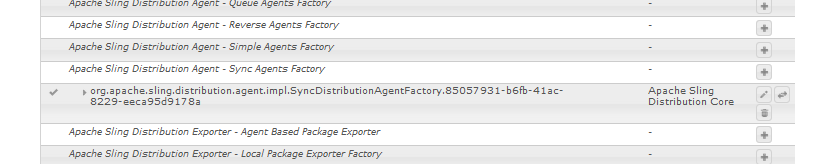

# Sincronización de usuarios{#user-synchronization}

## Introducción {#introduction}

Cuando la implementación es una [granja de servidores de publicación](/help/sites-deploying/recommended-deploys.md#tarmk-farm), los miembros deben poder iniciar sesión y ver sus datos en cualquier nodo de Publish.

Los usuarios y grupos de usuarios (datos de usuario) creados en el entorno de publicación no son necesarios en el entorno de creación.

La mayoría de los datos de usuario creados en el entorno de autor están pensados para permanecer en el entorno de autor y no para copiarse en instancias de Publish.

El registro y las modificaciones realizadas en una instancia de Publish deben sincronizarse con otras instancias de Publish para que tengan acceso a los mismos datos de usuario.

AEM A partir de la versión 6.1, cuando la sincronización de usuarios está habilitada, los datos de usuario se sincronizan automáticamente en las instancias de Publish de la granja y no se crean en el autor.

## Distribución de Sling {#sling-distribution}

Los datos del usuario, junto con sus [ACL](/help/sites-administering/security.md), se almacenan en [Oak Core](/help/sites-deploying/platform.md), la capa debajo de Oak JCR, y se accede a ellos mediante la [API de Oak](https://developer.adobe.com/experience-manager/reference-materials/6-5/javadoc/org/apache/jackrabbit/oak/api/package-tree.html). Con actualizaciones poco frecuentes, es razonable sincronizar los datos de usuario con otras instancias de Publish mediante [Sling Content Distribution](https://github.com/apache/sling-old-svn-mirror/blob/trunk/contrib/extensions/distribution/README.md) (Sling distribution).

Las ventajas de la sincronización de usuarios mediante la distribución Sling en comparación con la replicación tradicional son las siguientes:

* Los *usuarios*, *perfiles de usuario* y *grupos de usuarios* creados en Publish no se crean en Author

* La distribución de Sling establece propiedades en eventos jcr, lo que permite actuar dentro de detectores de eventos de publicación sin preocuparse por los bucles de replicación infinitos
* La distribución de Sling solo envía datos de usuario a instancias de Publish que no sean de origen, lo que elimina el tráfico innecesario
* [Las ACL](/help/sites-administering/security.md) establecidas en el nodo del usuario se incluyen en la sincronización

>[!NOTE]
>
>Si son necesarias sesiones, se recomienda utilizar una solución SSO o una sesión fija y hacer que los clientes inicien sesión si se les cambia a otra instancia de Publish.

>[!CAUTION]
>
>No se admite la sincronización del grupo **administradores**, aunque la sincronización del usuario esté habilitada. En su lugar, se registra un error al &quot;importar la comparación de diferencias&quot; en el registro de errores.
>
>Por lo tanto, cuando la implementación es una granja de servidores de publicación, si se agrega o se quita un usuario del grupo de **administradores**, la modificación debe realizarse manualmente en cada instancia de Publish.

## Activar sincronización de usuarios {#enable-user-sync}

>[!NOTE]
>
>De manera predeterminada, la sincronización de usuarios es `disabled`.
>
>Habilitar la sincronización de usuarios implica modificar *las configuraciones de OSGi existentes*.
>
>No se deben agregar nuevas configuraciones como resultado de habilitar la sincronización del usuario.

La sincronización de usuarios se basa en el entorno de creación para administrar las distribuciones de datos de usuario, aunque los datos de usuario no se creen en el entorno de creación. Gran parte de la configuración, pero no toda, tiene lugar en el entorno de creación y cada paso identifica claramente si se va a realizar en Author o Publish.

A continuación se indican los pasos necesarios para habilitar la sincronización de usuarios, seguidos de una sección [Solución de problemas](#troubleshooting):

### Requisitos previos {#prerequisites}

1. Si ya se han creado usuarios y grupos de usuarios en una instancia de Publish, se recomienda [sincronizar manualmente](#manually-syncing-users-and-user-groups) los datos de usuarios en todas las instancias de Publish antes de configurar y habilitar la sincronización de usuarios.

Una vez habilitada la sincronización de usuarios, solo se sincronizan los usuarios y grupos recién creados.

1. Asegúrese de que está instalado el código más reciente:

* AEM [Actualizaciones de la plataforma de](https://experienceleague.adobe.com/docs/experience-manager-release-information/aem-release-updates/aem-releases-updates.html?lang=es)
* [Actualizaciones de AEM Communities](/help/communities/deploy-communities.md#latestfeaturepack)

### 1. Agente de distribución de Apache Sling: fábrica de agentes de sincronización {#apache-sling-distribution-agent-sync-agents-factory}

**Habilitar sincronización de usuarios**

* **en autor**

   * iniciar sesión con privilegios de administrador
   * acceder a la [consola web](/help/sites-deploying/configuring-osgi.md)

      * por ejemplo, [https://localhost:4502/system/console/configMgr](https://localhost:4502/system/console/configMgr)

   * localizar `Apache Sling Distribution Agent - Sync Agents Factory`

      * seleccione la configuración existente para poder abrirla y editarla (icono de lápiz)
Verificar `name`: **`socialpubsync`**

      * seleccione la casilla de verificación `Enabled`
      * seleccionar `Save`


### 2. Crear usuario autorizado {#createauthuser}

**Configurar permisos**

El usuario autorizado se utiliza en el paso 3 para configurar la distribución de Sling en Autor.

* **en cada instancia de Publish**

   * iniciar sesión con privilegios de administrador
   * acceder a la [consola de seguridad](/help/sites-administering/security.md)

      * por ejemplo, [https://localhost:4503/useradmin](https://localhost:4503/useradmin)

   * crear un usuario

      * por ejemplo, `usersync-admin`

   * agregar este usuario al grupo de usuarios **`administrators`**
   * [agregar ACL para este usuario a /home](#howtoaddacl)

      * `Allow jcr:all` con restricción `rep:glob=*/activities/*`

>[!CAUTION]
>
>Se debe crear un nuevo usuario.
>
>* El usuario predeterminado asignado es **`admin`**.
>* No use `communities-user-admin user.`
>

#### Cómo añadir ACL {#addacls}

* CRXDE Lite de acceso

   * por ejemplo, [https://localhost:4503/crx/de](https://localhost:4503/crx/de)

* seleccionar nodo `/home`
* en el panel derecho, seleccione la ficha `Access Control`
* para agregar una entrada ACL, seleccione el botón `+`

   * **Principal**: *buscar usuario creado para la sincronización de usuarios*
   * **Tipo**: `Allow`
   * **Privilegios**: `jcr:all`
   * **Restricciones** `rep:glob`: `*/activities/*`
   * seleccionar **Aceptar**

* seleccionar **Guardar todo**


Ver también

* [Administración de derechos de acceso](/help/sites-administering/user-group-ac-admin.md#access-right-management)
* Solución de problemas de la sección [Modificar excepción de operación durante el procesamiento de respuesta](#modify-operation-exception-during-response-processing).

### 3. Adobe Granite Distribution - Proveedor secreto de transporte con contraseña cifrada {#adobegraniteencpasswrd}

**Configurar permisos**

Una vez que se crea un usuario autorizado (un miembro del grupo de usuarios **`administrators`**) en todas las instancias de Publish, el usuario autorizado debe identificarse en Autor como quien tiene permiso para sincronizar los datos de usuario de Autor a Publish.

* **en Autor**

   * iniciar sesión con privilegios de administrador
   * acceder a la [consola web](/help/sites-deploying/configuring-osgi.md)

      * por ejemplo, [https://localhost:4502/system/console/configMgr](https://localhost:4502/system/console/configMgr)

   * localizar `com.adobe.granite.distribution.core.impl.CryptoDistributionTransportSecretProvider.name`
   * para abrir y editar, seleccione la configuración existente (icono de lápiz)
Verificar `property name`: **`socialpubsync-publishUser`**

   * establezca el nombre de usuario y la contraseña en [usuario autorizado](#createauthuser) creado en Publish en el paso 2

      * por ejemplo, `usersync-admin`


### 4. Agente de distribución de Apache Sling: fábrica de agentes de cola {#apache-sling-distribution-agent-queue-agents-factory}

**Habilitar sincronización de usuarios**

* **en cada instancia de Publish**:

   * iniciar sesión con privilegios de administrador
   * acceder a la [consola web](/help/sites-deploying/configuring-osgi.md)

      * por ejemplo, [https://localhost:4503/system/console/configMgr](https://localhost:4503/system/console/configMgr)

   * localizar `Apache Sling Distribution Agent - Queue Agents Factory`

      * para abrir y editar, seleccione la configuración existente (icono de lápiz)
Verificar `Name`: `socialpubsync-reverse`

      * seleccione la casilla de verificación `Enabled`
      * seleccionar `Save`

   * **repetir** para cada instancia de Publish


### 5. Adobe Social Sync - Diff Observer Factory {#diffobserver}

**Habilitar sincronización de grupo**

* **en cada instancia de Publish**:

   * iniciar sesión con privilegios de administrador
   * acceder a la [consola web](/help/sites-deploying/configuring-osgi.md)

      * por ejemplo, [https://localhost:4503/system/console/configMgr](https://localhost:4503/system/console/configMgr)

   * localizar **`Adobe Social Sync - Diff Observer Factory`**

      * para abrir y editar, seleccione la configuración existente (icono de lápiz)

        Verificar `agent name`: `socialpubsync-reverse`

      * seleccione la casilla de verificación `Enabled`
      * seleccionar `Save`


### 6. Déclencheur de distribución de Apache Sling: fábrica de Déclencheur programados {#apache-sling-distribution-trigger-scheduled-triggers-factory}

**(Opcional) modificar intervalo de sondeo**

De forma predeterminada, el autor sondea los cambios cada 30 segundos. Para modificar este intervalo:

* **en Autor**

   * iniciar sesión con privilegios de administrador
   * acceder a la [consola web](/help/sites-deploying/configuring-osgi.md)

      * por ejemplo, [https://localhost:4502/system/console/configMgr](https://localhost:4502/system/console/configMgr)

   * localizar `Apache Sling Distribution Trigger - Scheduled Triggers Factory`

      * para abrir y editar, seleccione la configuración existente (icono de lápiz)

         * Verificar `Name`: `socialpubsync-scheduled-trigger`

      * establecer `Interval in Seconds` en el intervalo deseado
      * seleccionar `Save`


## Configuración para varias instancias de Publish {#configure-for-multiple-publish-instances}

La configuración predeterminada es para una sola instancia de Publish. Dado que el motivo para habilitar la sincronización de usuarios es sincronizar varias instancias de Publish, como para un conjunto de servidores de publicación, las instancias de Publish adicionales deben agregarse a la fábrica de agentes de sincronización.

### 7. Agente de distribución de Apache Sling: fábrica de agentes de sincronización {#apache-sling-distribution-agent-sync-agents-factory-1}

**Agregar instancias de Publish:**

* **en Autor**

   * iniciar sesión con privilegios de administrador
   * acceder a la [consola web](/help/sites-deploying/configuring-osgi.md)

      * por ejemplo, [https://localhost:4502/system/console/configMgr](https://localhost:4502/system/console/configMgr)

   * localizar `Apache Sling Distribution Agent - Sync Agents Factory`

      * para abrir y editar, seleccione la configuración existente (icono de lápiz)
Verificar `Name`: `socialpubsync`


* **Extremos del exportador**
Debe haber un extremo de exportador para cada instancia de Publish. Por ejemplo, si hay dos instancias de Publish, localhost:4503 y 4504, debe haber dos entradas:

   * `https://localhost:4503/libs/sling/distribution/services/exporters/socialpubsync-reverse`
   * `https://localhost:4504/libs/sling/distribution/services/exporters/socialpubsync-reverse`

* **Extremos del importador**
Debe haber un extremo de importador para cada instancia de Publish. Por ejemplo, si hay dos instancias de Publish, localhost:4503 y 4504, debe haber dos entradas:

   * `https://localhost:4503/libs/sling/distribution/services/importers/socialpubsync`
   * `https://localhost:4504/libs/sling/distribution/services/importers/socialpubsync`

* seleccionar `Save`

### 8. Receptor de sincronización de usuarios de AEM Communities {#aem-communities-user-sync-listener}

**(Opcional) Sincronizar nodos JCR adicionales**

Si hay datos personalizados para sincronizar en varias instancias de Publish, haga lo siguiente:

* **en cada instancia de Publish**:

   * iniciar sesión con privilegios de administrador
   * acceder a la [consola web](/help/sites-deploying/configuring-osgi.md)

      * por ejemplo, `https://localhost:4503/system/console/configMgr`

   * localizar `AEM Communities User Sync Listener`
   * para abrir y editar, seleccione la configuración existente (icono de lápiz)
Verificar `Name`: `socialpubsync-scheduled-trigger`


* **Tipos de nodo**
Esta es la lista de tipos de nodos sincronizados. Cualquier tipo de nodo que no sea sling:Folder debe enumerarse aquí (sling:folder se administra por separado).
Lista predeterminada de tipos de nodos para sincronizar:

   * rep:Usuario
   * nt:unstructured
   * nt:resource

* **Propiedades ignorables**
Esta es la lista de propiedades que se omiten si se detecta algún cambio. Los cambios en estas propiedades pueden sincronizarse como efecto secundario de otros cambios (ya que la sincronización siempre se realiza en el nivel de nodo), pero los cambios en estas propiedades no afectan, por sí solos, a la sincronización de déclencheur.
Propiedad predeterminada para omitir:

   * cq:lastModified

* **Nodos ignorables**
Subrutas que se ignoran durante la sincronización. No se sincroniza nada en estas subrutas en ningún momento.
Nodos predeterminados para omitir:

   * .tokens
   * sistema

* **Carpetas distribuidas**
La mayoría de sling:Folders se omiten porque la sincronización no es necesaria. Las pocas excepciones se enumeran aquí.
Carpetas predeterminadas para sincronizar

   * segmentos/puntuación
   * social/relaciones
   * actividades

### 9. ID único de Sling {#unique-sling-id}

>[!CAUTION]
>
>Si el ID de Sling coincide entre dos o más instancias de Publish, se produce un error en la sincronización de grupos de usuarios.

Si el ID de Sling es el mismo para varias instancias de Publish en un conjunto de servidores de publicación, los grupos de usuarios no se sincronizan.

Para validar que todos los valores de ID de Sling son diferentes, en cada instancia de Publish:

1. examinar a `http://<host>:<port>/system/console/status-slingsettings`
1. compruebe el valor de **Sling ID**


Si el ID de Sling de una instancia de Publish coincide con el ID de Sling de cualquier otra instancia de Publish, haga lo siguiente:

1. detenga una de las instancias de Publish que tenga un ID de Sling coincidente
1. en el directorio crx-quickstart/launchpad/felix

   * busque y elimine el archivo de nombre *sling.id.file*

      * por ejemplo, en un sistema Linux®:
        `rm -i $(find . -type f -name sling.id.file)`

      * por ejemplo, en un sistema Windows:
        `use windows explorer and search for *sling.id.file*`

1. inicio de la instancia de Publish

   * al inicio se le asigna un nuevo ID de Sling

1. validar que **Sling ID** sea ahora único

Repita estos pasos hasta que todas las instancias de Publish tengan un ID de Sling único.

## Generador de paquetes Vault Factory {#vault-package-builder-factory}

Para que las actualizaciones se sincronicen correctamente, es necesario modificar el generador de paquetes Vault para la sincronización de usuarios:

* AEM en cada instancia de Publish de la
* acceder a la [consola web](/help/sites-deploying/configuring-osgi.md)

   * por ejemplo, [https://localhost:4503/system/console/configMgr](https://localhost:4503/system/console/configMgr)

* buscar `Apache Sling Distribution Packaging - Vault Package Builder Factory`

   * `Builder name: socialpubsync-vlt`

* seleccione el icono de edición
* agregar dos `Package Node Filters`:

   * `/home/users|-.*/.tokens`
   * `/home/users|-.*/rep:cache`

* administración de directivas:

   * para sobrescribir los nodos rep:policy existentes con otros nuevos, agregue un tercer filtro de paquetes:

      * `/home/users|+.*/rep:policy`

   * para evitar que se distribuyan directivas, establezca

      * `Acl Handling:` `IGNORE`


## ¿Qué sucede cuando...? {#what-happens-when}

### El usuario se registra automáticamente o edita el perfil en Publish {#user-self-registers-or-edits-profile-on-publish}

Por diseño, los usuarios y perfiles creados en el entorno de publicación (registro automático) no aparecen en el entorno de creación.

Si la topología es una [granja de servidores de publicación](/help/sites-deploying/recommended-deploys.md#tarmk-farm) y la sincronización de usuarios se ha configurado correctamente, el *usuario* y el *perfil de usuario* se sincronizan en toda la granja de servidores de publicación mediante la distribución Sling.

### Los usuarios o grupos de usuarios se crean mediante la consola de seguridad {#users-or-user-groups-are-created-using-security-console}

Por diseño, los datos de usuario creados en el entorno de publicación no aparecen en el entorno de creación y a la inversa.

Cuando se usa la consola [Administración de usuarios y seguridad](/help/sites-administering/security.md) para agregar nuevos usuarios en el entorno de publicación, la sincronización de usuarios sincroniza los nuevos usuarios y su pertenencia a grupos con otras instancias de Publish, si es necesario. La sincronización de usuarios también sincroniza los grupos de usuarios creados mediante la consola de seguridad.

## Resolución de problemas {#troubleshooting}

### Cómo quitar la sincronización de usuarios sin conexión {#how-to-take-user-sync-offline}

Para quitar la sincronización de usuarios sin conexión, para [quitar una instancia de Publish](#how-to-remove-a-publish-instance) o [sincronizar datos manualmente](#manually-syncing-users-and-user-groups), la cola de distribución debe estar vacía y silenciosa.

Para comprobar el estado de la cola de distribución:

* en Autor:

   * usando [CRXDE Lite](/help/sites-developing/developing-with-crxde-lite.md)

      * buscar entradas en `/var/sling/distribution/packages`

         * nodos de carpeta llamados con el patrón `distrpackage_*`

   * usando [Administrador de paquetes](/help/sites-administering/package-manager.md)

      * buscar paquetes pendientes (aún no instalados)

         * con el patrón `socialpubsync-vlt*`
         * creado por `communities-user-admin`

Cuando la cola de distribución está vacía, deshabilitar la sincronización de usuarios:

* en Autor

   * *desmarque *la casilla de verificación `Enabled` para [Agente de distribución Apache Sling: fábrica de agentes de sincronización](#apache-sling-distribution-agent-sync-agents-factory)

Cuando finalice las tareas, para volver a habilitar la sincronización de usuarios:

* en Autor

   * marque la casilla de verificación `Enabled` para [Agente de distribución Apache Sling: fábrica de agentes de sincronización](#apache-sling-distribution-agent-sync-agents-factory)

### Diagnóstico de sincronización de usuario {#user-sync-diagnostics}

Diagnóstico de sincronización de usuarios es una herramienta que comprueba la configuración e intenta identificar cualquier problema.

En Autor, simplemente navegue desde la consola principal a través de **Herramientas, Operaciones, Diagnóstico, Diagnóstico de sincronización de usuarios.**

Los resultados se muestran al entrar en la consola Diagnóstico de sincronización de usuarios.

Esto es lo que se muestra cuando la sincronización de usuarios no se ha habilitado:


#### Cómo ejecutar diagnósticos para instancias de Publish {#how-to-run-diagnostics-for-publish-instances}

Cuando se ejecuta el diagnóstico desde el entorno de creación, los resultados de aprobado/suspenso incluyen una sección [INFO] que muestra la lista de instancias de Publish configuradas para su confirmación.

En la lista se incluye una dirección URL para cada instancia de Publish que ejecuta los diagnósticos para esa instancia. El parámetro de URL `syncUser` se anexa a la dirección URL de diagnóstico con su valor establecido en *usuario de sincronización autorizado* creado en [Paso 2](#createauthuser).

**Nota**: antes de iniciar la URL, el *usuario de sincronización autorizado* ya debe estar conectado a esa instancia de Publish.


### Configuración añadida incorrectamente {#configuration-improperly-added}

Cuando la sincronización de usuarios no funciona, el problema más común es que se *agregaron* configuraciones adicionales. En su lugar, la configuración *existente *predeterminada debería haberse *editado*.

A continuación, se muestran vistas de cómo deben aparecer las configuraciones predeterminadas editadas en la consola web. Si aparece más de una instancia, la configuración añadida debería eliminarse.

#### (Autor) Un agente de distribución de Apache Sling: fábrica de agentes de sincronización {#author-one-apache-sling-distribution-agent-sync-agents-factory}



#### (Autor) Credenciales de transporte de distribución de Apache Sling: credenciales de usuario basadas en DistributionTransportSecretProvider {#author-one-apache-sling-distribution-transport-credentials-user-credentials-based-distributiontransportsecretprovider}


#### (Publish) Un agente de distribución de Apache Sling: fábrica de agentes de cola {#publish-one-apache-sling-distribution-agent-queue-agents-factory}


#### (Publish) One Adobe Social Sync - Diff Observer Factory {#publish-one-adobe-social-sync-diff-observer-factory}


#### (Autor) Un Déclencheur de distribución de Apache Sling: fábrica de Déclencheur programados {#author-one-apache-sling-distribution-trigger-scheduled-triggers-factory}


### Modificar Excepción De Operación Durante El Procesamiento De Respuesta {#modify-operation-exception-during-response-processing}

Si lo siguiente es visible en el registro:

`org.apache.sling.servlets.post.impl.operations.ModifyOperation Exception during response processing.`

`java.lang.IllegalStateException: This tree does not exist`

A continuación, compruebe que la sección [2. Se siguió correctamente al usuario autorizado de creación ](#createauthuser).

En esta sección se describe la creación de un usuario autorizado, que existe en todas las instancias de Publish, y su identificación en la configuración OSGi del &quot;Proveedor secreto&quot; en Autor. De manera predeterminada, el usuario es `admin`.

El usuario autorizado debe convertirse en miembro del grupo de usuarios **`administrators`** y los permisos para ese grupo no deben modificarse.

El usuario autorizado debe tener explícitamente los siguientes privilegios y restricciones en todas las instancias de Publish:

| **ruta** | **jcr:all** | **rep:glob** |
|---|---|---|
| /home | X | &#42;/actividades/&#42; |
| /home/users | X | &#42;/actividades/&#42; |
| /home/groups | X | &#42;/actividades/&#42; |

Como miembro del grupo `administrators`, el usuario autorizado debe tener los siguientes privilegios en todas las instancias de Publish:

| **ruta** | **jcr:all** | **jcr:read** | **rep:write** |
|---|---|---|---|
| /etc/packages/sling/distribution |  |  | X |
| /libs/sling/distribution |  | X |  |
| /var |  |  | X |
| /var/eventing |  | X | X |
| /var/sling/distribution |  | X | X |

### Error de sincronización de grupo de usuarios {#user-group-sync-failed}

Si el ID de Sling coincide entre dos o más instancias de Publish, se produce un error en la sincronización de grupos de usuarios.

Consulte la sección [9. ID único de Sling ](#unique-sling-id)

### Sincronización manual de usuarios y grupos de usuarios {#manually-syncing-users-and-user-groups}

* en instancias de Publish en las que existen usuarios y grupos de usuarios:

   * [si está activada, deshabilitar la sincronización de usuarios](#how-to-take-user-sync-offline)
   * [crear un paquete](/help/sites-administering/package-manager.md#creating-a-new-package) de `/home`

      * al editar el paquete

         * Ficha Filtros: Agregar filtro: Ruta de acceso raíz: `/home`
         * Ficha Avanzadas: Administración de CA: `Overwrite`

   * [exportación del paquete](/help/sites-administering/package-manager.md#downloading-packages-to-your-file-system)

* en otras instancias de Publish:

   * [importación del paquete](/help/sites-administering/package-manager.md#installing-packages)

Para configurar o habilitar la sincronización de usuarios, vaya al paso 1: [Agente de distribución Apache Sling: fábrica de agentes de sincronización](#apache-sling-distribution-agent-sync-agents-factory)

### Cuando una instancia de Publish deja de estar disponible {#when-a-publish-instance-becomes-unavailable}

Cuando una instancia de Publish deja de estar disponible, no debe eliminarse si vuelve a conectarse en el futuro. Los cambios se ponen en cola para la instancia de Publish y, cuando vuelve a estar en línea, se procesan.

Si la instancia de Publish nunca vuelve a conectarse, si está sin conexión de forma permanente, debe eliminarse porque la acumulación de colas provoca un uso notable del espacio en disco en el entorno de creación.

Cuando una instancia de Publish está fuera de servicio, el registro de autor tiene excepciones similares a las siguientes:

```
28.01.2016 15:57:48.475 ERROR
 [pool-12-thread-34-org_apache_sling_distribution_queue_socialpubsync_endpoint1
 (org/apache/sling/distribution/queue/socialpubsync/endpoint1)]
 org.apache.sling.distribution.agent.impl.SimpleDistributionAgent [agent][socialpubsync] could not deliver package distrpackage_1454014575838_a2b45ec8-0400-42f3-bed8-ae09b66381cb
 org.apache.sling.distribution.packaging.DistributionPackageImportException: failed in importing package ...
```

### Cómo eliminar una instancia de Publish {#how-to-remove-a-publish-instance}

Para quitar una instancia de Publish de [Apache Sling Distribution Agent - Sync Agents Factory](#apache-sling-distribution-agent-sync-agents-factory), la cola de distribución debe estar vacía y silenciosa.

* en Autor:

   * [Desconectar la sincronización de usuarios](#how-to-take-user-sync-offline)
   * siga [paso 7](#apache-sling-distribution-agent-sync-agents-factory) para eliminar la instancia de Publish de ambas listas de servidores:

      * `Exporter Endpoints`
      * `Importer Endpoints`

   * volver a habilitar la sincronización de usuarios

      * marque la casilla de verificación `Enabled` para [Agente de distribución Apache Sling: fábrica de agentes de sincronización](#apache-sling-distribution-agent-sync-agents-factory)
