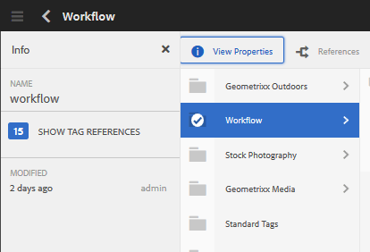
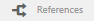
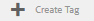
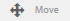
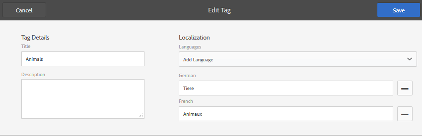

# Administración de etiquetas {#administering-tags}

Las etiquetas son un método rápido y fácil de clasificar contenido dentro de un sitio web. Se pueden considerar palabras clave o etiquetas (metadatos) que permiten que el contenido se encuentre más rápidamente como resultado de una búsqueda.

En Adobe Experience Manager (AEM), una etiqueta puede ser una propiedad de

* un nodo de contenido para una página (consulte [Uso de etiquetas](/help/sites-authoring/tags.md))

* un nodo de metadatos para un recurso (consulte [Administración de metadatos para recursos digitales](/help/assets/metadata.md))

Además de las páginas y los recursos, las etiquetas se utilizan para las funciones de AEM Communities

* contenido generado por el usuario (consulte [Etiquetado de UGC)](/help/communities/tag-ugc.md)

* Recursos de habilitación (consulte [Etiquetado de recursos de habilitación](/help/communities/functions.md#catalog-function))

## Características de la etiqueta {#tag-features}

Algunas de las características de las etiquetas dentro de AEM incluyen:

* Las etiquetas se pueden agrupar en varias Áreas de nombres. Tales jerarquías permiten la construcción de taxonomías. Estas taxonomías son globales a lo largo del AEM.
* La principal restricción para las etiquetas creadas recientemente es que deben ser únicas dentro de una Área de nombres específica.
* El título de una etiqueta no debe incluir caracteres de separación de ruta de etiquetas (ni se mostrarán si están presentes)

   * dos puntos `:`: delimita la etiqueta de Área de nombres
   * barra diagonal `/` - delimita las subetiquetas

* Los autores y los visitantes del sitio pueden aplicar las etiquetas. Independientemente del creador, todas las formas de etiquetas están disponibles para selección, tanto durante la asignación a una página como durante la búsqueda.
* Los miembros del grupo &quot;administradores de etiquetas&quot; y los miembros que tienen derechos de modificación a `/content/cq:tags` pueden crear etiquetas y modificar su taxonomía.

   * Una etiqueta que contiene etiquetas secundarias se denomina etiqueta de contenedor
   * Una etiqueta que no es una etiqueta de contenedor se denomina etiqueta de hoja
   * Una Área de nombres de etiqueta es una etiqueta de hoja o una etiqueta de contenedor

* Las etiquetas son utilizadas por el [componente de búsqueda](https://helpx.adobe.com/experience-manager/core-components/using/quick-search.html) para facilitar la búsqueda de contenido.
* Las etiquetas son utilizadas por el [componente Teaser](https://helpx.adobe.com/experience-manager/core-components/using/teaser.html), que supervisa la nube de etiquetas de un usuario para proporcionar contenido de destino.
* Si el etiquetado es un aspecto importante del contenido

   * asegúrese de empaquetar etiquetas con las páginas que las utilizan
   * asegúrese de [permisos de etiquetas](#setting-tag-permissions) habilitar acceso de lectura

## Consola de etiquetado {#tagging-console}

La consola Etiquetado se utiliza para crear y administrar etiquetas y sus taxonomías. Uno de los objetivos es evitar tener muchas etiquetas similares relacionadas básicamente con lo mismo: por ejemplo: página y páginas o calzado y zapatos.

Las etiquetas se administran agrupándolas en Áreas de nombres, revisando el uso de las etiquetas existentes antes de crear otras nuevas y reorganizándolas sin desconectar la etiqueta del contenido al que se hace referencia actualmente.

Para acceder a la consola de etiquetado:

* en autor
* iniciar sesión con privilegios administrativos
* de navegación global

   * select **`Tools`**
   * select **`General`**
   * select **`Tagging`**

### Creación de una Área de nombres {#creating-a-namespace}

Para crear una nueva Área de nombres, seleccione el icono **`Create Namespace`**.

La Área de nombres es en sí misma una etiqueta y no necesita contener subetiquetas. Sin embargo, para seguir creando una taxonomía, [cree subetiquetas](#creating-tags), que a su vez pueden ser etiquetas de hoja o de contenedor.

 

* **Título**

   *(obligatorio)* Un título de visualización para la Área de nombres.

* **Nombre**
   *(opcional)* Un nombre para la Área de nombres. Si no se especifica, se crea un nombre de nodo válido a partir del título. Consulte [TagID](/help/sites-developing/framework.md#tagid).

* **Descripción**

   *(opcional)* Una descripción de la Área de nombres.

Una vez introducida la información requerida

* seleccionar **Crear**

### Operaciones en etiquetas {#operations-on-tags}

Al seleccionar una Área de nombres u otra, se pueden realizar las siguientes operaciones:

* [Ver propiedades](#viewing-tag-properties)
* [Referencias](#showing-tag-references)
* [Crear etiqueta](#creating-tags)
* [Editar](#editing-tags)
* [Mover](#moving-tags)
* [Combinar](#merging-tags)
* [Publicación](#publishing-tags)
* [Cancelar publicación](#unpublishing-tags)
* [Eliminar](#deleting-tags)

Cuando la ventana del explorador no es lo suficientemente ancha como para mostrar todos los iconos, los iconos que se encuentran más a la derecha se agrupan bajo un icono **`... More`**, que mostrará una lista desplegable de los iconos de operación ocultos cuando se seleccionen.

### Selección de una etiqueta de Área de nombres {#selecting-a-namespace-tag}

Cuando se selecciona por primera vez, si la Área de nombres no contiene etiquetas, las propiedades se muestran a la derecha; de lo contrario, se muestran las etiquetas secundarias. Cada etiqueta seleccionada mostrará las etiquetas que contiene o sus propiedades si no tiene etiquetas secundarias.

Para seleccionar la etiqueta para operaciones y para realizar varias selecciones, seleccione sólo el icono situado junto al título. Al seleccionar el título, solo se mostrarán las propiedades o se abrirá la etiqueta para mostrar su contenido.

 

### Visualización de las propiedades de la etiqueta {#viewing-tag-properties}

Cuando se selecciona una Área de nombres u otra, al seleccionar el icono **`View Properties`** se muestra información sobre el `name`, la hora de la última edición y el número de referencias. Si se publica, se muestra la hora en que se publicó por última vez y la identificación del editor. Esta información aparecerá en una columna a la izquierda de las columnas de etiquetas.

### Mostrando referencias de etiqueta {#showing-tag-references}

Cuando se selecciona una Área de nombres u otra, al seleccionar el icono **Referencias** se identifica el contenido al que se ha aplicado la etiqueta.

La visualización inicial es un recuento de etiquetas aplicadas.

Al seleccionar la flecha a la derecha del recuento, se muestran los nombres de referencia.

La ruta a la referencia se muestra como información de objeto al pasar el ratón sobre una referencia.

### Creación de etiquetas {#creating-tags}

Cuando se selecciona una Área de nombres u otra (seleccionando el icono junto al título), se puede crear una etiqueta secundaria para la etiqueta actual seleccionando el icono **`Create Tag`**.

* **Título**
* (obligatorio) *Un título para mostrar de la etiqueta.

* **Nombre**
* (opcional) *Un nombre para la etiqueta. Si no se especifica, se crea un nombre de nodo válido a partir del título. Consulte [TagID](/help/sites-developing/framework.md#tagid).

* **Descripción**
* (opcional) *Una descripción de la etiqueta.

Una vez introducida la información requerida

* seleccionar **Crear**

### Edición de tags {#editing-tags}

Cuando se selecciona una Área de nombres u otra etiqueta, es posible modificar el Título, la Descripción y proporcionar localizaciones del Título seleccionando el icono **`Edit`**.

Después de realizar las ediciones, seleccione **Guardar**.

Para obtener más información sobre cómo agregar traducciones de idioma, consulte la sección sobre [Administración de etiquetas en diferentes idiomas](#managing-tags-in-different-languages).

### Movimiento de tags {#moving-tags}

Cuando se selecciona una Área de nombres u otra, al seleccionar el icono **`Move`** se permite a los administradores y desarrolladores de etiquetas limpiar la taxonomía moviendo la etiqueta a una nueva ubicación o cambiándole el nombre. Cuando la etiqueta seleccionada es una etiqueta de contenedor, al moverla también se moverán todas las etiquetas secundarias.

>[!NOTE]
>
>Se recomienda que los autores sólo puedan [editar](#editing-tags) la `title` etiqueta de la etiqueta, no mover ni cambiar el nombre de las etiquetas.

* **Ruta**

   *(solo lectura)* Ruta actual a la etiqueta seleccionada.

* **Vaya**
a Examinar hasta la nueva ruta en la que se moverá la etiqueta.

* **Cambiar nombre**
aMuestra inicialmente el 
`name`de la etiqueta. Se puede introducir un nuevo `name`.

* seleccionar **Guardar**

### Combinación de tags {#merging-tags}

Se pueden combinar etiquetas cuando una taxonomía tiene duplicados. Cuando la etiqueta A se combina en la etiqueta B, todas las páginas etiquetadas con la etiqueta A se etiquetarán con la etiqueta B y la etiqueta A ya no estará disponible para los autores.

Cuando se selecciona una Área de nombres u otra, al seleccionar el icono **Combinar** se abre un panel en el que se puede seleccionar la ruta de acceso en la que se va a combinar.

* **Ruta**

   *(solo lectura)* Ruta de la etiqueta seleccionada para combinarse en otra etiqueta.

* **Combinar**
enExaminar para seleccionar la ruta de la etiqueta en la que se va a combinar.

>[!NOTE]
>
>Después de la combinación, la **ruta** seleccionada originalmente ya no existirá (prácticamente).
>
>Cuando se mueve o combina una etiqueta a la que se hace referencia, la etiqueta no se elimina físicamente de modo que sea posible mantener referencias.

### Publicación de etiquetas {#publishing-tags}

Cuando se selecciona una Área de nombres u otra, se selecciona el icono **Publicar** para activar la etiqueta en el entorno de publicación. De forma similar al contenido de la página, solo se publica la etiqueta seleccionada, independientemente de si es una etiqueta de contenedor o no.

Para publicar una taxonomía (una Área de nombres y subetiquetas), lo mejor es crear un [paquete](/help/sites-administering/package-manager.md) de la Área de nombres (consulte [Nodo raíz de taxonomía](/help/sites-developing/framework.md#taxonomy-root-node)). Asegúrese de [aplicar permisos](#setting-tag-permissions) a la Área de nombres antes de crear el paquete.

### Cancelación de la publicación de etiquetas {#unpublishing-tags}

Cuando se selecciona una Área de nombres u otra, al seleccionar el icono **Cancelar la publicación** se desactiva la etiqueta en el entorno de creación y se elimina del entorno de publicación. De forma similar a la operación `Delete`, si la etiqueta seleccionada es una etiqueta de contenedor, todas las etiquetas secundarias se desactivarán en el entorno de creación y se eliminarán del entorno de publicación.

### Eliminación de tags {#deleting-tags}

Cuando se selecciona una Área de nombres u otra, al seleccionar el icono **Eliminar** se elimina permanentemente la etiqueta del entorno de creación. Si la etiqueta se ha publicado, también se eliminará del entorno de publicación. Si la etiqueta seleccionada es una etiqueta de contenedor, también se eliminarán todas las etiquetas secundarias.

## Configuración de permisos de etiquetas {#setting-tag-permissions}

Los permisos de etiquetas son [&#39;secure (de forma predeterminada)&#39;](/help/sites-administering/production-ready.md); una práctica recomendada para el entorno de publicación que requiere permiso de lectura para permitir explícitamente las etiquetas. Básicamente, esto se realiza creando un paquete de la Área de nombres Tag después de que se hayan establecido permisos en el autor e instalando el paquete en todas las instancias de publicación.

* en instancia de autor

   * iniciar sesión con privilegios administrativos
   * acceder a la [Consola de seguridad](/help/sites-administering/security.md#accessing-user-administration-with-the-security-console),

      * por ejemplo, vaya a http://localhost:4502/useradmin
   * en el panel izquierdo, seleccione el grupo (o usuario) para el que se va a conceder [permiso de lectura](/help/sites-administering/security.md#permissions)
   * en el panel derecho, localice la **Ruta **a la Área de nombres Tag

      * por ejemplo, `/content/cq:tags/mycommunity`
   * seleccione `checkbox`en la columna **Leer**
   * seleccionar **Guardar**

* asegurarse de que todas las instancias de publicación tienen los mismos permisos

   * un método es [crear un paquete](/help/sites-administering/package-manager.md#package-manager) de la Área de nombres en el autor

      * en la ficha `Advanced`, para `AC Handling` seleccione `Overwrite`
   * replicar el paquete

      * elija `Replicate` del administrador de paquetes

## Administración de tags en distintos idiomas {#managing-tags-in-different-languages}

La propiedad `title`de una etiqueta puede traducirse a varios idiomas. Una vez traducida, la etiqueta `title`correspondiente puede mostrarse según el idioma del usuario o el idioma de la página.

### Definición de títulos de tags en varios idiomas {#defining-tag-titles-in-multiple-languages}

A continuación se describe cómo traducir el `title`de la etiqueta **Animals** del inglés al alemán y al francés.

Para inicio, seleccione la etiqueta en la Área de nombres **Fotografía de almacenamiento** y seleccione el icono **`Edit`**(consulte la sección [Edición de etiquetas](#editing-tags)).

El panel Editar etiqueta presenta la capacidad de elegir idiomas en los que se va a localizar el título de la etiqueta.

A medida que se selecciona cada idioma, aparece un cuadro de entrada de texto en el que se puede introducir el título traducido.

Una vez ingresadas todas las traducciones, seleccione **Guardar** para salir del modo de edición.

En general, el idioma elegido para la etiqueta se toma del idioma de la página, cuando está disponible. Cuando se utiliza la [ `tag` utilidad](/help/sites-developing/building.md#tagging-on-the-client-side) en otros casos (por ejemplo, en formularios o en diálogos), el idioma de la etiqueta depende del contexto.

En lugar de utilizar la configuración de idioma de la página, la consola de etiquetado utiliza la configuración de idioma del usuario. En la consola de etiquetado, para la etiqueta &#39;Animals&#39;, se mostraría &#39;Animaux&#39; para un usuario que establezca el idioma en francés en sus propiedades de usuario.

Para agregar un nuevo idioma al cuadro de diálogo, consulte [Añadir un nuevo idioma al cuadro de diálogo Editar etiqueta](/help/sites-developing/building.md#adding-a-new-language-to-the-edit-tag-dialog).

>[!NOTE]
>
>La nube de etiquetas y las palabras clave meta del componente de página estándar utilizan la etiqueta localizada `titles`en función del idioma de la página, si está disponible.

## Medios {#resources}

* [Etiquetado para desarrolladores](/help/sites-developing/tags.md)

   Información sobre el marco de etiquetado, así como la extensión e inclusión de etiquetas en aplicaciones personalizadas.

* [Consola de etiquetado de IU clásica](/help/sites-administering/classic-console.md)

