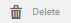

# Administración de etiquetas {#administering-tags}

Las etiquetas son un método rápido y fácil de clasificar contenido dentro de un sitio web. Se pueden considerar palabras clave o etiquetas (metadatos) que permiten que el contenido se encuentre más rápidamente como resultado de una búsqueda.

En Adobe Experience Manager (AEM), una etiqueta puede ser una propiedad de

* un nodo de contenido para una página (consulte [Uso de etiquetas](/help/sites-authoring/tags.md))

* un nodo de metadatos para un recurso (consulte [Gestión de metadatos para recursos](/help/assets/metadata.md)digitales)

Además de las páginas y los recursos, las etiquetas se utilizan para las funciones de AEM Communities

* contenido generado por el usuario (consulte [Etiquetado de UGC)](/help/communities/tag-ugc.md)

* Recursos de habilitación (consulte [Etiquetado de recursos](/help/communities/functions.md#catalog-function)de habilitación)

## Características de las etiquetas {#tag-features}

Algunas de las funciones de las etiquetas de AEM son:

* Las etiquetas se pueden agrupar en varios espacios de nombres. Tales jerarquías permiten la construcción de taxonomías. Estas taxonomías son globales en AEM.
* La restricción principal para las etiquetas recién creadas es que deben ser únicas dentro de un espacio de nombres específico.
* El título de una etiqueta no debe incluir caracteres de separación de ruta de etiquetas (ni se mostrarán si están presentes)

   * dos puntos `:` : delimita la etiqueta de espacio de nombres
   * barra diagonal `/` : delimita las subetiquetas

* Los autores y los visitantes del sitio pueden aplicar las etiquetas. Independientemente del creador, todas las formas de etiquetas están disponibles para selección, tanto durante la asignación a una página como durante la búsqueda.
* Los miembros del grupo &quot;administradores de etiquetas&quot; y los miembros que tienen derechos de modificación pueden crear etiquetas y modificar su taxonomía para `/content/cq:tags`.

   * Una etiqueta que contiene etiquetas secundarias se denomina etiqueta contenedora
   * Una etiqueta que no es una etiqueta de contenedor se denomina etiqueta de hoja
   * Un espacio de nombres de etiquetas es una etiqueta de hoja o una etiqueta de contenedor

* El componente  Buscar utiliza las etiquetas para facilitar la búsqueda de contenido.
* Tags are used by the [Teaser component](https://helpx.adobe.com/experience-manager/core-components/using/teaser.html), which monitors a user&#39;s tag cloud to provide targeted content.
* Si el etiquetado es un aspecto importante del contenido

   * asegúrese de empaquetar etiquetas con las páginas que las utilizan
   * asegúrese [de que los permisos](#setting-tag-permissions) de etiquetas habilitan el acceso de lectura

## Consola de etiquetado {#tagging-console}

La consola Etiquetado se utiliza para crear y administrar etiquetas y sus taxonomías. Uno de los objetivos es evitar tener muchas etiquetas similares relacionadas básicamente con lo mismo: por ejemplo: página y páginas o calzado y zapatos.

Las etiquetas se administran agrupando en espacios de nombres, revisando el uso de etiquetas existentes antes de crear nuevas y reorganizando sin desconectar la etiqueta del contenido al que se hace referencia actualmente.

Para acceder a la consola de etiquetado:

* en autor
* iniciar sesión con privilegios administrativos
* de navegación global

   * select **`Tools`**
   * select **`General`**
   * select **`Tagging`**

### Creación de un espacio de nombres {#creating-a-namespace}

Para crear un nuevo espacio de nombres, seleccione el **`Create Namespace`** icono .

El espacio de nombres es en sí mismo una etiqueta y no necesita contener ninguna subetiqueta. Sin embargo, para seguir creando una taxonomía, [cree subetiquetas](#creating-tags), que a su vez pueden ser etiquetas de hoja o de contenedor.

 

* **Título**
   *(obligatorio)* Un título de visualización para el espacio de nombres.

* **Nombre**
   *(opcional)* Un nombre para el espacio de nombres. Si no se especifica, se crea un nombre de nodo válido a partir del título. Consulte [TagID](/help/sites-developing/framework.md#tagid).

* **Descripción**
   *(opcional)* Descripción del espacio de nombres.

Una vez introducida la información requerida

* select **Create**

### Operaciones con etiquetas {#operations-on-tags}

Al seleccionar un espacio de nombres u otra etiqueta, se pueden realizar las siguientes operaciones:

* [Ver propiedades](#viewing-tag-properties)
* [Referencias](#showing-tag-references)
* [Crear etiqueta](#creating-tags)
* [Editar](#editing-tags)
* [Mover](#moving-tags)
* [Combinar](#merging-tags)
* [Publicación](#publishing-tags)
* [Cancelar publicación](#unpublishing-tags)
* [Eliminar](#deleting-tags)

Cuando la ventana del navegador no es lo suficientemente ancha como para mostrar todos los iconos, los iconos que se encuentran más a la derecha se agrupan bajo un **`... More`** icono, que mostrará una lista desplegable de los iconos de operación ocultos cuando se seleccionen.

### Selección de una etiqueta de espacio de nombres {#selecting-a-namespace-tag}

Cuando se selecciona por primera vez, si el espacio de nombres no contiene etiquetas, las propiedades se muestran a la derecha; de lo contrario, se muestran las etiquetas secundarias. Cada etiqueta seleccionada mostrará las etiquetas que contiene o sus propiedades si no tiene etiquetas secundarias.

Para seleccionar la etiqueta para operaciones y para realizar varias selecciones, seleccione sólo el icono situado junto al título. Al seleccionar el título, solo se mostrarán las propiedades o se abrirá la etiqueta para mostrar su contenido.

 

### Visualización de las propiedades de la etiqueta {#viewing-tag-properties}

Cuando se selecciona un espacio de nombres u otra etiqueta, al seleccionar el **`View Properties`** icono se muestra información sobre el `name`, la hora de la última edición y el número de referencias. Si se publica, se muestra la hora en que se publicó por última vez y la identificación del editor. Esta información aparecerá en una columna a la izquierda de las columnas de etiquetas.

### Visualización de referencias de etiqueta {#showing-tag-references}

Cuando se selecciona un espacio de nombres u otra etiqueta, al seleccionar el icono **Referencias** se identifica el contenido al que se ha aplicado la etiqueta.

La visualización inicial es un recuento de etiquetas aplicadas.

Al seleccionar la flecha a la derecha del recuento, se muestran los nombres de referencia.

La ruta a la referencia se muestra como información de objeto al pasar el ratón sobre una referencia.

### Creación de etiquetas {#creating-tags}

Cuando se selecciona un espacio de nombres u otra etiqueta (seleccionando el icono junto al título), se puede crear una etiqueta secundaria para la etiqueta actual seleccionando el **`Create Tag`** icono.

* **Título*** (obligatorio) *Un título para mostrar de la etiqueta.

* **Nombre*** (opcional) *Un nombre para la etiqueta. Si no se especifica, se crea un nombre de nodo válido a partir del título. Consulte [TagID](/help/sites-developing/framework.md#tagid).

* **Descripción*** (opcional) *Una descripción de la etiqueta.

Una vez introducida la información requerida

* select **Create**

### Edición de tags {#editing-tags}

Cuando se selecciona un espacio de nombres u otra etiqueta, es posible modificar el Título, la Descripción y proporcionar las localizaciones del Título seleccionando el icono **`Edit`**2.

Después de realizar las ediciones, seleccione **Guardar**.

Para obtener más información sobre cómo agregar traducciones de idioma, consulte la sección sobre [administración de etiquetas en diferentes idiomas](#managing-tags-in-different-languages).

### Movimiento de tags {#moving-tags}

Cuando se selecciona un espacio de nombres u otra etiqueta, al seleccionar el icono, los administradores y desarrolladores de etiquetas podrán limpiar la taxonomía moviendo la etiqueta a una nueva ubicación o cambiando su nombre. **`Move`** Cuando la etiqueta seleccionada es una etiqueta contenedora, al mover la etiqueta también se moverán todas las etiquetas secundarias.

>[!NOTE]
>
>Se recomienda permitir que los autores solo [editen](#editing-tags) las etiquetas `title`, no que muevan ni cambien el nombre de las etiquetas.

* **Ruta**
   *(solo lectura)* La ruta actual a la etiqueta seleccionada.

* **Desplácese hasta** la nueva ruta en la que desea mover la etiqueta.

* **Cambiar nombre a** inicialmente muestra la etiqueta actual `name`de la etiqueta. Se `name`puede introducir una nueva.

* select **Save**

### Combinación de tags {#merging-tags}

Se pueden combinar etiquetas cuando una taxonomía tiene duplicados. Cuando la etiqueta A se combina en la etiqueta B, todas las páginas etiquetadas con la etiqueta A se etiquetarán con la etiqueta B y la etiqueta A ya no estará disponible para los autores.

Cuando se selecciona un espacio de nombres u otra etiqueta, al seleccionar el icono **Combinar** se abre un panel en el que se puede seleccionar la ruta en la que se va a combinar.

* **Ruta**
   *(solo lectura)* La ruta de la etiqueta seleccionada para combinarse en otra etiqueta.

* **Combinar en** Examinar para seleccionar la ruta de la etiqueta en la que se va a combinar.

>[!NOTE]
>
>Después de la combinación, la **Ruta** seleccionada originalmente ya no existirá (prácticamente).
>
>Cuando se mueve o combina una etiqueta a la que se hace referencia, la etiqueta no se elimina físicamente de modo que sea posible mantener referencias.

### Publicación de etiquetas {#publishing-tags}

Cuando se selecciona un espacio de nombres u otra etiqueta, se selecciona el icono **Publicar** para activar la etiqueta en el entorno de publicación. De forma similar al contenido de la página, solo se publica la etiqueta seleccionada, independientemente de si es una etiqueta de contenedor o no.

Para publicar una taxonomía (un espacio de nombres y subetiquetas), lo mejor es crear un [paquete](/help/sites-administering/package-manager.md) del espacio de nombres (consulte Nodo raíz de taxonomía). Asegúrese de [aplicar permisos](#setting-tag-permissions) al espacio de nombres antes de crear el paquete.

### Cancelación de la publicación de etiquetas {#unpublishing-tags}

Cuando se selecciona un espacio de nombres u otra etiqueta, al seleccionar el icono **Cancelar publicación** se desactiva la etiqueta en el entorno de creación y se elimina del entorno de publicación. De forma similar a la `Delete`operación, si la etiqueta seleccionada es una etiqueta contenedora, todas sus etiquetas secundarias se desactivarán en el entorno de creación y se eliminarán del entorno de publicación.

### Eliminación de tags {#deleting-tags}

Cuando se selecciona un espacio de nombres u otra etiqueta, al seleccionar el icono **Eliminar** se elimina de forma permanente la etiqueta del entorno de creación. Si la etiqueta se ha publicado, también se eliminará del entorno de publicación. Si la etiqueta seleccionada es una etiqueta contenedora, también se eliminarán todas sus etiquetas secundarias.

## Configuración de permisos de etiquetas {#setting-tag-permissions}

Los permisos de etiquetas son [&#39;secure (de forma predeterminada)&#39;](/help/sites-administering/production-ready.md); una práctica recomendada para el entorno de publicación que requiere permiso de lectura para permitir explícitamente etiquetas. Básicamente, esto se realiza creando un paquete del espacio de nombres de etiquetas después de que se hayan establecido permisos en el autor e instalando el paquete en todas las instancias de publicación.

* en instancia de autor

   * iniciar sesión con privilegios administrativos
   * acceder a la consola [de seguridad](/help/sites-administering/security.md#accessing-user-administration-with-the-security-console),

      * por ejemplo, vaya a http://localhost:4502/useradmin
   * en el panel izquierdo, seleccione el grupo (o usuario) para el que se va a conceder el permiso [de](/help/sites-administering/security.md#permissions) lectura
   * en el panel derecho, ubique la **ruta **al espacio de nombres de la etiqueta

      * for example, `/content/cq:tags/mycommunity`
   * seleccione la opción `checkbox`en la columna **Leer**
   * select **Save**

* asegurarse de que todas las instancias de publicación tienen los mismos permisos

   * un método es [crear un paquete](/help/sites-administering/package-manager.md#package-manager) del espacio de nombres en el autor

      * en la `Advanced` ficha, para `AC Handling` seleccionar `Overwrite`
   * replicar el paquete

      * elegir `Replicate` del administrador de paquetes

## Administración de tags en distintos idiomas {#managing-tags-in-different-languages}

La `title`propiedad de una etiqueta puede traducirse a varios idiomas. Una vez traducida, la etiqueta adecuada `title`puede mostrarse según el idioma del usuario o el idioma de la página.

### Definición de títulos de tags en varios idiomas {#defining-tag-titles-in-multiple-languages}

A continuación se describe cómo traducir el `title`de la etiqueta **Animals** del inglés al alemán y al francés.

Comience por seleccionar la etiqueta en el espacio de nombres Fotografía **de** almacenamiento y seleccione el icono **`Edit`** (consulte la sección [Edición de etiquetas](#editing-tags) ).

El panel Editar etiqueta presenta la capacidad de elegir idiomas en los que se va a localizar el título de la etiqueta.

A medida que se selecciona cada idioma, aparece un cuadro de entrada de texto en el que se puede introducir el título traducido.

Una vez introducidas todas las traducciones, seleccione **Guardar** para salir del modo de edición.

En general, el idioma elegido para la etiqueta se toma del idioma de la página, cuando está disponible. When the [ `tag` widget](/help/sites-developing/building.md#tagging-on-the-client-side) is used in other cases (for example in forms or in dialogs), the tag language depends on the context.

En lugar de utilizar la configuración de idioma de la página, la consola de etiquetado utiliza la configuración de idioma del usuario. En la consola de etiquetado, para la etiqueta &#39;Animals&#39;, se mostraría &#39;Animaux&#39; para un usuario que establezca el idioma en francés en sus propiedades de usuario.

Para agregar un nuevo idioma al cuadro de diálogo, consulte [Adición de un nuevo idioma al cuadro de diálogo](/help/sites-developing/building.md#adding-a-new-language-to-the-edit-tag-dialog)Editar etiqueta.

>[!NOTE]
>
>The tag cloud and the meta keywords in the standard page component use the localized tag `titles`based on the page language, if available.

## Medios {#resources}

* [Etiquetado para desarrolladores](/help/sites-developing/tags.md)

   Información sobre el marco de etiquetado, así como la extensión e inclusión de etiquetas en aplicaciones personalizadas.

* [Consola de etiquetado de IU clásica](/help/sites-administering/classic-console.md)

