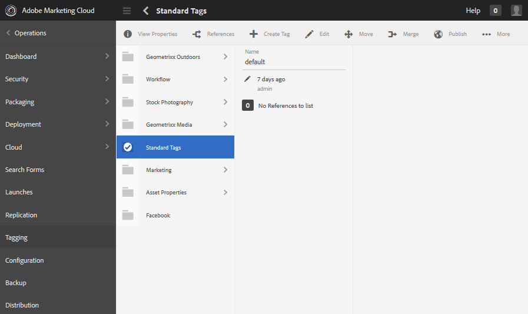

# Administración de etiquetas {#administering-tags}

Las etiquetas son un método rápido y fácil de clasificar contenido dentro de un sitio web. Se pueden considerar como palabras clave o etiquetas (metadatos) que permiten encontrar el contenido más rápidamente como resultado de una búsqueda.

En Adobe Experience Manager (AEM), una etiqueta puede ser una propiedad de

* un nodo de contenido para una página (consulte [Uso de etiquetas](/help/sites-authoring/tags.md))

* un nodo de metadatos para un recurso (consulte [Administración de metadatos de recursos digitales](/help/assets/metadata.md))

Además de las páginas y los recursos, las etiquetas se utilizan para las funciones de AEM Communities

* contenido generado por el usuario (consulte [Etiquetado UGC)](/help/communities/tag-ugc.md)

* Recursos de habilitación (consulte [Etiquetado de recursos de habilitación](/help/communities/functions.md#catalog-function))

## Características de las etiquetas {#tag-features}

Algunas de las características de las etiquetas de AEM incluyen:

* Las etiquetas se pueden agrupar en varios espacios de nombres. Tales jerarquías permiten la construcción de taxonomías. Estas taxonomías son globales a lo largo de AEM.
* La restricción principal para las etiquetas recién creadas es que deben ser únicas dentro de un espacio de nombres específico.
* El título de una etiqueta no debe incluir caracteres de separación de ruta de etiqueta (tampoco se mostrarán si están presentes)

   * dos puntos `:` - delimita la etiqueta del espacio de nombres
   * barra oblicua `/` - delimita las subetiquetas

* Los autores y los visitantes del sitio pueden aplicar etiquetas. Independientemente del creador, todas las formas de etiquetas están disponibles para selección, tanto durante la asignación a una página como durante la búsqueda.
* Los miembros del grupo &quot;administradores de etiquetas&quot; y los miembros que tengan derechos de modificación para `/content/cq:tags`.

   * Una etiqueta que contiene etiquetas secundarias se denomina etiqueta contenedora
   * Una etiqueta que no es una etiqueta contenedora se denomina etiqueta hoja
   * Un espacio de nombres de etiqueta es una etiqueta de hoja o una etiqueta de contenedor

* Las etiquetas las usa el [Componente de búsqueda](https://helpx.adobe.com/experience-manager/core-components/using/quick-search.html) para facilitar la búsqueda de contenido.
* Las etiquetas las usa el [Componente teaser](https://helpx.adobe.com/experience-manager/core-components/using/teaser.html), que supervisa la nube de etiquetas de un usuario para proporcionar contenido segmentado.
* Si el etiquetado es un aspecto importante del contenido

   * asegúrese de empaquetar etiquetas con las páginas que las utilizan
   * asegúrese de [permisos de etiquetas](#setting-tag-permissions) habilitar acceso de lectura

## Consola de etiquetado {#tagging-console}

La consola Etiquetado se utiliza para crear y administrar etiquetas y sus taxonomías. Un objetivo es evitar tener muchas etiquetas similares relacionadas básicamente con lo mismo: por ejemplo, página y páginas o calzado y zapatos.

Las etiquetas se administran agrupando en áreas de nombres, revisando el uso de las etiquetas existentes antes de crear otras nuevas y reorganizando sin desconectar la etiqueta del contenido al que se hace referencia actualmente.

Para acceder a la consola Etiquetado :

* en author
* iniciar sesión con privilegios administrativos
* desde la navegación global

   * select **`Tools`**
   * select **`General`**
   * select **`Tagging`**

### Creación de un área de nombres {#creating-a-namespace}

Para crear un nuevo área de nombres, seleccione la opción **`Create Namespace`** icono.

El área de nombres es en sí misma una etiqueta y no necesita contener ninguna subetiqueta. Sin embargo, para seguir creando una taxonomía, [crear subetiquetas](#creating-tags), que a su vez pueden ser etiquetas de hoja o de contenedor.

 

* **Título**

   *(obligatorio)* Título que se muestra para el espacio de nombres.

* **Nombre**
   *(opcional)* Un nombre para el área de nombres. Si no se especifica, se crea un nombre de nodo válido desde el Título. Consulte [TagID](/help/sites-developing/framework.md#tagid).

* **Descripción**

   *(opcional)* Descripción del área de nombres.

Una vez introducida la información requerida

* select **Crear**

### Operaciones con etiquetas {#operations-on-tags}

Al seleccionar un área de nombres u otra etiqueta, está disponible la siguiente operación:

* [Ver propiedades](#viewing-tag-properties)
* [Referencias](#showing-tag-references)
* [Crear etiqueta](#creating-tags)
* [Editar](#editing-tags)
* [Mover](#moving-tags)
* [Combinar](#merging-tags)
* [Publicación](#publishing-tags)
* [Cancelar publicación](#unpublishing-tags)
* [Eliminar](#deleting-tags)

Cuando la ventana del explorador no es lo suficientemente ancha como para mostrar todos los iconos, los iconos que se encuentran más a la derecha se agrupan bajo una **`... More`** , que muestra una lista desplegable de los iconos de operación ocultos cuando se seleccionan.

### Selección de una etiqueta de área de nombres {#selecting-a-namespace-tag}

Cuando se selecciona por primera vez, si el espacio de nombres no contiene etiquetas, las propiedades se muestran a la derecha; de lo contrario, se muestran las etiquetas secundarias. Cada etiqueta seleccionada mostrará las etiquetas que contiene o sus propiedades si no tiene etiquetas secundarias.

Para seleccionar la etiqueta para las operaciones y para seleccionar varias opciones, seleccione solo el icono al lado del título. Al seleccionar el título, solo se mostrarán las propiedades o se abrirá la etiqueta para mostrar su contenido.

 

### Visualización de las propiedades de la etiqueta {#viewing-tag-properties}

Cuando se selecciona un espacio de nombres u otra etiqueta, se selecciona la variable **`View Properties`** el icono de muestra la información sobre `name`, hora de la última edición y número de referencias. Si se publica, se muestra la hora de la última publicación y el id del editor. Esta información aparecerá en una columna a la izquierda de las columnas de etiquetas.

### Mostrar referencias de etiquetas {#showing-tag-references}

Cuando se selecciona un espacio de nombres u otra etiqueta, se selecciona la variable **Referencias** identificará el contenido al que se ha aplicado la etiqueta.

La visualización inicial es un recuento de etiquetas aplicadas.

Al seleccionar la flecha a la derecha del recuento, se muestran los nombres de referencia.

La ruta a la referencia se muestra como información del objeto al pasar el ratón por encima de una referencia.

### Creación de etiquetas {#creating-tags}

Cuando se selecciona un área de nombres u otra etiqueta (seleccionando el icono junto al título), se puede crear una etiqueta secundaria para la etiqueta actual seleccionando la etiqueta **`Create Tag`** icono.

* **Título**
*(obligatorio) *Un título que se muestra para la etiqueta.

* **Nombre**
*(opcional) *Un nombre para la etiqueta. Si no se especifica, se crea un nombre de nodo válido desde el Título. Consulte [TagID](/help/sites-developing/framework.md#tagid).

* **Descripción**
*(opcional) *Una descripción de la etiqueta.

Una vez introducida la información requerida

* select **Crear**

### Edición de tags {#editing-tags}

Cuando se selecciona un espacio de nombres u otra etiqueta, es posible modificar el Título, la Descripción y proporcionar las localizaciones del Título seleccionando el **`Edit`**icono.

Después de realizar las ediciones, seleccione **Guardar**.

Para obtener más información sobre cómo agregar traducciones de idioma, consulte la sección sobre [Administración de etiquetas en diferentes idiomas](#managing-tags-in-different-languages).

### Movimiento de tags {#moving-tags}

Cuando se selecciona un espacio de nombres u otra etiqueta, se selecciona la variable **`Move`** permitirá a los administradores y desarrolladores de etiquetas limpiar la taxonomía moviendo la etiqueta a una nueva ubicación o cambiando su nombre. Cuando la etiqueta seleccionada es una etiqueta contenedora, al mover la etiqueta también se moverán todas las etiquetas secundarias.

>[!NOTE]
>
>Se recomienda que solo se permita a los autores [editar](#editing-tags) la etiqueta `title`, no para mover ni cambiar el nombre de las etiquetas.

* **Ruta**

   *(solo lectura)* Ruta actual a la etiqueta seleccionada.

* **Mover a**
Vaya a la nueva ruta en la que desea mover la etiqueta .

* **Cambiar nombre a**
Muestra inicialmente el 
`name`de la etiqueta . Un nuevo `name`puede introducirse.

* select **Guardar**

### Combinación de tags {#merging-tags}

Se pueden combinar etiquetas cuando una taxonomía tiene duplicados. Cuando la etiqueta A se combina con la etiqueta B, todas las páginas etiquetadas con la etiqueta A se etiquetarán con la etiqueta B y la etiqueta A ya no estará disponible para los autores.

Cuando se selecciona un espacio de nombres u otra etiqueta, se selecciona la variable **Combinar** se abrirá un panel en el que se puede seleccionar la ruta en la que se va a combinar.

* **Ruta**

   *(solo lectura)* Ruta de la etiqueta seleccionada para combinarse en otra etiqueta.

* **Combinar en**
Busque para seleccionar la ruta de la etiqueta en la que desea combinar.

>[!NOTE]
>
>Después de la combinación, la variable **Ruta** la opción seleccionada originalmente (virtualmente) dejará de existir.
>
>Cuando se mueve o combina una etiqueta referenciada, la etiqueta no se elimina físicamente de modo que sea posible mantener referencias.

### Publicación de etiquetas {#publishing-tags}

Cuando se selecciona un espacio de nombres u otra etiqueta, se selecciona la variable **Publicación** para activar la etiqueta en el entorno de publicación. De forma similar al contenido de la página, solo se publica la etiqueta seleccionada, independientemente de si es una etiqueta contenedora o no.

Para publicar una taxonomía (un área de nombres y subetiquetas), la práctica recomendada es crear una [paquete](/help/sites-administering/package-manager.md) del espacio de nombres (consulte [Nodo raíz de taxonomía](/help/sites-developing/framework.md#taxonomy-root-node)). Asegúrese de [aplicar permisos](#setting-tag-permissions) al espacio de nombres antes de crear el paquete.

### Cancelación de la publicación de etiquetas {#unpublishing-tags}

Cuando se selecciona un espacio de nombres u otra etiqueta, se selecciona la variable **Cancelar la publicación** desactivará la etiqueta en el entorno de creación y la eliminará del entorno de publicación. Similar a la variable `Delete`, si la etiqueta seleccionada es una etiqueta contenedora, todas las etiquetas secundarias se desactivarán en el entorno de creación y se eliminarán del entorno de publicación.

### Eliminación de tags {#deleting-tags}

Cuando se selecciona un espacio de nombres u otra etiqueta, se selecciona la variable **Eliminar** quitará permanentemente la etiqueta del entorno de creación. Si la etiqueta se publicó, también se elimina del entorno de publicación. Si la etiqueta seleccionada es una etiqueta contenedora, también se eliminarán todas sus etiquetas secundarias.

## Configuración de permisos de etiquetas {#setting-tag-permissions}

Los permisos de etiquetas son [&#39;secure (de forma predeterminada)&#39;](/help/sites-administering/production-ready.md); una práctica recomendada para el entorno de publicación que requiere permiso de lectura para permitir explícitamente etiquetas. Básicamente, esto se hace creando un paquete del espacio de nombres de la etiqueta después de que se hayan establecido los permisos en el autor e instalando el paquete en todas las instancias de publicación.

* en instancia de autor

   * iniciar sesión con privilegios administrativos
   * acceda al [Consola de seguridad](/help/sites-administering/security.md#accessing-user-administration-with-the-security-console),

      * por ejemplo, vaya a http://localhost:4502/useradmin
   * en el panel izquierdo, seleccione el grupo (o usuario) para el que [leer permiso](/help/sites-administering/security.md#permissions) se concederá
   * en el panel derecho, busque **Ruta **al área de nombres de la etiqueta

      * por ejemplo, `/content/cq:tags/mycommunity`
   * seleccione `checkbox`en el **Lectura** column
   * select **Guardar**

* garantizar que todas las instancias de publicación tengan los mismos permisos

   * un enfoque es [crear un paquete](/help/sites-administering/package-manager.md#package-manager) del espacio de nombres en el autor

      * en `Advanced` para `AC Handling` select `Overwrite`
   * replicar el paquete

      * elija `Replicate` del gestor de paquetes

## Administración de tags en distintos idiomas {#managing-tags-in-different-languages}

La variable `title`La propiedad de una etiqueta puede traducirse a varios idiomas. Una vez traducida, la etiqueta apropiada `title`se pueden mostrar según el idioma del usuario o el idioma de la página.

### Definición de títulos de tags en varios idiomas {#defining-tag-titles-in-multiple-languages}

A continuación se describe cómo traducir la variable `title`de la etiqueta **Animales** de inglés a alemán y francés.

Para empezar, seleccione la etiqueta en la sección **Fotografía de archivo** espacio de nombres y selección del **`Edit`**icono (consulte [Edición de etiquetas](#editing-tags) ).

El panel Editar etiqueta presenta la capacidad de elegir los idiomas en los que se localizará el título de la etiqueta.

A medida que se selecciona cada idioma, aparece un cuadro de entrada de texto en el que se puede introducir el título traducido.

Una vez introducidas todas las traducciones, seleccione **Guardar** para salir del modo de edición.

En general, el idioma elegido para la etiqueta se toma del idioma de la página, cuando está disponible. Cuando la variable [ `tag` widget](/help/sites-developing/building.md#tagging-on-the-client-side) se utiliza en otros casos (por ejemplo, en formularios o en cuadros de diálogo), el idioma de la etiqueta depende del contexto.

En lugar de utilizar la configuración de idioma de la página, la consola Etiquetado utiliza la configuración de idioma del usuario. En la consola Etiquetado, para la etiqueta &quot;Animals&quot;, se mostraba &quot;Animaux&quot; para un usuario que establecía el idioma en francés en sus propiedades de usuario.

Para agregar un nuevo idioma al cuadro de diálogo, consulte [Adición de un nuevo idioma al cuadro de diálogo Editar etiqueta](/help/sites-developing/building.md#adding-a-new-language-to-the-edit-tag-dialog).

>[!NOTE]
>
>La nube de etiquetas y las palabras clave meta del componente de página estándar utilizan la etiqueta localizada `titles`en función del idioma de la página, si está disponible.

## Medios {#resources}

* [Etiquetado para desarrolladores](/help/sites-developing/tags.md)

   Información sobre el marco de etiquetado, así como la ampliación e inclusión de etiquetas en aplicaciones personalizadas.

* [Consola de etiquetado de la IU clásica](/help/sites-administering/classic-console.md)
