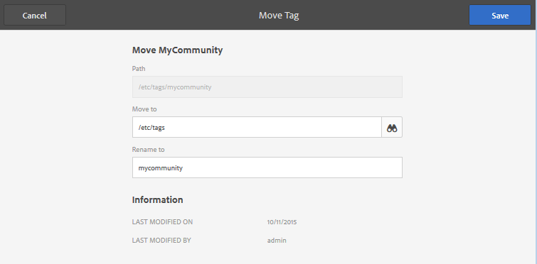

# Administración de etiquetas {#administering-tags}

Las etiquetas son un método rápido y fácil de clasificar contenido dentro de un sitio web. Se pueden considerar como palabras clave o etiquetas (metadatos) que permiten encontrar el contenido más rápidamente como resultado de una búsqueda.

En Adobe Experience Manager AEM (), una etiqueta puede ser una propiedad de

* un nodo de contenido para una página (consulte [Uso de etiquetas](/help/sites-authoring/tags.md))

* un nodo de metadatos para un recurso (consulte [Administración de metadatos para recursos digitales](/help/assets/metadata.md))

Además de las páginas y los recursos, las etiquetas se utilizan para las funciones de AEM Communities

* contenido generado por el usuario (consulte [Etiquetado (UGC)](/help/communities/tag-ugc.md)

* Recursos de habilitación (consulte [Recursos de habilitación de etiquetas](/help/communities/functions.md#catalog-function))

## Características de etiquetas {#tag-features}

AEM Algunas de las funciones de las etiquetas dentro de las etiquetas son las siguientes

* Las etiquetas se pueden agrupar en varias áreas de nombres. Tales jerarquías permiten la construcción de taxonomías. AEM Estas taxonomías son globales en todo el mundo
* La restricción principal para las etiquetas recién creadas es que deben ser únicas dentro de un área de nombres específica.
* El título de una etiqueta no debe incluir caracteres de separación de rutas de etiquetas (ni se mostrarán si están presentes)

   * dos puntos `:` : delimita la etiqueta de área de nombres
   * barra diagonal `/` - delimita las subetiquetas

* Los autores y visitantes del sitio pueden aplicar las etiquetas. Independientemente del creador, todas las formas de etiquetas están disponibles para selección, tanto durante la asignación a una página como durante la búsqueda.
* Los miembros del grupo &quot;administradores de etiquetas&quot; y los miembros que tienen derechos de modificación a pueden crear etiquetas y modificar su taxonomía `/content/cq:tags`.

   * Una etiqueta que contiene etiquetas secundarias se denomina etiqueta contenedora
   * Una etiqueta que no es una etiqueta contenedora se denomina etiqueta de hoja
   * Un área de nombres de etiqueta es una etiqueta de hoja o una etiqueta contenedora

* Las etiquetas son utilizadas por [Componente de búsqueda](https://helpx.adobe.com/experience-manager/core-components/using/quick-search.html) para facilitar la búsqueda de contenido.
* Las etiquetas son utilizadas por [Componente Teaser](https://helpx.adobe.com/experience-manager/core-components/using/teaser.html), que supervisa la nube de etiquetas de un usuario para proporcionar contenido de destino.
* Si el etiquetado es un aspecto importante del contenido

   * asegúrese de empaquetar las etiquetas con las páginas que las utilizan
   * asegurarse [permisos de etiquetas](#setting-tag-permissions) habilitar acceso de lectura

## Consola de etiquetado {#tagging-console}

La consola Etiquetado se utiliza para crear y administrar etiquetas y sus taxonomías. Un objetivo es evitar tener muchas etiquetas similares relacionadas básicamente con lo mismo : por ejemplo, páginas y páginas o calzado y zapatos.

Las etiquetas se administran agrupándolas en áreas de nombres, revisando el uso de las etiquetas existentes antes de crear nuevas etiquetas y reorganizándolas sin desconectar la etiqueta del contenido al que se hace referencia actualmente.

Para acceder a la consola de etiquetado:

* sobre el autor
* iniciar sesión con privilegios administrativos
* desde la navegación global

   * select **`Tools`**
   * select **`General`**
   * select **`Tagging`**

### Creación de un área de nombres {#creating-a-namespace}

Para crear una nueva área de nombres, seleccione la **`Create Namespace`** icono.

El área de nombres es en sí misma una etiqueta y no necesita contener subetiquetas. Sin embargo, para continuar creando una taxonomía, [creación de subetiquetas](#creating-tags), que a su vez pueden ser etiquetas de hoja o de contenedor.

 

* **Título**

   *(obligatorio)* Un título para mostrar para el área de nombres.

* **Nombre**
   *(opcional)* Un nombre para el área de nombres. Si no se especifica, se crea un nombre de nodo válido a partir del Título. Consulte [TagID](/help/sites-developing/framework.md#tagid).

* **Descripción**

   *(opcional)* Una descripción del área de nombres.

Una vez introducida la información requerida

* select **Crear**

### Operaciones en etiquetas {#operations-on-tags}

Al seleccionar un área de nombres u otra etiqueta, están disponibles las siguientes operaciones:

* [Ver propiedades](#viewing-tag-properties)
* [Referencias](#showing-tag-references)
* [Crear etiqueta](#creating-tags)
* [Editar](#editing-tags)
* [Mover](#moving-tags)
* [Combinar](#merging-tags)
* [Publicación](#publishing-tags)
* [Cancelar publicación](#unpublishing-tags)
* [Eliminar](#deleting-tags)

Cuando la ventana del explorador no es lo suficientemente ancha como para mostrar todos los iconos, los iconos situados más a la derecha se agrupan bajo una etiqueta **`... More`** , que mostrará una lista desplegable de los iconos de operación ocultos al seleccionarlos.

### Selección de una etiqueta de área de nombres {#selecting-a-namespace-tag}

Cuando se selecciona por primera vez, si el área de nombres no contiene etiquetas, las propiedades se muestran a la derecha; de lo contrario, se muestran las etiquetas secundarias. Cada etiqueta seleccionada mostrará las etiquetas que contiene o sus propiedades si no tiene etiquetas secundarias.

Para seleccionar la etiqueta para las operaciones y para la selección múltiple, seleccione solo el icono situado junto al título. Al seleccionar el título, solo se muestran las propiedades o se abre la etiqueta para mostrar su contenido.

 

### Visualización de propiedades de etiqueta {#viewing-tag-properties}

Cuando se selecciona un área de nombres u otra etiqueta, al seleccionar **`View Properties`** icono de muestra información sobre la variable. `name`, hora de la última edición y número de referencias. Si se publica, se muestra la hora en que se publicó por última vez y el ID del editor. Esta información aparece en una columna a la izquierda de las columnas de etiquetas.

### Mostrando referencias de etiqueta {#showing-tag-references}

Cuando se selecciona un área de nombres u otra etiqueta, al seleccionar **Referencias** identificará el contenido al que se ha aplicado la etiqueta.

La visualización inicial es un recuento de etiquetas aplicadas.

Al seleccionar la flecha a la derecha del recuento, se muestran los nombres de referencia.

La trayectoria hasta la referencia se muestra como información de objeto al pasar el cursor sobre una referencia.

### Creación de etiquetas {#creating-tags}

Cuando se selecciona un área de nombres u otra etiqueta (seleccionando el icono junto al título), se puede crear una etiqueta secundaria para la etiqueta actual seleccionando la **`Create Tag`** icono.

* **Título**
*(obligatorio) *Un título para mostrar para la etiqueta.

* **Nombre**
*(opcional) *Un nombre para la etiqueta. Si no se especifica, se crea un nombre de nodo válido a partir del Título. Consulte [TagID](/help/sites-developing/framework.md#tagid).

* **Descripción**
*(opcional) * Una descripción de la etiqueta.

Una vez introducida la información requerida

* select **Crear**

### Edición de tags {#editing-tags}

Cuando se selecciona un área de nombres u otra etiqueta, es posible modificar el Título, la Descripción y proporcionar localizaciones del Título seleccionando la **`Edit`**icono.

Una vez realizadas las ediciones, seleccione **Guardar**.

Para obtener más información sobre cómo añadir traducciones de idioma, consulte la sección sobre [Administración de etiquetas en diferentes idiomas](#managing-tags-in-different-languages).

### Movimiento de tags {#moving-tags}

Cuando se selecciona un área de nombres u otra etiqueta, al seleccionar **`Move`** Este icono permitirá a los administradores de etiquetas y a los desarrolladores limpiar la taxonomía moviendo la etiqueta a una nueva ubicación o cambiando el nombre. Si la etiqueta seleccionada es una etiqueta contenedora, al mover la etiqueta también se moverán todas las etiquetas secundarias.

>[!NOTE]
>
>Se recomienda que los autores solo puedan [editar](#editing-tags) la etiqueta de `title`, no para mover ni cambiar el nombre de las etiquetas.

* **Ruta**

   *(solo lectura)* Ruta actual a la etiqueta seleccionada.

* **Mover a**
Desplácese hasta la nueva ruta en la que desea mover la etiqueta.

* **Cambiar nombre a**
Muestra inicialmente el actual 
`name`de la etiqueta. Un nuevo `name`se puede introducir.

* select **Guardar**

### Combinación de tags {#merging-tags}

Se pueden combinar etiquetas cuando una taxonomía tiene duplicados. Cuando la etiqueta A se combina con la etiqueta B, todas las páginas etiquetadas con la etiqueta A se etiquetarán con la etiqueta B y la etiqueta A ya no estará disponible para los autores.

Cuando se selecciona un área de nombres u otra etiqueta, al seleccionar **Combinar** El icono abrirá un panel en el que se puede seleccionar la ruta de acceso de la combinación.

* **Ruta**

   *(solo lectura)* Ruta de la etiqueta seleccionada para combinarse con otra etiqueta.

* **Combinar en**
Busque y seleccione la ruta de la etiqueta en la que desea combinar.

>[!NOTE]
>
>Después de la combinación, la variable **Ruta** la selección original dejará de existir (prácticamente).
>
>Cuando se mueve o combina una etiqueta a la que se hace referencia, la etiqueta no se elimina físicamente de modo que sea posible mantener referencias.

### Publicación de etiquetas {#publishing-tags}

Cuando se selecciona un área de nombres u otra etiqueta, al seleccionar **Publish** para activar la etiqueta en el entorno de publicación. Al igual que el contenido de la página, solo se publica la etiqueta seleccionada, independientemente de si es una etiqueta contenedora o no.

Para publicar una taxonomía (un área de nombres y subetiquetas), la práctica recomendada es crear una [paquete](/help/sites-administering/package-manager.md) del área de nombres (consulte [Nodo raíz de taxonomía](/help/sites-developing/framework.md#taxonomy-root-node)). Asegúrese de [aplicar permisos](#setting-tag-permissions) al área de nombres antes de crear el paquete.

### Cancelar publicación de etiquetas {#unpublishing-tags}

Cuando se selecciona un área de nombres u otra etiqueta, al seleccionar **Cancelar publicación** Este icono desactivará la etiqueta en el entorno de creación y la quitará del entorno de publicación. Similar a la `Delete`, si la etiqueta seleccionada es una etiqueta contenedora, todas sus etiquetas secundarias se desactivarán en el entorno de creación y se eliminarán del entorno de publicación.

### Eliminación de tags {#deleting-tags}

Cuando se selecciona un área de nombres u otra etiqueta, al seleccionar **Eliminar** Este icono eliminará permanentemente la etiqueta del entorno de creación. Si la etiqueta se publicó, también se elimina del entorno de publicación. Si la etiqueta seleccionada es una etiqueta contenedora, también se eliminarán todas sus etiquetas secundarias.

## Configuración de permisos de etiquetas {#setting-tag-permissions}

Los permisos de etiquetas son [&quot;seguro (de forma predeterminada)&quot;](/help/sites-administering/production-ready.md); una práctica recomendada para el entorno de publicación que requiere permiso de lectura para permitir explícitamente etiquetas. Básicamente, esto se realiza creando un paquete del área de nombres de etiqueta después de configurar los permisos en el autor e instalando el paquete en todas las instancias de publicación.

* en la instancia de autor

   * iniciar sesión con privilegios administrativos
   * acceda al [Consola de seguridad](/help/sites-administering/security.md#accessing-user-administration-with-the-security-console),

      * por ejemplo, vaya a http://localhost:4502/useradmin
   * en el panel izquierdo, seleccione el grupo (o usuario) para el que [permiso de lectura](/help/sites-administering/security.md#permissions) se concederá a
   * en el panel derecho, busque el **Path **to the Tag Namespace

      * por ejemplo, `/content/cq:tags/mycommunity`
   * seleccione el `checkbox`en el **Leer** columna
   * select **Guardar**

* asegúrese de que todas las instancias de publicación tengan los mismos permisos

   * un enfoque es [creación de un paquete](/help/sites-administering/package-manager.md#package-manager) del área de nombres en autor

      * el `Advanced` pestaña, para `AC Handling` select `Overwrite`
   * replicar el paquete

      * escoger `Replicate` del administrador de paquetes

## Administración de tags en distintos idiomas {#managing-tags-in-different-languages}

El `title`La propiedad de una etiqueta se puede traducir a varios idiomas. Una vez traducida, la etiqueta adecuada `title`pueden mostrarse según el idioma del usuario o el idioma de la página.

### Definición de títulos de tags en varios idiomas {#defining-tag-titles-in-multiple-languages}

A continuación se describe cómo traducir el `title`de la etiqueta **Animales** de inglés a alemán y francés.

Para empezar, seleccione la etiqueta en la **Fotografías de archivo** área de nombres y selección del **`Edit`**icono (consulte [Edición de etiquetas](#editing-tags) ).

El panel Editar etiqueta presenta la capacidad de elegir los idiomas en los que se localizará el título de la etiqueta.

A medida que se selecciona cada idioma, aparece un cuadro de entrada de texto en el que se puede introducir el título traducido.

Una vez introducidas todas las traducciones, seleccione **Guardar** para salir del modo de edición.

En general, el idioma elegido para la etiqueta se toma del idioma de la página, cuando está disponible. Si la variable [ `tag` widget](/help/sites-developing/building.md#tagging-on-the-client-side) se utiliza en otros casos (por ejemplo, en formularios o cuadros de diálogo), el idioma de la etiqueta depende del contexto.

En lugar de utilizar la configuración de idioma de la página, la consola de etiquetado utiliza la configuración de idioma del usuario. En la consola de etiquetado, para la etiqueta &quot;Animales&quot;, se mostraría &quot;Animales&quot; para un usuario que establece el idioma en francés en sus propiedades de usuario.

Para añadir un nuevo idioma al cuadro de diálogo, consulte [Adición de un nuevo idioma al cuadro de diálogo Editar etiqueta](/help/sites-developing/building.md#adding-a-new-language-to-the-edit-tag-dialog).

>[!NOTE]
>
>La nube de etiquetas y las palabras clave meta del componente de página estándar utilizan la etiqueta localizada `titles`en función del idioma de la página, si está disponible.

## Recursos {#resources}

* [Etiquetado para desarrolladores](/help/sites-developing/tags.md)

   Información sobre el marco de etiquetado, así como la ampliación e inclusión de etiquetas en aplicaciones personalizadas.

* [Consola de etiquetado de IU clásica](/help/sites-administering/classic-console.md)
