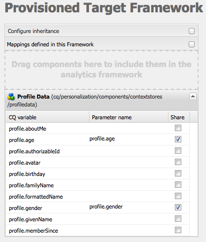
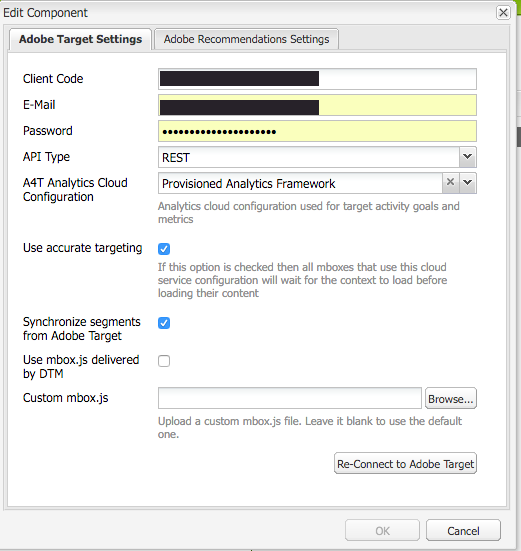
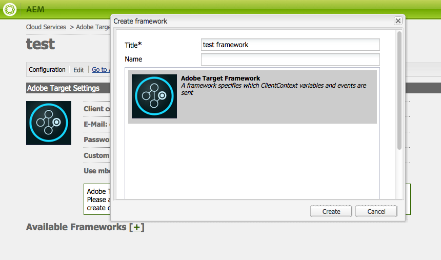

# Configuración manual de la integración con Adobe Target {#manually-configuring-the-integration-with-adobe-target}

Puede modificar las configuraciones del asistente para la inclusión que realizó al utilizar el asistente o puede integrarlas manualmente con Adobe Target sin utilizar el asistente.

## Modificación de las configuraciones del Asistente para la inclusión {#modifying-the-opt-in-wizard-configurations}

El [Asistente de inclusión](/help/sites-administering/opt-in.md) que [integra AEM con Adobe Target](/help/sites-administering/target.md) crea automáticamente una configuración de nube de Target denominada Configuración de destino aprovisionada. El asistente también crea un marco de Target para la configuración de nube denominada Marco de destino aprovisionado. Si es necesario, puede modificar las propiedades de la configuración de nube y del marco.

También puede configurar Adobe Target para que use Adobe Target como fuente de informes cuando se dirija el contenido configurando la Configuración de A4T Analytics Cloud.

Para localizar la configuración de nube y la estructura, vaya a **Cloud Services** a través de **Herramientas** > **Implementación** > **Nube**. ([http://localhost:4502/libs/cq/core/content/tools/cloudservices.html](http://localhost:4502/libs/cq/core/content/tools/cloudservices.html))
Debajo de Adobe Target, toque o haga clic en **Mostrar configuraciones**.

### Propiedades de configuración de Target aprovisionadas {#provisioned-target-configuration-properties}

Los siguientes valores de propiedad se utilizan en la configuración de nube de Configuración de Target aprovisionada que crea el asistente de inclusión:

* **Código de cliente:** tal como se ha introducido en el asistente de inclusión.
* **Correo electrónico:** tal como se ha introducido en el asistente de inclusión.
* **Contraseña:** tal como se ha introducido en el asistente de inclusión.
* **Tipo de API:** REST
* **Sincronizar segmentos de Adobe Target:** Seleccionado.

* **Biblioteca de cliente:** mbox.js.
* **Utilice DTM para entregar la biblioteca de cliente:** No está seleccionado. Seleccione esta opción si [utiliza DTM](/help/sites-administering/dtm.md) u otro sistema de administración de etiquetas para alojar el archivo mbox.js o AT.js. Adobe recomienda utilizar DTM en lugar de AEM para entregar la biblioteca.

* **Mbox.js personalizado:** no se ha especificado ninguno para que se use el archivo mbox.js predeterminado. Especifique un archivo mbox.js personalizado para utilizarlo cuando sea necesario. Solo aparece si ha seleccionado mbox.js.
* **AT.js personalizado:** no se ha especificado ninguno para que se utilice el archivo AT.js predeterminado. Especifique un archivo AT.js personalizado para usar según sea necesario. Solo aparece si ha seleccionado AT.js.

>[!NOTE]
>
>En AEM 6.3, puede seleccionar el archivo de biblioteca de Target, [AT.JS](https://docs.adobe.com/content/help/en/target/using/implement-target/client-side/mbox-implement/mbox-download.html), que es una nueva biblioteca de implementación para Adobe Target que está diseñada tanto para implementaciones web típicas como para aplicaciones de una sola página.
>
>AT.js ofrece varias mejoras con respecto a la biblioteca mbox.js :
>
>* Se han mejorado los tiempos de carga de las páginas en implementaciones web
>* Seguridad mejorada
>* Mejores opciones de implementación para aplicaciones de una sola página
>* AT.js contiene los componentes que se incluían en target.js, de modo que ya no se llama a target.js

### Propiedades de Target Framework aprovisionadas {#provisioned-target-framework-properties}

El marco de Target aprovisionado que crea el asistente de inclusión está configurado para enviar datos de contexto desde el almacén de datos de perfil. Los elementos de datos edad y sexo de la tienda se envían a Target de forma predeterminada. Es probable que la solución requiera que se envíen parámetros adicionales.

Puede configurar el marco para que envíe información de contexto adicional a Target como se describe en [Añadir un marco de destino](/help/sites-administering/target-configuring.md#adding-a-target-framework).

### Configuración de A4T Analytics Cloud {#configuring-a-t-analytics-cloud-configuration}

Puede configurar Adobe Target para que use Adobe Analytics como fuente de informes al destinar contenido.

>[!NOTE]
>
>La autenticación de usuarios y credenciales (heredada) no funciona con A4T (tanto para Target como para Analytics). Como tal, los clientes deben utilizar la autenticación IMS en lugar de la autenticación de usuario-credencial.

Para ello, debe especificar la configuración de nube de A4T con la que conectar la configuración de nube de Adobe Target:

1. Vaya a **Cloud Services** a través del **logotipo de AEM** > **Herramientas** > **Implementación** > **Cloud Services**.
1. En la sección **Adobe Target**, haga clic en **Configurar ahora**.
1. Vuelva a conectar con la configuración de Adobe Target.
1. En el menú desplegable **A4T Analytics Cloud Configuration**, seleccione el marco.

   >[!NOTE]
   >
   >Solo están disponibles las configuraciones de análisis que están habilitadas para A4T.
   >
   >Al configurar A4T con AEM, es posible que vea una entrada que falta en una referencia de configuración. Para poder seleccionar el marco de análisis, haga lo siguiente:
   >
   >1. Vaya a **Tools** > **General** > **CRXDE Lite**.
   1. Vaya a:
      `/libs/cq/analytics/components/testandtargetpage/dialog/items/tabs/items/tab1_general/items/a4tAnalyticsConfig`
   1. Establezca la propiedad **disable** en **false**.
   1. Toque o haga clic en **Guardar todo**.

   

   Haga clic en **Aceptar**. Al dirigir contenido con Adobe Target, puede [seleccionar el origen del informe](/help/sites-authoring/content-targeting-touch.md).

## Integración manual con Adobe Target {#manually-integrating-with-adobe-target}

Integre manualmente con Adobe Target en lugar de utilizar el asistente de inclusión.

>[!NOTE]
El archivo de biblioteca de Target, [AT.JS](https://docs.adobe.com/content/help/en/target/using/implement-target/client-side/mbox-implement/mbox-download.html), es una nueva biblioteca de implementación para Adobe Target que está diseñada tanto para implementaciones web típicas como para aplicaciones de una sola página. Adobe recomienda usar AT.js en lugar de mbox.js como biblioteca de cliente.
AT.js ofrece varias mejoras con respecto a la biblioteca mbox.js :
* Se han mejorado los tiempos de carga de las páginas en implementaciones web
* Seguridad mejorada
* Mejores opciones de implementación para aplicaciones de una sola página
* AT.js contiene los componentes que se incluían en target.js, de modo que ya no se llama a target.js
Puede seleccionar AT.js o mbox.js en el menú desplegable **Biblioteca de cliente**.

### Creación de una configuración de Target Cloud {#creating-a-target-cloud-configuration}

Para permitir que AEM interactúe con Adobe Target, cree una configuración de nube de Target. Para crear la configuración, proporcione el código de cliente de Adobe Target y las credenciales de usuario.

La configuración de la nube de Target solo se crea una vez porque se puede asociar con varias campañas de AEM. Si tiene varios códigos de cliente de Adobe Target, cree una configuración para cada código de cliente.

Puede configurar la configuración de nube para sincronizar segmentos desde Adobe Target. Si activa la sincronización, los segmentos se importan desde Target en segundo plano en cuanto se guarda la configuración de la nube.

Utilice el siguiente procedimiento para crear una configuración de nube de Target en AEM:

1. Vaya a **Cloud Services** a través del **logotipo de AEM** > **Herramientas** > **Implementación** > **Cloud Services**. ([http://localhost:4502/libs/cq/core/content/tools/cloudservices.html](http://localhost:4502/libs/cq/core/content/tools/cloudservices.html))

   Se abre la página de información general de **Adobe Marketing Cloud**.

1. En la sección **Adobe Target**, haga clic en **Configurar ahora**.
1. En el cuadro de diálogo **Crear configuración**:

   1. Asigne a la configuración un **Título**.
   1. Seleccione la plantilla **Adobe Target Configuration**.
   1. Haga clic en **Crear**.

   Se abre el cuadro de diálogo de edición.

   

   >[!NOTE]
   Al configurar A4T con AEM, es posible que vea una entrada que falta en una referencia de configuración. Para poder seleccionar el marco de análisis, haga lo siguiente:
   1. Vaya a **Tools** > **General** > **CRXDE Lite**.
   1. Vaya a **/libs/cq/analytics/components/testandtargetpage/dialog/items/tabs/items/tab1_general/items/a4tAnalyticsConfig**
   1. Establezca la propiedad **disable** en **false**.
   1. Toque o haga clic en **Guardar todo**.

1. En el cuadro de diálogo , proporcione valores para estas propiedades.

   * **Código** de cliente: el código de cliente de la cuenta de Target
   * **Correo electrónico**: el correo electrónico de la cuenta de Target.
   * **Contraseña**: la contraseña de la cuenta de Target.
   * **Tipo** de API: REST o XML
   * **Configuración** de A4T Analytics Cloud: Seleccione la configuración de nube de Analytics que se utiliza para las métricas y los objetivos de las actividades de Target. Lo necesita si utiliza Adobe Analytics como fuente de informes al segmentar contenido. Si no ve la configuración de nube, consulte la nota en [Configuración de A4T Analytics Cloud](#configuring-a-t-analytics-cloud-configuration).

   * **Usar segmentación precisa:** de forma predeterminada, esta casilla de verificación está seleccionada. Si se selecciona, la configuración del servicio de nube esperará a que el contexto se cargue antes de cargar el contenido. Véase la nota siguiente.
   * **Sincronizar segmentos de Adobe Target:** seleccione esta opción para descargar segmentos definidos en Target y utilizarlos en AEM. Debe seleccionar esta opción cuando la propiedad Tipo de API sea REST, ya que los segmentos en línea no son compatibles y siempre necesita utilizar segmentos de Target. (Tenga en cuenta que el AEM término &quot;segmento&quot; equivale a la &quot;audiencia&quot; de Target).
   * **Biblioteca de cliente:** seleccione si desea la biblioteca de cliente mbox.js o AT.js.
   * **Usar DTM para entregar la biblioteca de cliente** : seleccione esta opción para usar AT.js o mbox.js desde DTM u otro sistema de administración de etiquetas. Debe [configurar la integración de DTM](/help/sites-administering/dtm.md) para utilizar esta opción. Adobe recomienda utilizar DTM en lugar de AEM para entregar la biblioteca.
   * **Mbox.js** personalizado: Déjelo en blanco si ha marcado la casilla DTM o para usar el mbox.js predeterminado. También puede cargar el mbox.js personalizado. Solo aparece si ha seleccionado mbox.js.
   * **AT.js** personalizado: Deje en blanco si ha marcado la casilla DTM o para utilizar el AT.js predeterminado. Como alternativa, cargue su AT.js personalizado. Solo aparece si ha seleccionado AT.js.

   >[!NOTE]
   De forma predeterminada, al entrar en el asistente de configuración de Adobe Target, la Orientación precisa está habilitada.
   La segmentación precisa significa que la configuración del servicio en la nube espera a que el contexto se cargue antes de cargar el contenido. Como resultado, en términos de rendimiento, una segmentación precisa puede provocar un retraso de unos milisegundos antes de cargar el contenido.
   La segmentación precisa siempre está habilitada en la instancia de autor. Sin embargo, en la instancia de publicación puede optar por desactivar la segmentación precisa globalmente desactivando la marca de verificación junto a Orientación precisa en la configuración del servicio en la nube (**http://localhost:4502/etc/cloudservices.html**). También puede activar y desactivar la segmentación precisa para componentes individuales independientemente de la configuración del servicio en la nube.
   Si ya ha ***creado*** componentes de destino y cambia esta configuración, los cambios no afectarán a esos componentes. Debe realizar cualquier cambio en esos componentes directamente.

1. Haga clic en **Connect to Target** para inicializar la conexión con Target. Si la conexión se realiza correctamente, aparece el mensaje **Connection success**. Haga clic **OK** en el mensaje y, a continuación, en **OK** en el cuadro de diálogo.

   Si no puede conectarse a Target, consulte la sección [solución de problemas](/help/sites-administering/target-configuring.md#troubleshooting-target-connection-problems).

### Adición de un marco de destino {#adding-a-target-framework}

Después de configurar la nube de Target, agregue un marco de Target. La estructura identifica los parámetros predeterminados que se envían a Adobe Target desde los componentes [Client Context](/help/sites-administering/client-context.md) o [ContextHub](/help/sites-developing/ch-configuring.md) disponibles. Target usa los parámetros para determinar los segmentos que se aplican al contexto actual.

Puede crear varios marcos para una sola configuración de Target. Los marcos de trabajo múltiples son útiles cuando necesita enviar un conjunto diferente de parámetros a Target para diferentes secciones del sitio web. Cree un marco para cada conjunto de parámetros que necesite enviar. Asocie cada sección del sitio web con el marco adecuado. Tenga en cuenta que una página web solo puede utilizar un marco a la vez.

1. En la página de configuración de Target, haga clic en **+** (signo más) junto a Marcos disponibles.
1. En el cuadro de diálogo Crear marco, especifique un **Título**, seleccione el **Marco de Adobe Target** y haga clic en **Crear**.

   

   Se abre la página del marco de trabajo. La barra de tareas proporciona componentes que representan información de [Client Context](/help/sites-administering/client-context.md) o [ContextHub](/help/sites-developing/ch-configuring.md) que puede asignar.

   

1. Arrastre el componente Client Context que representa los datos que desea utilizar para la asignación al destino de colocación. También puede arrastrar el componente **Almacenamiento de ContextHub** al marco.

   >[!NOTE]
   Al asignar, los parámetros se pasan a un mbox mediante cadenas simples. No se pueden asignar matrices desde ContextHub.

   Por ejemplo, para utilizar **Datos de perfil** acerca de los visitantes del sitio para controlar la campaña de Target, arrastre el componente **Datos de perfil** a la página. Aparecen las variables de datos de perfil disponibles para su asignación a parámetros de Target.

   

1. Para seleccionar las variables que desea que sean visibles para el sistema Adobe Target, seleccione la casilla **Share** en las columnas correspondientes.

   

   >[!NOTE]
   La sincronización de parámetros es solo de una manera, de AEM a Adobe Target.

Se crea el marco. Para replicar el marco en la instancia de publicación, utilice la opción **Activar marco** de la barra de tareas.

### Asociación de actividades a la configuración de Target Cloud  {#associating-activities-with-the-target-cloud-configuration}

Asocie sus [AEM actividades](/help/sites-authoring/activitylib.md) con la configuración de la nube de Target para que pueda imitar las actividades de [Adobe Target](https://docs.adobe.com/content/help/en/target/using/experiences/offers/manage-content.html).

>[!NOTE]
Los tipos de actividades estarán disponibles dependiendo de lo siguiente:
* Si la opción **xt_only** está habilitada en el inquilino de Adobe Target (clientcode) que se usa en el lado AEM para conectar con Adobe Target, **solo** puede crear actividades de XT en AEM.
* Si las opciones **xt_only** **no** están habilitadas en el inquilino de Adobe Target (clientcode), puede crear **ambas** actividades de XT y de pruebas A/B en AEM.
**Nota adicional:** las opciones de **xt_only** son una configuración aplicada en un inquilino de Target (clientcode) y sólo se pueden modificar directamente en Adobe Target. No puede activar ni desactivar esta opción en AEM.

### Asociación del marco de trabajo de Target con el sitio {#associating-the-target-framework-with-your-site}

Después de crear un marco de Target en AEM, asocie las páginas web con el marco. Los componentes de destino de las páginas envían los datos definidos por el marco a Adobe Target para su seguimiento. (Consulte [Segmentación de contenido](/help/sites-authoring/content-targeting-touch.md)).

Cuando asocia una página con la estructura, las páginas secundarias heredan la asociación.

1. En la consola **Sitios**, navegue hasta el sitio que desee configurar.
1. Mediante [acciones rápidas](/help/sites-authoring/basic-handling.md#quick-actions) o [modo de selección](/help/sites-authoring/basic-handling.md), seleccione **Ver propiedades.**
1. Seleccione la pestaña **Cloud Services**.
1. Toque o haga clic en **Editar**.
1. Pulse o haga clic en **Agregar configuración** en **Configuraciones del Cloud Service** y seleccione **Adobe Target**.

   

1. Seleccione el marco que desee en **Referencia de configuración**.

   >[!NOTE]
   Asegúrese de seleccionar el **framework** específico que ha creado y no la configuración de nube de Target en la que se creó.

1. Toque o haga clic en **Listo**.
1. Active la página raíz del sitio web para replicarla en el servidor de publicación. (Consulte [Cómo publicar páginas](/help/sites-authoring/publishing-pages.md)).

   >[!NOTE]
   Si el marco que adjuntó a la página aún no se ha activado, se abre un asistente que le permite publicarlo también.

## Solución de problemas de conexión de Target {#troubleshooting-target-connection-problems}

Realice las siguientes tareas para solucionar problemas que se producen al conectarse a Target:

* Asegúrese de que las credenciales de usuario que proporcione sean correctas.
* Asegúrese de que la instancia de AEM se pueda conectar al servidor de Target. Por ejemplo, asegúrese de que las reglas de firewall no bloqueen las conexiones AEM salientes o que AEM esté configurado para usar los proxies necesarios.
* Busque mensajes útiles en el registro de errores de AEM. El archivo error.log se encuentra en el directorio **crx-quickstart/logs** donde AEM está instalado.
* Al editar la actividad en Adobe Target, la URL señala a localhost. Para solucionarlo, establezca el AEM externalizador en la dirección URL correcta.
