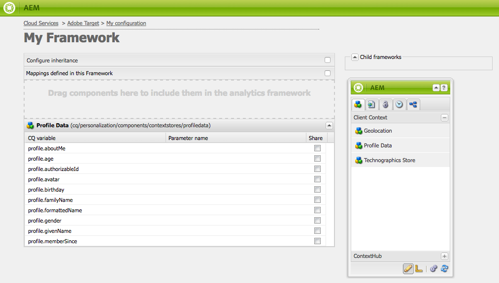
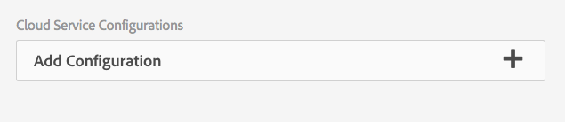

# Configuración manual de la integración con Adobe Target {#manually-configuring-the-integration-with-adobe-target}

Puede modificar las configuraciones del asistente para la selección que realizó al utilizar el asistente o puede integrarlas manualmente con Adobe Target sin necesidad de utilizar el asistente.

## Modificación de las configuraciones del Asistente para la selección {#modifying-the-opt-in-wizard-configurations}

El asistente para [la selección](/help/sites-administering/opt-in.md) que [integra AEM con Adobe Target](/help/sites-administering/target.md) crea automáticamente una configuración de nube de Target denominada Configuración de Target aprovisionada. El asistente también crea un marco de Target para la configuración de nube denominada Provisioning Target Framework. Si es necesario, puede modificar las propiedades de la configuración de nube y del marco.

También puede configurar Adobe Target para que utilice Adobe Target como fuente de informes al destinar contenido mediante la configuración de la nube de A4T Analytics.

Para localizar la configuración de nube y el marco, vaya a **Cloud Services** mediante **Herramientas** > **Implementación** > **Cloud**. ([http://localhost:4502/libs/cq/core/content/tools/cloudservices.html](http://localhost:4502/libs/cq/core/content/tools/cloudservices.html))Debajo de Adobe Target, toque o haga clic en **Mostrar configuraciones**.

### Propiedades de configuración de Target aprovisionadas {#provisioned-target-configuration-properties}

Los siguientes valores de propiedad se utilizan en la configuración de nube de configuración de Target aprovisionada que crea el asistente para la selección:

* **** Código de cliente: Tal como se especificó en el asistente para la selección.
* **** Correo electrónico: Tal como se especificó en el asistente para la selección.
* **** Contraseña: Tal como se especificó en el asistente para la selección.
* **** Tipo de API: REST
* **** Sincronizar segmentos desde Adobe Target: Seleccionado.

* **** Biblioteca de cliente: mbox.js.
* **** Utilice la DTM para distribuir la biblioteca del cliente: No seleccionado. Seleccione esta opción si [utiliza la DTM](/help/sites-administering/dtm.md) u otro sistema de administración de etiquetas para alojar el archivo mbox.js o AT.js. Adobe recomienda utilizar la DTM en lugar de AEM para distribuir la biblioteca.

* **** Mbox.js personalizado: No se especificó ninguna para que se utilice el archivo mbox.js predeterminado. Especifique un archivo mbox.js personalizado para utilizarlo según sea necesario. Solo aparece si ha seleccionado mbox.js.
* **** AT.js personalizado: No se especificó ninguna para que se utilice el archivo AT.js predeterminado. Especifique un archivo AT.js personalizado para utilizarlo según sea necesario. Solo aparece si ha seleccionado AT.js.

>[!NOTE]
>
>En AEM 6.3, puede seleccionar el archivo de biblioteca de Target, [AT.JS](https://marketing.adobe.com/resources/help/en_US/target/ov2/c_target-atjs-implementation.html), que es una nueva biblioteca de implementación para Adobe Target diseñada tanto para implementaciones web típicas como para aplicaciones de una sola página.
>
>AT.js ofrece varias mejoras con respecto a la biblioteca mbox.js:
>
>* Se han mejorado los tiempos de carga de las páginas para implementaciones web
>* Seguridad mejorada
>* Mejores opciones de implementación para aplicaciones de una sola página
>* AT.js contiene los componentes que se incluyeron en target.js, por lo que ya no hay una llamada a target.js
>
>
Consulte las notas [de la versión](https://marketing.adobe.com/resources/help/en_US/target/rn/201604.html) de Target para obtener más información.

### Propiedades de Target Framework aprovisionadas {#provisioned-target-framework-properties}

El módulo de Target aprovisionado que crea el asistente para la selección está configurado para enviar datos de contexto desde el almacén de datos de perfil. Los elementos de datos de edad y sexo de la tienda se envían a Target de forma predeterminada. Es probable que la solución requiera que se envíen parámetros adicionales.

Puede configurar la estructura para que envíe información de contexto adicional a Target como se describe en [Adición de un marco](/help/sites-administering/target-configuring.md#adding-a-target-framework)de destino.

### Configuring A4T Analytics Cloud Configuration {#configuring-a-t-analytics-cloud-configuration}

Puede configurar Adobe Target para que utilice Adobe Analytics como fuente de informes al destinar contenido.

Para ello, debe especificar la configuración de nube de A4T con la que conectar la configuración de nube de Adobe Target:

1. Vaya a **Cloud Services** mediante el logotipo **de** AEM > **Herramientas** > **Implementación** > Servicios **de nube**.
1. En la sección **Adobe Target** , haga clic en **Configurar ahora**.
1. Vuelva a conectarse a la configuración de Adobe Target.
1. En el menú desplegable Configuración **de nube de** A4T Analytics, seleccione el marco.

   >[!NOTE]
   >
   >Solo están disponibles las configuraciones de análisis habilitadas para A4T.
   >
   >Al configurar A4T con AEM, es posible que vea que falta una entrada de referencia de configuración. Para poder seleccionar el marco de análisis, haga lo siguiente:
   >
   >1. Vaya a **Herramientas** > **General** > **CRXDE Lite**.
   1. Vaya a **/libs/cq/analytics/components/testandtargetpage/dialog/items/tab/items/items/items/tab1_general/items/a4tConfiguración de Analytics**
   1. Establezca la propiedad **disable** en **false**.
   1. Tap or click **Save All**.

   

   Haga clic en **Aceptar**. Al dirigir contenido con Adobe Target, puede [seleccionar el origen](/help/sites-authoring/content-targeting-touch.md)del informe.

## Manually Integrating with Adobe Target {#manually-integrating-with-adobe-target}

Integración manual con Adobe Target en lugar de utilizar el asistente para la selección.

>[!NOTE]
El archivo de biblioteca de Target, [AT.JS](https://marketing.adobe.com/resources/help/en_US/target/ov2/c_target-atjs-implementation.html), es una nueva biblioteca de implementación para Adobe Target que está diseñada tanto para implementaciones web típicas como para aplicaciones de una sola página. Adobe recomienda utilizar AT.js en lugar de mbox.js como biblioteca de cliente.
AT.js ofrece varias mejoras con respecto a la biblioteca mbox.js:
* Se han mejorado los tiempos de carga de las páginas para implementaciones web
* Seguridad mejorada
* Mejores opciones de implementación para aplicaciones de una sola página
* AT.js contiene los componentes que se incluyeron en target.js, por lo que ya no hay una llamada a target.js

Consulte las notas [de la versión](https://marketing.adobe.com/resources/help/en_US/target/rn/201604.html) de Target para obtener más información.
Puede seleccionar AT.js o mbox.js en el menú desplegable Biblioteca **de** cliente.

### Creación de una configuración de Target Cloud {#creating-a-target-cloud-configuration}

Para permitir que AEM interactúe con Adobe Target, cree una configuración de nube de Target. Para crear la configuración, debe proporcionar el código de cliente y las credenciales de usuario de Adobe Target.

La configuración de la nube de Target solo se crea una vez porque puede asociarla a varias campañas de AEM. Si tiene varios códigos de cliente de Adobe Target, cree una configuración para cada código de cliente.

Puede configurar la configuración de nube para sincronizar segmentos desde Adobe Target. Si activa la sincronización, los segmentos se importan desde Target en segundo plano en cuanto se guarda la configuración de la nube.

Utilice el procedimiento siguiente para crear una configuración de nube de Target en AEM:

1. Vaya a **Cloud Services** mediante el logotipo **de** AEM > **Herramientas** > **Implementación** > Servicios **de nube**. ([http://localhost:4502/libs/cq/core/content/tools/cloudservices.html](http://localhost:4502/libs/cq/core/content/tools/cloudservices.html))

   Se abre la página de información general de **Adobe Marketing Cloud** .

1. En la sección **Adobe Target** , haga clic en **Configurar ahora**.
1. En el cuadro de diálogo **Crear configuración** :

   1. Asigne un **Título** a la configuración.
   1. Seleccione la plantilla Configuración **de** Adobe Target.
   1. Haga clic en **Crear**.
   Se abre el cuadro de diálogo de edición.

   

   >[!NOTE]
   Al configurar A4T con AEM, es posible que vea que falta una entrada de referencia de configuración. Para poder seleccionar el marco de análisis, haga lo siguiente:
   1. Vaya a **Herramientas** > **General** > **CRXDE Lite**.
   1. Vaya a **/libs/cq/analytics/components/testandtargetpage/dialog/items/tab/items/items/items/tab1_general/items/a4tConfiguración de Analytics**
   1. Establezca la propiedad **disable** en **false**.
   1. Tap or click **Save All**.

1. En el cuadro de diálogo, proporcione valores para estas propiedades.

   * **Código** de cliente: el código de cliente de la cuenta de Target
   * **Correo** electrónico: el correo electrónico de la cuenta de Target.
   * **Contraseña**: la contraseña de la cuenta de Target.
   * **Tipo** de API: REST o XML
   * **Configuración** de nube de A4T Analytics: Seleccione la configuración de nube de Analytics que se utiliza para las métricas y los objetivos de la actividad de destino. Esto es necesario si utiliza Adobe Analytics como fuente de informes al destinar contenido. Si no ve la configuración de nube, consulte la nota en [Configuración](#configuring-a-t-analytics-cloud-configuration)de la nube de A4T Analytics.

   * **** Usar objetivos precisos: De forma predeterminada, esta casilla de verificación está activada. Si se selecciona, la configuración del servicio en la nube esperará a que se cargue el contexto antes de cargar el contenido. Véase la nota siguiente.
   * **** Sincronizar segmentos desde Adobe Target: Seleccione esta opción para descargar segmentos definidos en Target y utilizarlos en AEM. Debe seleccionar esta opción cuando la propiedad Tipo de API sea REST, ya que los segmentos en línea no son compatibles y siempre debe utilizar segmentos de Target. (Tenga en cuenta que el término de AEM &#39;segment&#39; equivale a la &#39;audiencia&#39; de Target).
   * **** Biblioteca de cliente: Seleccione si desea la biblioteca de cliente mbox.js o AT.js.
   * **Utilice la DTM para entregar la biblioteca** de cliente: seleccione esta opción para utilizar AT.js o mbox.js de la DTM o de otro sistema de administración de etiquetas. Debe [configurar la integración](/help/sites-administering/dtm.md) de DTM para utilizar esta opción. Adobe recomienda utilizar la DTM en lugar de AEM para distribuir la biblioteca.
   * **Mbox.js** personalizado: Déjelo en blanco si ha marcado la casilla de la DTM o para usar el mbox.js predeterminado. También puede cargar el archivo mbox.js personalizado. Solo aparece si ha seleccionado mbox.js.
   * **AT.js** personalizado: Deje en blanco si ha marcado la casilla de la DTM o para utilizar el valor predeterminado de AT.js. Como alternativa, cargue su AT.js personalizado. Solo aparece si ha seleccionado AT.js.
   >[!NOTE]
   De forma predeterminada, cuando se selecciona en el asistente de configuración de Adobe Target, la segmentación precisa está activada.
   La segmentación precisa significa que la configuración del servicio en la nube espera a que se cargue el contexto antes de cargar el contenido. Como resultado, en términos de rendimiento, la segmentación precisa puede crear un retraso de unos milisegundos antes de cargar el contenido.
   La segmentación precisa siempre está habilitada en la instancia de creación. Sin embargo, en la instancia de publicación, puede desactivar la segmentación precisa globalmente borrando la marca de verificación junto a Objetivo preciso en la configuración del servicio en la nube (**http://localhost:4502/etc/cloudservices.html**). También puede activar y desactivar la segmentación precisa para componentes individuales independientemente de la configuración del servicio en la nube.
   Si ***ya*** ha creado componentes de destino y cambia esta configuración, los cambios no afectarán a dichos componentes. Debe realizar cambios directamente en esos componentes.

1. Haga clic en **Conectar con Target** para inicializar la conexión con Target. Si la conexión se realiza correctamente, se muestra el mensaje **Conexión correcta** . Haga clic en **Aceptar** en el mensaje y, a continuación, en **Aceptar** en el cuadro de diálogo.

   Si no puede conectarse a Target, consulte la sección de [solución de problemas](/help/sites-administering/target-configuring.md#troubleshooting-target-connection-problems) .

### Adición de un marco de objetivos {#adding-a-target-framework}

Después de configurar la nube de Target, agregue un marco de Target. La estructura identifica los parámetros predeterminados que se envían a Adobe Target desde los componentes disponibles de [Client Context](/help/sites-administering/client-context.md) o [ContextHub](/help/sites-administering/contexthub-config.md) . Target usa los parámetros para determinar los segmentos que se aplican al contexto actual.

Puede crear varios marcos para una sola configuración de Target. Los marcos de trabajo múltiples son útiles cuando necesita enviar un conjunto diferente de parámetros a Target para diferentes secciones del sitio web. Cree un marco para cada conjunto de parámetros que necesite enviar. Asocie cada sección del sitio Web con la estructura adecuada. Tenga en cuenta que una página web solo puede utilizar un marco de trabajo a la vez.

1. En la página de configuración de Target, haga clic en el signo **+** (signo más) situado junto a Marcos disponibles.
1. En el cuadro de diálogo Crear marco, especifique un **título**, seleccione **Adobe Target Framework** y haga clic en **Crear**.

   

   Se abre la página del marco. La barra de tareas proporciona componentes que representan información de [Client Context](/help/sites-administering/client-context.md) o [ContextHub](/help/sites-administering/contexthub-config.md) que se puede asignar.

   

1. Arrastre el componente ClientContext que representa los datos que desea utilizar para la asignación al destino de colocación. Como alternativa, arrastre **el componente de la Tienda** ContextHub al marco.

   >[!NOTE]
   Al realizar la asignación, los parámetros se pasan a un mbox a través de cadenas sencillas. No se pueden asignar matrices desde ContextHub.

   Por ejemplo, para utilizar Datos **de perfil** sobre los visitantes del sitio para controlar la campaña de Target, arrastre el componente Datos de **perfil** a la página. Aparecerán las variables de datos de perfil disponibles para la asignación a parámetros de Target.

   

1. Seleccione las variables que desea que el sistema Adobe Target pueda ver seleccionando la casilla de verificación **Compartir** en las columnas correspondientes.

   

   >[!NOTE]
   La sincronización de parámetros solo es de una forma: de AEM a Adobe Target.

Se crea el marco. Para replicar el marco en la instancia de publicación, utilice la opción **Activar marco** de la barra de tareas.

### Asociación de actividades con la configuración de Target Cloud {#associating-activities-with-the-target-cloud-configuration}

Asocie sus actividades [de](/help/sites-authoring/activitylib.md) AEM con la configuración de nube de Target para que pueda reflejar las actividades de [Adobe Target](https://marketing.adobe.com/resources/help/en_US/target/target/c_manage_content.html).

>[!NOTE]
Los tipos de actividades estarán disponibles dependiendo de lo siguiente:
* Si la opción **xt_only** está habilitada en el inquilino de Adobe Target (clientcode) que se usa en el lado AEM para conectar con Adobe Target, **solo** puede crear actividades de XT en AEM.

* Si las opciones **xt_only** **no** están habilitadas en el inquilino de Adobe Target (clientcode), puede crear **ambas** actividades de XT y de pruebas A/B en AEM.

**Nota adicional:** las opciones de **xt_only** son una configuración aplicada en un inquilino de Target (clientcode) y sólo se pueden modificar directamente en Adobe Target. No se puede activar o desactivar esta opción en AEM.

### Asociación del entorno de Target con el sitio {#associating-the-target-framework-with-your-site}

Después de crear un marco de Target en AEM, asocie sus páginas web con el marco. Los componentes de destino de las páginas envían los datos definidos por el marco a Adobe Target para su seguimiento. (Consulte Objetivo [de contenido](/help/sites-authoring/content-targeting-touch.md)).

Al asociar una página con el marco, las páginas secundarias heredan la asociación.

1. En la consola **Sitios** , navegue al sitio que desee configurar.
1. Mediante acciones  rápidas o el modo de selección, seleccione **Ver propiedades.**
1. Seleccione la ficha **Cloud Services** .
1. Tap/click **Edit**.
1. Toque o haga clic en **Agregar configuración** en Configuraciones **de servicio de** nube y seleccione **Adobe Target**.

   

1. Seleccione el marco que desee en Referencia **de configuración**.

   >[!NOTE]
   Asegúrese de seleccionar el **marco** específico que creó y no la configuración de nube de Target en la que se creó.

1. Toque o haga clic en **Hecho**.
1. Active la página raíz del sitio web para replicarla en el servidor de publicación. (See [How To Publish Pages](/help/sites-authoring/publishing-pages.md).)

   >[!NOTE]
   Si el marco que ha adjuntado a la página aún no se ha activado, se abrirá un asistente que le permitirá publicarlo también.

## Resolución de problemas de conexión de Target {#troubleshooting-target-connection-problems}

Realice las siguientes tareas para solucionar problemas que se producen al conectarse a Target:

* Asegúrese de que las credenciales de usuario proporcionadas son correctas.
* Asegúrese de que la instancia de AEM se puede conectar al servidor de Target. Por ejemplo, asegúrese de que las reglas de firewall no bloquean las conexiones AEM salientes o de que AEM está configurado para utilizar los proxies necesarios.
* Busque mensajes útiles en el registro de errores de AEM. El archivo error.log se encuentra en el directorio **crx-quickstart/logs** donde AEM está instalado.
* Al editar la actividad en Adobe Target, la dirección URL señala a localhost. Para solucionar esto, establezca el externalizador de AEM en la dirección URL correcta.

