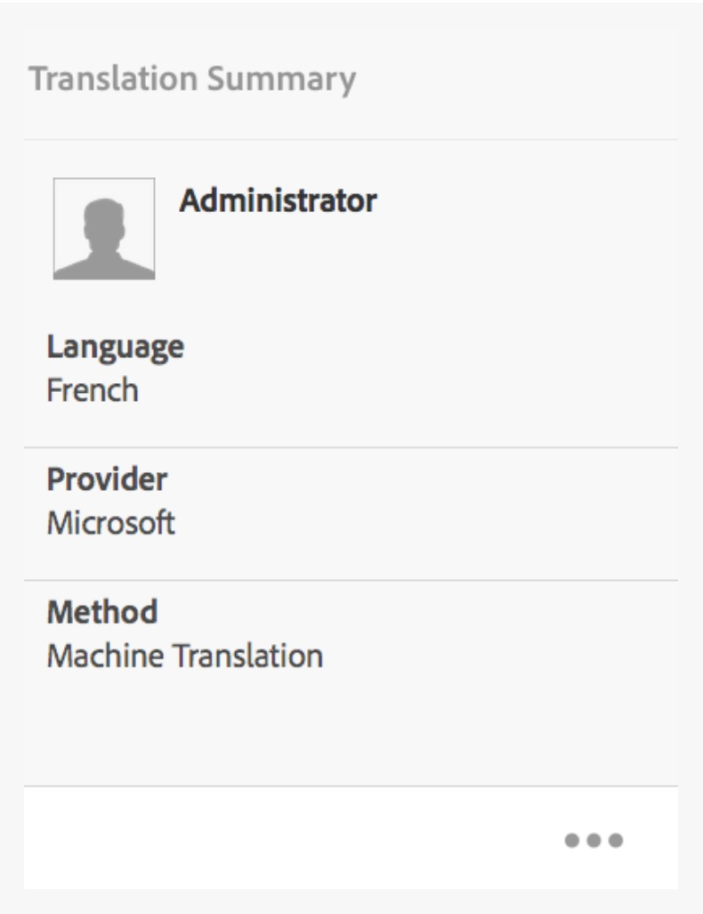
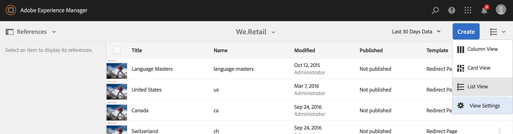

# Mejoras en la traducción{#translation-enhancements}

Esta página presenta mejoras y mejoras incrementales en las capacidades de administración de AEM traducción.

## Traducción Automatización del proyecto {#translation-project-automation}

Se han añadido opciones para mejorar la productividad trabajando con proyectos de traducción, como promocionar y eliminar automáticamente lanzamientos de traducción y programar la ejecución recurrente de un proyecto de traducción.

1. En el proyecto de traducción, toque o haga clic en los puntos suspensivos en la parte inferior del **Resumen de traducción** mosaico.

   

1. Cambie a la **Avanzadas** pestaña . En la parte inferior, puede seleccionar **Promocionar automáticamente los lanzamientos de traducción**.

   

1. De forma opcional, puede seleccionar si, después de recibir el contenido traducido, los lanzamientos de traducción deben promocionarse y eliminarse automáticamente.

   

1. Para seleccionar la ejecución recurrente de un proyecto de traducción, seleccione la frecuencia con la lista desplegable en **Repetir traducción**. La ejecución de proyectos recurrentes creará y ejecutará automáticamente trabajos de traducción en los intervalos especificados.

   

## Proyectos de traducción multilingües {#multilingual-translation-projects}

Es posible configurar varios idiomas de destino en un proyecto de traducción para reducir el número total de proyectos de traducción creados.

1. En el proyecto de traducción, toque o haga clic en los puntos de la parte inferior del **Resumen de traducción** mosaico.

   

1. Cambie a la **Avanzadas** pestaña . Puede añadir varios idiomas en **Idioma de Target**.

   

1. Alternativamente, si está iniciando la traducción a través del carril de referencias en Sitios, añada sus idiomas y seleccione **Crear proyecto de traducción en varios idiomas**.

   

1. Los trabajos de traducción se crean en el proyecto para cada idioma de destino. Pueden iniciarse de una en una dentro del proyecto o de una en una ejecutando el proyecto globalmente en Administración de proyectos.

   

## Actualizaciones en la memoria de traducción {#translation-memory-updates}

Las ediciones manuales del contenido traducido se pueden sincronizar de nuevo con el Sistema de Gestión de Traducciones (TMS) para entrenar su memoria de traducción.

1. Desde la consola Sitios, después de actualizar el contenido de texto en una página traducida, seleccione **Actualizar memoria de traducción**.

   

1. Una vista de lista muestra una comparación en paralelo de la fuente y la traducción de cada componente de texto editado. Seleccione qué actualizaciones de traducción deben sincronizarse con la memoria de traducción y seleccione **Actualización de memoria**.

   

AEM actualiza la traducción de las cadenas existentes en la memoria de traducción del sistema de administración de etiquetas configurado.

* La acción actualiza la traducción de cadenas existentes en la memoria de traducción del sistema de administración de etiquetas configurado.
* No crea nuevos trabajos de traducción.
* Envía las traducciones de vuelta al sistema de administración de etiquetas, a través de AEM API de traducción (ver abajo).

Para usar esta función:

* Se debe configurar un sistema de administración de etiquetas para su uso con AEM.
* El conector debe implementar el método [`storeTranslation`](https://developer.adobe.com/experience-manager/reference-materials/cloud-service/javadoc/com/adobe/granite/translation/api/TranslationService.html).
   * El código dentro de este método determina qué sucede con la solicitud de actualización de memoria de traducción.
   * El marco de traducción de AEM envía los pares de valor de cadena (traducción original y actualizada) al sistema de administración de etiquetas mediante esta implementación de método.

Las actualizaciones de la memoria de traducción se pueden interceptar y enviar a un destino personalizado, en los casos en que se utilice una memoria de traducción propia.

## Copias de idioma en varios niveles {#language-copies-on-multiple-levels}

Las raíces de los idiomas ahora se pueden agrupar en nodos, por ejemplo por región, aunque se siguen reconociendo como raíces de las copias de idiomas.

>[!CAUTION]
>
>Solo se permite un nivel. Por ejemplo, lo siguiente no permite que la página &quot;es&quot; se resuelva en una copia de idioma:
>
>* `/content/we-retail/language-masters/en`
>* `/content/we-retail/language-masters/americas/central-america/es`
>
>Esta `es` la copia de idioma no se detectará porque está a 2 niveles (américa/centroamérica) lejos del `en` nodo .

>[!NOTE]
>
>Las raíces de idioma pueden tener cualquier nombre de página, en lugar de solo el código ISO del idioma. AEM siempre comprobará primero la ruta y el nombre, pero si el nombre de la página no identifica ningún idioma, AEM comprobará la propiedad cq:language de la página para la identificación del idioma.

## Informes de estado de traducción {#translation-status-reporting}

Ahora se puede seleccionar una propiedad en la vista de lista Sitios que muestre si una página se ha traducido, si está traducida o si aún no se ha traducido. Para mostrarlo:

1. En Sitios, cambie a **Vista de lista.**

   

1. Toque o haga clic en **Configuración de vista**.

   

1. Marque **Traducido** casilla de verificación en **Traducción** y toque o haga clic **Actualizar**.

   

Ahora puede ver un **Traducido** que muestra el estado de traducción de las páginas.

