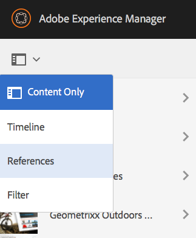
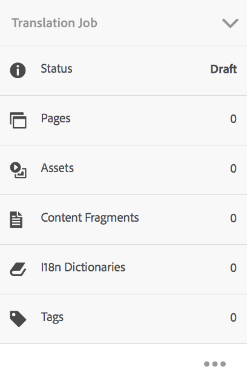
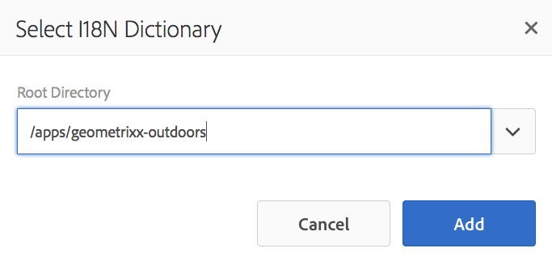
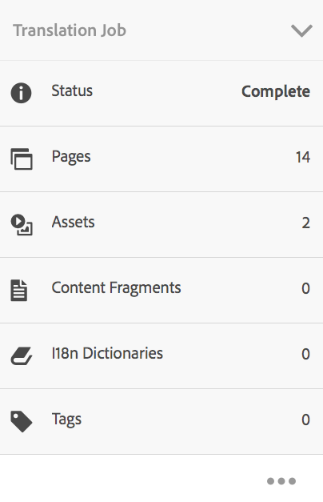

# Administración de proyectos de traducción{#managing-translation-projects}

Después de preparar el contenido para la traducción, debe completar la estructura del idioma creando las copias de idiomas que faltan y crear proyectos de traducción.

Los proyectos de traducción le permiten gestionar la traducción del contenido de AEM. Un proyecto de traducción es un tipo de [proyecto](/help/sites-authoring/projects.md) de AEM que contiene recursos que se van a traducir a otros idiomas. Estos recursos son las páginas y los recursos de las copias [de](/help/sites-administering/tc-prep.md) idioma creadas a partir del maestro de idioma.

Cuando se agregan recursos a un proyecto de traducción, se crea un trabajo de traducción para ellos. Los trabajos proporcionan comandos e información de estado que se utilizan para administrar los flujos de trabajo de traducción humana y traducción automática que se ejecutan en los recursos.

>[!NOTE]
>
>Un proyecto de traducción puede contener varios trabajos de traducción.

Los proyectos de traducción son temas de larga data, definidos por el idioma y el método/proveedor de traducción para adaptarse a la gobernanza organizativa de la globalización. Deben iniciarse una vez, ya sea durante la traducción inicial o manualmente, y mantenerse en vigor durante todas las actividades de actualización de contenido y traducción.

Los proyectos y trabajos de traducción se crean con flujos de trabajo de preparación de traducción. Estos flujos de trabajo tienen tres opciones, tanto para la traducción inicial (Crear y traducir) como para las actualizaciones (Actualizar traducción):

1. [Crear nuevo proyecto](#creating-translation-projects-using-the-references-panel)
1. [Agregar a proyecto existente](#adding-pages-to-a-translation-project)
1. [Sólo estructura de contenido](#creating-the-structure-of-a-language-copy)

>[!NOTE]
>
>La opción 3 no está relacionada con el trabajo o proyecto de traducción. Le permite copiar el contenido y los cambios estructurales en el maestro de idioma en copias (no traducidas) del idioma. Puede usar esto para mantener sincronizados sus maestros de idiomas, incluso sin traducción.

## Realización de traducciones iniciales y actualización de traducciones existentes {#performing-initial-translations-and-updating-existing-translations}

AEM detecta si se está creando un proyecto de traducción para la traducción inicial de contenido o para actualizar las copias de idiomas ya traducidas. Al crear un proyecto de traducción para una página e indicar las copias de idioma para las que está traduciendo, AEM detecta si la página de origen ya existe en las copias de idioma de destino:

* **** La copia de idioma no incluye la página: AEM considera esta situación como la traducción inicial. La página se copia inmediatamente en la copia del idioma y se incluye en el proyecto. Cuando la página traducida se importa a AEM, AEM la copia directamente en la copia del idioma.
* **** La copia de idioma ya incluye la página: AEM considera esta situación como una traducción actualizada. Se crea un lanzamiento y se agrega una copia de la página al lanzamiento, que se incluye en el proyecto. Los inicios le permiten revisar las traducciones actualizadas antes de enviarlas a la copia del idioma:

   * Cuando la página traducida se importa a AEM, se sobrescribe en el lanzamiento.
   * La página traducida sobrescribe la copia del idioma solo cuando se promociona el lanzamiento.

Por ejemplo, la raíz de idioma /content/geometrixx/fr se crea para la traducción al francés del idioma principal /content/geometrixx/en. No hay otras páginas en la copia en francés.

* Se crea un proyecto de traducción para la página /content/geometrixx/en/products y todas las páginas secundarias, con el objetivo de la copia en francés. Dado que la copia de idioma no incluye la página /content/geometrixx/fr/products, AEM copia inmediatamente la página /content/geometrixx/en/products y todas las páginas secundarias a la copia en francés. Las copias también se incluyen en el proyecto de traducción.
* Se crea un proyecto de traducción para la página /content/geometrixx/en y todas las páginas secundarias, con el objetivo de la copia en francés. Dado que la copia de idioma incluye la página que corresponde a la página /content/geometrixx/en (la raíz del idioma), AEM copia la página /content/geometrixx/en y todas las páginas secundarias y las agrega a un lanzamiento. Las copias también se incluyen en el proyecto de traducción.

## Creación de proyectos de traducción mediante el panel Referencias {#creating-translation-projects-using-the-references-panel}

Cree proyectos de traducción para poder ejecutar y administrar el flujo de trabajo de traducción de los recursos del maestro de idioma. Al crear proyectos, debe especificar la página en el idioma principal que está traduciendo y las copias de idioma para las que está realizando la traducción:

* La configuración de nube del marco de integración de traducción que está asociado con la página seleccionada determina muchas propiedades de los proyectos de traducción, como el flujo de trabajo de traducción que se va a utilizar.
* Se crea un proyecto para cada copia de idioma seleccionada.
* Se crea una copia de la página seleccionada y los recursos asociados, que se agregan a cada proyecto. Estas copias se envían posteriormente al proveedor de traducción para su traducción.

Puede especificar que también se seleccionen las páginas secundarias de la página seleccionada. En este caso, también se agregan copias de las páginas secundarias a cada proyecto para que se traduzcan. Cuando las páginas secundarias están asociadas con diferentes configuraciones del marco de integración de traducción, AEM crea proyectos adicionales.

También puede crear [manualmente proyectos](#creating-a-translation-project-using-the-projects-console)de traducción.

**Traducciones iniciales y actualización de traducciones**

El panel Referencias indica si está actualizando las copias de idioma existentes o creando la primera versión de las copias de idioma. Cuando existe una copia de idioma para la página seleccionada, aparece la ficha Actualizar copias de idioma para proporcionar acceso a los comandos relacionados con el proyecto.

Después de traducir, puede [revisar la traducción](#reviewing-and-promoting-updated-content) antes de sobrescribir la copia del idioma con ella. Cuando no existe ninguna copia de idioma para la página seleccionada, aparece la ficha Crear y traducir para proporcionar acceso a los comandos relacionados con el proyecto.

### Creación de proyectos de traducción para una nueva copia de idioma {#create-translation-projects-for-a-new-language-copy}

1. Utilice la consola Sitios para seleccionar la página que está agregando a los proyectos de traducción.

   Por ejemplo, para traducir las páginas en inglés del sitio de demostración de Geometrixx, seleccione Sitio de demostración de Geometrixx > Inglés.

1. En la barra de herramientas, toque o haga clic en Referencias.

   

1. Seleccione Copias de idioma y, a continuación, seleccione las copias de idioma para las que está traduciendo las páginas de origen.
1. Toque o haga clic en Crear y traducir y luego configure el trabajo de traducción:

   * Utilice la lista desplegable Idiomas para seleccionar una copia de idioma para la que desee traducir. Seleccione idiomas adicionales según sea necesario. Los idiomas que aparecen en la lista corresponden a las raíces de [idioma que ha creado](/help/sites-administering/tc-prep.md#creating-a-language-root).
   * Para traducir la página seleccionada y todas las páginas secundarias, seleccione Seleccionar todas las subpáginas. Para traducir solo la página seleccionada, desactive la opción.
   * En Proyecto, seleccione Crear nuevo proyecto de traducción.
   * Escriba un nombre para el proyecto.
   

1. Haga clic o pulse Crear.

### Crear proyectos de traducción para una copia de idioma existente {#create-translation-projects-for-an-existing-language-copy}

1. Utilice la consola Sitios para seleccionar la página que está agregando a los proyectos de traducción.

   Por ejemplo, para traducir las páginas en inglés del sitio de demostración de Geometrixx, seleccione Sitio de demostración de Geometrixx > Inglés.

1. En la barra de herramientas, toque o haga clic en Referencias.

   

1. Seleccione Copias de idioma y, a continuación, seleccione las copias de idioma para las que está traduciendo las páginas de origen.
1. Toque o haga clic en Actualizar copias de idioma y luego configure el trabajo de traducción:

   * Para traducir la página seleccionada y todas las páginas secundarias, seleccione Seleccionar todas las subpáginas. Para traducir solo la página seleccionada, desactive la opción.
   * En Proyecto, seleccione Crear nuevo proyecto de traducción.
   * Escriba un nombre para el proyecto.
   

1. Toque o haga clic en Inicio.

## Adición de páginas a un proyecto de traducción {#adding-pages-to-a-translation-project}

Después de crear un proyecto de traducción, puede utilizar el panel Recursos para agregar páginas al proyecto. La adición de páginas resulta útil cuando se incluyen páginas de diferentes ramas en el mismo proyecto.

Cuando agrega páginas a un proyecto de traducción, las páginas se incluyen en un nuevo trabajo de traducción. También puede [agregar páginas a un trabajo](#adding-pages-assets-to-a-translation-job)existente.

Al igual que al crear un nuevo proyecto, al agregar páginas, se agregan copias de las páginas a un lanzamiento cuando es necesario para evitar sobrescribir las copias de idioma existentes. (Consulte [Creación de proyectos de traducción para copias](#performing-initial-translations-and-updating-existing-translations)de idioma existentes).

1. Utilice la consola Sitios para seleccionar la página que está agregando al proyecto de traducción.

   Por ejemplo, para traducir las páginas en inglés del sitio de demostración de Geometrixx, seleccione Sitio de demostración de Geometrixx > Inglés.

1. En la barra de herramientas, toque o haga clic en Referencias.

   

1. Seleccione Copias de idioma y, a continuación, seleccione las copias de idioma para las que está traduciendo las páginas de origen.

   

1. Toque o haga clic en Actualizar copias de idioma y luego configure las propiedades:

   * Para traducir la página seleccionada y todas las páginas secundarias, seleccione Seleccionar todas las subpáginas. Para traducir solo la página seleccionada, desactive la opción.
   * En Proyecto, seleccione Agregar a proyecto de traducción existente.
   * Seleccione el proyecto.
   >[!NOTE]
   >
   >El idioma de destino establecido en el proyecto de traducción debe coincidir con la ruta de la copia de idioma, como se muestra en el panel Referencias.

   

1. Toque o haga clic en Inicio.

## Adición de páginas/recursos a un trabajo de traducción {#adding-pages-assets-to-a-translation-job}

Puede agregar páginas, recursos, etiquetas o diccionarios i18n al trabajo de traducción del proyecto de traducción. Para agregar páginas o recursos:

1. En la parte inferior del mosaico Trabajo de traducción del proyecto de traducción, toque o haga clic en los puntos suspensivos.

   

1. Toque o haga clic en Agregar y Páginas/Recursos.

   

1. Seleccione el elemento superior de la rama que desee agregar y, a continuación, toque o haga clic en el icono de marca de verificación. Puede realizar varias selecciones.

   

1. También puede seleccionar el icono de búsqueda para buscar fácilmente las páginas o los recursos que desee agregar al trabajo de traducción.

   

Sus páginas y/o recursos se agregan a su trabajo de traducción.

## Adición de diccionarios i18n a un trabajo de traducción {#adding-i-n-dictionaries-to-a-translation-job}

Puede agregar páginas, recursos, etiquetas o diccionarios i18n al trabajo de traducción del proyecto de traducción. Para agregar un diccionario i18n:

1. En la parte inferior del mosaico Trabajo de traducción del proyecto de traducción, toque o haga clic en los puntos suspensivos.

   

1. Toque o haga clic en Agregar y en el diccionario I18N.

   

1. Seleccione el diccionario que desee agregar y, a continuación, toque o haga clic en el botón Agregar.

   

Tu diccionario está ahora en tu trabajo de traducción.

>[!NOTE]
>
>Para obtener más información sobre los diccionarios i18n, consulte [Uso de traductores para administrar diccionarios](/help/sites-developing/i18n-translator.md).

## Adición de etiquetas a un trabajo de traducción {#adding-tags-to-a-translation-job}

Puede agregar páginas, recursos, etiquetas o diccionarios i18n al trabajo de traducción del proyecto de traducción. Para agregar etiquetas:

1. En la parte inferior del mosaico Trabajo de traducción del proyecto de traducción, toque o haga clic en los puntos suspensivos.

   

1. Toque o haga clic en Agregar y luego en Etiquetas.

   

1. Seleccione las etiquetas que desee agregar y, a continuación, toque o haga clic en el icono de marca de verificación. Puede realizar varias selecciones.

   

Sus etiquetas se han agregado al trabajo de traducción.

## Ver detalles del proyecto de traducción {#seeing-translation-project-details}

El mosaico Resumen de traducción contiene las propiedades configuradas para un proyecto de traducción. Además de la información [genérica del](/help/sites-authoring/projects.md#project-info)proyecto, la ficha Traducción contiene propiedades específicas de la traducción:

* Idioma de origen: Idioma de las páginas que se están traduciendo.
* Idioma de destino: Idioma en el que se traducen las páginas.
* Método de traducción: Flujo de trabajo de traducción. Se admite la traducción humana o la traducción automática.
* Proveedor de traducción: El proveedor de servicios de traducción que realiza la traducción.
* Categoría de contenido: (Traducción automática) La categoría de contenido que se utiliza para la traducción.
* Configuración de nube: Configuración de nube para el conector del servicio de traducción que se utiliza para el proyecto.

Cuando se crea un proyecto mediante el panel Recursos de una página, estas propiedades se configuran automáticamente en función de las propiedades de la página de origen.

## Control del estado de un trabajo de traducción {#monitoring-the-status-of-a-translation-job}

El mosaico Trabajo de traducción de un proyecto de traducción proporciona el estado de un trabajo de traducción, así como el número de páginas y recursos del trabajo.

En la tabla siguiente se describe cada estado que puede tener un trabajo o un elemento del trabajo:

| Estado | Descripción |
|---|---|
| Borrador | El trabajo de traducción no se ha iniciado. Los trabajos de traducción están en estado DRAFT al crearlos. |
| Enviado | Los archivos del trabajo de traducción tienen este estado cuando se han enviado correctamente al servicio de traducción. Este estado puede producirse después de que se emita el comando Solicitar ámbito o el comando Iniciar. |
| Previsión solicitada | Para el flujo de trabajo Traducción humana, los archivos del trabajo se han enviado al proveedor de traducción para que los cree. Este estado aparece después de emitir el comando Solicitar ámbito. |
| Previsión finalizada | El proveedor ha definido el trabajo de traducción. |
| Comprometido para traducción | El propietario del proyecto ha aceptado el alcance. Este estado indica que el proveedor de traducción debe empezar a traducir los archivos del trabajo. |
| Traducción en curso | Para un trabajo, la traducción de uno o más archivos del trabajo aún no se ha completado. Para un elemento del trabajo, el elemento se está traduciendo. |
| Traducido | Para un trabajo, se ha completado la traducción de todos los archivos del trabajo. Para un elemento del trabajo, el elemento se traduce. |
| Listo para revisión | El elemento del trabajo se traduce y el archivo se ha importado a AEM. |
| Completar | El propietario del proyecto ha indicado que el contrato de traducción está terminado. |
| Cancelar | Indica que el proveedor de traducción debe dejar de trabajar en un trabajo de traducción. |
| Actualización de error | Error al transferir archivos entre AEM y el servicio de traducción. |
| Estado desconocido | Se ha producido un error desconocido. |

Para ver el estado de cada archivo en el trabajo, toque o haga clic en las elipsis de la parte inferior del mosaico.

## Configuración de la fecha de vencimiento de los trabajos de traducción {#setting-the-due-date-of-translation-jobs}

Especifique la fecha antes de la cual el proveedor de traducción debe devolver los archivos traducidos. Puede definir la fecha de vencimiento del proyecto o de un trabajo específico:

* **** Proyecto: Los trabajos de traducción del proyecto heredan la fecha de vencimiento.
* **** Trabajo: La fecha de vencimiento establecida para el trabajo anula la fecha de vencimiento establecida para el proyecto.

La configuración de la fecha de vencimiento funciona correctamente sólo cuando el proveedor de traducción que está utilizando admite esta función.

El procedimiento siguiente establece la fecha de vencimiento de un proyecto.

1. Toque o haga clic en los puntos suspensivos en la parte inferior del mosaico Resumen de traducción.

   

1. En la ficha Básico, utilice el selector de fechas de la propiedad Fecha de vencimiento para seleccionar la fecha de vencimiento.

   

1. Toque o haga clic en Finalizado.

El siguiente procedimiento establece la fecha de vencimiento de un trabajo de traducción.

1. En el mosaico Trabajo de traducción, toque o haga clic en el menú de comandos y, a continuación, toque o haga clic en Fecha de vencimiento.

   

1. En el cuadro de diálogo, toque o haga clic en el icono de calendario y, a continuación, seleccione la fecha y hora que desee utilizar como fecha de vencimiento y, a continuación, haga clic en Guardar.

   

## Creación de ámbitos para un trabajo de traducción {#scoping-a-translation-job}

Alcance un trabajo de traducción para obtener una estimación del costo de traducción de su proveedor de servicios de traducción. Al definir el ámbito de un trabajo, los archivos de origen se envían al proveedor de traducción, que compara el texto con su grupo de traducciones almacenadas (memoria de traducción). Normalmente, el ámbito es el número de palabras que requieren traducción.

Para obtener más información acerca de los resultados de creación de ámbitos, póngase en contacto con el proveedor de traducción.

>[!NOTE]
>
>La creación de ámbitos es opcional. Puede iniciar un trabajo de traducción sin creación de ámbitos.

Al definir el ámbito de un trabajo de traducción, el estado del trabajo es `Scope Requested`. Cuando el proveedor de traducción devuelve el ámbito, el estado cambia a `Scope Completed`. Cuando se complete el ámbito, puede utilizar el comando Mostrar ámbito para revisar los resultados del ámbito.

La creación de ámbitos funciona correctamente solo cuando el proveedor de traducción que está utilizando admite esta función.

1. En la consola Proyectos, abra el proyecto de traducción.
1. En el mosaico Trabajo de traducción, toque o haga clic en el menú de comandos y, a continuación, toque o haga clic en Solicitar ámbito.

   

1. Cuando el estado del trabajo cambie a SCOPE_COMPLETED, en el mosaico Trabajo de traducción, toque o haga clic en el menú de comandos y, a continuación, toque o haga clic en Mostrar ámbito.

## Inicio de un trabajo de traducción {#starting-a-translation-job}

Inicie un trabajo de traducción para traducir las páginas de origen al idioma de destino. La traducción se realiza según los valores de propiedad del mosaico Resumen de traducción.

Después de iniciar el trabajo de traducción, el mosaico Trabajo de traducción muestra el estado Traducción en curso.

1. En la consola Proyectos, abra el proyecto de traducción.
1. En el mosaico Trabajo de traducción, toque o haga clic en el menú de comandos y, a continuación, toque o haga clic en Inicio.

   

1. En el cuadro de diálogo Acción que confirma el inicio de la traducción, toque o haga clic en Cerrar.

## Cancelación de un trabajo de traducción {#canceling-a-translation-job}

Cancele un trabajo de traducción para detener el proceso de traducción e impedir que el proveedor de traducción realice más traducciones. Puede cancelar un trabajo cuando éste tenga el estado `Committed For Translation` o `Translation In Progress` .

1. En la consola Proyectos, abra el proyecto de traducción.
1. En el mosaico Trabajo de traducción, toque o haga clic en el menú de comandos y, a continuación, toque o haga clic en Cancelar.
1. En el cuadro de diálogo Acción que confirma la cancelación de la traducción, toque o haga clic en Aceptar.

## Aceptar/Rechazar flujo de trabajo {#accept-reject-workflow}

Cuando el contenido regresa después de la traducción y está en estado Listo para revisión, puede ir al trabajo de traducción y aceptar/rechazar contenido.

Si selecciona Rechazar traducción, tiene la opción de agregar un comentario.

Rechazar contenido lo envía de vuelta al proveedor de traducción donde podrá ver el comentario.

## Revisión y promoción de contenido actualizado {#reviewing-and-promoting-updated-content}

Cuando el contenido se traduce para una copia del idioma existente, revise las traducciones, realice cambios si es necesario y luego promocione las traducciones para moverlo a la copia del idioma. Puede revisar los archivos traducidos cuando el trabajo de traducción muestre el estado Listo para revisión.

1. Seleccione la página en el idioma principal, toque o haga clic en Referencias y, a continuación, toque o haga clic en Copias de idioma.
1. Toque o haga clic en la copia de idioma para revisarla.

   

1. Toque o haga clic en Iniciar para mostrar los comandos relacionados con el inicio.

   

1. Para abrir la copia de inicio de la página y editar el contenido, haga clic en Abrir página.
1. Después de revisar el contenido y realizar los cambios necesarios, para promocionar la copia de lanzamiento, haga clic en Promocionar.
1. En la página Promocionar lanzamiento, especifique las páginas que desea promocionar y, a continuación, toque o haga clic en Promocionar.

## Comparación de copias de idioma {#comparing-language-copies}

Para comparar las copias de idioma con el idioma principal:

1. En la consola **Sitios** , navegue a la copia de idioma que desee comparar.
1. Abra el panel **[Referencias](/help/sites-authoring/basic-handling.md#references)**.
1. En el encabezado **Copias** , seleccione Copias **de idioma.**
1. Seleccione la copia de idioma específica y, a continuación, puede hacer clic en **Comparar con el maestro **o **Comparar con el anterior **si corresponde.

   

1. Las dos páginas (lanzamiento y origen) se abrirán en paralelo.

   Para obtener información completa sobre el uso de esta característica, consulte la [diferencia de la página](/help/sites-authoring/page-diff.md).

## Finalización y archivado de trabajos de traducción {#completing-and-archiving-translation-jobs}

Complete un trabajo de traducción después de haber revisado los archivos traducidos del proveedor. Para los flujos de trabajo de traducción humana, completar una traducción indica al proveedor que el contrato de traducción se ha cumplido y que debe guardar la traducción en su memoria de traducción.

Una vez completado el trabajo, éste tiene el estado Completado.

Archive un trabajo de traducción una vez que se haya completado y ya no necesita ver los detalles del estado del trabajo. Al archivar el trabajo, el mosaico Trabajo de traducción se elimina del proyecto.

## Creación de la estructura de una copia de idioma {#creating-the-structure-of-a-language-copy}

Rellene la copia de idioma para que contenga contenido del idioma principal que está traduciendo. Antes de completar la copia de idioma, debe haber [creado la raíz](/help/sites-administering/tc-prep.md#creating-a-language-root) de idioma de la copia de idioma.

1. Utilice la consola Sitios para seleccionar la raíz de idioma del idioma principal que está utilizando como origen. Por ejemplo, para traducir las páginas en inglés del sitio de demostración de Geometrixx, seleccione Contenido > Sitio de demostración de Geometrixx > Inglés.
1. En la barra de herramientas, toque o haga clic en Referencias.

   

1. Seleccione Copias de idioma y, a continuación, seleccione las copias de idioma que desee rellenar.

   

1. Toque o haga clic en Actualizar copias de idioma para mostrar las herramientas de traducción y configurar las propiedades:

   * Seleccione la opción Seleccionar todas las subpáginas.
   * En Proyecto, seleccione Crear estructura solamente.
   

1. Toque o haga clic en Inicio.

## Creación de un proyecto de traducción mediante la consola Proyectos {#creating-a-translation-project-using-the-projects-console}

Puede crear manualmente un proyecto de traducción si prefiere utilizar la consola Proyectos.

Al crear manualmente un proyecto de traducción, debe proporcionar valores para las siguientes propiedades relacionadas con la traducción, además de las propiedades básicas:

* **** Nombre: Nombre del proyecto.
* **** Idioma de origen: Idioma del contenido de origen.
* **** Idioma de destino: Idioma en el que se traduce el contenido.
* **** Método de traducción: Seleccione Traducción humana para indicar que la traducción se realizará manualmente.

1. En la barra de herramientas de la consola Proyectos, toque o haga clic en Crear.
1. Seleccione la plantilla Proyecto de traducción y, a continuación, toque o haga clic en Siguiente.
1. Introduzca valores para las propiedades básicas.
1. Toque o haga clic en Avanzadas y proporcione valores para las propiedades relacionadas con la traducción.
1. Haga clic o pulse Crear. En el cuadro de confirmación, toque o haga clic en Listo para volver a la consola Proyectos o haga clic en Abrir proyecto para abrir y comenzar a administrar el proyecto.

## Exportación de un trabajo de traducción {#exporting-a-translation-job}

Puede descargar el contenido de un trabajo de traducción, por ejemplo, para enviarlo a un proveedor de traducción que no esté integrado con AEM mediante un conector o para revisar el contenido.

1. En el menú desplegable del mosaico Trabajo de traducción, toque o haga clic en Exportar.
1. En el cuadro de diálogo Exportar, toque o haga clic en Descargar archivo exportado y, si es necesario, utilice el cuadro de diálogo del explorador Web para guardar el archivo.
1. En el cuadro de diálogo Exportar, toque o haga clic en Cerrar.

## Importación de un trabajo de traducción {#importing-a-translation-job}

Puede importar contenido traducido a AEM, por ejemplo, cuando el proveedor de traducción se lo envíe porque no está integrado con AEM mediante un conector.

1. En el menú desplegable del mosaico Trabajo de traducción, toque o haga clic en Importar.
1. Utilice el cuadro de diálogo del explorador Web para seleccionar el archivo que desea importar.
1. En el cuadro de diálogo Importar, toque o haga clic en Cerrar.

